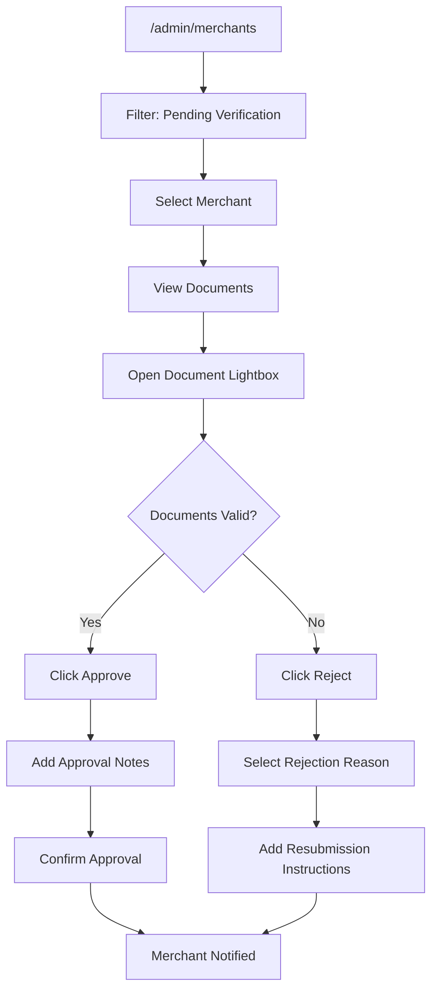
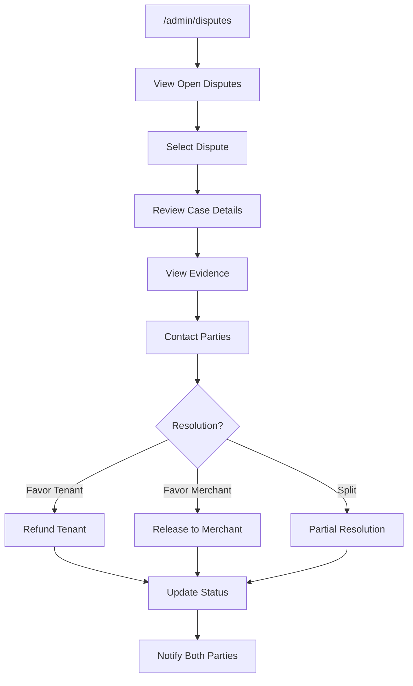
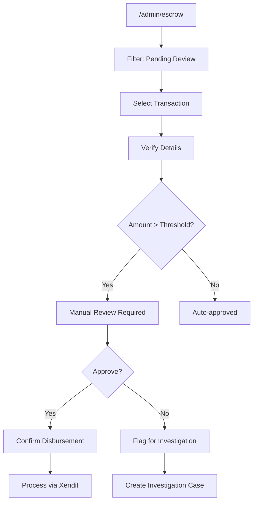
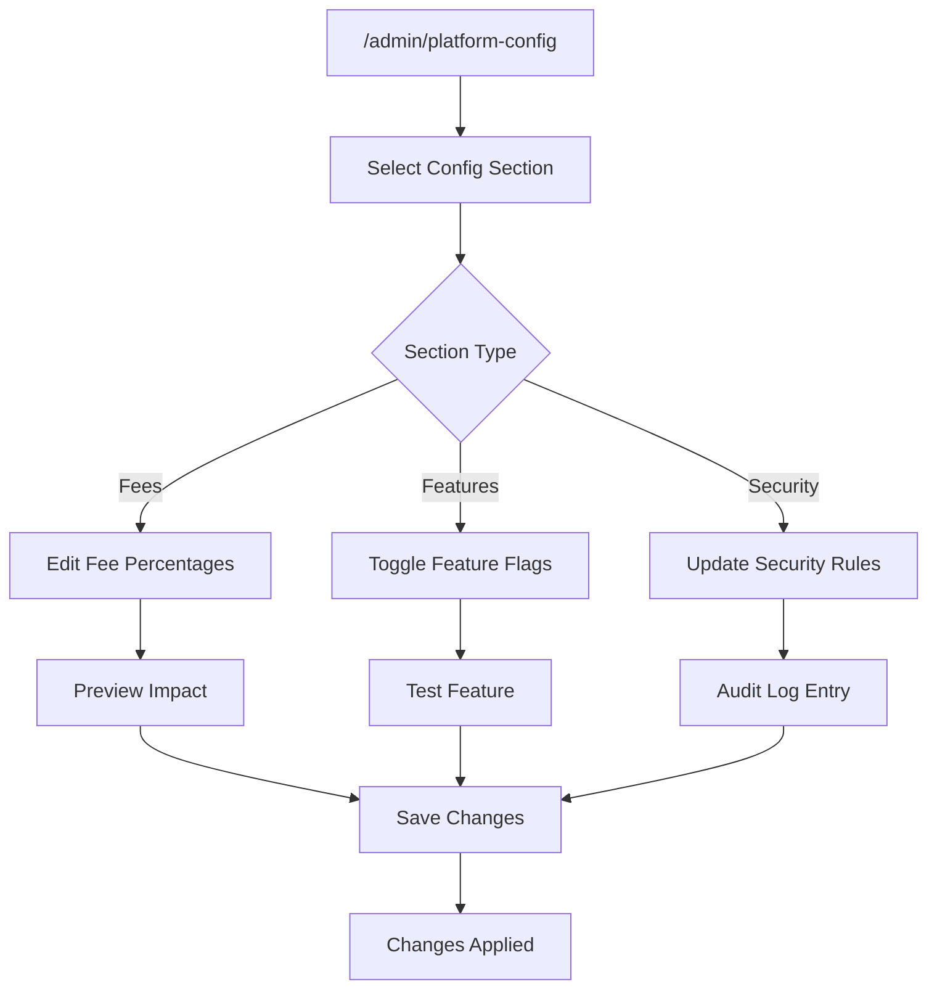
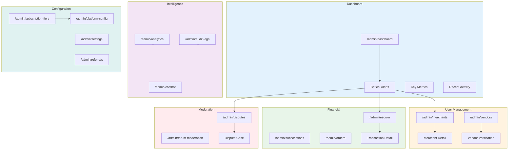
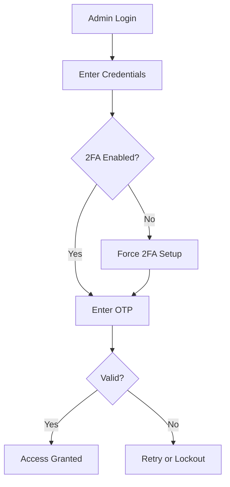

# UI/UX Flow Feedback: Admin Module

## 📋 Overview

Modul admin menangani pengelolaan platform secara keseluruhan termasuk verifikasi merchant/vendor, manajemen subscription, escrow oversight, dispute resolution, dan platform configuration.

---

## 🗺️ User Journey Map

```
┌─────────────────────────────────────────────────────────────────────────────┐
│                            ADMIN USER JOURNEY                                │
├─────────────────────────────────────────────────────────────────────────────┤
│                                                                              │
│  [Dashboard] ◄──────────────────────────────────────────────────────────┐   │
│      │                                                                   │   │
│      ├──► [Merchants] ──► [Review Application] ──► [Approve/Reject]    │   │
│      │                                                                   │   │
│      ├──► [Vendors] ──► [Review Verification] ──► [Approve/Reject]     │   │
│      │                                                                   │   │
│      ├──► [Subscriptions] ──► [View Plans] ──► [Manage Billing]        │   │
│      │                                                                   │   │
│      ├──► [Escrow] ──► [Monitor Transactions] ──► [Approve Disbursement]│   │
│      │                                                                   │   │
│      ├──► [Disputes] ──► [Review Case] ──► [Resolve]                   │   │
│      │                                                                   │   │
│      ├──► [Orders] ──► [Monitor] ──► [Intervene if Needed]             │   │
│      │                                                                   │   │
│      ├──► [Forum] ──► [Moderate Content] ──► [Take Action]             │   │
│      │                                                                   │   │
│      ├──► [Analytics] ──► [Platform Metrics] ──► [Export Reports]      │   │
│      │                                                                   │   │
│      ├──► [Audit Logs] ──► [Search Actions] ──► [Export]               │   │
│      │                                                                   │   │
│      ├──► [Chatbot] ──► [Manage Knowledge] ──► [View Analytics]        │   │
│      │                                                                   │   │
│      ├──► [Referrals] ──► [View Program] ──► [Manage Rewards]          │   │
│      │                                                                   │   │
│      ├──► [Subscription Tiers] ──► [Configure Plans] ──► [Set Limits]  │   │
│      │                                                                   │   │
│      └──► [Platform Config] ──► [Fees] ──► [Features] ──► [Security]   │   │
│                                                                              │
└─────────────────────────────────────────────────────────────────────────────┘
```

---

## 🔄 Navigation Flow Analysis

### Sidebar Navigation Structure
```
├── Dashboard
├── User Management
│   ├── Merchants
│   └── Vendors
├── Financial
│   ├── Subscriptions
│   ├── Escrow
│   └── Orders
├── Moderation
│   ├── Disputes
│   └── Forum Moderation
├── Intelligence
│   ├── Analytics
│   ├── Audit Logs
│   └── Chatbot
├── Growth
│   └── Referrals
├── Configuration
│   ├── Subscription Tiers
│   ├── Platform Config
│   └── Settings
```

### Navigation Issues
| Issue | Impact | Recommendation |
|-------|--------|----------------|
| Too many top-level items | Overwhelming | Group into collapsible sections |
| Critical alerts not prominent | Missed issues | Add notification badges |
| No quick filters | Slower workflow | Add saved filter presets |

---

## 🎯 Critical User Flows

### 1. Merchant Verification Flow


### 2. Dispute Resolution Flow


### 3. Escrow Disbursement Approval Flow


### 4. Platform Configuration Flow


---

## ⚠️ Issues & Recommendations

### High Severity

| ID | Issue | Current State | Impact | Recommendation |
|----|-------|---------------|--------|----------------|
| ADM-H01 | No document side-by-side comparison | View one at a time | Slower review | Add split-view document viewer |
| ADM-H02 | No undo for bulk actions | Permanent immediately | Risky operations | Add confirmation + undo window |
| ADM-H03 | Dispute evidence hard to navigate | Flat list | Miss important docs | Add categorized evidence viewer |

### Medium Severity

| ID | Issue | Current State | Impact | Recommendation |
|----|-------|---------------|--------|----------------|
| ADM-M01 | Dashboard has too many metrics | Information overload | Key issues buried | Add customizable widget layout |
| ADM-M02 | Audit log search limited | Basic text search | Hard to find specific | Add advanced filters + date range |
| ADM-M03 | No real-time alerts | Manual refresh | Delayed response | Add real-time notification feed |

### Low Severity

| ID | Issue | Current State | Impact | Recommendation |
|----|-------|---------------|--------|----------------|
| ADM-L01 | Analytics not customizable | Fixed charts | Less useful | Add report builder |
| ADM-L02 | Keyboard shortcuts missing | Mouse-only | Slower workflow | Add shortcuts for common actions |

---

## 📱 Mobile UX Assessment

### Admin on Mobile
| Aspect | Score | Notes |
|--------|-------|-------|
| Usability | 4/10 | Desktop-focused design |
| Data Tables | 3/10 | Not mobile-friendly |
| Document Review | 5/10 | Pinch-zoom works |
| Quick Actions | 4/10 | Hidden in menus |

### Recommendations
- [ ] Consider admin as desktop-only or
- [ ] Create mobile-specific admin views for critical tasks
- [ ] Add mobile-friendly quick actions (approve/reject)
- [ ] Implement swipe gestures for list actions

---

## ♿ Accessibility Assessment

| Criteria | Status | Notes |
|----------|--------|-------|
| ARIA Labels | ⚠️ Partial | Data grids need headers |
| Keyboard Navigation | ⚠️ Partial | Complex tables hard to navigate |
| Color Contrast | ✅ Good | Meets standards |
| Screen Reader | ⚠️ Partial | Charts not accessible |
| Focus Management | ⚠️ Partial | Modal focus incomplete |

### Recommendations
- [ ] Add data table accessibility headers
- [ ] Implement chart descriptions
- [ ] Add keyboard shortcuts with visual hints
- [ ] Complete modal focus trapping

---

## ⚡ Performance UX

### Loading States
| Page | Current State | Recommendation |
|------|---------------|----------------|
| Dashboard | Multiple spinners | Unified skeleton |
| Merchants List | Spinner | Server-side pagination |
| Audit Logs | Spinner | Virtual scrolling |
| Analytics | Chart spinners | Progressive loading |

### Data Handling
| Feature | Current | Issue | Recommendation |
|---------|---------|-------|----------------|
| Merchant List | Client filter | Slow on large data | Server-side filtering |
| Audit Logs | Full load | Performance hit | Implement pagination |
| Analytics | Fresh load | Redundant calls | Cache with invalidation |

### Bulk Operations
| Operation | Current | Recommendation |
|-----------|---------|----------------|
| Bulk Approve | Sync, blocks UI | Async with progress bar |
| Bulk Export | Sync, timeout risk | Background job + notification |

---

## 📊 Flow Diagram



---

## 🔔 Admin Alert System

### Alert Priority Levels
| Level | Color | Examples |
|-------|-------|----------|
| Critical | Red | Failed disbursements, Security breach |
| High | Orange | Pending verifications > 24h, Escalated disputes |
| Medium | Yellow | New applications, Subscription issues |
| Info | Blue | Daily summaries, System updates |

### Missing Alert Triggers
- [ ] Pending verification approaching SLA
- [ ] Large transaction threshold breach
- [ ] Multiple failed payments from same merchant
- [ ] Unusual activity patterns

---

## 🔐 Security Considerations

### 2FA Flow


### Audit Trail Coverage
| Action | Logged | Details Captured |
|--------|--------|------------------|
| Login/Logout | ✅ | IP, User Agent |
| Verification Decision | ✅ | Decision, Reason, Notes |
| Config Changes | ✅ | Old/New Values |
| Disbursement Approval | ✅ | Amount, Recipient |
| User Impersonation | ❌ | Need to add |

---

## ✅ Summary Checklist

| Category | Critical | High | Medium | Low | Total |
|----------|----------|------|--------|-----|-------|
| Issues Found | 0 | 3 | 3 | 2 | 8 |
| Fixed | 0 | 0 | 0 | 0 | 0 |
| In Progress | 0 | 0 | 0 | 0 | 0 |
| Pending | 0 | 3 | 3 | 2 | 8 |

---

## 📝 Action Items

1. [ ] **ADM-H01**: Implement side-by-side document viewer
2. [ ] **ADM-H02**: Add bulk action undo capability
3. [ ] **ADM-H03**: Create categorized evidence viewer
4. [ ] **ADM-M01**: Add customizable dashboard widgets
5. [ ] **ADM-M02**: Implement advanced audit log search
6. [ ] **ADM-M03**: Add real-time notification feed
7. [ ] **ADM-L01**: Build custom report builder
8. [ ] **ADM-L02**: Add keyboard shortcuts

---

*Last Updated: 2025-01-26*
*Reviewed By: System*
