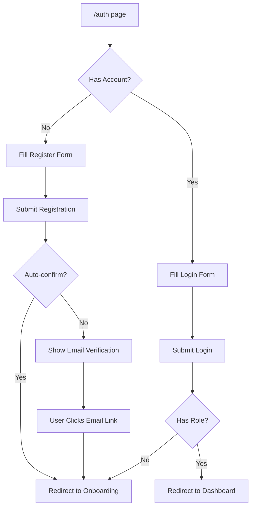
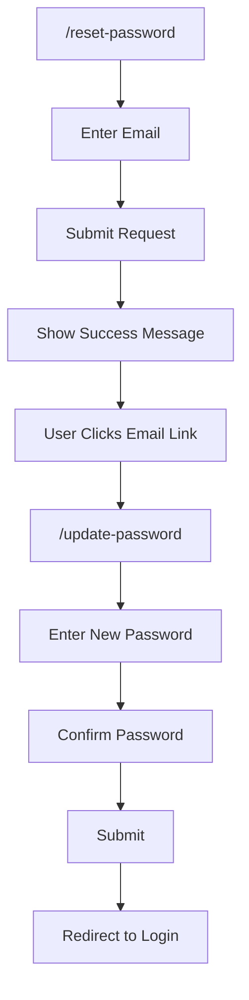
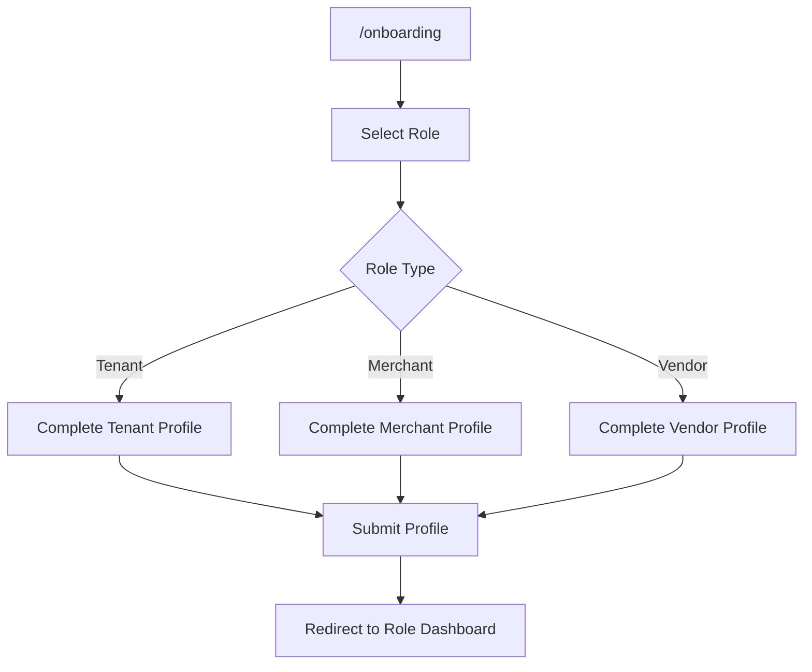
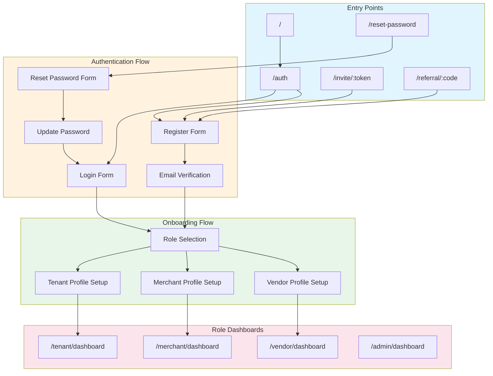

# UI/UX Flow Feedback: Auth Module

## 📋 Overview

Modul autentikasi menangani seluruh flow registrasi, login, password reset, onboarding, dan role-based routing.

---

## 🗺️ User Journey Map

```
┌─────────────────────────────────────────────────────────────────────────────┐
│                           AUTH USER JOURNEY                                  │
├─────────────────────────────────────────────────────────────────────────────┤
│                                                                              │
│  [Landing Page] ──► [Login/Register] ──► [Email Verification]               │
│        │                   │                      │                          │
│        │                   ▼                      ▼                          │
│        │           [Role Selection] ◄──── [Verified User]                   │
│        │                   │                                                 │
│        │                   ▼                                                 │
│        │           [Onboarding Flow]                                         │
│        │                   │                                                 │
│        │                   ▼                                                 │
│        │           [Role Dashboard]                                          │
│        │                                                                     │
│        └──────► [Password Reset] ──► [Update Password] ──► [Login]          │
│                                                                              │
│        └──────► [Referral Invite] ──► [Register with Bonus]                 │
│                                                                              │
└─────────────────────────────────────────────────────────────────────────────┘
```

---

## 🔄 Navigation Flow Analysis

### Entry Points
| Entry Point | Target | Status |
|-------------|--------|--------|
| `/` | Landing/Index | ✅ Implemented |
| `/auth` | Login/Register | ✅ Implemented |
| `/reset-password` | Request Reset | ✅ Implemented |
| `/update-password` | Set New Password | ✅ Implemented |
| `/onboarding` | Role Setup | ✅ Implemented |
| `/invite/:token` | Tenant Invitation | ✅ Implemented |
| `/referral/:code` | Referral Registration | ✅ Implemented |

### Protected Route Flow
```
[Any Protected Route] 
    │
    ▼
[Check Session] ──No──► [Redirect to /auth]
    │
    Yes
    ▼
[Check Role] ──No Role──► [Redirect to /onboarding]
    │
    Has Role
    ▼
[Check Permission] ──Denied──► [Redirect to /unauthorized]
    │
    Allowed
    ▼
[Render Page]
```

---

## 🎯 Critical User Flows

### 1. Registration Flow


### 2. Password Reset Flow


### 3. Onboarding Flow


---

## ⚠️ Issues & Recommendations

### High Severity

| ID | Issue | Current State | Impact | Recommendation |
|----|-------|---------------|--------|----------------|
| AUTH-H01 | Role tidak bisa diubah setelah onboarding | User terkunci di satu role | User harus buat akun baru | Tambah flow "Request Role Change" dengan admin approval |
| AUTH-H02 | No session timeout warning | Session expired tanpa notice | Data loss saat submit | Tambah countdown warning 5 menit sebelum expiry |

### Medium Severity

| ID | Issue | Current State | Impact | Recommendation |
|----|-------|---------------|--------|----------------|
| AUTH-M01 | Password strength indicator terlalu basic | Hanya show bar color | User tidak tahu requirement | Tambah checklist requirement (min 8 char, number, symbol) |
| AUTH-M02 | Onboarding step progress tidak persistent | Refresh = ulang dari awal | Frustrating UX | Save progress ke localStorage/database |
| AUTH-M03 | Loading state terlalu lama saat redirect | Blank screen 2-3 detik | User bingung | Tambah skeleton loading dengan role indicator |
| AUTH-M04 | Reset password token expiry tidak jelas | User tidak tahu waktu tersisa | Link expired tanpa warning | Tambah countdown timer di halaman |

### Low Severity

| ID | Issue | Current State | Impact | Recommendation |
|----|-------|---------------|--------|----------------|
| AUTH-L01 | Social login tidak tersedia | Hanya email/password | Conversion rate rendah | Integrate Google/Facebook OAuth |
| AUTH-L02 | Remember me tidak ada | User harus login ulang | Minor inconvenience | Tambah checkbox "Remember me" |

---

## 📱 Mobile UX Assessment

### Current State
| Aspect | Score | Notes |
|--------|-------|-------|
| Responsive Layout | 8/10 | Form layout responsive, tapi spacing bisa improved |
| Touch Targets | 7/10 | Button size OK, tapi input fields agak kecil |
| Keyboard Navigation | 6/10 | Auto-focus tidak konsisten |
| Error Display | 7/10 | Toast notification OK, tapi bisa blocking |

### Recommendations
- [ ] Increase input field height untuk mobile (min 48px)
- [ ] Tambah haptic feedback pada successful actions
- [ ] Implement biometric login untuk returning users
- [ ] Optimize keyboard type untuk setiap input (email, password)

---

## ♿ Accessibility Assessment

| Criteria | Status | Notes |
|----------|--------|-------|
| ARIA Labels | ⚠️ Partial | Form inputs missing aria-describedby |
| Keyboard Navigation | ✅ Good | Tab order correct |
| Color Contrast | ✅ Good | Meets WCAG AA |
| Screen Reader | ⚠️ Partial | Error messages not announced |
| Focus Indicators | ✅ Good | Visible focus rings |

### Recommendations
- [ ] Tambah aria-describedby untuk password requirements
- [ ] Implement aria-live untuk error announcements
- [ ] Tambah skip links untuk form sections

---

## ⚡ Performance UX

### Loading States
| Action | Current State | Recommendation |
|--------|---------------|----------------|
| Form Submit | Spinner only | Tambah disabled state + progress text |
| Page Redirect | Blank screen | Skeleton with destination hint |
| Email Verification | Static text | Tambah resend countdown |

### Error Handling
| Error Type | Current | Recommendation |
|------------|---------|----------------|
| Network Error | Generic toast | Specific message + retry button |
| Validation Error | Inline text | Highlight field + scroll to error |
| Auth Error | Toast | Inline error dengan suggestion |

---

## 📊 Flow Diagram



---

## ✅ Summary Checklist

| Category | Critical | High | Medium | Low | Total |
|----------|----------|------|--------|-----|-------|
| Issues Found | 0 | 2 | 4 | 2 | 8 |
| Fixed | 0 | 0 | 0 | 0 | 0 |
| In Progress | 0 | 0 | 0 | 0 | 0 |
| Pending | 0 | 2 | 4 | 2 | 8 |

---

## 📝 Action Items

1. [ ] **AUTH-H01**: Implement role change request flow
2. [ ] **AUTH-H02**: Add session timeout warning
3. [ ] **AUTH-M01**: Enhance password strength indicator
4. [ ] **AUTH-M02**: Persist onboarding progress
5. [ ] **AUTH-M03**: Add skeleton loading for redirects
6. [ ] **AUTH-M04**: Show token expiry countdown
7. [ ] **AUTH-L01**: Integrate social login
8. [ ] **AUTH-L02**: Add "Remember me" checkbox

---

*Last Updated: 2025-01-26*
*Reviewed By: System*
