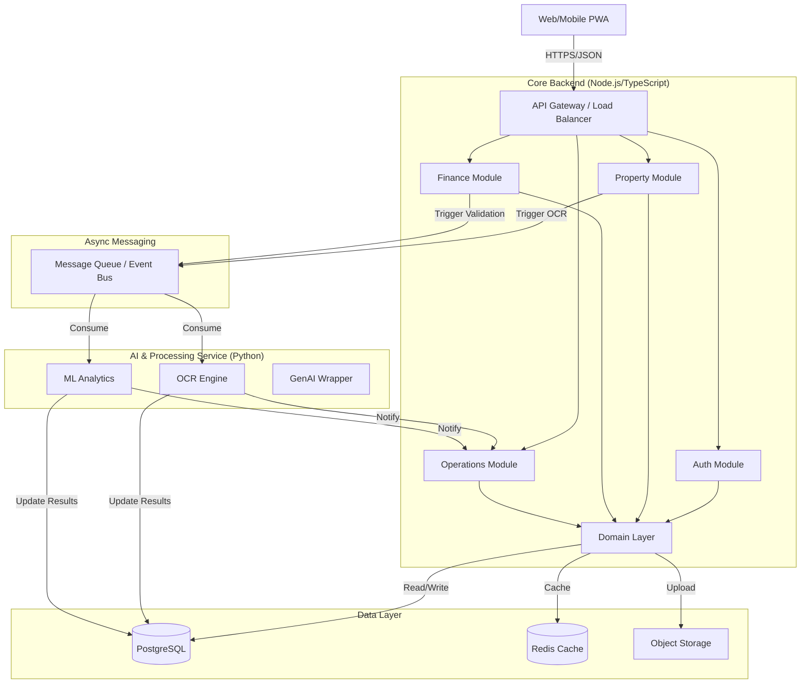

# Backend Architecture Document - SiHuni (Sistem Manajemen Kosan)

**Version:** 1.0  
**Date:** 2026-02-22  
**Status:** Implementation Ready  
**References:**
- `PRD_DSS_Manajemen_Kosan_v2_Professional.md`
- `UIUX_Design_Documentation_SiHuni.md`

---

## 1. Architectural Overview

The SiHuni backend is designed as a **Modular Monolith** (migratable to Microservices) to balance development speed with scalability. It employs **Clean Architecture** principles to separate business logic from infrastructure concerns, ensuring testability and maintainability.

### 1.1 High-Level Architecture Diagram

## 2. Technology Stack

| Component | Technology | Rationale |
|-----------|------------|-----------|
| **Runtime** | Node.js (v20 LTS) | High concurrency for I/O bound tasks, shared language with Frontend. |
| **Framework** | NestJS | Enforces modular architecture, dependency injection, and TypeScript support. |
| **AI Service** | Python (FastAPI) | Native support for Tesseract, Scikit-learn, and PyTorch/TensorFlow. |
| **Database** | PostgreSQL 16 | Robust relational data, JSONB support for OCR results, PostGIS for location. |
| **Caching** | Redis | Session management, API response caching, and rate limiting. |
| **Queue** | BullMQ (Redis-based) | Reliable job processing for OCR and ML tasks. |
| **Storage** | AWS S3 / MinIO | Scalable storage for document images and proofs. |
| **ORM** | Prisma / TypeORM | Type-safe database access aligned with TypeScript. |

## 3. Clean Architecture Implementation

The system follows the **Dependency Rule**, where dependencies point inward.

### 3.1 Layer Breakdown

1.  **Domain Layer (Inner)**
    -   **Entities**: Pure TS classes (`User`, `Property`, `Invoice`).
    -   **Value Objects**: `Email`, `Money`, `RiskScore`.
    -   **Repository Interfaces**: `IUserRepository`, `IPropertyRepository`.
    -   *No external dependencies (no frameworks, no DB drivers).*

2.  **Application Layer (Use Cases)**
    -   **Services**: `CreateInvoiceService`, `AnalyzeTenantRiskService`.
    -   **DTOs**: Input/Output data structures.
    -   **Events**: `InvoicePaidEvent`, `DocumentUploadedEvent`.

3.  **Interface Adapters**
    -   **Controllers**: REST endpoints (`AuthController`, `PropertyController`).
    -   **Gateways**: Wrappers for external APIs (Payment Gateway, AI Service).
    -   **Presenters**: Format responses (e.g., standard API response wrapper).

4.  **Infrastructure Layer (Outer)**
    -   **Persistence**: Prisma implementation of Repository Interfaces.
    -   **External Services**: S3 Client, Mailer Service, OCR Service Client.
    -   **Frameworks**: NestJS Modules, Guards, Interceptors.

## 4. Database Architecture

### 4.1 Schema Design (ERD Key Components)

#### Users & Auth
-   `users`: `id (UUID), email (UK), password_hash, role (ENUM), is_active`
-   `profiles`: `user_id (FK), full_name, phone, avatar_url`

#### Property Management
-   `properties`: `id (UUID), owner_id (FK), name, address, location (PostGIS Point)`
-   `rooms`: `id, property_id (FK), room_number, price, status (ENUM)`
-   `amenities`: `id, name, icon`
-   `property_amenities`: `property_id, amenity_id` (Junction)

#### Tenancy & Finance
-   `tenants`: `id, user_id (FK), current_room_id (FK), risk_score`
-   `leases`: `id, tenant_id, room_id, start_date, end_date, deposit`
-   `invoices`: `id, lease_id, amount, due_date, status, payment_proof_url`
-   `payments`: `id, invoice_id, amount, date, method, transaction_id`

#### Smart Features (AI/OCR)
-   `documents`: `id, user_id, type (KTP/RECEIPT), s3_key, ocr_status, ocr_data (JSONB)`
-   `predictions`: `id, entity_type, entity_id, model_version, result (JSONB), created_at`

### 4.2 Indexing Strategy
-   **B-Tree**: `email`, `property_id`, `tenant_id`, `status` (for filtering).
-   **GIN**: `ocr_data` (for searching within extracted JSON).
-   **GiST**: `location` (for geospatial queries "kosan near me").
-   **Composite**: `(property_id, status)` for "Available rooms in Property X".

## 5. Authentication & Security

### 5.1 Strategy
-   **Protocol**: OAuth2 / JWT (Bearer Token).
-   **Tokens**:
    -   `Access Token`: Short-lived (15 mins), contains `sub`, `role`, `permissions`.
    -   `Refresh Token`: Long-lived (7 days), stored in HTTP-Only Cookie + DB (hashed).

### 5.2 RBAC Matrix
| Role | Property | Financials | Tenants | System |
|------|----------|------------|---------|--------|
| **Super Admin** | Full | Full | Full | Full |
| **Owner** | Own Properties | Own Reports | Own Tenants | - |
| **Staff** | View/Update Status | Verify Payment | Check-in/out | - |
| **Tenant** | View Own | Pay Own | Update Profile | - |

### 5.3 Data Protection
-   **Encryption at Rest**: AES-256 for sensitive columns (NIK, Phone).
-   **Encryption in Transit**: TLS 1.3 forced.
-   **PII Handling**: Automatic masking of NIK in logs.

## 6. Async Processing Pipeline (OCR & ML)

To meet the `< 2 min` processing requirement without blocking the API:

1.  **Upload**: User uploads image -> API saves to S3 -> Returns `202 Accepted` + `job_id`.
2.  **Queue**: API pushes `process_ocr_job { doc_id, s3_key }` to Redis Queue.
3.  **Worker (Python)**:
    -   Pulls job.
    -   Downloads image.
    -   Runs Tesseract/EasyOCR.
    -   Extracts entities (NIK, Name).
    -   Pushes result back to Webhook/Queue.
4.  **Completion**: Core Service updates DB with `ocr_data` and notifies client via WebSocket/SSE.

## 7. Scalability & Deployment

### 7.1 Deployment Units
-   **API Server**: Stateless, horizontally scalable (Kubernetes Deployment).
-   **Worker Node**: CPU-optimized for ML tasks (K8s Deployment with HPA based on Queue depth).
-   **Database**: Managed RDS with Read Replicas.

### 7.2 CI/CD Pipeline
-   **Commit**: Lint + Unit Tests (Jest).
-   **Merge**: Build Docker Images -> Push to Registry.
-   **Deploy Dev**: Helm Upgrade -> Run Migrations.
-   **Integration Test**: Cypress/Supertest against Dev.
-   **Deploy Prod**: Blue/Green deployment strategy.

## 8. Development Standards
-   **Linting**: ESLint + Prettier (Airbnb config).
-   **Documentation**: Swagger/OpenAPI (auto-generated from DTOs).
-   **Testing**:
    -   Unit: 80% coverage on Domain/Application layers.
    -   E2E: Critical flows (Login -> Rent -> Pay).
