# Backend Architecture Document - SiHuni (Sistem Manajemen Hunian)

**Version:** 2.0  
**Date:** 2026-02-21  
**Status:** Implementation Complete  
**Platform:** Lovable Cloud (Deno Edge Functions + PostgreSQL)  

---

## Table of Contents

1. [Architectural Overview](#1-architectural-overview)
2. [Technology Stack](#2-technology-stack)
3. [System Architecture Diagram](#3-system-architecture-diagram)
4. [Clean Architecture Implementation](#4-clean-architecture-implementation)
5. [Database Architecture](#5-database-architecture)
6. [Authentication & Security](#6-authentication--security)
7. [Edge Functions Architecture](#7-edge-functions-architecture)
8. [Async Processing & Cron Jobs](#8-async-processing--cron-jobs)
9. [Payment Pipeline (Xendit)](#9-payment-pipeline-xendit)
10. [Escrow & Disbursement Engine](#10-escrow--disbursement-engine)
11. [AI & Chatbot Architecture](#11-ai--chatbot-architecture)
12. [Notification System](#12-notification-system)
13. [Subscription & Billing Engine](#13-subscription--billing-engine)
14. [Referral Commission Engine](#14-referral-commission-engine)
15. [Frontend Architecture](#15-frontend-architecture)
16. [Security Architecture](#16-security-architecture)
17. [Scalability & Performance](#17-scalability--performance)
18. [Development Standards](#18-development-standards)
19. [Deployment Architecture](#19-deployment-architecture)
20. [Monitoring & Observability](#20-monitoring--observability)

---

## 1. Architectural Overview

SiHuni's backend is designed as a **Serverless Modular Monolith** running on Lovable Cloud. It combines the simplicity of a single deployment unit with the isolation of serverless edge functions for complex business logic.

### 1.1 Design Principles

| Principle | Implementation |
|-----------|---------------|
| **Serverless-First** | 31 Deno Edge Functions handle all server-side logic |
| **Database-as-API** | PostgreSQL + RLS policies serve as the primary API for CRUD |
| **Event-Driven** | Webhooks and cron jobs handle async workflows |
| **Zero-Trust Data** | Row Level Security (RLS) enforces access at the database level |
| **Feature-Based Modularity** | 25 feature modules with isolated services, hooks, types, and components |

### 1.2 Key Metrics

| Metric | Value |
|--------|-------|
| Edge Functions | 31 |
| Database Tables | 40+ |
| Feature Modules | 25 |
| RLS Policies | 100+ |
| Notification Templates | 30+ |
| Supported Roles | 7 (super_admin, admin, moderator, support, merchant, tenant, vendor) |

---

## 2. Technology Stack

| Component | Technology | Rationale |
|-----------|------------|-----------|
| **Runtime** | Deno (Edge Functions) | Secure by default, TypeScript native, fast cold starts |
| **Frontend** | React 18 + TypeScript + Vite | Component-based UI with type safety and fast HMR |
| **Database** | PostgreSQL 16 (Supabase) | JSONB support, RLS, realtime subscriptions |
| **ORM/Client** | Supabase JS SDK v2 | Type-safe queries, realtime, auth, storage integration |
| **State Management** | TanStack React Query v5 + Zustand | Server state caching + client state management |
| **Payment Gateway** | Xendit | Indonesia-focused payment infra (VA, e-wallet, QRIS) |
| **Email Service** | Resend API | Developer-friendly transactional email |
| **AI Provider** | Lovable AI (Gemini models) | Context-aware chatbot without API key management |
| **Storage** | Supabase Storage | Object storage for KTP, signatures, documents, images |
| **Styling** | Tailwind CSS + shadcn/ui | Utility-first CSS with accessible component library |
| **Forms** | React Hook Form + Zod | Performant forms with schema-based validation |
| **Charts** | Recharts | Composable chart components for analytics dashboards |
| **Maps** | React Leaflet | Property location mapping |
| **PDF** | Edge Function (HTML→PDF) | Server-side invoice PDF generation |
| **Routing** | React Router v6 | Client-side routing with role-based guards |

---

## 3. System Architecture Diagram

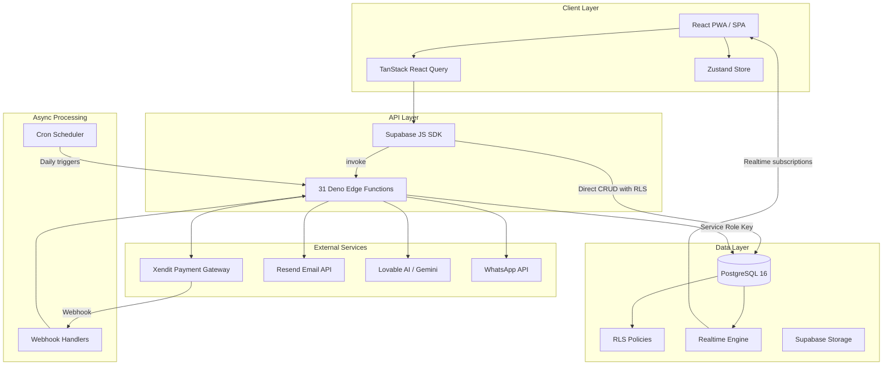

### 3.1 Data Flow Patterns

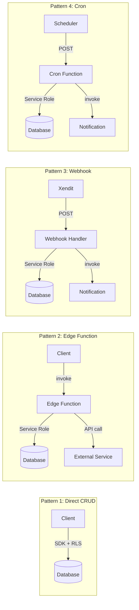

---

## 4. Clean Architecture Implementation

### 4.1 Frontend Feature Module Structure

Each of the 25 feature modules follows a consistent **Clean Architecture** layout:

```
src/features/{module}/
├── components/          # UI components (Presentational + Container)
│   ├── admin/           # Admin-specific components
│   └── tenant/          # Tenant-specific components
├── hooks/               # Custom React hooks (use cases)
│   ├── use{Module}.ts           # Main data hook
│   └── use{Module}Actions.ts   # Mutation hooks
├── services/            # Data access layer (Supabase queries)
│   └── {module}Service.ts
├── types/               # TypeScript interfaces & types
│   └── index.ts
└── utils/               # Pure utility functions
```

### 4.2 Layer Responsibilities

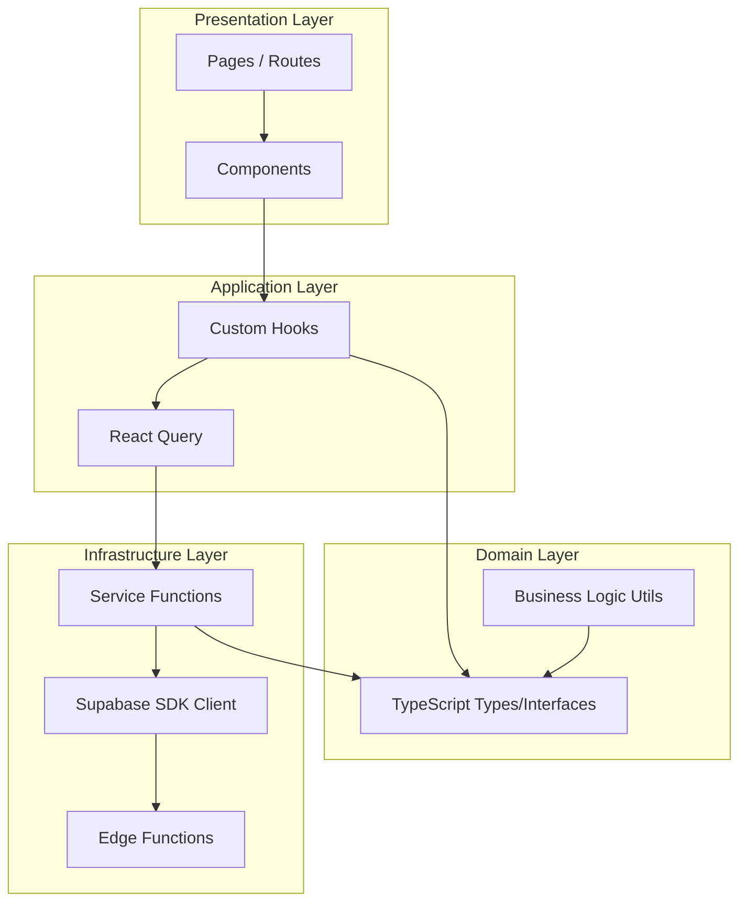

| Layer | Responsibility | Dependencies |
|-------|---------------|--------------|
| **Presentation** | UI rendering, user interaction, routing | Application Layer |
| **Application** | Use case orchestration, data fetching/caching, mutations | Domain + Infrastructure |
| **Domain** | Type definitions, business rules, validation schemas | None (pure) |
| **Infrastructure** | Database queries, API calls, storage operations | Supabase SDK |

### 4.3 Feature Modules (25 Modules)

| Module | Description | Key Tables |
|--------|-------------|------------|
| `analytics` | Dashboard analytics, merchant stats, churn analysis | `analytics_events`, `contracts` |
| `audit-logs` | System audit trail, admin activity logs | `audit_logs` |
| `auth` | Authentication, registration, role management, 2FA | `profiles`, `user_roles` |
| `billing` | Subscription billing, payment status | `merchant_subscriptions`, `subscription_invoices` |
| `chatbot` | AI chatbot, knowledge base management | `chat_conversations`, `chat_messages`, `chatbot_knowledge` |
| `contracts` | Contract lifecycle, signatures, move-out, early termination | `contracts`, `move_out_notices`, `move_out_inspections` |
| `dashboard` | Role-specific dashboards (admin, merchant, tenant, vendor) | Multiple tables |
| `disputes` | Tenant-merchant dispute resolution | `disputes` |
| `escrow` | Escrow management, disbursement review | `escrow_accounts`, `escrow_transactions`, `disbursements` |
| `forum` | Community forum, posts, comments, moderation | `forum_posts`, `forum_comments`, `forum_reports` |
| `maintenance` | Maintenance requests, vendor assignment, timeline | `maintenance_requests`, `maintenance_updates` |
| `notifications` | In-app notification center | `notifications` |
| `orders` | Marketplace orders, fulfillment tracking | `orders`, `order_items` |
| `payments` | Payment processing, invoice management | `invoices`, `payments`, `xendit_transactions` |
| `platform-config` | Platform settings, feature flags | `platform_settings` |
| `products` | Vendor product catalog | `products` |
| `profile` | User profile management | `profiles` |
| `properties` | Property & unit management | `properties`, `units` |
| `referrals` | Referral program, commission tracking | `referrals`, `referral_rewards` |
| `search` | Global search across entities | Multiple tables |
| `signature` | Digital signature capture (canvas-based) | `contracts` (signature URLs) |
| `subscriptions` | Subscription tier management | `subscription_tiers`, `merchant_subscriptions` |
| `users` | Admin user management, merchant/tenant/vendor administration | `profiles`, `merchants`, `tenants`, `vendors` |
| `vendors` | Vendor management, verification | `vendors`, `vendor_verifications` |
| `verification` | Document verification workflow | `merchant_verifications`, `vendor_verifications` |

---

## 5. Database Architecture

### 5.1 Schema Overview (40+ Tables)

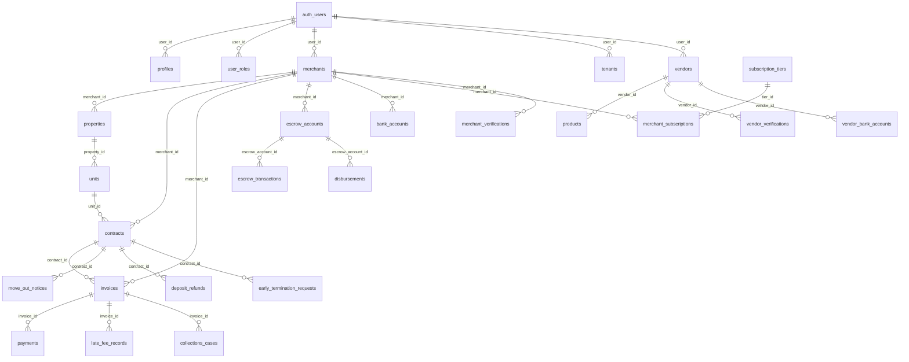

### 5.2 Table Groups

#### Core Identity (5 tables)
| Table | Purpose | RLS |
|-------|---------|-----|
| `profiles` | User profile data (name, email, phone, avatar, 2FA) | Own data + admin read |
| `user_roles` | RBAC role assignments (`app_role` enum) | Admin manage, user read own |
| `merchants` | Merchant business data, verification status | Own data + admin manage |
| `tenants` | Tenant profile, KTP, emergency contacts, notification prefs | Own data + merchant read linked |
| `vendors` | Vendor business data, categories, verification | Own data + admin manage |

#### Property Management (2 tables)
| Table | Purpose | RLS |
|-------|---------|-----|
| `properties` | Property listings with type, address, amenities, images | Merchant own + admin manage |
| `units` | Individual units within properties (price, status, floor) | Merchant own + admin manage |

#### Contract Lifecycle (7 tables)
| Table | Purpose | RLS |
|-------|---------|-----|
| `contracts` | Rental contracts with terms, signatures, billing config | Merchant manage + tenant read |
| `move_out_notices` | Formal move-out notifications with expected dates | Merchant + tenant access |
| `move_out_inspections` | Property inspection reports with deductions | Merchant manage + tenant confirm |
| `move_out_tasks` | Checklist items for move-out process | Merchant + tenant access |
| `deposit_refunds` | Deposit refund tracking with bank details | Merchant manage + tenant read |
| `deposit_disputes` | Tenant disputes on deposit deductions | Tenant create + admin resolve |
| `early_termination_requests` | Early contract termination with penalty calculation | Tenant request + merchant respond |

#### Financial (8 tables)
| Table | Purpose | RLS |
|-------|---------|-----|
| `invoices` | Rent/service invoices with line items, late fees | Merchant manage + tenant read |
| `payments` | Payment records (rent, deposit, order, subscription) | Merchant manage + tenant read |
| `xendit_transactions` | Xendit payment gateway transaction records | System create + user read own |
| `payment_plans` | Installment/deferred payment arrangements | Merchant create + tenant accept |
| `late_fee_records` | Late fee calculation audit trail | System managed |
| `collections_cases` | Overdue invoice escalation tracking | Merchant manage + admin read |
| `escrow_accounts` | Merchant escrow balance tracking | Merchant read + admin manage |
| `escrow_transactions` | Escrow credit/debit transaction ledger | Merchant read + admin manage |
| `disbursements` | Payout processing to merchant/vendor bank accounts | Admin review + merchant read |

#### Subscription (4 tables)
| Table | Purpose | RLS |
|-------|---------|-----|
| `subscription_tiers` | Platform subscription plans (Basic/Pro/Enterprise) | Public read + admin manage |
| `merchant_subscriptions` | Active merchant subscriptions | Merchant read + admin manage |
| `subscription_invoices` | Subscription billing invoices | Merchant read + admin manage |
| `cancellation_feedback` | Post-cancellation survey data | Merchant insert + admin read |

#### Marketplace (4 tables)
| Table | Purpose | RLS |
|-------|---------|-----|
| `products` | Vendor product catalog | Vendor manage + public read |
| `orders` | Purchase orders from tenants/merchants | Buyer read + vendor manage |
| `order_items` | Individual items within orders | Follows order access |
| `order_reviews` | Product/vendor reviews | Buyer create + public read |

#### Maintenance (4 tables)
| Table | Purpose | RLS |
|-------|---------|-----|
| `maintenance_requests` | Repair/maintenance request tickets | Tenant create + merchant manage |
| `maintenance_updates` | Status updates and comments on requests | Author create + involved read |
| `maintenance_timeline` | Automated timeline tracking | System managed |
| `maintenance_reviews` | Tenant reviews of completed maintenance | Tenant create + vendor read |

#### Community (4 tables)
| Table | Purpose | RLS |
|-------|---------|-----|
| `forum_posts` | Community forum posts | Author manage + public read visible |
| `forum_comments` | Threaded comments with nested replies | Author manage + public read visible |
| `forum_likes` | Post/comment like records | User own |
| `forum_reports` | Content moderation reports | Reporter create + admin review |

#### Referral (2 tables)
| Table | Purpose | RLS |
|-------|---------|-----|
| `referrals` | Referral tracking (referrer → referee) | User own + admin manage |
| `referral_rewards` | Commission/reward tracking | User read + admin manage |

#### System (5 tables)
| Table | Purpose | RLS |
|-------|---------|-----|
| `notifications` | In-app notification records | User own |
| `audit_logs` | System audit trail (immutable) | Admin read + system insert |
| `analytics_events` | User behavior tracking | System managed |
| `platform_settings` | Platform configuration (JSONB values) | Public read + admin manage |
| `chatbot_knowledge` | AI knowledge base Q&A pairs | Admin manage |

#### Location (2 tables)
| Table | Purpose | RLS |
|-------|---------|-----|
| `provinces` | Indonesian provinces reference | Public read |
| `cities` | Indonesian cities reference | Public read |

### 5.3 Indexing Strategy

Following `supabase-postgres-best-practices` skill:

| Index Type | Columns | Purpose |
|------------|---------|---------|
| **B-Tree** | `merchant_id`, `tenant_user_id`, `user_id` | FK lookups, RLS policy evaluation |
| **B-Tree** | `status` (on invoices, contracts, orders) | Status filtering queries |
| **B-Tree Composite** | `(merchant_id, status)` | Filtered merchant queries |
| **B-Tree Composite** | `(contract_id, due_date)` | Invoice ordering per contract |
| **GIN** | `line_items` (JSONB on invoices) | JSONB containment queries |
| **GIN** | `features` (JSONB on subscription_tiers) | Feature flag lookups |
| **GIN** | `tags` (on forum_posts) | Tag-based search |

### 5.4 RLS Policy Design

All tables use **restrictive** RLS mode (explicit DENY by default):

```sql
-- Pattern: Merchant owns data through merchant_id
CREATE POLICY "Merchants can manage their invoices"
ON public.invoices FOR ALL
USING (EXISTS (
  SELECT 1 FROM merchants m
  WHERE m.id = invoices.merchant_id AND m.user_id = auth.uid()
));

-- Pattern: Tenant sees own data via tenant_user_id
CREATE POLICY "Tenants can view their invoices"
ON public.invoices FOR SELECT
USING (tenant_user_id = auth.uid());

-- Pattern: Admin sees all via role check
CREATE POLICY "Admins can manage all invoices"
ON public.invoices FOR ALL
USING (has_role(auth.uid(), 'admin'::app_role));
```

**Key RLS function:**
```sql
CREATE FUNCTION has_role(user_id UUID, role app_role) RETURNS BOOLEAN AS $$
  SELECT EXISTS (
    SELECT 1 FROM user_roles
    WHERE user_roles.user_id = $1 AND user_roles.role = $2
  );
$$ LANGUAGE sql SECURITY DEFINER STABLE;
```

---

## 6. Authentication & Security

### 6.1 Authentication Flow

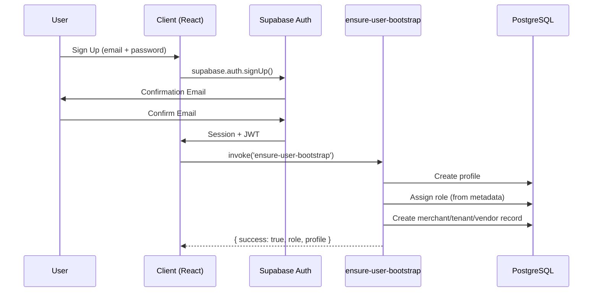

### 6.2 RBAC (Role-Based Access Control)

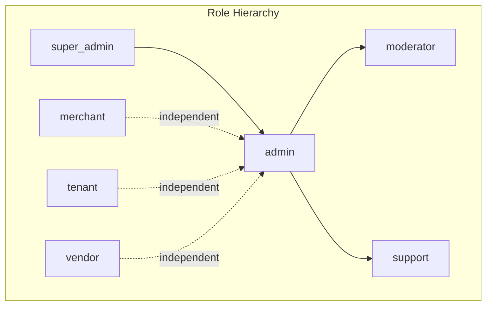

| Role | Scope | Capabilities |
|------|-------|-------------|
| `super_admin` | Global | All admin + system config, role management |
| `admin` | Global | User management, verifications, escrow, platform settings |
| `moderator` | Forum | Content moderation, post/comment visibility |
| `support` | Limited | View tickets, respond to disputes |
| `merchant` | Own Data | Properties, units, contracts, invoices, bank accounts |
| `tenant` | Own Data | View invoices, pay rent, maintenance requests, forum |
| `vendor` | Own Data | Products, orders, bank accounts, maintenance jobs |

### 6.3 Admin 2FA (TOTP)

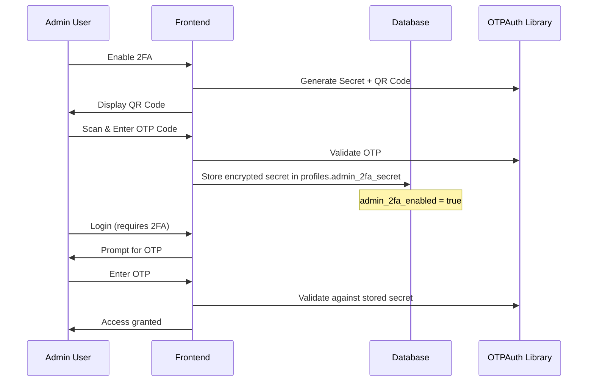

### 6.4 Tenant Invitation Flow (Public Endpoints)

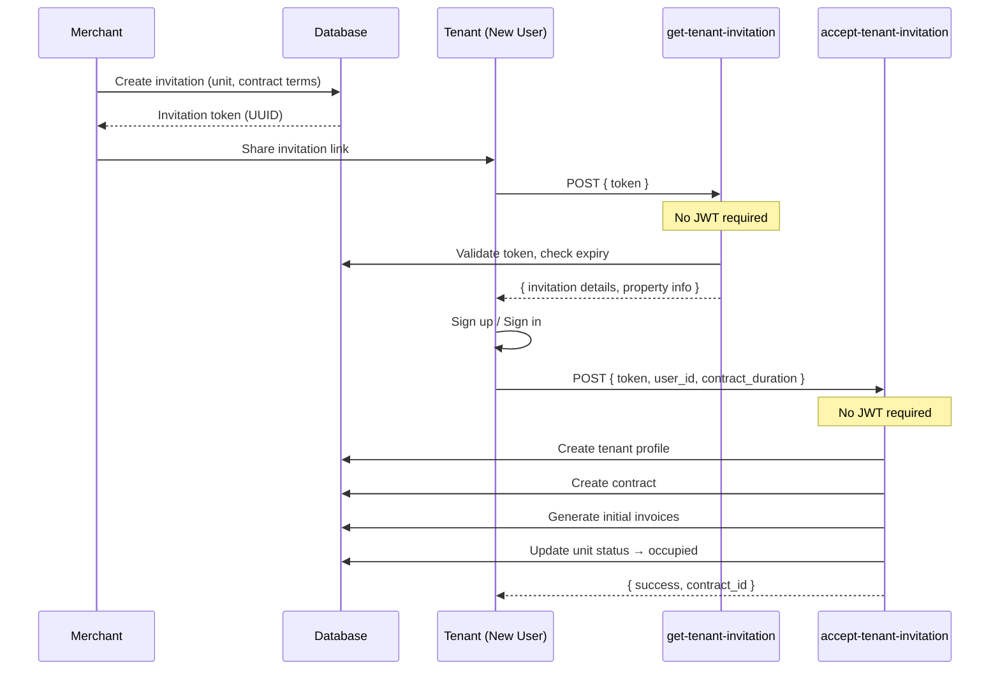

---

## 7. Edge Functions Architecture

### 7.1 Overview

31 Deno Edge Functions organized into 10 functional categories:

```
supabase/functions/
├── accept-tenant-invitation/     # Tenant onboarding
├── ai-chatbot/                   # Multi-role AI chatbot
├── auth-webhook/                 # Auth event handler
├── auto-generate-invoices/       # Billing automation (cron)
├── auto-pay-execute/             # Auto-pay processing (cron)
├── check-overdue-escalation/     # Overdue escalation (cron)
├── check-payment-plan/           # Payment plan monitor (cron)
├── ensure-user-bootstrap/        # User profile bootstrap
├── generate-invoice-pdf/         # PDF generation
├── get-tenant-invitation/        # Invitation validation
├── merchant-ai-assistant/        # Merchant AI helper
├── order-auto-reject/            # Order timeout (cron)
├── process-deposit-refund/       # Deposit refund via Xendit
├── process-referral-commissions/ # Referral processing (cron)
├── process-referral-reward/      # Reward crediting
├── process-vendor-order-referral/# Vendor referral bonus
├── scheduled-disbursement/       # Auto-disbursement (cron)
├── send-notification/            # Email via Resend (30+ templates)
├── send-payment-reminder/        # Payment reminders (cron)
├── subscription-billing/         # Subscription invoicing (cron)
├── subscription-grace-check/     # Grace period monitor (cron)
├── subscription-payment/         # Subscription payment creation
├── subscription-renewal/         # Auto-renewal (cron)
├── vacancy-tracking-cron/        # Vacancy monitoring (cron)
├── validate-admin-secret/        # Admin 2FA validation
├── vendor-ai-assistant/          # Vendor AI helper
├── whatsapp-notification/        # WhatsApp messaging
├── xendit-create-invoice/        # Payment invoice creation
├── xendit-disbursement/          # Disbursement processing
├── xendit-disbursement-webhook/  # Disbursement callback
└── xendit-webhook/               # Payment callback
```

### 7.2 Edge Function Patterns

#### Pattern A: Authenticated Function (JWT Required)
```typescript
serve(async (req) => {
  if (req.method === 'OPTIONS') return new Response(null, { headers: corsHeaders });

  const authHeader = req.headers.get('Authorization');
  if (!authHeader) return unauthorized();

  // Create user-context client for RLS
  const supabaseUser = createClient(SUPABASE_URL, SUPABASE_ANON_KEY, {
    global: { headers: { Authorization: authHeader } }
  });

  // Create admin client for service-role operations
  const supabaseAdmin = createClient(SUPABASE_URL, SUPABASE_SERVICE_ROLE_KEY);

  const { data: { user } } = await supabaseUser.auth.getUser();
  if (!user) return unauthorized();

  // Business logic...
});
```

#### Pattern B: Webhook Handler (Token Verification)
```typescript
serve(async (req) => {
  const callbackToken = req.headers.get('x-callback-token');
  const XENDIT_WEBHOOK_TOKEN = Deno.env.get('XENDIT_WEBHOOK_TOKEN');

  // Timing-safe comparison (prevent timing attacks)
  const encoder = new TextEncoder();
  const a = encoder.encode(callbackToken);
  const b = encoder.encode(XENDIT_WEBHOOK_TOKEN);
  
  if (a.byteLength !== b.byteLength) return unauthorized();
  let diff = 0;
  for (let i = 0; i < a.byteLength; i++) diff |= a[i] ^ b[i];
  if (diff !== 0) return unauthorized();

  // Process webhook payload...
});
```

#### Pattern C: Cron Job (Service Role Only)
```typescript
serve(async (req) => {
  const supabase = createClient(
    Deno.env.get('SUPABASE_URL')!,
    Deno.env.get('SUPABASE_SERVICE_ROLE_KEY')!
  );

  // Query all relevant records (bypasses RLS)
  // Process batch operations
  // Send notifications for state changes
});
```

#### Pattern D: Public Endpoint (No Auth)
```typescript
serve(async (req) => {
  const { token } = await req.json();
  
  // Input validation
  if (!token || typeof token !== 'string') return badRequest('INVALID_TOKEN');

  const supabase = createClient(SUPABASE_URL, SUPABASE_SERVICE_ROLE_KEY);
  
  // Validate token against database
  // Return public-safe data
});
```

### 7.3 Error Handling Standards

All edge functions use consistent error codes (from `api-security-best-practices` skill):

```typescript
const ERROR_CODES = {
  RATE_LIMIT: 'ERR_RATE_LIMIT',
  AI_UNAVAILABLE: 'ERR_AI_UNAVAILABLE',
  INVALID_INPUT: 'ERR_INVALID_INPUT',
  AUTH_REQUIRED: 'ERR_AUTH_REQUIRED',
  CONTEXT_FAILED: 'ERR_CONTEXT_FAILED',
};

// Standard error response
return new Response(
  JSON.stringify({ error: ERROR_CODES.INVALID_INPUT, message: 'Detailed description' }),
  { status: 400, headers: { ...corsHeaders, 'Content-Type': 'application/json' } }
);
```

### 7.4 CORS Configuration

All edge functions include standardized CORS headers:

```typescript
const corsHeaders = {
  'Access-Control-Allow-Origin': '*',
  'Access-Control-Allow-Headers': 'authorization, x-client-info, apikey, content-type, x-callback-token',
};
```

---

## 8. Async Processing & Cron Jobs

### 8.1 Cron Job Schedule

```mermaid
gantt
    title Daily Cron Job Execution Order
    dateFormat HH:mm
    axisFormat %H:%M

    section Billing
    auto-generate-invoices      :00:00, 30min
    send-payment-reminder       :00:30, 20min
    check-overdue-escalation    :01:00, 20min
    check-payment-plan          :01:30, 15min

    section Subscriptions
    subscription-billing        :02:00, 20min
    subscription-renewal        :02:30, 15min
    subscription-grace-check    :03:00, 15min

    section Operations
    scheduled-disbursement      :04:00, 30min
    vacancy-tracking-cron       :05:00, 20min
    order-auto-reject           :05:30, 15min
    process-referral-commissions:06:00, 15min
```

### 8.2 Cron Functions Detail

| Function | Trigger | Logic | Side Effects |
|----------|---------|-------|-------------|
| `auto-generate-invoices` | Daily | Find active contracts where `billing_day = today`, generate rent invoices | Creates `invoices`, sends email via `send-notification` |
| `send-payment-reminder` | Daily | Find unpaid invoices due in 7d/3d/today | Sends email reminders |
| `check-overdue-escalation` | Daily | Find overdue invoices, apply late fees, escalate to collections | Updates `invoices`, creates `late_fee_records`, `collections_cases` |
| `check-payment-plan` | Daily | Monitor installment payments, auto-default missed plans | Updates `payment_plans` status |
| `subscription-billing` | Daily | Check subscriptions due for billing, create subscription invoices | Creates `subscription_invoices` |
| `subscription-renewal` | Daily | Auto-renew subscriptions at period end | Updates `merchant_subscriptions` |
| `subscription-grace-check` | Daily | Suspend/cancel overdue subscriptions after grace period | Updates subscription status, sends notifications |
| `scheduled-disbursement` | Daily | Process merchant escrow disbursements based on schedule | Creates `disbursements`, calls Xendit API |
| `vacancy-tracking-cron` | Daily | Track vacant units, calculate vacancy days, alert merchants | Updates unit metadata, sends notifications |
| `order-auto-reject` | Daily | Auto-reject vendor orders not responded within 48 hours | Updates `orders` status |
| `process-referral-commissions` | Daily | Process eligible referral commissions based on criteria | Creates `referral_rewards` |
| `auto-pay-execute` | Daily | Execute auto-pay for tenants with `auto_pay_enabled = true` | Creates Xendit invoices |

---

## 9. Payment Pipeline (Xendit)

### 9.1 Payment Flow

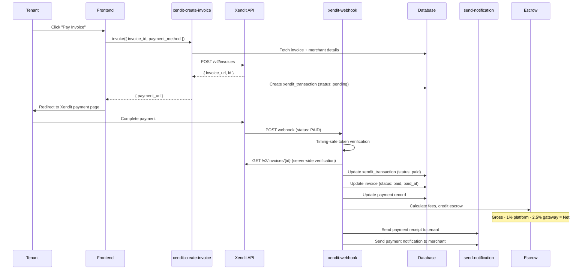

### 9.2 Fee Calculation Engine

```
┌─────────────────────────────────────────┐
│         Payment Fee Breakdown           │
├─────────────────────────────────────────┤
│ Gross Amount (paid by tenant)     100%  │
│ ├─ Platform Fee                   -1%   │
│ ├─ Gateway Fee (Xendit)           -2.5% │
│ └─ Net to Escrow                  96.5% │
├─────────────────────────────────────────┤
│         Disbursement Fees               │
├─────────────────────────────────────────┤
│ Daily schedule                    0.25% │
│ Weekly schedule                   0.20% │
│ Bi-weekly schedule                0.15% │
│ Monthly schedule                  0.10% │
└─────────────────────────────────────────┘
```

### 9.3 Webhook Security (from `api-security-best-practices` skill)

1. **Token Verification**: Timing-safe byte comparison prevents timing attacks
2. **Server-Side Validation**: Cross-verify payment status with Xendit API
3. **Idempotency**: Check `xendit_transactions.xendit_invoice_id` before processing (from `payment-integration` skill)
4. **Atomic Updates**: All database changes within single transaction scope

---

## 10. Escrow & Disbursement Engine

### 10.1 Escrow Flow

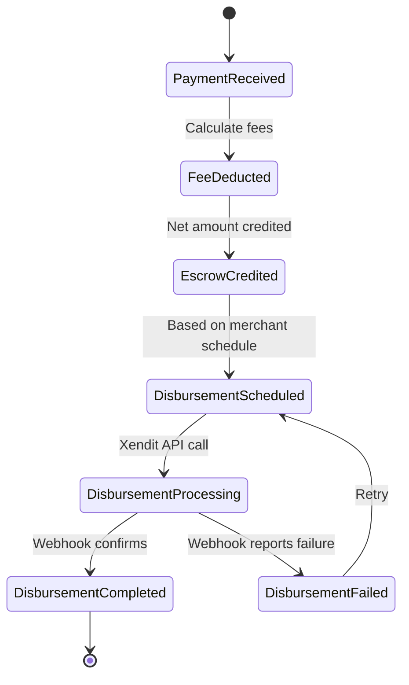

### 10.2 Disbursement Schedules

| Schedule | Processing | Fee Rate | Min Amount |
|----------|-----------|----------|------------|
| Daily | Every day at 04:00 | 0.25% | Configurable per merchant |
| Weekly | Every Monday | 0.20% | Configurable per merchant |
| Bi-weekly | 1st & 15th | 0.15% | Configurable per merchant |
| Monthly | 1st of month | 0.10% | Configurable per merchant |

### 10.3 Escrow Transaction Types

| Type | Direction | Description |
|------|-----------|-------------|
| `rent_payment` | Credit | Tenant rent payment received |
| `deposit_payment` | Credit | Security deposit received |
| `order_payment` | Credit | Marketplace order payment |
| `disbursement` | Debit | Payout to merchant bank account |
| `refund` | Debit | Tenant refund processed |
| `platform_fee` | Debit | Platform commission deducted |

---

## 11. AI & Chatbot Architecture

### 11.1 Multi-Role AI System

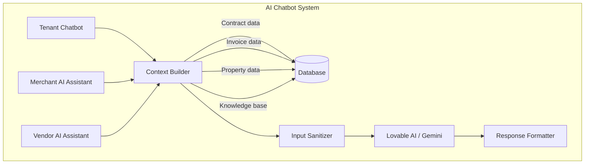

### 11.2 Context-Aware Prompt Engineering

Each AI assistant builds role-specific context:

| Role | Context Data | Knowledge Source |
|------|-------------|-----------------|
| **Tenant** | Active contract, invoices, maintenance requests, property info | `chatbot_knowledge` + live DB |
| **Merchant** | Properties, units, financial summaries, tenant info | `chatbot_knowledge` + live DB |
| **Vendor** | Products, orders, reviews, earnings | `chatbot_knowledge` + live DB |

### 11.3 Security (from `api-security-best-practices` skill)

**Prompt Injection Prevention:**
```typescript
const sanitizeInput = (input: string): string => {
  const patterns = [
    /ignore previous instructions/gi,
    /system:/gi,
    /\[INST\]/gi,
    /<\|.*?\|>/g,
    /```system/gi,
    /\bprompt\s*:/gi,
  ];
  let sanitized = input;
  patterns.forEach(pattern => {
    sanitized = sanitized.replace(pattern, '[filtered]');
  });
  return sanitized.trim().substring(0, 2000); // Max 2000 chars
};
```

---

## 12. Notification System

### 12.1 Architecture

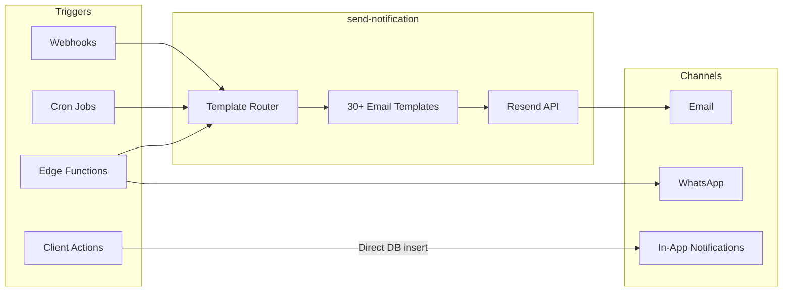

### 12.2 Notification Types (30+)

| Category | Types |
|----------|-------|
| **Billing** | `invoice`, `payment_reminder`, `payment_receipt`, `payment_received`, `late_fee_applied` |
| **Subscription** | `subscription_upgrade`, `subscription_payment`, `subscription_invoice`, `subscription_suspended`, `subscription_cancelled`, `subscription_renewal_reminder` |
| **Tenant** | `tenant_registration`, `tenant_invitation` |
| **Disbursement** | `disbursement_processing`, `disbursement_success`, `disbursement_failed` |
| **Maintenance** | `maintenance_update` |
| **Payment Plans** | `payment_plan_offered`, `payment_plan_accepted`, `payment_plan_defaulted` |
| **Move-Out** | `move_out_notice_received`, `move_out_notice_confirmed`, `inspection_scheduled`, `inspection_completed`, `deposit_refunded` |
| **Termination** | `early_termination_approved`, `early_termination_denied` |
| **Verification** | `verification_approved`, `verification_rejected` |
| **Operations** | `vacancy_alert`, `auto_pay_invoice` |
| **General** | `general` (customizable) |

---

## 13. Subscription & Billing Engine

### 13.1 Subscription Lifecycle

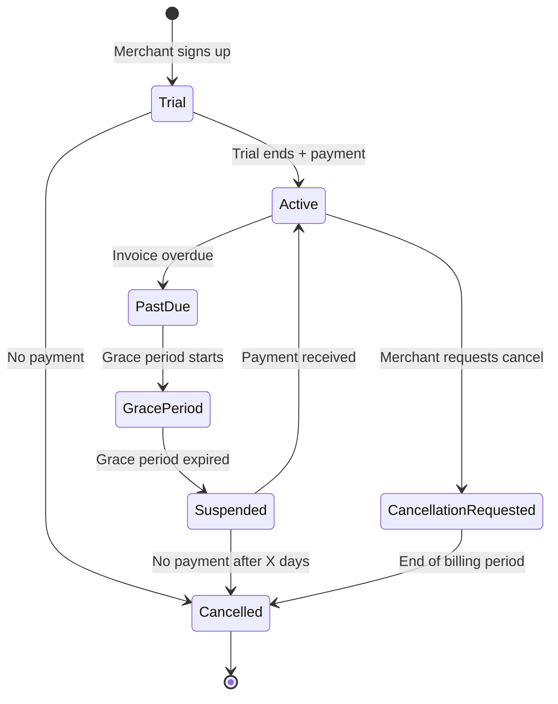

### 13.2 Billing Automation (from `billing-automation` skill)

| Step | Function | Action |
|------|----------|--------|
| 1 | `subscription-billing` | Check subscriptions due, create `subscription_invoices` |
| 2 | `subscription-payment` | Create Xendit payment for subscription invoice |
| 3 | `xendit-webhook` | Process payment callback |
| 4 | `subscription-renewal` | Extend subscription period on payment |
| 5 | `subscription-grace-check` | Suspend if grace period expires |

### 13.3 Tier Limits Enforcement

| Tier | Properties | Units | Tenants | Features |
|------|-----------|-------|---------|----------|
| **Basic** | 1 | 5 | 5 | Core features |
| **Pro** | 5 | 50 | 50 | + Analytics, AI, Auto-pay |
| **Enterprise** | Unlimited | Unlimited | Unlimited | + Priority support, Custom branding |

---

## 14. Referral Commission Engine

### 14.1 Referral Flow (from `referral-program` skill)

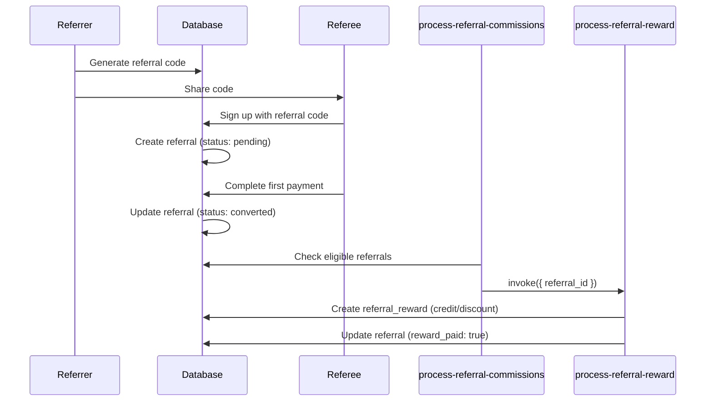

### 14.2 Commission Types

| Referral Type | Reward | Condition |
|--------------|--------|-----------|
| Merchant → Merchant | Subscription credit | Referee completes first payment |
| Merchant → Tenant | Rent discount (months) | Referee signs contract |
| Tenant → Tenant | Rent discount | Referee completes first payment |
| Vendor → Vendor | Order commission | Referee completes first order |

---

## 15. Frontend Architecture

### 15.1 Routing Architecture

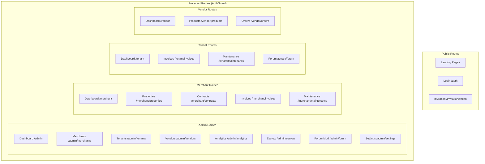

### 15.2 State Management

| Concern | Tool | Usage |
|---------|------|-------|
| **Server State** | TanStack React Query v5 | Data fetching, caching, mutations, optimistic updates |
| **Client State** | Zustand | Auth state, UI preferences, filters |
| **Form State** | React Hook Form | Form data, validation, submission |
| **URL State** | React Router v6 | Route params, search params |

### 15.3 Data Fetching Pattern

```typescript
// Hook (Application Layer)
export const useContracts = (merchantId: string) => {
  return useQuery({
    queryKey: ['contracts', merchantId],
    queryFn: () => contractService.getMerchantContracts(merchantId),
    enabled: !!merchantId,
  });
};

// Service (Infrastructure Layer)
export const contractService = {
  async getMerchantContracts(merchantId: string): Promise<Contract[]> {
    const { data, error } = await supabase
      .from('contracts')
      .select(`*, unit:units (unit_number, property:properties (name, address, city))`)
      .eq('merchant_id', merchantId)
      .order('created_at', { ascending: false });
    if (error) throw error;
    return data as unknown as Contract[];
  },
};
```

---

## 16. Security Architecture

### 16.1 Defense in Depth (from `api-security-best-practices` skill)

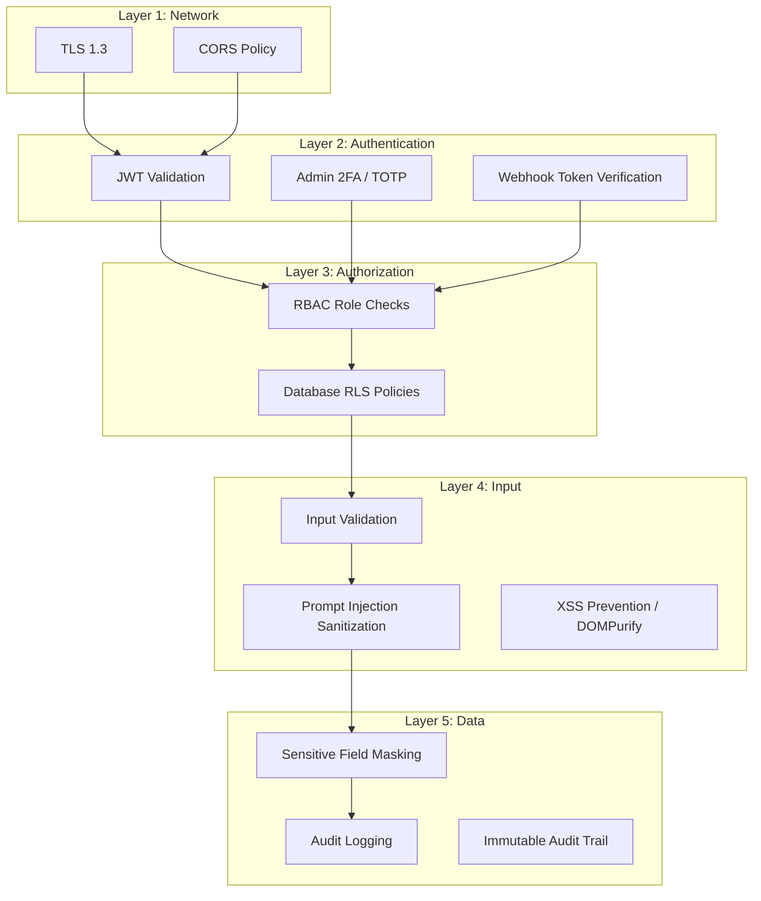

### 16.2 Security Measures

| Measure | Implementation | Skill Reference |
|---------|---------------|-----------------|
| **RLS on all tables** | Restrictive mode, 100+ policies | `supabase-postgres-best-practices` |
| **JWT validation** | Edge functions verify `Authorization` header | `api-security-best-practices` |
| **Webhook security** | Timing-safe token comparison | `payment-integration` |
| **Server-side verification** | Cross-verify Xendit payment status via API | `payment-integration` |
| **Input sanitization** | Prompt injection pattern filtering | `api-security-best-practices` |
| **XSS prevention** | DOMPurify for user-generated content | `frontend-security-coder` |
| **Admin 2FA** | TOTP via OTPAuth library | `auth-implementation-patterns` |
| **Service role isolation** | Service role key only in edge functions (server-side) | `supabase-postgres-best-practices` |
| **Audit logging** | Immutable `audit_logs` table (insert-only, admin read) | `security-auditor` |
| **Sensitive data** | 2FA secrets stored encrypted in DB | `pci-compliance` |

### 16.3 PCI Compliance Notes (from `pci-compliance` skill)

- **No card data storage**: All payment processing through Xendit (PCI DSS Level 1)
- **Tokenized payments**: Xendit handles card tokenization
- **Redirect model**: Users redirected to Xendit-hosted payment page
- **Webhook only**: Payment status received only via verified webhooks

---

## 17. Scalability & Performance

### 17.1 Performance Optimizations (from `web-performance-optimization` skill)

| Technique | Implementation |
|-----------|---------------|
| **Code Splitting** | React.lazy() for route-based splitting |
| **Query Caching** | TanStack Query with `staleTime` and `gcTime` |
| **Optimistic Updates** | Mutation with `onMutate` for instant UI feedback |
| **Connection Pooling** | Supabase managed PgBouncer (transaction mode) |
| **Edge Functions** | Deno cold start < 200ms |
| **Compression** | Vite compression plugin (gzip/brotli) |
| **Lazy Loading** | Images and heavy components |
| **Pagination** | Offset-based pagination with configurable page size |

### 17.2 Database Performance (from `sql-optimization-patterns` skill)

| Optimization | Applied To |
|-------------|-----------|
| **Composite indexes** | `(merchant_id, status)` on invoices, contracts |
| **Partial indexes** | Active contracts only for unit lookup |
| **JSONB indexes (GIN)** | `line_items`, `features`, `ocr_data` |
| **Materialized views** | Analytics aggregations (planned) |
| **Query result limits** | Default 1000 rows per Supabase query |

### 17.3 Caching Strategy

```
┌──────────────────────────────────────────────────┐
│              Caching Layers                      │
├──────────────────────────────────────────────────┤
│ L1: React Query (in-memory)                      │
│     staleTime: 30s-5min (by query type)          │
│     gcTime: 10min                                │
├──────────────────────────────────────────────────┤
│ L2: Browser (Service Worker / HTTP cache)        │
│     Static assets: 1 year (content-hashed)       │
│     API responses: no-cache (RLS-dependent)      │
├──────────────────────────────────────────────────┤
│ L3: Database (PostgreSQL shared_buffers)         │
│     Managed by Supabase infrastructure           │
└──────────────────────────────────────────────────┘
```

---

## 18. Development Standards

### 18.1 Code Conventions (from `clean-architecture` skill)

| Standard | Rule |
|----------|------|
| **TypeScript** | Strict mode, no `any` (use `unknown` + type guards) |
| **Naming** | camelCase functions, PascalCase components, snake_case DB columns |
| **Imports** | Path aliases (`@/features/`, `@/shared/`) |
| **Components** | Small, focused, max 200 lines per file |
| **Services** | Pure functions, no side effects, return typed data |
| **Hooks** | Single responsibility, compose via custom hooks |
| **Types** | Co-located in `types/` within each feature module |

### 18.2 Error Handling Patterns

```typescript
// Service layer: throw errors
async function fetchInvoices(merchantId: string): Promise<Invoice[]> {
  const { data, error } = await supabase.from('invoices')...;
  if (error) throw error; // Let React Query handle it
  return data;
}

// Hook layer: React Query error boundary
const { data, error, isLoading } = useQuery({
  queryKey: ['invoices', merchantId],
  queryFn: () => fetchInvoices(merchantId),
  retry: 3,
});

// Component layer: render error states
if (error) return <ErrorDisplay error={error} />;
```

### 18.3 Testing Strategy

| Level | Tool | Coverage Target |
|-------|------|----------------|
| **Unit Tests** | Vitest | Pure utility functions, type guards |
| **Component Tests** | Testing Library | Interactive components |
| **Integration Tests** | Vitest + Supabase | Service functions with DB |
| **E2E Tests** | Browser automation | Critical flows (auth → create → pay) |

---

## 19. Deployment Architecture

### 19.1 Environment Architecture

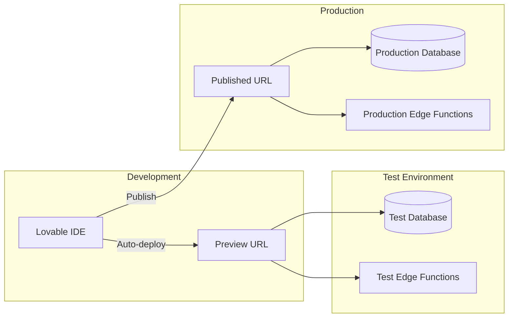

### 19.2 Deployment Pipeline

| Step | Action | Automatic |
|------|--------|-----------|
| 1 | Code change in Lovable IDE | ✅ |
| 2 | TypeScript compilation check | ✅ |
| 3 | Preview deployment | ✅ |
| 4 | Edge function deployment | ✅ |
| 5 | Database migration (user-approved) | Semi-auto |
| 6 | Production publish | Manual trigger |

### 19.3 Environment Separation

| Aspect | Test | Production |
|--------|------|-----------|
| Database | Isolated schema + data | Separate database |
| Edge Functions | Auto-deployed on save | Deployed on publish |
| Storage | Shared buckets (different paths) | Same |
| Secrets | Same configuration | Same |

---

## 20. Monitoring & Observability

### 20.1 Logging Architecture

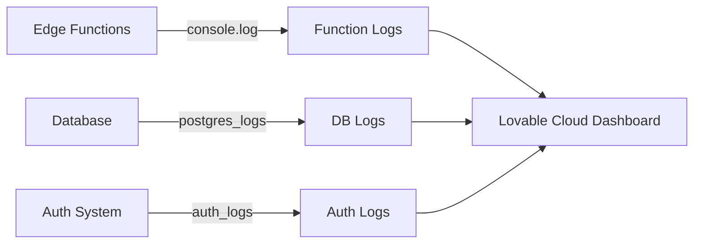

### 20.2 Audit Trail

All significant actions are logged to `audit_logs`:

```typescript
// Automatic audit logging for admin actions
await supabase.from('audit_logs').insert({
  user_id: currentUserId,
  action: 'merchant_approved',
  entity_type: 'merchant',
  entity_id: merchantId,
  old_data: { verification_status: 'pending' },
  new_data: { verification_status: 'approved' },
  ip_address: request.headers.get('x-forwarded-for'),
  user_agent: request.headers.get('user-agent'),
});
```

### 20.3 Analytics Events

User behavior tracking via `analytics_events`:

| Event Type | Data |
|-----------|------|
| `page_view` | Page path, session ID |
| `feature_used` | Feature name, duration |
| `payment_initiated` | Amount, method |
| `error_occurred` | Error code, stack trace |

---

## Appendix A: Environment Variables

| Variable | Scope | Purpose |
|----------|-------|---------|
| `SUPABASE_URL` | Edge Functions | Database connection URL |
| `SUPABASE_SERVICE_ROLE_KEY` | Edge Functions | Admin-level database access |
| `SUPABASE_ANON_KEY` | Edge Functions | User-level database access |
| `XENDIT_SECRET_KEY` | Edge Functions | Xendit API authentication |
| `XENDIT_WEBHOOK_TOKEN` | Edge Functions | Webhook verification |
| `RESEND_API_KEY` | Edge Functions | Email sending |
| `ADMIN_SETUP_SECRET` | Edge Functions | Admin bootstrap secret |
| `VITE_SUPABASE_URL` | Frontend | Client-side Supabase URL |
| `VITE_SUPABASE_PUBLISHABLE_KEY` | Frontend | Client-side anon key |

## Appendix B: Skills Applied

| Skill | Application |
|-------|------------|
| `supabase-postgres-best-practices` | RLS design, connection pooling, indexing strategy |
| `api-security-best-practices` | JWT auth, webhook security, input validation, CORS |
| `api-design-principles` | Error handling, response format, pagination |
| `payment-integration` | Xendit webhook idempotency, fee calculation, PCI notes |
| `billing-automation` | Invoice lifecycle, subscription billing, cron scheduling |
| `referral-program` | Commission flow, multi-tier rewards |
| `clean-architecture` | Feature module structure, layer separation |
| `database-design` | Schema design, relationships, indexing |
| `architecture-patterns` | Serverless modular monolith, event-driven |
| `web-performance-optimization` | Code splitting, caching, lazy loading |
| `sql-optimization-patterns` | Composite indexes, partial indexes, JSONB |
| `pci-compliance` | No card storage, tokenized payments, redirect model |
| `auth-implementation-patterns` | RBAC, 2FA, invitation flow |
| `security-auditor` | Audit trail, immutable logs |
| `frontend-security-coder` | XSS prevention, DOMPurify |
| `react-patterns` | Custom hooks, compound components, context providers |
| `design-system-patterns` | Tailwind tokens, shadcn/ui variants |
