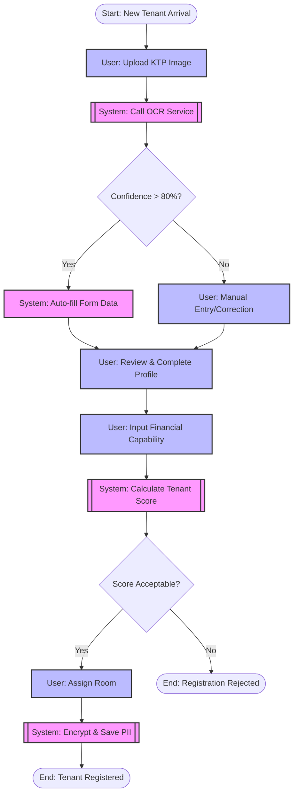
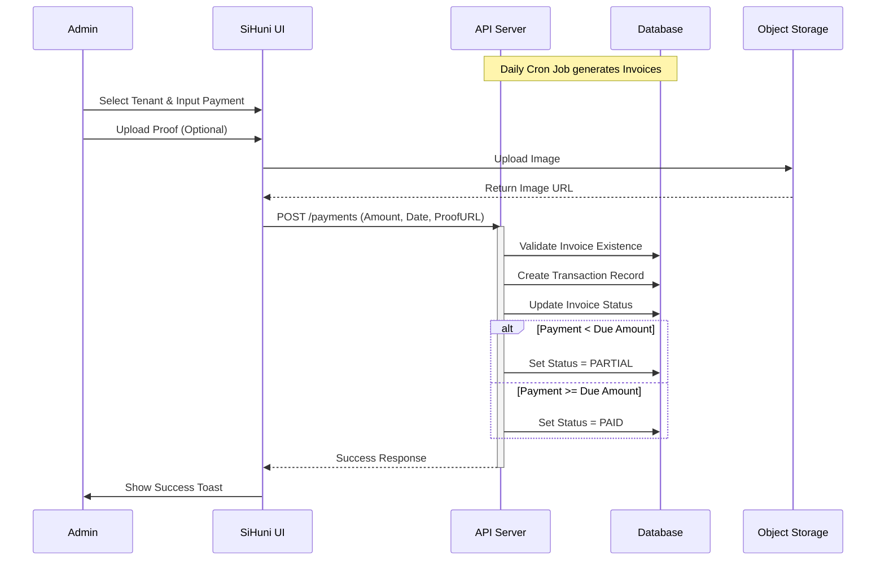
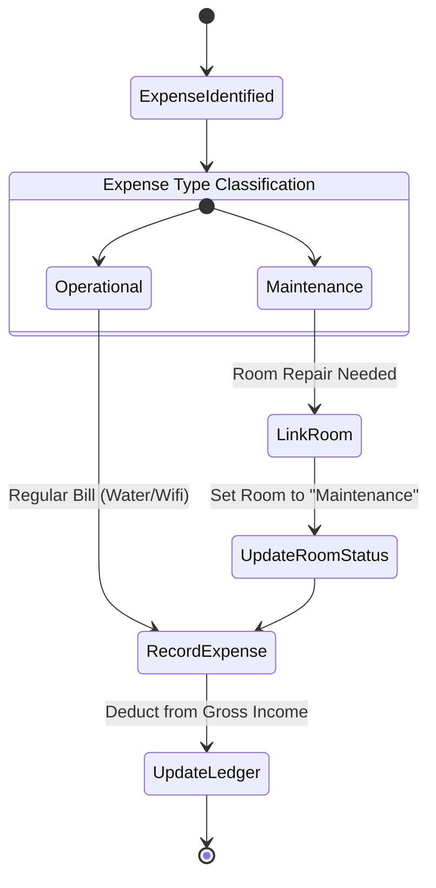
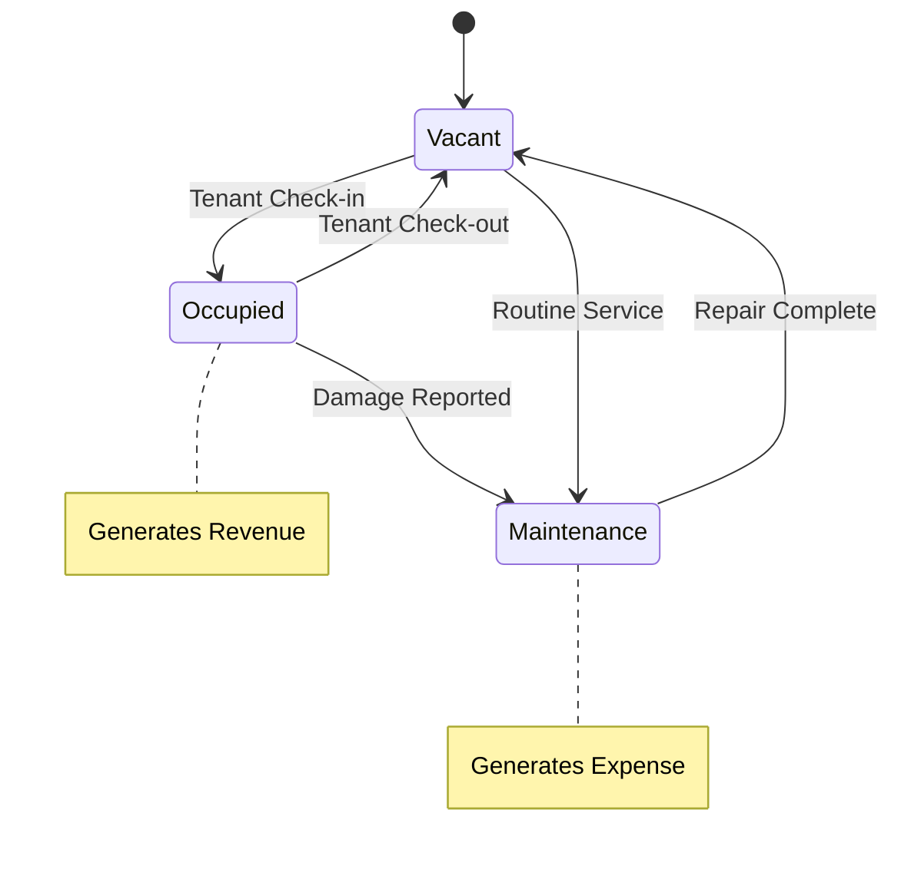
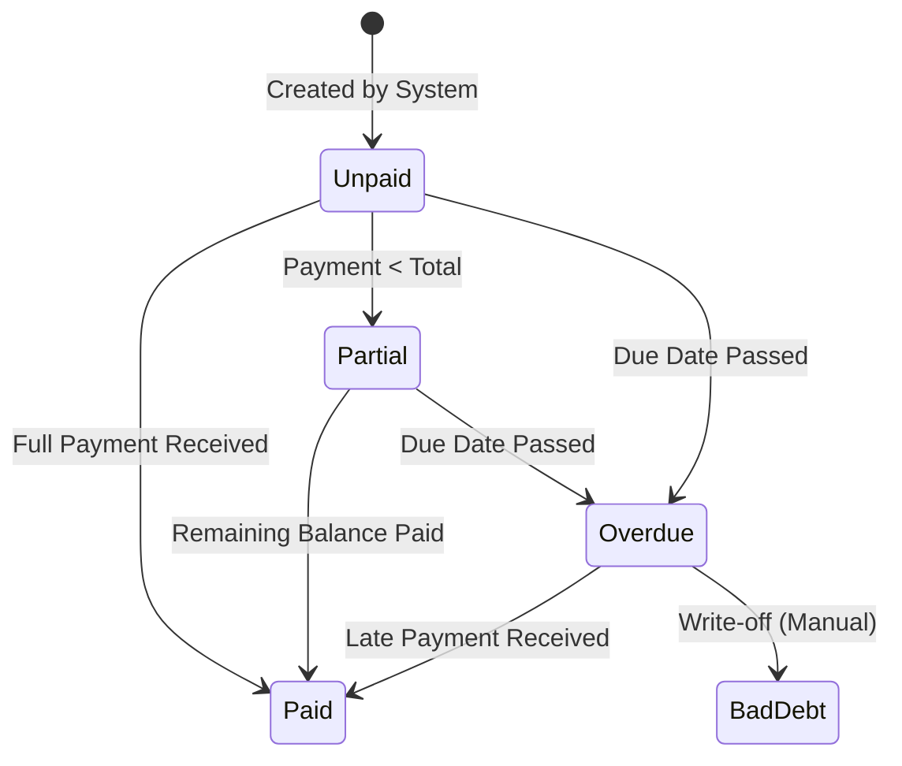

# Business Process Documentation - SiHuni DSS

**Version:** 1.0
**Last Updated:** 2026-02-22
**Status:** Draft
**Document ID:** DOC-BP-001

## 1. Introduction

This document details the core business processes for the **Sistem Pendukung Keputusan (DSS) Manajemen Kosan (SiHuni)**. It serves as the bridge between the Product Requirements Document (PRD) and the technical implementation, mapping functional requirements to executable workflows.

All processes are designed to support the core value proposition: **"Efficiency, Accuracy, and Trust"**, aligning with the UI/UX design philosophy.

### 1.1 Scope
The scope includes all end-to-end workflows for:
1.  Tenant Onboarding & Identity Verification (OCR-based)
2.  Monthly Payment Collection & Validation
3.  Expense Tracking & Maintenance
4.  Occupancy Management
5.  Decision Support (Reporting)

### 1.2 References
*   `PRD_DSS_Manajemen_Kosan_v2_Professional.md`
*   `UIUX_Design_Documentation_SiHuni.md`
*   `security-architecture.md` (Role definitions)

---

## 2. Actors & Roles

The following actors trigger or participate in the business processes.

| Actor | Description | Key Responsibilities |
| :--- | :--- | :--- |
| **Owner (Pemilik Kos)** | Super Admin | View strategic reports, approve sensitive overrides, manage staff. |
| **Admin/Staff** | Operational User | Execute daily tasks (onboarding, payment validation), manage expenses. |
| **Tenant (Penyewa)** | End User | Submit data, pay rent, request maintenance (future scope interaction). |
| **System (SiHuni)** | Automated Actor | Perform OCR, calculate statuses, generate alerts, validate logic. |
| **External OCR Service** | API Service | Extract text from KTP images (FR-1.3). |

---

## 3. Core Business Processes

### 3.1 Tenant Onboarding (Pencatatan Penghuni Baru)

**PRD Reference:** FR-1 (Manajemen Data Penghuni), FR-2 (Sistem Penilaian Calon Penghuni)
**Goal:** Register a new tenant efficiently while ensuring data accuracy via OCR and assessing reliability.

#### 3.1.1 Process Narrative
1.  Admin initiates a new tenant entry.
2.  Admin uploads the tenant's KTP (Identity Card).
3.  **System** automatically processes the image using OCR (FR-1.3).
4.  **System** populates the form with extracted data (NIK, Name, DOB, Address).
5.  Admin verifies the extracted data against the physical card image (FR-1.5).
6.  Admin inputs additional non-KTP data (Phone, Emergency Contact, Work/University).
7.  Admin inputs "Potensi Pembayaran" (Financial Capability) for scoring (FR-2.1).
8.  **System** calculates a "Tenant Score" (FR-2.3) to aid the decision.
9.  Admin assigns a room and confirms the check-in.

#### 3.1.2 Workflow Diagram (BPMN)

#### 3.1.3 Exception Handling
*   **OCR Failure:** If the OCR service is down or returns illegible data, the system must allow full manual entry.
*   **Duplicate NIK:** System checks if the NIK already exists. If active, block registration. If historical (past tenant), prompt to reactivate profile.

---

### 3.2 Monthly Payment Collection (Pencatatan Pembayaran Sewa)

**PRD Reference:** FR-3 (Pencatatan Transaksi Pembayaran)
**Goal:** Record rent payments accurate and maintain financial health.

#### 3.2.1 Process Narrative
1.  **System** generates billing invoices automatically on the due date.
2.  Tenant pays (Cash/Transfer).
3.  Admin records the payment in the system.
    *   *If Transfer:* Admin uploads proof of payment.
4.  **System** validates the amount against the due balance.
5.  **System** updates the payment status to "Paid" or "Partial".
6.  **System** updates the financial dashboard.

#### 3.2.2 Workflow Diagram

---

### 3.3 Expense & Maintenance Tracking

**PRD Reference:** FR-4 (Manajemen Pengeluaran), FR-5 (Laporan Keuangan)
**Goal:** Track operational costs to calculate Net Operating Income.

#### 3.3.1 Process Narrative
1.  Admin identifies an expense (Utility bill, Repair, Supplies).
2.  Admin logs the expense category, amount, and date.
3.  If related to a specific room (Maintenance), Admin links the expense to the Room ID.
4.  **System** updates the Room Status (e.g., if "Repair" -> "Under Maintenance").
5.  **System** recalculates the monthly Net Income.

#### 3.3.2 Workflow Diagram

---

### 3.4 Decision Support: Occupancy & Revenue Analysis

**PRD Reference:** FR-5 (Laporan), FR-2.3 (Scoring)
**Goal:** Provide actionable insights for the Owner.

#### 3.4.1 Logic Flow for Alerts
The system continuously monitors specific metrics to trigger alerts (NFR-Reliability):

1.  **Late Payment Alert:**
    *   `IF (CurrentDate > InvoiceDueDate) AND (Status != PAID)`
    *   `THEN` Trigger Notification to Admin.

2.  **Low Occupancy Warning:**
    *   `IF (OccupiedRooms / TotalRooms < 50%)`
    *   `THEN` Highlight in Dashboard (Red Indicator).

3.  **Tenant Reliability Score Update:**
    *   `Trigger:` Monthly Payment Recorded.
    *   `Action:` Recalculate historical on-time payment percentage.
    *   `Output:` Updated Tenant Score (displayed on profile).

---

## 4. Data Lifecycle & State Machines

### 4.1 Room State Machine

Rooms transition through specific states based on business events.

### 4.2 Invoice State Machine

---

## 5. Constraints & Rules

1.  **Data Privacy (FR-Security):**
    *   KTP images must be uploaded to a private bucket.
    *   OCR processing must occur in memory or via secure temporary storage; images must not be exposed publicly.
    *   Tenant financial data is visible only to `Owner` and `Admin`.

2.  **Audit Trails:**
    *   All financial adjustments (Payment edits, Expense deletions) must be logged in the `ActivityLog` table with `ActorID`, `Timestamp`, and `Reason`.

3.  **Validation Rules:**
    *   A room cannot be assigned to a new tenant if its status is `Occupied` or `Maintenance`.
    *   Payment dates cannot be in the future.
    *   Expense amounts must be positive.

## 6. Integration Points

| Process Step | External System/Module | Data Exchange |
| :--- | :--- | :--- |
| **OCR Processing** | `Google Cloud Vision` or `Tesseract` (via Service Wrapper) | Input: Image (Base64/URL)   Output: JSON (NIK, Name, DOB) |
| **Storage** | `AWS S3` / `Supabase Storage` | Input: File Buffer   Output: Private URL |
| **Auth** | `Internal Auth Service` | Input: JWT Token   Output: User Role & Permissions |

