# Business Process Documentation - SiHuni DSS Platform

**Version:** 3.0
**Last Updated:** 2026-02-21
**Status:** Complete — DSS Layer Added
**Document ID:** DOC-BP-003

## 1. Introduction

This document details all end-to-end business processes for the **SiHuni Platform** — a comprehensive property management Decision Support System (DSS) built on Lovable Cloud. It serves as the authoritative bridge between the PRD and the technical implementation, mapping every functional requirement to executable workflows.

All processes support the core value proposition: **"Efficiency, Accuracy, and Trust"**.

### 1.1 Scope

This document covers **25+ business processes** across:

1. User Registration, Bootstrap & Authentication
2. Merchant Verification & Onboarding
3. Tenant Invitation & Onboarding (OCR-based)
4. Property & Unit Management
5. Contract Lifecycle (creation → signature → termination)
6. Invoice Generation & Billing Automation
7. Payment Collection (Xendit Integration)
8. Overdue Escalation & Collections
9. Payment Plan Management
10. Auto-Pay Execution
11. Escrow & Disbursement Engine
12. Deposit Refund Process
13. Merchant Subscription Lifecycle
14. Marketplace & Order Management
15. Maintenance Request Workflow
16. Referral Program
17. Dispute Resolution
18. Forum & Community Moderation
19. AI Chatbot Operations
20. Notification System
21. Audit & Compliance
22. **DSS — OCR Document Processing** *(NEW v3.0)*
23. **DSS — ML Predictive Analytics** *(NEW v3.0)*
24. **DSS — AI Decision Support Advisors** *(NEW v3.0)*

### 1.2 References

- `docs/api-specification.md` — Edge function endpoints & payloads
- `docs/backend-architecture.md` — Technical architecture & infrastructure
- `docs/security-architecture.md` — Role definitions & RLS policies

---

## 2. Actors & Roles

| Actor | Description | Key Responsibilities |
| :--- | :--- | :--- |
| **Super Admin** | Platform owner with unrestricted access | Strategic reports, system configuration, manage admins |
| **Admin** | Operational administrator | Merchant verification, tenant management, dispute resolution, forum moderation, escrow review |
| **Merchant (Pemilik Kos)** | Property owner | Manage properties, contracts, invoices, escrow, tenants, vendors |
| **Tenant (Penyewa)** | End user / renter | Pay rent, submit maintenance requests, forum participation, AI chatbot |
| **Vendor** | Service/product provider | Marketplace products, fulfill orders, maintenance jobs |
| **System (Cron Jobs)** | 14 automated jobs (12 daily + 2 DSS) | Invoice generation, overdue checks, subscription billing, disbursement scheduling, ML risk scoring, revenue forecasting |
| **Xendit (Payment Gateway)** | External payment processor | Invoice creation, payment callbacks, disbursement execution |
| **Resend (Email Service)** | Transactional email provider | 30+ email templates for notifications, receipts, reminders |

---

## 3. Core Business Processes

### 3.1 User Registration & Bootstrap

**Edge Functions:** `ensure-user-bootstrap`, `validate-admin-secret`
**Goal:** Register users and automatically provision role-specific resources.

#### 3.1.1 Process Narrative

1. User registers via email/password on the platform.
2. User selects role: `merchant`, `tenant`, or `vendor`.
3. **System** calls `ensure-user-bootstrap` which:
   - Creates a `profiles` record with display name and avatar.
   - Creates role-specific record (`merchants`, `tenant_profiles`, or `vendors`).
   - For merchants: creates default escrow account and bank account placeholder.
4. User is redirected to the role-appropriate dashboard.
5. **Admin users** must complete 2FA setup via TOTP (`validate-admin-secret`).

#### 3.1.2 Workflow Diagram

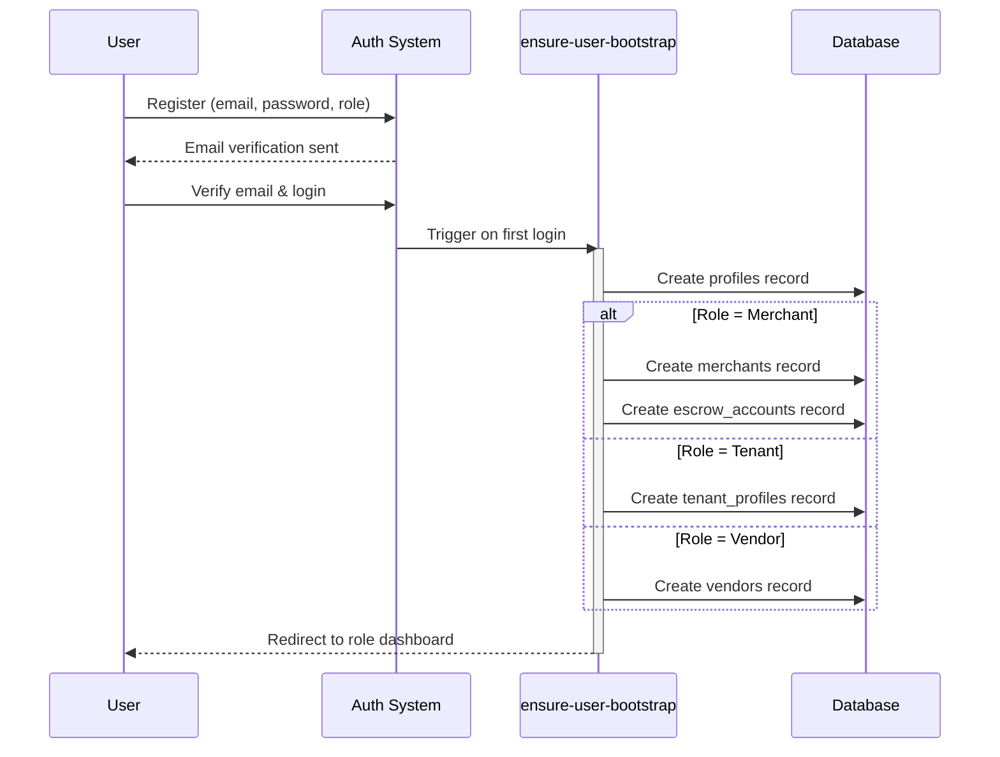
```mermaid
sequenceDiagram
    participant User
    participant Auth as Auth System
    participant Bootstrap as ensure-user-bootstrap
    participant DB as Database

    User->>Auth: Register (email, password, role)
    Auth-->>User: Email verification sent
    User->>Auth: Verify email & login
    Auth->>Bootstrap: Trigger on first login
    
    activate Bootstrap
    Bootstrap->>DB: Create profiles record
    
    alt Role = Merchant
        Bootstrap->>DB: Create merchants record
        Bootstrap->>DB: Create escrow_accounts record
    else Role = Tenant
        Bootstrap->>DB: Create tenant_profiles record
    else Role = Vendor
        Bootstrap->>DB: Create vendors record
    end
    
    Bootstrap-->>User: Redirect to role dashboard
    deactivate Bootstrap
```

#### 3.1.3 Admin 2FA Setup

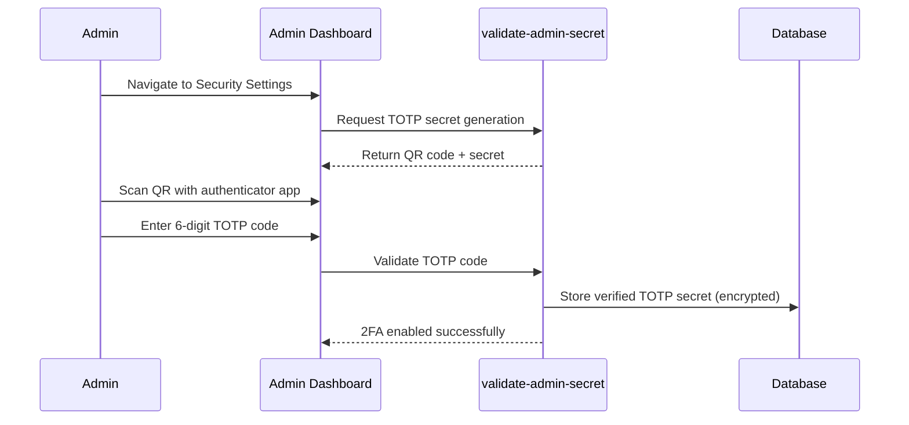
```mermaid
sequenceDiagram
    participant Admin
    participant UI as Admin Dashboard
    participant API as validate-admin-secret
    participant DB as Database

    Admin->>UI: Navigate to Security Settings
    UI->>API: Request TOTP secret generation
    API-->>UI: Return QR code + secret
    Admin->>UI: Scan QR with authenticator app
    Admin->>UI: Enter 6-digit TOTP code
    UI->>API: Validate TOTP code
    API->>DB: Store verified TOTP secret (encrypted)
    API-->>UI: 2FA enabled successfully
```

---

### 3.2 Merchant Verification Workflow

**Tables:** `merchants`, `merchant_verifications`, `merchant_verification_history`
**Goal:** Verify merchant identity and business legitimacy before enabling full platform access.

#### 3.2.1 Process Narrative

1. Merchant uploads verification documents (KTP, business license, etc.).
2. Documents are stored in private Supabase Storage bucket.
3. **System** creates `merchant_verifications` records for each document.
4. Admin reviews documents in the verification queue.
5. Admin decides: **Approve**, **Reject**, or **Request Resubmission**.
6. **System** logs action in `merchant_verification_history`.
7. If approved: merchant `verification_status` → `verified`, full features unlocked.
8. If rejected: merchant receives rejection reason and resubmission instructions.

#### 3.2.2 State Diagram

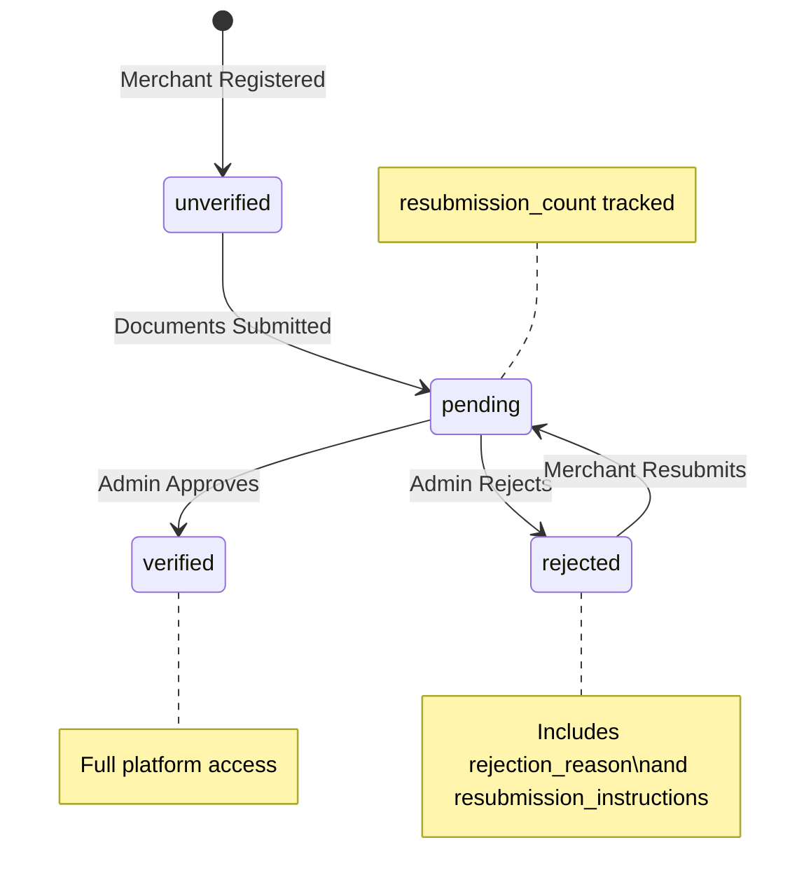
```mermaid
stateDiagram-v2
    [*] --> unverified: Merchant Registered
    
    unverified --> pending: Documents Submitted
    pending --> verified: Admin Approves
    pending --> rejected: Admin Rejects
    
    rejected --> pending: Merchant Resubmits
    
    Note right of verified: Full platform access
    Note right of rejected: Includes rejection_reason\nand resubmission_instructions
    Note left of pending: resubmission_count tracked
```

#### 3.2.3 Exception Handling

- **Resubmission Limit:** System tracks `resubmission_count`. After 3 failed attempts, admin manual review required.
- **Document Expiry:** Business license expiry checked; merchant notified 30 days before expiry.

---

### 3.3 Tenant Invitation & Onboarding

**Edge Functions:** `get-tenant-invitation`, `accept-tenant-invitation`
**Goal:** Streamline tenant onboarding via merchant-initiated invitations with automatic contract and invoice creation.

#### 3.3.1 Process Narrative

1. Merchant creates a tenant invitation (name, email, unit, rent amount, dates).
2. **System** generates a unique invitation token and sends email via Resend.
3. Tenant clicks invitation link → `get-tenant-invitation` validates token (public, no auth required).
4. Tenant registers on the platform using the invitation link.
5. Tenant calls `accept-tenant-invitation` which atomically:
   - Creates `tenant_profiles` record linked to merchant.
   - Creates `contracts` record (status: `active`).
   - Generates initial invoice(s) based on billing day.
   - Updates unit status to `occupied`.
   - Sends confirmation email to both tenant and merchant.

#### 3.3.2 Workflow Diagram

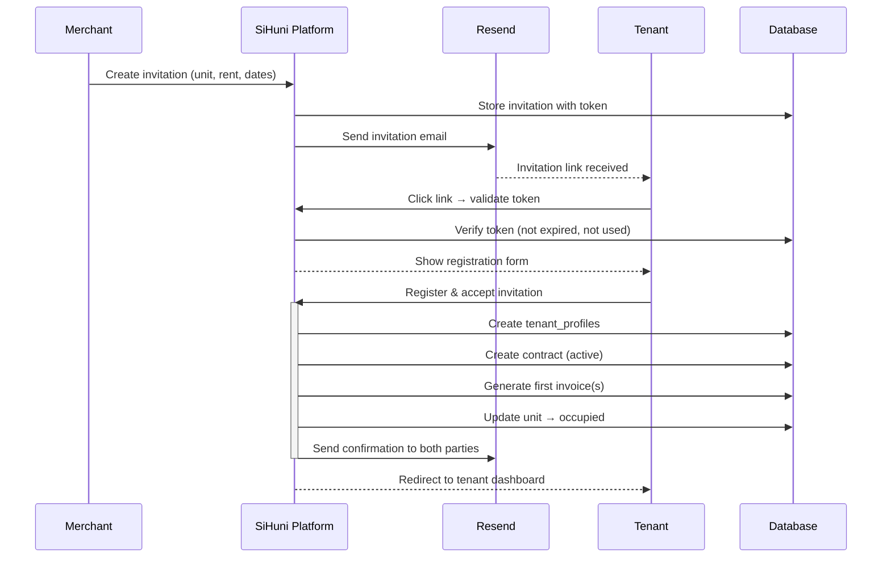
```mermaid
sequenceDiagram
    participant Merchant
    participant System as SiHuni Platform
    participant Email as Resend
    participant Tenant
    participant DB as Database

    Merchant->>System: Create invitation (unit, rent, dates)
    System->>DB: Store invitation with token
    System->>Email: Send invitation email
    Email-->>Tenant: Invitation link received

    Tenant->>System: Click link → validate token
    System->>DB: Verify token (not expired, not used)
    System-->>Tenant: Show registration form

    Tenant->>System: Register & accept invitation
    
    activate System
    System->>DB: Create tenant_profiles
    System->>DB: Create contract (active)
    System->>DB: Generate first invoice(s)
    System->>DB: Update unit → occupied
    System->>Email: Send confirmation to both parties
    deactivate System
    
    System-->>Tenant: Redirect to tenant dashboard
```

#### 3.3.3 KTP OCR Integration

When admin manually onboards a tenant:

1. Admin uploads KTP (Identity Card) image.
2. **System** processes via OCR service → extracts NIK, Name, DOB, Address.
3. Form auto-populated with extracted data (confidence > 80%).
4. Admin verifies against physical card and corrects if needed.
5. KTP image stored in private storage bucket (never publicly exposed).

---

### 3.4 Property & Unit Management

**Tables:** `properties`, `units`
**Edge Functions:** `vacancy-tracking-cron`
**Goal:** Manage property portfolio and track unit occupancy.

#### 3.4.1 Process Narrative

1. Merchant creates a property (name, address, city, type, amenities, photos).
2. Merchant adds units to the property (unit number, floor, type, rent amount, deposit).
3. Units start in `vacant` status.
4. **System** runs `vacancy-tracking-cron` daily to:
   - Track vacancy duration per unit.
   - Calculate occupancy rates per property.
   - Flag properties with < 50% occupancy for dashboard alerts.

#### 3.4.2 Unit State Machine

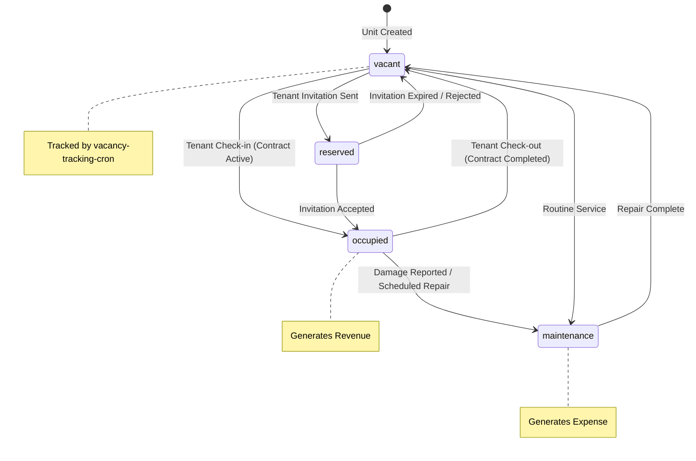
```mermaid
stateDiagram-v2
    [*] --> vacant: Unit Created
    
    vacant --> occupied: Tenant Check-in (Contract Active)
    occupied --> vacant: Tenant Check-out (Contract Completed)
    
    occupied --> maintenance: Damage Reported / Scheduled Repair
    vacant --> maintenance: Routine Service
    
    maintenance --> vacant: Repair Complete
    
    vacant --> reserved: Tenant Invitation Sent
    reserved --> occupied: Invitation Accepted
    reserved --> vacant: Invitation Expired / Rejected
    
    Note right of occupied: Generates Revenue
    Note right of maintenance: Generates Expense
    Note right of vacant: Tracked by vacancy-tracking-cron
```

---

### 3.5 Contract Lifecycle

**Tables:** `contracts`, `early_termination_requests`, `move_out_inspections`, `deposit_refunds`
**Goal:** Manage the full lifecycle of rental agreements from draft to completion.

#### 3.5.1 Process Narrative

1. Contract created (manually or via tenant invitation) with: unit, rent amount, dates, deposit, terms.
2. Merchant signs digitally → signature uploaded to storage → `merchant_signed`.
3. Tenant signs digitally → `fully_signed` → contract status becomes `active`.
4. **System** auto-generates monthly invoices based on `billing_day`.
5. Contract can transition to `notice` when:
   - Tenant submits move-out notice (respecting `notice_period_days`).
   - Early termination requested (penalty calculated via `early_termination_penalty_rate`).
6. Move-out process: inspection → deductions → deposit refund.
7. Contract ends: `completed` (natural end) or `terminated` (early termination).

#### 3.5.2 State Diagram

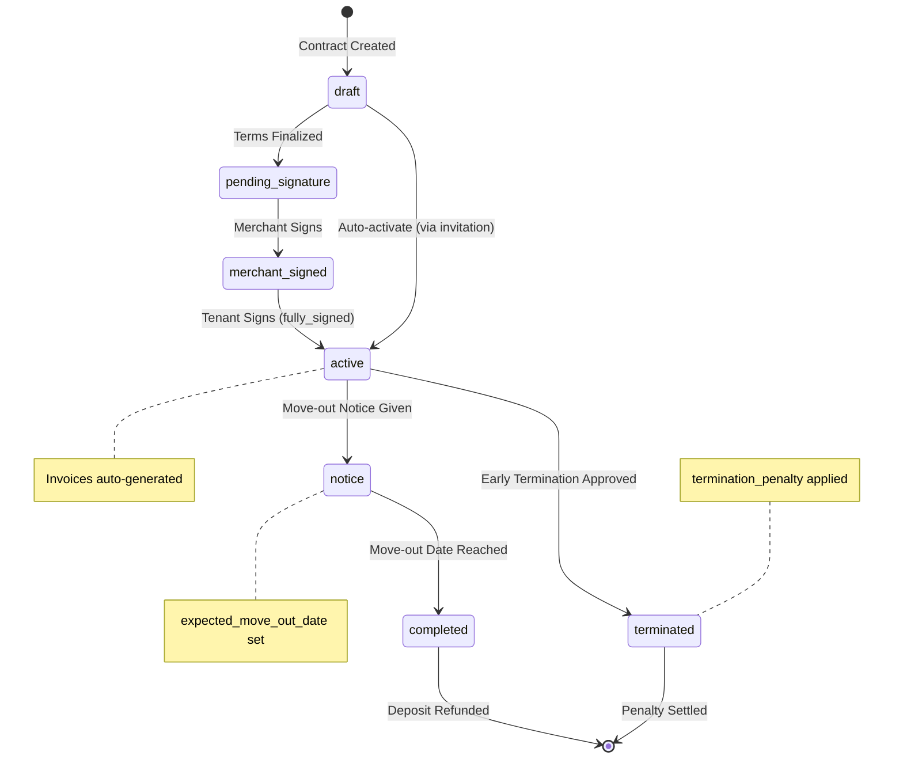
```mermaid
stateDiagram-v2
    [*] --> draft: Contract Created
    
    draft --> pending_signature: Terms Finalized
    pending_signature --> merchant_signed: Merchant Signs
    merchant_signed --> active: Tenant Signs (fully_signed)
    
    draft --> active: Auto-activate (via invitation)
    
    active --> notice: Move-out Notice Given
    notice --> completed: Move-out Date Reached
    
    active --> terminated: Early Termination Approved
    
    completed --> [*]: Deposit Refunded
    terminated --> [*]: Penalty Settled
    
    Note right of active: Invoices auto-generated
    Note right of notice: expected_move_out_date set
    Note left of terminated: termination_penalty applied
```

#### 3.5.3 Signature Flow

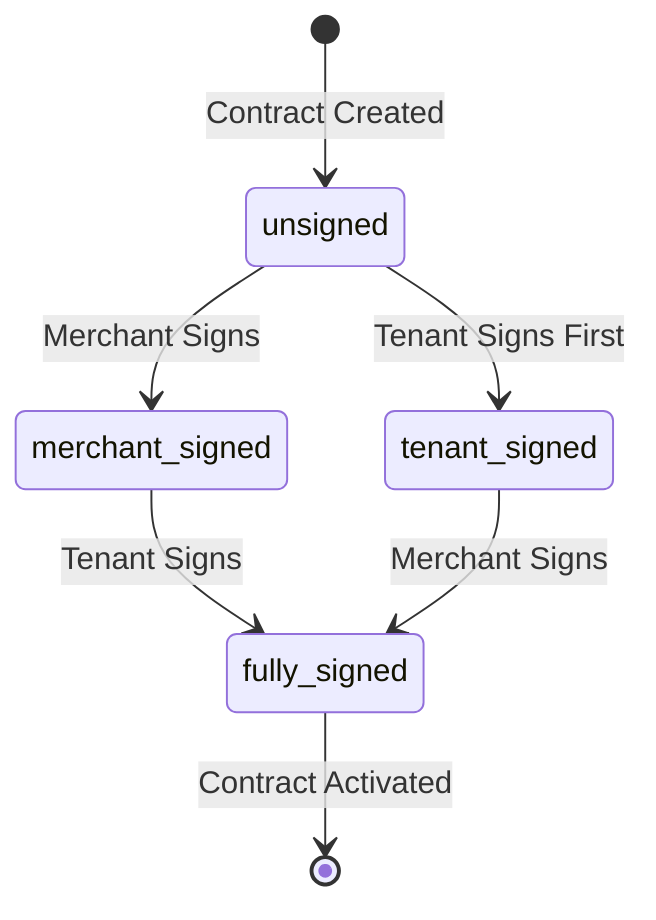
```mermaid
stateDiagram-v2
    [*] --> unsigned: Contract Created
    
    unsigned --> merchant_signed: Merchant Signs
    unsigned --> tenant_signed: Tenant Signs First
    
    merchant_signed --> fully_signed: Tenant Signs
    tenant_signed --> fully_signed: Merchant Signs
    
    fully_signed --> [*]: Contract Activated
```

#### 3.5.4 Early Termination Process

1. Tenant submits `early_termination_requests` with reason and requested date.
2. **System** calculates penalty: `remaining_months × rent × early_termination_penalty_rate`.
3. Merchant reviews: approve (with penalty), deny, or counter-offer.
4. If approved: contract status → `terminated`, penalty invoiced.

#### 3.5.5 Move-Out & Deposit Refund

1. Tenant gives notice → `move_out_notice_given = true`, `expected_move_out_date` set.
2. Merchant schedules inspection → `move_out_inspections` created.
3. Inspector documents condition (photos, deduction details).
4. **System** calculates: `refund_amount = original_deposit - total_deductions`.
5. `deposit_refunds` record created → status: `pending`.
6. Tenant provides bank details → status: `pending_bank_details` → `processing`.
7. `process-deposit-refund` triggers Xendit disbursement → `refunded`.

---

### 3.6 Invoice Generation & Billing Automation

**Edge Functions:** `auto-generate-invoices`
**Tables:** `invoices`, `late_fee_records`
**Goal:** Automate monthly rent invoicing with grace periods and late fees.

#### 3.6.1 Auto-Generation Logic

The `auto-generate-invoices` cron runs daily and:

1. Queries all `active` contracts where today matches `billing_day`.
2. Checks no duplicate invoice exists for the current billing period.
3. Creates invoice with:
   - `invoice_number`: auto-generated sequential number.
   - `amount`: contract `rent_amount`.
   - `due_date`: billing_day of current month.
   - `status`: `pending`.
4. Sends notification to tenant (in-app + email).

#### 3.6.2 Late Fee Calculation

When an invoice becomes overdue (past `due_date + grace_period_days`):

1. **System** checks contract's `late_fee_type`:
   - `percentage`: `late_fee = amount × late_payment_penalty_rate × days_overdue`
   - `fixed`: `late_fee = fixed_amount_per_day × days_overdue`
2. Creates `late_fee_records` entry.
3. Updates invoice: `total_amount = original_amount + late_fee`.

#### 3.6.3 Invoice State Machine

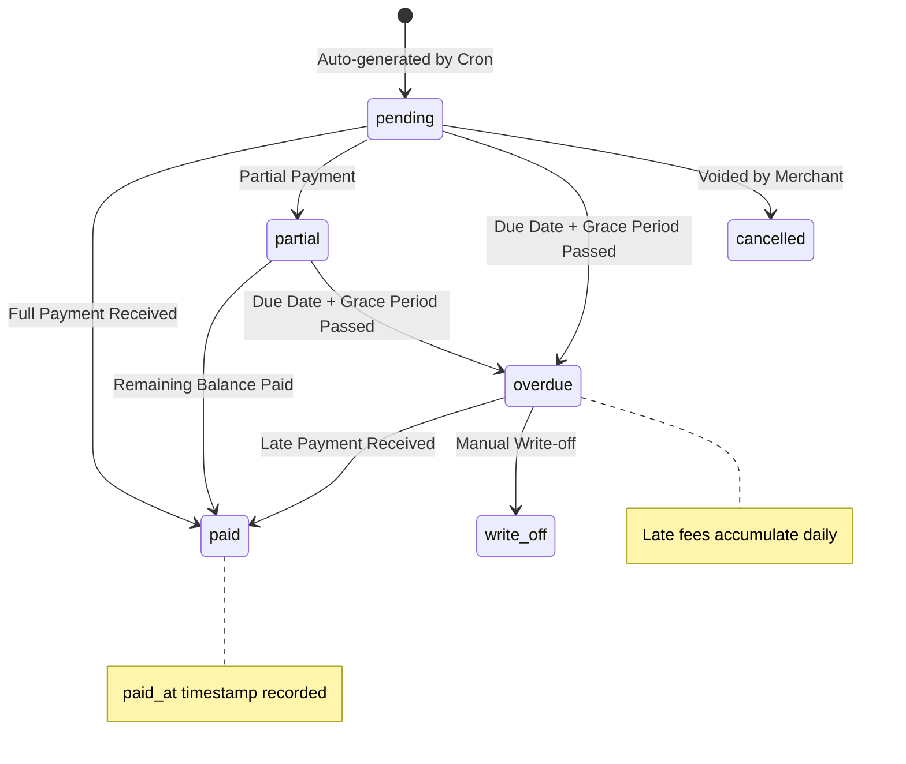
```mermaid
stateDiagram-v2
    [*] --> pending: Auto-generated by Cron
    
    pending --> paid: Full Payment Received
    pending --> partial: Partial Payment
    pending --> overdue: Due Date + Grace Period Passed
    
    partial --> paid: Remaining Balance Paid
    partial --> overdue: Due Date + Grace Period Passed
    
    overdue --> paid: Late Payment Received
    overdue --> write_off: Manual Write-off
    
    pending --> cancelled: Voided by Merchant
    
    Note right of overdue: Late fees accumulate daily
    Note right of paid: paid_at timestamp recorded
```

#### 3.6.4 Auto-Generation Flowchart

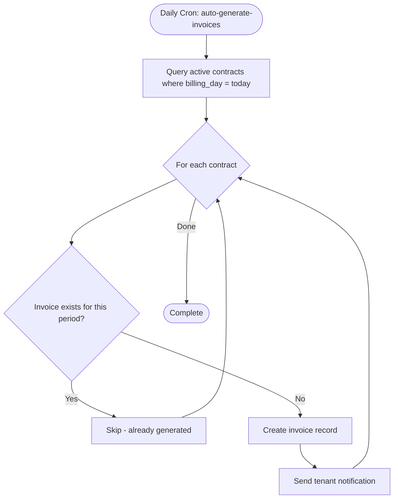
```mermaid
flowchart TD
    Start([Daily Cron: auto-generate-invoices])
    QueryContracts[Query active contracts where billing_day = today]
    Loop{For each contract}
    CheckDuplicate{Invoice exists for this period?}
    Skip[Skip - already generated]
    CreateInvoice[Create invoice record]
    SendNotification[Send tenant notification]
    End([Complete])

    Start --> QueryContracts
    QueryContracts --> Loop
    Loop --> CheckDuplicate
    CheckDuplicate -- Yes --> Skip
    CheckDuplicate -- No --> CreateInvoice
    CreateInvoice --> SendNotification
    SendNotification --> Loop
    Skip --> Loop
    Loop -- Done --> End
```

---

### 3.7 Payment Collection (Xendit Integration)

**Edge Functions:** `xendit-create-invoice`, `xendit-webhook`
**Tables:** `invoices`, `escrow_transactions`, `escrow_accounts`
**Goal:** Process rent payments securely via Xendit with automatic escrow deposit.

#### 3.7.1 Process Narrative

1. Tenant selects invoice and clicks "Pay Now".
2. Frontend calls `xendit-create-invoice` which:
   - Calculates fees: `platform_fee = amount × 1%`, `gateway_fee = amount × 2.5%`.
   - Creates Xendit invoice via API (`POST /v2/invoices`).
   - Returns payment URL with available methods (VA, e-wallet, QRIS).
3. Tenant completes payment on Xendit's hosted page.
4. Xendit sends webhook callback to `xendit-webhook`.
5. **System** processes webhook:
   - Verifies webhook signature (timing-safe comparison).
   - Checks idempotency (prevents duplicate processing).
   - Updates invoice status → `paid`, records `paid_at`.
   - Creates `escrow_transactions` record (type: `payment_received`).
   - Updates `escrow_accounts` balance: `balance += net_amount`.
   - Sends payment confirmation to tenant and merchant.

#### 3.7.2 Fee Calculation

```
gross_amount    = invoice.total_amount
platform_fee    = gross_amount × 0.01      (1%)
gateway_fee     = gross_amount × 0.025     (2.5%)
net_amount      = gross_amount - platform_fee - gateway_fee
```

#### 3.7.3 Sequence Diagram

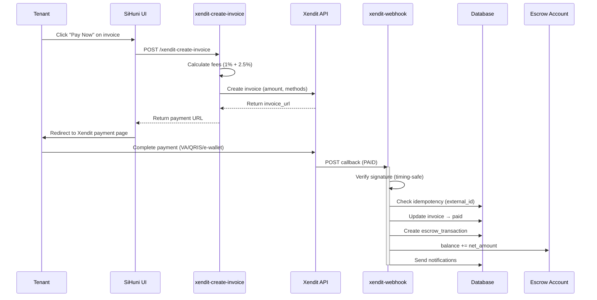
```mermaid
sequenceDiagram
    participant Tenant
    participant UI as SiHuni UI
    participant API as xendit-create-invoice
    participant Xendit as Xendit API
    participant Webhook as xendit-webhook
    participant DB as Database
    participant Escrow as Escrow Account

    Tenant->>UI: Click "Pay Now" on invoice
    UI->>API: POST /xendit-create-invoice
    API->>API: Calculate fees (1% + 2.5%)
    API->>Xendit: Create invoice (amount, methods)
    Xendit-->>API: Return invoice_url
    API-->>UI: Return payment URL
    UI->>Tenant: Redirect to Xendit payment page
    
    Tenant->>Xendit: Complete payment (VA/QRIS/e-wallet)
    
    Xendit->>Webhook: POST callback (PAID)
    activate Webhook
    Webhook->>Webhook: Verify signature (timing-safe)
    Webhook->>DB: Check idempotency (external_id)
    Webhook->>DB: Update invoice → paid
    Webhook->>DB: Create escrow_transaction
    Webhook->>Escrow: balance += net_amount
    Webhook->>DB: Send notifications
    deactivate Webhook
```

---

### 3.8 Overdue Escalation Process

**Edge Functions:** `check-overdue-escalation`
**Tables:** `invoices`, `collections_cases`, `notifications`
**Goal:** Systematically escalate overdue payments through 4 tiers.

#### 3.8.1 Escalation Tiers

| Tier | Days Overdue | Actions |
| :--- | :--- | :--- |
| **1 - Grace Period** | 1–3 days | Daily reminder (in-app only) |
| **2 - Post-Grace** | 4–7 days | Email + in-app reminder, merchant notified |
| **3 - Pre-Collection** | 8–14 days | Formal email with penalty warning, late fees applied |
| **4 - Collection** | 15+ days | Collection case created, contract flagged |

#### 3.8.2 Escalation Flowchart

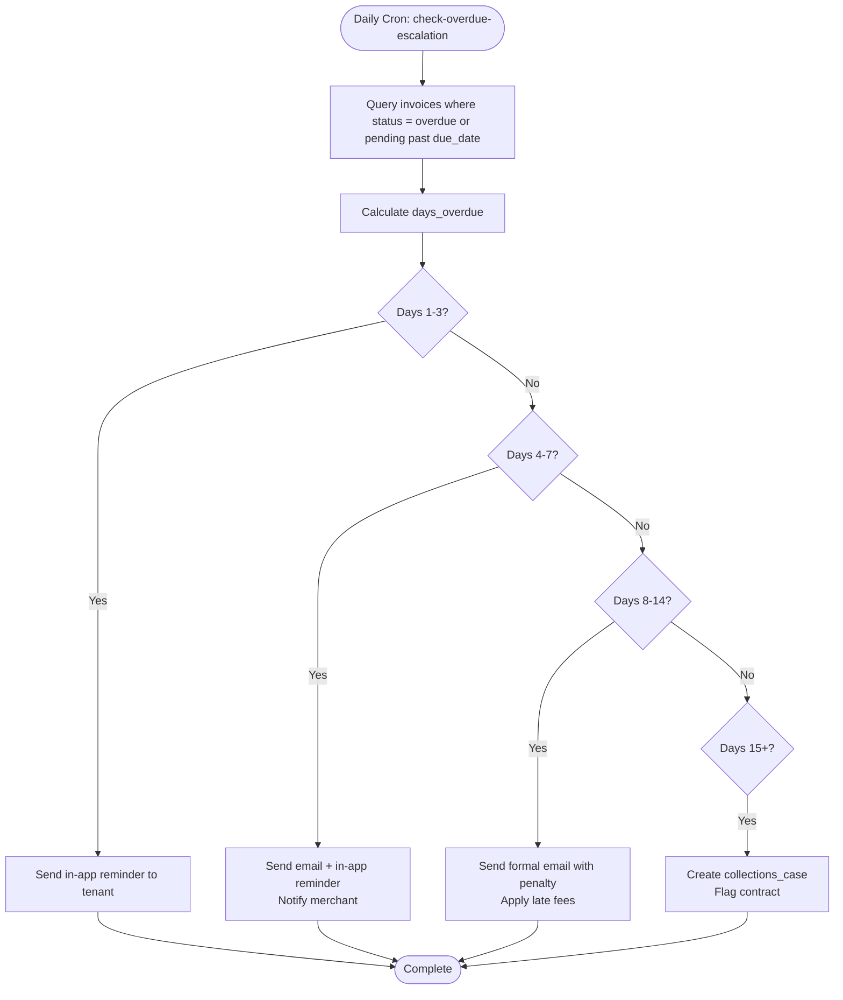
```mermaid
flowchart TD
    Start([Daily Cron: check-overdue-escalation])
    QueryOverdue[Query invoices where status = overdue or pending past due_date]
    CalcDays[Calculate days_overdue]
    
    Tier1{Days 1-3?}
    Tier2{Days 4-7?}
    Tier3{Days 8-14?}
    Tier4{Days 15+?}
    
    Action1[Send in-app reminder to tenant]
    Action2[Send email + in-app reminder\nNotify merchant]
    Action3[Send formal email with penalty\nApply late fees]
    Action4[Create collections_case\nFlag contract]
    
    End([Complete])

    Start --> QueryOverdue --> CalcDays
    CalcDays --> Tier1
    Tier1 -- Yes --> Action1 --> End
    Tier1 -- No --> Tier2
    Tier2 -- Yes --> Action2 --> End
    Tier2 -- No --> Tier3
    Tier3 -- Yes --> Action3 --> End
    Tier3 -- No --> Tier4
    Tier4 -- Yes --> Action4 --> End
```

---

### 3.9 Payment Plan Management

**Edge Functions:** `check-payment-plan`
**Tables:** `payment_plans`, `invoices`
**Goal:** Allow merchants to offer structured payment arrangements for overdue tenants.

#### 3.9.1 Process Narrative

1. Merchant creates payment plan for an overdue invoice.
2. Plan types:
   - **Installments:** Split total into N equal payments with due dates.
   - **Deferred:** Postpone full payment to a future date.
3. **System** generates child invoices for each installment.
4. `check-payment-plan` cron monitors daily:
   - If installment paid on time → continue.
   - If installment missed → auto-default the plan, revert to full balance due.

#### 3.9.2 State Diagram

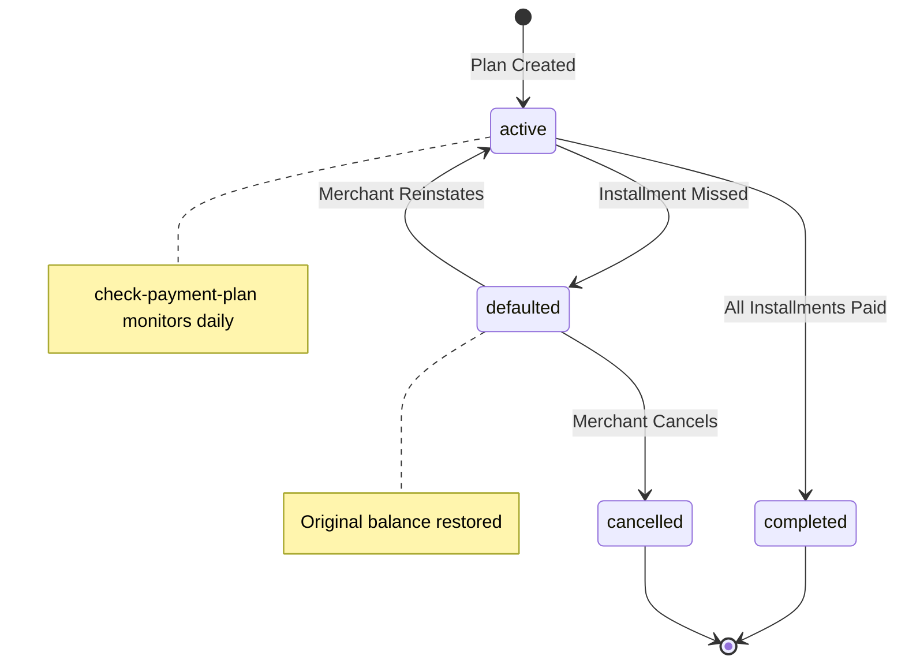
```mermaid
stateDiagram-v2
    [*] --> active: Plan Created
    
    active --> completed: All Installments Paid
    active --> defaulted: Installment Missed
    
    defaulted --> active: Merchant Reinstates
    defaulted --> cancelled: Merchant Cancels
    
    completed --> [*]
    cancelled --> [*]
    
    Note right of active: check-payment-plan monitors daily
    Note right of defaulted: Original balance restored
```

---

### 3.10 Auto-Pay Execution

**Edge Functions:** `auto-pay-execute`
**Goal:** Automatically process rent payments for enrolled tenants.

#### 3.10.1 Process Narrative

1. Tenant enables auto-pay in settings (stores payment method preference).
2. `auto-pay-execute` cron runs daily:
   - Queries tenants with auto-pay enabled.
   - Finds pending/overdue invoices due today or past due.
   - Creates Xendit invoice automatically (same flow as manual payment).
   - Sends payment link to tenant or charges saved method.

#### 3.10.2 Flowchart

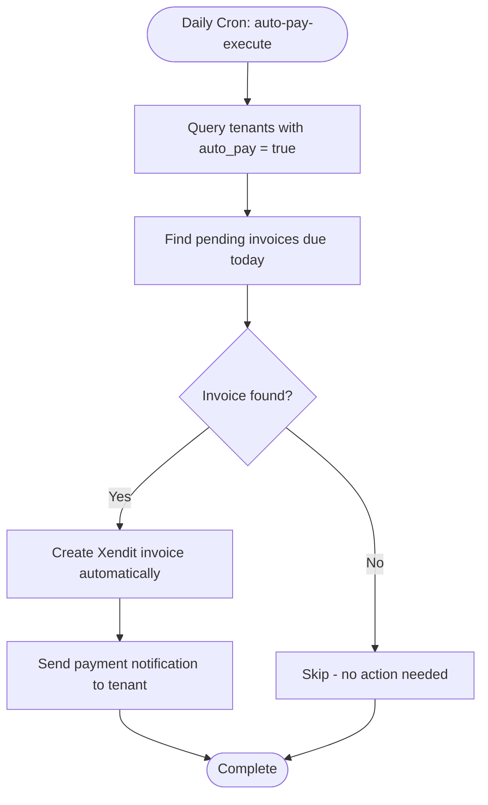
```mermaid
flowchart TD
    Start([Daily Cron: auto-pay-execute])
    Query[Query tenants with auto_pay = true]
    FindInvoices[Find pending invoices due today]
    HasInvoice{Invoice found?}
    CreateXendit[Create Xendit invoice automatically]
    Notify[Send payment notification to tenant]
    Skip[Skip - no action needed]
    End([Complete])

    Start --> Query --> FindInvoices --> HasInvoice
    HasInvoice -- Yes --> CreateXendit --> Notify --> End
    HasInvoice -- No --> Skip --> End
```

---

### 3.11 Escrow & Disbursement Engine

**Edge Functions:** `scheduled-disbursement`, `xendit-disbursement`, `xendit-disbursement-webhook`
**Tables:** `escrow_accounts`, `escrow_transactions`, `disbursements`, `bank_accounts`
**Goal:** Hold rent payments in escrow and disburse to merchants on schedule.

#### 3.11.1 Fee Structure

| Disbursement Schedule | Fee Rate |
| :--- | :--- |
| Daily | 0.25% |
| Weekly | 0.20% |
| Bi-weekly | 0.15% |
| Monthly | 0.10% |

#### 3.11.2 Process Narrative

1. Rent payments accumulate in merchant's `escrow_accounts.balance`.
2. `scheduled-disbursement` cron runs based on merchant's `disbursement_schedule`:
   - Checks if balance exceeds `min_disbursement_amount`.
   - Calculates disbursement fee based on schedule.
   - Creates `disbursements` record (status: `pending`).
   - If amount > threshold → `requires_manual_review = true`.
3. For manual review: Admin approves or rejects.
4. Upon approval: `xendit-disbursement` calls Xendit Disbursement API.
5. `xendit-disbursement-webhook` confirms completion:
   - Updates disbursement status → `completed`.
   - Deducts from escrow balance.
   - Creates `escrow_transactions` (type: `disbursement`).
   - Sends confirmation to merchant.

#### 3.11.3 Sequence Diagram

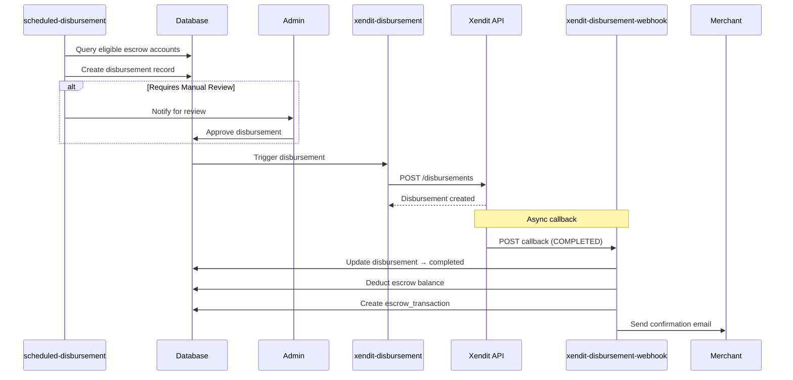
```mermaid
sequenceDiagram
    participant Cron as scheduled-disbursement
    participant DB as Database
    participant Admin
    participant Xendit as xendit-disbursement
    participant XenditAPI as Xendit API
    participant Webhook as xendit-disbursement-webhook
    participant Merchant

    Cron->>DB: Query eligible escrow accounts
    Cron->>DB: Create disbursement record
    
    alt Requires Manual Review
        Cron->>Admin: Notify for review
        Admin->>DB: Approve disbursement
    end
    
    DB->>Xendit: Trigger disbursement
    Xendit->>XenditAPI: POST /disbursements
    XenditAPI-->>Xendit: Disbursement created
    
    Note over XenditAPI,Webhook: Async callback
    
    XenditAPI->>Webhook: POST callback (COMPLETED)
    Webhook->>DB: Update disbursement → completed
    Webhook->>DB: Deduct escrow balance
    Webhook->>DB: Create escrow_transaction
    Webhook->>Merchant: Send confirmation email
```

#### 3.11.4 Disbursement State Machine

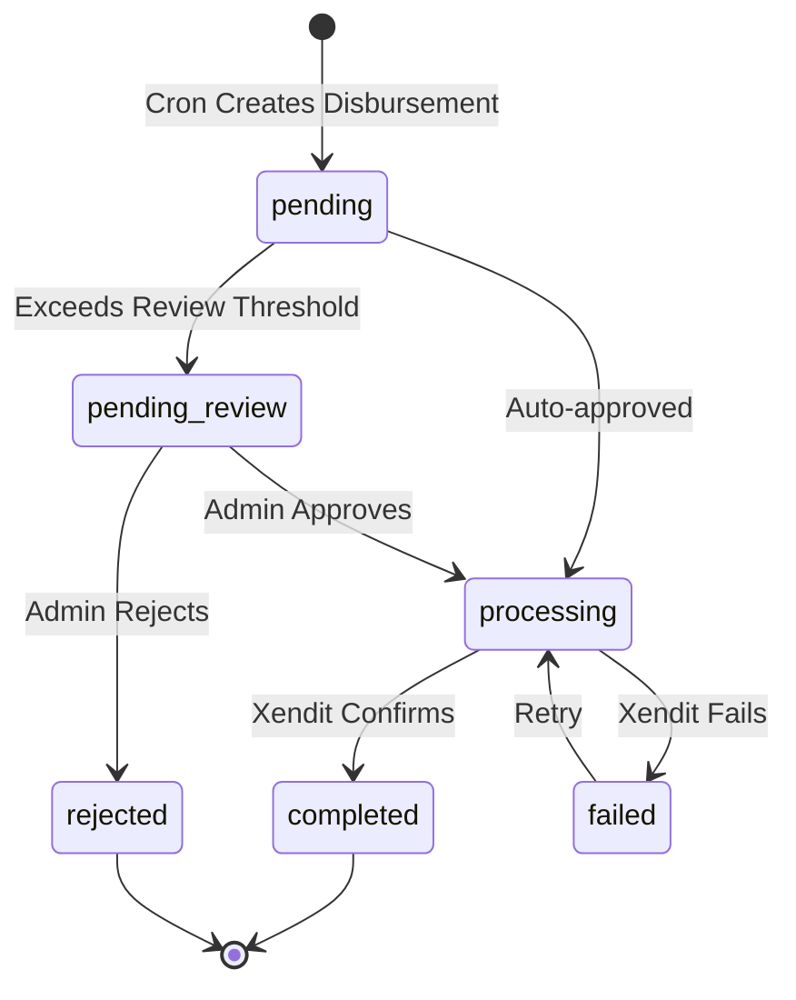
```mermaid
stateDiagram-v2
    [*] --> pending: Cron Creates Disbursement
    
    pending --> pending_review: Exceeds Review Threshold
    pending --> processing: Auto-approved
    
    pending_review --> processing: Admin Approves
    pending_review --> rejected: Admin Rejects
    
    processing --> completed: Xendit Confirms
    processing --> failed: Xendit Fails
    
    failed --> processing: Retry
    
    completed --> [*]
    rejected --> [*]
```

---

### 3.12 Deposit Refund Process

**Edge Functions:** `process-deposit-refund`
**Tables:** `deposit_refunds`, `move_out_inspections`, `deposit_disputes`
**Goal:** Calculate and process deposit refunds after tenant move-out.

#### 3.12.1 Process Narrative

1. Move-out inspection completed → deductions documented.
2. **System** calculates: `refund = original_deposit - deductions`.
3. Creates `deposit_refunds` record (status: `pending`).
4. Tenant provides bank account details → status: `pending_bank_details`.
5. `process-deposit-refund` creates Xendit disbursement → status: `processing`.
6. Xendit confirms → status: `refunded`, `refunded_at` recorded.
7. If tenant disputes deductions → `deposit_disputes` created for admin review.

#### 3.12.2 Flowchart

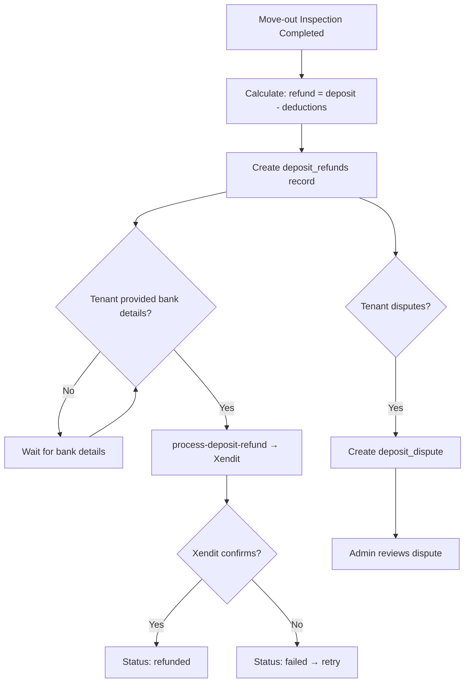
```mermaid
flowchart TD
    Inspection[Move-out Inspection Completed]
    CalcRefund[Calculate: refund = deposit - deductions]
    CreateRecord[Create deposit_refunds record]
    BankDetails{Tenant provided bank details?}
    WaitBank[Wait for bank details]
    ProcessRefund[process-deposit-refund → Xendit]
    XenditConfirm{Xendit confirms?}
    Refunded[Status: refunded]
    Failed[Status: failed → retry]
    
    Dispute{Tenant disputes?}
    CreateDispute[Create deposit_dispute]
    AdminReview[Admin reviews dispute]

    Inspection --> CalcRefund --> CreateRecord --> BankDetails
    BankDetails -- No --> WaitBank --> BankDetails
    BankDetails -- Yes --> ProcessRefund --> XenditConfirm
    XenditConfirm -- Yes --> Refunded
    XenditConfirm -- No --> Failed
    
    CreateRecord --> Dispute
    Dispute -- Yes --> CreateDispute --> AdminReview
```

---

### 3.13 Merchant Subscription Lifecycle

**Edge Functions:** `subscription-billing`, `subscription-payment`, `subscription-renewal`, `subscription-grace-check`
**Tables:** `merchant_subscriptions`, `subscription_tiers`
**Goal:** Manage tiered SaaS subscriptions for merchants.

#### 3.13.1 Tier Structure

| Tier | Features | Limits |
| :--- | :--- | :--- |
| **Free** | Basic property management | 1 property, 5 units |
| **Basic** | + Invoice automation, reports | 3 properties, 20 units |
| **Pro** | + Escrow, marketplace, AI chatbot | 10 properties, 100 units |
| **Enterprise** | Full features, priority support | Unlimited |

#### 3.13.2 Cron Jobs

| Cron | Frequency | Action |
| :--- | :--- | :--- |
| `subscription-billing` | Daily | Create billing invoices for subscriptions due today |
| `subscription-renewal` | Daily | Auto-renew subscriptions at period end |
| `subscription-grace-check` | Daily | Suspend after grace period, cancel after extended grace |

#### 3.13.3 State Diagram

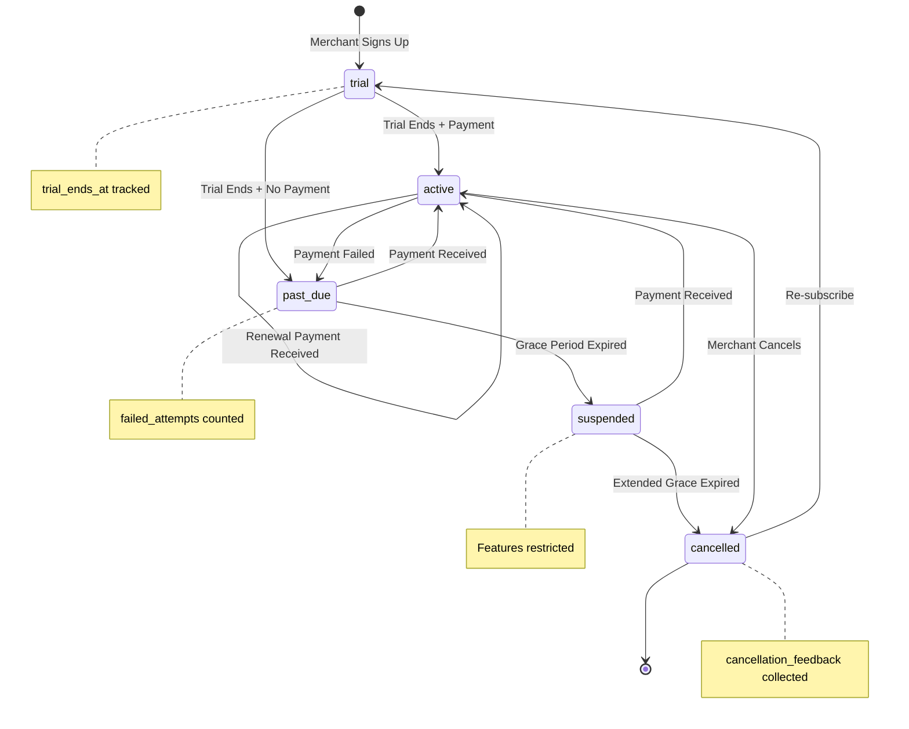
```mermaid
stateDiagram-v2
    [*] --> trial: Merchant Signs Up
    
    trial --> active: Trial Ends + Payment
    trial --> past_due: Trial Ends + No Payment
    
    active --> active: Renewal Payment Received
    active --> past_due: Payment Failed
    
    past_due --> active: Payment Received
    past_due --> suspended: Grace Period Expired
    
    suspended --> active: Payment Received
    suspended --> cancelled: Extended Grace Expired
    
    cancelled --> trial: Re-subscribe
    cancelled --> [*]
    
    active --> cancelled: Merchant Cancels
    
    Note right of trial: trial_ends_at tracked
    Note right of past_due: failed_attempts counted
    Note right of suspended: Features restricted
    Note right of cancelled: cancellation_feedback collected
```

#### 3.13.4 Feature Gating Logic

```
IF merchant.subscription_tier = 'free' THEN
    max_properties = 1
    max_units = 5
    escrow_enabled = false
    ai_chatbot = false
    dss_ocr = false
    dss_ml = false
    dss_advisors = false
ELSE IF merchant.subscription_tier = 'basic' THEN
    max_properties = 3
    max_units = 20
    escrow_enabled = false
    ai_chatbot = false
    dss_ocr = 'payment_proof_only'   -- 5/month
    dss_ml = false
    dss_advisors = false
ELSE IF merchant.subscription_tier = 'pro' THEN
    max_properties = 10
    max_units = 100
    escrow_enabled = true
    ai_chatbot = true
    dss_ocr = true                   -- KTP 10/mo, payment 50/mo, business docs
    dss_ml = 'revenue_forecast,tenant_risk'
    dss_advisors = false
ELSE IF merchant.subscription_tier = 'enterprise' THEN
    max_properties = unlimited
    max_units = unlimited
    escrow_enabled = true
    ai_chatbot = true
    dss_ocr = true                   -- Unlimited all OCR
    dss_ml = true                    -- All 4 ML models
    dss_advisors = true              -- All 4 advisors
END IF
```

#### 3.13.5 DSS Feature Gating Matrix

| DSS Feature | Free | Basic | Pro | Enterprise |
| :--- | :--- | :--- | :--- | :--- |
| OCR KTP Extract | ❌ | ❌ | 10/bulan | Unlimited |
| OCR Payment Proof | ❌ | 5/bulan | 50/bulan | Unlimited |
| OCR Business Document | ❌ | ❌ | 10/bulan | Unlimited |
| OCR Maintenance Receipt | ❌ | ❌ | 20/bulan | Unlimited |
| ML Revenue Forecast | ❌ | ❌ | ✅ | ✅ |
| ML Tenant Risk Score | ❌ | ❌ | ✅ | ✅ |
| ML Churn Prediction | ❌ | ❌ | ❌ | ✅ |
| ML Optimal Pricing | ❌ | ❌ | ❌ | ✅ |
| DSS Pricing Advisor | ❌ | ❌ | ❌ | ✅ |
| DSS Collection Strategy | ❌ | ❌ | ❌ | ✅ |
| DSS Maintenance Priority | ❌ | ❌ | ❌ | ✅ |
| DSS Investment Insight | ❌ | ❌ | ❌ | ✅ |

---

### 3.14 Marketplace & Order Management

**Edge Functions:** `order-auto-reject`
**Tables:** `vendor_products`, `orders`, `order_reviews`
**Goal:** Enable tenants to order products/services from vendors.

#### 3.14.1 Process Narrative

1. Vendor creates product listing (name, description, price, photos, stock).
2. Tenant browses marketplace and places order.
3. Vendor receives notification and has 48 hours to confirm.
4. If not confirmed: `order-auto-reject` cron cancels the order.
5. Vendor fulfills order → status: `in_progress` → `completed`.
6. Tenant leaves review and rating.

#### 3.14.2 Order State Machine

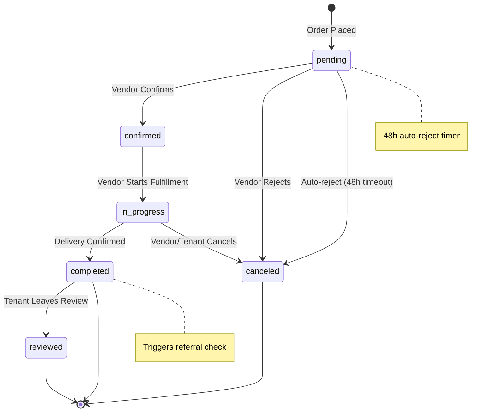
```mermaid
stateDiagram-v2
    [*] --> pending: Order Placed
    
    pending --> confirmed: Vendor Confirms
    pending --> canceled: Vendor Rejects
    pending --> canceled: Auto-reject (48h timeout)
    
    confirmed --> in_progress: Vendor Starts Fulfillment
    in_progress --> completed: Delivery Confirmed
    in_progress --> canceled: Vendor/Tenant Cancels
    
    completed --> reviewed: Tenant Leaves Review
    
    completed --> [*]
    reviewed --> [*]
    canceled --> [*]
    
    Note right of pending: 48h auto-reject timer
    Note right of completed: Triggers referral check
```

---

### 3.15 Maintenance Request Workflow

**Tables:** `maintenance_requests`, `maintenance_updates`, `maintenance_timeline`, `maintenance_reviews`
**Goal:** Manage property maintenance from request to resolution.

#### 3.15.1 Process Narrative

1. Tenant creates request: title, description, category (plumbing, electrical, etc.), priority, images.
2. Merchant receives notification, acknowledges request.
3. Merchant assigns vendor (optional) from verified vendor list.
4. Vendor/merchant works on repair → timeline entries logged.
5. Work completed → tenant notified, completion photos uploaded.
6. Tenant confirms completion and leaves review.
7. SLA deadline tracked based on priority:
   - **Urgent:** 4 hours
   - **High:** 24 hours
   - **Medium:** 48 hours
   - **Low:** 72 hours

#### 3.15.2 State Diagram

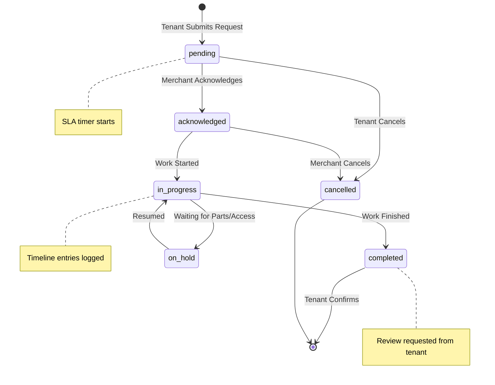
```mermaid
stateDiagram-v2
    [*] --> pending: Tenant Submits Request
    
    pending --> acknowledged: Merchant Acknowledges
    pending --> cancelled: Tenant Cancels
    
    acknowledged --> in_progress: Work Started
    acknowledged --> cancelled: Merchant Cancels
    
    in_progress --> completed: Work Finished
    in_progress --> on_hold: Waiting for Parts/Access
    
    on_hold --> in_progress: Resumed
    
    completed --> [*]: Tenant Confirms
    cancelled --> [*]
    
    Note right of pending: SLA timer starts
    Note right of in_progress: Timeline entries logged
    Note right of completed: Review requested from tenant
```

---

### 3.16 Referral Program

**Edge Functions:** `process-referral-commissions`, `process-referral-reward`, `process-vendor-order-referral`
**Tables:** `referrals`, `referral_rewards`
**Goal:** Incentivize user growth through a multi-event referral reward system.

#### 3.16.1 Reward Triggers

| Event | Reward Amount | Recipient |
| :--- | :--- | :--- |
| Referee pays first rent | Rp 50,000 | Referrer |
| Referee's subscription paid | Rp 50,000 | Referrer |
| Vendor order completed | % of order value | Referrer |

#### 3.16.2 Process Narrative

1. User generates unique referral code.
2. Referee registers with referral code → `referrals` record created (status: `pending`).
3. Referee completes qualifying action (rent payment, subscription, order).
4. `process-referral-commissions` cron detects qualifying events daily.
5. Creates `referral_rewards` record and credits referrer.
6. Referral status updated to `completed`.

#### 3.16.3 Flowchart

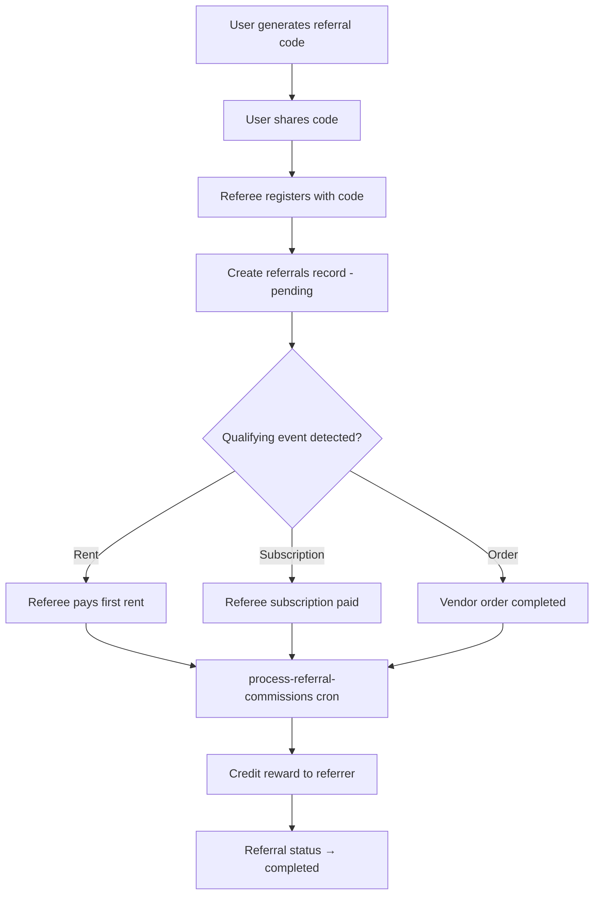
```mermaid
flowchart TD
    Generate[User generates referral code]
    Share[User shares code]
    Register[Referee registers with code]
    CreateRef[Create referrals record - pending]
    
    QualifyEvent{Qualifying event detected?}
    RentPaid[Referee pays first rent]
    SubPaid[Referee subscription paid]
    OrderComplete[Vendor order completed]
    
    ProcessReward[process-referral-commissions cron]
    CreditReward[Credit reward to referrer]
    UpdateStatus[Referral status → completed]

    Generate --> Share --> Register --> CreateRef
    CreateRef --> QualifyEvent
    QualifyEvent -- Rent --> RentPaid --> ProcessReward
    QualifyEvent -- Subscription --> SubPaid --> ProcessReward
    QualifyEvent -- Order --> OrderComplete --> ProcessReward
    ProcessReward --> CreditReward --> UpdateStatus
```

---

### 3.17 Dispute Resolution

**Tables:** `disputes`
**Goal:** Provide structured conflict resolution between tenants and merchants.

#### 3.17.1 Process Narrative

1. Tenant or merchant creates a dispute (title, description, priority, linked contract).
2. Admin reviews dispute, may request additional information.
3. Admin resolves: records resolution notes, assigns outcome.
4. Both parties notified of resolution.

#### 3.17.2 State Diagram

```mermaid
stateDiagram-v2
    [*] --> open: Dispute Created
    
    open --> in_review: Admin Picks Up
    
    in_review --> resolved: Admin Resolves
    in_review --> dismissed: Admin Dismisses
    
    resolved --> [*]
    dismissed --> [*]
    
    Note right of open: priority: low/medium/high/urgent
    Note right of resolved: resolution notes recorded
```

---

### 3.18 Forum & Community Moderation

**Tables:** `forum_posts`, `forum_comments`, `forum_likes`, `forum_reports`
**Goal:** Provide community engagement with moderation controls.

#### 3.18.1 Features

- **Posts:** Create, edit, view, like; optional property association.
- **Comments:** Threaded replies, likes.
- **Reports:** Any user can report inappropriate content.
- **Moderation:** Admin reviews reports, can hide content or lock posts.

#### 3.18.2 Report Moderation State Machine

```mermaid
stateDiagram-v2
    [*] --> pending: User Reports Content
    
    pending --> reviewed: Admin Reviews
    
    reviewed --> resolved: No Action Needed
    reviewed --> action_taken: Content Hidden/User Warned
    reviewed --> dismissed: False Report
    
    resolved --> [*]
    action_taken --> [*]
    dismissed --> [*]
    
    Note right of action_taken: is_visible set to false\nor post is_locked
```

---

### 3.19 AI Chatbot Operations

**Edge Functions:** `ai-chatbot`, `merchant-ai-assistant`, `vendor-ai-assistant`
**Tables:** `chat_conversations`, `chat_messages`, `chatbot_analytics`, `chatbot_knowledge`
**Goal:** Provide role-specific AI assistants with contextual data access.

#### 3.19.1 Role-Specific Chatbots

| Chatbot | Role | Context Data |
| :--- | :--- | :--- |
| `ai-chatbot` | Tenant | Property info, payment status, maintenance requests, contract details |
| `merchant-ai-assistant` | Merchant | Financial analysis, tenant management, occupancy rates, revenue trends |
| `vendor-ai-assistant` | Vendor | Order management, product analytics, customer reviews |

#### 3.19.2 Context Loading Flow

```mermaid
flowchart TD
    UserMessage[User sends message]
    DetectRole{Detect user role}
    
    LoadTenant[Load: property, payments,\nmaintenance, contract]
    LoadMerchant[Load: financials, tenants,\noccupancy, revenue]
    LoadVendor[Load: orders, products,\nreviews, analytics]
    
    InjectContext[Inject context into AI prompt]
    Sanitize[Sanitize input - prevent prompt injection]
    CallAI[Call AI model with context]
    SaveResponse[Save to chat_messages]
    LogAnalytics[Log to chatbot_analytics]
    
    UserMessage --> DetectRole
    DetectRole -- Tenant --> LoadTenant
    DetectRole -- Merchant --> LoadMerchant
    DetectRole -- Vendor --> LoadVendor
    
    LoadTenant --> InjectContext
    LoadMerchant --> InjectContext
    LoadVendor --> InjectContext
    
    InjectContext --> Sanitize --> CallAI --> SaveResponse --> LogAnalytics
```

#### 3.19.3 Security Measures

- **Prompt Injection Sanitization:** All user inputs are sanitized before context injection.
- **Knowledge Base:** `chatbot_knowledge` table provides verified Q&A pairs for common queries.
- **Analytics:** Response times, satisfaction scores, and query types tracked in `chatbot_analytics`.

---

### 3.20 Notification System

**Tables:** `notifications`
**Channels:** In-app, Email (Resend), WhatsApp (Whatsmeow)
**Goal:** Multi-channel notification delivery for all platform events.

#### 3.20.1 Notification Triggers

| Event Category | Channels | Examples |
| :--- | :--- | :--- |
| **Payment** | In-app, Email | Payment received, payment overdue, late fee applied |
| **Contract** | In-app, Email | Contract created, signed, expiring, terminated |
| **Maintenance** | In-app, Email | Request submitted, status updated, completed |
| **Subscription** | In-app, Email | Trial ending, payment due, plan changed, suspended |
| **Order** | In-app, Email | Order placed, confirmed, completed, reviewed |
| **Referral** | In-app, Email | Referral registered, reward earned |
| **System** | In-app | Verification status, disputes, forum reports |

#### 3.20.2 Routing Flowchart

```mermaid
flowchart TD
    Event[Platform Event Triggered]
    DetermineChannels[Determine notification channels]
    
    InApp[Create in-app notification\nin notifications table]
    Email{Email required?}
    SendEmail[Send via Resend API]
    WhatsApp{WhatsApp enabled?}
    SendWA[Send via Whatsmeow]
    
    MarkRead[User reads → mark as read]
    End([Delivered])

    Event --> DetermineChannels
    DetermineChannels --> InApp
    DetermineChannels --> Email
    DetermineChannels --> WhatsApp
    
    Email -- Yes --> SendEmail --> End
    Email -- No --> End
    WhatsApp -- Yes --> SendWA --> End
    WhatsApp -- No --> End
    InApp --> MarkRead --> End
```

---

### 3.22 DSS — OCR Document Processing *(NEW v3.0)*

**Edge Functions:** `ocr-ktp-extract`, `ocr-payment-proof`, `ocr-business-document`, `ocr-maintenance-receipt`
**Tables:** `ocr_results`, `payment_verifications`, `maintenance_expenses`
**AI Model:** Lovable AI (Gemini 2.5 Pro — Multimodal Vision)
**Goal:** Automate document data extraction using AI-powered OCR with confidence scoring.

#### 3.22.1 OCR Processing Pipeline

All OCR workflows follow the same core pipeline:

1. User uploads document image (KTP, payment proof, business doc, or receipt).
2. Image stored in private storage bucket (`verification-documents` or `contract-documents`).
3. Edge function downloads image, converts to base64.
4. Sends to Gemini 2.5 Pro with structured extraction prompt + tool calling schema.
5. AI returns extracted fields with per-field confidence scores.
6. **System** evaluates overall confidence:
   - `≥ 80%`: Auto-fill form fields, status `verified`.
   - `60–79%`: Auto-fill with warning, status `needs_review`.
   - `< 60%`: Manual entry required, status `low_confidence`.
7. Result stored in `ocr_results` table with full extraction data.
8. Downstream actions triggered (auto-populate forms, match invoices, etc.).

#### 3.22.2 OCR Pipeline Flowchart

```mermaid
flowchart TD
    Upload[User uploads document image]
    Store[Store in private storage bucket]
    Download[Edge function downloads image]
    Base64[Convert to base64]
    SendAI[Send to Gemini 2.5 Pro Vision]
    Extract[AI extracts structured fields]
    Confidence{Confidence ≥ 80%?}
    
    AutoFill[Auto-fill form fields\nStatus: verified]
    MedConfidence{Confidence ≥ 60%?}
    ReviewFill[Auto-fill with warning\nStatus: needs_review]
    ManualEntry[Manual entry required\nStatus: low_confidence]
    
    SaveResult[Save to ocr_results table]
    Downstream[Trigger downstream actions]

    Upload --> Store --> Download --> Base64 --> SendAI --> Extract --> Confidence
    Confidence -- Yes --> AutoFill --> SaveResult
    Confidence -- No --> MedConfidence
    MedConfidence -- Yes --> ReviewFill --> SaveResult
    MedConfidence -- No --> ManualEntry --> SaveResult
    SaveResult --> Downstream
```

#### 3.22.3 KTP OCR Business Process

1. Admin/merchant uploads KTP image during tenant onboarding.
2. `ocr-ktp-extract` extracts: NIK, full_name, date_of_birth, address, gender.
3. Extracted data auto-populates tenant registration form.
4. Admin verifies against physical card, corrects if needed.
5. OCR result linked to tenant profile for audit trail.

#### 3.22.4 Payment Proof OCR Business Process

1. Tenant uploads bukti transfer (bank transfer screenshot/receipt).
2. `ocr-payment-proof` extracts: amount, bank_name, date, reference_number.
3. **System** attempts fuzzy match against pending invoices:
   - Amount tolerance: ± Rp 1,000.
   - Date within 7 days of invoice due_date.
   - Reference number cross-checked against `xendit_transactions`.
4. If match found: creates `payment_verifications` record, links to invoice.
5. Merchant reviews verification → approves or rejects.
6. If approved: invoice status → `paid`.

```mermaid
sequenceDiagram
    participant Tenant
    participant UI as SiHuni UI
    participant OCR as ocr-payment-proof
    participant AI as Gemini 2.5 Pro
    participant DB as Database

    Tenant->>UI: Upload bukti transfer
    UI->>OCR: POST /ocr-payment-proof
    OCR->>DB: Download image from storage
    OCR->>AI: Extract payment data (vision)
    AI-->>OCR: {amount, bank, date, ref_number}
    OCR->>DB: Fuzzy match against pending invoices
    
    alt Match Found
        OCR->>DB: Create payment_verifications record
        OCR-->>UI: Match found (invoice #INV-xxx)
    else No Match
        OCR->>DB: Save OCR result (unmatched)
        OCR-->>UI: No matching invoice found
    end
    
    UI-->>Tenant: Show verification result
```

#### 3.22.5 Business Document OCR Business Process

1. Merchant uploads business document (NIB, SIUP, Akta, NPWP) during verification.
2. `ocr-business-document` extracts fields specific to document type:
   - **NIB:** company_name, nib_number, address, business_type, issue_date.
   - **SIUP:** company_name, siup_number, business_category, validity_period.
   - **Akta:** notary_name, akta_number, company_name, establishment_date.
   - **NPWP:** tax_id, company_name, registration_date, tax_office.
3. Extracted data auto-populates merchant verification form.
4. Document number and expiry stored for compliance tracking.

#### 3.22.6 Maintenance Receipt OCR Business Process

1. Merchant/vendor uploads maintenance receipt after repair work.
2. `ocr-maintenance-receipt` extracts: vendor_name, line items (description, qty, amount), total, date.
3. Creates `maintenance_expenses` record linked to maintenance request.
4. Expense data used by DSS Investment Insight for property P&L analysis.

---

### 3.23 DSS — ML Predictive Analytics *(NEW v3.0)*

**Edge Functions:** `ml-revenue-forecast`, `ml-tenant-risk-score`, `ml-churn-prediction`, `ml-optimal-pricing`
**Tables:** `tenant_risk_scores`, `ml_model_runs`
**Cron Jobs:** `ml-daily-risk-scoring`, `ml-weekly-forecast`
**AI Model:** Lovable AI (Gemini 2.5 Pro — Reasoning + Tool Calling)
**Goal:** Provide data-driven predictions for revenue, tenant risk, churn, and pricing.

#### 3.23.1 ML Prediction Pipeline

All ML predictions follow a common pattern:

1. Edge function receives request (merchant_id, parameters).
2. **System** checks subscription tier (Pro/Enterprise required).
3. **System** aggregates historical data from relevant tables (last 12 months).
4. Data formatted as structured context for Gemini.
5. Gemini analyzes patterns and returns predictions via tool calling.
6. Results validated (score ranges, probability bounds).
7. Stored in appropriate table + logged in `ml_model_runs` for audit.
8. Cached results served for subsequent requests within TTL.

#### 3.23.2 Revenue Forecasting Process

1. Merchant requests revenue forecast (3/6/12 months) for property or portfolio.
2. **System** aggregates from `payments`, `contracts`, `units`:
   - Monthly revenue history (last 12 months).
   - Occupancy rates per month.
   - Contract renewal/churn rates.
   - Seasonal patterns.
3. Gemini analyzes trends and produces per-month forecasts with confidence intervals.
4. Output includes: predicted_revenue, occupancy_rate, trend direction, seasonality_factor.

```mermaid
flowchart TD
    Request[Merchant requests forecast]
    CheckTier{Subscription ≥ Pro?}
    Denied[Access denied - upgrade required]
    
    AggregatePayments[Aggregate payment history 12 months]
    AggregateContracts[Aggregate contract data renewals and churn]
    AggregateOccupancy[Calculate occupancy rates per month]
    
    FormatContext[Format as structured context]
    CallAI[Call Gemini 2.5 Pro]
    ParseResult[Parse forecast predictions]
    
    Store[Store in ml_model_runs]
    Return[Return forecast to merchant]

    Request --> CheckTier
    CheckTier -- No --> Denied
    CheckTier -- Yes --> AggregatePayments
    CheckTier -- Yes --> AggregateContracts
    CheckTier -- Yes --> AggregateOccupancy
    AggregatePayments --> FormatContext
    AggregateContracts --> FormatContext
    AggregateOccupancy --> FormatContext
    FormatContext --> CallAI --> ParseResult --> Store --> Return
```

#### 3.23.3 Tenant Risk Scoring Process

1. Triggered on-demand or by `ml-daily-risk-scoring` cron (daily batch).
2. For each active tenant, **system** aggregates:
   - Payment history: late payment ratio, average days late.
   - Invoice data: overdue count, total outstanding.
   - Contract compliance: churn history, early terminations.
   - Collections cases: escalation history.
3. Gemini produces risk score (0–100) with risk level classification:
   - **0–25:** Low risk (green) — reliable tenant.
   - **26–50:** Medium risk (yellow) — occasional late payments.
   - **51–75:** High risk (orange) — frequent issues, needs attention.
   - **76–100:** Critical risk (red) — high churn/default probability.
4. Risk factors and recommended actions provided per tenant.
5. Score stored in `tenant_risk_scores` (upsert, updated daily).
6. **Notifications triggered** for High/Critical risk scores to merchant.

```mermaid
sequenceDiagram
    participant Cron as ml-daily-risk-scoring
    participant DB as Database
    participant AI as Gemini 2.5 Pro
    participant Notify as Notification System

    Cron->>DB: Query all active tenants per merchant
    loop For each tenant
        Cron->>DB: Aggregate payment history
        Cron->>DB: Aggregate invoice overdue data
        Cron->>DB: Aggregate contract/churn history
        Cron->>AI: Analyze risk factors
        AI-->>Cron: score, risk_level, factors, actions
        Cron->>DB: Upsert tenant_risk_scores
        Cron->>DB: Log in ml_model_runs
        
        alt Risk = High or Critical
            Cron->>Notify: Alert merchant
        end
    end
```

#### 3.23.4 Churn Prediction Process

1. Merchant requests churn prediction for all active tenants (1/3/6 month window).
2. **System** identifies churn signals:
   - Increasing payment delays (trend analysis).
   - Rising maintenance complaint frequency.
   - Contract nearing end date without renewal discussion.
   - Move-out notice indicators.
3. Gemini produces per-tenant churn probability (0–1) with risk factors.
4. Retention suggestions tailored to each tenant's profile.

#### 3.23.5 Optimal Pricing Process

1. Merchant requests pricing recommendations for unit(s) or entire property.
2. **System** aggregates:
   - Unit attributes: type, floor, size, amenities.
   - Location data: city, comparable properties.
   - Historical rent: past contract amounts for same/similar units.
   - Occupancy: vacancy duration history.
3. Gemini suggests optimal price with min/max range and justification.
4. Market comparison included when sufficient data available.

---

### 3.24 DSS — AI Decision Support Advisors *(NEW v3.0)*

**Edge Functions:** `dss-pricing-advisor`, `dss-collection-strategy`, `dss-maintenance-priority`, `dss-investment-insight`
**Tables:** `dss_recommendations`
**AI Model:** Lovable AI (Gemini 2.5 Pro — Reasoning)
**Goal:** Provide actionable, AI-powered business recommendations for merchants.

#### 3.24.1 DSS Advisor Architecture

All DSS advisors follow this pattern:

1. Merchant triggers advisor from dashboard (Enterprise tier required).
2. **System** loads relevant ML model outputs as context:
   - Pricing Advisor ← `ml-optimal-pricing` results.
   - Collection Strategy ← `ml-tenant-risk-score` results.
   - Maintenance Priority ← maintenance data + tenant satisfaction scores.
   - Investment Insight ← financial data + occupancy trends.
3. Additional context loaded (market data, historical decisions, merchant goals).
4. Gemini produces comprehensive recommendation with:
   - Executive summary (natural language advice).
   - Prioritized action items with expected impact.
   - Alternative approaches if primary recommendation isn't suitable.
5. Recommendation stored in `dss_recommendations` (status: `pending`).
6. Merchant reviews → accepts, rejects, or defers recommendation.
7. Accepted recommendations tracked for outcome measurement.

#### 3.24.2 DSS Recommendation Lifecycle

```mermaid
stateDiagram-v2
    [*] --> generated: AI Produces Recommendation
    
    generated --> pending: Saved to dss_recommendations
    
    pending --> accepted: Merchant Accepts
    pending --> rejected: Merchant Rejects
    pending --> deferred: Merchant Defers
    
    accepted --> implemented: Merchant Takes Action
    implemented --> measured: Outcome Tracked
    
    deferred --> pending: Merchant Revisits
    
    measured --> [*]: Effectiveness Logged
    rejected --> [*]: Rejection Reason Logged
    
    Note right of generated: Includes confidence score
    Note right of accepted: Expected impact recorded
    Note right of measured: Actual vs predicted comparison
```

#### 3.24.3 Pricing Advisor Business Process

1. Merchant opens Pricing Advisor for a property.
2. **System** runs `ml-optimal-pricing` for all units in the property.
3. Gemini acts as pricing consultant, combining:
   - ML pricing recommendations.
   - Market positioning strategy.
   - Occupancy optimization goals.
   - Revenue maximization vs. occupancy tradeoff.
4. Output: natural language pricing advice + per-unit action items.
5. Example actions: "Increase Unit A rent by 8%", "Offer 10% discount on Unit C to fill vacancy".

#### 3.24.4 Collection Strategy Business Process

1. Merchant requests collection strategy for a delinquent tenant or overdue invoice.
2. **System** loads tenant risk score, payment history, and escalation data.
3. Gemini produces tailored collection approach:
   - Recommended communication channel and tone.
   - Timing for each follow-up action.
   - Message templates (SMS, email, in-app).
   - Success probability estimate.
   - Alternative approaches (payment plan offer, mediation).
4. Strategy stored as `dss_recommendations` for tracking.

```mermaid
flowchart TD
    Request[Merchant requests collection strategy]
    LoadRisk[Load tenant risk score]
    LoadPayments[Load payment history]
    LoadEscalation[Load escalation and collections data]
    
    Combine[Combine into analysis context]
    CallAI[Gemini produces strategy]
    
    Strategy[Collection strategy with actions]
    Templates[Message templates per channel]
    Alternatives[Alternative approaches]
    
    SaveRec[Save to dss_recommendations]
    MerchantReview[Merchant reviews strategy]
    
    Accept{Accept?}
    Execute[Execute recommended actions]
    Reject[Log rejection reason]

    Request --> LoadRisk
    Request --> LoadPayments
    Request --> LoadEscalation
    LoadRisk --> Combine
    LoadPayments --> Combine
    LoadEscalation --> Combine
    Combine --> CallAI
    CallAI --> Strategy
    CallAI --> Templates
    CallAI --> Alternatives
    Strategy --> SaveRec
    Templates --> SaveRec
    Alternatives --> SaveRec
    SaveRec --> MerchantReview --> Accept
    Accept -- Yes --> Execute
    Accept -- No --> Reject
```

#### 3.24.5 Maintenance Priority Business Process

1. Merchant opens Maintenance Priority advisor.
2. **System** loads all open/pending maintenance requests for merchant.
3. Gemini evaluates each request considering:
   - **Tenant impact:** risk score, payment reliability, contract value.
   - **Revenue impact:** unit rent amount, vacancy risk if unresolved.
   - **Safety:** category severity (electrical > plumbing > cosmetic).
   - **SLA compliance:** time remaining vs. SLA deadline.
4. Returns prioritized list with:
   - Priority score (1–100) per request.
   - Impact analysis narrative.
   - Recommended vendor (if applicable).
   - Estimated cost range.
   - Urgency reason.

#### 3.24.6 Investment Insight Business Process

1. Merchant requests investment analysis for a property.
2. **System** aggregates comprehensive P&L data:
   - Revenue: `escrow_transactions` (type: payment_received).
   - Expenses: `disbursements`, `maintenance_expenses`.
   - Occupancy trends: `contracts`, `units` status history.
   - Market context: city, property type comparisons.
3. Gemini produces:
   - ROI analysis: current, projected 6-month, projected 12-month.
   - Improvement suggestions ranked by ROI payback period.
   - Risk assessment narrative.
4. Example: "Renovate Unit 3B bathroom (est. Rp 5M) → expected rent increase Rp 500K/month → payback: 10 months".

---

## 4. Data Lifecycle & State Machines Summary

| Entity | States | Key Transitions |
| :--- | :--- | :--- |
| **Unit** | vacant, occupied, maintenance, reserved | Check-in/out, repair, reservation |
| **Contract** | draft, pending_signature, active, notice, completed, terminated | Signature, notice, termination |
| **Invoice** | pending, partial, paid, overdue, cancelled, write_off | Payment, grace expiry, write-off |
| **Payment** | pending, paid, failed, cancelled, expired | Xendit callback |
| **Order** | pending, confirmed, in_progress, completed, canceled, reviewed | Vendor response, fulfillment |
| **Maintenance** | pending, acknowledged, in_progress, on_hold, completed, cancelled | Assignment, work progress |
| **Subscription** | trial, active, past_due, suspended, cancelled | Billing, grace, renewal |
| **Disbursement** | pending, pending_review, processing, completed, failed, rejected | Review, Xendit API |
| **Dispute** | open, in_review, resolved, dismissed | Admin action |
| **Forum Report** | pending, reviewed, resolved, dismissed, action_taken | Moderation |
| **OCR Result** | processing, verified, needs_review, low_confidence, failed | Confidence threshold |
| **Payment Verification** | pending, approved, rejected | Merchant review |
| **Tenant Risk Score** | low, medium, high, critical | Daily ML re-scoring |
| **DSS Recommendation** | generated, pending, accepted, rejected, deferred, implemented, measured | Merchant review, outcome tracking |

---

## 5. Financial Rules & Fee Structure

### 5.1 Transaction Fees

| Fee Type | Rate | Applied To |
| :--- | :--- | :--- |
| Platform Fee | 1% | All rent payments |
| Gateway Fee (Xendit) | 2.5% | All payment transactions |
| **Total Tenant Cost** | **3.5%** | **Added to gross amount** |

### 5.2 Disbursement Fees

| Schedule | Fee Rate | Deducted From |
| :--- | :--- | :--- |
| Daily | 0.25% | Disbursement amount |
| Weekly | 0.20% | Disbursement amount |
| Bi-weekly | 0.15% | Disbursement amount |
| Monthly | 0.10% | Disbursement amount |

### 5.3 Late Fees

- **Configurable per contract** via `late_fee_type` and `late_payment_penalty_rate`.
- Types: `percentage` (daily compound) or `fixed` (flat per day).
- Applied after `grace_period_days` expires.

### 5.4 Referral Rewards

- Default reward: **Rp 50,000** per qualifying referral.
- Vendor order referrals: percentage of order value.
- Configurable via `referral_bonus_amount` on contracts.

### 5.5 Early Termination Penalty

- Calculated as: `remaining_months × rent_amount × early_termination_penalty_rate`.
- Rate configurable per contract (default: varies by merchant).

---

## 6. Validation Rules & Business Constraints

### 6.1 Contract Validations

| Rule | Constraint |
| :--- | :--- |
| Unit availability | Unit must be `vacant` or `reserved` for new contracts |
| Date validity | `start_date < end_date` |
| Rent amount | Must be positive number |
| Duplicate check | No active/pending contract for same unit |
| Tenant check | No active contract for same tenant with same merchant |

### 6.2 Invoice Validations

| Rule | Constraint |
| :--- | :--- |
| Due date | Cannot be in the past when manually created |
| Amount | Must be positive |
| Duplicate | One invoice per billing period per contract |

### 6.3 Payment Validations

| Rule | Constraint |
| :--- | :--- |
| Amount matching | Payment amount validated against invoice total |
| Idempotency | Webhook external_id checked for duplicates |
| Method | Only Xendit-supported methods accepted |

### 6.4 General Validations

| Rule | Constraint |
| :--- | :--- |
| Phone number | Indonesian format: `+62xxx` or `08xxx` |
| Email | Valid email format, verified via auth |
| NIK (KTP) | 16-digit numeric string |
| File upload | Max 10MB, accepted types: JPG, PNG, PDF |

---

## 7. Cron Job Schedule

The following table shows the complete automated job schedule (12 daily + 2 DSS):

| # | Cron Job | Schedule | Category | Description |
| :--- | :--- | :--- | :--- | :--- |
| 1 | `auto-generate-invoices` | Daily | Billing | Generate invoices for contracts matching billing_day |
| 2 | `check-overdue-escalation` | Daily | Collections | Escalate overdue invoices through 4 tiers |
| 3 | `check-payment-plan` | Daily | Billing | Monitor payment plan installments |
| 4 | `auto-pay-execute` | Daily | Billing | Process auto-pay for enrolled tenants |
| 5 | `subscription-billing` | Daily | Subscription | Create subscription billing invoices |
| 6 | `subscription-renewal` | Daily | Subscription | Auto-renew subscriptions at period end |
| 7 | `subscription-grace-check` | Daily | Subscription | Suspend/cancel subscriptions past grace |
| 8 | `scheduled-disbursement` | Daily | Finance | Process scheduled escrow disbursements |
| 9 | `vacancy-tracking-cron` | Daily | Property | Track unit vacancy durations |
| 10 | `order-auto-reject` | Daily | Marketplace | Auto-reject unconfirmed orders (48h) |
| 11 | `process-referral-commissions` | Daily | Referral | Detect and process referral qualifying events |
| 12 | `contract-renewal-check` | Daily | Contract | Check expiring contracts and send reminders |
| 13 | `ml-daily-risk-scoring` | Daily | **DSS** | Batch tenant risk scoring for all active tenants |
| 14 | `ml-weekly-forecast` | Weekly | **DSS** | Revenue forecast update per merchant |

---

## 8. Integration Points

| Integration | Service | Data Exchange |
| :--- | :--- | :--- |
| **Payment Processing** | Xendit API | Invoice creation, payment callbacks, disbursements |
| **Email** | Resend | 30+ transactional templates (receipts, reminders, alerts) |
| **WhatsApp** | Whatsmeow | Notification delivery (configurable per user) |
| **AI Models** | Lovable AI (Gemini 2.5 Pro) | Context-aware chatbot, ML predictions, DSS advisors |
| **OCR** | Lovable AI (Gemini 2.5 Pro — Vision) | KTP, payment proof, business document, maintenance receipt extraction |
| **File Storage** | Supabase Storage | Documents, signatures, photos, KTP images |
| **Authentication** | Supabase Auth | JWT-based auth, email verification, password reset |

---

## 9. Audit & Compliance

### 9.1 Audit Trail

All financial and sensitive actions are logged in the `audit_logs` table:

| Field | Description |
| :--- | :--- |
| `user_id` | Actor who performed the action |
| `action` | Action type (create, update, delete, approve, reject) |
| `entity_type` | Affected entity (invoice, payment, contract, disbursement) |
| `entity_id` | ID of affected record |
| `old_data` | Previous state (JSON) |
| `new_data` | New state (JSON) |
| `ip_address` | Actor's IP address |
| `user_agent` | Actor's browser/client info |
| `created_at` | Immutable timestamp |

### 9.2 Compliance Requirements

| Requirement | Implementation |
| :--- | :--- |
| **Data Privacy** | KTP images in private storage; PII encrypted at rest |
| **PCI Compliance** | No card data stored; all payments tokenized via Xendit |
| **Financial Audit** | Immutable audit logs; no hard-delete on financial records |
| **Access Control** | RLS policies enforce role-based data isolation |
| **Admin Security** | 2FA (TOTP) required for admin operations |
| **Webhook Security** | Timing-safe signature verification for all webhooks |
| **DSS Audit Trail** | All ML predictions logged in `ml_model_runs` (input hash, output, model version) |
| **DSS Data Isolation** | OCR results and ML predictions scoped to merchant via RLS |
| **DSS Tier Enforcement** | Feature gating enforced at edge function level before AI calls |

### 9.3 Data Retention

| Data Type | Retention |
| :--- | :--- |
| Financial records | Indefinite (immutable) |
| Audit logs | Indefinite (immutable) |
| Chat messages | 1 year (configurable) |
| Notification records | 90 days |
| Analytics events | 1 year |
| OCR results | Indefinite (linked to tenant/merchant records) |
| ML model runs | 1 year (audit log for predictions) |
| DSS recommendations | Indefinite (outcome tracking) |
| Tenant risk scores | Latest only (overwritten daily, history in ml_model_runs) |

---

## 10. Glossary

| Term | Definition |
| :--- | :--- |
| **DSS** | Decision Support System — AI-powered analytics and recommendations layer |
| **OCR** | Optical Character Recognition — AI vision-based document data extraction |
| **ML** | Machine Learning — predictive analytics using historical data patterns |
| **Escrow** | Funds held by platform between tenant payment and merchant disbursement |
| **Disbursement** | Transfer of escrow funds to merchant's bank account |
| **Grace Period** | Days after due date before late fees apply |
| **RLS** | Row Level Security — database-level access control |
| **SLA** | Service Level Agreement — response time targets for maintenance |
| **KTP** | Kartu Tanda Penduduk — Indonesian national identity card |
| **NIK** | Nomor Induk Kependudukan — 16-digit national ID number |
| **TOTP** | Time-based One-Time Password — 2FA method |
| **VA** | Virtual Account — bank transfer payment method |
| **QRIS** | QR Indonesian Standard — QR code payment method |
| **Churn** | Tenant leaving / not renewing contract |
| **Risk Score** | 0–100 numeric assessment of tenant reliability |
| **Feature Gating** | Restricting access to features based on subscription tier |

---

*Document Version: 3.0 — DSS business processes added (OCR, ML, AI Advisors)*
*Total Processes: 25+ | Cron Jobs: 14 | Edge Functions: 43 | AI Model: Gemini 2.5 Pro*
