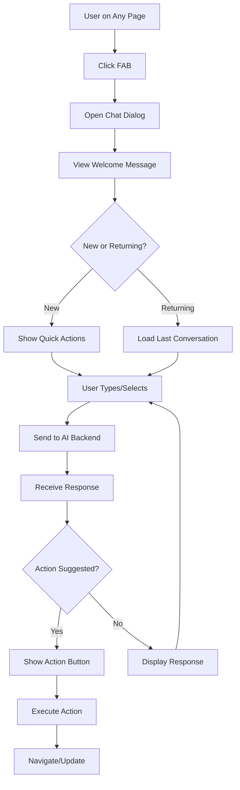
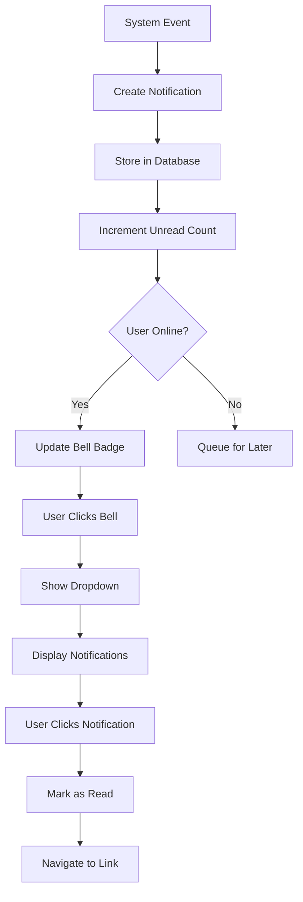
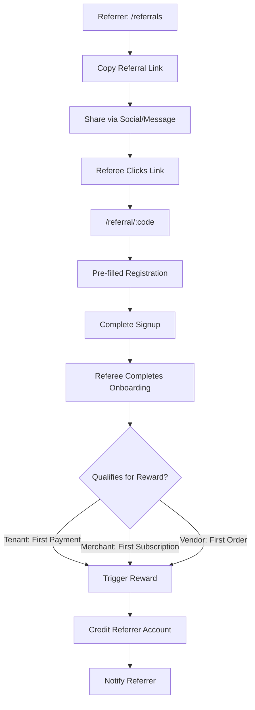
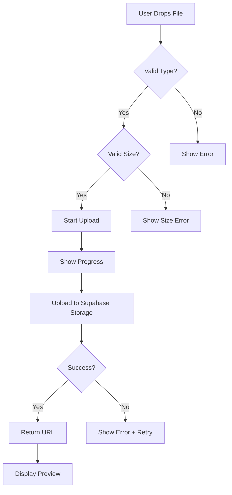
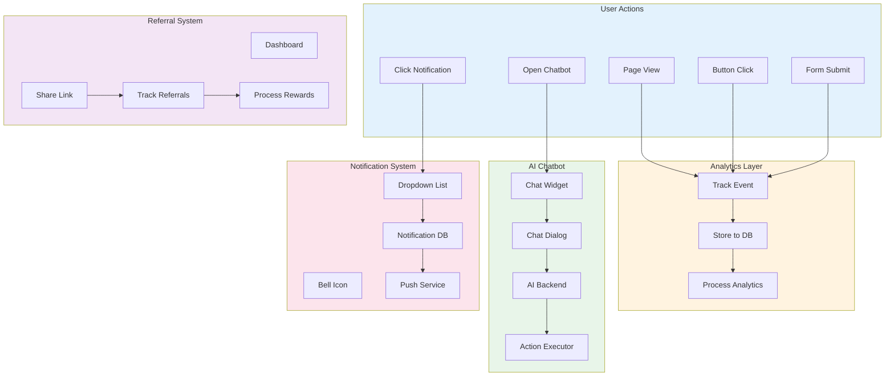

# UI/UX Flow Feedback: Core Module

## 📋 Overview

Modul core menangani fitur-fitur cross-cutting yang digunakan di seluruh aplikasi termasuk AI Chatbot, sistem notifikasi, referral program, dan analytics tracking.

---

## 🗺️ Core Features Map

```
┌─────────────────────────────────────────────────────────────────────────────┐
│                           CORE FEATURES                                      │
├─────────────────────────────────────────────────────────────────────────────┤
│                                                                              │
│  ┌─────────────────┐  ┌─────────────────┐  ┌─────────────────┐              │
│  │   AI CHATBOT    │  │  NOTIFICATIONS  │  │    REFERRALS    │              │
│  ├─────────────────┤  ├─────────────────┤  ├─────────────────┤              │
│  │ • Floating FAB  │  │ • Bell Icon     │  │ • Dashboard     │              │
│  │ • Chat Dialog   │  │ • Dropdown      │  │ • Share Link    │              │
│  │ • Context-aware │  │ • Mark as Read  │  │ • Track Rewards │              │
│  │ • Quick Actions │  │ • Categories    │  │ • Leaderboard   │              │
│  └─────────────────┘  └─────────────────┘  └─────────────────┘              │
│                                                                              │
│  ┌─────────────────┐  ┌─────────────────┐                                   │
│  │   ANALYTICS     │  │   FILE UPLOAD   │                                   │
│  ├─────────────────┤  ├─────────────────┤                                   │
│  │ • Page Views    │  │ • Drag & Drop   │                                   │
│  │ • User Events   │  │ • Progress Bar  │                                   │
│  │ • Session Track │  │ • Preview       │                                   │
│  │ • Conversion    │  │ • Validation    │                                   │
│  └─────────────────┘  └─────────────────┘                                   │
│                                                                              │
└─────────────────────────────────────────────────────────────────────────────┘
```

---

## 🤖 AI Chatbot Analysis

### Current Implementation
| Aspect | Status | Notes |
|--------|--------|-------|
| Floating Button | ✅ | Position: bottom-right |
| Dialog Interface | ✅ | Modal-style chat |
| Role Context | ✅ | Tenant/Merchant/Vendor aware |
| Conversation History | ⚠️ | Session-only, not persisted |
| Quick Actions | ✅ | Context-specific suggestions |

### Chatbot User Flow


### Issues & Recommendations

| ID | Issue | Current State | Impact | Recommendation |
|----|-------|---------------|--------|----------------|
| CHAT-M01 | No conversation persistence | Lost on refresh | User frustration | Save to database per user |
| CHAT-M02 | FAB overlaps content on mobile | Blocks bottom nav sometimes | Accidental clicks | Add margin from bottom nav |
| CHAT-L01 | No typing indicator | Sudden response | Feels unresponsive | Add "AI is thinking..." |
| CHAT-L02 | No feedback mechanism | No thumbs up/down | Can't improve AI | Add satisfaction rating |

---

## 🔔 Notifications System Analysis

### Current Implementation
| Feature | Status | Notes |
|---------|--------|-------|
| Bell Icon | ✅ | Header component |
| Dropdown List | ✅ | Shows recent 10 |
| Unread Count Badge | ✅ | Shows count |
| Mark as Read | ✅ | Individual + all |
| Category Filter | ❌ | Not implemented |
| Push Notifications | ❌ | Not implemented |

### Notification Flow


### Issues & Recommendations

| ID | Issue | Current State | Impact | Recommendation |
|----|-------|---------------|--------|----------------|
| NOTIF-M01 | No category filtering | Flat list | Hard to find specific | Add category tabs |
| NOTIF-M02 | No notification preferences | All or nothing | Spam feeling | Add granular settings |
| NOTIF-M03 | No push notifications | In-app only | Miss important alerts | Implement Web Push |
| NOTIF-L01 | No notification history page | Only dropdown | Limited visibility | Add full history page |

---

## 🎁 Referral System Analysis

### Current Implementation
| Feature | Status | Notes |
|---------|--------|-------|
| Referral Dashboard | ✅ | Shows stats |
| Unique Referral Code | ✅ | Per user |
| Share Link | ✅ | Copyable |
| Track Referrals | ✅ | List of referees |
| Reward Tracking | ✅ | Shows pending/paid |
| Leaderboard | ❌ | Not implemented |

### Referral Flow


### Issues & Recommendations

| ID | Issue | Current State | Impact | Recommendation |
|----|-------|---------------|--------|----------------|
| REF-M01 | Progress not real-time | Manual refresh | Delayed gratification | Add real-time updates |
| REF-L01 | Share options limited | Copy only | Low conversion | Add native share (WhatsApp, etc) |
| REF-L02 | No gamification | Static dashboard | Low engagement | Add leaderboard + badges |

---

## 📊 Analytics System Analysis

### Current Implementation
| Feature | Status | Notes |
|---------|--------|-------|
| Page View Tracking | ✅ | Via useAnalytics hook |
| Event Tracking | ✅ | Custom events |
| Session Tracking | ⚠️ | Basic implementation |
| User Identification | ✅ | Linked to auth |
| Dashboard | ✅ | Admin only |

### Analytics Events Captured
| Event Type | Tracked | Examples |
|------------|---------|----------|
| page_view | ✅ | All page navigation |
| button_click | ⚠️ | Some CTAs only |
| form_submit | ✅ | All forms |
| payment_initiated | ✅ | Payment flows |
| payment_completed | ✅ | Successful payments |
| error_occurred | ✅ | JS errors |
| feature_used | ⚠️ | Key features |

### Issues & Recommendations

| ID | Issue | Current State | Impact | Recommendation |
|----|-------|---------------|--------|----------------|
| ANLY-M01 | Limited event granularity | Major events only | Missing insights | Add micro-interactions |
| ANLY-L01 | No funnel visualization | Raw data | Hard to analyze | Build conversion funnels |
| ANLY-L02 | No A/B testing framework | None | Can't optimize | Add feature flag system |

---

## 📤 File Upload Analysis

### Current Implementation
| Feature | Status | Notes |
|---------|--------|-------|
| Drag & Drop | ✅ | FileUpload component |
| Click to Upload | ✅ | Fallback option |
| File Type Validation | ✅ | Image, PDF, etc |
| Size Validation | ✅ | Configurable limit |
| Progress Bar | ⚠️ | Basic implementation |
| Preview | ✅ | Image preview |
| Multiple Files | ✅ | Configurable |

### Upload Flow


### Issues & Recommendations

| ID | Issue | Current State | Impact | Recommendation |
|----|-------|---------------|--------|----------------|
| UPLD-M01 | Progress percentage inaccurate | Jumpy updates | Confusing UX | Implement chunk progress |
| UPLD-M02 | No resume on failure | Start from zero | Frustrating | Add resumable uploads |
| UPLD-L01 | No image compression | Large files | Slow upload | Add client-side compression |

---

## 📱 Mobile UX for Core Features

### AI Chatbot Mobile
| Aspect | Score | Notes |
|--------|-------|-------|
| FAB Position | 6/10 | Overlaps bottom nav |
| Dialog Size | 8/10 | Full-screen on mobile |
| Keyboard Handling | 7/10 | Sometimes covers input |
| Gesture Support | 5/10 | No swipe to close |

### Notifications Mobile
| Aspect | Score | Notes |
|--------|-------|-------|
| Dropdown Position | 7/10 | Works but cramped |
| Touch Targets | 8/10 | Adequate size |
| Swipe Actions | 0/10 | Not implemented |
| Pull to Refresh | 0/10 | Not implemented |

### Recommendations
- [ ] Move FAB above bottom nav on mobile
- [ ] Add swipe-to-dismiss for chat dialog
- [ ] Implement swipe-to-mark-read for notifications
- [ ] Add pull-to-refresh for notification list

---

## 📊 Integration Flow Diagram



---

## ⚡ Performance Considerations

### Bundle Impact
| Feature | Est. Size | Lazy Loaded | Recommendation |
|---------|-----------|-------------|----------------|
| Chatbot Dialog | ~50KB | ✅ Yes | ✅ Good |
| Notification Dropdown | ~15KB | ❌ No | Consider lazy load |
| Referral Dashboard | ~30KB | ✅ Yes | ✅ Good |
| Analytics Hook | ~5KB | ❌ No | ✅ Acceptable |
| File Upload | ~20KB | ❌ No | Consider lazy load |

### API Call Optimization
| Feature | Current | Recommendation |
|---------|---------|----------------|
| Notification Poll | Every 30s | Use Realtime subscription |
| Referral Stats | On mount | Cache with SWR |
| Analytics Batch | Per event | Batch every 5s |

---

## ✅ Summary Checklist

| Category | Critical | High | Medium | Low | Total |
|----------|----------|------|--------|-----|-------|
| AI Chatbot | 0 | 0 | 2 | 2 | 4 |
| Notifications | 0 | 0 | 3 | 1 | 4 |
| Referrals | 0 | 0 | 1 | 2 | 3 |
| Analytics | 0 | 0 | 1 | 2 | 3 |
| File Upload | 0 | 0 | 2 | 1 | 3 |
| **Total** | **0** | **0** | **9** | **8** | **17** |

---

## 📝 Action Items

### AI Chatbot
1. [ ] **CHAT-M01**: Persist conversation history to database
2. [ ] **CHAT-M02**: Fix FAB position overlap on mobile
3. [ ] **CHAT-L01**: Add typing indicator
4. [ ] **CHAT-L02**: Add feedback mechanism

### Notifications
5. [ ] **NOTIF-M01**: Implement category filtering
6. [ ] **NOTIF-M02**: Add notification preferences
7. [ ] **NOTIF-M03**: Implement Web Push notifications
8. [ ] **NOTIF-L01**: Add full notification history page

### Referrals
9. [ ] **REF-M01**: Add real-time progress updates
10. [ ] **REF-L01**: Add native share options
11. [ ] **REF-L02**: Implement gamification features

### Analytics
12. [ ] **ANLY-M01**: Add micro-interaction tracking
13. [ ] **ANLY-L01**: Build conversion funnels visualization
14. [ ] **ANLY-L02**: Implement A/B testing framework

### File Upload
15. [ ] **UPLD-M01**: Fix progress accuracy
16. [ ] **UPLD-M02**: Add resumable uploads
17. [ ] **UPLD-L01**: Implement client-side image compression

---

*Last Updated: 2025-01-26*
*Reviewed By: System*
