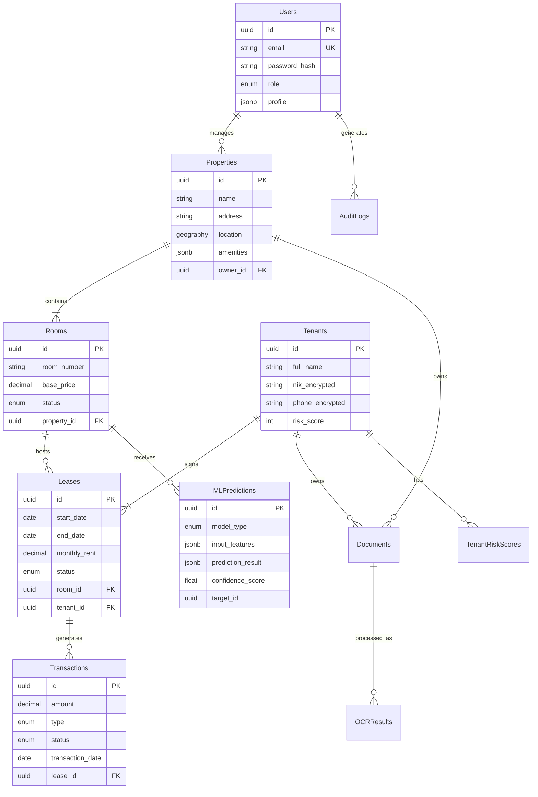

# Database Schema Documentation
## Sistem DSS Manajemen Kosan - "SiHuni"

**Version:** 1.0.0
**Status:** Implementation Ready
**Date:** 2026-02-22
**Document Owner:** Backend Engineering Team

---

## 1. Executive Summary

This document defines the database schema for the **SiHuni** platform, a Decision Support System (DSS) for Kosan Management. The design prioritizes **scalability** (supporting 100+ properties), **performance** (NFR-1: <100ms query latency), and **security** (NFR-3: PII encryption).

The architecture uses **PostgreSQL 16** as the primary relational store, leveraging **JSONB** for flexible AI/ML data structures and **PostGIS** for geospatial queries.

### 1.1 Architectural Decisions
- **Database Engine:** PostgreSQL 16.x
- **ORM Strategy:** Prisma ORM / TypeORM (Code-First approach recommended)
- **Primary Keys:** UUID v7 (Sortable, collision-resistant) for all tables
- **Timestamp Handling:** UTC for all `created_at` and `updated_at` columns
- **Soft Delete:** Implemented via `deleted_at` column for critical entities (Tenants, Properties)
- **Encryption:** Application-level encryption (AES-256) for PII columns (marked with `[ENCRYPTED]`)

---

## 2. Entity Relationship Diagram (ERD)

---

## 3. Detailed Schema Definitions

### 3.1 Identity & Access Management (IAM)

#### Table: `users`
Stores authentication and profile information for all system actors.

| Column | Type | Constraints | Description | Mapping |
|--------|------|-------------|-------------|---------|
| `id` | UUID | PK, Default: UUIDv7 | Unique identifier | NFR-3 |
| `email` | VARCHAR(255) | Unique, Not Null | User login email | NFR-3 |
| `password_hash` | VARCHAR(255) | Not Null | Argon2id hash | NFR-3 |
| `role` | ENUM | Not Null | `SUPER_ADMIN`, `OWNER`, `STAFF`, `TENANT` | NFR-3 |
| `full_name` | VARCHAR(100) | Not Null | Display name | UI Profile |
| `phone_number` | VARCHAR(20) | Nullable | Contact number | UI Profile |
| `is_active` | BOOLEAN | Default: true | Soft ban/disable flag | Security |
| `last_login_at` | TIMESTAMPTZ | Nullable | Audit tracking | NFR-3 |
| `created_at` | TIMESTAMPTZ | Default: NOW() | Record creation time | Audit |
| `updated_at` | TIMESTAMPTZ | Default: NOW() | Record update time | Audit |

**Indexes:**
- `idx_users_email` (Unique) for login lookup.

---

### 3.2 Property Management (Core Domain)

#### Table: `properties`
Master data for kosan properties (FR-5.1).

| Column | Type | Constraints | Description | Mapping |
|--------|------|-------------|-------------|---------|
| `id` | UUID | PK | Unique identifier | FR-5.1 |
| `owner_id` | UUID | FK -> users.id | Property owner | RBAC |
| `name` | VARCHAR(100) | Not Null | Property name | FR-5.1 |
| `address` | TEXT | Not Null | Full address | FR-5.1 |
| `location` | GEOGRAPHY(Point) | Nullable | PostGIS lat/long | FR-5.1 |
| `amenities` | JSONB | Default: [] | List of amenities (tags) | FR-5.1 |
| `building_info` | JSONB | Nullable | `{year_built, total_floors, etc}` | FR-5.1 |
| `settings` | JSONB | Nullable | `{auto_remind_date, grace_period}` | FR-5.1 |
| `created_at` | TIMESTAMPTZ | Default: NOW() | - | - |
| `deleted_at` | TIMESTAMPTZ | Nullable | Soft delete timestamp | NFR-5 |

**Indexes:**
- `idx_properties_owner` for filtering by owner.
- `idx_properties_location` (GIST) for geospatial queries (nearby kosan).

#### Table: `rooms`
Individual units within a property.

| Column | Type | Constraints | Description | Mapping |
|--------|------|-------------|-------------|---------|
| `id` | UUID | PK | Unique identifier | FR-4.3 |
| `property_id` | UUID | FK -> properties.id | Parent property | FR-4.3 |
| `room_number` | VARCHAR(20) | Not Null | Display number (e.g., "A-101") | FR-4.3 |
| `floor_level` | INTEGER | Not Null | Floor number (1, 2, 3...) | FR-2.1 |
| `type` | ENUM | Not Null | `SINGLE`, `DOUBLE`, `SUITE` | UI Form |
| `base_price` | DECIMAL(12,2) | Not Null | Standard monthly rent | FR-2.1 |
| `current_price` | DECIMAL(12,2) | Nullable | Actual active rent | FR-2.1 |
| `status` | ENUM | Not Null | `AVAILABLE`, `OCCUPIED`, `MAINTENANCE` | FR-4.3 |
| `features` | JSONB | Default: {} | `{size_sqm, window_view, furnished}` | FR-2.1 |

**Indexes:**
- `idx_rooms_property_status` for "Available Rooms" dashboard query.

---

### 3.3 Tenant & Leasing (Core Domain)

#### Table: `tenants`
Sensitive tenant information (FR-5.2). **High Security Zone**.

| Column | Type | Constraints | Description | Mapping |
|--------|------|-------------|-------------|---------|
| `id` | UUID | PK | Unique identifier | FR-5.2 |
| `user_id` | UUID | FK -> users.id, Nullable | Link to login account if exists | FR-5.2 |
| `full_name` | VARCHAR(100) | Not Null | Legal name | FR-5.2 |
| `nik_enc` | TEXT | Not Null | **[ENCRYPTED]** Identity Number | NFR-3 |
| `phone_enc` | TEXT | Not Null | **[ENCRYPTED]** Phone Number | NFR-3 |
| `dob` | DATE | Nullable | Date of Birth | FR-5.2 |
| `emergency_contact` | JSONB | Nullable | `{name, relation, phone}` | FR-5.2 |
| `risk_profile` | JSONB | Nullable | `{score, category, last_updated}` | FR-2.3 |

#### Table: `leases`
Contractual relationship between tenant and room.

| Column | Type | Constraints | Description | Mapping |
|--------|------|-------------|-------------|---------|
| `id` | UUID | PK | Unique identifier | FR-5.2 |
| `tenant_id` | UUID | FK -> tenants.id | Tenant | FR-5.2 |
| `room_id` | UUID | FK -> rooms.id | Room | FR-5.2 |
| `start_date` | DATE | Not Null | Contract start | FR-5.2 |
| `end_date` | DATE | Not Null | Contract end | FR-5.2 |
| `rent_amount` | DECIMAL(12,2) | Not Null | Agreed monthly rent | FR-5.2 |
| `deposit_amount` | DECIMAL(12,2) | Default: 0 | Security deposit | FR-5.2 |
| `payment_cycle` | ENUM | Default: `MONTHLY` | `MONTHLY`, `QUARTERLY`, `YEARLY` | FR-5.2 |
| `status` | ENUM | Not Null | `ACTIVE`, `PENDING`, `TERMINATED`, `EXPIRED` | FR-5.2 |
| `documents` | JSONB | Default: [] | Array of Document IDs (Contract PDF) | FR-5.3 |

**Indexes:**
- `idx_leases_status_dates` for finding expiring leases (Dashboard Alerts).

---

### 3.4 Finance & Transactions

#### Table: `transactions`
Financial records for payments and expenses.

| Column | Type | Constraints | Description | Mapping |
|--------|------|-------------|-------------|---------|
| `id` | UUID | PK | Unique identifier | FR-2.3 |
| `lease_id` | UUID | FK -> leases.id, Nullable | Linked lease (for rent payments) | FR-2.3 |
| `property_id` | UUID | FK -> properties.id | Linked property | FR-4.2 |
| `type` | ENUM | Not Null | `INCOME_RENT`, `EXPENSE_MAINTENANCE`, `EXPENSE_UTILITY` | FR-4.2 |
| `amount` | DECIMAL(12,2) | Not Null | Transaction value | FR-4.2 |
| `transaction_date` | DATE | Not Null | Date of occurrence | FR-4.2 |
| `payment_method` | ENUM | Nullable | `TRANSFER`, `CASH`, `QRIS` | FR-5.2 |
| `status` | ENUM | Not Null | `PENDING`, `PAID`, `OVERDUE`, `CANCELLED` | FR-2.3 |
| `proof_document_id` | UUID | FK -> documents.id | Link to uploaded receipt | FR-1.1 |

**Indexes:**
- `idx_transactions_date_property` for Monthly Financial Reports.
- `idx_transactions_status` for "Overdue Payments" alerts.

---

### 3.5 AI/ML & Documents (Advanced Features)

#### Table: `documents`
Metadata for files stored in S3 (FR-1.1, FR-5.3).

| Column | Type | Constraints | Description | Mapping |
|--------|------|-------------|-------------|---------|
| `id` | UUID | PK | Unique identifier | FR-5.3 |
| `file_key` | VARCHAR(255) | Unique, Not Null | S3 Object Key | FR-1.1 |
| `original_name` | VARCHAR(255) | Not Null | Uploaded filename | FR-1.1 |
| `mime_type` | VARCHAR(50) | Not Null | e.g., `application/pdf` | FR-1.1 |
| `size_bytes` | BIGINT | Not Null | File size | FR-1.1 |
| `type` | ENUM | Not Null | `IDENTITY`, `CONTRACT`, `RECEIPT`, `OTHER` | FR-1.2 |
| `ocr_status` | ENUM | Default: `PENDING` | `PENDING`, `PROCESSING`, `COMPLETED`, `FAILED` | FR-1.3 |
| `ocr_data` | JSONB | Nullable | Raw OCR output + confidence scores | FR-1.3 |

#### Table: `ml_predictions`
Stores outputs from ML models for reporting and retraining (FR-2.4).

| Column | Type | Constraints | Description | Mapping |
|--------|------|-------------|-------------|---------|
| `id` | UUID | PK | Unique identifier | FR-2.1 |
| `model_type` | ENUM | Not Null | `PRICE_OPT`, `OCCUPANCY_FORECAST`, `TENANT_RISK` | FR-2 |
| `model_version` | VARCHAR(50) | Not Null | e.g., `v1.2.0-beta` | FR-2.4 |
| `target_id` | UUID | Not Null | ID of Room, Property, or Tenant | FR-2 |
| `input_snapshot` | JSONB | Not Null | Features used for prediction (for reproduction) | FR-2.4 |
| `output_value` | JSONB | Not Null | Prediction result (e.g., recommended price) | FR-2.1 |
| `confidence_score` | FLOAT | Not Null | 0.0 to 1.0 | FR-2.1 |
| `shap_values` | JSONB | Nullable | Feature importance data for explanation | FR-3.2 |
| `feedback` | ENUM | Nullable | `ACCEPTED`, `REJECTED`, `ADJUSTED` | FR-2.4 |

---

## 4. Performance & Scalability Considerations

### 4.1 Indexing Strategy
To meet **NFR-1 (<100ms queries)**, the following composite indexes are mandatory:

1.  **Dashboard Loads:**
    - `properties(owner_id, deleted_at)`
    - `rooms(property_id, status)`
    - `transactions(property_id, transaction_date)`

2.  **ML Pipelines:**
    - `ml_predictions(model_type, created_at)` for monitoring drift.
    - `transactions(lease_id, status)` for calculating tenant payment history scores.

### 4.2 Partitioning Strategy
For **NFR-4 (Scalability)**, tables expected to grow beyond 10GB (Year 2+) will use declarative partitioning:
- **`transactions`**: Partition by Range on `transaction_date` (Yearly partitions).
- **`audit_logs`**: Partition by Range on `created_at` (Monthly partitions).

### 4.3 JSONB Usage Guidelines
We use JSONB for flexibility but enforce structure via application-layer validation (Zod/DTOs):
- **`properties.amenities`**: Allows adding new amenity types without schema migration.
- **`ml_predictions.input_snapshot`**: Essential for model debugging and retraining (FR-2.4), storing the exact state of the world at prediction time.

---

## 5. Security & Compliance

### 5.1 Data Encryption
- **At Rest (Database Level):** AWS RDS Encryption (AES-256).
- **At Rest (Column Level):** Sensitive PII in `tenants` (`nik`, `phone`, `bank_account`) MUST be encrypted by the application before insertion using `AES-256-GCM`.
- **Key Management:** Encryption keys managed via AWS KMS / Vault, rotated quarterly (NFR-3).

### 5.2 Row Level Security (RLS)
PostgreSQL RLS policies will be enabled to enforce multi-tenancy:
- **Owners** can only `SELECT/UPDATE` rows where `properties.owner_id == current_user.id`.
- **Tenants** can only `SELECT` their own `leases` and `transactions`.

---

## 6. Assumptions & Constraints
1.  **Currency**: System defaults to IDR (Indonesian Rupiah). Multi-currency support is out of scope for V2.
2.  **Timezone**: All DB timestamps are UTC. Client apps convert to `Asia/Jakarta` (WIB) for display.
3.  **File Storage**: DB only stores metadata/keys. Actual binary files reside in Object Storage (S3).
4.  **Audit Retention**: Audit logs are retained in hot storage for 12 months, then archived to cold storage (Glacier) per NFR-3.
