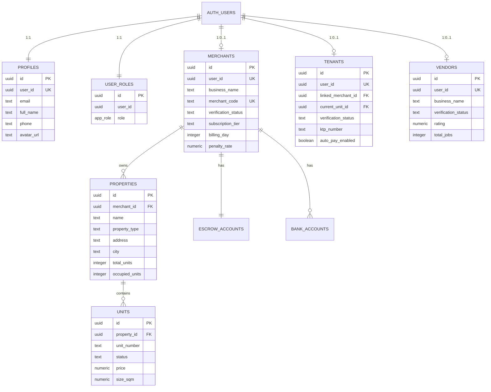
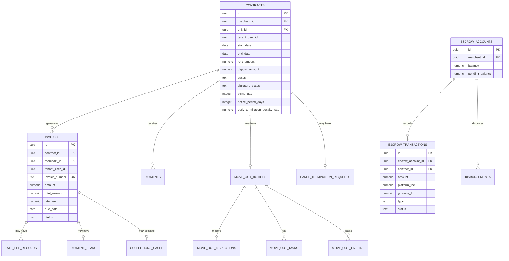
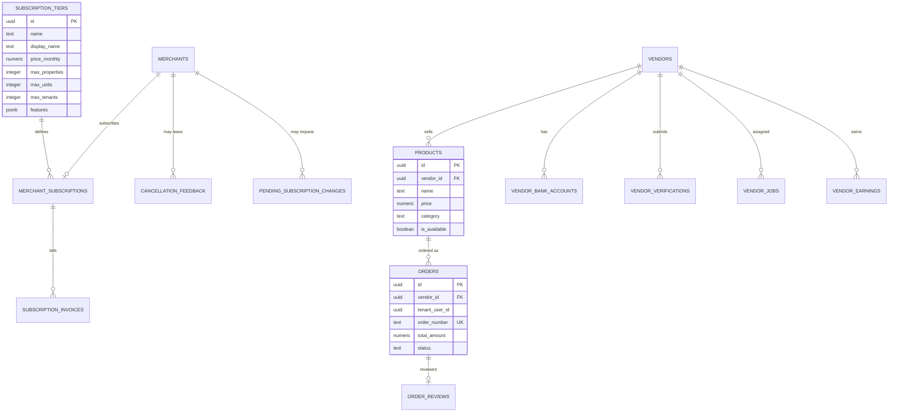

# Database Schema Documentation

> **SiHuni Platform — Living Schema Reference v2.0**
>
> Last updated: 2026-02-21 | PostgreSQL 16 on Lovable Cloud
>
> Cross-references: [`api-specification.md`](./api-specification.md) · [`backend-architecture.md`](./backend-architecture.md) · [`business-process.md`](./business-process.md)

---

## Table of Contents

1. [Executive Summary](#1-executive-summary)
2. [Entity-Relationship Diagram](#2-entity-relationship-diagram)
3. [Custom Types](#3-custom-types)
4. [Table Definitions](#4-table-definitions)
5. [Database Functions](#5-database-functions)
6. [Triggers](#6-triggers)
7. [Indexing Strategy](#7-indexing-strategy)
8. [RLS Policy Summary](#8-rls-policy-summary)
9. [Foreign Key Relationships](#9-foreign-key-relationships)
10. [JSONB Column Patterns](#10-jsonb-column-patterns)
11. [Data Conventions](#11-data-conventions)

---

## 1. Executive Summary

| Metric | Value |
|--------|-------|
| **Total Tables** | 66 public tables |
| **Database Functions** | 16 custom functions |
| **Triggers** | 45+ triggers (auto-timestamps, code generation, status sync) |
| **RLS Policies** | 191 policies across all tables |
| **Custom Enum Types** | 1 (`app_role`) |
| **Primary Key Strategy** | UUID v4 (`gen_random_uuid()`) |
| **Timestamp Strategy** | `timestamptz` (timezone-aware) on all temporal columns |
| **Currency** | IDR (Indonesian Rupiah), stored as `numeric` |
| **ORM** | None — direct Supabase SDK client access |
| **Status Columns** | `text` with application-level validation (no DB enums except `app_role`) |
| **Soft Deletes** | Not used — no `deleted_at` columns |

### Architecture Principles

1. **UUID v4 PKs** — All 66 tables use `uuid DEFAULT gen_random_uuid()` for primary keys
2. **Immutable Timestamps** — `created_at DEFAULT now()`, `updated_at` auto-managed via trigger
3. **Numeric for Money** — All monetary values use `numeric` (not `float`) for exact precision
4. **Text Arrays** — Photos, tags, keywords stored as `text[]`
5. **JSONB for Flexible Data** — Configurations, metadata, feature flags stored as `jsonb`
6. **RLS-First Security** — All tables have Row Level Security enabled with role-based policies
7. **Application-Level FK Joins** — Relationships enforced via Supabase SDK `.select()` joins

---

## 2. Entity-Relationship Diagram

### 2.1 Identity & Property Core



### 2.2 Contract & Financial Flow



### 2.3 Subscription & Marketplace



---

## 3. Custom Types

### 3.1 `app_role` Enum

```sql
CREATE TYPE public.app_role AS ENUM ('admin', 'merchant', 'tenant', 'vendor');
```

**Used in:** `user_roles.role` column, `has_role()` function (core RLS check), `get_user_role()` function, `handle_new_user()` trigger.

---

## 4. Table Definitions

### 4.1 Identity & Access Management

#### `profiles`
> User profiles linked to `auth.users`. Auto-created on signup via `handle_new_user()` trigger.

| Column | Type | Nullable | Default |
|--------|------|----------|---------|
| `id` | uuid | NO | `gen_random_uuid()` |
| `user_id` | uuid | NO | — |
| `email` | text | NO | — |
| `full_name` | text | YES | — |
| `phone` | text | YES | — |
| `avatar_url` | text | YES | — |
| `admin_2fa_enabled` | boolean | YES | `false` |
| `admin_2fa_secret` | text | YES | — |
| `created_at` | timestamptz | NO | `now()` |
| `updated_at` | timestamptz | NO | `now()` |

**Unique:** `user_id` · **RLS:** Users own-data (view/update); Admins view-all; No delete.

---

#### `user_roles`
> RBAC role assignment. One role per user.

| Column | Type | Nullable | Default |
|--------|------|----------|---------|
| `id` | uuid | NO | `gen_random_uuid()` |
| `user_id` | uuid | NO | — |
| `role` | app_role | NO | — |
| `created_at` | timestamptz | NO | `now()` |

**Unique:** `(user_id, role)` · **RLS:** Users view own; Admins full access.

---

#### `merchants`
> Merchant (kos owner) business data, verification, billing configuration.

| Column | Type | Nullable | Default |
|--------|------|----------|---------|
| `id` | uuid | NO | `gen_random_uuid()` |
| `user_id` | uuid | NO | — |
| `business_name` | text | NO | — |
| `business_type` | text | YES | — |
| `address` | text | YES | — |
| `city` | text | YES | — |
| `province` | text | YES | — |
| `postal_code` | text | YES | — |
| `merchant_code` | text | YES | auto-generated |
| `verification_status` | text | YES | — |
| `verification_submitted_at` | timestamptz | YES | — |
| `verified_at` | timestamptz | YES | — |
| `verified_by` | uuid | YES | — |
| `rejected_at` | timestamptz | YES | — |
| `rejected_by` | uuid | YES | — |
| `rejection_details` | text | YES | — |
| `resubmission_count` | integer | YES | — |
| `resubmission_instructions` | text | YES | — |
| `subscription_tier` | text | YES | — |
| `disbursement_schedule` | text | YES | — |
| `billing_day` | integer | YES | — |
| `penalty_rate` | numeric | YES | — |
| `referred_by` | text | YES | — |
| `referral_discount` | numeric | YES | — |
| `referral_discount_months` | integer | YES | — |
| `total_disbursed` | numeric | YES | — |
| `last_disbursement_date` | timestamptz | YES | — |
| `min_disbursement_amount` | numeric | YES | — |
| `created_at` | timestamptz | NO | `now()` |
| `updated_at` | timestamptz | NO | `now()` |

**FK:** `user_id` → `auth.users.id` · **Unique:** `user_id`, `merchant_code`
**Triggers:** `set_merchant_code` (auto-generate), `create_merchant_escrow`, `update_updated_at`
**RLS:** Merchants own-data; Admins full access.

---

#### `tenants`
> Tenant profile with KTP verification, emergency contact, auto-pay settings.

| Column | Type | Nullable | Default |
|--------|------|----------|---------|
| `id` | uuid | NO | `gen_random_uuid()` |
| `user_id` | uuid | NO | — |
| `linked_merchant_id` | uuid | YES | — |
| `current_unit_id` | uuid | YES | — |
| `date_of_birth` | date | YES | — |
| `gender` | text | YES | — |
| `ktp_number` | text | YES | — |
| `ktp_photo_url` | text | YES | — |
| `occupation` | text | YES | — |
| `income_range` | text | YES | — |
| `emergency_contact_name` | text | YES | — |
| `emergency_contact_phone` | text | YES | — |
| `emergency_contact_relation` | text | YES | — |
| `verification_status` | text | YES | `'pending'` |
| `verified_at` | timestamptz | YES | — |
| `verified_by` | uuid | YES | — |
| `notes` | text | YES | — |
| `notification_preferences` | jsonb | YES | `'{"new_invoices":true,...}'` |
| `auto_pay_enabled` | boolean | YES | `false` |
| `auto_pay_day` | integer | YES | `1` |
| `created_at` | timestamptz | NO | `now()` |
| `updated_at` | timestamptz | NO | `now()` |

**Unique:** `user_id` · **RLS:** Tenants own-data; Merchants view linked/contracted; Admins full access.

---

#### `vendors`
> Vendor business data, ratings, service categories.

| Column | Type | Nullable | Default |
|--------|------|----------|---------|
| `id` | uuid | NO | `gen_random_uuid()` |
| `user_id` | uuid | NO | — |
| `business_name` | text | NO | — |
| `contact_email` | text | NO | — |
| `contact_phone` | text | YES | — |
| `address` | text | YES | — |
| `city` | text | YES | — |
| `province` | text | YES | — |
| `description` | text | YES | — |
| `service_categories` | text[] | YES | — |
| `verification_status` | text | YES | `'pending'` |
| `rating` | numeric | YES | — |
| `total_jobs` | integer | YES | — |
| `total_earnings` | numeric | YES | `0` |
| `profile_photo_url` | text | YES | — |
| `portfolio_images` | text[] | YES | — |
| `business_license_url` | text | YES | — |
| `operating_hours` | jsonb | YES | — |
| `created_at` | timestamptz | NO | `now()` |
| `updated_at` | timestamptz | NO | `now()` |

**FK:** `user_id` → `auth.users.id` · **Unique:** `user_id`
**RLS:** Vendors own-data; Admins full access; Public view verified.

---

### 4.2 Property & Units

#### `properties`
> Property master data with amenities, images, and occupancy tracking.

| Column | Type | Nullable | Default |
|--------|------|----------|---------|
| `id` | uuid | NO | `gen_random_uuid()` |
| `merchant_id` | uuid | NO | — |
| `name` | text | NO | — |
| `property_type` | text | NO | — |
| `address` | text | NO | — |
| `city` | text | NO | — |
| `province` | text | NO | — |
| `postal_code` | text | YES | — |
| `description` | text | YES | — |
| `amenities` | text[] | YES | `'{}'` |
| `images` | text[] | YES | `'{}'` |
| `status` | text | YES | `'active'` |
| `total_units` | integer | YES | `0` |
| `occupied_units` | integer | YES | `0` |
| `created_at` | timestamptz | NO | `now()` |
| `updated_at` | timestamptz | NO | `now()` |

**FK:** `merchant_id` → `merchants.id` · **Triggers:** `update_property_unit_counts`
**RLS:** Merchants own-data (full CRUD); Admins full access.

---

#### `units`
> Individual units within properties.

| Column | Type | Nullable | Default |
|--------|------|----------|---------|
| `id` | uuid | NO | `gen_random_uuid()` |
| `property_id` | uuid | NO | — |
| `unit_number` | text | NO | — |
| `unit_type` | text | YES | — |
| `floor` | text | YES | — |
| `size_sqm` | numeric | YES | — |
| `price` | numeric | YES | — |
| `status` | text | YES | `'available'` |
| `amenities` | text[] | YES | `'{}'` |
| `images` | text[] | YES | `'{}'` |
| `description` | text | YES | — |
| `vacancy_days` | integer | YES | `0` |
| `last_occupied_at` | timestamptz | YES | — |
| `last_vacated_at` | timestamptz | YES | — |
| `created_at` | timestamptz | NO | `now()` |
| `updated_at` | timestamptz | NO | `now()` |

**FK:** `property_id` → `properties.id` · **Status:** `available`, `occupied`, `maintenance`, `reserved`
**Triggers:** `update_property_counts_on_unit_change`
**RLS:** Merchants own-data (via property join); Admins full access.

---

#### `unit_listings`
> Public listing for vacant units.

| Column | Type | Nullable | Default |
|--------|------|----------|---------|
| `id` | uuid | NO | `gen_random_uuid()` |
| `unit_id` | uuid | NO | — |
| `merchant_id` | uuid | NO | — |
| `title` | text | NO | — |
| `description` | text | YES | — |
| `price` | numeric | NO | — |
| `deposit_amount` | numeric | YES | — |
| `available_from` | date | YES | — |
| `min_lease_months` | integer | YES | — |
| `photos` | text[] | YES | — |
| `amenities` | text[] | YES | — |
| `rules` | text | YES | — |
| `status` | text | YES | `'active'` |
| `view_count` | integer | YES | `0` |
| `created_at` | timestamptz | NO | `now()` |
| `updated_at` | timestamptz | NO | `now()` |

**RLS:** Anyone view active; Merchants manage own; Admins full access.

---

### 4.3 Contracts & Move-Out

#### `contracts`
> Rental contracts with digital signature, billing, and termination configuration.

| Column | Type | Nullable | Default |
|--------|------|----------|---------|
| `id` | uuid | NO | `gen_random_uuid()` |
| `merchant_id` | uuid | NO | — |
| `unit_id` | uuid | NO | — |
| `tenant_user_id` | uuid | NO | — |
| `start_date` | date | NO | — |
| `end_date` | date | NO | — |
| `rent_amount` | numeric | NO | — |
| `deposit_amount` | numeric | YES | `0` |
| `billing_day` | integer | YES | — |
| `status` | text | YES | `'active'` |
| `terms` | text | YES | — |
| `signature_status` | text | YES | `'pending'` |
| `tenant_signature_url` | text | YES | — |
| `tenant_signed_at` | timestamptz | YES | — |
| `merchant_signature_url` | text | YES | — |
| `merchant_signed_at` | timestamptz | YES | — |
| `contract_document_url` | text | YES | — |
| `grace_period_days` | integer | YES | `3` |
| `late_payment_penalty_rate` | numeric | YES | `0.02` |
| `late_fee_type` | text | YES | `'percentage'` |
| `notice_period_days` | integer | YES | `30` |
| `early_termination_penalty_rate` | numeric | YES | `2` |
| `move_out_notice_given` | boolean | YES | `false` |
| `move_out_notice_date` | timestamptz | YES | — |
| `expected_move_out_date` | date | YES | — |
| `actual_end_date` | date | YES | — |
| `termination_penalty` | numeric | YES | `0` |
| `churn_reason` | text | YES | — |
| `referral_bonus_applied` | boolean | YES | `false` |
| `referral_bonus_amount` | numeric | YES | `0` |
| `created_at` | timestamptz | NO | `now()` |
| `updated_at` | timestamptz | NO | `now()` |

**FK:** `merchant_id` → `merchants.id`, `unit_id` → `units.id`
**Indexes:** `idx_contracts_move_out` (partial: WHERE `move_out_notice_given = true`)
**Triggers:** `trigger_update_unit_on_contract_sign`
**Status:** `draft`, `active`, `pending`, `notice`, `completed`, `terminated`, `expired`, `cancelled`
**RLS:** Merchants full CRUD; Tenants view-only; Admins full access.

---

#### `move_out_notices`

| Column | Type | Nullable | Default |
|--------|------|----------|---------|
| `id` | uuid | NO | `gen_random_uuid()` |
| `contract_id` | uuid | NO | — |
| `tenant_user_id` | uuid | NO | — |
| `intended_move_out_date` | date | NO | — |
| `reason` | text | YES | — |
| `is_early_termination` | boolean | YES | `false` |
| `status` | text | YES | `'pending'` |
| `merchant_notes` | text | YES | — |
| `approved_at` | timestamptz | YES | — |
| `created_at` | timestamptz | YES | `now()` |
| `updated_at` | timestamptz | YES | `now()` |

**FK:** `contract_id` → `contracts.id`

---

#### `move_out_inspections`

| Column | Type | Nullable | Default |
|--------|------|----------|---------|
| `id` | uuid | NO | `gen_random_uuid()` |
| `move_out_notice_id` | uuid | NO | — |
| `scheduled_date` | timestamptz | YES | — |
| `status` | text | YES | `'scheduled'` |
| `inspector_id` | uuid | YES | — |
| `inspection_report` | jsonb | YES | `'{}'` |
| `total_deductions` | numeric | YES | `0` |
| `deduction_details` | jsonb | YES | `'[]'` |
| `deposit_refund_amount` | numeric | YES | — |
| `photos` | text[] | YES | — |
| `tenant_confirmed` | boolean | YES | `false` |
| `tenant_signature` | text | YES | — |
| `inspector_signature` | text | YES | — |
| `completed_at` | timestamptz | YES | — |
| `created_at` | timestamptz | YES | `now()` |
| `updated_at` | timestamptz | YES | `now()` |

**FK:** `move_out_notice_id` → `move_out_notices.id`

---

#### `move_out_tasks`

| Column | Type | Nullable | Default |
|--------|------|----------|---------|
| `id` | uuid | NO | `gen_random_uuid()` |
| `move_out_notice_id` | uuid | NO | — |
| `title` | text | NO | — |
| `description` | text | YES | — |
| `is_completed` | boolean | YES | `false` |
| `completed_at` | timestamptz | YES | — |
| `created_at` | timestamptz | YES | `now()` |

---

#### `move_out_timeline`

| Column | Type | Nullable | Default |
|--------|------|----------|---------|
| `id` | uuid | NO | `gen_random_uuid()` |
| `move_out_notice_id` | uuid | NO | — |
| `event_type` | text | NO | — |
| `description` | text | YES | — |
| `actor_id` | uuid | YES | — |
| `metadata` | jsonb | YES | — |
| `created_at` | timestamptz | YES | `now()` |

---

#### `early_termination_requests`

| Column | Type | Nullable | Default |
|--------|------|----------|---------|
| `id` | uuid | NO | `gen_random_uuid()` |
| `contract_id` | uuid | NO | — |
| `tenant_user_id` | uuid | NO | — |
| `requested_date` | date | NO | — |
| `reason` | text | YES | — |
| `penalty_amount` | numeric | YES | — |
| `status` | text | YES | `'pending'` |
| `merchant_response` | text | YES | — |
| `approved_at` | timestamptz | YES | — |
| `denied_at` | timestamptz | YES | — |
| `counter_offer_amount` | numeric | YES | — |
| `supporting_docs` | text[] | YES | — |
| `created_at` | timestamptz | YES | `now()` |
| `updated_at` | timestamptz | YES | `now()` |

**FK:** `contract_id` → `contracts.id`

---

### 4.4 Invoices & Payments

#### `invoices`
> Rent invoices with auto-generated numbers, late fee tracking, and grace period.

| Column | Type | Nullable | Default |
|--------|------|----------|---------|
| `id` | uuid | NO | `gen_random_uuid()` |
| `contract_id` | uuid | NO | — |
| `merchant_id` | uuid | NO | — |
| `tenant_user_id` | uuid | NO | — |
| `invoice_number` | text | NO | auto-generated `INV{YYYYMM}{seq}` |
| `amount` | numeric | NO | — |
| `tax_amount` | numeric | YES | `0` |
| `total_amount` | numeric | NO | — |
| `line_items` | jsonb | YES | `'[]'` |
| `description` | text | YES | — |
| `due_date` | date | NO | — |
| `status` | text | NO | `'draft'` |
| `issued_at` | timestamptz | YES | — |
| `paid_at` | timestamptz | YES | — |
| `late_fee` | numeric | YES | `0` |
| `late_fee_applied_at` | timestamptz | YES | — |
| `original_amount` | numeric | YES | — |
| `grace_period_active` | boolean | YES | `false` |
| `overdue_since` | timestamptz | YES | — |
| `payment_plan_id` | uuid | YES | — |
| `created_at` | timestamptz | NO | `now()` |
| `updated_at` | timestamptz | NO | `now()` |

**FK:** `contract_id` → `contracts.id`, `merchant_id` → `merchants.id`, `payment_plan_id` → `payment_plans.id`
**Triggers:** `generate_invoice_number_trigger`
**Status:** `draft`, `pending`, `sent`, `paid`, `overdue`, `cancelled`

---

#### `payments`

| Column | Type | Nullable | Default |
|--------|------|----------|---------|
| `id` | uuid | NO | `gen_random_uuid()` |
| `contract_id` | uuid | NO | — |
| `merchant_id` | uuid | NO | — |
| `tenant_user_id` | uuid | NO | — |
| `amount` | numeric | NO | — |
| `payment_type` | text | NO | `'rent'` |
| `payment_method` | text | YES | — |
| `reference` | text | YES | — |
| `status` | text | NO | `'pending'` |
| `due_date` | date | NO | — |
| `paid_at` | timestamptz | YES | — |
| `created_at` | timestamptz | NO | `now()` |
| `updated_at` | timestamptz | NO | `now()` |

---

#### `payment_plans`

| Column | Type | Nullable | Default |
|--------|------|----------|---------|
| `id` | uuid | NO | `gen_random_uuid()` |
| `invoice_id` | uuid | NO | — |
| `tenant_user_id` | uuid | NO | — |
| `merchant_id` | uuid | NO | — |
| `plan_type` | text | NO | `'installments'` |
| `original_amount` | numeric | NO | — |
| `installment_count` | integer | NO | `3` |
| `installment_amount` | numeric | NO | — |
| `frequency` | text | NO | `'bi-weekly'` |
| `start_date` | date | NO | — |
| `status` | text | NO | `'pending_acceptance'` |
| `terms` | text | YES | — |
| `late_fee_waived` | boolean | YES | `false` |
| `waived_amount` | numeric | YES | `0` |
| `accepted_at` | timestamptz | YES | — |
| `completed_at` | timestamptz | YES | — |
| `defaulted_at` | timestamptz | YES | — |
| `created_at` | timestamptz | YES | `now()` |
| `updated_at` | timestamptz | YES | `now()` |

---

#### `payment_plan_installments`

| Column | Type | Nullable | Default |
|--------|------|----------|---------|
| `id` | uuid | NO | `gen_random_uuid()` |
| `payment_plan_id` | uuid | NO | — |
| `installment_number` | integer | NO | — |
| `amount` | numeric | NO | — |
| `due_date` | date | NO | — |
| `status` | text | NO | `'pending'` |
| `paid_at` | timestamptz | YES | — |
| `xendit_invoice_id` | text | YES | — |
| `created_at` | timestamptz | YES | `now()` |

---

#### `late_fee_records`

| Column | Type | Nullable | Default |
|--------|------|----------|---------|
| `id` | uuid | NO | `gen_random_uuid()` |
| `invoice_id` | uuid | NO | — |
| `original_amount` | numeric | NO | — |
| `late_fee_amount` | numeric | NO | — |
| `days_overdue` | integer | NO | — |
| `calculation_method` | text | NO | — |
| `applied_at` | timestamptz | YES | — |
| `created_at` | timestamptz | YES | — |

---

#### `collections_cases`

| Column | Type | Nullable | Default |
|--------|------|----------|---------|
| `id` | uuid | NO | `gen_random_uuid()` |
| `tenant_user_id` | uuid | NO | — |
| `merchant_id` | uuid | NO | — |
| `invoice_id` | uuid | NO | — |
| `total_due` | numeric | NO | — |
| `days_overdue` | integer | NO | — |
| `escalation_level` | integer | NO | `1` |
| `status` | text | NO | `'initiated'` |
| `notes` | text | YES | — |
| `resolution_type` | text | YES | — |
| `last_contact_at` | timestamptz | YES | — |
| `next_action_date` | date | YES | — |
| `resolved_at` | timestamptz | YES | — |
| `created_at` | timestamptz | YES | `now()` |
| `updated_at` | timestamptz | YES | `now()` |

**Indexes:** `idx_collections_cases_merchant_id`, `idx_collections_cases_status`

---

### 4.5 Financial & Escrow

#### `escrow_accounts`

| Column | Type | Nullable | Default |
|--------|------|----------|---------|
| `id` | uuid | NO | `gen_random_uuid()` |
| `merchant_id` | uuid | NO | — |
| `balance` | numeric | NO | `0` |
| `pending_balance` | numeric | NO | `0` |
| `created_at` | timestamptz | NO | `now()` |
| `updated_at` | timestamptz | NO | `now()` |

Auto-created on merchant signup via `create_merchant_escrow()` trigger.

---

#### `escrow_transactions`

| Column | Type | Nullable | Default |
|--------|------|----------|---------|
| `id` | uuid | NO | `gen_random_uuid()` |
| `escrow_account_id` | uuid | NO | — |
| `contract_id` | uuid | YES | — |
| `type` | text | NO | — |
| `amount` | numeric | NO | — |
| `gross_amount` | numeric | YES | — |
| `platform_fee` | numeric | YES | `0` |
| `gateway_fee` | numeric | YES | `0` |
| `status` | text | YES | `'pending'` |
| `reference` | text | YES | — |
| `description` | text | YES | — |
| `processed_at` | timestamptz | YES | — |
| `created_at` | timestamptz | NO | `now()` |

---

#### `disbursements`

| Column | Type | Nullable | Default |
|--------|------|----------|---------|
| `id` | uuid | NO | `gen_random_uuid()` |
| `escrow_account_id` | uuid | YES | — |
| `vendor_id` | uuid | YES | — |
| `bank_account_id` | uuid | YES | — |
| `amount` | numeric | NO | — |
| `fee_amount` | numeric | YES | — |
| `net_amount` | numeric | NO | — |
| `type` | text | NO | `'merchant'` |
| `status` | text | NO | `'pending'` |
| `scheduled_for` | timestamptz | YES | — |
| `processed_at` | timestamptz | YES | — |
| `completed_at` | timestamptz | YES | — |
| `failure_reason` | text | YES | — |
| `requires_manual_review` | boolean | YES | — |
| `review_notes` | text | YES | — |
| `reviewed_at` | timestamptz | YES | — |
| `reviewed_by` | uuid | YES | — |
| `xendit_disbursement_id` | text | YES | — |
| `xendit_reference` | text | YES | — |
| `created_at` | timestamptz | NO | `now()` |
| `updated_at` | timestamptz | NO | `now()` |

**Indexes:** `idx_disbursements_pending_review` (partial: WHERE `requires_manual_review = true`)

---

#### `bank_accounts`

| Column | Type | Nullable | Default |
|--------|------|----------|---------|
| `id` | uuid | NO | `gen_random_uuid()` |
| `merchant_id` | uuid | NO | — |
| `bank_name` | text | NO | — |
| `account_name` | text | NO | — |
| `account_number` | text | NO | — |
| `branch_code` | text | YES | — |
| `is_primary` | boolean | YES | `false` |
| `created_at` | timestamptz | NO | `now()` |
| `updated_at` | timestamptz | NO | `now()` |

---

#### `xendit_transactions`

| Column | Type | Nullable | Default |
|--------|------|----------|---------|
| `id` | uuid | NO | `gen_random_uuid()` |
| `payment_id` | uuid | YES | — |
| `invoice_id` | uuid | YES | — |
| `order_id` | uuid | YES | — |
| `user_id` | uuid | NO | — |
| `xendit_invoice_id` | text | YES | — |
| `external_id` | text | NO | — |
| `amount` | numeric | NO | — |
| `status` | text | NO | `'pending'` |
| `payment_method` | text | YES | — |
| `payment_channel` | text | YES | — |
| `payment_url` | text | YES | — |
| `qr_code_url` | text | YES | — |
| `virtual_account_number` | text | YES | — |
| `paid_at` | timestamptz | YES | — |
| `expired_at` | timestamptz | YES | — |
| `callback_data` | jsonb | YES | — |
| `created_at` | timestamptz | NO | `now()` |
| `updated_at` | timestamptz | NO | `now()` |

**RLS:** Users view own; System insert/update; Admins full access.

---

#### `deposit_refunds`

| Column | Type | Nullable | Default |
|--------|------|----------|---------|
| `id` | uuid | NO | `gen_random_uuid()` |
| `tenant_user_id` | uuid | NO | — |
| `contract_id` | uuid | NO | — |
| `inspection_id` | uuid | YES | — |
| `original_deposit` | numeric | NO | — |
| `deductions` | numeric | YES | `0` |
| `deduction_details` | jsonb | YES | `'[]'` |
| `refund_amount` | numeric | NO | — |
| `status` | text | YES | `'pending_processing'` |
| `due_date` | date | YES | — |
| `bank_name` | text | YES | — |
| `bank_account_number` | text | YES | — |
| `account_holder_name` | text | YES | — |
| `xendit_disbursement_id` | text | YES | — |
| `refunded_at` | timestamptz | YES | — |
| `created_at` | timestamptz | YES | `now()` |
| `updated_at` | timestamptz | YES | `now()` |

**Indexes:** `idx_deposit_refunds_contract`, `idx_deposit_refunds_status`

---

#### `deposit_disputes`

| Column | Type | Nullable | Default |
|--------|------|----------|---------|
| `id` | uuid | NO | `gen_random_uuid()` |
| `deposit_refund_id` | uuid | NO | — |
| `tenant_user_id` | uuid | NO | — |
| `dispute_reason` | text | NO | — |
| `disputed_amount` | numeric | NO | — |
| `evidence_photos` | text[] | YES | — |
| `status` | text | YES | — |
| `merchant_response` | text | YES | — |
| `admin_notes` | text | YES | — |
| `resolution` | text | YES | — |
| `resolved_amount` | numeric | YES | — |
| `resolved_at` | timestamptz | YES | — |
| `resolved_by` | uuid | YES | — |
| `created_at` | timestamptz | YES | — |
| `updated_at` | timestamptz | YES | — |

---

### 4.6 Subscriptions

#### `subscription_tiers`

| Column | Type | Nullable | Default |
|--------|------|----------|---------|
| `id` | uuid | NO | `gen_random_uuid()` |
| `name` | text | NO | — |
| `display_name` | text | NO | — |
| `description` | text | YES | — |
| `price_monthly` | numeric | NO | `0` |
| `price_yearly` | numeric | YES | — |
| `max_properties` | integer | NO | `1` |
| `max_units` | integer | NO | `5` |
| `max_tenants` | integer | NO | `5` |
| `features` | jsonb | YES | `'[]'` |
| `trial_days` | integer | YES | `14` |
| `is_active` | boolean | YES | `true` |
| `sort_order` | integer | YES | `0` |
| `created_at` | timestamptz | NO | `now()` |
| `updated_at` | timestamptz | NO | `now()` |

**Unique:** `name` · **RLS:** Anyone view active; Admins full CRUD.

---

#### `merchant_subscriptions`

| Column | Type | Nullable | Default |
|--------|------|----------|---------|
| `id` | uuid | NO | `gen_random_uuid()` |
| `merchant_id` | uuid | NO | — |
| `tier_id` | uuid | NO | — |
| `status` | text | NO | `'active'` |
| `current_period_start` | timestamptz | NO | `now()` |
| `current_period_end` | timestamptz | NO | — |
| `trial_ends_at` | timestamptz | YES | — |
| `canceled_at` | timestamptz | YES | — |
| `cancellation_requested_at` | timestamptz | YES | — |
| `cancellation_reason` | text | YES | — |
| `cancellation_effective_date` | timestamptz | YES | — |
| `payment_method` | text | YES | — |
| `payment_status` | text | YES | — |
| `next_billing_date` | timestamptz | YES | — |
| `failed_attempts` | integer | YES | — |
| `grace_period_end` | timestamptz | YES | — |
| `xendit_recurring_id` | text | YES | — |
| `created_at` | timestamptz | NO | `now()` |
| `updated_at` | timestamptz | NO | `now()` |

**FK:** `merchant_id` → `merchants.id` (one-to-one), `tier_id` → `subscription_tiers.id`
**Triggers:** `trigger_set_cancellation_effective_date`
**Status:** `trialing`, `active`, `past_due`, `suspended`, `cancelled`

---

#### `subscription_invoices`

| Column | Type | Nullable | Default |
|--------|------|----------|---------|
| `id` | uuid | NO | `gen_random_uuid()` |
| `merchant_id` | uuid | NO | — |
| `subscription_id` | uuid | YES | — |
| `tier_id` | uuid | NO | — |
| `amount` | numeric | NO | — |
| `status` | text | NO | `'pending'` |
| `billing_period_start` | date | NO | — |
| `billing_period_end` | date | NO | — |
| `due_date` | date | NO | — |
| `paid_at` | timestamptz | YES | — |
| `xendit_invoice_id` | text | YES | — |
| `xendit_payment_url` | text | YES | — |
| `payment_method` | text | YES | — |
| `failure_reason` | text | YES | — |
| `attempt_count` | integer | YES | `0` |
| `last_attempt_at` | timestamptz | YES | — |
| `created_at` | timestamptz | NO | `now()` |
| `updated_at` | timestamptz | NO | `now()` |

---

#### `pending_subscription_changes`

| Column | Type | Nullable | Default |
|--------|------|----------|---------|
| `id` | uuid | NO | `gen_random_uuid()` |
| `merchant_id` | uuid | NO | — |
| `current_tier_id` | uuid | YES | — |
| `new_tier_id` | uuid | YES | — |
| `change_type` | text | YES | — |
| `status` | text | YES | `'pending'` |
| `effective_date` | timestamptz | NO | — |
| `reason` | text | YES | — |
| `created_at` | timestamptz | NO | `now()` |
| `updated_at` | timestamptz | NO | `now()` |

---

#### `cancellation_feedback`

| Column | Type | Nullable | Default |
|--------|------|----------|---------|
| `id` | uuid | NO | `gen_random_uuid()` |
| `merchant_id` | uuid | NO | — |
| `subscription_id` | uuid | YES | — |
| `reason` | text | NO | — |
| `feedback` | text | YES | — |
| `would_return` | boolean | YES | — |
| `created_at` | timestamptz | NO | `now()` |

**Immutable** — No update/delete allowed.

---

### 4.7 Marketplace

#### `products`

| Column | Type | Nullable | Default |
|--------|------|----------|---------|
| `id` | uuid | NO | `gen_random_uuid()` |
| `vendor_id` | uuid | NO | — |
| `name` | text | NO | — |
| `description` | text | YES | — |
| `price` | numeric | NO | — |
| `category` | text | YES | — |
| `images` | text[] | YES | — |
| `is_available` | boolean | YES | `true` |
| `stock_quantity` | integer | YES | — |
| `min_order_quantity` | integer | YES | `1` |
| `unit_of_measure` | text | YES | — |
| `service_area` | text | YES | — |
| `estimated_duration` | text | YES | — |
| `created_at` | timestamptz | NO | `now()` |
| `updated_at` | timestamptz | NO | `now()` |

**RLS:** Anyone view available; Vendors manage own; Admins full access.

---

#### `orders`

| Column | Type | Nullable | Default |
|--------|------|----------|---------|
| `id` | uuid | NO | `gen_random_uuid()` |
| `vendor_id` | uuid | NO | — |
| `tenant_user_id` | uuid | NO | — |
| `product_id` | uuid | YES | — |
| `order_number` | text | NO | auto-generated `ORD{YYYYMM}{seq}` |
| `quantity` | integer | NO | `1` |
| `unit_price` | numeric | NO | — |
| `total_amount` | numeric | NO | — |
| `service_fee` | numeric | YES | `0` |
| `status` | text | NO | `'pending'` |
| `notes` | text | YES | — |
| `scheduled_date` | date | YES | — |
| `completed_at` | timestamptz | YES | — |
| `cancelled_at` | timestamptz | YES | — |
| `cancellation_reason` | text | YES | — |
| `property_id` | uuid | YES | — |
| `unit_id` | uuid | YES | — |
| `created_at` | timestamptz | NO | `now()` |
| `updated_at` | timestamptz | NO | `now()` |

**Triggers:** `generate_order_number_trigger`
**Status:** `pending`, `confirmed`, `in_progress`, `completed`, `canceled`

---

#### `order_reviews`

| Column | Type | Nullable | Default |
|--------|------|----------|---------|
| `id` | uuid | NO | `gen_random_uuid()` |
| `order_id` | uuid | NO | — |
| `tenant_user_id` | uuid | NO | — |
| `vendor_id` | uuid | NO | — |
| `rating` | integer | NO | — |
| `review_text` | text | YES | — |
| `photos` | text[] | YES | — |
| `vendor_reply` | text | YES | — |
| `is_visible` | boolean | YES | `true` |
| `created_at` | timestamptz | NO | `now()` |
| `updated_at` | timestamptz | NO | `now()` |

---

#### `vendor_bank_accounts`

| Column | Type | Nullable | Default |
|--------|------|----------|---------|
| `id` | uuid | NO | `gen_random_uuid()` |
| `vendor_id` | uuid | NO | — |
| `bank_name` | text | NO | — |
| `account_name` | text | NO | — |
| `account_number` | text | NO | — |
| `branch_code` | text | YES | — |
| `is_primary` | boolean | YES | `false` |
| `created_at` | timestamptz | NO | `now()` |
| `updated_at` | timestamptz | NO | `now()` |

---

#### `vendor_verifications` · `vendor_jobs` · `vendor_earnings` · `vouchers`

> See ERD diagrams above for column structure. These tables follow the same UUID PK + timestamptz conventions.

---

### 4.8 Community & AI

#### `forum_posts`

| Column | Type | Nullable | Default |
|--------|------|----------|---------|
| `id` | uuid | NO | `gen_random_uuid()` |
| `author_id` | uuid | NO | — |
| `property_id` | uuid | YES | — |
| `title` | text | NO | — |
| `content` | text | NO | — |
| `photos` | text[] | YES | — |
| `tags` | text[] | YES | — |
| `is_pinned` | boolean | YES | `false` |
| `is_locked` | boolean | YES | `false` |
| `is_visible` | boolean | YES | `true` |
| `view_count` | integer | YES | `0` |
| `comment_count` | integer | YES | `0` |
| `like_count` | integer | YES | `0` |
| `created_at` | timestamptz | NO | `now()` |
| `updated_at` | timestamptz | NO | `now()` |

**RLS:** Anyone view visible; Authors CRUD (update if not locked); Admins full access.

---

#### `forum_comments` · `forum_likes` · `forum_reports`
> Standard community tables with threading (`parent_id` self-ref), like tracking, and content moderation.

---

#### `chat_conversations`

| Column | Type | Nullable | Default |
|--------|------|----------|---------|
| `id` | uuid | NO | `gen_random_uuid()` |
| `user_id` | uuid | NO | — |
| `title` | text | YES | — |
| `context` | jsonb | YES | `'{}'` |
| `is_active` | boolean | YES | `true` |
| `created_at` | timestamptz | NO | `now()` |
| `updated_at` | timestamptz | NO | `now()` |

---

#### `chat_messages` · `chatbot_knowledge` · `chatbot_analytics`
> AI chatbot infrastructure tables. See Section 10 for JSONB patterns.

---

### 4.9 System & Operations

#### `notifications`

| Column | Type | Nullable | Default |
|--------|------|----------|---------|
| `id` | uuid | NO | `gen_random_uuid()` |
| `user_id` | uuid | NO | — |
| `title` | text | NO | — |
| `message` | text | NO | — |
| `type` | text | YES | — |
| `is_read` | boolean | YES | `false` |
| `action_url` | text | YES | — |
| `metadata` | jsonb | YES | — |
| `created_at` | timestamptz | NO | `now()` |

**RLS:** System insert; Users view/update own.

---

#### `audit_logs`
> **Immutable** — insert + admin read only. No update/delete.

| Column | Type | Nullable | Default |
|--------|------|----------|---------|
| `id` | uuid | NO | `gen_random_uuid()` |
| `user_id` | uuid | YES | — |
| `action` | text | NO | — |
| `entity_type` | text | NO | — |
| `entity_id` | uuid | YES | — |
| `old_data` | jsonb | YES | — |
| `new_data` | jsonb | YES | — |
| `ip_address` | text | YES | — |
| `user_agent` | text | YES | — |
| `metadata` | jsonb | YES | `'{}'` |
| `created_at` | timestamptz | NO | `now()` |

**Indexes:** `idx_audit_logs_user_id`, `idx_audit_logs_action`, `idx_audit_logs_entity_type`, `idx_audit_logs_created_at` (DESC)

---

#### `analytics_events` · `platform_settings` · `provinces` · `cities`
> System reference and tracking tables. `platform_settings` uses key-value JSONB. Geography tables are read-only reference data.

---

#### `referrals` · `referral_rewards` · `referral_commissions`
> Multi-event referral system. `referrals` auto-generates 8-char codes via trigger.

---

#### `tenant_invitations` · `tenant_merchant_history`
> Tenant onboarding and transfer tracking.

---

#### `merchant_verifications` · `merchant_verification_history`
> Verification document submissions and audit trail.

---

#### `maintenance_requests` · `maintenance_updates` · `maintenance_timeline` · `maintenance_reviews`
> Full maintenance ticket system with SLA tracking (auto-calculated via `calculate_sla_deadline()`), vendor assignment, and review-driven rating recalculation.

---

#### `disputes`

| Column | Type | Nullable | Default |
|--------|------|----------|---------|
| `id` | uuid | NO | `gen_random_uuid()` |
| `merchant_id` | uuid | NO | — |
| `tenant_user_id` | uuid | NO | — |
| `contract_id` | uuid | YES | — |
| `title` | text | NO | — |
| `description` | text | NO | — |
| `status` | text | YES | `'open'` |
| `priority` | text | YES | `'medium'` |
| `resolution` | text | YES | — |
| `resolved_by` | uuid | YES | — |
| `resolved_at` | timestamptz | YES | — |
| `created_at` | timestamptz | NO | `now()` |
| `updated_at` | timestamptz | NO | `now()` |

**Status:** `open`, `in_review`, `resolved`, `dismissed`

---

## 5. Database Functions

| # | Function | Parameters | Returns | Security | Description |
|---|----------|-----------|---------|----------|-------------|
| 1 | `has_role` | `(uuid, app_role)` | `boolean` | DEFINER | Core RLS check — used in 40+ policies |
| 2 | `get_user_role` | `(uuid)` | `app_role` | DEFINER | Get user's primary role |
| 3 | `handle_new_user` | trigger on `auth.users` | `trigger` | DEFINER | Auto-create profile + role + merchant/tenant/vendor |
| 4 | `generate_merchant_code` | `()` | `text` | DEFINER | Unique 6-char alphanumeric code |
| 5 | `set_merchant_code` | trigger on `merchants` | `trigger` | DEFINER | Auto-set `merchant_code` on insert |
| 6 | `create_merchant_escrow` | trigger on `merchants` | `trigger` | DEFINER | Auto-create escrow account |
| 7 | `generate_invoice_number` | trigger on `invoices` | `trigger` | DEFINER | `INV{YYYYMM}{seq}` |
| 8 | `generate_order_number` | trigger on `orders` | `trigger` | DEFINER | `ORD{YYYYMM}{seq}` |
| 9 | `generate_referral_code` | trigger on `referrals` | `trigger` | DEFINER | Unique 8-char code |
| 10 | `generate_voucher_code` | `()` | `text` | DEFINER | `VCHR-{hash}` |
| 11 | `update_updated_at_column` | trigger (30+ tables) | `trigger` | — | Auto-set `updated_at = now()` |
| 12 | `update_property_unit_counts` | trigger on `units` | `trigger` | — | Sync `total_units`/`occupied_units` |
| 13 | `update_unit_status_on_contract_sign` | trigger on `contracts` | `trigger` | DEFINER | Unit occupied on `fully_signed`; available on termination |
| 14 | `calculate_sla_deadline` | `(text)` | `timestamptz` | — | urgent=4h, high=24h, medium=72h, low=7d |
| 15 | `set_maintenance_sla_deadline` | trigger on `maintenance_requests` | `trigger` | — | Auto-set SLA on create |
| 16 | `update_vendor_maintenance_rating` | trigger on `maintenance_reviews` | `trigger` | — | Recalculate AVG rating |
| 17 | `set_cancellation_effective_date` | trigger on `merchant_subscriptions` | `trigger` | DEFINER | Auto-set to `current_period_end` |
| 18 | `check_phone_unique_per_role` | `(text, app_role, uuid?)` | `boolean` | DEFINER | Phone uniqueness per role |

---

## 6. Triggers

| Table | Trigger | Function | Event |
|-------|---------|----------|-------|
| `auth.users` | `on_auth_user_created` | `handle_new_user()` | AFTER INSERT |
| `merchants` | `trigger_set_merchant_code` | `set_merchant_code()` | BEFORE INSERT |
| `merchants` | `on_merchant_created_create_escrow` | `create_merchant_escrow()` | AFTER INSERT |
| `contracts` | `trigger_update_unit_on_contract_sign` | `update_unit_status_on_contract_sign()` | BEFORE UPDATE |
| `invoices` | `generate_invoice_number_trigger` | `generate_invoice_number()` | BEFORE INSERT |
| `orders` | `generate_order_number_trigger` | `generate_order_number()` | BEFORE INSERT |
| `referrals` | `generate_referral_code_trigger` | `generate_referral_code()` | BEFORE INSERT |
| `units` | `update_property_counts_on_unit_change` | `update_property_unit_counts()` | AFTER INSERT/UPDATE/DELETE |
| `maintenance_requests` | `trigger_set_sla_deadline` | `set_maintenance_sla_deadline()` | BEFORE INSERT |
| `maintenance_reviews` | `trigger_update_vendor_maintenance_rating` | `update_vendor_maintenance_rating()` | AFTER INSERT |
| `merchant_subscriptions` | `trigger_set_cancellation_effective_date` | `set_cancellation_effective_date()` | BEFORE UPDATE |
| _30+ tables_ | `update_{table}_updated_at` | `update_updated_at_column()` | BEFORE UPDATE |

---

## 7. Indexing Strategy

### 7.1 Custom Indexes

| Index | Table | Type | Purpose |
|-------|-------|------|---------|
| `idx_audit_logs_user_id` | `audit_logs` | btree | User activity lookup |
| `idx_audit_logs_action` | `audit_logs` | btree | Action filtering |
| `idx_audit_logs_entity_type` | `audit_logs` | btree | Entity type filtering |
| `idx_audit_logs_created_at` | `audit_logs` | btree DESC | Time-series |
| `idx_cancellation_feedback_merchant_id` | `cancellation_feedback` | btree | Merchant lookup |
| `idx_chatbot_analytics_user_id` | `chatbot_analytics` | btree | User analytics |
| `idx_chatbot_analytics_created_at` | `chatbot_analytics` | btree DESC | Time-series |
| `idx_cities_province_id` | `cities` | btree | Province → city |
| `idx_collections_cases_merchant_id` | `collections_cases` | btree | Merchant dashboard |
| `idx_collections_cases_status` | `collections_cases` | btree | Status filtering |
| `idx_contracts_move_out` | `contracts` | **partial** | `WHERE move_out_notice_given = true` |
| `idx_deposit_refunds_contract` | `deposit_refunds` | btree | Contract lookup |
| `idx_deposit_refunds_status` | `deposit_refunds` | btree | Status filtering |
| `idx_disbursements_pending_review` | `disbursements` | **partial** | `WHERE requires_manual_review = true` |

### 7.2 Unique Constraints

| Table | Columns |
|-------|---------|
| `profiles` | `user_id` |
| `merchants` | `user_id`, `merchant_code` |
| `tenants` | `user_id` |
| `vendors` | `user_id` |
| `merchant_subscriptions` | `merchant_id` |
| `subscription_tiers` | `name` |
| `platform_settings` | `setting_key` |
| `vouchers` | `code` |

---

## 8. RLS Policy Summary

### 8.1 Access Patterns (191 Policies)

| Pattern | Tables | Expression |
|---------|--------|-----------|
| **Admin full access** | 40+ | `has_role(auth.uid(), 'admin')` → ALL |
| **Merchant own-data** | 20+ | `merchants.user_id = auth.uid()` via JOIN |
| **Tenant own-data** | 15+ | `tenant_user_id = auth.uid()` direct |
| **Vendor own-data** | 8 | `vendors.user_id = auth.uid()` via JOIN |
| **Public read** | 11 | `true` or condition-based SELECT |
| **System insert** | 5 | `WITH CHECK (true)` service role |
| **Author-based** | 4 (forum) | `author_id = auth.uid()` |

### 8.2 Public Read Tables

`platform_settings`, `subscription_tiers` (active), `forum_posts` (visible), `forum_comments` (visible), `forum_likes`, `provinces`, `cities`, `chatbot_knowledge` (active), `products` (available), `unit_listings` (active), `maintenance_reviews`, `order_reviews` (visible)

### 8.3 Immutable Tables

| Table | Constraint |
|-------|-----------|
| `audit_logs` | Insert + admin read only |
| `chatbot_analytics` | Append-only |
| `cancellation_feedback` | Insert + read only |

---

## 9. Foreign Key Relationships

```text
auth.users.id
├── profiles.user_id
├── merchants.user_id
├── chat_conversations.user_id
├── forum_posts.author_id
├── forum_comments.author_id
├── forum_likes.user_id
├── forum_reports.reporter_id / reviewed_by
├── order_reviews.tenant_user_id
├── merchant_verifications.reviewed_by
└── audit_logs.user_id

merchants.id
├── properties.merchant_id
├── contracts.merchant_id
├── invoices.merchant_id
├── payments.merchant_id
├── bank_accounts.merchant_id
├── escrow_accounts.merchant_id
├── collections_cases.merchant_id
├── merchant_subscriptions.merchant_id
├── merchant_verifications.merchant_id
├── merchant_verification_history.merchant_id
├── cancellation_feedback.merchant_id
├── pending_subscription_changes.merchant_id
├── subscription_invoices.merchant_id
├── tenant_invitations.merchant_id
├── tenant_merchant_history.merchant_id
├── maintenance_requests.merchant_id
├── unit_listings.merchant_id
└── vendor_jobs.merchant_id

vendors.id
├── products.vendor_id
├── orders.vendor_id
├── vendor_bank_accounts.vendor_id
├── vendor_verifications.vendor_id
├── vendor_jobs.vendor_id
├── vendor_earnings.vendor_id
├── disbursements.vendor_id
├── maintenance_reviews.vendor_id
├── maintenance_requests.assigned_vendor_id
└── order_reviews.vendor_id

properties.id → units.property_id, forum_posts.property_id
units.id → contracts.unit_id, maintenance_requests.unit_id, unit_listings.unit_id
contracts.id → invoices, payments, move_out_notices, early_termination_requests, deposit_refunds, escrow_transactions, disputes
invoices.id → late_fee_records, collections_cases
move_out_notices.id → move_out_inspections, move_out_tasks, move_out_timeline
escrow_accounts.id → escrow_transactions, disbursements
subscription_tiers.id → merchant_subscriptions, subscription_invoices
chat_conversations.id → chat_messages, chatbot_analytics
forum_posts.id → forum_comments, forum_likes, forum_reports
forum_comments.id → forum_comments.parent_id (self-ref), forum_likes, forum_reports
provinces.id → cities.province_id
```

---

## 10. JSONB Column Patterns

#### `tenants.notification_preferences`
```json
{ "new_invoices": true, "contract_updates": true, "payment_reminders": true, "maintenance_updates": true }
```

#### `move_out_inspections.deduction_details`
```json
[{ "item": "Wall repair", "amount": 150000, "description": "Hole in wall" }]
```

#### `subscription_tiers.features`
```json
["online_payment", "maintenance_tracking", "financial_reports", "ai_chatbot"]
```

#### `platform_settings.setting_value`
```json
{ "platform_fee_percentage": 1, "gateway_fee_percentage": 2.5, "referral_reward_amount": 50000 }
```

#### `chat_conversations.context`
```json
{ "role": "tenant", "merchant_id": "uuid", "property_name": "Kos ABC", "unit_number": "A101" }
```

#### `vendors.operating_hours`
```json
{ "monday": { "open": "08:00", "close": "17:00" }, "sunday": null }
```

---

## 11. Data Conventions

| Convention | Rule |
|-----------|------|
| **Primary Keys** | `uuid DEFAULT gen_random_uuid()` |
| **Timestamps** | `timestamptz` — never `timestamp` |
| **created_at** | `DEFAULT now()` — immutable |
| **updated_at** | Auto via `update_updated_at_column()` trigger |
| **Status** | `text` with app-level validation |
| **Money** | `numeric` — never `float` |
| **Arrays** | `text[]` for photos, tags, keywords |
| **Flexible Data** | `jsonb` for configs, metadata |
| **Soft Deletes** | Not used |
| **Enum Types** | Only `app_role`; all others use `text` |

### Auto-Generated Codes

| Code | Format | Generator |
|------|--------|-----------|
| Merchant Code | 6-char alphanumeric | `generate_merchant_code()` |
| Invoice Number | `INV{YYYYMM}{seq}` | `generate_invoice_number()` |
| Order Number | `ORD{YYYYMM}{seq}` | `generate_order_number()` |
| Referral Code | 8-char alphanumeric | `generate_referral_code()` |
| Voucher Code | `VCHR-{hash}` | `generate_voucher_code()` |

---

> **Note:** This document reflects the actual database schema queried from the live Lovable Cloud instance. For API endpoints see [`api-specification.md`](./api-specification.md). For business processes see [`business-process.md`](./business-process.md).
