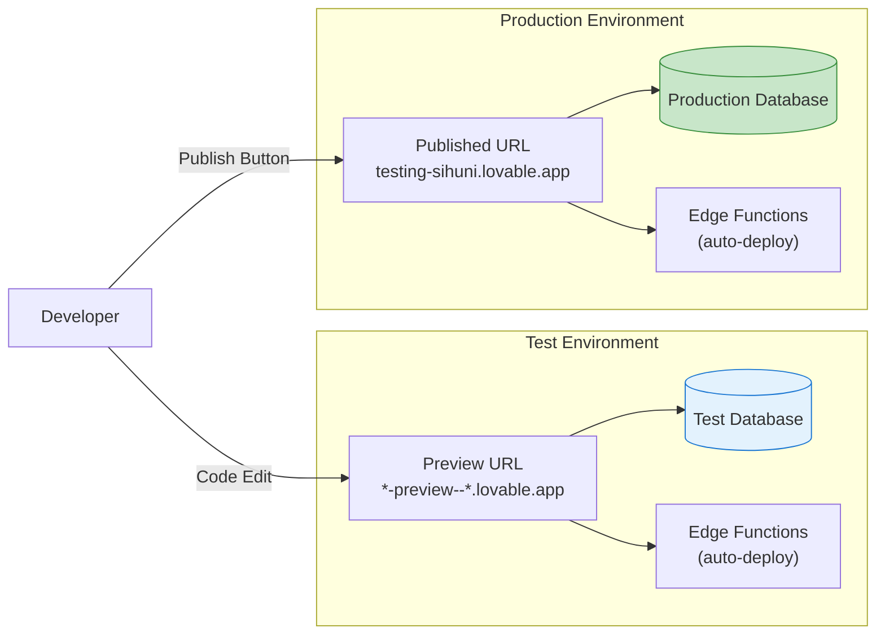
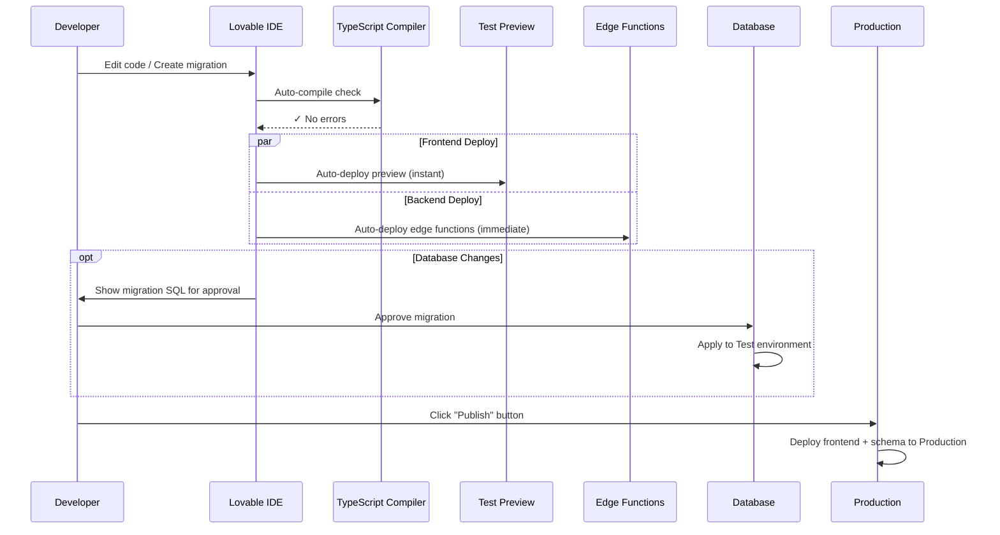
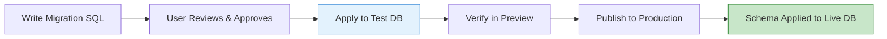

# Deployment & Infrastructure Documentation — SiHuni v2.0

**Version:** 2.0.0  
**Last Updated:** 2026-02-21  
**Status:** Living Document — Reflects Actual Implementation  
**Platform:** Lovable Cloud (Supabase-powered Serverless)

---

## 1. Introduction

This document defines the **actual** deployment architecture, infrastructure components, and operational procedures for the SiHuni (Sistem Manajemen Hunian) v2.0 platform as implemented on **Lovable Cloud**.

### 1.1 Scope

- Lovable Cloud serverless infrastructure
- Frontend build & delivery pipeline
- 31 Deno Edge Functions (backend)
- PostgreSQL 16 managed database
- Storage buckets & file handling
- External service integrations (Xendit, Resend, Lovable AI)
- Cron job scheduling
- Security & compliance
- Monitoring & disaster recovery

### 1.2 Architecture Philosophy

| Principle | Implementation |
|-----------|----------------|
| **Serverless-First** | No servers to manage; edge functions auto-scale to zero |
| **Zero-Config Scaling** | Lovable Cloud handles compute, database, and CDN scaling |
| **Two-Environment Model** | Isolated Test (preview) and Production (published) environments |
| **Security by Default** | 191 RLS policies, JWT auth, RBAC, HTTPS everywhere |
| **No Infrastructure-as-Code** | No Terraform, CloudFormation, or Docker — managed platform |

---

## 2. Platform Architecture

### 2.1 High-Level Deployment Topology

```mermaid
graph TD
    User["User Browser<br/>(Desktop / Mobile)"] -->|HTTPS| CDN["Lovable CDN<br/>*.lovable.app / Custom Domain"]

    CDN -->|Static Files| SPA["React SPA<br/>Vite 5.4 Build<br/>gzip + Brotli"]

    SPA -->|Supabase SDK| DB[("PostgreSQL 16<br/>66 Tables<br/>191 RLS Policies")]
    SPA -->|fetch()| EF["31 Deno Edge Functions<br/>Serverless, Auto-scaling"]
    SPA -->|SDK| Storage["Supabase Storage<br/>5 Buckets"]

    EF -->|Service Role| DB
    EF -->|API| Xendit["Xendit<br/>Payment Gateway"]
    EF -->|API| Resend["Resend<br/>Transactional Email"]
    EF -->|API| AI["Lovable AI<br/>Gemini 2.5 Flash/Pro"]
    EF -->|SDK| Storage

    Xendit -->|Webhook| EF
    Cron["External Cron Service"] -->|HTTP POST| EF

    style DB fill:#f3e5f5,stroke:#7b1fa2,stroke-width:2px
    style EF fill:#fff3e0,stroke:#f57c00,stroke-width:2px
    style CDN fill:#e3f2fd,stroke:#1976d2,stroke-width:2px
    style Xendit fill:#fce4ec,stroke:#c2185b,stroke-width:2px
    style Resend fill:#fce4ec,stroke:#c2185b,stroke-width:2px
    style AI fill:#e8f5e9,stroke:#388e3c,stroke-width:2px
```

### 2.2 Technology Stack

| Layer | Technology | Notes |
|-------|-----------|-------|
| **Frontend Hosting** | Lovable CDN | Global edge delivery, `*.lovable.app` |
| **Frontend Framework** | React 18.3 + TypeScript | Vite 5.4 build, SWC compiler |
| **Backend Runtime** | Deno Edge Functions | V8 isolates, TypeScript native |
| **Database** | PostgreSQL 16 | Managed by Lovable Cloud (Supavisor pooling) |
| **Auth** | Supabase Auth | JWT + RBAC via `app_role` enum |
| **Storage** | Supabase Storage | S3-compatible object storage |
| **Secrets** | Lovable Cloud Secrets | Encrypted, injected as env vars |
| **State Management** | Zustand + TanStack Query | Client-side caching |
| **UI Components** | shadcn/ui + Radix UI | 25 Radix primitives |
| **Charts** | Recharts | Revenue, occupancy visualizations |
| **Maps** | Leaflet + React Leaflet | Property location mapping |

---

## 3. Environment Architecture

### 3.1 Two-Environment Model



| Aspect | Test (Preview) | Production (Published) |
|--------|----------------|------------------------|
| **URL** | `id-preview--bee2790f-*.lovable.app` | `testing-sihuni.lovable.app` |
| **Database** | Isolated test data | Separate production data |
| **Edge Functions** | Auto-deployed on code save | Auto-deployed immediately |
| **Frontend** | Auto-deployed on code save | Manual publish trigger required |
| **Secrets** | Shared across environments | Shared across environments |
| **Storage Buckets** | Shared across environments | Shared across environments |

### 3.2 Key Deployment Rules

1. **Frontend** changes require clicking **"Update"** in the Publish dialog to go live
2. **Backend** changes (edge functions, DB migrations) deploy **immediately** and automatically
3. **Database migrations** require user approval before execution
4. **Destructive schema changes** require checking Live data first

### 3.3 Environment Variables & Secrets

#### Auto-Provisioned (Frontend `.env`)

| Variable | Purpose |
|----------|---------|
| `VITE_SUPABASE_URL` | Client SDK — database & auth endpoint |
| `VITE_SUPABASE_PUBLISHABLE_KEY` | Client SDK — anon key for public operations |
| `VITE_SUPABASE_PROJECT_ID` | Project identifier |

#### Auto-Provisioned (Edge Function Runtime)

| Variable | Purpose |
|----------|---------|
| `SUPABASE_URL` | Server-side database connection |
| `SUPABASE_SERVICE_ROLE_KEY` | Admin-level access (bypasses RLS) |
| `SUPABASE_ANON_KEY` | Public-level access (respects RLS) |

#### Manually Configured Secrets (4 Active)

| Secret | Purpose | Used By |
|--------|---------|---------|
| `LOVABLE_API_KEY` | Lovable AI integration (system-managed) | `ai-chatbot`, `merchant-ai-assistant`, `vendor-ai-assistant` |
| `XENDIT_SECRET_KEY` | Payment gateway API authentication | `xendit-create-invoice`, `xendit-disbursement` |
| `XENDIT_WEBHOOK_TOKEN` | Webhook signature verification | `xendit-webhook`, `xendit-disbursement-webhook` |
| `RESEND_API_KEY` | Transactional email service | `send-notification`, `send-payment-reminder` |

---

## 4. Deployment Pipeline

### 4.1 Development-to-Production Flow



### 4.2 Pipeline Characteristics

| Aspect | Detail |
|--------|--------|
| **Build Tool** | Vite 5.4 with React SWC plugin |
| **Type Checking** | TypeScript strict mode (automatic) |
| **Docker** | Not used — serverless platform |
| **CI/CD Pipelines** | Not needed — Lovable auto-deploy |
| **Container Registry** | Not used — no containers |
| **Infrastructure-as-Code** | Not needed — managed platform |
| **Manual Steps** | Only: Approve migrations, click Publish |

---

## 5. Frontend Build & Optimization

### 5.1 Vite Build Configuration

```typescript
// From vite.config.ts
{
  plugins: [
    react(),                                    // SWC compiler
    compression({ algorithm: 'gzip' }),         // .gz files
    compression({ algorithm: 'brotliCompress', ext: '.br' }), // .br files
  ],
  build: {
    rollupOptions: {
      output: {
        manualChunks: {
          vendor: ['react', 'react-dom', 'react-router-dom', 'react-helmet-async'],
          ui: [/* 25 Radix UI packages + CVA + lucide-react */],
          data: ['@tanstack/react-query', '@supabase/supabase-js', 'zod', 'zustand'],
          charts: ['recharts'],
          maps: ['leaflet', 'react-leaflet']
        }
      }
    },
    chunkSizeWarningLimit: 1000  // KB
  }
}
```

### 5.2 Code Splitting Strategy

| Chunk | Contents | Load Strategy |
|-------|----------|---------------|
| `vendor` | React, React DOM, Router, Helmet | Initial load |
| `ui` | 25 Radix UI primitives, CVA, Lucide icons | Initial load |
| `data` | TanStack Query, Supabase SDK, Zod, Zustand | Initial load |
| `charts` | Recharts | Lazy (dashboard only) |
| `maps` | Leaflet, React Leaflet | Lazy (property map only) |
| **25 Route Modules** | Feature pages (lazy `React.lazy()`) | On-demand per route |

### 5.3 Compression & Delivery

| Optimization | Detail |
|-------------|--------|
| **Gzip** | All JS/CSS assets compressed (`.gz`) |
| **Brotli** | All JS/CSS assets compressed (`.br`) |
| **Content Hashing** | Filenames include content hash for cache-busting |
| **CDN Edge Caching** | Static assets cached at global edge locations |
| **Immutable Headers** | Hashed assets served with long-lived cache |

---

## 6. Edge Functions Infrastructure

### 6.1 Runtime

| Property | Value |
|----------|-------|
| **Runtime** | Deno (V8 isolate) |
| **Language** | TypeScript (native, no transpilation) |
| **Cold Start** | ~50–200ms |
| **Scaling** | Auto-scale to zero / scale up on demand |
| **Timeout** | Platform default |
| **Container** | None — V8 isolate-based |

### 6.2 Function Catalog (31 Functions)

#### 6.2.1 Authentication & User Bootstrapping

| Function | `verify_jwt` | Purpose |
|----------|-------------|---------|
| `ensure-user-bootstrap` | **false** | Create profile + assign role on signup |
| `validate-admin-secret` | true | Validate admin 2FA TOTP code |
| `auth-webhook` | true | Handle auth event callbacks |

#### 6.2.2 Tenant Invitation

| Function | `verify_jwt` | Purpose |
|----------|-------------|---------|
| `get-tenant-invitation` | **false** | Retrieve invitation details by token |
| `accept-tenant-invitation` | **false** | Accept invitation and create tenant record |

#### 6.2.3 Billing Automation (Cron)

| Function | `verify_jwt` | Purpose |
|----------|-------------|---------|
| `auto-generate-invoices` | true | Generate rent invoices on billing day |
| `auto-pay-execute` | true | Process auto-pay enabled tenants |
| `check-overdue-escalation` | true | 4-tier overdue escalation |
| `check-payment-plan` | true | Monitor installment deadlines |

#### 6.2.4 Payment Gateway (Xendit)

| Function | `verify_jwt` | Purpose |
|----------|-------------|---------|
| `xendit-create-invoice` | true | Create payment invoice via Xendit API |
| `xendit-webhook` | true | Handle payment status callbacks |
| `subscription-payment` | **false** | Xendit callback/redirect for subscriptions |

#### 6.2.5 Escrow & Disbursement

| Function | `verify_jwt` | Purpose |
|----------|-------------|---------|
| `scheduled-disbursement` | true | Process merchant payouts on schedule |
| `xendit-disbursement` | true | Execute bank transfer via Xendit |
| `xendit-disbursement-webhook` | true | Confirm disbursement completion |
| `process-deposit-refund` | true | Calculate and process tenant deposit returns |

#### 6.2.6 Subscription Management

| Function | `verify_jwt` | Purpose |
|----------|-------------|---------|
| `subscription-billing` | true | Generate subscription invoices |
| `subscription-renewal` | true | Auto-renew expiring subscriptions |
| `subscription-grace-check` | true | Suspend/cancel grace-expired subscriptions |

#### 6.2.7 Referral Processing

| Function | `verify_jwt` | Purpose |
|----------|-------------|---------|
| `process-referral-commissions` | true | Process pending referral rewards |
| `process-referral-reward` | true | Apply referral bonuses |
| `process-vendor-order-referral` | true | Vendor order referral tracking |

#### 6.2.8 AI Assistants

| Function | `verify_jwt` | Purpose |
|----------|-------------|---------|
| `ai-chatbot` | true | General tenant AI assistant |
| `merchant-ai-assistant` | true | Merchant-specific AI assistant |
| `vendor-ai-assistant` | true | Vendor-specific AI assistant |

#### 6.2.9 Notifications

| Function | `verify_jwt` | Purpose |
|----------|-------------|---------|
| `send-notification` | true | Multi-channel notification dispatch |
| `send-payment-reminder` | true | Upcoming payment reminders |
| `whatsapp-notification` | true | WhatsApp message delivery |

#### 6.2.10 Operations

| Function | `verify_jwt` | Purpose |
|----------|-------------|---------|
| `vacancy-tracking-cron` | true | Update vacancy day counters |
| `order-auto-reject` | true | Reject unconfirmed orders (48h timeout) |
| `generate-invoice-pdf` | true | Generate downloadable invoice PDFs |

### 6.3 Public Functions (No JWT Required)

4 functions configured with `verify_jwt = false` in `supabase/config.toml`:

```toml
[functions.get-tenant-invitation]
verify_jwt = false

[functions.accept-tenant-invitation]
verify_jwt = false

[functions.ensure-user-bootstrap]
verify_jwt = false

[functions.subscription-payment]
verify_jwt = false
```

**Security Note:** These functions implement their own validation:
- **Invitation functions**: Token-based validation (UUID token lookup)
- **Bootstrap**: Called during signup flow (creates profile)
- **Subscription payment**: Xendit webhook signature verification via `XENDIT_WEBHOOK_TOKEN`

---

## 7. Database Infrastructure

### 7.1 PostgreSQL 16 Overview

| Metric | Value |
|--------|-------|
| **Engine** | PostgreSQL 16 |
| **Tables** | 66 public tables |
| **Functions** | 18 database functions |
| **Triggers** | 45+ triggers |
| **RLS Policies** | 191 policies |
| **Custom Types** | 1 enum (`app_role`) |
| **Connection Pooling** | Supavisor (built-in) |
| **Backups** | Automatic daily snapshots |

> Full schema documentation: [`docs/database-schema.md`](./database-schema.md)

### 7.2 Migration Strategy



**Critical Rules:**
1. Migrations apply to **Test** environment first
2. Publishing deploys schema changes to **Production**
3. **Data is never synced** between environments
4. Before removing columns/tables, check **Live** data first
5. If Live data needs preserving, provide migration query for manual execution

### 7.3 Key Database Automations

| Trigger | Fires On | Action |
|---------|----------|--------|
| `handle_new_user` | `auth.users` INSERT | Create `profiles` row |
| `set_merchant_code` | `merchants` INSERT | Generate `MRC-XXXXX` code |
| `create_merchant_escrow` | `merchants` INSERT | Create escrow account |
| `generate_invoice_number` | `invoices` INSERT | Generate `INV{YYYYMM}{seq}` |
| `generate_order_number` | `orders` INSERT | Generate `ORD-{YYYYMMDD}-{seq}` |
| `update_property_unit_counts` | `units` INSERT/UPDATE/DELETE | Sync counts |
| `set_maintenance_sla_deadline` | `maintenance_requests` INSERT | Calculate SLA |
| `update_vendor_maintenance_rating` | `maintenance_reviews` INSERT | Recalculate rating |
| `update_updated_at_column` | Multiple tables UPDATE | Auto-set `updated_at` |

---

## 8. Storage Infrastructure

### 8.1 Storage Buckets

| Bucket | Public | Purpose | Content Types |
|--------|--------|---------|---------------|
| `verification-documents` | **No** | KYC & business docs | KTP, NIB, SIUP scans |
| `property-images` | Yes | Property & unit photos | JPG, PNG, WebP |
| `maintenance-photos` | Yes | Maintenance evidence | Before/after repair photos |
| `product-photos` | Yes | Vendor product images | Marketplace product photos |
| `contract-documents` | **No** | Signed contracts | PDFs, digital signatures |

### 8.2 Storage Policies

- **Private buckets**: Read/write requires authenticated user matching RLS policy
- **Public buckets**: Read via CDN URL (no auth), write requires authentication
- **File path convention**: `{user_id}/{category}/{timestamp}-{random}.{ext}`
- **Size limits**: Platform defaults apply

---

## 9. External Service Integrations

### 9.1 Xendit — Payment Gateway

| Integration Point | Edge Function | Direction |
|-------------------|--------------|-----------|
| Create Payment Invoice | `xendit-create-invoice` | Outbound API call |
| Payment Status Callback | `xendit-webhook` | Inbound webhook |
| Subscription Payment | `subscription-payment` | Inbound callback/redirect |
| Bank Disbursement | `xendit-disbursement` | Outbound API call |
| Disbursement Confirmation | `xendit-disbursement-webhook` | Inbound webhook |

**Security:**
- API auth: `XENDIT_SECRET_KEY` (Basic Auth header)
- Webhook verification: `XENDIT_WEBHOOK_TOKEN` (timing-safe HMAC comparison)
- Idempotency: Duplicate detection via `xendit_transactions.xendit_external_id`
- No PCI data stored: All card/payment data handled by Xendit

**Supported Payment Methods:** Virtual Account, QRIS, E-Wallet, Credit Card

### 9.2 Resend — Email Service

| Category | Triggered By | Examples |
|----------|-------------|----------|
| Payment | `send-notification` | Invoice created, payment confirmed, overdue warning |
| Subscription | `subscription-billing` | Billing notice, renewal, grace period warning |
| Invitation | `send-notification` | Tenant invitation, welcome email |
| Reminder | `send-payment-reminder` | Upcoming due date alerts |
| Operations | Various | Maintenance updates, dispute notifications |

**Secret:** `RESEND_API_KEY`

### 9.3 Lovable AI — Chatbot & Assistants

| Function | Model | Context |
|----------|-------|---------|
| `ai-chatbot` | Gemini 2.5 Flash | Tenant FAQ, property info |
| `merchant-ai-assistant` | Gemini 2.5 Flash/Pro | Revenue analytics, tenant management tips |
| `vendor-ai-assistant` | Gemini 2.5 Flash | Job management, earnings insights |

**Secret:** `LOVABLE_API_KEY` (system-managed, cannot be deleted)  
**Note:** No external API key required — Lovable AI provides models natively.

---

## 10. Cron Job Infrastructure

### 10.1 Architecture

- **12 daily automated jobs** running as independent edge functions
- Triggered via external cron service calling edge function HTTP endpoints
- Each job is **idempotent** (safe to re-run without side effects)
- Each job handles its own error logging and recovery

### 10.2 Daily Schedule

| Time (UTC) | Function | Domain | Purpose |
|------------|----------|--------|---------|
| 00:00 | `auto-generate-invoices` | Billing | Generate rent invoices on billing day |
| 01:00 | `check-overdue-escalation` | Billing | Escalate overdue invoices (4-tier) |
| 02:00 | `check-payment-plan` | Billing | Monitor installment deadlines |
| 03:00 | `auto-pay-execute` | Billing | Process auto-pay enabled tenants |
| 04:00 | `subscription-billing` | Subscription | Generate merchant subscription invoices |
| 05:00 | `subscription-renewal` | Subscription | Auto-renew expiring subscriptions |
| 06:00 | `subscription-grace-check` | Subscription | Suspend/cancel grace-expired subs |
| 07:00 | `process-referral-commissions` | Referral | Process pending referral rewards |
| 08:00 | `send-payment-reminder` | Notification | Send upcoming payment reminders |
| 09:00 | `scheduled-disbursement` | Financial | Process merchant payouts to bank |
| 10:00 | `order-auto-reject` | Marketplace | Reject unconfirmed orders (48h) |
| 11:00 | `vacancy-tracking-cron` | Property | Update vacancy day counters |

### 10.3 Cron Job Design Principles

1. **Idempotent**: Running twice produces same result (no duplicates)
2. **Independent**: Each job has no dependency on other jobs
3. **Logged**: All actions recorded in `audit_logs` table
4. **Recoverable**: Failed jobs can be manually re-triggered
5. **Scoped**: Each job processes only its domain's data

---

## 11. Security Infrastructure

### 11.1 Authentication & Authorization

| Layer | Implementation |
|-------|----------------|
| **Auth Provider** | Supabase Auth (JWT-based) |
| **Signup** | Email + password (email verification required) |
| **RBAC** | `user_roles` table + `app_role` enum (admin, merchant, tenant, vendor) |
| **Role Check** | `has_role(user_id, role)` database function |
| **Admin 2FA** | TOTP via `otpauth` library |
| **Session** | Supabase-managed refresh tokens |

### 11.2 Data Security

| Measure | Detail |
|---------|--------|
| **Row Level Security** | 191 policies enforce per-role data isolation |
| **Service Role Key** | Edge functions use `SUPABASE_SERVICE_ROLE_KEY` for admin ops |
| **Webhook HMAC** | Timing-safe comparison for Xendit webhook verification |
| **Input Sanitization** | DOMPurify for user-generated HTML content |
| **PCI Compliance** | No card/payment data stored — Xendit handles all PCI scope |
| **Audit Trail** | Immutable `audit_logs` table (INSERT-only, no UPDATE/DELETE policies) |

### 11.3 Network Security

| Measure | Detail |
|---------|--------|
| **HTTPS** | Enforced on all endpoints (CDN + Edge Functions + DB) |
| **CORS** | Managed by Supabase Edge Functions runtime |
| **Rate Limiting** | Built-in via Lovable Cloud platform |
| **Database Access** | SDK-only (no exposed ports, no direct SQL connections) |
| **Secrets** | Encrypted at rest, injected as env vars at runtime |

### 11.4 RBAC Access Pattern Summary

| Role | Data Access Pattern |
|------|-------------------|
| **Admin** | Full access to all tables via `has_role(auth.uid(), 'admin')` |
| **Merchant** | Own data via `merchants.user_id = auth.uid()` join |
| **Tenant** | Own data via `tenant_user_id = auth.uid()` direct |
| **Vendor** | Own data via `vendors.user_id = auth.uid()` join |
| **Public** | `platform_settings`, `subscription_tiers` (active), `forum_posts` (visible) |

---

## 12. Scalability

### 12.1 Frontend

- **CDN-delivered SPA**: Infinite horizontal scaling at edge
- **Code splitting**: 6 vendor chunks + 25 lazy-loaded route modules
- **Compression**: Dual gzip + Brotli reduces transfer size ~70%

### 12.2 Backend

- **Edge functions**: Scale to zero when idle, scale up automatically on demand
- **Database**: Upgradable instance size via Settings → Cloud → Advanced Settings
- **Connection pooling**: Supavisor manages concurrent connections
- **Storage**: S3-compatible, virtually unlimited capacity

### 12.3 Performance Optimizations

| Optimization | Implementation |
|-------------|----------------|
| **Client Cache** | TanStack Query with stale-while-revalidate |
| **Partial Indexes** | Status-based filters (e.g., `WHERE status = 'pending'`) |
| **Composite Indexes** | Multi-column indexes for dashboard queries |
| **Lazy Loading** | React.lazy() for 25 feature modules |
| **JSONB** | Flexible schema for settings, metadata, inspection reports |

---

## 13. Monitoring & Observability

### 13.1 Available Log Sources

| Source | Access | Retention |
|--------|--------|-----------|
| **Edge Function Logs** | Lovable Cloud UI | Platform default |
| **Database Logs** | `postgres_logs` analytics table | Platform default |
| **Auth Logs** | `auth_logs` analytics table | Platform default |
| **Audit Trail** | `audit_logs` table (app-level) | Permanent (in DB) |
| **Analytics Events** | `analytics_events` table | Permanent (in DB) |
| **Chatbot Analytics** | `chatbot_analytics` table | Permanent (in DB) |

### 13.2 Application-Level Monitoring

| Metric | Source | Visualization |
|--------|--------|---------------|
| Revenue & GMV | `payments`, `escrow_transactions` | Admin Recharts dashboard |
| Occupancy Rate | `units`, `contracts` | Admin dashboard |
| Subscription MRR | `merchant_subscriptions` | Admin dashboard |
| Overdue Aging | `invoices`, `collections_cases` | Admin dashboard |
| Maintenance SLA | `maintenance_requests` | Admin dashboard |
| Chatbot Usage | `chatbot_analytics` | Admin analytics |

### 13.3 Not Currently Integrated

- External APM (DataDog, New Relic)
- Error tracking service (Sentry)
- Uptime monitoring
- Distributed tracing

---

## 14. Disaster Recovery

### 14.1 Backup Strategy

| Component | Backup Method | Recovery |
|-----------|--------------|----------|
| **Database** | Automatic daily snapshots | Point-in-time recovery via Cloud settings |
| **Storage** | Object versioning | Restore previous version |
| **Code** | Git-based version history | Revert in Lovable IDE |
| **Edge Functions** | Code-as-deployed | Re-deploy from code |

### 14.2 Recovery Procedures

1. **Database restore**: Cloud Settings → Advanced → Restore from backup
2. **Code rollback**: Lovable IDE → Revert to previous version
3. **Edge function fix**: Edit code → auto-redeploy (immediate)
4. **Secret rotation**: Update via Lovable Cloud Secrets UI

### 14.3 Data Isolation Guarantees

- Test and Production databases are **fully isolated**
- Publishing deploys **schema only** (no data sync)
- Destructive schema changes require manual Live data migration via Cloud → Run SQL

---

## 15. Cost Architecture

### 15.1 Platform Costs

| Component | Pricing Model |
|-----------|--------------|
| **Lovable Cloud (Database + Auth + Storage)** | Usage-based with free tier |
| **Edge Function Invocations** | Usage-based |
| **Instance Size** | Configurable (Settings → Cloud → Advanced) |
| **Lovable AI** | Usage-based with free tier included |

### 15.2 External Service Costs

| Service | Pricing Model | Used For |
|---------|--------------|----------|
| **Xendit** | Per-transaction (VA, e-wallet, QRIS, CC rates) | Tenant rent payments, disbursements |
| **Resend** | Per-email | Notifications, reminders, invitations |

### 15.3 Cost Optimization

- Edge functions scale to zero (no idle compute cost)
- No reserved instances or capacity planning needed
- Storage uses S3-compatible tiering
- AI usage via Lovable AI (no separate API key costs)

---

## 16. Deployment Checklist

### Pre-Production Release

- [ ] All TypeScript compilation errors resolved
- [ ] New tables have appropriate RLS policies
- [ ] Edge functions tested via preview environment
- [ ] Database migrations applied and verified in Test
- [ ] All required secrets configured (currently 4 active)
- [ ] Storage bucket policies verified
- [ ] Cron job endpoints tested manually
- [ ] Frontend published via Publish button
- [ ] Production URL verified and accessible

### Post-Deployment Verification

- [ ] Edge function logs checked for errors
- [ ] Auth flow tested (signup, login, role assignment)
- [ ] Payment flow tested end-to-end (if changed)
- [ ] Critical dashboard data loading correctly
- [ ] Webhook endpoints responding (Xendit)

---

## 17. Reference Links

| Resource | Location |
|----------|----------|
| **Database Schema** | [`docs/database-schema.md`](./database-schema.md) |
| **API Specification** | [`docs/api-specification.md`](./api-specification.md) |
| **Backend Architecture** | [`docs/backend-architecture.md`](./backend-architecture.md) |
| **Edge Function Code** | `supabase/functions/` (31 directories) |
| **Vite Config** | `vite.config.ts` |
| **Supabase Config** | `supabase/config.toml` |

---

*Document auto-generated from live Lovable Cloud infrastructure analysis. Last verified against 31 deployed edge functions, 66 database tables, 4 configured secrets, and 5 storage buckets.*
