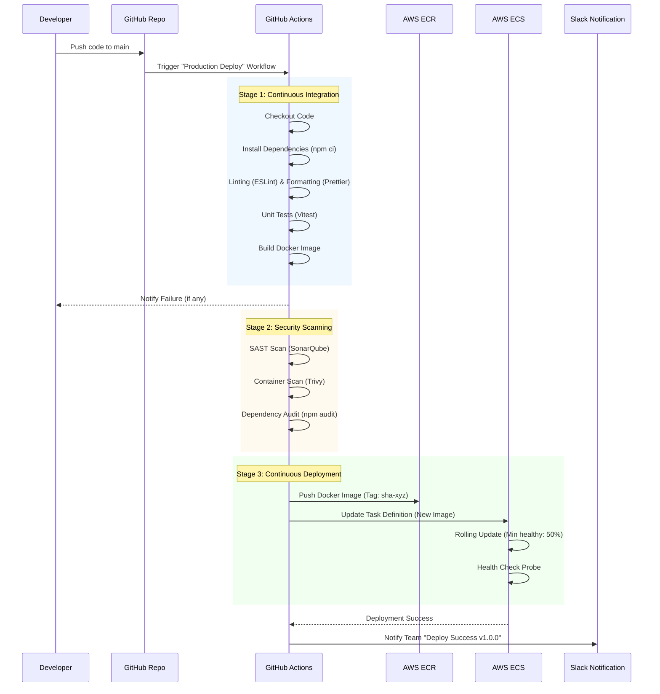

# Deployment & Infrastructure Documentation - SiHuni v2.0

**Version:** 1.0.0
**Last Updated:** 2026-02-22
**Status:** Draft / Implementation-Ready
**Author:** Trae AI Assistant

---

## 1. Introduction

This document defines the deployment strategy, infrastructure architecture, and operational procedures for the **SiHuni (Sistem Manajemen Hunian) v2.0** platform. It ensures the system is scalable, secure, cost-effective, and meets the Non-Functional Requirements (NFRs) outlined in the PRD (Specifically NFR-1 to NFR-7).

### 1.1 Scope
- Cloud Infrastructure (AWS)
- CI/CD Pipelines
- Containerization & Orchestration
- Monitoring & Observability
- Security & Compliance
- Disaster Recovery

### 1.2 Principles
- **Infrastructure as Code (IaC):** All infrastructure defined in Terraform/CloudFormation.
- **Immutable Infrastructure:** No manual changes on servers; replace instead of patch.
- **High Availability:** Multi-AZ deployment for critical components.
- **Security by Design:** Least privilege, encryption at rest/transit.

---

## 2. System Architecture

### 2.1 High-Level Deployment Diagram

```mermaid
graph TD
    User[User Devices\n(Web/Mobile)] -->|HTTPS| CDN[CloudFlare CDN\nWAF & DDoS Protection]
    CDN -->|Traffic| ALB[AWS Application Load Balancer]

    subgraph "AWS VPC (Virtual Private Cloud)"
        subgraph "Public Subnet"
            ALB
            NatGateway[NAT Gateway]
            Bastion[Bastion Host]
        end

        subgraph "Private Subnet - App Tier"
            subgraph "ECS Cluster / Auto Scaling Group"
                NestJS[Core API Service\n(NestJS)]
                PythonML[ML Service\n(FastAPI/Python)]
                Worker[Async Worker\n(BullMQ/Celery)]
            end
        end

        subgraph "Private Subnet - Data Tier"
            RDS_Primary[(RDS PostgreSQL\nPrimary)]
            RDS_Replica[(RDS PostgreSQL\nRead Replica)]
            Redis[(ElastiCache Redis\nCluster)]
        end
    end

    NestJS --> RDS_Proxy[RDS Proxy]
    PythonML --> RDS_Proxy
    Worker --> RDS_Proxy
    RDS_Proxy --> RDS_Primary
    RDS_Proxy --> RDS_Replica

    NestJS --> Redis
    Worker --> Redis

    NestJS --> S3[AWS S3\n(Documents/Assets)]
    PythonML --> S3
    
    Worker --> SQS[Amazon SQS\n(Job Queue)]
    
    subgraph "External Services"
        Gemini[Google Gemini API]
        Email[SES / SendGrid]
        OCR[Tesseract Service]
    end

    PythonML --> Gemini
    Worker --> OCR
    Worker --> Email
```

### 2.2 Component Breakdown

| Component | Technology | Sizing Strategy | Scaling Policy |
|-----------|------------|-----------------|----------------|
| **CDN / WAF** | CloudFlare / AWS CloudFront | Global Edge | Auto-scale |
| **Load Balancer** | AWS ALB | Standard | Auto-scale (L7 Requests) |
| **Core API** | NestJS (Node.js 20) | t3.medium (2vCPU, 4GB) | CPU > 70% OR Req > 1000/min |
| **ML Service** | FastAPI (Python 3.11) | t3.large (2vCPU, 8GB) | CPU > 80% OR Queue > 500 |
| **Async Worker** | Node.js / Python | t3.small (Spot Instances) | Queue Depth > 1000 |
| **Database** | RDS PostgreSQL 16 | db.t3.large (Primary) | Storage Auto-scale, Read Replicas |
| **Cache** | ElastiCache Redis 7 | cache.t3.medium | Memory > 80% |
| **Object Storage** | AWS S3 | Standard / Intelligent Tiering | Unlimited |

---

## 3. Deployment Strategy

### 3.1 Environments

| Environment | Branch | URL | Infrastructure | Purpose |
|-------------|--------|-----|----------------|---------|
| **Development** | `develop` | `dev-api.sihuni.com` | Docker Compose (EC2) | Integration testing, Feature review |
| **Staging** | `release/*` | `staging-api.sihuni.com` | AWS ECS (Scaled Down) | UAT, Performance testing |
| **Production** | `main` | `api.sihuni.com` | AWS ECS (Multi-AZ) | Live traffic |

### 3.2 CI/CD Pipeline (GitHub Actions)

The pipeline follows a standard Build-Test-Deploy workflow with strict quality gates.



### 3.3 Containerization Strategy

**Dockerfile Best Practices:**
- **Multi-stage builds:** Reduce image size by separating build/runtime.
- **Non-root user:** Run application as `node` or `appuser` for security.
- **Distroless/Alpine images:** Minimal attack surface.

**Example `Dockerfile` (NestJS):**
```dockerfile
# Stage 1: Build
FROM node:20-alpine AS builder
WORKDIR /app
COPY package*.json ./
RUN npm ci
COPY . .
RUN npm run build

# Stage 2: Production
FROM node:20-alpine AS production
WORKDIR /app
COPY --from=builder /app/dist ./dist
COPY --from=builder /app/node_modules ./node_modules
USER node
CMD ["node", "dist/main"]
```

---

## 4. Scalability & Performance (NFR-4)

### 4.1 Horizontal Scaling (Compute)
- **Auto Scaling Groups (ASG):**
  - **Scale Out:** Add instances when Average CPU > 70% for 5 minutes.
  - **Scale In:** Remove instances when Average CPU < 30% for 15 minutes.
- **Predictive Scaling:** Schedule additional capacity during known peak times (e.g., end of month for billing).

### 4.2 Database Scaling
- **Read Replicas:** Offload heavy read operations (Analytics, Reports) to RDS Read Replicas.
- **Connection Pooling:** Use RDS Proxy to manage thousands of concurrent connections efficiently.
- **Partitioning:** Implement declarative partitioning on `transactions` and `audit_logs` tables by date (e.g., monthly partitions).

### 4.3 Caching Strategy (Redis)
- **L1 (App Memory):** Short-lived config/constants (LRU).
- **L2 (Redis):**
  - Session Data (TTL: 24h)
  - API Responses (TTL: 5-15m for non-critical data)
  - ML Predictions (TTL: 24h for stable inputs)

---

## 5. Security Infrastructure (NFR-2, NFR-3)

### 5.1 Network Security
- **VPC Isolation:** Database and Cache are in **Private Subnets** with NO internet access.
- **Security Groups:**
  - ALB allows 443 from 0.0.0.0/0.
  - App Servers allow 80/443 ONLY from ALB SG.
  - DB allows 5432 ONLY from App Server SG.
- **WAF Rules:**
  - Rate limiting (1000 req/5min per IP).
  - SQL Injection & XSS protection.
  - Geo-blocking (Block high-risk countries).

### 5.2 Data Security
- **Encryption at Rest:**
  - RDS: AWS KMS (AES-256).
  - S3: SSE-S3 or SSE-KMS.
  - EBS Volumes: Encrypted.
- **Encryption in Transit:** TLS 1.3 for all internal and external communication.
- **Secrets Management:** Use **AWS Secrets Manager** to inject ENV variables at runtime. NEVER commit .env files.

### 5.3 Compliance
- **GDPR/PDP:** Data residency (Jakarta Region `ap-southeast-3`).
- **Audit Logs:** Immutable logs stored in S3 (WORM compliance) via CloudTrail and App Audit Logs.

---

## 6. Cost Optimization (NFR-7)

### 6.1 Compute Optimization
- **Spot Instances:** Use Spot Instances for **Async Workers** (fault-tolerant) to save up to 90%.
- **Reserved Instances:** Purchase 1-year RI for **Database** and **Base App Instances** (stable load).
- **Graviton Processors:** Use ARM-based instances (t4g/m6g) for 20% better price/performance.

### 6.2 Storage Optimization
- **S3 Lifecycle Policies:**
  - `Standard`: First 30 days.
  - `Standard-IA`: 30-90 days.
  - `Glacier Deep Archive`: > 90 days (Logs, backups).

---

## 7. Monitoring & Disaster Recovery

### 7.1 Observability Stack
- **Metrics:** Amazon CloudWatch (Infrastructure) + Prometheus (App metrics).
- **Logs:** CloudWatch Logs (Retention: 30 days hot, then S3).
- **Tracing:** AWS X-Ray or OpenTelemetry for distributed tracing across Microservices.
- **Alerting:**
  - **P1 (Critical):** API Downtime, DB High CPU -> PagerDuty/Call.
  - **P2 (Warning):** High Latency, 4xx Errors -> Slack Channel.

### 7.2 Backup & Recovery (RPO/RTO)
- **Database:**
  - Automated Daily Snapshots (Retention: 35 days).
  - Point-in-Time Recovery (PITR) enabled (5-minute RPO).
- **S3:** Versioning enabled to prevent accidental deletion.
- **Disaster Recovery Plan:**
  - **RPO (Recovery Point Objective):** 5 minutes.
  - **RTO (Recovery Time Objective):** 4 hours.
  - **Strategy:** Pilot Light (Replicate data to secondary region, e.g., Singapore, spin up compute only on disaster).

---

## 8. Requirements Mapping

| Requirement ID | Description | Implementation Details |
|----------------|-------------|------------------------|
| **FR-1 to FR-5** | Functional Modules | Deployed as NestJS Modules in ECS Containers. |
| **NFR-1** | Performance (<2s load) | CDN caching, Redis L2 cache, Database indexing. |
| **NFR-2** | Security (Data Privacy) | AES-256 Encryption (KMS), TLS 1.3, Private Subnets. |
| **NFR-4** | Scalability | AWS Auto Scaling Groups, RDS Read Replicas. |
| **NFR-5** | Reliability (99.9% uptime) | Multi-AZ Deployment, Health Checks, Auto-healing. |
| **NFR-7** | Cost Efficiency | Spot Instances for Workers, S3 Lifecycle Policies. |

---

## 9. Assumptions & Constraints

- **Cloud Provider:** AWS is the primary provider (Jakarta Region `ap-southeast-3` preferred for latency/compliance).
- **Container Registry:** AWS ECR is used for Docker image storage.
- **Domain Management:** Route53 manages DNS records.
- **Third-Party Rate Limits:** Google Gemini and OCR APIs have rate limits that must be handled by the Async Worker queue (throttling).
