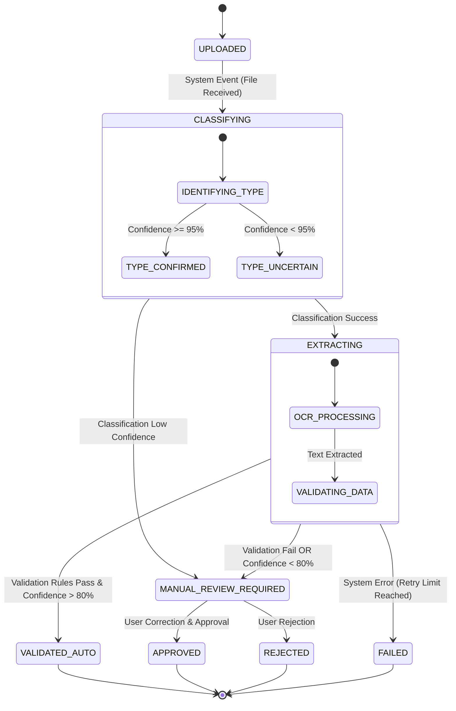
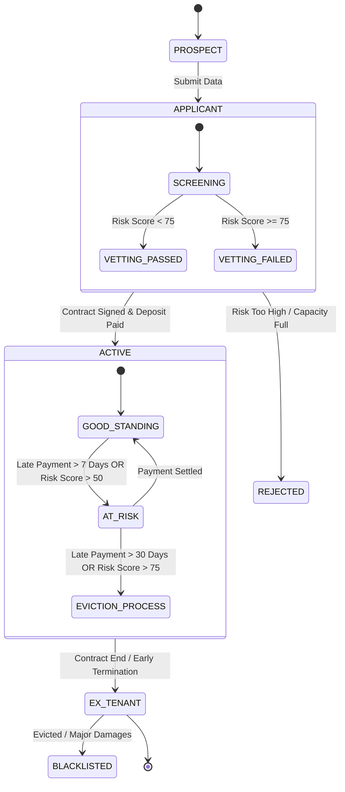
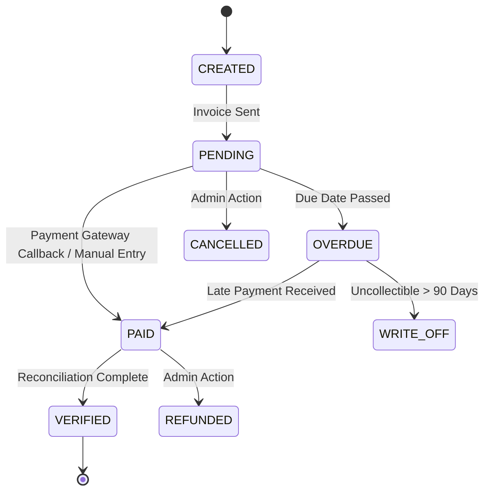
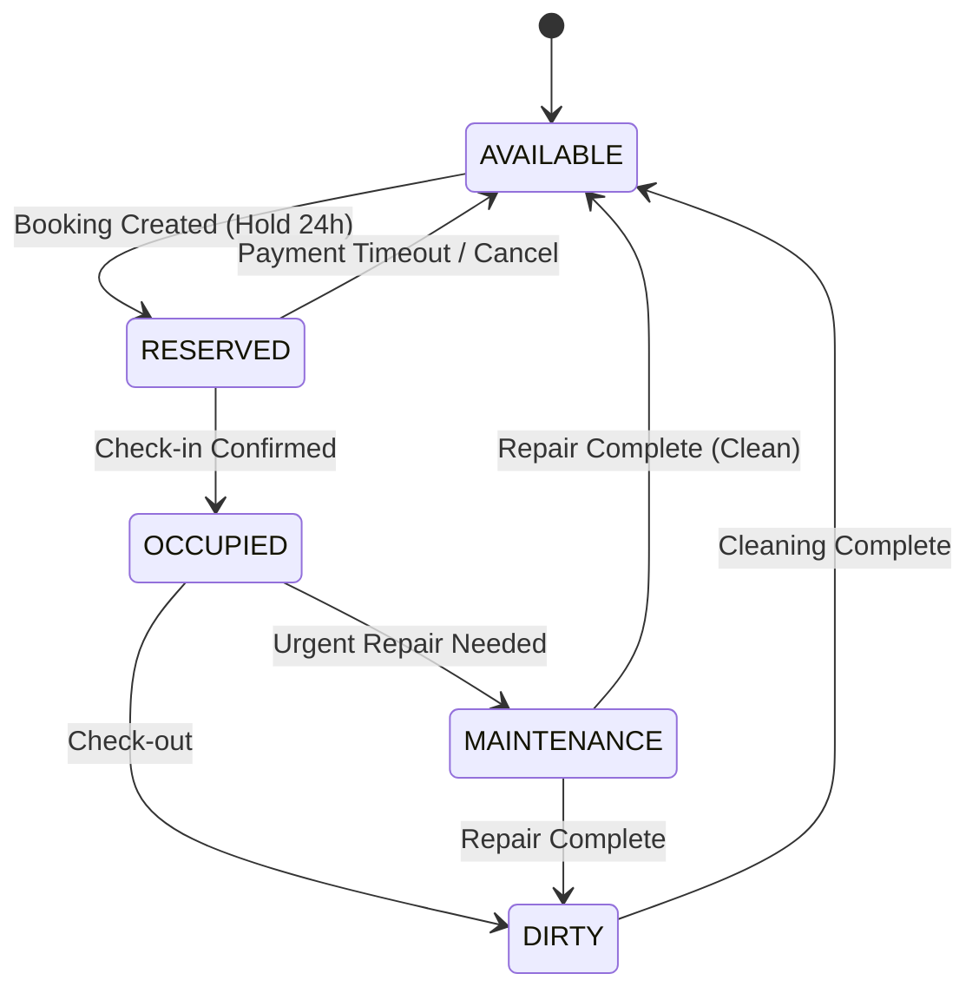
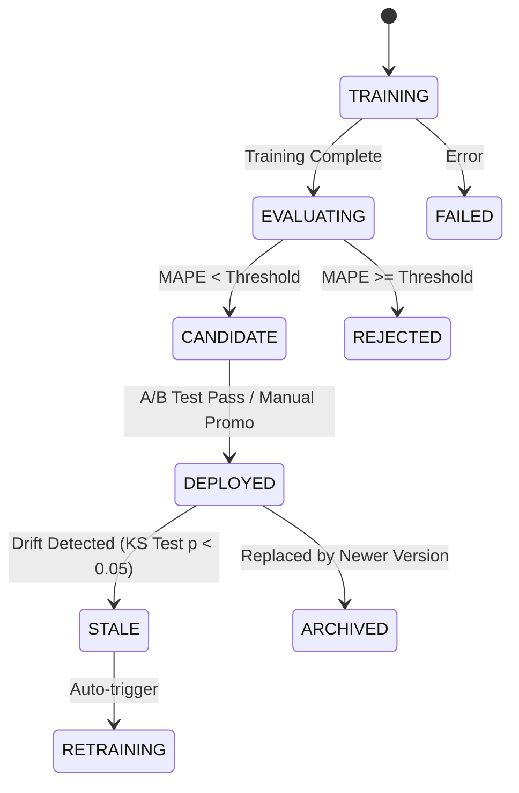

# Domain State Machines & Workflows

**Version:** 1.0  
**Last Updated:** 2026-02-22  
**Author:** Trae AI Pair Programmer  
**Status:** Implementation Ready  

---

## 1. Introduction

### 1.1 Purpose
This document defines the **Finite State Machines (FSM)** and **Workflows** for the SiHuni system. It serves as the single source of truth for entity lifecycles, ensuring consistency between the backend business logic (NestJS/Temporal), database states (PostgreSQL), and frontend representation (React/UI).

### 1.2 Scope
This document covers the following core domains:
1.  **Document Processing (OCR):** From upload to data extraction approval.
2.  **Tenant Lifecycle:** From prospect to ex-tenant.
3.  **Transaction & Payment:** From invoice creation to settlement.
4.  **Room Occupancy:** From availability to maintenance.
5.  **ML Model Lifecycle:** From training to deployment and archiving.
6.  **Maintenance Ticket:** From report to resolution.

### 1.3 Alignment with Architecture
*   **Pattern:** State Machine Pattern (using `xstate` logic or dedicated State classes in NestJS).
*   **Orchestration:** Long-running states (e.g., OCR Processing, ML Training) are managed via **Temporal Workflows**.
*   **Persistence:** Current state stored in PostgreSQL columns; transitions logged in `audit_logs` or dedicated history tables.
*   **Events:** State transitions emit Domain Events (e.g., `TenantApprovedEvent`, `PaymentVerifiedEvent`) to trigger side effects.

---

## 2. Document Processing Workflow (OCR)

**Requirement Reference:** PRD FR-1 (Digitalisasi Dokumen)

### 2.1 Description
Handles the lifecycle of uploaded documents (KTP, Contracts, Receipts) through the AI processing pipeline. This is a high-throughput, async workflow.

### 2.2 State Diagram



### 2.3 State Transitions Table

| From State | Event / Trigger | Guard Condition | To State | Action / Side Effect |
| :--- | :--- | :--- | :--- | :--- |
| `UPLOADED` | `FILE_UPLOADED` | File Size < 10MB | `CLASSIFYING` | Trigger Temporal Workflow `ProcessDocumentWorkflow` |
| `CLASSIFYING` | `CLASSIFICATION_COMPLETE` | Score < 0.95 | `MANUAL_REVIEW_REQUIRED` | Flag as `needs_classification_review` |
| `CLASSIFYING` | `CLASSIFICATION_COMPLETE` | Score >= 0.95 | `EXTRACTING` | Set `document_type` |
| `EXTRACTING` | `EXTRACTION_COMPLETE` | Avg Confidence < 0.8 OR Validation Fail | `MANUAL_REVIEW_REQUIRED` | Highlight low-confidence fields in JSON |
| `EXTRACTING` | `EXTRACTION_COMPLETE` | Avg Confidence >= 0.8 AND Validation Pass | `VALIDATED_AUTO` | Sync data to Entity (Tenant/Payment) |
| `MANUAL_REVIEW_REQUIRED` | `USER_APPROVE` | User Role >= ADMIN | `APPROVED` | Apply user edits, Retrain ML trigger |
| `MANUAL_REVIEW_REQUIRED` | `USER_REJECT` | User Role >= ADMIN | `REJECTED` | Notify uploader |

### 2.4 Data Structure (JSONB)
Stored in `documents.processing_metadata`:
```json
{
  "stage": "EXTRACTING",
  "attempts": 1,
  "confidence_scores": {
    "classification": 0.98,
    "ocr_field_avg": 0.72
  },
  "flags": ["LOW_CONFIDENCE_NIK", "DATE_FORMAT_MISMATCH"]
}
```

---

## 3. Tenant Lifecycle

**Requirement Reference:** PRD FR-2.3 (Tenant Scoring & Risk)

### 3.1 Description
Manages the long-term relationship with a tenant, from initial application to moving out. Risk scoring (Green/Yellow/Orange/Red) is a property of the tenant but influences state transitions (e.g., Eviction).

### 3.2 State Diagram



### 3.3 State Transitions Table

| From State | Event / Trigger | To State | UI Representation (Badge Color) |
| :--- | :--- | :--- | :--- |
| `PROSPECT` | `FORM_SUBMISSION` | `APPLICANT` | Blue (Info) |
| `APPLICANT` | `RISK_CHECK_FAIL` | `REJECTED` | Red (Destructive) |
| `APPLICANT` | `CONTRACT_SIGNED` | `ACTIVE` | Green (Success) |
| `ACTIVE` | `RISK_SCORE_UPDATE` (>50) | `AT_RISK` | Yellow (Warning) |
| `AT_RISK` | `PAYMENT_SETTLED` | `ACTIVE` | Green (Success) |
| `ACTIVE` | `CHECK_OUT` | `EX_TENANT` | Grey (Muted) |

---

## 4. Payment Transaction Lifecycle

**Requirement Reference:** PRD FR-4.1 (Revenue), FR-2.3 (Payment History)

### 4.1 Description
Tracks individual invoice/payment records. Crucial for financial reporting and tenant risk scoring.

### 4.2 State Diagram



### 4.3 Constraints
*   **Immutability:** Once `VERIFIED`, the record cannot be modified, only `REFUNDED` via a separate transaction (Ledger principle).
*   **Idempotency:** Payment callbacks (Webhooks) must handle duplicate events for the same Transaction ID without changing state from `PAID` to `PAID`.

---

## 5. Room/Property Occupancy

**Requirement Reference:** FR-2.1 (Price Opt), FR-2.2 (Occupancy Pred)

### 5.1 Description
Tracks the physical status of a room. This is the source of truth for availability searches.

### 5.2 State Diagram



---

## 6. ML Model Lifecycle (MLOps)

**Requirement Reference:** FR-2.4 (Model Monitoring & Retraining)

### 6.1 Description
Manages the versioning and deployment status of the Price Optimization and Occupancy Prediction models.

### 6.2 State Diagram



---

## 7. Implementation Guidelines

### 7.1 Database Schema (PostgreSQL Enums)
To ensure data integrity, use native PostgreSQL enums for these states.

```sql
CREATE TYPE document_status AS ENUM ('UPLOADED', 'CLASSIFYING', 'EXTRACTING', 'MANUAL_REVIEW', 'APPROVED', 'REJECTED', 'FAILED');
CREATE TYPE tenant_status AS ENUM ('PROSPECT', 'APPLICANT', 'ACTIVE', 'AT_RISK', 'EVICTION_PROCESS', 'EX_TENANT', 'BLACKLISTED');
CREATE TYPE payment_status AS ENUM ('CREATED', 'PENDING', 'PAID', 'VERIFIED', 'OVERDUE', 'CANCELLED', 'REFUNDED', 'WRITE_OFF');
CREATE TYPE room_status AS ENUM ('AVAILABLE', 'RESERVED', 'OCCUPIED', 'MAINTENANCE', 'DIRTY');
```

### 7.2 NestJS Implementation (State Pattern)
Do not use switch-case spaghetti code. Use the **State Pattern** or a library like `xstate`.

```typescript
// Example: Document Context
export abstract class DocumentState {
  constructor(protected document: DocumentEntity) {}
  abstract process(): Promise<void>;
  abstract approve(): Promise<void>;
}

export class ManualReviewState extends DocumentState {
  async process() {
    throw new Error("Cannot auto-process in Manual Review state.");
  }
  async approve() {
    this.document.state = new ApprovedState(this.document);
    await this.document.save();
  }
}
```

### 7.3 UI Mapping (Design Tokens)
Map states to UI colors defined in `UIUX_Design_Documentation_SiHuni.md`.

| State Category | Color Token | Hex | Usage Example |
| :--- | :--- | :--- | :--- |
| **Success / Active / Paid** | `var(--success)` | `#22C55E` | Tenant Active, Payment Verified |
| **Warning / Review / Overdue** | `var(--warning)` | `#F59E0B` | Manual Review, Payment Overdue |
| **Error / Rejected / Failed** | `var(--destructive)` | `#EF4444` | Tenant Rejected, OCR Failed |
| **Info / Processing / Pending** | `var(--info)` | `#3B82F6` | Uploaded, Classifying |
| **Neutral / Draft / Ex** | `var(--muted-foreground)` | `#8F7A56` | Ex-Tenant, Cancelled |

### 7.4 Temporal Workflow Definition
For the **Document Processing** workflow, define the workflow interface clearly:

```typescript
// workflows.ts
export async function processDocumentWorkflow(docId: string): Promise<void> {
  const classification = await classifyDocument(docId); // Activity
  
  if (classification.confidence < 0.95) {
    await setDocumentState(docId, 'MANUAL_REVIEW_REQUIRED'); // Activity
    await waitForHumanApproval(docId); // Signal
  }
  
  const extraction = await extractData(docId); // Activity
  // ... rest of logic
}
```
