# Domain State Machines & Workflows

> **Version:** 3.0 — DSS Edition  
> **Last Updated:** 2026-02-21  
> **Platform:** SiHuni — Lovable Cloud (React 18 SPA + Deno Edge Functions)  
> **Changelog:** Added 4 DSS state machines (OCR Result, Payment Verification, DSS Recommendation, ML Model Run), updated cron table (14 jobs), updated cross-domain diagram

## Table of Contents

1. [Introduction](#1-introduction)
2. [Contract Lifecycle](#2-contract-lifecycle)
3. [Unit Status](#3-unit-status)
4. [Invoice Lifecycle](#4-invoice-lifecycle)
5. [Overdue Escalation](#5-overdue-escalation-4-tier)
6. [Payment Status](#6-payment-status)
7. [Payment Plan Lifecycle](#7-payment-plan-lifecycle)
8. [Maintenance Request Lifecycle](#8-maintenance-request-lifecycle)
9. [Merchant Subscription Lifecycle](#9-merchant-subscription-lifecycle)
10. [Move-Out Workflow](#10-move-out-workflow)
11. [Order Lifecycle (Marketplace)](#11-order-lifecycle-marketplace)
12. [Vendor Job Lifecycle](#12-vendor-job-lifecycle)
13. [Disbursement Lifecycle](#13-disbursement-lifecycle)
14. [Tenant Invitation Lifecycle](#14-tenant-invitation-lifecycle)
15. [Referral Lifecycle](#15-referral-lifecycle)
16. [Verification Workflows](#16-verification-workflows)
17. [Dispute Lifecycle](#17-dispute-lifecycle)
18. [Deposit Refund Lifecycle](#18-deposit-refund-lifecycle)
19. [Escrow Transaction Lifecycle](#19-escrow-transaction-lifecycle)
20. [UI State-Color Mapping](#20-ui-state-color-mapping)
21. [Implementation Guidelines](#21-implementation-guidelines)
22. [DSS: OCR Result Lifecycle](#22-dss-ocr-result-lifecycle)
23. [DSS: Payment Verification Lifecycle](#23-dss-payment-verification-lifecycle)
24. [DSS: Recommendation Lifecycle](#24-dss-recommendation-lifecycle)
25. [DSS: ML Model Run Lifecycle](#25-dss-ml-model-run-lifecycle)

---

## 1. Introduction

### Architecture

SiHuni implements **application-level state machines** — not library-based (no xstate, no Temporal, no NestJS State Pattern). Status management is distributed across three enforcement layers:

| Layer | Mechanism | Example |
|-------|-----------|---------|
| **Application** | `VALID_STATUS_TRANSITIONS` maps in TypeScript services | Contract status changes in `contractService.ts` |
| **Database** | Triggers and default values | `update_unit_status_on_contract_sign()` trigger |
| **Edge Functions** | Cron-based time transitions | `check-overdue-escalation`, `order-auto-reject` |

### State Persistence

All status columns use **PostgreSQL `text` type** with default values — not enums (except `app_role`). This allows flexible status additions without migrations.

```sql
-- Typical status column definition
status text NOT NULL DEFAULT 'pending'::text
```

### Audit Trail

State changes are tracked via:

- **`audit_logs`** table — generic audit for all entity state changes (`old_data`, `new_data` JSONB)
- **`maintenance_timeline`** — granular timeline for maintenance requests
- **`merchant_verification_history`** — verification state change history
- **`ml_model_runs`** — 🆕 immutable audit trail for all DSS/AI function executions
- **`createAuditLog()`** utility — centralized TypeScript helper in `src/shared/utils/auditLog.ts`

---

## 2. Contract Lifecycle

**Table:** `contracts`  
**Column:** `status` (text, default: `'active'`)  
**Sub-column:** `signature_status` (text, default: `'pending'`)

### States (8)

| State | Description |
|-------|-------------|
| `draft` | Contract created by merchant, awaiting signatures |
| `pending_signature` | Sent for signing |
| `active` | Fully signed and in effect |
| `notice` | Tenant has submitted move-out notice |
| `terminated` | Early termination approved and executed |
| `expired` | End date passed without renewal |
| `completed` | Move-out process finished, deposit settled |
| `cancelled` | Cancelled before activation |

### State Diagram

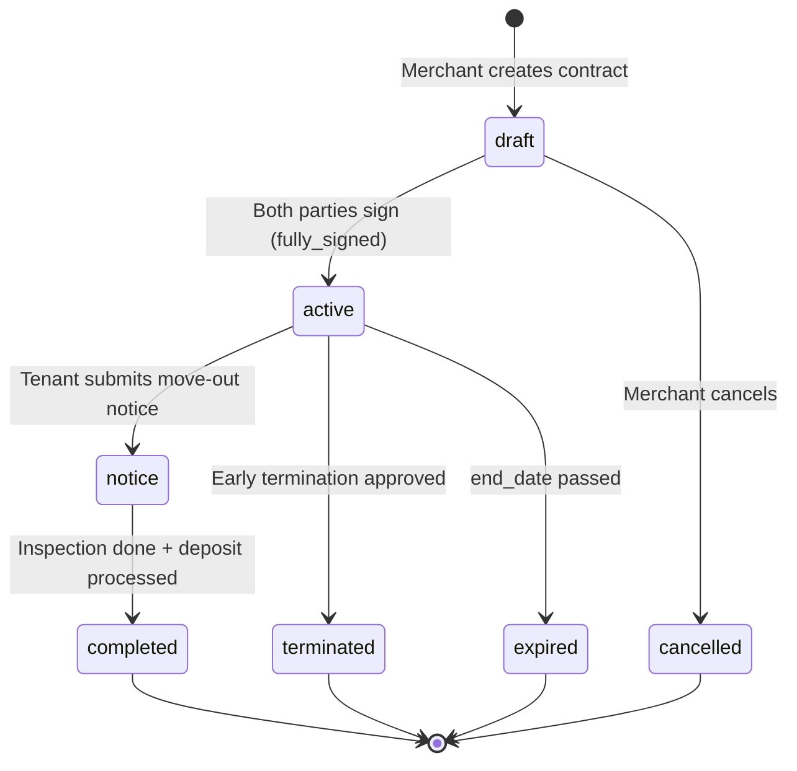
```mermaid
stateDiagram-v2
    [*] --> draft: Merchant creates contract
    draft --> active: Both parties sign (fully_signed)
    draft --> cancelled: Merchant cancels
    active --> notice: Tenant submits move-out notice
    active --> terminated: Early termination approved
    active --> expired: end_date passed
    notice --> completed: Inspection done + deposit processed
    completed --> [*]
    terminated --> [*]
    expired --> [*]
    cancelled --> [*]
```

### Signature Sub-States

The `signature_status` column tracks the signing progress independently:

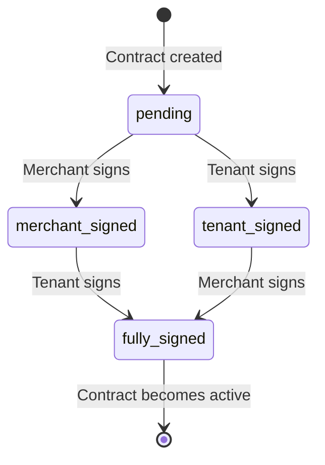
```mermaid
stateDiagram-v2
    [*] --> pending: Contract created
    pending --> merchant_signed: Merchant signs
    pending --> tenant_signed: Tenant signs
    merchant_signed --> fully_signed: Tenant signs
    tenant_signed --> fully_signed: Merchant signs
    fully_signed --> [*]: Contract becomes active
```

### Side Effects

| Transition | Side Effect | Implementation |
|------------|-------------|----------------|
| → `active` (fully_signed) | Unit status → `occupied` | DB trigger: `update_unit_status_on_contract_sign()` |
| → `completed` / `terminated` | Unit status → `available` | Application logic in contractService |
| → `notice` | `move_out_notice_given` = true, `move_out_notice_date` set | contractService + notification |
| → `terminated` | `termination_penalty` calculated | Based on `early_termination_penalty_rate` |

### Guard Conditions

- **draft → active**: Requires `signature_status = 'fully_signed'` (both `merchant_signature_url` and `tenant_signature_url` present)
- **active → notice**: Requires `notice_period_days` validation
- **active → terminated**: Requires approved `early_termination_requests` record

### Code Reference

```typescript
// src/features/contracts/services/contractService.ts
async merchantSignContract(contractId, signatureUrl, userId) {
  // Upload signature → check tenant signature → determine status
  const newStatus = contract?.tenant_signature_url ? 'fully_signed' : 'merchant_signed';
  const contractStatus = contract?.tenant_signature_url ? 'active' : 'draft';
}
```

---

## 3. Unit Status

**Table:** `units`  
**Column:** `status` (text, default: `'available'`)

### States (3)

| State | Description |
|-------|-------------|
| `available` | Unit is vacant and can be assigned |
| `occupied` | Active contract exists for this unit |
| `maintenance` | Under repair/maintenance |

### State Diagram

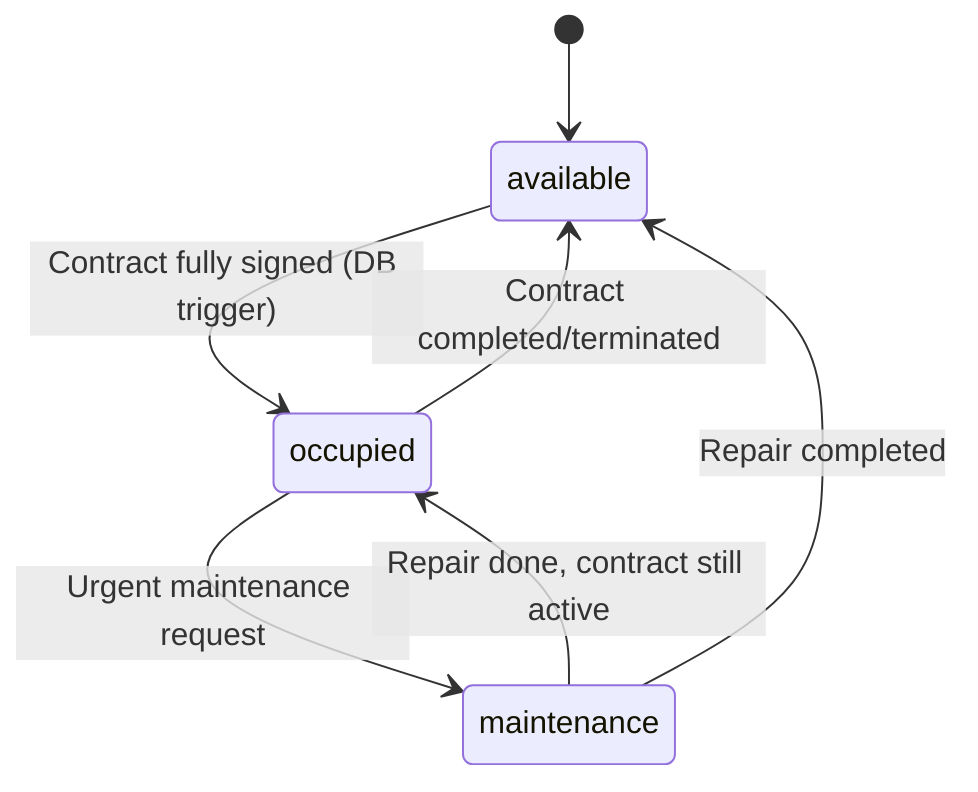
```mermaid
stateDiagram-v2
    [*] --> available
    available --> occupied: Contract fully signed (DB trigger)
    occupied --> available: Contract completed/terminated
    occupied --> maintenance: Urgent maintenance request
    maintenance --> available: Repair completed
    maintenance --> occupied: Repair done, contract still active
```

### Automation

| Trigger | Action |
|---------|--------|
| `update_unit_status_on_contract_sign()` | Sets unit to `occupied` when contract `signature_status` becomes `fully_signed` |
| Contract completion/termination | Application logic resets unit to `available` |
| `update_property_unit_counts()` | Recalculates `properties.occupied_units` on unit status change |

### Key Difference from Legacy Doc

No `RESERVED`, `DIRTY`, `CHECKOUT`, `BLOCKED` states. SiHuni is a **rental management** platform (monthly/yearly leases), not a hotel/booking system.

---

## 4. Invoice Lifecycle

**Table:** `invoices`  
**Column:** `status` (text, default: `'draft'`)

### States (7)

| State | Description |
|-------|-------------|
| `draft` | Auto-generated or manually created, not yet sent |
| `pending` | Awaiting payment processing |
| `sent` | Sent to tenant for payment |
| `paid` | Payment received and confirmed |
| `overdue` | Past due date without payment |
| `cancelled` | Voided by merchant |
| `partially_paid` | Partial payment received (payment plan) |

### State Diagram

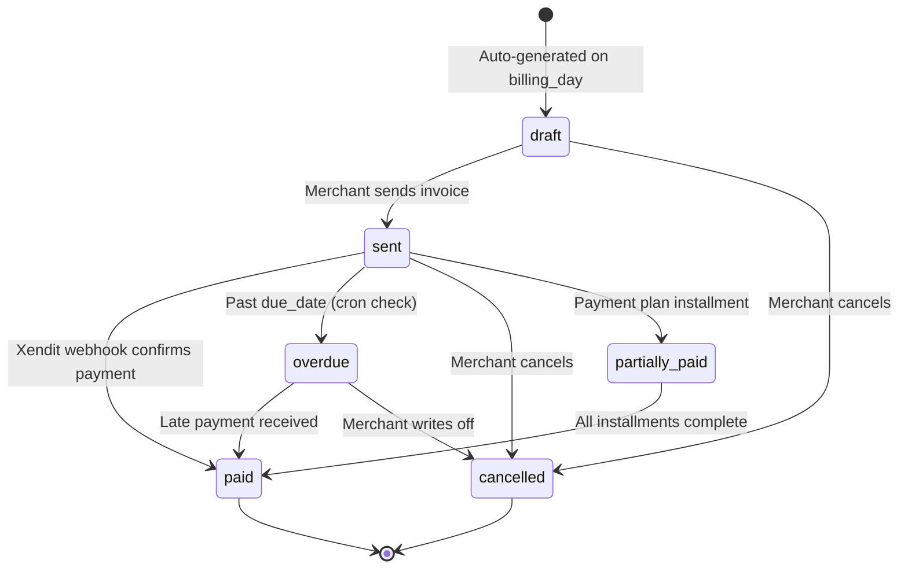
```mermaid
stateDiagram-v2
    [*] --> draft: Auto-generated on billing_day
    draft --> sent: Merchant sends invoice
    draft --> cancelled: Merchant cancels
    sent --> paid: Xendit webhook confirms payment
    sent --> overdue: Past due_date (cron check)
    sent --> cancelled: Merchant cancels
    overdue --> paid: Late payment received
    overdue --> cancelled: Merchant writes off
    sent --> partially_paid: Payment plan installment
    partially_paid --> paid: All installments complete
    paid --> [*]
    cancelled --> [*]
```

### Transition Map

```typescript
// Valid transitions enforced in merchantInvoiceService.ts
const VALID_TRANSITIONS: Record<string, string[]> = {
  draft: ['sent', 'cancelled'],
  sent: ['paid', 'overdue', 'cancelled', 'partially_paid'],
  overdue: ['paid', 'cancelled'],
  partially_paid: ['paid', 'cancelled'],
  // paid and cancelled are terminal states
};
```

### Automation (Edge Functions)

| Function | Schedule | Action |
|----------|----------|--------|
| `auto-generate-invoices` | Daily | Creates `draft` invoices on contract `billing_day` |
| `check-overdue-escalation` | Daily | Transitions `sent` → `overdue`, applies late fees |
| `send-invoice-reminders` | Daily | Sends reminder notifications for upcoming due dates |

### Side Effects

| Transition | Side Effect |
|------------|-------------|
| → `overdue` | Late fee record created in `late_fee_records`, `invoice.late_fee` updated |
| → `paid` | `paid_at` timestamp set, escrow transaction created |
| → `overdue` (15+ days) | Collections case created/escalated |

---

## 5. Overdue Escalation (4-Tier)

**Implementation:** `check-overdue-escalation` edge function (daily cron)  
**Related Table:** `collections_cases`

This is a **sub-workflow** of the Invoice lifecycle, managing progressive escalation for unpaid invoices.

### Escalation Tiers

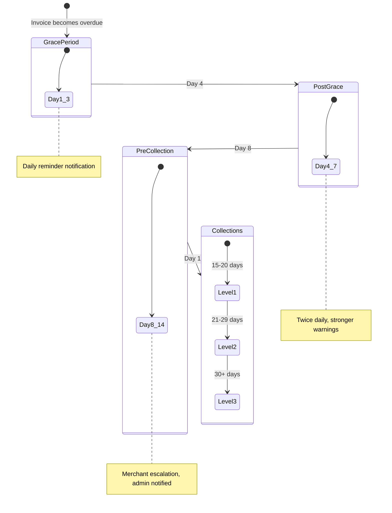
```mermaid
stateDiagram-v2
    [*] --> GracePeriod: Invoice becomes overdue
    GracePeriod --> PostGrace: Day 4
    PostGrace --> PreCollection: Day 8
    PreCollection --> Collections: Day 15

    state GracePeriod {
        [*] --> Day1_3
        note right of Day1_3: Daily reminder notification
    }
    state PostGrace {
        [*] --> Day4_7
        note right of Day4_7: Twice daily, stronger warnings
    }
    state PreCollection {
        [*] --> Day8_14
        note right of Day8_14: Merchant escalation, admin notified
    }
    state Collections {
        [*] --> Level1: 15-20 days
        Level1 --> Level2: 21-29 days
        Level2 --> Level3: 30+ days
    }
```

| Tier | Days Overdue | Actions |
|------|-------------|---------|
| **Grace Period** | 1–3 | Daily reminder notification to tenant |
| **Post-Grace** | 4–7 | Stronger warnings, twice daily |
| **Pre-Collection** | 8–14 | Merchant notified, admin dashboard alert |
| **Collections** | 15+ | `collections_cases` record created/escalated |

### Collections Case Escalation

**Table:** `collections_cases`  
**Column:** `escalation_level` (integer, default: 1)

| Level | Days Overdue | Action |
|-------|-------------|--------|
| 1 | 15–20 | Initial collections case, first contact |
| 2 | 21–29 | Escalated urgency, multiple contact attempts |
| 3 | 30+ | Maximum escalation, legal/eviction consideration |

### Collections Case States

`initiated` → `in_progress` → `resolved`

Resolution types: `paid_in_full`, `payment_plan`, `write_off`, `eviction`

---

## 6. Payment Status

**Table:** `payments`  
**Column:** `status` (text, default: `'pending'`)

### States (5)

| State | Description |
|-------|-------------|
| `pending` | Payment created, awaiting processing |
| `paid` | Payment confirmed (via Xendit or manual) |
| `overdue` | Past due date |
| `cancelled` | Payment voided |
| `failed` | Payment gateway reported failure |

### State Diagram

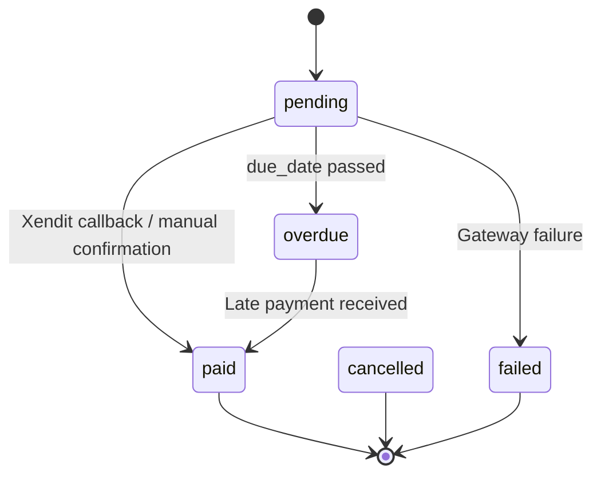
```mermaid
stateDiagram-v2
    [*] --> pending
    pending --> paid: Xendit callback / manual confirmation
    pending --> overdue: due_date passed
    pending --> failed: Gateway failure
    overdue --> paid: Late payment received
    paid --> [*]
    cancelled --> [*]
    failed --> [*]
```

### Xendit Integration

Payment status transitions from `pending` → `paid` are primarily driven by the `xendit-webhook` edge function:

```typescript
// Simplified xendit-webhook flow
if (callback.status === 'PAID') {
  // 1. Update xendit_transactions status
  // 2. Update payment status → 'paid'
  // 3. Update invoice status → 'paid'
  // 4. Create escrow transaction
  // 5. Send notification to tenant + merchant
}
```

**Idempotency:** Webhook handler checks `xendit_transactions.external_id` to prevent duplicate processing.

---

## 7. Payment Plan Lifecycle

**Table:** `payment_plans`  
**Column:** `status` (text, default: `'pending_acceptance'`)

### States (6)

| State | Description |
|-------|-------------|
| `pending_acceptance` | Merchant created plan, awaiting tenant acceptance |
| `accepted` | Tenant accepted the plan |
| `active` | First installment period has begun |
| `completed` | All installments paid |
| `defaulted` | Installment overdue beyond threshold |
| `cancelled` | Plan cancelled by either party |

### State Diagram

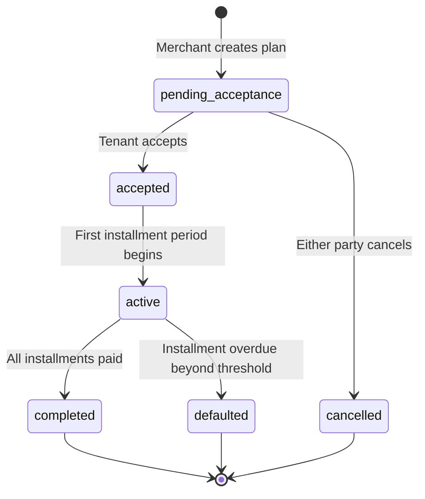
```mermaid
stateDiagram-v2
    [*] --> pending_acceptance: Merchant creates plan
    pending_acceptance --> accepted: Tenant accepts
    pending_acceptance --> cancelled: Either party cancels
    accepted --> active: First installment period begins
    active --> completed: All installments paid
    active --> defaulted: Installment overdue beyond threshold
    completed --> [*]
    defaulted --> [*]
    cancelled --> [*]
```

### Installment Sub-States

**Table:** `payment_plan_installments`  
**Column:** `status` (text, default: `'pending'`)

| State | Description |
|-------|-------------|
| `pending` | Installment not yet due or awaiting payment |
| `paid` | Installment payment confirmed |
| `overdue` | Past due date |
| `cancelled` | Plan cancelled, installment voided |

### Side Effects

| Transition | Side Effect |
|------------|-------------|
| → `accepted` | `accepted_at` timestamp set, tenant notification |
| → `active` | Invoice status updated to `partially_paid` |
| → `completed` | Invoice status updated to `paid`, `completed_at` set |
| → `defaulted` | `defaulted_at` set, collections escalation triggered |

---

## 8. Maintenance Request Lifecycle

**Table:** `maintenance_requests`  
**Column:** `status` (text, default: `'pending'`)

### States (4)

| State | Description |
|-------|-------------|
| `pending` | Tenant submitted request, awaiting merchant action |
| `in_progress` | Merchant/vendor actively working on the issue |
| `completed` | Work finished, tenant can review |
| `cancelled` | Request cancelled |

### State Diagram

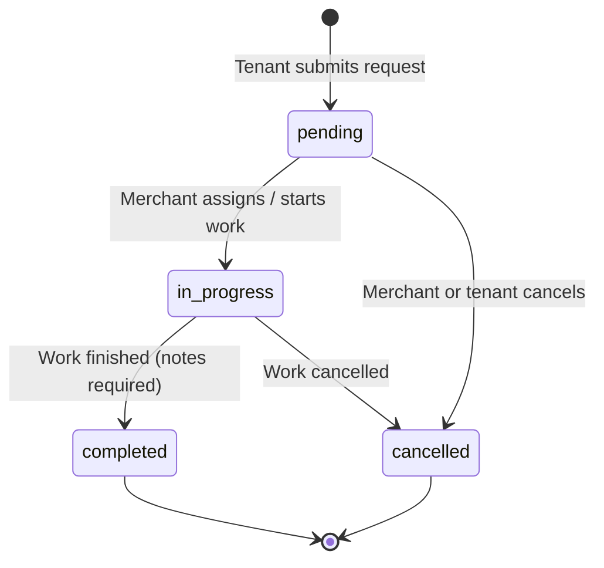
```mermaid
stateDiagram-v2
    [*] --> pending: Tenant submits request
    pending --> in_progress: Merchant assigns / starts work
    pending --> cancelled: Merchant or tenant cancels
    in_progress --> completed: Work finished (notes required)
    in_progress --> cancelled: Work cancelled
    completed --> [*]
    cancelled --> [*]
```

### Guard Conditions

| Transition | Guard |
|------------|-------|
| → `in_progress` | Vendor assignment validated against `service_categories` |
| → `completed` | `completion_notes` required (enforced in UI) |

### Timeline Tracking

Every status change is logged to `maintenance_timeline`:

```typescript
// Automatic timeline entry on status change
{
  maintenance_request_id: requestId,
  status: newStatus,
  message: `Status changed to ${newStatus}`,
  actor_id: userId,
  actor_role: userRole,  // 'merchant' | 'tenant' | 'vendor' | 'admin'
  metadata: { previous_status, notes }
}
```

### SLA Automation

**Trigger:** `calculate_sla_deadline()`

| Priority | SLA Deadline |
|----------|-------------|
| `urgent` | 4 hours |
| `high` | 24 hours |
| `medium` | 72 hours |
| `low` | 7 days |

### Related Sub-Workflows

- **Vendor Assignment:** Merchant assigns vendor → vendor accepts/rejects → work begins
- **Maintenance Review:** After `completed`, tenant can submit `maintenance_reviews` (rating + review_text)

---

## 9. Merchant Subscription Lifecycle

**Table:** `merchant_subscriptions`  
**Column:** `status` (text, default: `'trialing'`)

### States (5)

| State | Description |
|-------|-------------|
| `trialing` | Free trial period (configurable per tier, default 14 days) |
| `active` | Paid subscription, current period valid |
| `past_due` | Payment failed, grace period active |
| `suspended` | Grace period expired, features restricted |
| `cancelled` | Subscription terminated |

### State Diagram

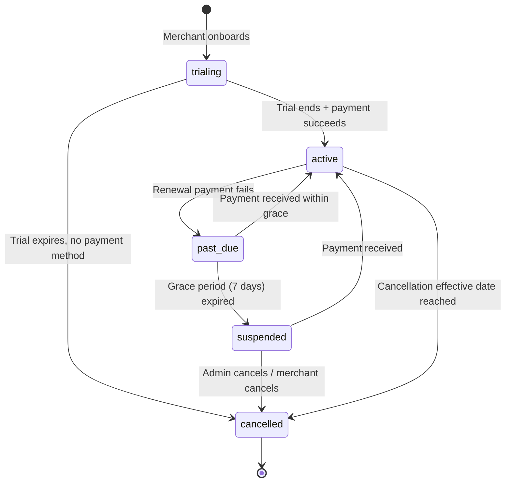
```mermaid
stateDiagram-v2
    [*] --> trialing: Merchant onboards
    trialing --> active: Trial ends + payment succeeds
    trialing --> cancelled: Trial expires, no payment method
    active --> past_due: Renewal payment fails
    past_due --> active: Payment received within grace
    past_due --> suspended: Grace period (7 days) expired
    suspended --> active: Payment received
    suspended --> cancelled: Admin cancels / merchant cancels
    active --> cancelled: Cancellation effective date reached
    cancelled --> [*]
```

### Cron Functions

| Function | Schedule | Action |
|----------|----------|--------|
| `subscription-renewal` | Daily | Check trial expiry, renew active subscriptions |
| `subscription-grace-check` | Daily | Manage 7-day grace → suspend → cancel |
| `subscription-billing` | Daily | Generate `subscription_invoices` for upcoming periods |

### Cancellation Flow

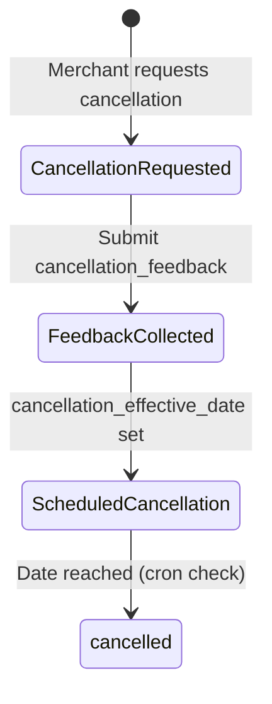
```mermaid
stateDiagram-v2
    [*] --> CancellationRequested: Merchant requests cancellation
    CancellationRequested --> FeedbackCollected: Submit cancellation_feedback
    FeedbackCollected --> ScheduledCancellation: cancellation_effective_date set
    ScheduledCancellation --> cancelled: Date reached (cron check)
```

**Table:** `cancellation_feedback` captures `reason`, `feedback`, `would_return` for churn analysis.

### Tier Limits Enforcement

| Tier Field | Enforcement |
|------------|-------------|
| `max_properties` | Checked on property creation |
| `max_units` | Checked on unit creation |
| `max_tenants` | Checked on tenant invitation |
| `features` (JSONB) | Feature flags checked at component level |

---

## 10. Move-Out Workflow

Three interconnected state machines managing the tenant departure process.

### 10.1 Move-Out Notice

**Table:** `move_out_notices`  
**Column:** `status` (text, default: `'submitted'`)

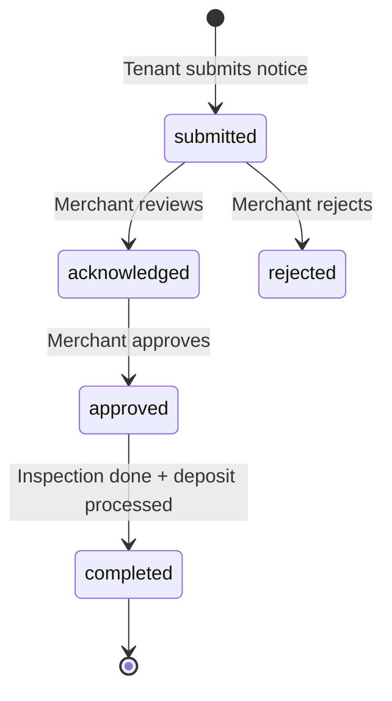
```mermaid
stateDiagram-v2
    [*] --> submitted: Tenant submits notice
    submitted --> acknowledged: Merchant reviews
    acknowledged --> approved: Merchant approves
    submitted --> rejected: Merchant rejects
    approved --> completed: Inspection done + deposit processed
    completed --> [*]
```

### Side Effects

| Transition | Side Effect |
|------------|-------------|
| → `submitted` | Contract `move_out_notice_given` = true, `move_out_notice_date` set |
| → `approved` | `move_out_inspections` record auto-created |
| → `completed` | Contract status → `completed`, unit → `available` |

### 10.2 Move-Out Inspection

**Table:** `move_out_inspections`  
**Column:** `status` (text, default: `'scheduled'`)

| State | Description |
|-------|-------------|
| `scheduled` | Auto-created when move-out notice approved |
| `in_progress` | Inspector conducting inspection |
| `completed` | Report submitted, deductions calculated |

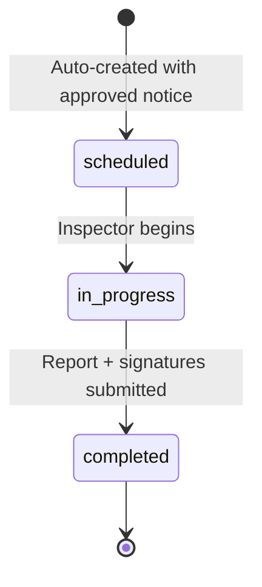
```mermaid
stateDiagram-v2
    [*] --> scheduled: Auto-created with approved notice
    scheduled --> in_progress: Inspector begins
    in_progress --> completed: Report + signatures submitted
    completed --> [*]
```

### Inspection Data

```typescript
// inspection_report JSONB structure
{
  rooms: [
    { name: "Living Room", condition: "good" | "fair" | "poor", notes: "", photos: [] },
    { name: "Kitchen", condition: "poor", notes: "Damaged countertop", photos: ["url1"] }
  ],
  overall_condition: "fair",
  recommendations: "..."
}

// deduction_details JSONB structure
[
  { item: "Wall repair", amount: 500000, description: "Hole in bedroom wall" },
  { item: "Deep cleaning", amount: 300000, description: "Required due to condition" }
]
```

### 10.3 Early Termination Request

**Table:** `early_termination_requests`  
**Column:** `status` (text, default: `'pending_approval'`)

| State | Description |
|-------|-------------|
| `pending_approval` | Tenant requests early termination |
| `approved` | Merchant accepts, penalty calculated |
| `denied` | Merchant denies with reason |
| `counter_offered` | Merchant proposes different penalty amount |

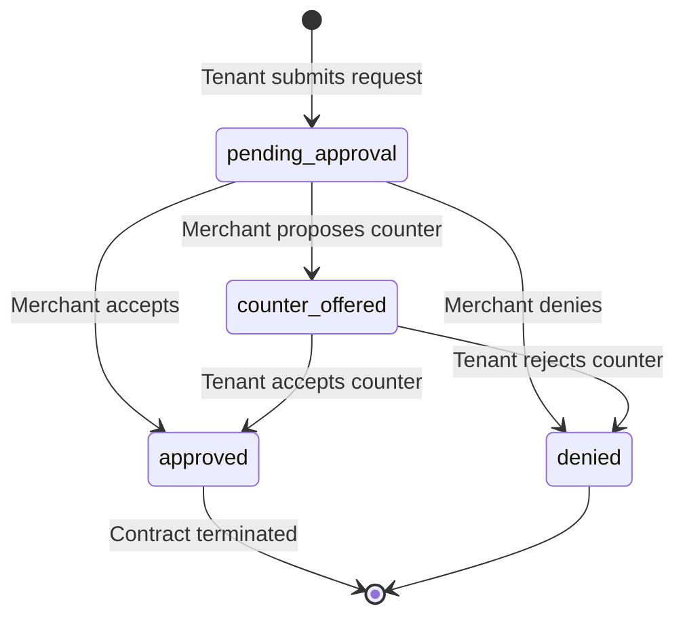
```mermaid
stateDiagram-v2
    [*] --> pending_approval: Tenant submits request
    pending_approval --> approved: Merchant accepts
    pending_approval --> denied: Merchant denies
    pending_approval --> counter_offered: Merchant proposes counter
    counter_offered --> approved: Tenant accepts counter
    counter_offered --> denied: Tenant rejects counter
    approved --> [*]: Contract terminated
    denied --> [*]
```

### Penalty Calculation

```typescript
// Penalty = remaining_months x rent_amount x early_termination_penalty_rate
const penalty = remainingMonths * contract.rent_amount * contract.early_termination_penalty_rate;
// Default rate: 2 (2x monthly rent per remaining month)
```

---

## 11. Order Lifecycle (Marketplace)

**Table:** `orders`  
**Column:** `status` (text, default: `'pending'`)

### States (5)

| State | Description |
|-------|-------------|
| `pending` | Tenant placed order, awaiting vendor confirmation |
| `confirmed` | Vendor confirmed the order |
| `in_progress` | Vendor is working on the order |
| `completed` | Order fulfilled |
| `canceled` | Order cancelled (note: `canceled` not `cancelled`) |

### State Diagram

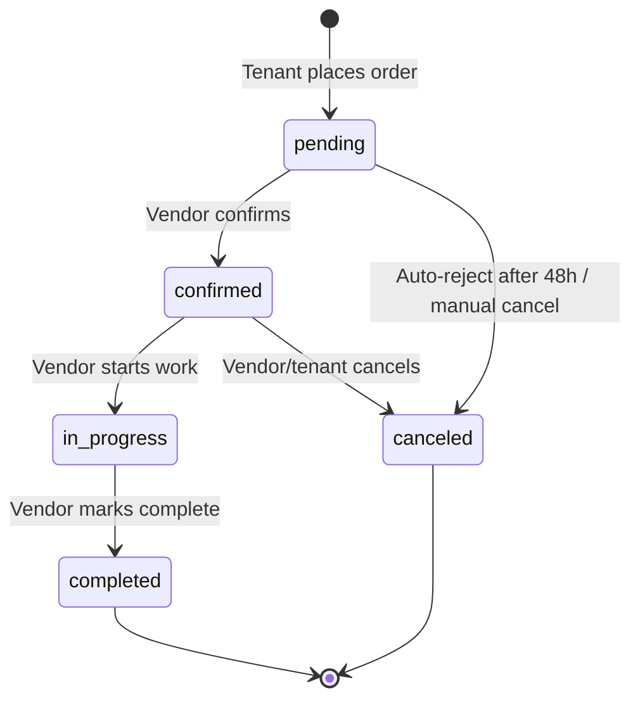
```mermaid
stateDiagram-v2
    [*] --> pending: Tenant places order
    pending --> confirmed: Vendor confirms
    pending --> canceled: Auto-reject after 48h / manual cancel
    confirmed --> in_progress: Vendor starts work
    confirmed --> canceled: Vendor/tenant cancels
    in_progress --> completed: Vendor marks complete
    completed --> [*]
    canceled --> [*]
```

### Automation

| Function | Schedule | Action |
|----------|----------|--------|
| `order-auto-reject` | Daily | Auto-cancel `pending` orders older than 48 hours |

### Payment Flow

Orders use Xendit for payment:
1. Tenant places order → `pending`
2. Xendit invoice created → payment URL returned
3. Payment confirmed via webhook → order progresses
4. Platform fee (5%) deducted, net amount to vendor escrow

---

## 12. Vendor Job Lifecycle

**Table:** `maintenance_requests` (vendor perspective via `assigned_vendor_id`)

### States (6)

| State | Description |
|-------|-------------|
| `pending` | Job assigned to vendor, awaiting acceptance |
| `accepted` | Vendor accepted the job |
| `in_progress` | Vendor actively working |
| `completed` | Work finished |
| `rejected` | Vendor rejected the job |
| `cancelled` | Job cancelled by merchant/admin |

### State Diagram

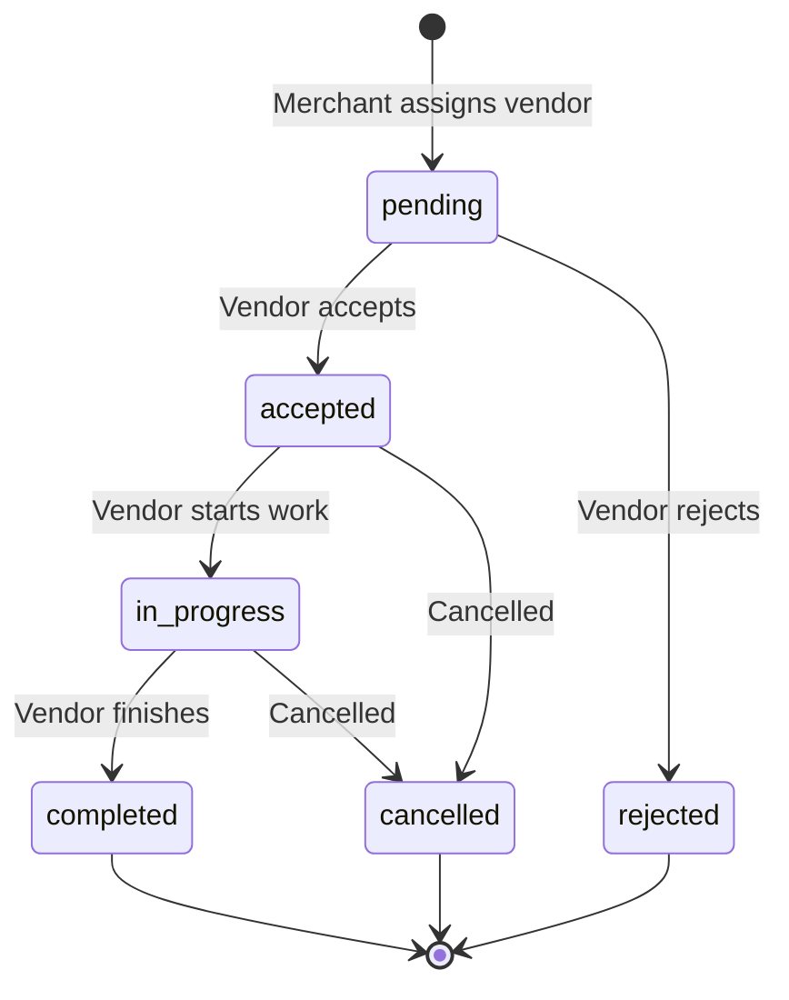
```mermaid
stateDiagram-v2
    [*] --> pending: Merchant assigns vendor
    pending --> accepted: Vendor accepts
    pending --> rejected: Vendor rejects
    accepted --> in_progress: Vendor starts work
    in_progress --> completed: Vendor finishes
    accepted --> cancelled: Cancelled
    in_progress --> cancelled: Cancelled
    completed --> [*]
    rejected --> [*]
    cancelled --> [*]
```

### Side Effects

| Transition | Side Effect |
|------------|-------------|
| → `accepted` | `accepted_at` timestamp set on maintenance_request |
| → `in_progress` | `started_at` timestamp set |
| → `completed` | `resolved_at` timestamp set, completion_photos expected |
| → `completed` | Vendor rating recalculated via `update_vendor_rating()` trigger |

---

## 13. Disbursement Lifecycle

**Table:** `disbursements`  
**Column:** `status` (text, default: `'pending'`)

### States (6)

| State | Description |
|-------|-------------|
| `pending` | Scheduled for disbursement |
| `approved` | Admin approved (or auto-approved) |
| `rejected` | Admin rejected with notes |
| `processing` | Sent to Xendit for bank transfer |
| `completed` | Bank transfer confirmed |
| `failed` | Bank transfer failed |

### State Diagram

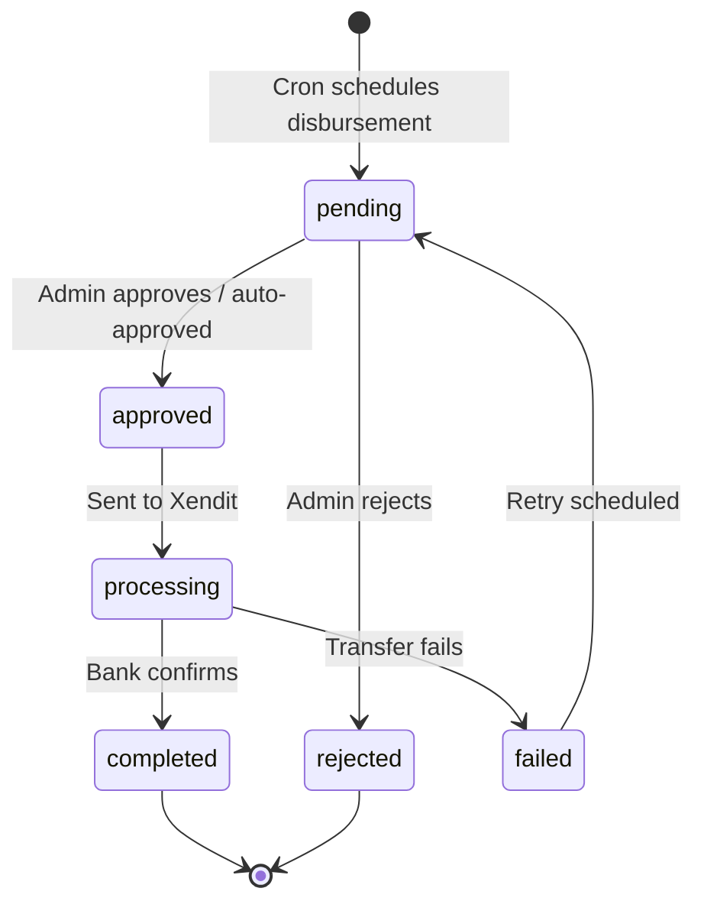
```mermaid
stateDiagram-v2
    [*] --> pending: Cron schedules disbursement
    pending --> approved: Admin approves / auto-approved
    pending --> rejected: Admin rejects
    approved --> processing: Sent to Xendit
    processing --> completed: Bank confirms
    processing --> failed: Transfer fails
    failed --> pending: Retry scheduled
    completed --> [*]
    rejected --> [*]
```

### Automation

| Function | Schedule | Action |
|----------|----------|--------|
| `scheduled-disbursement` | Daily | Creates disbursements from eligible escrow balances |
| `xendit-disbursement` | On-demand | Sends approved disbursements to Xendit |
| `xendit-disbursement-webhook` | Webhook | Updates status based on Xendit callback |

### Guard Conditions

| Condition | Rule |
|-----------|------|
| `requires_manual_review` | If true, requires admin approval before processing |
| Minimum amount | Must meet `min_disbursement_amount` (merchant setting) |
| Bank account | Valid `bank_account_id` required |
| Escrow balance | Sufficient `escrow_accounts.balance` |

### Fee Structure

```typescript
{
  amount: grossAmount,          // Total disbursement
  fee_amount: platformFee,      // Platform fee (percentage)
  net_amount: grossAmount - platformFee  // Amount sent to merchant
}
```

---

## 14. Tenant Invitation Lifecycle

**Implementation:** Edge functions (`send-tenant-invitation`, `get-tenant-invitation`, `accept-tenant-invitation`)

### States (3)

| State | Description |
|-------|-------------|
| `pending` | Invitation sent, awaiting tenant action |
| `accepted` | Tenant accepted via invitation link |
| `expired` | 7-day validity period passed |

### State Diagram

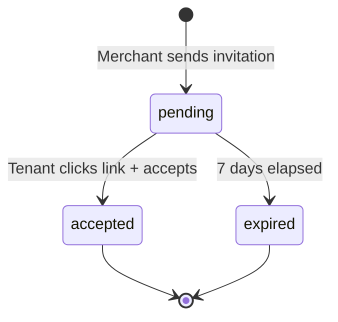
```mermaid
stateDiagram-v2
    [*] --> pending: Merchant sends invitation
    pending --> accepted: Tenant clicks link + accepts
    pending --> expired: 7 days elapsed
    accepted --> [*]
    expired --> [*]
```

### Token-Based Flow

```
1. Merchant creates invitation → token generated (UUID)
2. Email sent to tenant with link: /invite/{token}
3. Tenant visits link → get-tenant-invitation validates token + expiry
4. Tenant accepts → accept-tenant-invitation:
   - Creates/links tenant profile
   - Sets tenant.linked_merchant_id
   - Updates invitation status → 'accepted'
5. Contract NOT auto-created (merchant creates manually)
```

**Important:** `verify_jwt = false` for invitation edge functions (public access with token validation).

---

## 15. Referral Lifecycle

**Table:** `referrals`  
**Column:** `status` (text, default: `'pending'`)

### States (4)

| State | Description |
|-------|-------------|
| `pending` | Referee signed up via referral code |
| `active` | Referee completed onboarding |
| `completed` | Reward criteria met |
| `expired` | No action within validity period |

### State Diagram

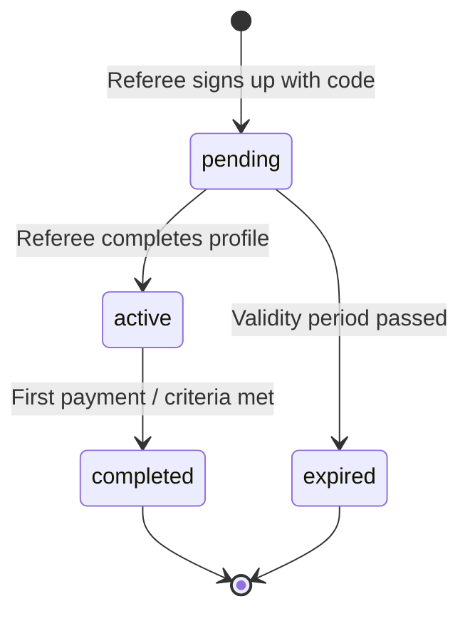
```mermaid
stateDiagram-v2
    [*] --> pending: Referee signs up with code
    pending --> active: Referee completes profile
    active --> completed: First payment / criteria met
    pending --> expired: Validity period passed
    completed --> [*]
    expired --> [*]
```

### Reward Distribution

**Table:** `referral_rewards`

| Reward Type | Trigger | Amount |
|-------------|---------|--------|
| `subscription_credit` | Referee's first payment | Configurable per merchant |
| `bonus` | Referee reaches order threshold | `referral_bonus_amount` |

### Referral Code Format

- **Merchant codes:** `merchant_code` field (6 chars, uppercase alphanumeric)
- **Referral codes:** `referral_code` field (8 chars, uppercase alphanumeric)

---

## 16. Verification Workflows

### 16.1 Merchant Verification

**Table:** `merchant_verifications`  
**Column:** `status` (text, default: `'pending'`)

| State | Description |
|-------|-------------|
| `pending` | Document submitted, awaiting admin review |
| `approved` | Document verified by admin |
| `rejected` | Document rejected with reason |

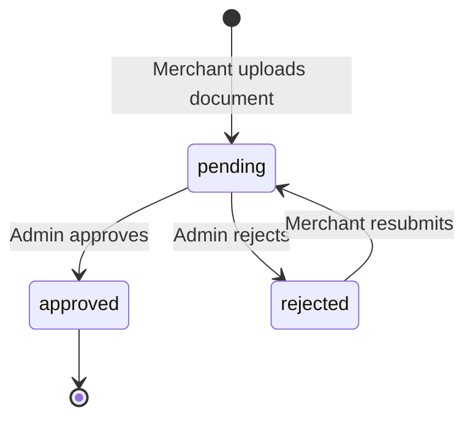
```mermaid
stateDiagram-v2
    [*] --> pending: Merchant uploads document
    pending --> approved: Admin approves
    pending --> rejected: Admin rejects
    rejected --> pending: Merchant resubmits
    approved --> [*]
```

### Merchant-Level Verification Status

**Table:** `merchants`  
**Column:** `verification_status` (text, default: `'pending'`)

| State | Trigger |
|-------|---------|
| `pending` | Initial state |
| `submitted` | Documents uploaded, `verification_submitted_at` set |
| `verified` | Admin approves all required documents |
| `rejected` | Admin rejects, `rejection_details` provided |

### Audit Trail

Every verification action creates a `merchant_verification_history` record:

```typescript
{
  merchant_id,
  action: 'approve' | 'reject' | 'resubmit',
  old_status, new_status,
  performed_by: adminUserId,
  approval_notes | rejection_reason | resubmission_instructions
}
```

### 16.2 Vendor Verification

**Table:** `vendor_verifications`  
**Column:** `status` (text, default: `'pending'`)

Same 3-state flow as merchant verification.

**Auto-Verification Rule:** When vendor has ≥ 2 verified documents, `vendors.verification_status` auto-updates to `'verified'`:

```typescript
// src/features/verification/services/vendorVerificationService.ts
async updateVendorStatusIfVerified(vendorId: string) {
  const verifiedCount = verifications?.filter(v => v.status === 'verified').length || 0;
  if (verifiedCount >= 2) {
    await supabase.from('vendors').update({ verification_status: 'verified' }).eq('id', vendorId);
  }
}
```

---

## 17. Dispute Lifecycle

**Table:** `disputes`  
**Column:** `status` (text, default: `'open'`)

### States (4)

| State | Description |
|-------|-------------|
| `open` | Dispute filed by tenant or merchant |
| `in_progress` | Admin reviewing the dispute |
| `resolved` | Resolution determined and applied |
| `closed` | Dispute closed (may or may not be resolved) |

### State Diagram

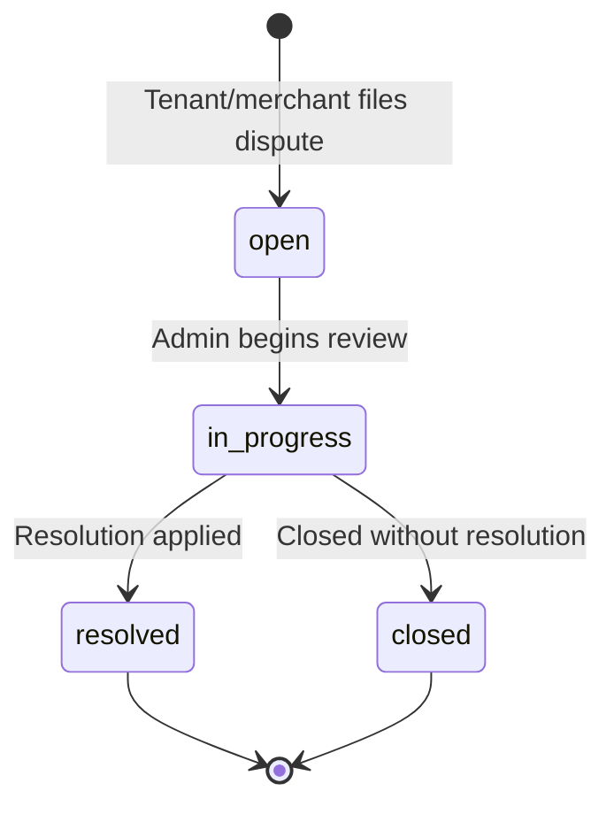
```mermaid
stateDiagram-v2
    [*] --> open: Tenant/merchant files dispute
    open --> in_progress: Admin begins review
    in_progress --> resolved: Resolution applied
    in_progress --> closed: Closed without resolution
    resolved --> [*]
    closed --> [*]
```

### Priority Levels

| Priority | Default | Description |
|----------|---------|-------------|
| `low` | | Minor issues |
| `medium` | ✓ | Standard disputes |
| `high` | | Significant financial impact |
| `urgent` | | Requires immediate action |

---

## 18. Deposit Refund Lifecycle

**Table:** `deposit_refunds`  
**Column:** `status` (text, default: `'pending_processing'`)

### States (5)

| State | Description |
|-------|-------------|
| `pending_processing` | Refund created after move-out inspection |
| `approved` | Merchant approved refund amount |
| `processing` | Xendit disbursement in progress |
| `completed` | Refund transferred to tenant bank account |
| `rejected` | Refund disputed/rejected |

### State Diagram

```mermaid
stateDiagram-v2
    [*] --> pending_processing: Inspection completed
    pending_processing --> approved: Merchant approves deductions
    pending_processing --> rejected: Dispute filed
    approved --> processing: Disbursement initiated
    processing --> completed: Bank transfer confirmed
    completed --> [*]
    rejected --> [*]
```

### Linked Dispute

**Table:** `deposit_disputes`  
**Column:** `status` (text, default: `'pending'`)

| State | Description |
|-------|-------------|
| `pending` | Tenant disputes deduction amount |
| `resolved` | Admin resolved the dispute |
| `rejected` | Dispute rejected |

### Calculation

```typescript
{
  original_deposit: contract.deposit_amount,
  deductions: totalFromInspection,       // Sum of deduction_details items
  refund_amount: original_deposit - deductions,
  deduction_details: [                   // JSONB array
    { item: "Wall repair", amount: 500000 },
    { item: "Cleaning fee", amount: 200000 }
  ]
}
```

---

## 19. Escrow Transaction Lifecycle

**Table:** `escrow_transactions`  
**Column:** `status` (text, default: `'pending'`)

### States (3)

| State | Description |
|-------|-------------|
| `pending` | Transaction created, awaiting processing |
| `completed` | Funds confirmed in escrow account |
| `failed` | Transaction failed |

### Transaction Types

| Type | Direction | Description |
|------|-----------|-------------|
| `deposit` | Inbound | Rent payment received |
| `payment_received` | Inbound | General payment to escrow |
| `withdrawal` | Outbound | Disbursement to merchant |
| `refund` | Outbound | Deposit refund to tenant |
| `fee` | Outbound | Platform fee deduction |

### Fee Breakdown

```typescript
{
  gross_amount: totalPayment,
  gateway_fee: xenditFee,           // Payment gateway fee
  platform_fee: platformPercentage, // SiHuni platform fee
  amount: netToEscrow               // gross - gateway_fee - platform_fee
}
```

---

## 20. UI State-Color Mapping

**File:** `src/shared/utils/statusColors.ts`

All status colors use **semantic Tailwind tokens** (not raw colors) for automatic dark mode support.

### Badge Variant Mapping

| Status | Badge Variant | Usage |
|--------|--------------|-------|
| `pending` | `secondary` | Invoices, payments, verifications |
| `active` / `in_progress` | `default` | Contracts, maintenance, subscriptions |
| `completed` / `paid` / `verified` | `outline` | Terminal success states |
| `cancelled` / `rejected` / `failed` / `terminated` / `overdue` | `destructive` | Error/danger states |
| `draft` / `expired` | `secondary` | Inactive/neutral states |

### Color Class Mapping

| Status | Text Class | Background Class |
|--------|------------|-----------------|
| `pending` | `text-warning` | `bg-warning/10` |
| `active` | `text-primary` | `bg-primary/10` |
| `in_progress` | `text-primary` | `bg-primary/10` |
| `completed` | `text-success` | `bg-success/10` |
| `paid` | `text-success` | `bg-success/10` |
| `cancelled` | `text-destructive` | `bg-destructive/10` |
| `rejected` | `text-destructive` | `bg-destructive/10` |
| `overdue` | `text-destructive` | `bg-destructive/10` |
| `terminated` | `text-destructive` | `bg-destructive/10` |
| `suspended` | `text-destructive` | `bg-destructive/10` |
| `draft` | `text-muted-foreground` | `bg-muted` |
| `expired` | `text-muted-foreground` | `bg-muted` |
| `trialing` | `text-primary` | `bg-primary/10` |
| `verified` | `text-success` | `bg-success/10` |
| `acknowledged` | `text-primary` | `bg-primary/10` |
| `unverified` | `text-warning` | `bg-warning/10` |
| `past_due` | `text-warning` | `bg-warning/10` |

### Priority Color Mapping

| Priority | Text Class | Background Class |
|----------|------------|-----------------|
| `urgent` | `text-destructive` | `bg-destructive/10` |
| `high` | `text-destructive` | `bg-destructive/10` |
| `medium` | `text-warning` | `bg-warning/10` |
| `low` | `text-muted-foreground` | `bg-muted` |

### Escrow/Transaction Status Colors

| Status | Classes |
|--------|---------|
| `completed` | `bg-success/10 text-success border-success/20` |
| `pending` | `bg-warning/10 text-warning border-warning/20` |
| `processing` | `bg-primary/10 text-primary border-primary/20` |
| `failed` | `bg-destructive/10 text-destructive border-destructive/20` |

### Usage Pattern

```typescript
import { getStatusColorClasses, getContractStatusColor } from '@/shared/utils/statusColors';

// For custom styled elements
const { text, bg } = getStatusColorClasses(status);
<span className={`${text} ${bg} px-2 py-1 rounded`}>{status}</span>

// For shadcn Badge
<Badge variant={getContractStatusColor(status)}>{status}</Badge>

// Contract-specific badge component
import { ContractStatusBadge } from '@/features/contracts/components/ContractStatusBadge';
<ContractStatusBadge status={contract.status} />
```

---

## 21. Implementation Guidelines

### Status Column Design

```sql
-- Standard pattern: text column with default
status text NOT NULL DEFAULT 'pending'::text

-- NEVER use PostgreSQL enums for status (except app_role)
-- Rationale: Enums require migrations to add values, text is flexible
```

### Transition Enforcement Pattern

```typescript
// Pattern used in service files
const VALID_TRANSITIONS: Record<string, string[]> = {
  draft: ['sent', 'cancelled'],
  sent: ['paid', 'overdue', 'cancelled'],
  overdue: ['paid', 'cancelled'],
  // Terminal states have no valid transitions
};

function validateTransition(currentStatus: string, newStatus: string): boolean {
  const validNext = VALID_TRANSITIONS[currentStatus];
  if (!validNext) return false; // Terminal state
  return validNext.includes(newStatus);
}
```

### Audit Logging for State Changes

```typescript
import { createAuditLog } from '@/shared/utils/auditLog';

// Log every state change
await createAuditLog({
  action: 'update',
  entity_type: 'contract',
  entity_id: contractId,
  old_data: { status: oldStatus },
  new_data: { status: newStatus },
});
```

### Database Triggers for Automated Transitions

| Trigger | Table | Action |
|---------|-------|--------|
| `update_unit_status_on_contract_sign` | `contracts` | Unit → `occupied` when fully signed |
| `update_property_unit_counts` | `units` | Recalculate `occupied_units` on unit status change |
| `calculate_sla_deadline` | `maintenance_requests` | Set SLA deadline based on priority |
| `update_vendor_rating` | `maintenance_reviews` | Recalculate vendor average rating |

### Cron Edge Functions for Time-Based Transitions

| Function | Schedule | State Transitions |
|----------|----------|-------------------|
| `auto-generate-invoices` | Daily 00:00 | → Creates `draft` invoices |
| `check-overdue-escalation` | Daily 06:00 | `sent` → `overdue`, escalation tiers |
| `send-invoice-reminders` | Daily 08:00 | Notification for upcoming due dates |
| `order-auto-reject` | Daily 00:00 | `pending` → `canceled` after 48h |
| `subscription-renewal` | Daily 00:00 | `trialing` → `active`, period renewal |
| `subscription-grace-check` | Daily 00:00 | `past_due` → `suspended` → `cancelled` |
| `subscription-billing` | Daily 00:00 | Creates `subscription_invoices` |
| `scheduled-disbursement` | Daily 02:00 | Creates `pending` disbursements |
| `check-contract-expiry` | Daily 00:00 | `active` → `expired` |
| `check-overdue-installments` | Daily 06:00 | Installment `pending` → `overdue` |
| `cleanup-expired-invitations` | Daily 00:00 | Invitation `pending` → `expired` |
| `check-referral-expiry` | Daily 00:00 | Referral `pending` → `expired` |
| 🆕 `ml-daily-risk-scoring` | Daily 12:00 | Refreshes `tenant_risk_scores` for all active tenants |
| 🆕 `ml-weekly-forecast` | Weekly Mon 13:00 | Refreshes revenue forecasts per merchant |

### No External State Libraries

SiHuni does **not** use:
- ❌ xstate / state machine libraries
- ❌ Temporal / workflow engines
- ❌ NestJS CQRS / Event Sourcing
- ❌ PostgreSQL enums for status (except `app_role`)
- ❌ BullMQ / Redis queues

Instead, state management uses:
- ✅ Simple TypeScript objects (`VALID_TRANSITIONS` maps)
- ✅ If/switch guards in service functions
- ✅ Database triggers for cross-table state sync
- ✅ Cron edge functions for time-based transitions
- ✅ Webhook handlers for external event-driven transitions (Xendit)

---

---

## 22. DSS: OCR Result Lifecycle

**Table:** `ocr_results`  
**Column:** `status` (text, default: `'processing'`)

### States (4)

| State | Description |
|-------|-------------|
| `processing` | Image submitted, AI extraction in progress |
| `completed` | Extraction successful, structured data available |
| `failed` | AI extraction failed (low quality, unsupported format) |
| `reviewed` | Human reviewed and corrected extracted data |

### State Diagram

```mermaid
stateDiagram-v2
    [*] --> processing: Image uploaded to OCR function
    processing --> completed: AI extracts data (confidence ≥ 0.40)
    processing --> failed: AI cannot extract / error
    completed --> reviewed: User verifies/corrects data
    reviewed --> [*]
    failed --> [*]
    completed --> [*]
```

### Confidence Sub-Routing

| Confidence | Level | Action |
|-----------|-------|--------|
| ≥ 0.85 | HIGH | Auto-accepted, minimal review needed |
| 0.60–0.84 | MEDIUM | Requires user review |
| 0.40–0.59 | LOW | Flagged for manual correction |
| < 0.40 | — | → `failed` status |

### Side Effects

| Transition | Side Effect |
|------------|-------------|
| → `completed` | `extracted_data` JSONB populated, `confidence_score` set |
| → `completed` (payment proof) | Auto-creates `payment_verifications` record |
| → `failed` | `error_message` populated, notification sent |
| Any transition | `ml_model_runs` audit row created |

### Document Types

| `document_type` | Source Function | Extracted Fields |
|----------------|-----------------|------------------|
| `ktp` | `ocr-ktp-extract` | NIK, nama, alamat, tempat/tanggal lahir |
| `payment_proof` | `ocr-payment-proof` | amount, date, sender, receiver, reference |
| `business_doc` | `ocr-business-document` | entity_name, registration_number, doc_type |
| `receipt` | `ocr-maintenance-receipt` | items[], total, vendor_name, date |

---

## 23. DSS: Payment Verification Lifecycle

**Table:** `payment_verifications`  
**Column:** `verification_status` (text, default: `'pending'`)

### States (4)

| State | Description |
|-------|-------------|
| `pending` | OCR completed, awaiting verification logic |
| `auto_matched` | Amount matches invoice within ± Rp 1,000 |
| `manual_review` | Amount mismatch or low confidence, needs human |
| `verified` | Payment confirmed (auto or manual) |

### State Diagram

```mermaid
stateDiagram-v2
    [*] --> pending: OCR payment proof completed
    pending --> auto_matched: Amount within ± Rp 1,000 tolerance
    pending --> manual_review: Amount mismatch / low confidence
    auto_matched --> verified: Auto-confirmed
    manual_review --> verified: Merchant confirms
    verified --> [*]
```

### Matching Logic

```typescript
const TOLERANCE = 1000; // Rp 1,000

function matchPayment(ocrAmount: number, invoiceAmount: number): boolean {
  return Math.abs(ocrAmount - invoiceAmount) <= TOLERANCE;
}
```

### Side Effects

| Transition | Side Effect |
|------------|-------------|
| → `auto_matched` | `matched_invoice_id` linked, `match_confidence` set |
| → `verified` | Invoice status → `paid`, `paid_at` set, escrow transaction created |
| → `manual_review` | Notification sent to merchant |

---

## 24. DSS: Recommendation Lifecycle

**Table:** `dss_recommendations`  
**Column:** `status` (text, default: `'generated'`)

### States (5)

| State | Description |
|-------|-------------|
| `generated` | AI advisor produced recommendation |
| `viewed` | Merchant opened/viewed the recommendation |
| `accepted` | Merchant accepted and plans to implement |
| `rejected` | Merchant dismissed the recommendation |
| `measured` | Impact measured after implementation period |

### State Diagram

```mermaid
stateDiagram-v2
    [*] --> generated: Advisor function produces recommendation
    generated --> viewed: Merchant views in dashboard
    viewed --> accepted: Merchant accepts recommendation
    viewed --> rejected: Merchant rejects with feedback
    accepted --> measured: Impact period elapsed, outcome recorded
    rejected --> [*]
    measured --> [*]
```

### Advisor Types

| `advisor_type` | Source Function | Recommendation Examples |
|---------------|-----------------|------------------------|
| `pricing` | `dss-pricing-advisor` | Optimal rent price, market comparison |
| `collection` | `dss-collection-strategy` | Best collection approach per tenant risk |
| `maintenance` | `dss-maintenance-priority` | Priority ranking, vendor suggestion |
| `investment` | `dss-investment-insight` | ROI analysis, expansion opportunities |

### Side Effects

| Transition | Side Effect |
|------------|-------------|
| → `generated` | `recommendation_data` JSONB populated, `confidence_score` set |
| → `viewed` | `viewed_at` timestamp set |
| → `accepted` | `accepted_at` timestamp set, `user_feedback` optional |
| → `rejected` | `rejected_at` timestamp set, `user_feedback` captured |
| → `measured` | `impact_data` JSONB populated (actual vs predicted) |

### Transition Map

```typescript
const VALID_TRANSITIONS: Record<string, string[]> = {
  generated: ['viewed'],
  viewed: ['accepted', 'rejected'],
  accepted: ['measured'],
  // rejected and measured are terminal states
};
```

### Tier Gating

| Advisor | Minimum Tier |
|---------|-------------|
| `maintenance` | Professional |
| `pricing` | Enterprise |
| `collection` | Enterprise |
| `investment` | Enterprise |

---

## 25. DSS: ML Model Run Lifecycle

**Table:** `ml_model_runs`  
**Column:** `status` (text, default: `'running'`)  
**Note:** This table is **immutable** — rows are INSERT-only, never updated or deleted.

### States (3)

| State | Description |
|-------|-------------|
| `running` | AI function execution in progress |
| `completed` | Execution finished, output available |
| `failed` | Execution error, error_message captured |

### State Diagram

```mermaid
stateDiagram-v2
    [*] --> running: DSS edge function invoked
    running --> completed: AI response parsed successfully
    running --> failed: Error during execution
    completed --> [*]
    failed --> [*]
```

### Immutability

```sql
-- ml_model_runs is append-only
-- No UPDATE or DELETE policies exist
-- RLS: Merchants can SELECT their own runs, System can INSERT
```

### Tracked Fields

| Field | Purpose |
|-------|---------|
| `function_name` | Which of the 12 DSS functions was called |
| `model_version` | AI model used (e.g., `google/gemini-2.5-pro`) |
| `input_hash` | SHA-256 of input for deduplication/audit |
| `output_summary` | Key results (JSONB, not full response) |
| `tokens_used` | Token consumption for cost tracking |
| `execution_time_ms` | Performance monitoring |
| `error_message` | Failure details (null on success) |

### Usage Pattern

```typescript
// Every DSS function follows this audit pattern
const startTime = Date.now();
try {
  const result = await callAI(prompt);
  await logModelRun(supabase, {
    function_name: 'ml-tenant-risk-score',
    merchant_id,
    model_version: 'google/gemini-2.5-pro',
    input_hash: hashInput(inputData),
    output_summary: { risk_score: result.score, risk_level: result.level },
    tokens_used: result.usage.total_tokens,
    execution_time_ms: Date.now() - startTime,
    status: 'completed',
  });
} catch (error) {
  await logModelRun(supabase, {
    function_name: 'ml-tenant-risk-score',
    merchant_id,
    model_version: 'google/gemini-2.5-pro',
    input_hash: hashInput(inputData),
    output_summary: {},
    tokens_used: 0,
    execution_time_ms: Date.now() - startTime,
    status: 'failed',
    error_message: error.message,
  });
}
```

---

## Appendix A: Complete Status Column Reference

| Table | Column | Default | States |
|-------|--------|---------|--------|
| `contracts` | `status` | `active` | draft, active, pending, notice, completed, terminated, expired, cancelled |
| `contracts` | `signature_status` | `pending` | pending, merchant_signed, tenant_signed, fully_signed |
| `units` | `status` | `available` | available, occupied, maintenance |
| `invoices` | `status` | `draft` | draft, pending, sent, paid, overdue, cancelled, partially_paid |
| `payments` | `status` | `pending` | pending, paid, overdue, cancelled, failed |
| `payment_plans` | `status` | `pending_acceptance` | pending_acceptance, accepted, active, completed, defaulted, cancelled |
| `maintenance_requests` | `status` | `pending` | pending, in_progress, completed, cancelled |
| `merchant_subscriptions` | `status` | `trialing` | trialing, active, past_due, suspended, cancelled |
| `merchant_subscriptions` | `payment_status` | `pending` | pending, paid, failed |
| `orders` | `status` | `pending` | pending, confirmed, in_progress, completed, canceled |
| `disbursements` | `status` | `pending` | pending, approved, rejected, processing, completed, failed |
| `escrow_transactions` | `status` | `pending` | pending, completed, failed |
| `merchants` | `verification_status` | `pending` | pending, submitted, verified, rejected |
| `merchant_verifications` | `status` | `pending` | pending, approved, rejected |
| `vendor_verifications` | `status` | `pending` | pending, approved, rejected |
| `vendors` | `verification_status` | `pending` | pending, verified, rejected |
| `tenants` | `verification_status` | `pending` | pending, verified |
| `disputes` | `status` | `open` | open, in_progress, resolved, closed |
| `deposit_refunds` | `status` | `pending_processing` | pending_processing, approved, processing, completed, rejected |
| `deposit_disputes` | `status` | `pending` | pending, resolved, rejected |
| `collections_cases` | `status` | `initiated` | initiated, in_progress, resolved |
| `xendit_transactions` | `status` | `pending` | pending, paid, expired, failed |
| `subscription_invoices` | `status` | `pending` | pending, paid, failed |
| `forum_reports` | `status` | `pending` | pending, reviewed, dismissed |
| `move_out_notices` | `status` | `submitted` | submitted, acknowledged, approved, rejected, completed |
| `move_out_inspections` | `status` | `scheduled` | scheduled, in_progress, completed |
| `early_termination_requests` | `status` | `pending_approval` | pending_approval, approved, denied, counter_offered |
| `referrals` | `status` | `pending` | pending, active, completed, expired |
| `referral_rewards` | `status` | `pending` | pending, credited, used, expired |
| `properties` | `status` | `active` | active, inactive |
| 🆕 `ocr_results` | `status` | `processing` | processing, completed, failed, reviewed |
| 🆕 `payment_verifications` | `verification_status` | `pending` | pending, auto_matched, manual_review, verified |
| 🆕 `tenant_risk_scores` | `risk_level` | — | low, medium, high, critical |
| 🆕 `dss_recommendations` | `status` | `generated` | generated, viewed, accepted, rejected, measured |
| 🆕 `ml_model_runs` | `status` | `running` | running, completed, failed |

---

## Appendix B: DSS UI State-Color Mapping

| Status | Text Class | Background Class | Context |
|--------|------------|-----------------|---------|
| `processing` | `text-primary` | `bg-primary/10` | OCR in progress |
| `completed` | `text-success` | `bg-success/10` | OCR/ML completed |
| `failed` | `text-destructive` | `bg-destructive/10` | OCR/ML failed |
| `reviewed` | `text-info` | `bg-info/10` | Human-reviewed OCR |
| `auto_matched` | `text-success` | `bg-success/10` | Payment auto-verified |
| `manual_review` | `text-warning` | `bg-warning/10` | Needs human review |
| `generated` | `text-primary` | `bg-primary/10` | New recommendation |
| `viewed` | `text-muted-foreground` | `bg-muted` | Recommendation seen |
| `accepted` | `text-success` | `bg-success/10` | Recommendation accepted |
| `rejected` | `text-destructive` | `bg-destructive/10` | Recommendation rejected |
| `measured` | `text-info` | `bg-info/10` | Impact measured |

### Risk Level Colors

| Risk Level | Text Class | Background Class |
|-----------|------------|-----------------|
| `low` (0–25) | `text-success` | `bg-success/10` |
| `medium` (26–50) | `text-warning` | `bg-warning/10` |
| `high` (51–75) | `text-destructive` | `bg-destructive/10` |
| `critical` (76–100) | `text-destructive font-bold` | `bg-destructive/20` |

### Confidence Level Colors

| Confidence | Level | Color |
|-----------|-------|-------|
| ≥ 0.85 | HIGH | `text-success` |
| 0.60–0.84 | MEDIUM | `text-warning` |
| 0.40–0.59 | LOW | `text-destructive` |

---

## Appendix C: Cross-Domain State Dependencies

```mermaid
graph TD
    CONTRACT[Contract Status] --> UNIT[Unit Status]
    CONTRACT --> INVOICE[Invoice Status]
    CONTRACT --> MOVEOUT[Move-Out Notice]
    
    INVOICE --> PAYMENT[Payment Status]
    INVOICE --> OVERDUE[Overdue Escalation]
    INVOICE --> PAYPLAN[Payment Plan]
    
    OVERDUE --> COLLECTION[Collections Case]
    
    PAYMENT --> ESCROW[Escrow Transaction]
    ESCROW --> DISBURSEMENT[Disbursement]
    
    MOVEOUT --> INSPECTION[Move-Out Inspection]
    INSPECTION --> DEPOSIT[Deposit Refund]
    DEPOSIT --> DISPUTE_DEP[Deposit Dispute]
    
    CONTRACT --> EARLY_TERM[Early Termination]
    
    SUBSCRIPTION[Subscription] --> SUB_INVOICE[Subscription Invoice]
    
    MERCHANT_VERIF[Merchant Verification] --> MERCHANT[Merchant Status]
    VENDOR_VERIF[Vendor Verification] --> VENDOR[Vendor Status]
    
    ORDER[Order Status] --> VENDOR_JOB[Vendor Job]
    MAINTENANCE[Maintenance] --> VENDOR_JOB
    
    INVITATION[Tenant Invitation] -.-> CONTRACT
    REFERRAL[Referral] -.-> SUBSCRIPTION

    %% DSS Layer
    OCR[🆕 OCR Result] --> PAY_VERIF[🆕 Payment Verification]
    PAY_VERIF --> INVOICE
    OCR --> MAINTENANCE
    SUBSCRIPTION --> DSS_REC[🆕 DSS Recommendation]
    DSS_REC -.-> CONTRACT
    DSS_REC -.-> INVOICE
    ML_RUN[🆕 ML Model Run] -.-> OCR
    ML_RUN -.-> DSS_REC
    RISK[🆕 Tenant Risk Score] -.-> COLLECTION

    style CONTRACT fill:#f9f,stroke:#333,stroke-width:2px
    style INVOICE fill:#bbf,stroke:#333,stroke-width:2px
    style SUBSCRIPTION fill:#bfb,stroke:#333,stroke-width:2px
    style OCR fill:#ffd,stroke:#333,stroke-width:2px
    style PAY_VERIF fill:#ffd,stroke:#333,stroke-width:2px
    style DSS_REC fill:#ffd,stroke:#333,stroke-width:2px
    style ML_RUN fill:#ffd,stroke:#333,stroke-width:2px
    style RISK fill:#ffd,stroke:#333,stroke-width:2px
```

**Legend:**
- Solid arrows (→): Direct state dependency (parent state change triggers child)
- Dashed arrows (⇢): Indirect relationship (business flow, not automatic trigger)
- 🟡 Yellow nodes: DSS Layer entities (new in v3.0)

---

*Document version 3.0 — DSS Edition | 25 state machines | 14 cron jobs | 72 tables | 215+ RLS policies*
