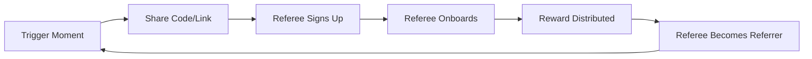
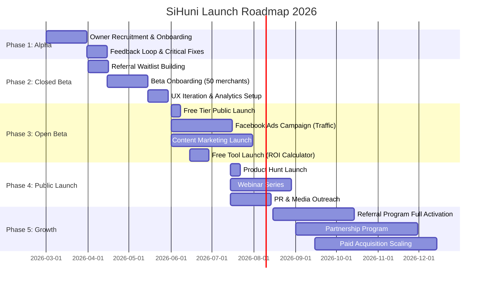
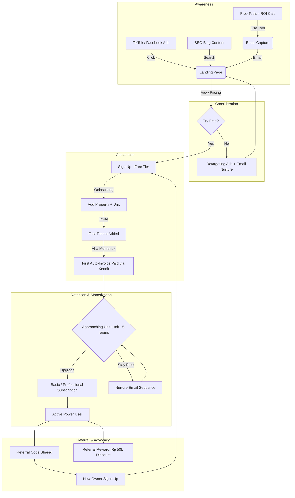

# Marketing Strategy & Go-to-Market Document — SiHuni

**Version:** 2.0
**Last Updated:** 2026-02-22
**Status:** Final Draft
**Document ID:** DOC-MKT-002
**Supersedes:** DOC-MKT-001 (v1.0)

---

## Table of Contents

1. [Executive Summary](#1-executive-summary)
2. [Market Positioning & Competitive Analysis](#2-market-positioning--competitive-analysis)
3. [Target Audience Personas](#3-target-audience-personas)
4. [Pricing Strategy](#4-pricing-strategy)
5. [Referral Program Strategy](#5-referral-program-strategy)
6. [Free Tool Strategy (Engineering as Marketing)](#6-free-tool-strategy-engineering-as-marketing)
7. [Content Strategy](#7-content-strategy)
8. [Social Media Strategy](#8-social-media-strategy)
9. [Email Marketing Strategy](#9-email-marketing-strategy)
10. [Go-to-Market (GTM) Strategy](#10-go-to-market-gtm-strategy)
11. [Acquisition Funnel](#11-acquisition-funnel)
12. [Marketing Psychology Principles](#12-marketing-psychology-principles)
13. [Competitor Comparison Pages](#13-competitor-comparison-pages)
14. [Marketplace Marketing Strategy](#14-marketplace-marketing-strategy)
15. [Key Metrics & KPIs](#15-key-metrics--kpis)
16. [Assumptions, Risks & Constraints](#16-assumptions-risks--constraints)
17. [Skills & Frameworks Used](#17-skills--frameworks-used)

---

## 1. Executive Summary

**SiHuni (Sistem Huni)** is a comprehensive **multi-role property management platform** purpose-built for the Indonesian boarding house (kos-kosan) market. It serves four distinct user roles — **Admin, Merchant (Owner), Tenant, and Vendor** — within a single unified platform.

### 1.1 Core Differentiators (Actual Platform Capabilities)

| Capability | Description | Technical Implementation |
| :--- | :--- | :--- |
| **Automated Billing & Escrow** | Auto-generate invoices on billing day, process payments via Xendit (VA/QRIS/e-wallet), hold funds in escrow, auto-disburse to merchants | `auto-generate-invoices`, `xendit-payment-webhook`, `scheduled-disbursement` edge functions |
| **Multi-Role Platform** | 4 roles with RBAC, each with dedicated dashboards, AI chatbot, and workflows | `app_role` enum: `admin`, `merchant`, `tenant`, `vendor` |
| **Vendor Marketplace** | Tenants order products/services from verified vendors; platform earns commission | `vendor_products`, `vendor_orders`, `vendor_order_items` tables |
| **AI-Powered Assistance** | 3 role-specific AI chatbots (Gemini-powered) for contextual help | `chat-with-ai` edge function, `chat_conversations` / `chat_messages` tables |
| **Referral Network** | Double-sided referral rewards with commission tracking and payouts | `referral_codes`, `referral_rewards`, 3 processing edge functions |
| **4-Tier Overdue Escalation** | Automated dunning from grace period → reminders → pre-collection → collections case | `check-overdue-escalation` edge function, `collections_cases` table |
| **Digital Contracts & Signatures** | Online contract signing with signature capture, multi-party workflow | `contracts` table with `signature_status`, `merchant_signature_url`, `tenant_signature_url` |

### 1.2 Core Value Proposition

> **"Kelola Kos Lebih Cerdas dengan Automasi & Data."**
> (Manage Smarter with Automation & Data.)

For Indonesian kos owners who lose time chasing rent payments and managing spreadsheets, SiHuni automates billing, payments, and tenant lifecycle — so they can focus on growing their property business.

---

## 2. Market Positioning & Competitive Analysis

### 2.1 Porter's Five Forces Analysis

*Framework: `competitive-landscape` skill*

| Force | Intensity | Analysis |
| :--- | :--- | :--- |
| **Threat of New Entrants** | Moderate | Low barrier to build a web app, but SiHuni's network effects (marketplace + referral) and multi-role architecture create a meaningful moat over time. |
| **Supplier Power** | Low | Payment gateway (Xendit) and email (Resend) are commoditized and interchangeable. No vendor lock-in. |
| **Buyer Power** | High | Fragmented market of individual owners. Low switching costs — they can always revert to Excel/WhatsApp. Must win on value, not lock-in. |
| **Threat of Substitutes** | High | Excel spreadsheets, WhatsApp groups, paper notebooks, and generic property management apps are all substitutes. Key: position SiHuni as automation (not just digitization). |
| **Competitive Rivalry** | Low-Moderate | Few Indonesian kos-specific platforms exist. Most are generic property tools not tailored to the kos business model (monthly rent, per-room, high tenant turnover). |

**Strategic Implication:** The biggest competition is **non-consumption** (owners doing nothing or using manual methods). Marketing must focus on displacing manual processes, not competing with other software.

### 2.2 Blue Ocean Strategy — Four Actions Framework

*Framework: `competitive-landscape` skill*

| Action | What SiHuni Does |
| :--- | :--- |
| **Eliminate** | Manual bank reconciliation (auto-matched via Xendit webhooks). Manual tenant data entry (digital invitation flow with auto-profile creation). |
| **Reduce** | Administrative overhead: auto-invoicing, auto-reminders, 4-tier escalation reduce time spent chasing payments by ~80%. |
| **Raise** | Financial transparency: real-time escrow balances, P&L analytics, disbursement tracking. Tenant trust: digital contracts with e-signatures and payment receipts. |
| **Create** | Vendor marketplace inside kos platform (no competitor offers this). Role-specific AI chatbots. Referral commission system for organic growth. |

### 2.3 Positioning Map

```
                    Highly Automated
                         ▲
                         │
                         │        ★ SiHuni
                         │
        Simple ──────────┼──────────── Feature-Rich
                         │
           Excel/        │
           WhatsApp      │    Generic Property Apps
                         │
                    Manual
```

**SiHuni occupies the upper-right quadrant:** Feature-Rich + Highly Automated. No direct competitor currently occupies this position in the Indonesian kos market.

### 2.4 Positioning Statement

*Framework: `competitor-alternatives` skill*

> **For** Indonesian boarding house owners and property managers
> **Who** struggle with unpaid rent, manual spreadsheets, and zero financial visibility
> **SiHuni** is a comprehensive property management platform
> **That** automates billing, payments, tenant lifecycle, and vendor services
> **Unlike** Excel spreadsheets, WhatsApp groups, and generic property apps
> **SiHuni** offers built-in escrow, vendor marketplace, AI-powered assistance, and a referral network — all in one platform designed specifically for the kos business model.

### 2.5 Unique Selling Proposition (USP) Table

| Feature | Manual Methods (Excel/WA) | Generic Property Apps | **SiHuni** |
| :--- | :--- | :--- | :--- |
| **Invoice Generation** | Manual typing | Semi-manual | **Fully automated** (cron-based) |
| **Payment Processing** | Bank transfer + manual check | Basic integration | **Xendit: VA, QRIS, e-wallet + auto-reconciliation** |
| **Overdue Management** | Personal follow-up via WA | Basic reminders | **4-tier automated escalation → collections** |
| **Financial Analytics** | Calculate manually | Basic reports | **Real-time P&L, escrow, disbursement tracking** |
| **Vendor Services** | Find on Google/WA | Not available | **Built-in marketplace with verified vendors** |
| **Multi-Role Access** | Not applicable | Owner-only | **Admin, Owner, Tenant, Vendor — each with dashboard** |
| **AI Assistance** | Not available | Not available | **3 role-specific AI chatbots (Gemini)** |
| **Referral Program** | Word-of-mouth | Not available | **Built-in referral with commission tracking** |
| **Security** | Minimal | Basic | **AES-256 encryption, RBAC, audit logs, RLS** |

---

## 3. Target Audience Personas

### 3.1 Primary Persona: "Pak Budi, The Modern Owner"

- **Profile:** 35–50 years old, owns 2–5 kos locations (20–100 rooms).
- **Tech Literacy:** Moderate — uses smartphone daily, familiar with mobile banking and WhatsApp.
- **Pain Points:**
  - *"Saya harus cek mutasi bank satu-satu untuk tahu siapa yang sudah bayar."* (I have to check bank mutations one by one to know who paid.)
  - *"Ada penyewa yang kabur tanpa bayar, dan saya baru tahu setelah sebulan."* (A tenant ran away without paying, and I only found out after a month.)
  - *"Admin saya sering salah catat di Excel, dan saya tidak bisa audit."* (My admin makes errors in Excel, and I can't audit.)
  - *"Saya tidak tahu berapa net profit sebenarnya per properti."* (I don't know the actual net profit per property.)
- **Motivation:** Financial clarity, automated collections, peace of mind.
- **Aha Moment:** Seeing the first auto-generated invoice get paid by tenant via QRIS — without any manual follow-up.
- **Willingness to Pay:** Rp 99k–249k/month (less than 1 day's room rent).

### 3.2 Secondary Persona: "Mba Siti, The Admin/Staff"

- **Profile:** 20–30 years old, operational staff managing daily kos operations.
- **Tech Literacy:** High — digital native, uses multiple apps daily.
- **Pain Points:**
  - *"Saya kewalahan dengan chat WhatsApp bukti bayar dari 50+ penyewa."* (I'm overwhelmed with payment proof WhatsApp chats from 50+ tenants.)
  - *"Kalau ada penyewa complaint maintenance, saya harus follow up manual ke tukang."* (When a tenant complains about maintenance, I have to manually follow up with repairmen.)
  - *"Setiap bulan saya harus buat invoice manual di Excel."* (Every month I have to create manual invoices in Excel.)
- **Motivation:** Finish work faster, avoid being blamed for errors, clear task tracking.
- **Aha Moment:** Auto-invoice generation eliminates monthly spreadsheet ritual.

### 3.3 Tertiary Persona: "Mas Andi, The Tenant" *(NEW)*

- **Profile:** 18–30 years old, university student or young professional renting a kos room.
- **Tech Literacy:** Very high — expects mobile-first experience.
- **Pain Points:**
  - *"Pemilik kos tidak pernah kasih kuitansi, jadi saya tidak punya bukti bayar."* (The owner never gives receipts, so I have no proof of payment.)
  - *"Kalau AC rusak, saya harus WA berulang-ulang sampai diperbaiki."* (When the AC breaks, I have to WhatsApp repeatedly until it's fixed.)
  - *"Saya mau bayar pakai QRIS tapi pemilik cuma terima transfer bank."* (I want to pay via QRIS but the owner only accepts bank transfer.)
- **Motivation:** Easy digital payment, transparent billing, trackable maintenance requests.
- **Aha Moment:** Pay rent via QRIS in 5 seconds, get instant digital receipt.

### 3.4 Tertiary Persona: "Bu Dewi, The Vendor" *(NEW)*

- **Profile:** 30–45 years old, runs a local service business (AC repair, laundry, cleaning, furniture).
- **Tech Literacy:** Moderate — uses Instagram/Tokopedia for business.
- **Pain Points:**
  - *"Sulit dapat customer baru selain dari mulut ke mulut."* (Hard to get new customers beyond word-of-mouth.)
  - *"Order dari kos sering via WA, kadang lupa, kadang tidak dibayar."* (Orders from kos are often via WA, sometimes forgotten, sometimes unpaid.)
- **Motivation:** Access to a captive kos market, structured order management, guaranteed payments.
- **Aha Moment:** First order from a tenant through the marketplace — with guaranteed payment via escrow.

---

## 4. Pricing Strategy

*Framework: `pricing-strategy` skill*

### 4.1 Pricing Tiers (Actual — from Database)

| Tier | Monthly Price | Yearly Price | Max Units | Max Properties | Max Tenants | Trial Days | Key Features |
| :--- | :--- | :--- | :--- | :--- | :--- | :--- | :--- |
| **Free (Starter)** | Rp 0 | Rp 0 | 5 | 1 | 10 | 14 | Basic tenant recording, manual management |
| **Basic** | Rp 99.000 | Rp 990.000 | 25 | 3 | 50 | 14 | Auto-invoicing, payment integration, basic analytics |
| **Professional** | Rp 249.000 | Rp 2.490.000 | 100 | 10 | 200 | 14 | Advanced analytics, multi-staff access (RBAC), priority support, marketplace access |
| **Enterprise** | Rp 599.000 | Rp 5.990.000 | ∞ | ∞ | ∞ | 30 | All features, dedicated account manager, custom analytics, white-label options |

### 4.2 Value Metric Analysis

*Framework: `pricing-strategy` skill — Value Metric Selection*

- **Primary Value Metric:** Number of Units (rooms)
  - ✅ Scales directly with owner's revenue — more rooms = more rent income
  - ✅ Easy to understand — owners know exactly how many rooms they have
  - ✅ Hard to game — rooms are physical, can't fake the count
  - ✅ Natural expansion path — owners acquire more properties over time
- **Secondary Gating:** Feature access (analytics depth, automation level, marketplace, white-label)
- **Annual Discount:** ~17% savings (Rp 990k/yr vs. Rp 99k × 12 = Rp 1.188k)

### 4.3 Good-Better-Best Framework

*Framework: `pricing-strategy` skill — Tier Structure*

| Role | Tier | Positioning |
| :--- | :--- | :--- |
| **Good (Entry)** | Free | Displace Excel/notebooks. No risk. Prove core value. |
| **Better (Recommended)** | Basic | Anchor tier for most owners (2–25 rooms). Auto-invoicing is the upgrade trigger. |
| **Best (Power)** | Professional | Multi-property owners. Advanced analytics + RBAC justify 2.5x price. |
| **Custom (Enterprise)** | Enterprise | Large property companies. Unlimited everything + dedicated support. |

### 4.4 Feature Gating per Tier

| Feature | Free | Basic | Professional | Enterprise |
| :--- | :--- | :--- | :--- | :--- |
| Tenant management | ✅ | ✅ | ✅ | ✅ |
| Property/unit management | 1 / 5 | 3 / 25 | 10 / 100 | ∞ / ∞ |
| Auto-invoice generation | ❌ | ✅ | ✅ | ✅ |
| Xendit payment integration | ❌ | ✅ | ✅ | ✅ |
| Overdue escalation (4-tier) | ❌ | ✅ | ✅ | ✅ |
| Financial analytics | Basic | Standard | Advanced | Custom |
| Multi-staff access (RBAC) | ❌ | ❌ | ✅ | ✅ |
| Vendor marketplace | ❌ | ❌ | ✅ | ✅ |
| AI chatbot | ❌ | Basic | Full | Full + custom training |
| Escrow & auto-disbursement | ❌ | ❌ | ✅ | ✅ |
| Digital contracts + e-sign | Basic | Full | Full | Full + custom templates |
| Priority support | ❌ | ❌ | ✅ | ✅ + dedicated AM |
| White-label options | ❌ | ❌ | ❌ | ✅ |

### 4.5 Pricing Psychology

*Framework: `marketing-psychology` skill*

| Principle | Application |
| :--- | :--- |
| **Anchoring** | Display Enterprise (Rp 599k) first/prominently so Professional (Rp 249k) feels like a bargain. |
| **Decoy Effect** | Basic (Rp 99k for 25 units) vs. Professional (Rp 249k for 100 units) — Professional is clearly better value per unit (Rp 2.490/unit vs. Rp 3.960/unit). |
| **Mental Accounting** | Frame Basic as "Rp 3.300/hari — lebih murah dari secangkir kopi" (cheaper than a cup of coffee per day). |
| **Zero-Price Effect** | Free tier eliminates all risk. Extremely powerful in the price-sensitive Indonesian market. |
| **Endowment Effect** | 14-day trial with full data entry creates ownership feeling. Losing data = losing work = high switching cost. |
| **Charm Pricing** | Rp 99.000 (not Rp 100.000) — leverages left-digit bias. |
| **Annual Framing** | "Hemat Rp 198.000/tahun" — loss aversion framing for annual plans. |

### 4.6 Pricing Page Best Practices

- Show recommended tier (Basic) highlighted with "Paling Populer" badge
- Monthly ↔ Annual toggle with savings callout ("Hemat 17%")
- Feature comparison table below pricing cards
- FAQ section addressing common objections
- Customer testimonial near CTA
- "14 Hari Gratis" badge on all paid tiers
- Money-back guarantee messaging

---

## 5. Referral Program Strategy

*Framework: `referral-program` skill*

### 5.1 Program Architecture (Implemented)

The referral system is fully built into the platform:

| Component | Implementation |
| :--- | :--- |
| **Referral Code Generation** | Unique code per merchant, stored in `referral_codes` table |
| **Referral Tracking** | `referred_by` field on `merchants`, `vendors` tables |
| **Reward Processing** | 3 edge functions: `process-referral-commissions`, `process-referral-reward`, `process-vendor-order-referral` |
| **Reward Amount** | Default: Rp 50.000 per completed referral (`DEFAULT_REWARD_AMOUNT`) |
| **Reward Types** | Subscription discount (merchant), rent discount (tenant), commission bonus (vendor) |
| **Analytics** | `trackReferralLinkCopied`, `trackReferralLinkShared` events |
| **Dashboard** | `ReferralDashboard` component with stats, tracking, reward claims |

### 5.2 Double-Sided Reward Structure

| Party | Reward | Condition |
| :--- | :--- | :--- |
| **Referrer** | Rp 50.000 subscription discount | Referee completes onboarding + first payment |
| **Referee** | Rp 50.000 first-month discount | Signs up via referral code + adds first property |

### 5.3 Referral Growth Loop

*Framework: `referral-program` skill — Loop Design*



**Optimal Trigger Moments** (when to prompt referral sharing):
1. After first tenant successfully pays via platform (peak satisfaction)
2. When approaching unit limit (5/25/100) — "Invite a friend, get Rp 50k off upgrade"
3. After 30 days of active use (established habit)
4. After viewing positive financial analytics (emotional high)

### 5.4 K-Factor Optimization

**Target K-Factor:** > 0.5 (every 2 users bring 1 new user)

- **Formula:** K = (Invites per User) × (Conversion Rate per Invite)
- **Tracking:** `referral_rewards` table tracks completions; analytics events track shares
- **Optimization levers:**
  - Increase invites: Make sharing frictionless (WhatsApp deep link, copy-paste code)
  - Increase conversion: Strong landing page for referral links with social proof
  - Increase reward: Test higher rewards (Rp 75k, Rp 100k) if K-Factor < 0.3

---

## 6. Free Tool Strategy (Engineering as Marketing)

*Framework: `free-tool-strategy` skill*

### 6.1 Tool Portfolio

| Tool | Type | Target Keyword | Search Volume | Lead Quality | Build Effort |
| :--- | :--- | :--- | :--- | :--- | :--- |
| **Kalkulator ROI Kos** | Calculator | "kalkulator investasi kos", "ROI kos-kosan" | Medium | High | Low |
| **Template Kontrak Sewa** | Generator | "contoh kontrak sewa kos", "template perjanjian kos" | High | High | Low |
| **Cek Harga Sewa per Kota** | Analyzer | "harga sewa kos [kota]", "harga kos Jakarta" | High | Medium | Medium |
| **Kalkulator Biaya Renovasi Kamar** | Calculator | "biaya renovasi kamar kos", "estimasi biaya kos" | Medium | Medium | Low |

### 6.2 Tool Design Principles

1. **Solve a real problem** — each tool addresses a genuine question owners ask before/during kos ownership
2. **Adjacent to core product** — natural path from tool → SiHuni signup
3. **Simple and focused** — one input, one clear output, works on mobile
4. **Worth the investment** — each tool targets keywords with clear purchase intent

### 6.3 Lead Capture Strategy

- **Partially gated:** Show preview results immediately, require email for full report/PDF export
- **Value exchange:** "Dapatkan laporan lengkap via email" (Get full report via email)
- **Minimal friction:** Email only — no phone, no company name
- **Qualifying question:** "Berapa jumlah kamar kos Anda?" (How many rooms?) — segments into tiers

### 6.4 Evaluation Scorecard

| Factor | ROI Calculator | Contract Template | Price Analyzer | Renovation Calculator |
| :--- | :--- | :--- | :--- | :--- |
| Search demand | 4 | 5 | 4 | 3 |
| Audience match | 5 | 5 | 4 | 3 |
| Uniqueness | 4 | 3 | 4 | 3 |
| Path to product | 5 | 4 | 3 | 3 |
| Build feasibility | 5 | 4 | 3 | 5 |
| Maintenance burden | 5 | 4 | 3 | 5 |
| Link-building potential | 4 | 5 | 3 | 3 |
| Share-worthiness | 3 | 4 | 4 | 3 |
| **Total** | **35** | **34** | **28** | **28** |

**Priority:** ROI Calculator → Contract Template → Price Analyzer → Renovation Calculator

---

## 7. Content Strategy

*Framework: `content-strategy` skill*

### 7.1 Content Pillars

| Pillar | Allocation | Topics | Primary Format | Buyer Stage |
| :--- | :--- | :--- | :--- | :--- |
| **Manajemen Kos** | 30% | Tips pengelolaan, efisiensi operasional, tenant management | Blog, PDF Guide | Awareness |
| **Keuangan Properti** | 25% | ROI, cashflow, pajak kos, analisis investasi | Calculator, Infographic | Consideration |
| **Hukum & Kepatuhan** | 20% | Kontrak sewa, hak pemilik, regulasi daerah, pajak | Blog, Template, Checklist | Consideration |
| **Teknologi & Automasi** | 15% | Demo produk, tutorial, studi kasus, comparison | Video, Tutorial, Case Study | Decision |
| **Komunitas & Inspirasi** | 10% | Cerita sukses owner, tips bisnis properti, market trends | Social Post, Interview | Awareness |

### 7.2 Hub-and-Spoke SEO Structure

**Hub Page:** "Panduan Lengkap Manajemen Kos-Kosan 2026" (comprehensive guide, 5000+ words)

**Spoke Articles** (10+ per pillar, interlinked):

- Manajemen: "Cara Mengelola 50+ Kamar Kos Tanpa Stres", "SOP Harian Admin Kos"
- Keuangan: "Menghitung ROI Investasi Kos-Kosan", "Strategi Cashflow untuk Pemilik Kos"
- Hukum: "Panduan Kontrak Sewa Kos yang Sah", "Hak Pemilik Kos Menurut Hukum Indonesia"
- Teknologi: "Excel vs Aplikasi Kos: Perbandingan Lengkap", "Tutorial: Auto-Invoice dalam 5 Menit"
- Komunitas: "Dari 5 Kamar ke 100: Perjalanan Pak Budi", "Tren Bisnis Kos 2026"

### 7.3 Keyword Research by Buyer Stage

| Stage | Keywords (Indonesian) | Content Type | CTA |
| :--- | :--- | :--- | :--- |
| **Awareness** | "cara mengelola kos", "tips bisnis kos-kosan", "penghasilan dari kos" | Blog, Social | Email subscribe |
| **Consideration** | "aplikasi manajemen kos", "software kos terbaik", "aplikasi kos gratis" | Comparison, Review | Free tool / Free tier signup |
| **Decision** | "SiHuni review", "harga aplikasi kos", "SiHuni vs Excel" | Landing page, Case study | Start free trial |
| **Implementation** | "tutorial SiHuni", "cara buat invoice kos", "cara kelola penyewa" | Tutorial, Video | In-app activation |

### 7.4 Content Calendar (Monthly Production)

| Week | Content Piece | Format | Channel | Pillar |
| :--- | :--- | :--- | :--- | :--- |
| 1 | Educational blog post | Blog (1500+ words) | Website, SEO | Rotating |
| 1 | 3 social media posts | Carousel / Short video | TikTok, Instagram, Facebook | Rotating |
| 2 | Template / Checklist | PDF download | Website, Email | Hukum / Manajemen |
| 2 | 3 social media posts | Behind-the-scenes / Tips | TikTok, Instagram | Komunitas |
| 3 | Tutorial / How-to | Video (3-5 min) | YouTube, TikTok | Teknologi |
| 3 | 3 social media posts | Data insight / Infographic | Instagram, LinkedIn | Keuangan |
| 4 | Case study / Success story | Blog + Social | Website, Facebook | Komunitas |
| 4 | 3 social media posts | Hook-based educational | TikTok, Instagram | Rotating |

**Monthly output:** 4 long-form pieces + 12 social media posts + 1 template/tool

---

## 8. Social Media Strategy

*Framework: `social-content` skill*

### 8.1 Platform Selection for Indonesian Market

| Platform | Priority | Target Audience | Content Type | Posting Frequency |
| :--- | :--- | :--- | :--- | :--- |
| **TikTok / Instagram Reels** | PRIMARY | Owner 25–45, Admin 20–30 | Short-form: "before vs after SiHuni", tips, fails | 3–4x/week |
| **Facebook Groups** | PRIMARY | Owner 35–55 | Long-form: tips, testimonials, community discussion | 2–3x/week |
| **Instagram Feed** | SECONDARY | Owner 25–40 | Carousel infographics, stories, product updates | 3x/week |
| **LinkedIn** | TERTIARY | Enterprise owners, investors | Thought leadership, industry data, company updates | 1x/week |
| **YouTube** | TERTIARY | All personas | Tutorials, product demos, case studies | 2x/month |

### 8.2 Content Mix (Social)

*Framework: `social-content` skill — Content Pillars*

| Category | Allocation | Examples |
| :--- | :--- | :--- |
| **Industry Insights** | 30% | Kos market data, rental trends per city, regulation updates |
| **Educational** | 25% | Tips kelola kos, financial literacy, legal advice |
| **Behind-the-Scenes** | 25% | Building SiHuni, customer stories, team updates |
| **Personal / Founder** | 15% | Lessons learned, failures, founder journey |
| **Promotional** | 5% | Feature launches, product updates, offers |

### 8.3 Hook Formulas for Indonesian Audience

*Framework: `social-content` skill — Hook Formulas adapted for Bahasa Indonesia*

**Problem-Agitation hooks:**
- "Saya hampir bangkrut karena penyewa kabur. Ini yang saya pelajari..."
- "3 kesalahan fatal pemilik kos yang bikin rugi jutaan:"
- "Stop pakai Excel untuk kos. Ini alasannya:"

**Curiosity hooks:**
- "Pemilik kos ini punya 100 kamar tapi cuma kerja 2 jam/hari. Rahasianya?"
- "Kenapa penyewa Anda selalu telat bayar? Bukan karena mereka nakal."

**Contrarian hooks:**
- "Semua orang bilang bisnis kos itu passive income. Mereka salah."
- "Saya berhenti pakai WhatsApp untuk kelola kos. Ini yang terjadi."

**Data hooks:**
- "72% pemilik kos tidak tahu net profit mereka. Apakah Anda termasuk?"
- "Rata-rata pemilik kos kehilangan Rp 2 juta/bulan karena ini:"

---

## 9. Email Marketing Strategy

*Framework: `email-sequence` skill*

### 9.1 Onboarding Sequence (7 Emails, 14 Days)

Platform uses Resend for transactional and lifecycle emails. This sequence activates new free-tier signups:

| Day | Email | Subject Line | Goal | CTA |
| :--- | :--- | :--- | :--- | :--- |
| 0 | Welcome | "Selamat datang di SiHuni! 🏠" | Set expectations, guide first step | Add first property |
| 1 | Setup | "Langkah 1: Tambahkan unit kamar pertama Anda" | Property → Unit setup | Add unit |
| 3 | Invite | "Undang penyewa pertama Anda (tanpa ketik data manual)" | Tenant invitation flow | Send invitation |
| 5 | Aha | "Invoice pertama Anda sudah dibuat otomatis! 🎉" | Show auto-invoice magic | View invoice |
| 7 | Social Proof | "Pak Budi hemat 10 jam/minggu dengan SiHuni" | Build trust via case study | Explore features |
| 10 | Advanced | "Pro tip: Escrow & auto-disbursement" | Educate on premium value | Upgrade to Basic |
| 13 | Urgency | "Trial Anda berakhir besok — jangan kehilangan data" | Convert to paid | Upgrade now |

### 9.2 Payment Reminder Sequence (Already Implemented)

The platform has a 4-tier automated escalation system:

| Timing | Action | Channel |
| :--- | :--- | :--- |
| 3 days before due | Friendly reminder | Email + in-app notification |
| 1 day before due | Due date reminder | Email + in-app notification |
| Due date | Payment due notice | Email + in-app notification |
| Day 1–3 overdue | Grace period reminders (daily) | Email |
| Day 4–7 overdue | Post-grace warnings (2x daily) | Email + push |
| Day 8–14 overdue | Pre-collection escalation | Email + merchant notification |
| Day 15+ overdue | Collections case created | Email + admin alert |

### 9.3 Win-Back Sequence (3 Emails)

For users inactive >30 days:

| Day | Subject Line | Angle |
| :--- | :--- | :--- |
| 30 | "Penyewa Anda mungkin sudah bayar — cek sekarang" | FOMO / curiosity |
| 45 | "3 fitur baru yang Anda lewatkan bulan ini" | Feature update round-up |
| 60 | "Kami rindu Anda — ini diskon khusus untuk comeback 🎁" | Special offer / extended trial |

### 9.4 Upgrade Sequence (5 Emails)

Triggered by usage patterns:

| Trigger | Subject Line | Psychology |
| :--- | :--- | :--- |
| 4 of 5 units used | "Anda sudah 80% kapasitas — siap naik level?" | Goal-gradient effect |
| Feature gate hit | "Lihat analytics yang bisa Anda unlock 🔓" | Curiosity + loss aversion |
| 30 days active | "500+ pemilik kos sudah upgrade. Ini alasan mereka:" | Bandwagon + social proof |
| Approaching billing | "Hemat Rp 198.000 dengan paket tahunan" | Annual discount highlight |
| Trial ending (Day 12) | "Trial Anda berakhir dalam 48 jam ⏰" | Urgency + loss aversion |

### 9.5 Transactional Email Templates (Already Built)

30+ templates already implemented via Resend:
- Payment confirmations & receipts
- Invoice generated notifications
- Overdue reminders (4-tier escalation)
- Subscription renewal / expiry
- Tenant invitation links
- Maintenance request updates
- Referral reward earned
- Contract signature requests
- Move-out notice confirmations
- Disbursement completed
- Vendor order notifications

---

## 10. Go-to-Market (GTM) Strategy

*Framework: `launch-strategy` skill*

### 10.1 ORB Framework (Channel Strategy)

| Channel Type | Channels | Purpose |
| :--- | :--- | :--- |
| **Owned** | Email list (free tool leads + freemium signups), Blog (SEO content pillars), In-app messaging (upgrade prompts, feature announcements) | Long-term asset building, direct relationship |
| **Rented** | TikTok/Instagram Reels (primary visibility), Facebook Groups (relationship building), Google Search Ads (high-intent keywords) | Reach and discovery |
| **Borrowed** | Guest posts on properti.com / rumah123.com, Podcast interviews on Indonesian business/property podcasts, Partnership with kos supplier networks | Credibility and authority |

### 10.2 Five-Phase Launch

| Phase | Timeline | Goal | Strategy | Key Metric |
| :--- | :--- | :--- | :--- | :--- |
| **1. Internal Alpha** | Month 1 | Validate core flows | 5–10 friendly owners, white-glove onboarding, daily feedback calls | NPS > 8 |
| **2. Closed Beta** | Month 2–3 | 50 active merchants | Invitation-only, referral-based waitlist, iterate on UX | Activation rate > 40% |
| **3. Open Beta** | Month 3–4 | 200 signups | Facebook Ads, free tier launch, content marketing begins | CAC < Rp 50k |
| **4. Public Launch** | Month 5 | 500+ users, first paid conversions | Product Hunt, PR, webinar series, referral program activation | Free-to-paid > 5% |
| **5. Growth** | Month 6+ | Scale paid conversions | Referral program, partnerships, paid acquisition optimization | MRR > Rp 10M |

### 10.3 Launch Timeline



### 10.4 Product Hunt Launch Checklist

*Framework: `launch-strategy` skill*

**Pre-launch (2 weeks before):**
- [ ] Build 200+ email waitlist via free tools and beta program
- [ ] Prepare demo video (90 seconds, show auto-invoice + payment flow)
- [ ] Create GIF screenshots of key features
- [ ] Brief 50+ beta users to upvote and comment on launch day
- [ ] Prepare maker comment with story + key metrics

**Launch day:**
- [ ] Post at 00:01 PT (optimal timing)
- [ ] All-day engagement — respond to every comment within 30 minutes
- [ ] Share on all social channels with "We're live on PH" posts
- [ ] Email waitlist with direct PH link

**Post-launch (1 week after):**
- [ ] Convert PH traffic to email signups / free tier signups
- [ ] Follow up with commenters who showed interest
- [ ] Publish "lessons learned" blog post (content marketing)
- [ ] Analyze traffic sources and conversion rates

---

## 11. Acquisition Funnel



**Key Funnel Metrics:**

| Stage | Metric | Target |
| :--- | :--- | :--- |
| Awareness → Visit | Click-through rate | > 2% (ads), > 5% (SEO) |
| Visit → Signup | Conversion rate | > 8% (landing page) |
| Signup → Activated | Activation rate (first tenant added in 24h) | > 40% |
| Activated → Aha Moment | First auto-invoice paid | > 60% of activated |
| Free → Paid | Conversion rate (within 90 days) | > 5% |
| Paid → Referrer | Referral rate | > 20% share code |

---

## 12. Marketing Psychology Principles

*Framework: `marketing-psychology` skill*

| Principle | Application in SiHuni | Where |
| :--- | :--- | :--- |
| **Zero-Price Effect** | Free tier removes all risk for price-sensitive Indonesian owners. "Gratis, tanpa kartu kredit." | Pricing page, ads |
| **Endowment Effect** | 14-day trial with data entry creates ownership feeling. Losing data = losing work invested. | Trial flow, upgrade emails |
| **Loss Aversion** | "Jangan kehilangan data penyewa Anda" — frame upgrade as loss prevention, not gain. | Upgrade sequence |
| **IKEA Effect** | Owner customizes properties, units, contracts = higher perceived value of the platform. | Onboarding flow |
| **Goal-Gradient Effect** | Onboarding progress bar: Property ✓ → Unit ✓ → Tenant ✓ → Invoice ✓. Users accelerate near completion. | Onboarding UI |
| **Bandwagon Effect** | "500+ pemilik kos sudah menggunakan SiHuni" — social proof counter on landing page. | Landing page, emails |
| **Mere Exposure Effect** | Consistent brand presence via TikTok + Facebook (3–4 posts/week) builds familiarity. | Social media |
| **Jobs to Be Done** | Owner doesn't want "software" — wants "ketenangan pikiran tentang pembayaran sewa" (peace of mind about rent payments). | All messaging |
| **Reciprocity** | Free tools (ROI calculator, contract template) create obligation to try the product. | Free tool pages |
| **Social Proof** | Testimonials, case studies, user count, "Dipercaya oleh X pemilik kos." | Landing page, pricing |
| **Scarcity / Urgency** | "Trial berakhir dalam 48 jam" — time-limited trial creates urgency to upgrade. | Upgrade emails |
| **Framing Effect** | "Rp 3.300/hari" instead of "Rp 99.000/bulan" — daily framing makes price feel smaller. | Pricing page |

---

## 13. Competitor Comparison Pages

*Framework: `competitor-alternatives` skill*

SEO-driven comparison pages to capture high-intent traffic from owners actively seeking solutions:

| Page | URL Pattern | Target Keywords | Content Approach |
| :--- | :--- | :--- | :--- |
| SiHuni vs Excel | `/vs/excel` | "aplikasi kos vs excel", "kelola kos tanpa excel" | Show time savings: 10 hours/week manual vs. automated |
| SiHuni vs WhatsApp | `/vs/whatsapp` | "manajemen kos tanpa whatsapp", "aplikasi kos bukan whatsapp" | Data loss risk, no audit trail, missed payments |
| SiHuni vs Manual | `/alternatives/manual` | "alternatif manajemen kos manual", "digitalisasi kos" | ROI calculator embedded, before/after scenarios |
| Best Kos Apps 2026 | `/blog/best-kos-apps` | "aplikasi manajemen kos terbaik 2026" | Listicle with SiHuni featured prominently (with honest comparison) |

**Page Template Structure:**
1. Hero: "SiHuni vs [Alternative] — Perbandingan Lengkap"
2. Quick comparison table (features, price, ease of use)
3. Detailed feature-by-feature breakdown
4. Real scenario: "Pak Budi's day with Excel vs. SiHuni"
5. Testimonial from converted user
6. CTA: "Coba Gratis 14 Hari"

---

## 14. Marketplace Marketing Strategy

### 14.1 Two-Sided Marketplace Dynamics

SiHuni's vendor marketplace creates a unique two-sided value proposition:

| Side | Value Proposition | Acquisition Strategy |
| :--- | :--- | :--- |
| **Supply (Vendors)** | Access to captive kos market, structured orders, guaranteed payments via escrow | Direct outreach to local kos suppliers, partnership with contractor networks |
| **Demand (Tenants)** | Convenient access to kos-related services (AC repair, laundry, cleaning, furniture) | In-app marketplace discovery, maintenance request → vendor suggestion |

### 14.2 Vendor Acquisition Strategy

- **Phase 1:** Manually onboard 20–30 vendors per city (AC repair, laundry, cleaning)
- **Phase 2:** Self-serve vendor registration via platform
- **Phase 3:** Vendor referral program (vendor-to-vendor)

### 14.3 Marketplace Revenue Model

- **Platform commission:** 5% per vendor order (already implemented)
- **Revenue tracking:** `vendor_orders`, `vendor_order_items` tables
- **Escrow protection:** Funds held until order completed, then disbursed to vendor

### 14.4 Cross-Sell Opportunities

| Trigger | Marketplace Suggestion |
| :--- | :--- |
| Maintenance request created (AC category) | Suggest AC repair vendors in marketplace |
| New tenant moves in | Suggest cleaning services, furniture vendors |
| Seasonal (rainy season) | Promote waterproofing, pest control vendors |
| Contract renewal | Suggest room renovation vendors |

---

## 15. Key Metrics & KPIs

*Framework: `startup-metrics-framework` skill*

### 15.1 North Star Metric

> **Active Properties with Auto-Invoicing Enabled**

This metric captures the core value delivered: a property with auto-invoicing means the owner is using SiHuni's automation (not just storing data), tenants are paying through the platform, and the owner is getting real value.

### 15.2 SaaS Metrics Dashboard

| Metric | Formula | Target (Month 6) | Target (Month 12) |
| :--- | :--- | :--- | :--- |
| **MRR** | Σ(Active Subscriptions × Monthly Price) | Rp 10M | Rp 50M |
| **ARR** | MRR × 12 | Rp 120M | Rp 600M |
| **CAC** | Total Marketing Spend / New Paid Signups | < Rp 50.000 | < Rp 75.000 |
| **LTV** | ARPU × Avg Lifetime (months) × Gross Margin | > Rp 1.500.000 | > Rp 3.000.000 |
| **LTV:CAC Ratio** | LTV / CAC | > 3.0 | > 5.0 |
| **Activation Rate** | % signups adding first tenant within 24h | > 40% | > 50% |
| **Free-to-Paid Conversion** | % free users upgrading within 90 days | > 5% | > 8% |
| **Monthly Churn** | Cancelled Subscriptions / Total Active | < 3% | < 2% |
| **Referral K-Factor** | (Invites/User) × (Conversion/Invite) | > 0.3 | > 0.5 |
| **Net Dollar Retention** | (Start ARR + Expansion − Contraction − Churn) / Start ARR | > 95% | > 105% |

### 15.3 Marketplace Metrics

| Metric | Description | Target (Month 12) |
| :--- | :--- | :--- |
| **GMV** | Total vendor order value processed | Rp 100M |
| **Take Rate** | Platform commission revenue / GMV | 5% |
| **Vendor Fill Rate** | Orders fulfilled / Orders placed | > 85% |
| **Repeat Order Rate** | Tenants ordering >1 time / Total ordering tenants | > 30% |
| **Vendor NPS** | Vendor satisfaction score | > 7 |

### 15.4 Reporting Cadence

*Framework: `startup-metrics-framework` skill*

| Frequency | Metrics | Audience |
| :--- | :--- | :--- |
| **Daily** | Active users, new signups, MRR changes | Founding team |
| **Weekly** | Growth rates, retention cohorts, referral metrics, activation funnel | Product + Marketing |
| **Monthly** | Full metric suite, funnel analysis, CAC/LTV, churn analysis | All stakeholders |
| **Quarterly** | Strategy review, pricing review, competitive landscape update | Leadership |

---

## 16. Assumptions, Risks & Constraints

### 16.1 Assumptions

| Assumption | Evidence | Risk if Wrong |
| :--- | :--- | :--- |
| Indonesian kos owners will adopt digital tools | Smartphone penetration >70%, mobile banking adoption growing | Slow adoption → extend free tier, invest in onboarding |
| Free tier converts at >5% within 90 days | Industry benchmark for vertical SaaS: 3–8% | Revenue targets missed → improve activation, add more gated features |
| Owners value automation over manual control | Pain points validated in persona research | Build more manual override options |
| Tenants prefer digital payment over cash/transfer | QRIS adoption growing rapidly in Indonesia | Support manual payment recording alongside digital |

### 16.2 Risks & Mitigations

| Risk | Probability | Impact | Mitigation |
| :--- | :--- | :--- | :--- |
| Low tech literacy among older owners | High | Medium | WhatsApp onboarding support, video tutorials in Bahasa Indonesia, simplified UI |
| Payment gateway friction | Medium | High | Multiple payment methods (VA, QRIS, e-wallet), manual payment recording fallback |
| Competitor enters market with VC funding | Low | High | Focus on network effects (marketplace + referral), build deep integrations |
| Regulation changes affecting kos businesses | Low | Medium | Monitor regulatory landscape, build compliance features proactively |
| Vendor marketplace chicken-and-egg problem | High | Medium | Subsidize early vendor onboarding, guarantee minimum orders |

### 16.3 Constraints

- **Budget:** Limited marketing budget — heavy reliance on organic growth (SEO, content, referral)
- **Market:** Indonesia-specific — all content must be in Bahasa Indonesia
- **Technical:** PWA web app — no native mobile app (reduces friction but limits push notifications on iOS)
- **Team:** Small team — must prioritize high-leverage marketing activities (content, referral, free tools)

---

## 17. Skills & Frameworks Used

| Skill | Application in This Document |
| :--- | :--- |
| `marketing-ideas` | Overall strategy structure, channel selection, tactics prioritization |
| `pricing-strategy` | Value metric analysis, Good-Better-Best framework, tier differentiation, pricing page best practices |
| `referral-program` | Referral loop design, trigger moments, double-sided rewards, K-Factor tracking |
| `content-strategy` | 5 content pillars, hub-and-spoke structure, content calendar, keyword research by buyer stage |
| `launch-strategy` | ORB framework, five-phase launch, Product Hunt checklist, launch timeline |
| `startup-metrics-framework` | North Star metric, SaaS metrics dashboard (MRR/CAC/LTV/NDR), reporting cadence |
| `marketing-psychology` | 12 applied mental models (zero-price, endowment, loss aversion, IKEA, bandwagon, etc.) |
| `competitive-landscape` | Porter's Five Forces, Blue Ocean Strategy (Four Actions Framework), positioning map |
| `competitor-alternatives` | Competitor comparison page strategy, positioning statement template |
| `email-sequence` | 4 email sequences (onboarding, payment escalation, win-back, upgrade) |
| `social-content` | Platform selection, content mix ratios, hook formulas for Indonesian audience |
| `free-tool-strategy` | 4 engineering-as-marketing tools, evaluation scorecard, lead capture strategy |
| `seo-content-writer` | Keyword research, hub-and-spoke SEO structure, content optimization guidelines |

---

*Document maintained by Product & Marketing Team. Last reviewed: 2026-02-22.*
