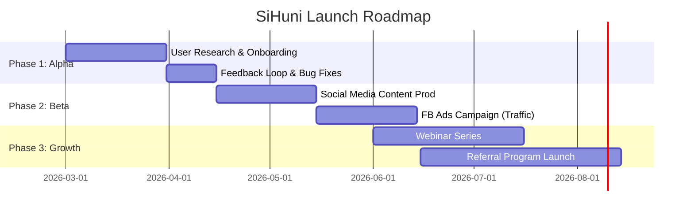

# Marketing Strategy & Go-to-Market Document - SiHuni

**Version:** 1.0
**Last Updated:** 2026-02-22
**Status:** Draft
**Document ID:** DOC-MKT-001

## 1. Executive Summary

**SiHuni (Sistem Huni)** is not just a management tool; it is a **Decision Support System (DSS)** designed to transform traditional "Kosan" (boarding house) management into a data-driven business.

Unlike generic property management software, SiHuni's core differentiator is its **Intelligent Tenant Scoring System** and **OCR-based Automation**, addressing the two biggest pain points for owners: *Tenant Risk* and *Administrative Burden*.

**Core Value Proposition:** "Kelola Kos Lebih Cerdas, Pilih Penghuni Lebih Tepat." (Manage Smarter, Choose Wisely.)

---

## 2. Market Positioning & Personas

### 2.1 Unique Selling Proposition (USP)

| Feature | Competitors (Standard Apps) | SiHuni (DSS Advantage) | Benefit |
| :--- | :--- | :--- | :--- |
| **Tenant Entry** | Manual Typing | **OCR + Auto-Fill** | 90% faster onboarding (FR-1.3) |
| **Selection** | First-Come-First-Serve | **Reliability Scoring** | Reduces bad debt & eviction risks (FR-2.3) |
| **Finance** | Basic Ledger | **Net Income Analytics** | Real-time profitability tracking (FR-5) |
| **Security** | Minimal | **Bank-Grade (AES-256)** | Compliance & Trust (Security Arch) |

### 2.2 Target Audience Personas

#### Primary Persona: "Pak Budi, The Modern Owner"
*   **Profile:** 35-50 years old, owns 2-5 kos locations (20-100 rooms).
*   **Pain Points:**
    *   "I can't track who hasn't paid yet without checking my bank mutation manually."
    *   "I've had tenants who run away without paying or damage the room."
    *   "My admin staff makes too many typos in the ledger."
*   **Motivation:** Wants automation, financial clarity, and peace of mind regarding tenant quality.

#### Secondary Persona: "Mba Siti, The Admin"
*   **Profile:** 20-30 years old, operational staff.
*   **Pain Points:**
    *   Overwhelmed by WhatsApp chat for payment proofs.
    *   Hates typing KTP details manually.
*   **Motivation:** Wants to finish work faster and avoid being blamed for errors.

---

## 3. Pricing Strategy

Based on the "Professional" scope of the PRD, we will adopt a **Freemium -> Tiered Subscription** model to lower the barrier to entry while capturing value from power users.

### 3.1 Pricing Tiers

| Tier | Target | Price | Features |
| :--- | :--- | :--- | :--- |
| **Starter (Free)** | New Owners | **Rp 0** | • Up to 5 Rooms<br>• Basic Tenant Recording<br>• Manual Backup |
| **Pro (Growth)** | Active Owners | **Rp 99k/mo** | • Up to 50 Rooms<br>• **OCR Automation (Unlimited)**<br>• **Tenant Scoring System**<br>• Financial Reports (PDF/Excel) |
| **Business** | Juragan Kos | **Rp 249k/mo** | • Unlimited Rooms<br>• Multi-Staff Access (RBAC)<br>• Priority Support<br>• Custom Analytics |

### 3.2 Value Metric
*   **Primary:** Number of Rooms (Scales with revenue).
*   **Secondary:** Advanced Features (Scoring & OCR) are gated to paid plans to drive conversion.

---

## 4. Marketing Mix (4Ps)

### 4.1 Product
*   **Focus:** Reliability & Speed.
*   **Key "Hook" Feature:** The "Scan KTP" demo. Showing a user scan a KTP and see the form fill instantly + get a "Recommended" score is the "Aha!" moment.

### 4.2 Price
*   Competitive entry (Free) to displace Excel/Notebooks.
*   Affordable Pro tier (less than the cost of 1 day's rent for one room).

### 4.3 Place (Distribution)
*   **Web App (PWA):** Accessible from any device without installation friction.
*   **Direct Sales:** For owners with >50 rooms (High touch).

### 4.4 Promotion (Channels)
*   **Community:** Facebook Groups ("Komunitas Pengusaha Kos Indonesia").
*   **Content:** TikTok/Reels showing "Day in the life of a Kos Owner" (Manual vs SiHuni).
*   **Partnerships:** Local contractors or property agents.

---

## 5. Go-to-Market (GTM) Strategy

### Phase 1: Soft Launch (The "Trusted" Alpha)
*   **Timeline:** Months 1-2
*   **Goal:** Validate the *Scoring Algorithm* and *OCR Accuracy*.
*   **Strategy:**
    *   Invite 10-20 local owners for free "Lifetime Pro" access.
    *   Personal onboarding (White-glove service).
    *   **Metric:** Net Promoter Score (NPS) > 8.

### Phase 2: Digital Beta (The "Efficiency" Campaign)
*   **Timeline:** Months 3-4
*   **Goal:** Acquire first 100 active users.
*   **Content Angle:** "Stop Typing KTPs Manually."
*   **Channels:**
    *   Facebook Ads targeting "Real Estate Interest" + "Small Business Admin".
    *   Google Search Ads: "Aplikasi manajemen kos gratis".

### Phase 3: Public Growth (The "Professional" Scale)
*   **Timeline:** Month 5+
*   **Goal:** Conversion to Paid.
*   **Strategy:**
    *   Release "Tenant Blacklist" (anonymized data sharing) as a network effect feature.
    *   Webinars on "Legal Aspects of Kos Management" (Compliance).

### 5.1 Launch Timeline



---

## 6. Acquisition Funnel

We visualize the user journey from "Awareness" to "Loyal Advocate".

```mermaid
flowchart TD
    subgraph Awareness
    A[Social Media / Ads] -->|Click| B(Landing Page)
    end
    
    subgraph Consideration
    B -->|View Demo| C{Try Free?}
    C -->|No| D[Retargeting Ads]
    D --> B
    end
    
    subgraph Conversion
    C -->|Yes| E[Sign Up (Free Tier)]
    E -->|Onboarding| F[First Room Added]
    F -->|Aha Moment| G[Use OCR / View Score]
    end
    
    subgraph Retention & Monetization
    G --> H{Reach 5 Room Limit}
    H -->|Upgrade| I[Pro Subscription]
    H -->|Stay Free| J[Nurture Email Sequence]
    I --> K[Referral / Advocate]
    end
```

---

## 7. Content Strategy

To build authority, we will produce content that solves broader problems for owners, not just software issues.

| Topic Category | Content Idea | Format | Goal |
| :--- | :--- | :--- | :--- |
| **Operational** | "How to verify a potential tenant's background legally." | Blog/PDF Guide | Trust / SEO |
| **Financial** | "Calculating ROI for AC vs Non-AC rooms." | Calculator Tool | Lead Gen |
| **Technical** | "Why Excel is dangerous for storing KTP data." | LinkedIn Article | Fear/Security |
| **Product** | "Watch SiHuni auto-fill a form in 3 seconds." | 15s Video (Shorts) | Awareness |

---

## 8. Key Metrics (KPIs)

1.  **CAC (Customer Acquisition Cost):** Target < Rp 50.000 per Free Signup.
2.  **Activation Rate:** % of signups who add at least 1 tenant within 24 hours. Target > 40%.
3.  **Conversion Rate:** % of Free users upgrading to Pro within 3 months. Target > 5%.
4.  **Churn Rate:** < 2% Monthly for Pro users.

## 9. Assumptions & Constraints
*   **Assumption:** Owners value time savings (OCR) enough to pay, or fear bad tenants enough to pay for Scoring.
*   **Constraint:** Marketing budget is limited; reliance on organic/community growth is high initially.
*   **Constraint:** Education level of some owners (technological literacy) requires extremely simple UI/UX (aligned with UI Doc).

