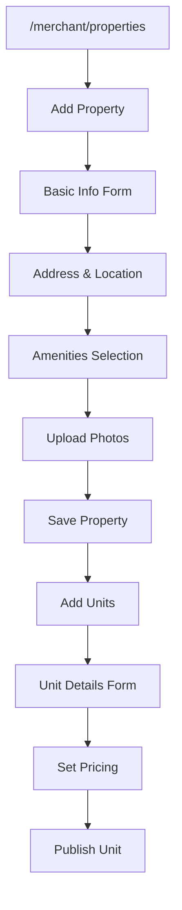
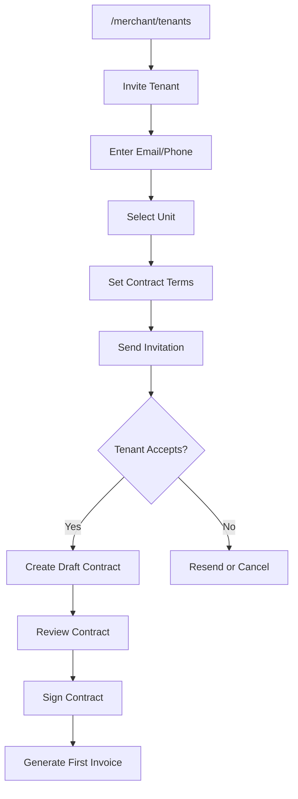
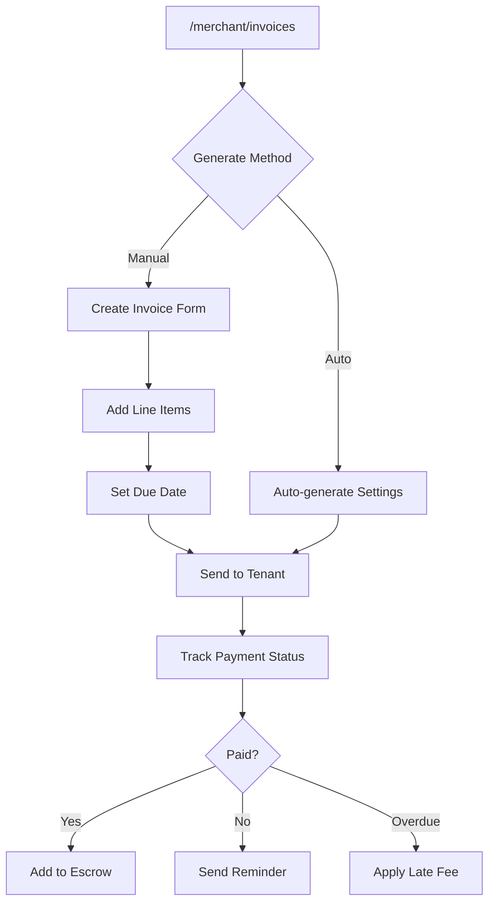
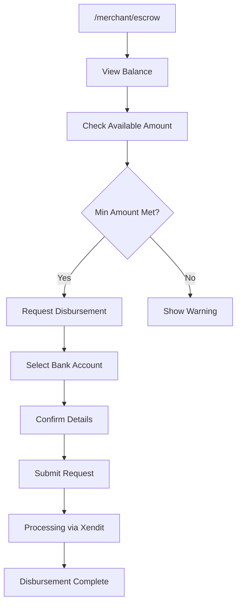

# UI/UX Flow Feedback: Merchant Module

## 📋 Overview

Modul merchant menangani pengelolaan properti, unit, tenant, kontrak, pembayaran, dan disbursement untuk pemilik/pengelola properti.

---

## 🗺️ User Journey Map

```
┌─────────────────────────────────────────────────────────────────────────────┐
│                          MERCHANT USER JOURNEY                               │
├─────────────────────────────────────────────────────────────────────────────┤
│                                                                              │
│  [Dashboard] ◄──────────────────────────────────────────────────────────┐   │
│      │                                                                   │   │
│      ├──► [Properties] ──► [Add Property] ──► [Manage Units]            │   │
│      │         │                                                         │   │
│      │         └──► [Units] ──► [Add Unit] ──► [Assign Tenant]          │   │
│      │                                                                   │   │
│      ├──► [Tenants] ──► [Invite Tenant] ──► [Create Contract]           │   │
│      │                                                                   │   │
│      ├──► [Contracts] ──► [New Contract] ──► [E-Signature] ──────────┘   │
│      │                                                                   │   │
│      ├──► [Invoices] ──► [Generate Invoice] ──► [Track Payment]         │   │
│      │                                                                   │   │
│      ├──► [Payments] ──► [View History] ──► [Reconciliation]            │   │
│      │                                                                   │   │
│      ├──► [Escrow] ──► [View Balance] ──► [Request Disbursement]        │   │
│      │                                                                   │   │
│      ├──► [Maintenance] ──► [Assign Vendor] ──► [Track Progress]        │   │
│      │                                                                   │   │
│      ├──► [Move-outs] ──► [Schedule Inspection] ──► [Process Refund]    │   │
│      │                                                                   │   │
│      ├──► [Reports] ──► [Generate Report] ──► [Export Data]             │   │
│      │                                                                   │   │
│      ├──► [Billing] ──► [Subscription] ──► [Payment History]            │   │
│      │                                                                   │   │
│      └──► [Settings] ──► [Profile] ──► [Bank Accounts] ──► [Notifications]│
│                                                                              │
└─────────────────────────────────────────────────────────────────────────────┘
```

---

## 🔄 Navigation Flow Analysis

### Sidebar Navigation Structure
```
├── Dashboard
├── Property Management
│   ├── Properties
│   └── Units
├── Tenant Management
│   ├── Tenants
│   ├── Contracts
│   └── Move-outs
├── Financial
│   ├── Invoices
│   ├── Payments
│   └── Escrow
├── Operations
│   ├── Maintenance
│   └── Reports
├── Account
│   ├── Billing
│   ├── Referrals
│   └── Settings
```

### Navigation Issues
| Issue | Impact | Recommendation |
|-------|--------|----------------|
| Deep nesting untuk property → units → tenant | Many clicks | Add breadcrumb navigation |
| No quick actions dari dashboard | Slower workflow | Add floating action menu |
| Escrow buried in sidebar | Important feature hidden | Promote to dashboard widget |

---

## 🎯 Critical User Flows

### 1. Property Setup Flow


### 2. Tenant Onboarding Flow


### 3. Invoice & Payment Flow


### 4. Disbursement Flow


---

## ⚠️ Issues & Recommendations

### High Severity

| ID | Issue | Current State | Impact | Recommendation | Status |
|----|-------|---------------|--------|----------------|--------|
| MER-H01 | Property setup wizard tidak jelas | Multi-step tanpa progress | User dropout | Add visual step indicator dengan save progress | ✅ Fixed |
| MER-H02 | Bulk invoice generation missing | One-by-one manual | Time consuming | Add bulk generation dengan filter | ✅ Fixed |
| MER-H03 | No undo untuk delete actions | Permanent delete | Data loss | Implement soft delete + undo toast | ✅ Fixed |

### Medium Severity

| ID | Issue | Current State | Impact | Recommendation | Status |
|----|-------|---------------|--------|----------------|--------|
| MER-M01 | Tenant invitation link expiry tidak shown | Hidden info | Confusion | Display expiry date on link | ✅ Fixed |
| MER-M02 | Escrow disbursement schedule unclear | Text only | Hard to plan | Add visual calendar view | ✅ Fixed |
| MER-M03 | Report export loading terlalu lama | No background job | UI freeze | Implement async export with notification | ✅ Fixed |
| MER-M04 | Contract template tidak bisa saved | Create from scratch | Repetitive work | Add template save & reuse | ✅ Fixed |

### Low Severity

| ID | Issue | Current State | Impact | Recommendation | Status |
|----|-------|---------------|--------|----------------|--------|
| MER-L01 | Unit photo reorder tidak drag-drop | Delete & re-upload | Minor friction | Add drag-drop reorder | ✅ Fixed |
| MER-L02 | Dashboard chart tidak interactive | Static display | Less insight | Add drill-down capability | ✅ Fixed |

---

## 📱 Mobile UX Assessment

### Desktop-First Design Issues
| Issue | Impact | Recommendation |
|-------|--------|----------------|
| Complex tables | Horizontal scroll | Convert to card layout on mobile |
| Multi-column forms | Cramped layout | Stack columns on mobile |
| Sidebar navigation | Takes screen space | Implement hamburger menu |

### Mobile Navigation
| Aspect | Score | Notes |
|--------|-------|-------|
| Responsive Layout | 6/10 | Desktop-optimized |
| Touch Targets | 7/10 | Adequate but could improve |
| Data Tables | 4/10 | Need mobile redesign |
| Forms | 6/10 | Long forms on mobile |

### Recommendations
- [ ] Redesign tables as cards for mobile
- [ ] Add mobile-specific quick actions
- [ ] Implement collapsible form sections
- [ ] Add swipe gestures for common actions

---

## ♿ Accessibility Assessment

| Criteria | Status | Notes |
|----------|--------|-------|
| ARIA Labels | ⚠️ Partial | Charts missing descriptions |
| Keyboard Navigation | ✅ Good | Forms navigable |
| Color Contrast | ✅ Good | Meets standards |
| Screen Reader | ⚠️ Partial | Tables need headers |
| Focus Management | ⚠️ Partial | Modal focus trap incomplete |

### Recommendations
- [ ] Add ARIA descriptions to charts
- [ ] Implement proper table headers
- [ ] Complete focus trap for modals
- [ ] Add skip navigation links

---

## ⚡ Performance UX

### Loading States
| Page | Current State | Recommendation |
|------|---------------|----------------|
| Dashboard | Skeleton + Charts | ✅ Good |
| Properties List | Spinner | Add skeleton cards |
| Tenant List | Spinner | Add skeleton table |
| Reports | Spinner | Add skeleton + cancel option |

### Data Pagination
| Table | Current | Recommendation |
|-------|---------|----------------|
| Tenants | Client pagination | Implement server pagination |
| Invoices | Client pagination | Implement server pagination |
| Payments | Client pagination | Implement infinite scroll option |

### Caching Strategy
| Data | Cached | Recommendation |
|------|--------|----------------|
| Properties | ❌ | Cache with invalidation |
| Dashboard Stats | ❌ | Cache for 5 minutes |
| User Profile | ✅ | Good |

---

## ✅ Summary Checklist

| Category | Critical | High | Medium | Low | Total |
|----------|----------|------|--------|-----|-------|
| Issues Found | 0 | 3 | 4 | 2 | 9 |
| Fixed | 0 | 3 | 4 | 2 | 9 |
| In Progress | 0 | 0 | 0 | 0 | 0 |
| Pending | 0 | 0 | 0 | 0 | 0 |

---

## 📝 Action Items

1. [x] **MER-H01**: Add property setup wizard with progress - `PropertySetupWizard.tsx`
2. [x] **MER-H02**: Implement bulk invoice generation - `BulkInvoiceGenerator.tsx`
3. [x] **MER-H03**: Add soft delete with undo - `SoftDeleteManager.tsx`
4. [x] **MER-M01**: Display invitation link expiry - `InvitationLinkExpiry.tsx`
5. [x] **MER-M02**: Add disbursement calendar view - `DisbursementCalendar.tsx`
6. [x] **MER-M03**: Implement async report export - `AsyncReportExport.tsx`
7. [x] **MER-M04**: Add contract template save - `ContractTemplateManager.tsx`
8. [x] **MER-L01**: Implement drag-drop photo reorder - `DragDropPhotoReorder.tsx`
9. [x] **MER-L02**: Add interactive dashboard charts - `InteractiveDashboardCharts.tsx`

---

*Last Updated: 2025-01-26*
*Reviewed By: System*
