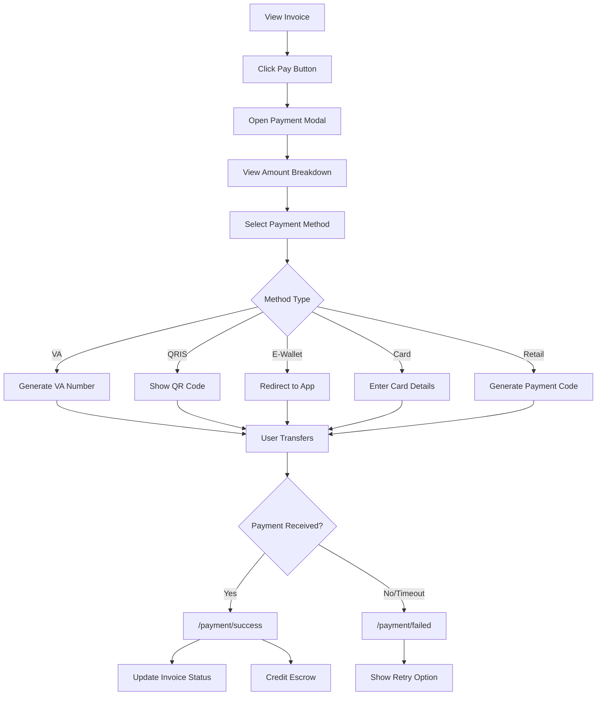
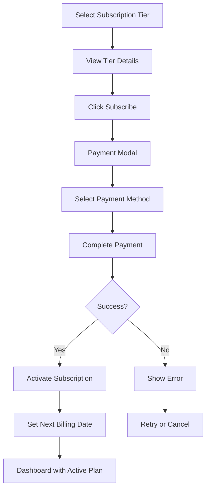
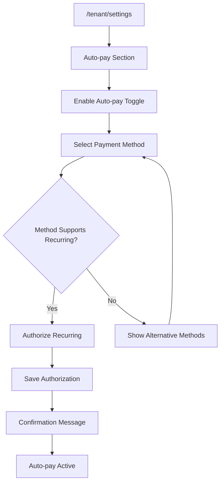
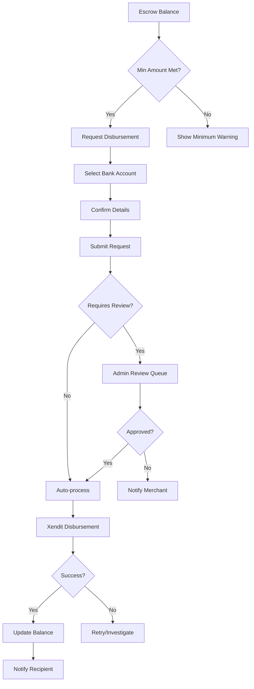
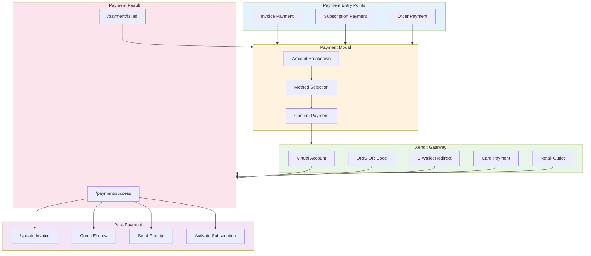
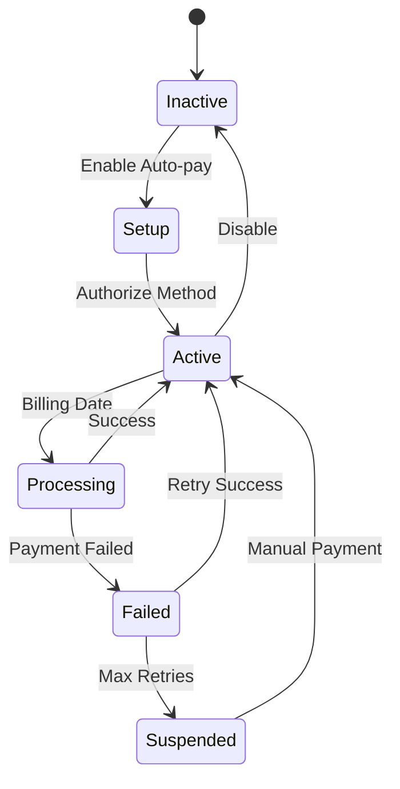

# UI/UX Flow Feedback: Payment Module

## 📋 Overview

Modul payment menangani seluruh flow pembayaran termasuk invoice payment, subscription billing, auto-pay setup, dan disbursement processing melalui integrasi Xendit.

---

## 🗺️ User Journey Map

```
┌─────────────────────────────────────────────────────────────────────────────┐
│                          PAYMENT USER JOURNEY                                │
├─────────────────────────────────────────────────────────────────────────────┤
│                                                                              │
│  [Invoice/Subscription] ──► [Payment Modal] ──► [Xendit Gateway]            │
│                                    │                    │                    │
│                                    │                    ▼                    │
│                                    │            [Complete Payment]           │
│                                    │                    │                    │
│                                    │         ┌─────────┴─────────┐          │
│                                    │         ▼                   ▼          │
│                                    │   [/payment/success]  [/payment/failed]│
│                                    │         │                   │          │
│                                    │         ▼                   ▼          │
│                                    │   [Update Escrow]    [Retry Option]    │
│                                    │                                        │
│                                    ▼                                        │
│                            [Auto-pay Setup]                                 │
│                                    │                                        │
│                                    ▼                                        │
│                            [Save Payment Method]                            │
│                                    │                                        │
│                                    ▼                                        │
│                            [Recurring Billing]                              │
│                                                                              │
└─────────────────────────────────────────────────────────────────────────────┘
```

---

## 🔄 Payment Method Options

### Available Payment Methods (via Xendit)
| Method | Type | Status | Notes |
|--------|------|--------|-------|
| Virtual Account | Bank Transfer | ✅ Active | BCA, Mandiri, BNI, BRI, etc |
| QRIS | QR Payment | ✅ Active | Universal QR |
| E-Wallet | Digital Wallet | ✅ Active | OVO, DANA, ShopeePay, GoPay |
| Credit Card | Card | ✅ Active | Visa, Mastercard |
| Retail Outlet | Cash | ✅ Active | Alfamart, Indomaret |

### Payment Method Selection UX
| Issue | Impact | Recommendation |
|-------|--------|----------------|
| Method icons small | Hard to identify | Increase icon size |
| No saved method indicator | User re-selects each time | Remember last used |
| Processing fees not shown upfront | Surprise at checkout | Show fee breakdown before confirmation |

---

## 🎯 Critical User Flows

### 1. Invoice Payment Flow


### 2. Subscription Payment Flow


### 3. Auto-pay Setup Flow


### 4. Disbursement Flow (Merchant/Vendor)


---

## ⚠️ Issues & Recommendations

### High Severity

| ID | Issue | Current State | Impact | Recommendation |
|----|-------|---------------|--------|----------------|
| PAY-H01 | No payment confirmation dialog | Direct submit | Accidental payments | Add confirmation with amount review |
| PAY-H02 | Failed payment no quick retry | Must restart flow | User dropout | Add inline retry button |
| PAY-H03 | Auto-pay setup confusing | Too many steps | Low adoption | Simplify to 2-step wizard |

### Medium Severity

| ID | Issue | Current State | Impact | Recommendation |
|----|-------|---------------|--------|----------------|
| PAY-M01 | Payment method not remembered | Re-select each time | Friction | Save last used method |
| PAY-M02 | VA expiry unclear | Small text | Missed payments | Show prominent countdown |
| PAY-M03 | Subscription downgrade impact unclear | Generic warning | Confusion | Show specific feature loss |

### Low Severity

| ID | Issue | Current State | Impact | Recommendation |
|----|-------|---------------|--------|----------------|
| PAY-L01 | No payment history export | View only | Minor inconvenience | Add CSV/PDF export |

---

## 📱 Mobile Payment UX

### Current State
| Aspect | Score | Notes |
|--------|-------|-------|
| Modal Responsiveness | 8/10 | Good on mobile |
| QR Display | 7/10 | Could be larger |
| E-Wallet Deep Link | 9/10 | Works well |
| Form Input | 7/10 | Keyboard types correct |

### Mobile-Specific Issues
| Issue | Impact | Recommendation |
|-------|--------|----------------|
| Payment modal scroll | Some content cut off | Ensure full visibility |
| QRIS QR too small | Hard to scan | Make full-width on mobile |
| Card form autocomplete | Not working consistently | Add autocomplete attributes |

### Recommendations
- [ ] Optimize QR code size for mobile
- [ ] Add biometric payment confirmation
- [ ] Implement Apple Pay / Google Pay
- [ ] Add payment status push notifications

---

## ♿ Accessibility Assessment

| Criteria | Status | Notes |
|----------|--------|-------|
| ARIA Labels | ⚠️ Partial | Payment buttons need labels |
| Keyboard Navigation | ✅ Good | Modal focusable |
| Color Contrast | ✅ Good | Success/error colors clear |
| Screen Reader | ⚠️ Partial | Status updates not announced |
| Form Labels | ✅ Good | All inputs labeled |

### Recommendations
- [ ] Add aria-live for payment status updates
- [ ] Announce amount before confirmation
- [ ] Add keyboard shortcut for quick pay
- [ ] Improve error message clarity

---

## ⚡ Performance UX

### Loading States
| Action | Current State | Recommendation |
|--------|---------------|----------------|
| Opening Modal | Spinner | Skeleton with amount |
| Generating VA | Spinner | Progress with message |
| Processing Payment | Spinner | Steps indicator |
| Webhook Confirmation | Polling | WebSocket for instant |

### Payment Status Polling
| Current | Issue | Recommendation |
|---------|-------|----------------|
| 5-second interval | Slow feedback | Use Supabase Realtime |
| Max 5 minutes | May timeout | Add "check manually" option |

### Error Handling
| Error Type | Current | Recommendation |
|------------|---------|----------------|
| Network Error | Toast | Inline with retry |
| Payment Failed | Redirect | Stay in modal with options |
| Timeout | Generic message | Specific guidance |

---

## 📊 Flow Diagram



---

## 🔔 Payment Notifications

| Event | In-App | Push | Email | WhatsApp | SMS |
|-------|--------|------|-------|----------|-----|
| Payment Received | ✅ | ❌ | ✅ | ❌ | ❌ |
| Payment Failed | ✅ | ❌ | ✅ | ❌ | ❌ |
| VA Generated | ✅ | ❌ | ✅ | ❌ | ❌ |
| VA Expiring | ✅ | ❌ | ✅ | ❌ | ❌ |
| Auto-pay Executed | ✅ | ❌ | ✅ | ❌ | ❌ |
| Auto-pay Failed | ✅ | ❌ | ✅ | ❌ | ❌ |
| Disbursement Complete | ✅ | ❌ | ✅ | ❌ | ❌ |

### Recommendations
- [ ] Add push notifications for payment status
- [ ] Enable WhatsApp for payment reminders
- [ ] Add SMS fallback for critical alerts

---

## 💰 Fee Transparency

### Current Fee Display
| Stage | Shown | Recommendation |
|-------|-------|----------------|
| Invoice View | Base amount only | Show with platform fee |
| Method Selection | No fee comparison | Show fee per method |
| Confirmation | Total with fees | ✅ Good |
| Receipt | Full breakdown | ✅ Good |

### Recommended Fee Breakdown Component
```
┌─────────────────────────────────┐
│ Payment Breakdown               │
├─────────────────────────────────┤
│ Rent Amount        Rp 5,000,000 │
│ Late Fee           Rp   100,000 │
├─────────────────────────────────┤
│ Subtotal           Rp 5,100,000 │
│ Platform Fee (2%)  Rp   102,000 │
│ Payment Fee        Rp    10,000 │
├─────────────────────────────────┤
│ Total              Rp 5,212,000 │
└─────────────────────────────────┘
```

---

## 🔄 Recurring Payment Management

### Auto-pay States


### Issues with Current Flow
| Issue | Impact | Recommendation |
|-------|--------|----------------|
| No method preview before auth | Uncertainty | Show method details first |
| Failed auto-pay notification delayed | Missed window | Immediate alert |
| No easy method update | Friction | Quick change link in notification |

---

## ✅ Summary Checklist

| Category | Critical | High | Medium | Low | Total |
|----------|----------|------|--------|-----|-------|
| Issues Found | 0 | 3 | 3 | 1 | 7 |
| Fixed | 0 | 0 | 0 | 0 | 0 |
| In Progress | 0 | 0 | 0 | 0 | 0 |
| Pending | 0 | 3 | 3 | 1 | 7 |

---

## 📝 Action Items

1. [ ] **PAY-H01**: Add payment confirmation dialog
2. [ ] **PAY-H02**: Implement inline retry for failed payments
3. [ ] **PAY-H03**: Simplify auto-pay setup wizard
4. [ ] **PAY-M01**: Remember last used payment method
5. [ ] **PAY-M02**: Add prominent VA expiry countdown
6. [ ] **PAY-M03**: Show specific impact of subscription downgrade
7. [ ] **PAY-L01**: Add payment history export

---

*Last Updated: 2025-01-26*
*Reviewed By: System*
