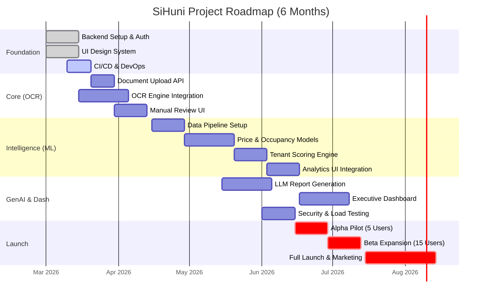

# Project Roadmap: SiHuni (Sistem Huni)

**Version:** 1.0
**Date:** 2026-02-22
**Status:** Strategic Planning
**Timeline:** 6 Months (Development to Full Launch)
**Alignment:** [PRD v2.0](../PRD_DSS_Manajemen_Kosan_v2_Professional.md), [UI/UX Docs v1.0](../UIUX_Design_Documentation_SiHuni.md)

---

## 1. Executive Summary

This roadmap outlines the strategic execution plan for **SiHuni**, a Boarding House Management System with Integrated DSS. The plan covers a **6-month timeline** from foundational infrastructure to full market launch, targeting **20 pilot properties**.

### Strategic Goals
1.  **Operational Excellence:** Reduce document processing time to **<2 minutes** (Month 3).
2.  **Risk Mitigation:** Lower payment default risk by **20-30%** (Month 4).
3.  **Financial Growth:** Achieve **8-15% revenue optimization** (Month 6).

---

## 2. Phasing & Milestones

The project is divided into **6 distinct sprints/months**, each with clear deliverables and acceptance criteria mapped to the PRD.

### Month 1: Foundation & Infrastructure
**Focus:** Architecture, Security, and Design System.

| Area | Key Deliverables | PRD Ref | UI/UX Ref |
|------|------------------|---------|-----------|
| **Backend** | • Setup NestJS Monorepo & PostgreSQL Schema • Implement Auth (JWT, RBAC) • Setup AWS S3 & MinIO | NFR-1, NFR-2 | - |
| **Frontend** | • Initialize React Vite Project • Implement Design Tokens (Colors, Typography) • Build Atomic Components (Buttons, Inputs) | - | Sec 4, 5 |
| **DevOps** | • Setup CI/CD Pipeline (GitHub Actions) • Configure Dev/Staging Environments | NFR-5 | - |
| **Product** | • Finalize API Specification • User Story Mapping | - | - |

**Milestone:** **System Core Live** (Auth working, DB connected, UI Library ready).

### Month 2: Core Operations & OCR Engine
**Focus:** Digitalization (FR-1) and Basic Management.

| Area | Key Deliverables | PRD Ref | UI/UX Ref |
|------|------------------|---------|-----------|
| **Backend** | • Document Upload API (Multipart) • Tesseract OCR Integration • Validation Logic & Regex Parsers | FR-1.1, FR-1.3 | - |
| **Frontend** | • Document Upload UI (Drag & Drop) • Manual Review Interface (Split View) • Tenant & Room Management CRUD | FR-1.5 | Sec 11 |
| **AI/ML** | • OCR Pre-processing Pipeline (OpenCV) • Document Classification Model (Random Forest) | FR-1.2 | - |

**Milestone:** **Digitalization Module Alpha** (Can upload, extract, and save tenant data).
**KPI Target:** OCR Processing Time < 3 mins.

### Month 3: Intelligence Layer (ML Analytics)
**Focus:** Decision Support Models (FR-2).

| Area | Key Deliverables | PRD Ref | UI/UX Ref |
|------|------------------|---------|-----------|
| **Data** | • Historical Data Ingestion Pipeline • Feature Engineering (Seasonality, Location) | FR-2 | - |
| **ML Ops** | • Price Optimization Model (XGBoost) • Occupancy Forecasting (ARIMA) • Tenant Scoring Engine | FR-2.1, 2.2, 2.3 | - |
| **Frontend** | • Analytics Charts (Recharts/Chart.js) • Risk Score Visualization (Guages) | FR-2.3 | Sec 3.1 (Charts) |

**Milestone:** **Intelligence Beta** (Models generating predictions).
**KPI Target:** OCR Processing Time < 2 mins (Optimized).

### Month 4: GenAI & Interactive Dashboard
**Focus:** User Experience & Interpretability (FR-3, FR-4).

| Area | Key Deliverables | PRD Ref | UI/UX Ref |
|------|------------------|---------|-----------|
| **GenAI** | • LLM Integration (OpenAI/Local Llama) • Automated Monthly Report Generation • "What-If" Analysis Interface | FR-3.1, 3.2 | - |
| **Frontend** | • Executive Dashboard (Widgets, KPIs) • Natural Language Explanation UI | FR-4.1 | Sec 6 (Grid) |
| **QA** | • Security Audit (Penetration Testing) • Performance Testing (Load Testing) | NFR-2, NFR-3 | - |

**Milestone:** **Feature Complete** (All modules integrated).
**KPI Target:** ML Prediction MAPE < 10%; Default Risk Reduction -20%.

### Month 5: Pilot Launch (Alpha/Beta)
**Focus:** Real-world Validation & Stabilization.

| Area | Key Deliverables | PRD Ref | UI/UX Ref |
|------|------------------|---------|-----------|
| **Launch** | • **Alpha Launch:** 5 Friendly Kosan Owners • Onboarding & Training Sessions | - | - |
| **Product** | • Bug Bashing & UX Refinement • Model Retraining with Real Data | FR-2.4 | - |
| **Growth** | • **Beta Launch:** Expansion to 15 Kosan • Feedback Loop Implementation | - | - |

**Milestone:** **Operational Stability** (System running in production).
**KPI Target:** User Adoption > 80%.

### Month 6: Full Launch & Optimization
**Focus:** Scale & Revenue Realization.

| Area | Key Deliverables | PRD Ref | UI/UX Ref |
|------|------------------|---------|-----------|
| **Launch** | • **Grand Launch:** 20+ Kosan • Marketing Campaign (Owned/Shared Channels) | - | - |
| **Business** | • Revenue Impact Analysis • Case Study Creation | - | - |
| **Future** | • Roadmap v2 Planning (Mobile App?) | - | - |

**Milestone:** **Market Success**.
**KPI Target:** Revenue Optimization +8-15%.

---

## 3. Timeline Visualization (Gantt)

---

## 4. Resource Allocation

To achieve this roadmap, the following team composition is assumed:

| Role | Count | Responsibilities | Skill Set |
|------|-------|------------------|-----------|
| **Tech Lead / Backend** | 1 | Architecture, API, Security, DevOps | NestJS, PostgreSQL, AWS, Docker |
| **Frontend Engineer** | 1 | UI Implementation, Dashboard, Interactions | React, Vite, Tailwind, Recharts |
| **AI/ML Engineer** | 1 | OCR Tuning, Model Training, LLM Integration | Python, TensorFlow/PyTorch, Tesseract |
| **Product/QA** | 1 | Requirements, Testing, User Onboarding | Manual Testing, Agile, Communication |

---

## 5. Risk Management

| Risk Category | Risk Description | Probability | Impact | Mitigation Strategy |
|---------------|------------------|-------------|--------|---------------------|
| **Technical** | OCR accuracy low for handwriting | High | High | Fallback to manual review (FR-1.5); Incentivize typed documents. |
| **Technical** | ML models lack sufficient historical data | Medium | High | Use "Cold Start" heuristics; Import external market data. |
| **Operational** | Users resistant to digital process | Medium | Medium | Simple UI (UI/UX Principle 3); "White Glove" onboarding. |
| **Security** | PII Leakage (KTP Data) | Low | Critical | AES-256 Encryption (NFR-2); Strict RBAC; Regular Audits. |
| **Timeline** | GenAI latency too high for reports | Medium | Low | Async processing (BullMQ); Cache generated reports. |

---

## 6. Launch Strategy (ORB Framework)

Based on the **Launch Strategy Skill**, we will utilize a phased approach leveraging Owned, Rented, and Borrowed channels.

### Phase 1: Internal/Alpha (Month 4)
- **Goal:** Validate core functionality and fix critical bugs.
- **Channel:** Direct 1-on-1 invitations to 5 friendly owners (**Owned**).
- **Tactic:** "White Glove" onboarding – developers visit locations to assist setup.

### Phase 2: Beta (Month 5)
- **Goal:** Test scale and gather testimonials.
- **Channel:** Waitlist from landing page (**Owned**).
- **Tactic:** Offer 3 months free in exchange for detailed feedback and case study participation.

### Phase 3: Full Launch (Month 6)
- **Goal:** Market penetration.
- **Channels:**
    - **Borrowed:** Partner with local property agent associations.
    - **Rented:** Targeted FB/IG Ads for "Juragan Kos" demographics.
    - **Owned:** Email blast to collected leads; Webinar "Cara Optimalkan Profit Kosan".

---

## 7. Requirement Traceability Matrix

| Requirement | Description | Roadmap Phase | Delivery Month |
|-------------|-------------|---------------|----------------|
| **FR-1** | Digitalisasi Dokumen (OCR) | Phase 2 | Month 2 |
| **FR-2** | ML Analytics (Price, Occupancy) | Phase 3 | Month 3 |
| **FR-3** | GenAI Reporting | Phase 4 | Month 4 |
| **FR-4** | Dashboard & Reporting | Phase 4 | Month 4 |
| **NFR-1** | Scalability (20+ Kosan) | Phase 1/5 | Month 1/5 |
| **NFR-2** | Security (Encryption) | Phase 1 | Month 1 |
| **NFR-3** | Performance (<2s load) | Phase 4 | Month 4 |

---

## 8. Assumptions & Constraints

### Assumptions
1.  **Data Availability:** Pilot users will provide at least 12 months of historical manual records for ML training.
2.  **API Costs:** Budget allows for OpenAI API usage (or equivalent) for GenAI features.
3.  **Device:** Users have access to a smartphone with a camera for document scanning.

### Constraints
1.  **Budget:** Development team is fixed at 4 members.
2.  **Compliance:** Must adhere to Indonesian PDP (Personal Data Protection) regulations.
3.  **Timeline:** Hard deadline for Pilot Launch in Month 5 due to academic calendar (new semester).
