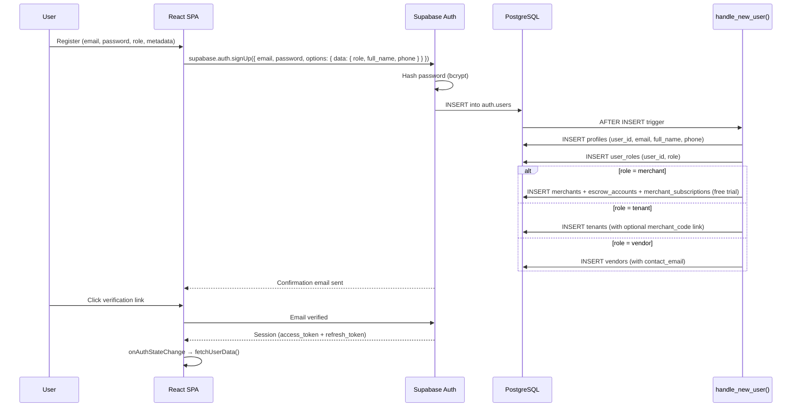
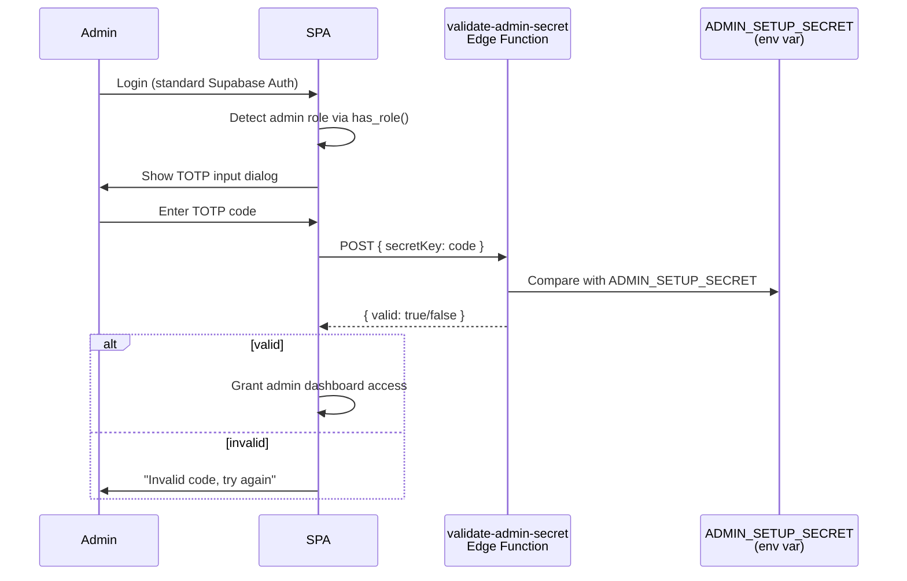
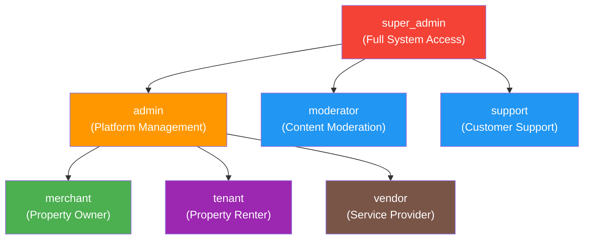
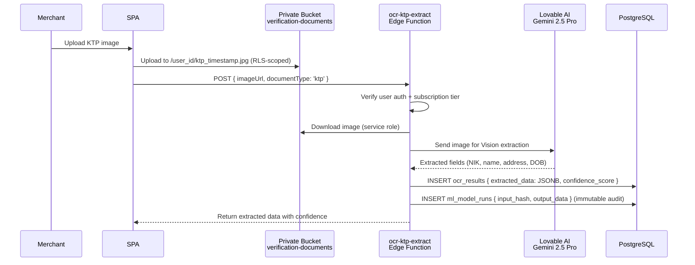
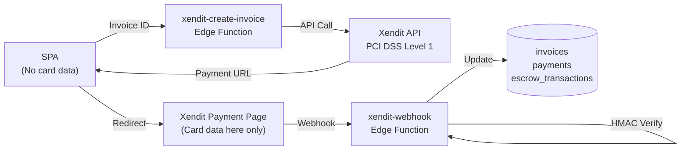

# Security Architecture Documentation

> **SiHuni Platform — Security Architecture v3.0 (DSS Edition)**
>
> Version: 3.0 | Status: Production Ready | Date: 22 Februari 2026
>
> Compliance: UU PDP (Indonesia), OWASP ASVS Level 2, PCI-DSS (Xendit-delegated)
>
> Classification: CONFIDENTIAL
>
> Cross-references: [`database-schema.md`](./database-schema.md) · [`backend-architecture.md`](./backend-architecture.md) · [`deployment-infrastructure.md`](./deployment-infrastructure.md) · [`api-specification.md`](./api-specification.md) · [`development-standards.md`](./development-standards.md)

---

## Table of Contents

1. [Security Principles & Compliance](#1-security-principles--compliance)
2. [Authentication Architecture](#2-authentication-architecture)
3. [Admin 2FA (TOTP)](#3-admin-2fa-totp)
4. [Authorization: RBAC + RLS](#4-authorization-rbac--rls)
5. [Row Level Security Deep-Dive](#5-row-level-security-deep-dive)
6. [Data Classification & Protection](#6-data-classification--protection)
7. [Application Security (OWASP)](#7-application-security-owasp)
8. [Edge Function Security](#8-edge-function-security)
9. [DSS & AI Security](#9-dss--ai-security)
10. [Payment Security (PCI)](#10-payment-security-pci)
11. [Audit Logging & Monitoring](#11-audit-logging--monitoring)
12. [Incident Response](#12-incident-response)

---

## 1. Security Principles & Compliance

### 1.1 Core Security Principles (CIA + P)

| Principle | Implementation |
|-----------|---------------|
| **Confidentiality** | 215+ RLS policies enforce data isolation per role; PII (KTP, NIK) stored in JSONB with scoped access |
| **Integrity** | `ml_model_runs` is immutable (INSERT + SELECT only); `audit_logs` has no UPDATE/DELETE policy; financial amounts use `numeric` (not float) |
| **Availability** | Lovable Cloud serverless auto-scaling; Supavisor connection pooling; CDN for static assets |
| **Privacy** | UU PDP compliance: consent-based tenant scoring, data minimization in OCR, right to erasure support |

### 1.2 Compliance Mapping

| Regulation | Requirement | SiHuni Implementation |
|------------|-------------|-----------------------|
| **UU PDP (Indonesia)** | Data Subject Rights | Profile deletion cascades via `ON DELETE CASCADE`; tenant can view own risk score |
| **UU PDP (Indonesia)** | Data Minimization | OCR extracts only required fields; raw KTP images in private bucket with RLS |
| **UU PDP (Indonesia)** | Consent Management | Explicit opt-in for tenant scoring; `consent_given` flag on DSS operations |
| **OWASP ASVS L2** | Session Management | Supabase Auth managed JWT; HTTPOnly refresh tokens; `onAuthStateChange` listener |
| **OWASP ASVS L2** | Input Validation | Zod schemas on all form inputs; DOMPurify for user-generated HTML content |
| **PCI-DSS** | Payment Security | 100% delegated to Xendit (PCI DSS Level 1 certified); no card data stored |

### 1.3 Security Architecture Overview

```mermaid
graph TB
    subgraph "Client Layer"
        SPA["React SPA<br/>DOMPurify + Zod"]
    end

    subgraph "Auth Layer"
        Auth["Supabase Auth<br/>JWT + bcrypt<br/>Email Verification"]
        TOTP["Admin 2FA<br/>TOTP (otpauth)"]
    end

    subgraph "API Layer"
        EF["31 Edge Functions<br/>CORS + JWT Verify"]
        DSS["12 DSS Functions<br/>Tier-Gated + AI"]
        WH["Webhook Functions<br/>HMAC Verification"]
    end

    subgraph "Data Layer"
        DB[("PostgreSQL 16<br/>72 Tables<br/>215+ RLS Policies")]
        Storage["Supabase Storage<br/>5 Buckets (2 Private)"]
        Secrets["Lovable Cloud Secrets<br/>9 Encrypted Vars"]
    end

    SPA -->|JWT| Auth
    SPA -->|Authenticated| EF
    SPA -->|Supabase SDK + RLS| DB
    Auth -->|has_role()| DB
    EF -->|Service Role| DB
    DSS -->|Service Role| DB
    WH -->|HMAC Verify| EF
    TOTP -->|validate-admin-secret| EF

    style Auth fill:#e8f5e9,stroke:#388e3c
    style DB fill:#f3e5f5,stroke:#7b1fa2
    style Secrets fill:#fff3e0,stroke:#f57c00
```

---

## 2. Authentication Architecture

### 2.1 Auth Flow



### 2.2 Session Management

| Aspect | Implementation |
|--------|---------------|
| **Access Token** | JWT (HS256), managed by Supabase Auth, short-lived |
| **Refresh Token** | Managed by Supabase Auth (HTTPOnly cookie) |
| **Session Listener** | `onAuthStateChange` set up BEFORE `getSession()` to prevent race conditions |
| **Token Storage** | In-memory (access token); Supabase SDK manages refresh automatically |
| **Email Verification** | Required before login; `emailRedirectTo: window.location.origin` |
| **Password Reset** | `resetPasswordForEmail()` → `/reset-password` route → `updateUser({ password })` |
| **Rate Limiting** | Platform-managed by Supabase Auth (brute-force protection built-in) |

### 2.3 Signup Flow: `handle_new_user()` Trigger

The `handle_new_user()` function is a `SECURITY DEFINER` trigger that executes on `AFTER INSERT` on `auth.users`:

```sql
CREATE OR REPLACE FUNCTION public.handle_new_user()
RETURNS trigger
LANGUAGE plpgsql
SECURITY DEFINER
SET search_path = 'public'
AS $$
DECLARE
    user_role app_role;
BEGIN
    -- Role from metadata, default to 'tenant'
    user_role := COALESCE(
        (NEW.raw_user_meta_data ->> 'role')::app_role,
        'tenant'::app_role
    );

    -- Create profile
    INSERT INTO public.profiles (user_id, email, full_name, phone) VALUES (...);
    
    -- Create role in SEPARATE table (prevents privilege escalation)
    INSERT INTO public.user_roles (user_id, role) VALUES (NEW.id, user_role);
    
    -- Role-specific entity creation (merchant/tenant/vendor)
    ...
END;
$$;
```

**Critical Security Note:** Roles are stored in the separate `user_roles` table, NOT on the `profiles` table. This prevents privilege escalation via profile self-update.

### 2.4 Password Security

| Aspect | Detail |
|--------|--------|
| **Hashing** | bcrypt (managed by Supabase Auth) |
| **Policy** | Platform-managed minimum requirements |
| **Reset Flow** | Email link → `/reset-password` → `supabase.auth.updateUser({ password })` |
| **Brute Force** | Platform-managed rate limiting per IP/email |

---

## 3. Admin 2FA (TOTP)

### 3.1 Architecture

Admin access requires a secondary authentication factor via Time-based One-Time Password (TOTP).



### 3.2 Implementation Details

| Component | Detail |
|-----------|--------|
| **Library** | `otpauth` v9.5.0 (installed in frontend) |
| **Edge Function** | `validate-admin-secret` (verify_jwt = true) |
| **Secret Storage** | `ADMIN_SETUP_SECRET` in Lovable Cloud Secrets |
| **Fallback** | Hardcoded default only for development; production uses env var |
| **Config** | `supabase/config.toml` — JWT verification enabled for this function |

### 3.3 Security Considerations

- TOTP validation happens server-side (edge function), not client-side
- The secret key is stored as an encrypted environment variable
- Failed attempts are logged but currently no lockout (platform-level rate limiting applies)
- Recovery: admin can reset via Lovable Cloud Secrets rotation

---

## 4. Authorization: RBAC + RLS

### 4.1 Role Hierarchy



### 4.2 Role Storage Architecture

```sql
-- Custom enum type
CREATE TYPE public.app_role AS ENUM (
    'super_admin', 'admin', 'moderator', 'support',
    'merchant', 'tenant', 'vendor'
);

-- Separate table (NOT on profiles — prevents privilege escalation)
CREATE TABLE public.user_roles (
    id uuid PRIMARY KEY DEFAULT gen_random_uuid(),
    user_id uuid REFERENCES auth.users(id) ON DELETE CASCADE NOT NULL,
    role app_role NOT NULL,
    UNIQUE (user_id, role)
);

ALTER TABLE public.user_roles ENABLE ROW LEVEL SECURITY;
```

### 4.3 Role Check Functions

Two `SECURITY DEFINER` functions prevent recursive RLS issues:

```sql
-- Check if user has a specific role
CREATE OR REPLACE FUNCTION public.has_role(_user_id uuid, _role app_role)
RETURNS boolean
LANGUAGE sql
STABLE
SECURITY DEFINER
SET search_path = 'public'
AS $$
  SELECT EXISTS (
    SELECT 1 FROM public.user_roles
    WHERE user_id = _user_id AND role = _role
  )
$$;

-- Get user's role (quick lookup)
CREATE OR REPLACE FUNCTION public.get_user_role(_user_id uuid)
RETURNS app_role
LANGUAGE sql
STABLE
SECURITY DEFINER
SET search_path = 'public'
AS $$
  SELECT role FROM public.user_roles
  WHERE user_id = _user_id LIMIT 1
$$;
```

**Why `SECURITY DEFINER`?**
- Executes with the function owner's privileges, bypassing RLS on `user_roles`
- Prevents infinite recursion: RLS policy → `has_role()` → query `user_roles` (which also has RLS) → loop
- `STABLE` annotation allows PostgreSQL to cache results within a transaction
- `SET search_path = 'public'` prevents schema hijacking attacks

### 4.4 Permission Matrix

| Feature | super_admin | admin | moderator | support | merchant | tenant | vendor |
|---------|-------------|-------|-----------|---------|----------|--------|--------|
| **User Management** | Full CRUD | Full CRUD | View | View | — | — | — |
| **Properties** | Full | Full | View | View | Own CRUD | View Public | — |
| **Units** | Full | Full | View | View | Own CRUD | View Linked | — |
| **Contracts** | Full | Full | View | View | Own CRUD | Own Read | — |
| **Invoices** | Full | Full | — | View | Own CRUD | Own Read | — |
| **Payments** | Full | Full | — | View | Own Read | Own Read | — |
| **Financials (Escrow)** | Full | Full | — | — | Own Read | — | — |
| **Maintenance** | Full | Full | — | View | Own CRUD | Own CRUD | Assigned |
| **Forum** | Full | Full | Moderate | — | Author | Author | Author |
| **DSS: OCR** | Full | Full | — | — | Own CRUD | — | — |
| **DSS: Risk Scores** | Full | Full | — | — | Own Read | — | — |
| **DSS: Recommendations** | Full | Full | — | — | Own Manage | — | — |
| **DSS: ML Audit** | Full Read | Full Read | — | — | Own Read | — | — |
| **Marketplace** | Full | Full | — | — | — | Browse/Order | Own CRUD |
| **System Logs** | Full | Read | — | — | — | — | — |

---

## 5. Row Level Security Deep-Dive

### 5.1 RLS Statistics

| Metric | Value |
|--------|-------|
| **Total Tables** | 72 |
| **Tables with RLS** | 72 (100%) |
| **Total Policies** | 215+ (191 core + 24 DSS) |
| **Access Patterns** | 8 distinct patterns |

### 5.2 Eight Access Patterns

#### Pattern 1: Admin Full Access (45+ tables)

```sql
-- Admins can do everything
CREATE POLICY "Admin full access" ON public.properties
FOR ALL TO authenticated
USING (
    public.has_role(auth.uid(), 'admin') OR
    public.has_role(auth.uid(), 'super_admin')
);
```

#### Pattern 2: Merchant Own-Data via JOIN (25+ tables)

```sql
-- Merchant sees own properties via merchant_id JOIN
CREATE POLICY "Merchant manages own properties" ON public.properties
FOR ALL TO authenticated
USING (
    merchant_id IN (
        SELECT id FROM public.merchants WHERE user_id = (SELECT auth.uid())
    )
);
```

**Performance Note:** `(SELECT auth.uid())` wraps the function in a subquery, allowing PostgreSQL to cache the result once per query instead of evaluating per-row.

#### Pattern 3: Tenant Own-Data Direct (15+ tables)

```sql
-- Tenant sees own contracts via direct user_id
CREATE POLICY "Tenant views own contracts" ON public.contracts
FOR SELECT TO authenticated
USING (tenant_user_id = (SELECT auth.uid()));
```

#### Pattern 4: Vendor Own-Data via JOIN (8 tables)

```sql
-- Vendor manages own products
CREATE POLICY "Vendor manages own products" ON public.products
FOR ALL TO authenticated
USING (
    vendor_id IN (
        SELECT id FROM public.vendors WHERE user_id = (SELECT auth.uid())
    )
);
```

#### Pattern 5: Public Read (11 tables)

```sql
-- Public read for reference data
CREATE POLICY "Public read provinces" ON public.provinces
FOR SELECT USING (true);

-- Public tables: provinces, cities, subscription_tiers, chatbot_knowledge,
-- properties (public listings), products (marketplace), forum_posts (visible),
-- forum_comments (visible), vendors (verified), notification_templates, vouchers (active)
```

#### Pattern 6: System Insert (7 tables, service role)

```sql
-- System-only insert for audit logs (no user can write directly)
CREATE POLICY "System insert audit_logs" ON public.audit_logs
FOR INSERT TO service_role
WITH CHECK (true);

-- Tables: audit_logs, analytics_events, chatbot_analytics, ml_model_runs,
-- notifications, xendit_transactions, tenant_merchant_history
```

#### Pattern 7: Author-Based (4 forum tables)

```sql
-- Authors can edit own content
CREATE POLICY "Authors edit own posts" ON public.forum_posts
FOR UPDATE TO authenticated
USING (author_id = (SELECT auth.uid()));
```

#### Pattern 8: DSS Owner-Data (6 tables)

```sql
-- DSS data scoped to merchant_id
CREATE POLICY "Merchant views own risk scores" ON public.tenant_risk_scores
FOR SELECT TO authenticated
USING (
    merchant_id IN (
        SELECT id FROM public.merchants WHERE user_id = (SELECT auth.uid())
    )
);
```

### 5.3 Immutable Tables

These tables have **no UPDATE or DELETE policies** — data is append-only:

| Table | Purpose | Policies |
|-------|---------|----------|
| `audit_logs` | System audit trail | INSERT (system), SELECT (admin) |
| `ml_model_runs` | ML/AI prediction audit | INSERT (system), SELECT (merchant own + admin) |
| `chatbot_analytics` | Chatbot usage metrics | INSERT (system), SELECT (admin) |
| `cancellation_feedback` | Subscription cancellation reasons | INSERT (merchant), SELECT (admin) |

### 5.4 Performance Optimizations

```sql
-- ❌ BAD: auth.uid() evaluated per row
USING (merchant_id IN (
    SELECT id FROM merchants WHERE user_id = auth.uid()
));

-- ✅ GOOD: (SELECT auth.uid()) cached once per query
USING (merchant_id IN (
    SELECT id FROM merchants WHERE user_id = (SELECT auth.uid())
));
```

This pattern is applied across all 215+ RLS policies for consistent performance.

### 5.5 DSS RLS Policy Summary (24 policies)

| Table | Pattern | Policies |
|-------|---------|----------|
| `ocr_results` | User own + merchant + admin + system | SELECT own, INSERT system, UPDATE system, ALL admin |
| `payment_verifications` | Merchant manage + tenant view + admin | ALL merchant, SELECT tenant, ALL admin |
| `maintenance_expenses` | Merchant manage + admin | ALL merchant, ALL admin |
| `tenant_risk_scores` | Merchant view + admin + system | SELECT merchant, ALL admin, INSERT/UPDATE system |
| `dss_recommendations` | Merchant manage + admin | ALL merchant, ALL admin |
| `ml_model_runs` | System insert + merchant view + admin read | INSERT system, SELECT merchant, SELECT admin |

---

## 6. Data Classification & Protection

### 6.1 Data Classification Tiers

| Tier | Description | Examples | Protection |
|------|-------------|----------|------------|
| **Public** | Non-sensitive, publicly accessible | Property names, province/city lists, subscription tier names | RLS `USING (true)`, TLS in transit |
| **Internal** | Business operations data | Occupancy rates, maintenance logs, order items | TLS + RBAC + RLS (role-scoped) |
| **Confidential** | PII & Financial | Full name, email, phone, rent amounts, bank accounts | TLS + RBAC + RLS + audit logging |
| **Restricted** | Sensitive PII | NIK (KTP number), income data, KTP images, payment proofs | TLS + RLS + private storage bucket + JSONB encapsulation |

### 6.2 Storage Bucket Security

| Bucket | Public | Content | Access Control |
|--------|--------|---------|---------------|
| `verification-documents` | **No** | KTP images, business docs | RLS: user own files (user_id prefix); merchant/admin read for linked tenants |
| `contract-documents` | **No** | Signed contracts, legal docs | RLS: contract parties only (merchant + tenant) |
| `property-images` | Yes | Property photos | Public read; merchant write (own properties) |
| `maintenance-photos` | Yes | Before/after maintenance | Public read; tenant/merchant/vendor write (linked requests) |
| `product-photos` | Yes | Marketplace product images | Public read; vendor write (own products) |

### 6.3 Document Access Control (Private Buckets)

```sql
-- Users can only manage their own files (prefixed by user_id)
CREATE POLICY "Users upload own verification docs"
ON storage.objects FOR INSERT TO authenticated
WITH CHECK (
    bucket_id = 'verification-documents' AND
    auth.uid()::text = (storage.foldername(name))[1]
);

-- Merchants can read docs for tenants linked to their properties
CREATE POLICY "Merchants read linked tenant docs"
ON storage.objects FOR SELECT TO authenticated
USING (
    bucket_id = 'verification-documents' AND
    EXISTS (
        SELECT 1 FROM contracts c
        JOIN units u ON c.unit_id = u.id
        JOIN properties p ON u.property_id = p.id
        JOIN merchants m ON p.merchant_id = m.id
        WHERE m.user_id = auth.uid()
        AND c.tenant_user_id::text = (storage.foldername(name))[1]
    )
);
```

### 6.4 Secret Management

| Secret | Purpose | Used By |
|--------|---------|---------|
| `SUPABASE_URL` | Database & Auth endpoint | All edge functions |
| `SUPABASE_ANON_KEY` | Public API key (publishable) | Client SDK |
| `SUPABASE_SERVICE_ROLE_KEY` | Admin access (bypasses RLS) | Edge functions only |
| `SUPABASE_DB_URL` | Direct DB connection | Migrations |
| `RESEND_API_KEY` | Transactional email | `send-notification` function |
| `XENDIT_SECRET_KEY` | Payment API | `xendit-create-invoice`, `xendit-disbursement` |
| `XENDIT_WEBHOOK_TOKEN` | Webhook HMAC verification | `xendit-webhook`, `xendit-disbursement-webhook` |
| `LOVABLE_API_KEY` | AI/ML API (Gemini 2.5 Pro) | 12 DSS functions + 3 chatbot functions |
| `ADMIN_SETUP_SECRET` | Admin 2FA validation | `validate-admin-secret` |

**All secrets are encrypted at rest** in Lovable Cloud and injected as environment variables at runtime. No secrets are stored in code or `.env` files.

---

## 7. Application Security (OWASP)

### 7.1 OWASP Top 10 Mitigation

| # | Vulnerability | Mitigation |
|---|--------------|------------|
| **A01** | Broken Access Control | 215+ RLS policies enforce data access at DB level; `has_role()` for role checks; no client-side role storage |
| **A02** | Cryptographic Failures | bcrypt password hashing (Supabase Auth); TLS 1.3 everywhere; no hardcoded secrets |
| **A03** | Injection | Supabase SDK uses parameterized queries; Zod schema validation on all inputs; no raw SQL from client |
| **A04** | Insecure Design | Threat model per feature; `SECURITY DEFINER` functions with `search_path`; separate role table |
| **A05** | Security Misconfiguration | No `X-Powered-By`; CORS restricted in edge functions; `verify_jwt` default true |
| **A06** | Vulnerable Components | Managed platform (Lovable Cloud); npm audit in CI; minimal dependencies |
| **A07** | Auth Failures | Email verification required; platform-managed rate limiting; TOTP for admin |
| **A08** | Data Integrity | Immutable audit tables; ML model run logging; escrow transaction logging |
| **A09** | Logging Failures | `audit_logs` table with actor, action, entity, metadata, IP, user-agent |
| **A10** | SSRF | Edge functions don't accept arbitrary URLs; AI API calls use fixed endpoints only |

### 7.2 Input Validation (Zod)

All frontend forms use Zod schemas for strict input validation:

```typescript
// Example: Tenant registration schema
const TenantSchema = z.object({
  fullName: z.string().min(3).max(100),
  email: z.string().email(),
  phone: z.string().regex(/^\+628\d{8,11}$/), // Indonesian phone format
  merchantCode: z.string().length(6).optional(),
});

// Example: Payment amount validation
const PaymentSchema = z.object({
  amount: z.number().positive().max(999_999_999), // Max ~1B IDR
  invoiceId: z.string().uuid(),
});
```

### 7.3 XSS Prevention

| Layer | Tool | Usage |
|-------|------|-------|
| **Rendering** | React JSX | Auto-escapes all interpolated values by default |
| **User HTML** | DOMPurify v3.3.1 | Sanitizes any user-generated HTML (forum posts, maintenance descriptions) |
| **Rich Text** | No `dangerouslySetInnerHTML` | Avoided unless wrapped with DOMPurify |

```typescript
import DOMPurify from 'dompurify';

// Sanitize before rendering
const cleanHTML = DOMPurify.sanitize(userContent);
```

### 7.4 CORS Configuration

All edge functions use consistent CORS headers:

```typescript
const corsHeaders = {
  "Access-Control-Allow-Origin": "*",
  "Access-Control-Allow-Headers": "authorization, x-client-info, apikey, content-type",
};

// Preflight handling
if (req.method === "OPTIONS") {
  return new Response(null, { headers: corsHeaders });
}
```

---

## 8. Edge Function Security

### 8.1 Function Inventory (31 Core + 12 DSS)

| Category | Count | JWT Required | Examples |
|----------|-------|-------------|----------|
| **Authenticated CRUD** | 15 | ✅ Yes | `generate-invoice-pdf`, `process-deposit-refund` |
| **Webhooks** | 4 | ❌ No (HMAC) | `xendit-webhook`, `xendit-disbursement-webhook`, `auth-webhook` |
| **Public Endpoints** | 4 | ❌ No | `get-tenant-invitation`, `accept-tenant-invitation`, `ensure-user-bootstrap`, `subscription-payment` |
| **Cron Jobs** | 8 | ✅ Yes | `auto-generate-invoices`, `check-overdue-escalation`, `subscription-renewal` |
| **AI/Chatbot** | 3 | ❌ No | `ai-chatbot`, `merchant-ai-assistant`, `vendor-ai-assistant` |
| **DSS Functions** | 12 | ✅ Yes | `ocr-ktp-extract`, `ml-revenue-forecast`, `ml-tenant-risk-score` |

### 8.2 JWT Verification Config (`supabase/config.toml`)

```toml
# Functions with verify_jwt = false (public/webhook access)
[functions.get-tenant-invitation]
verify_jwt = false    # Public invitation lookup by token

[functions.accept-tenant-invitation]
verify_jwt = false    # Public invitation acceptance

[functions.ensure-user-bootstrap]
verify_jwt = false    # Called during signup before JWT is available

[functions.subscription-payment]
verify_jwt = false    # Xendit payment callback
```

All other functions default to `verify_jwt = true`.

### 8.3 Authentication Patterns

#### Pattern A: Authenticated (User Context)

```typescript
serve(async (req) => {
  const authHeader = req.headers.get('Authorization');
  if (!authHeader) return new Response('Unauthorized', { status: 401 });

  const supabase = createClient(SUPABASE_URL, SUPABASE_ANON_KEY, {
    global: { headers: { Authorization: authHeader } }
  });

  const { data: { user } } = await supabase.auth.getUser();
  if (!user) return new Response('Unauthorized', { status: 401 });

  // User-scoped operations (RLS applies)
});
```

#### Pattern B: Webhook (HMAC Verification)

```typescript
serve(async (req) => {
  const webhookToken = Deno.env.get('XENDIT_WEBHOOK_TOKEN');
  const callbackToken = req.headers.get('x-callback-token');

  // Timing-safe comparison
  const encoder = new TextEncoder();
  const a = encoder.encode(webhookToken);
  const b = encoder.encode(callbackToken || '');
  
  if (a.byteLength !== b.byteLength) return unauthorized();
  
  const diff = timingSafeEqual(a, b); // Prevents timing attacks
  if (!diff) return unauthorized();
  
  // Process with service role (bypasses RLS)
  const supabase = createClient(SUPABASE_URL, SUPABASE_SERVICE_ROLE_KEY);
});
```

#### Pattern C: Service Role (Cron/System)

```typescript
serve(async (req) => {
  // Service role bypasses RLS — use only for system operations
  const supabase = createClient(SUPABASE_URL, SUPABASE_SERVICE_ROLE_KEY);
  
  // Batch operations, notifications, scheduled tasks
});
```

### 8.4 Service Role Isolation

| Rule | Implementation |
|------|---------------|
| **Never expose to client** | `SUPABASE_SERVICE_ROLE_KEY` only in edge functions, never in frontend code |
| **Minimal usage** | Only for system operations (cron, webhooks, triggers) |
| **Audit trail** | All service role operations logged to `audit_logs` |
| **No raw SQL** | Even with service role, only Supabase SDK methods used (parameterized) |

---

## 9. DSS & AI Security

### 9.1 OCR Document Security



### 9.2 PII in OCR Data

| PII Field | Storage | Access Control |
|-----------|---------|---------------|
| **NIK (KTP Number)** | `ocr_results.extracted_data` (JSONB) | RLS: user own + merchant (linked) + admin |
| **Full Name** | `ocr_results.extracted_data` (JSONB) | Same as NIK |
| **Address** | `ocr_results.extracted_data` (JSONB) | Same as NIK |
| **KTP Image** | `verification-documents` bucket (private) | RLS: user own folder + merchant (linked tenants) + admin |

**Data Minimization:** Only required fields extracted; raw image access restricted via storage RLS.

### 9.3 ML Model Audit Trail

The `ml_model_runs` table provides an **immutable audit trail** for all AI/ML operations:

```sql
-- Immutable: INSERT + SELECT only, no UPDATE/DELETE policies
CREATE TABLE public.ml_model_runs (
    id uuid PRIMARY KEY DEFAULT gen_random_uuid(),
    function_name text NOT NULL,        -- e.g., 'ml-tenant-risk-score'
    model_used text NOT NULL,           -- e.g., 'google/gemini-2.5-pro'
    merchant_id uuid,
    user_id uuid,
    input_hash text NOT NULL,           -- SHA-256 of input (no raw PII stored)
    input_summary jsonb DEFAULT '{}',   -- Anonymized summary
    output_data jsonb NOT NULL,         -- Full prediction output
    processing_time_ms integer,
    token_count integer,
    status text NOT NULL DEFAULT 'completed',
    error_message text,
    created_at timestamptz NOT NULL DEFAULT now()
    -- NOTE: No updated_at — this table is immutable
);
```

**Security Properties:**
- `input_hash` stores SHA-256 of input, not raw PII
- No UPDATE or DELETE RLS policies exist
- Service role INSERT only (edge functions)
- Merchants can SELECT their own runs; admins can SELECT all

### 9.4 Prompt Injection Prevention

| Layer | Mitigation |
|-------|-----------|
| **Input Sanitization** | Strip control characters, limit input length, validate against Zod schema before AI call |
| **System Prompt Isolation** | System prompt is hardcoded in edge function, not user-modifiable |
| **Structured Output** | Use `tool_choice` / `function_calling` to force structured JSON output, preventing free-text manipulation |
| **Output Validation** | Validate AI response against expected schema before storing/displaying |
| **Content Filtering** | DOMPurify applied to any AI-generated content displayed in UI |

```typescript
// Structured output enforcement (from backend-architecture.md)
const aiResponse = await fetch('https://ai.gateway.lovable.dev/v1/chat/completions', {
  body: JSON.stringify({
    model: 'google/gemini-2.5-pro',
    messages: [...],
    tools: [{ type: 'function', function: { name: 'analyze', parameters: outputSchema } }],
    tool_choice: { type: 'function', function: { name: 'analyze' } }
    // Forces structured output — no free-text escape
  })
});
```

### 9.5 Confidence Score Validation

| Level | Score Range | Action | Security Implication |
|-------|-----------|--------|---------------------|
| **High** | ≥ 0.85 | Auto-accepted | Minimal risk; auto-process payment verification |
| **Medium** | 0.60–0.84 | Manual review required | Human-in-the-loop prevents false positives |
| **Low** | < 0.60 | Rejected / re-upload required | Prevents processing unreliable data |

### 9.6 Tier-Gated DSS Access

```typescript
// DSS functions verify subscription tier before processing
const tierFeatures = merchant?.merchant_subscriptions?.subscription_tiers?.features;
if (!tierFeatures?.dss_enabled) {
    return new Response(JSON.stringify({ error: 'DSS_TIER_REQUIRED' }), { status: 403 });
}

// Usage limits per tier per month
const usageCount = await checkMonthlyUsage(supabaseAdmin, merchant.id, 'ocr_ktp');
if (usageCount >= tierFeatures.ocr_ktp_limit) {
    return new Response(JSON.stringify({ error: 'USAGE_LIMIT_EXCEEDED' }), { status: 429 });
}
```

---

## 10. Payment Security (PCI)

### 10.1 PCI DSS Compliance Strategy

**100% delegated to Xendit** (PCI DSS Level 1 certified). SiHuni never stores, processes, or transmits cardholder data.



### 10.2 Webhook Verification

```typescript
// Xendit webhook verification (timing-safe HMAC)
const XENDIT_WEBHOOK_TOKEN = Deno.env.get('XENDIT_WEBHOOK_TOKEN');
const callbackToken = req.headers.get('x-callback-token');

// Constant-time comparison prevents timing attacks
const encoder = new TextEncoder();
const expected = encoder.encode(XENDIT_WEBHOOK_TOKEN);
const received = encoder.encode(callbackToken || '');

if (expected.byteLength !== received.byteLength) {
    return new Response('Unauthorized', { status: 401 });
}

// Byte-by-byte comparison (constant time)
let diff = 0;
for (let i = 0; i < expected.byteLength; i++) {
    diff |= expected[i] ^ received[i];
}
if (diff !== 0) return new Response('Unauthorized', { status: 401 });
```

### 10.3 Escrow Account Isolation

| Security Control | Implementation |
|-----------------|---------------|
| **Per-Merchant Isolation** | Each merchant has exactly one `escrow_accounts` record (auto-created via `create_merchant_escrow()` trigger) |
| **Balance Integrity** | `balance` and `pending_balance` are `numeric` (not float); updated only via edge functions with service role |
| **Transaction Log** | Every escrow movement logged in `escrow_transactions` with type, amount, reference, status |
| **Disbursement Review** | `requires_manual_review` flag on disbursements; `reviewed_by` + `reviewed_at` audit fields |
| **Idempotency** | `xendit_external_id` and `xendit_reference` prevent duplicate payment processing |

### 10.4 No Card Data Stored

| Data Type | Stored? | Location |
|-----------|---------|----------|
| Card numbers | ❌ Never | Xendit only |
| CVV/CVC | ❌ Never | Xendit only |
| Card expiry | ❌ Never | Xendit only |
| Payment URL | ✅ Temporary | `xendit_transactions.payment_url` |
| Transaction ID | ✅ Reference only | `xendit_transactions.xendit_id` |
| Payment status | ✅ | `payments.status`, `invoices.status` |

---

## 11. Audit Logging & Monitoring

### 11.1 Audit Log Schema

```sql
CREATE TABLE public.audit_logs (
    id uuid PRIMARY KEY DEFAULT gen_random_uuid(),
    user_id uuid,                  -- Actor (null for system actions)
    action text NOT NULL,          -- e.g., 'TENANT_SCORING_VIEW', 'CONTRACT_SIGNED'
    entity_type text NOT NULL,     -- e.g., 'contract', 'invoice', 'tenant_risk_score'
    entity_id uuid,                -- Target entity
    old_data jsonb,                -- Previous state (for updates)
    new_data jsonb,                -- New state (for creates/updates)
    metadata jsonb,                -- Additional context
    ip_address text,               -- Client IP
    user_agent text,               -- Browser/device
    created_at timestamptz DEFAULT now()
);

-- Immutable: no UPDATE or DELETE policies
ALTER TABLE public.audit_logs ENABLE ROW LEVEL SECURITY;
-- INSERT: system/service role only
-- SELECT: admin/super_admin only
```

### 11.2 Monitored Events

| Category | Events | Severity |
|----------|--------|----------|
| **Authentication** | Failed login, password reset, email verification | Medium |
| **Authorization** | Admin 2FA attempt, role change | High |
| **Data Access** | Sensitive data view (risk scores, KTP data) | Medium |
| **Financial** | Payment received, disbursement processed, escrow movement | High |
| **DSS** | OCR extraction, ML prediction, recommendation generated | Medium |
| **System** | Edge function error, webhook failure | Critical |

### 11.3 ML Audit Trail

| Table | Purpose | Retention |
|-------|---------|-----------|
| `ml_model_runs` | All AI/ML predictions with input hash + full output | Indefinite (immutable) |
| `chatbot_analytics` | Chatbot usage metrics, response times, satisfaction | Indefinite (immutable) |
| `audit_logs` | System-wide audit trail | Indefinite (immutable) |
| `analytics_events` | Frontend event tracking | Indefinite |

### 11.4 Monitoring Infrastructure

| Component | Tool | Purpose |
|-----------|------|---------|
| **Edge Function Logs** | Lovable Cloud Console | Runtime errors, latency, invocations |
| **Database Logs** | PostgreSQL logs via analytics | Query errors, RLS denials |
| **Auth Logs** | Auth analytics | Login attempts, verification, session management |
| **Application Metrics** | `analytics_events` table | User behavior, feature usage |

### 11.5 Alerting Rules

| Condition | Severity | Action |
|-----------|----------|--------|
| Edge function error rate > 5% in 5 min | Critical | Investigate function, check logs |
| Payment webhook failure | Critical | Manual payment reconciliation |
| RLS policy denial spike | High | Check for unauthorized access attempts |
| OCR confidence < 0.40 sustained | Medium | Review document quality, model performance |
| Subscription payment failure > 3 attempts | Medium | Grace period activation, merchant notification |

---

## 12. Incident Response

### 12.1 Response Phases (Lovable Cloud Context)

| Phase | Actions |
|-------|---------|
| **1. Identification** | Edge function logs, `audit_logs` table, user reports, payment webhook failures |
| **2. Containment** | Revoke user tokens via Supabase Auth admin API; disable compromised edge function; rotate affected secret |
| **3. Eradication** | Fix vulnerability in code; deploy patched edge functions (auto-deploy on push); run database migration if RLS fix needed |
| **4. Recovery** | Re-enable services; verify RLS policies via linter; re-deploy edge functions; confirm audit trail integrity |
| **5. Post-Mortem** | Document in `audit_logs`; update security architecture doc; review related RLS policies |

### 12.2 Secret Rotation Procedure

| Secret | Rotation Trigger | Steps |
|--------|-----------------|-------|
| `XENDIT_SECRET_KEY` | Suspected compromise | 1. Generate new key in Xendit dashboard 2. Update in Lovable Cloud Secrets 3. Verify webhook still works |
| `XENDIT_WEBHOOK_TOKEN` | Suspected compromise | 1. Generate new token in Xendit 2. Update secret 3. Test webhook endpoint |
| `RESEND_API_KEY` | Suspected compromise | 1. Regenerate in Resend dashboard 2. Update secret 3. Send test email |
| `LOVABLE_API_KEY` | Suspected compromise | 1. Rotate in Lovable Cloud 2. Update secret 3. Test DSS function |
| `ADMIN_SETUP_SECRET` | Admin compromise | 1. Generate new TOTP secret 2. Update secret 3. Re-enroll admin devices |

### 12.3 Contact Matrix

| Role | Responsibility | SLA |
|------|---------------|-----|
| **Security Lead** | Incident coordination, RLS policy review | 15 min response |
| **DevOps Lead** | Edge function deployment, secret rotation, infra | 15 min response |
| **Legal/Compliance** | UU PDP breach notification (if applicable) | 2 hours |
| **Product Owner** | User communication, business impact assessment | 4 hours |

---

## Appendix A: Security Checklist

### Pre-Deployment

- [ ] All tables have RLS enabled (100% coverage)
- [ ] `has_role()` function used in all admin policies (no inline role checks)
- [ ] `(SELECT auth.uid())` pattern used in all RLS policies (performance)
- [ ] No `USING (true)` on sensitive tables
- [ ] Immutable tables have no UPDATE/DELETE policies
- [ ] All edge functions handle CORS preflight
- [ ] Webhook functions use timing-safe HMAC comparison
- [ ] DSS functions enforce tier-gating before AI calls
- [ ] All secrets stored in Lovable Cloud Secrets (not in code)
- [ ] Zod validation on all form inputs
- [ ] DOMPurify applied to all user-generated HTML content
- [ ] Admin access requires TOTP verification

### Periodic Review

- [ ] Run database linter for RLS coverage
- [ ] Review `audit_logs` for suspicious patterns
- [ ] Verify `ml_model_runs` immutability (no UPDATE/DELETE)
- [ ] Check edge function error rates
- [ ] Confirm secret rotation schedule
- [ ] Test webhook HMAC verification
- [ ] Review storage bucket RLS policies

---

> **Document Version:** 3.0 (DSS Edition) — Fully aligned with actual Lovable Cloud implementation.
> **Total Coverage:** 72 tables, 215+ RLS policies, 43 edge functions, 9 secrets, 5 storage buckets.
> **Cross-References:** [`database-schema.md`](./database-schema.md) · [`backend-architecture.md`](./backend-architecture.md) · [`deployment-infrastructure.md`](./deployment-infrastructure.md) · [`api-specification.md`](./api-specification.md) · [`development-standards.md`](./development-standards.md) · [`PRD_DSS_Manajemen_Kosan_v2_Professional.md`](./PRD_DSS_Manajemen_Kosan_v2_Professional.md)
