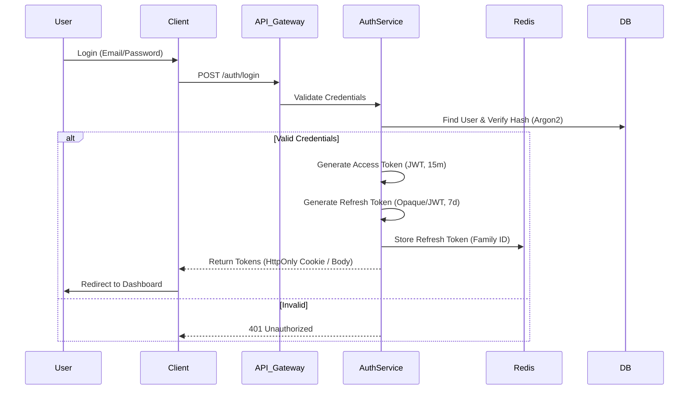
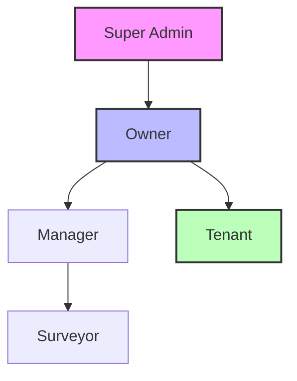

# Security Architecture Documentation
## Sistem DSS Manajemen Kosan - "SiHuni"

**Version:** 1.0 | **Status:** Production Ready | **Date:** 22 Februari 2026
**Compliance:** UU PDP (Indonesia), GDPR (EU Reference), OWASP ASVS Level 2
**Classification:** CONFIDENTIAL

---

## Table of Contents
1. [Security Principles & Compliance](#1-security-principles--compliance)
2. [Authentication & Identity Management](#2-authentication--identity-management)
3. [Authorization (RBAC) Strategy](#3-authorization-rbac-strategy)
4. [Data Protection & Cryptography](#4-data-protection--cryptography)
5. [Application Security (AppSec)](#5-application-security-appsec)
6. [Infrastructure & Network Security](#6-infrastructure--network-security)
7. [Audit Logging & Monitoring](#7-audit-logging--monitoring)
8. [Incident Response Plan](#8-incident-response-plan)

---

## 1. Security Principles & Compliance

### 1.1 Core Security Principles (CIA Triad + P)
1.  **Confidentiality:** Sensitive tenant data (KTP, Income) is accessible *only* to authorized personnel.
2.  **Integrity:** Financial records and ML models are protected from unauthorized modification.
3.  **Availability:** System ensures 99.9% uptime with DDoS protection and redundancy.
4.  **Privacy:** User consent is mandatory for data processing (Tenant Scoring).

### 1.2 Compliance Mapping
| Regulation | Requirement | SiHuni Implementation |
|------------|-------------|-----------------------|
| **UU PDP (Indonesia)** | Data Subject Rights | Feature to export/delete tenant data (Right to Erasure). |
| **UU PDP (Indonesia)** | Data Minimization | Only collect required fields for Scoring (NFR-2.3). |
| **GDPR (Reference)** | Consent Management | Explicit opt-in for "Financial Capacity" scoring component. |
| **OWASP ASVS** | Session Management | Secure, HTTPOnly cookies; 15-min Access Token life. |
| **PCI-DSS** | Payment Security | Payment processing offloaded to Payment Gateway (Midtrans/Xendit); No card data stored. |

---

## 2. Authentication & Identity Management

### 2.1 Auth Flow (JWT Strategy)
We use a **Dual-Token Architecture** (Access Token + Refresh Token) to balance security and UX.



### 2.2 Token Specifications
| Token Type | Format | Expiry | Storage (Client) | Purpose |
|------------|--------|--------|------------------|---------|
| **Access Token** | JWT (RS256) | 15 min | Memory / Closure | API Authorization |
| **Refresh Token**| Opaque / JWT | 7 days | HTTPOnly, Secure Cookie | Obtain new Access Token |

### 2.3 Password Security
-   **Hashing Algorithm:** Argon2id (m=65536, t=3, p=4).
-   **Policy:** Min 12 chars, mixed case, numbers, symbols.
-   **Rate Limiting:** 5 failed attempts per IP/Email block for 15 minutes.

---

## 3. Authorization (RBAC) Strategy

### 3.1 Role Hierarchy
The system implements a hierarchical Role-Based Access Control (RBAC) model.



### 3.2 Permission Matrix
| Feature | Super Admin | Owner | Manager | Surveyor | Tenant |
|---------|-------------|-------|---------|----------|--------|
| **User Mgmt** | Full | Create Manager/Surveyor | View Only | - | - |
| **Property** | Full | Create/Edit Own | Edit Own | View Assigned | View Public |
| **Financials**| View All | View Own | View Own | - | View Own Bills |
| **OCR Upload**| - | Yes | Yes | Yes | - |
| **Tenant Scoring**| - | Full View | Masked View | - | View Own Score |
| **System Logs**| Full | - | - | - | - |

**Note on "Masked View":** Managers can see the *Score* and *Risk Level*, but strictly **cannot** see raw "Financial Capacity" or detailed "Credit History" data to prevent bias/abuse.

---

## 4. Data Protection & Cryptography

### 4.1 Data Classification
| Class | Description | Examples | Protection Level |
|-------|-------------|----------|------------------|
| **Public** | Non-sensitive | Property Name, Address | Standard TLS |
| **Internal**| Business Ops | Occupancy Rates, Maintenance Logs | TLS + RBAC |
| **Confidential**| PII & Financial | Name, Email, Phone, Rent Amount | TLS + RBAC + Audit |
| **Restricted**| Sensitive PII | KTP, NIK, Income Data, Payment Proofs | **Column-Level Encryption** |

### 4.2 Encryption Strategy
-   **In-Transit:** TLS 1.3 for all communications. Strict Transport Security (HSTS) enabled.
-   **At-Rest (Database):** AWS RDS / PostgreSQL Transparent Data Encryption (TDE).
-   **At-Rest (Application Level):**
    -   **NIK (KTP Number):** AES-256-GCM encrypted before storage.
    -   **Income Data:** AES-256-GCM encrypted.
    -   **Keys:** Managed via AWS KMS / HashiCorp Vault.

### 4.3 Document Security (OCR)
-   **Storage:** AWS S3 Private Bucket.
-   **Access:** Pre-signed URLs with 5-minute expiry.
-   **Lifecycle:** Raw uploaded files (KTP images) are **soft-deleted** after 30 days post-verification, keeping only extracted/encrypted metadata.

---

## 5. Application Security (AppSec)

### 5.1 OWASP Top 10 Mitigation
1.  **Broken Access Control:**
    -   Middleware checks `permission` on every route.
    -   Integration tests verify "Tenant cannot access Owner routes".
2.  **Cryptographic Failures:**
    -   No hardcoded secrets (use `.env` + Vault).
    -   Rotate keys every 90 days.
3.  **Injection (SQL/NoSQL):**
    -   Use Prisma ORM (parameterized queries).
    -   Strict Zod validation on all inputs.
4.  **Insecure Design:**
    -   Threat Modeling conducted during design phase.
    -   Business logic limits (e.g., max rent amount checks).
5.  **Security Misconfiguration:**
    -   Helmet.js for HTTP Headers (CSP, X-Frame-Options).
    -   Disable `X-Powered-By`.

### 5.2 Input Validation (Zod)
Every API endpoint must validate input using strict Zod schemas.

```typescript
// Example: Tenant Input Schema
const TenantSchema = z.object({
  fullName: z.string().min(3).max(100).regex(/^[a-zA-Z\s]*$/), // No special chars
  nik: z.string().length(16).regex(/^\d+$/), // Numeric only
  email: z.string().email(),
  phone: z.string().regex(/^\+628\d{8,11}$/), // ID Phone format
});
```

---

## 6. Infrastructure & Network Security

### 6.1 Architecture Diagram
```mermaid
graph TB
    Internet((Internet)) --> WAF[Cloudflare WAF]
    WAF --> LB[Load Balancer]
    
    subgraph VPC [Private Cloud (AWS/GCP)]
        LB --> PubSub[Public Subnet]
        
        subgraph AppLayer [Private Subnet - App]
            API[NestJS API Cluster]
            Worker[BullMQ Workers]
        end
        
        subgraph DataLayer [Private Subnet - Data]
            DB[(PostgreSQL)]
            Redis[(Redis Cache)]
            S3[Object Storage]
        end
        
        PubSub --> API
        API --> Worker
        API --> DB
        API --> Redis
        API --> S3
    end
    
    style VPC fill:#eee,stroke:#333,stroke-dasharray: 5 5
    style DataLayer fill:#dfe,stroke:#333
```

### 6.2 Network Controls
-   **VPC:** Database and Redis are in **Private Subnets** (no public IP).
-   **Bastion Host:** SSH access only via VPN + Bastion Host with MFA.
-   **Firewall:** Security Groups allow port 5432 (Postgres) ONLY from App Layer Security Group.

---

## 7. Audit Logging & Monitoring

### 7.1 Audit Log Schema
Every "Write/Update/Delete" operation and "Sensitive Read" is logged.

```json
{
  "timestamp": "2026-02-22T14:30:00Z",
  "event_id": "evt_12345",
  "actor": {
    "user_id": "usr_owner_001",
    "role": "OWNER",
    "ip_address": "202.10.10.5",
    "user_agent": "Mozilla/5.0..."
  },
  "action": "TENANT_SCORING_VIEW",
  "resource": {
    "type": "TENANT_SCORE",
    "id": "score_987"
  },
  "status": "SUCCESS",
  "metadata": {
    "reason": "Reviewing application"
  }
}
```

### 7.2 Alerting Rules
-   **Critical:** > 5 failed logins per minute (Brute Force).
-   **High:** Unauthorized access attempt to `/admin/*`.
-   **Medium:** New API Key generation.

---

## 8. Incident Response Plan

### 8.1 Phases
1.  **Preparation:** Training, Runbooks, Mock Drills.
2.  **Identification:** Automated Alerts (Sentry, Prometheus) or User Report.
3.  **Containment:**
    -   Revoke affected User Tokens.
    -   Block malicious IPs via WAF.
    -   Isolate compromised containers.
4.  **Eradication:** Patch vulnerability, restore clean backups.
5.  **Recovery:** Gradual rollout, verify integrity.
6.  **Lessons Learned:** Post-Mortem report within 48 hours.

### 8.2 Contact Matrix
| Role | Name | Contact | SLA |
|------|------|---------|-----|
| **Security Lead** | TBD | sec-ops@sihuni.id | 15 min |
| **DevOps Lead** | TBD | devops@sihuni.id | 15 min |
| **Legal** | TBD | legal@sihuni.id | 2 hours |
