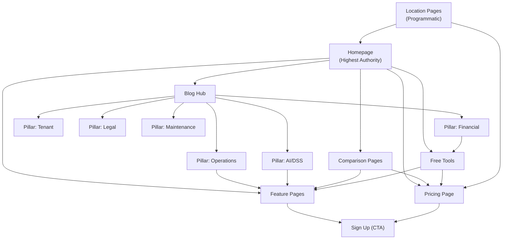

# SEO Strategy & Implementation Guide v3.0 (DSS Edition)

**Version:** 3.0 (DSS Edition)
**Last Updated:** 2026-02-22
**Status:** Active
**Document ID:** DOC-SEO-003
**Supersedes:** DOC-SEO-001 (v1.0)

---

## 1. Executive Summary

This document defines the comprehensive SEO strategy for **Sistem Hunian** — an AI-powered boarding house management platform (SaaS) targeting Indonesian "Juragan Kos" (boarding house owners). The strategy is aligned with `marketing.md` v3.0, `PRD_DSS_Manajemen_Kosan_v2_Professional.md`, and the actual technical implementation on Lovable Cloud.

### 1.1 North Star SEO Metrics

| KPI | Target (12 Months) | Measurement |
|:----|:----|:----|
| **Organic Traffic** | 50,000 monthly visits | GSC + GA4 |
| **Keyword Rankings (Top 10)** | 25+ primary keywords | Ahrefs/Semrush |
| **Organic Conversion Rate** | 3-5% (Visitor → Free Trial) | GA4 Goal |
| **Domain Authority** | DA 30+ | Ahrefs |
| **SERP Features** | 10+ FAQ/How-to snippets | GSC |

### 1.2 Strategic Pillars

1. **Technical SEO** — SPA crawlability, CWV optimization, structured data
2. **Content Authority** — Hub & Spoke clusters, DSS thought leadership, E-E-A-T signals
3. **Programmatic SEO** — Location & price pages at scale
4. **Conversion SEO** — Free tools as lead magnets, comparison pages, landing page optimization

### 1.3 Cross-References

| Document | Relevance |
|:---------|:----------|
| `marketing.md` v3.0 | Content pillars, keyword research, comparison pages, free tools, pricing |
| `UIUX_Design_Documentation_SiHuni.md` v3.0 | Performance targets, responsive design, heading hierarchy |
| `PRD_DSS_Manajemen_Kosan_v2_Professional.md` v3.0 | DSS features for keyword mapping |
| `system-architecture.md` v3.0 | SPA architecture, CDN, deployment topology |
| `deployment-infrastructure.md` v3.0 | Lovable Cloud CDN, build pipeline |
| `security-architecture.md` v3.0 | `noindex` dashboard requirements |

---

## 2. Technical SEO: SPA Crawlability

### 2.1 Current Implementation

Sistem Hunian is a React 18 SPA built with Vite 5. Client-Side Rendering (CSR) requires specific SEO accommodations.

**Meta Tag Management:**
```tsx
// src/shared/components/meta.tsx
import { Helmet } from 'react-helmet-async';

interface MetaProps {
  title?: string;        // Default: "Sistem Hunian"
  description?: string;  // Default: "Platform manajemen properti terintegrasi"
  image?: string;        // Default: "/placeholder.svg"
  url?: string;          // Default: window.location.href
  type?: string;         // Default: "website"
}

// Title format: "{PageTitle} | Sistem Hunian"
// HelmetProvider wraps entire app in App.tsx
```

**Rendered output includes:**
- `<title>`, `<meta name="description">`
- Open Graph tags: `og:title`, `og:description`, `og:image`, `og:url`, `og:type`
- Twitter Cards: `twitter:card`, `twitter:title`, `twitter:description`, `twitter:image`

### 2.2 robots.txt (Current State + Required Updates)

**Current** (`public/robots.txt`):
```
User-agent: Googlebot
Allow: /

User-agent: Bingbot
Allow: /

User-agent: Twitterbot
Allow: /

User-agent: facebookexternalhit
Allow: /

User-agent: *
Allow: /
```

**Required updates:**
```
# Dashboard routes — private, noindex
Disallow: /merchant/
Disallow: /tenant/
Disallow: /vendor/
Disallow: /admin/
Disallow: /onboarding/
Disallow: /auth/

# Sitemap reference
Sitemap: https://sistemhunian.com/sitemap.xml
```

### 2.3 Sitemap Strategy

**Status:** Not yet implemented. Required action items:

1. **Static sitemap** for public marketing pages (generate at build time via Vite plugin or manual XML):
   - `/`, `/harga`, `/fitur/*`, `/tentang`, `/kontak`, `/kebijakan-privasi`, `/syarat-ketentuan`
   - `/vs/*` comparison pages, `/tools/*` free tool pages
   - `/blog/*` articles (dynamic, update weekly)
2. **Exclude** all authenticated routes (`/merchant/*`, `/tenant/*`, `/vendor/*`, `/admin/*`)
3. Submit to Google Search Console upon creation

### 2.4 Pre-rendering Strategy

For critical public pages, evaluate:

| Approach | Pros | Cons | Recommendation |
|:---------|:-----|:-----|:---------------|
| **Dynamic Pre-rendering** (Rendertron/prerender.io) | No code changes, serves static HTML to bots | Adds infra cost, latency | Phase 2 |
| **Vite SSG Plugin** (`vite-plugin-ssr`) | Fast, built-in | Requires refactoring public routes | Phase 3 |
| **`react-helmet-async` only** (current) | Already implemented, zero cost | Googlebot handles React well since 2019 | **Phase 1 (Current)** |

**Decision:** Continue with `react-helmet-async` (Phase 1). Google's crawler renders JavaScript effectively. Monitor indexing via GSC; escalate to pre-rendering only if indexing issues arise.

---

## 3. Core Web Vitals & Performance

### 3.1 CWV Targets

Aligned with `UIUX_Design_Documentation_SiHuni.md` performance specifications.

| Metric | Target | Current Optimization |
|:-------|:-------|:---------------------|
| **LCP** | < 2.0s | Hero image preload (WebP/AVIF), code splitting via `React.lazy()` |
| **INP** | < 200ms | Debounced inputs, optimistic UI via TanStack Query |
| **CLS** | < 0.1 | Explicit `width`/`height` on images, skeleton loaders |

### 3.2 Build & Delivery Optimizations

| Technique | Status | Implementation |
|:----------|:-------|:---------------|
| **Gzip/Brotli Compression** | ✅ Active | `vite-plugin-compression` in `vite.config.ts` |
| **Code Splitting** | ✅ Active | 25 feature modules via `React.lazy()` in `App.tsx` |
| **CDN Caching** | ✅ Active | Lovable Cloud CDN auto-caches static assets |
| **Tree Shaking** | ✅ Active | Vite + ES modules, `lucide-react` icon imports |
| **Font Optimization** | ⚠️ Partial | Inter + Plus Jakarta Sans loaded; need `font-display: swap` |
| **Image Optimization** | ⚠️ Partial | Need WebP/AVIF for landing page hero & OG images |
| **Preconnect Hints** | ❌ Missing | Add `<link rel="preconnect">` for Supabase, CDN origins |

### 3.3 Action Items

1. Add `font-display: swap` to all `@font-face` declarations
2. Convert landing page images to WebP/AVIF with `<picture>` fallbacks
3. Add `<link rel="preconnect" href="https://gsqcatatypwfrxvohlzb.supabase.co">` to `index.html`
4. Implement `loading="lazy"` on all below-fold images
5. Add `fetchpriority="high"` to hero/LCP images

---

## 4. Mobile-First Indexing

### 4.1 Responsive Architecture

Sistem Hunian uses Tailwind CSS with mobile-first breakpoints (`sm`, `md`, `lg`, `xl`, `2xl`). Google indexes the mobile version.

| Requirement | Implementation |
|:------------|:---------------|
| **Responsive Layouts** | 4 portal layouts (Merchant, Tenant, Vendor, Admin) + public marketing layout |
| **Mobile Navigation** | Bottom nav bar for authenticated portals, hamburger menu for public pages |
| **Touch Targets** | All interactive elements ≥ 44×44px (WCAG 2.1 AA) |
| **Viewport Meta** | `<meta name="viewport" content="width=device-width, initial-scale=1.0">` |
| **Content Parity** | Identical content on mobile and desktop — no hidden mobile content |

### 4.2 Mobile-Specific SEO

- **AMP:** Not recommended for SPA architecture. Focus on CWV instead.
- **App Banners:** Future consideration for Android/iOS app deep linking.
- **Mobile Usability:** Monitor via GSC Mobile Usability report monthly.

---

## 5. URL Architecture

### 5.1 Public Routes (Indexable)

Clean, semantic, keyword-rich URLs in Bahasa Indonesia.

| Route Pattern | Example | Target Keyword |
|:-------------|:--------|:---------------|
| `/` | Homepage | "Aplikasi manajemen kos" |
| `/harga` | Pricing page | "Harga aplikasi kos" |
| `/fitur/{feature-slug}` | `/fitur/ocr-ktp` | "OCR KTP otomatis" |
| `/fitur/{feature-slug}` | `/fitur/scoring-penghuni` | "Scoring penyewa kos" |
| `/blog/{article-slug}` | `/blog/cara-mengelola-keuangan-kos` | "Cara mengelola keuangan kos" |
| `/vs/{competitor}` | `/vs/excel` | "Aplikasi kos vs Excel" |
| `/tools/{tool-slug}` | `/tools/kalkulator-roi-kos` | "Kalkulator investasi kos" |
| `/kos/{kota}` | `/kos/jakarta` | "Harga kos Jakarta" (Programmatic) |
| `/tentang` | About page | "Tentang Sistem Hunian" |
| `/kontak` | Contact page | Branded |
| `/kebijakan-privasi` | Privacy policy | Legal |
| `/syarat-ketentuan` | Terms of service | Legal |

### 5.2 Authenticated Routes (noindex)

All dashboard routes MUST include `<meta name="robots" content="noindex, nofollow">` via the `Meta` component.

| Portal | Route Prefix | noindex Status |
|:-------|:-------------|:---------------|
| Merchant | `/merchant/*` | ⚠️ **Required** — not yet implemented |
| Tenant | `/tenant/*` | ⚠️ **Required** — not yet implemented |
| Vendor | `/vendor/*` | ⚠️ **Required** — not yet implemented |
| Admin | `/admin/*` | ⚠️ **Required** — not yet implemented |
| Auth | `/auth/*` | ⚠️ **Required** — not yet implemented |
| Onboarding | `/onboarding/*` | ⚠️ **Required** — not yet implemented |

**Implementation:** Add `noindex` prop to `Meta` component, apply on all authenticated route layouts.

### 5.3 URL Rules

1. **Lowercase only** — no mixed case
2. **Hyphens** for word separation (not underscores)
3. **No trailing slashes** — configure Vite/router redirect
4. **Self-referencing canonicals** on every page: `<link rel="canonical" href="{current_url}">`
5. **No URL parameters** for content variations — use clean paths

---

## 6. Meta Tags Implementation

### 6.1 Per-Route Meta Tag Mapping

| Route | Title (≤60 chars) | Description (≤155 chars) |
|:------|:-------------------|:-------------------------|
| `/` | Sistem Hunian — Aplikasi Manajemen Kos Cerdas | Kelola kos lebih mudah dengan AI, automasi billing, OCR KTP, dan scoring penghuni. Mulai gratis! |
| `/harga` | Harga & Paket \| Sistem Hunian | Mulai gratis selamanya. Paket Pro mulai Rp 99.000/bulan. Bandingkan fitur dan pilih yang tepat. |
| `/fitur/ocr-ktp` | OCR KTP Otomatis \| Sistem Hunian | Foto KTP, data terisi otomatis. Hemat waktu input penghuni baru dengan teknologi AI. |
| `/fitur/scoring-penghuni` | Scoring & Analisis Penghuni \| Sistem Hunian | Prediksi risiko tunggakan dan evaluasi calon penghuni dengan AI scoring otomatis. |
| `/fitur/laporan-keuangan` | Laporan Keuangan Kos \| Sistem Hunian | Dashboard keuangan real-time: pendapatan, pengeluaran, occupancy rate, dan proyeksi profit. |
| `/vs/excel` | Sistem Hunian vs Excel \| Perbandingan | Mengapa aplikasi kos modern lebih efisien dari spreadsheet. Bandingkan fitur lengkapnya. |
| `/tools/kalkulator-roi-kos` | Kalkulator ROI Investasi Kos \| Sistem Hunian | Hitung potensi keuntungan bisnis kos Anda. Kalkulator gratis dari Sistem Hunian. |
| `/blog/*` | {Article Title} \| Blog Sistem Hunian | {First 155 chars of article excerpt} |

### 6.2 Open Graph Image Strategy

| Page Type | OG Image Spec | Status |
|:----------|:-------------|:-------|
| Homepage | 1200×630px, brand + tagline + hero screenshot | ❌ Needs creation |
| Feature pages | 1200×630px, feature icon + title + screenshot | ❌ Needs creation |
| Blog articles | 1200×630px, article title + author + brand | ❌ Needs creation |
| Comparison pages | 1200×630px, "vs" split layout | ❌ Needs creation |
| Tool pages | 1200×630px, tool name + CTA | ❌ Needs creation |

**Template approach:** Create a reusable OG image template in Figma/Canva. Automate with `@vercel/og`-style generation if volume grows.

### 6.3 Additional Meta Tags

```html
<!-- All pages -->
<meta name="robots" content="index, follow">
<link rel="canonical" href="{self_url}">
<meta name="author" content="Sistem Hunian">
<meta name="theme-color" content="#1a1a2e">
<html lang="id">
```

---

## 7. Heading Hierarchy

### 7.1 Rules

1. **One H1 per page** — must contain primary keyword
2. **H2** for major sections
3. **H3** for sub-sections
4. **No skipping levels** (H1 → H3 without H2)
5. Use semantic HTML (`<header>`, `<main>`, `<section>`, `<article>`, `<footer>`)

### 7.2 Homepage Heading Map

```
H1: Aplikasi Manajemen Kos Cerdas dengan AI
  H2: Fitur Unggulan
    H3: OCR KTP Otomatis
    H3: Scoring Penghuni AI
    H3: Automasi Billing & Tagihan
    H3: Laporan Keuangan Real-time
  H2: Mengapa Sistem Hunian?
    H3: Hemat Waktu 70%
    H3: Kurangi Tunggakan 30%
    H3: Gratis untuk 5 Kamar
  H2: Testimoni Juragan Kos
  H2: Paket & Harga
  H2: FAQ
```

### 7.3 Feature Page Heading Map

```
H1: {Feature Name} — Fitur Sistem Hunian
  H2: Bagaimana Cara Kerjanya?
    H3: Step 1...
    H3: Step 2...
  H2: Manfaat untuk Juragan Kos
  H2: Testimoni Pengguna
  H2: Mulai Gratis Sekarang (CTA)
```

---

## 8. Schema Markup (JSON-LD)

### 8.1 SoftwareApplication (Homepage)

```json
{
  "@context": "https://schema.org",
  "@type": "SoftwareApplication",
  "name": "Sistem Hunian",
  "alternateName": "SiHuni",
  "operatingSystem": "Web",
  "applicationCategory": "BusinessApplication",
  "applicationSubCategory": "Property Management",
  "description": "Aplikasi manajemen kos cerdas dengan AI, OCR KTP, scoring penghuni, dan automasi billing.",
  "url": "https://sistemhunian.com",
  "offers": [
    {
      "@type": "Offer",
      "name": "Starter (Gratis)",
      "price": "0",
      "priceCurrency": "IDR",
      "description": "Hingga 5 kamar, fitur dasar"
    },
    {
      "@type": "Offer",
      "name": "Growth",
      "price": "99000",
      "priceCurrency": "IDR",
      "billingIncrement": "P1M",
      "description": "Hingga 25 kamar, fitur lengkap"
    },
    {
      "@type": "Offer",
      "name": "Professional",
      "price": "249000",
      "priceCurrency": "IDR",
      "billingIncrement": "P1M",
      "description": "Hingga 100 kamar, fitur premium + AI"
    }
  ],
  "aggregateRating": {
    "@type": "AggregateRating",
    "ratingValue": "4.8",
    "ratingCount": "150",
    "bestRating": "5"
  },
  "featureList": "OCR KTP, Tenant Scoring AI, Automated Billing, Financial Reports, Maintenance Management, Vendor Marketplace"
}
```

### 8.2 Organization

```json
{
  "@context": "https://schema.org",
  "@type": "Organization",
  "name": "Sistem Hunian",
  "url": "https://sistemhunian.com",
  "logo": "https://sistemhunian.com/logo.png",
  "description": "Platform manajemen kos berbasis AI untuk Juragan Kos Indonesia",
  "foundingDate": "2025",
  "areaServed": {
    "@type": "Country",
    "name": "Indonesia"
  },
  "sameAs": [
    "https://instagram.com/sistemhunian",
    "https://linkedin.com/company/sistemhunian",
    "https://tiktok.com/@sistemhunian"
  ]
}
```

### 8.3 FAQPage (Pricing / Support)

```json
{
  "@context": "https://schema.org",
  "@type": "FAQPage",
  "mainEntity": [
    {
      "@type": "Question",
      "name": "Apakah Sistem Hunian gratis?",
      "acceptedAnswer": {
        "@type": "Answer",
        "text": "Ya, paket Starter gratis selamanya untuk pengelolaan hingga 5 kamar dengan fitur dasar."
      }
    },
    {
      "@type": "Question",
      "name": "Bagaimana cara kerja OCR KTP?",
      "acceptedAnswer": {
        "@type": "Answer",
        "text": "Cukup foto KTP calon penghuni, AI kami otomatis mengekstrak data NIK, Nama, Alamat, dan Tanggal Lahir dalam hitungan detik."
      }
    },
    {
      "@type": "Question",
      "name": "Apa itu Scoring Penghuni?",
      "acceptedAnswer": {
        "@type": "Answer",
        "text": "Fitur AI yang menganalisis riwayat pembayaran dan data penghuni untuk memprediksi risiko tunggakan, membantu Anda memilih penghuni terbaik."
      }
    },
    {
      "@type": "Question",
      "name": "Apakah data saya aman?",
      "acceptedAnswer": {
        "@type": "Answer",
        "text": "Ya, Sistem Hunian menggunakan enkripsi end-to-end, Row Level Security, dan 2FA untuk melindungi data Anda."
      }
    }
  ]
}
```

### 8.4 BreadcrumbList

```json
{
  "@context": "https://schema.org",
  "@type": "BreadcrumbList",
  "itemListElement": [
    { "@type": "ListItem", "position": 1, "name": "Beranda", "item": "https://sistemhunian.com/" },
    { "@type": "ListItem", "position": 2, "name": "Fitur", "item": "https://sistemhunian.com/fitur" },
    { "@type": "ListItem", "position": 3, "name": "OCR KTP", "item": "https://sistemhunian.com/fitur/ocr-ktp" }
  ]
}
```

### 8.5 HowTo (Feature Pages)

```json
{
  "@context": "https://schema.org",
  "@type": "HowTo",
  "name": "Cara Menggunakan OCR KTP di Sistem Hunian",
  "description": "Panduan langkah demi langkah menggunakan fitur OCR KTP otomatis.",
  "step": [
    { "@type": "HowToStep", "position": 1, "name": "Buka Menu Penghuni", "text": "Navigasi ke menu Penghuni dan klik 'Tambah Penghuni Baru'." },
    { "@type": "HowToStep", "position": 2, "name": "Foto KTP", "text": "Ambil foto KTP atau upload dari galeri." },
    { "@type": "HowToStep", "position": 3, "name": "Verifikasi Data", "text": "Sistem otomatis mengekstrak NIK, Nama, dan Alamat. Verifikasi dan simpan." }
  ],
  "totalTime": "PT2M"
}
```

### 8.6 Article (Blog Posts)

```json
{
  "@context": "https://schema.org",
  "@type": "Article",
  "headline": "{Article Title}",
  "author": { "@type": "Organization", "name": "Sistem Hunian" },
  "publisher": {
    "@type": "Organization",
    "name": "Sistem Hunian",
    "logo": { "@type": "ImageObject", "url": "https://sistemhunian.com/logo.png" }
  },
  "datePublished": "{ISO date}",
  "dateModified": "{ISO date}",
  "image": "{OG image URL}",
  "mainEntityOfPage": "{Canonical URL}"
}
```

---

## 9. Keyword Strategy

### 9.1 Primary Keywords (High Intent — Transactional)

| Keyword | Est. Monthly Volume | Difficulty | Target Page |
|:--------|:-------------------|:-----------|:------------|
| "Aplikasi manajemen kos" | 1,200 | Medium | Homepage |
| "Software pembukuan kos" | 800 | Medium | Homepage |
| "Sistem manajemen kost online" | 600 | Low | Homepage |
| "Aplikasi tagihan sewa otomatis" | 400 | Low | Feature: Billing |
| "Aplikasi kos gratis" | 1,500 | High | Pricing |

### 9.2 DSS Keywords (AI/Technology — Differentiator)

| Keyword | Est. Monthly Volume | Difficulty | Target Page |
|:--------|:-------------------|:-----------|:------------|
| "OCR KTP otomatis" | 300 | Low | Feature: OCR |
| "AI untuk bisnis kos" | 200 | Low | Blog: AI Kos |
| "Prediksi tunggakan sewa" | 150 | Low | Feature: Scoring |
| "Scoring penyewa kos" | 100 | Low | Feature: Scoring |
| "Analisis harga sewa AI" | 100 | Low | Tool: AI Pricing |

### 9.3 Long-tail DSS Keywords

- "Cara foto KTP langsung jadi data otomatis"
- "Prediksi pendapatan kos per bulan"
- "Rekomendasi harga sewa kos berdasarkan lokasi"
- "Aplikasi kos dengan fitur AI"
- "Otomatis input data penghuni dari KTP"

### 9.4 Buyer Stage Mapping

Aligned with `marketing.md` v3.0 buyer journey.

| Stage | Intent | Keywords | Content Type |
|:------|:-------|:---------|:-------------|
| **Awareness** | Informational | "Masalah kelola kos", "Tips bisnis kos" | Blog articles |
| **Consideration** | Commercial | "Aplikasi kos terbaik 2026", "SiHuni vs Excel" | Comparison pages |
| **Decision** | Transactional | "Aplikasi manajemen kos gratis", "Daftar SiHuni" | Homepage, Pricing |
| **Implementation** | Navigational | "Login Sistem Hunian", "Tutorial SiHuni" | Help docs, Feature pages |

### 9.5 Competitor Keywords

| Keyword | Target Page | Content Angle |
|:--------|:------------|:-------------|
| "Aplikasi kos terbaik 2026" | Blog: Best Apps | Listicle with SiHuni featured |
| "SiHuni vs Excel" | `/vs/excel` | Automation beats spreadsheets |
| "SiHuni vs WhatsApp" | `/vs/whatsapp` | Structured data vs chat chaos |
| "Mamikos alternatif" | `/vs/mamikos` | Management vs listing platform |
| "Aplikasi kos selain Rukita" | Blog: Alternatives | Different value proposition |

---

## 10. Content SEO: Hub & Spoke Architecture

### 10.1 Content Pillars

Aligned with 6 pillars from `marketing.md` v3.0.

#### Pillar 1: Operational Efficiency
- **Hub:** "Panduan Lengkap Operasional Bisnis Kos"
- **Spokes:** "SOP Kebersihan Kos", "Draft Tata Tertib Kos (Download)", "Cara Verifikasi KTP Anti Palsu", "Checklist Move-in Move-out"

#### Pillar 2: Financial Health
- **Hub:** "Manajemen Keuangan & Profitabilitas Kos"
- **Spokes:** "Menghitung ROI Bisnis Kos", "Pajak Kos: Panduan Lengkap", "Cara Mengelola Arus Kas Kos", "Strategi Pricing Kamar Kos"

#### Pillar 3: Tenant Relations
- **Hub:** "Strategi Retensi & Seleksi Penghuni"
- **Spokes:** "Ciri Penghuni Bermasalah", "Cara Menagih Tunggakan", "Tips Tingkatkan Kepuasan Penghuni", "Template Surat Peringatan"

#### Pillar 4: Property Maintenance
- **Hub:** "Panduan Maintenance Properti Kos"
- **Spokes:** "Jadwal Perawatan Berkala", "Cara Cari Tukang Terpercaya", "Estimasi Biaya Renovasi Kamar", "SOP Handling Keluhan Penghuni"

#### Pillar 5: Legal & Compliance
- **Hub:** "Aspek Hukum Bisnis Kos-kosan"
- **Spokes:** "Contoh Kontrak Sewa Kos (Download)", "Perizinan Usaha Kos", "GDPR/UU PDP untuk Data Penghuni", "Hak & Kewajiban Pemilik Kos"

#### Pillar 6: AI & Data Intelligence (DSS)
- **Hub:** "AI untuk Bisnis Kos: Masa Depan Pengelolaan Properti"
- **Spokes:** "Cara Kerja OCR KTP di Sistem Hunian", "Prediksi Tunggakan dengan AI", "AI Pricing: Rekomendasi Harga Sewa Otomatis", "Data-Driven Decision Making untuk Juragan Kos"

### 10.2 Content Calendar Alignment

| Month | Pillar Focus | Articles | Free Tool Launch |
|:------|:-------------|:---------|:-----------------|
| M1-M2 | Financial + Operational | 4 articles | Kalkulator ROI |
| M3-M4 | Tenant + Legal | 4 articles | Template Kontrak |
| M5-M6 | AI/DSS + Maintenance | 4 articles | AI Pricing Analyzer |
| M7+ | Evergreen updates + Programmatic | 2/month | Location pages |

---

## 11. Programmatic SEO Opportunity

### 11.1 Feasibility Analysis

| Pattern | URL | Target Keyword | Data Source | Feasibility |
|:--------|:----|:---------------|:------------|:------------|
| **Location pages** | `/kos/{kota}` | "harga kos {kota}" | Public rental data, `cities` table | ✅ High (34 provinces, 514 cities in DB) |
| **Price comparison** | `/harga-kos/{kota}` | "harga kos {kota} 2026" | Aggregated from properties | ⚠️ Medium (needs sufficient data) |
| **Tips by category** | `/tips/{topik}` | "tips {topik} kos" | Editorial content | ✅ High (evergreen) |

### 11.2 Implementation Roadmap

1. **Phase 1 (M3):** Launch 10 location pages for top cities (Jakarta, Bandung, Surabaya, Yogyakarta, Malang, Semarang, Medan, Makassar, Denpasar, Depok)
2. **Phase 2 (M6):** Expand to 50 cities if Phase 1 shows traction (>100 organic visits/month per page)
3. **Phase 3 (M9):** Dynamic price comparison pages with real data from platform

### 11.3 Thin Content Risk Mitigation

- Minimum 500 words per location page (city description + rental market overview + tips + CTA)
- Include unique data points: average rent, popular areas, university proximity
- User-generated content: integrate property reviews when available
- **Do NOT launch** pages for cities with <3 unique data points

---

## 12. Comparison Pages SEO

### 12.1 Page Specifications

From `marketing.md` v3.0 — 6 comparison pages with full SEO optimization.

| URL | Title | Primary Keyword | H1 |
|:----|:------|:----------------|:---|
| `/vs/excel` | Sistem Hunian vs Excel \| Perbandingan | "Aplikasi kos vs Excel" | Mengapa Beralih dari Excel ke Sistem Hunian? |
| `/vs/whatsapp` | Sistem Hunian vs WhatsApp \| Perbandingan | "Manajemen kos tanpa WhatsApp" | Kelola Kos Tanpa Chaos WhatsApp Group |
| `/vs/manual` | Digitalisasi Kos \| Sistem Hunian | "Digitalisasi bisnis kos" | Saatnya Tinggalkan Cara Manual |
| `/vs/mamikos` | Sistem Hunian vs Mamikos \| Perbandingan | "Mamikos alternatif" | Manajemen vs Listing: Mana yang Anda Butuhkan? |
| `/blog/best-kos-apps` | 5 Aplikasi Manajemen Kos Terbaik 2026 | "Aplikasi kos terbaik 2026" | Review 5 Aplikasi Kos Terbaik 2026 |
| `/blog/ai-kos` | AI untuk Manajemen Kos \| Sistem Hunian | "AI manajemen kos" | Bagaimana AI Mengubah Cara Kelola Kos |

### 12.2 On-Page SEO Template

Each comparison page must include:
1. **H1** with primary keyword
2. **Comparison table** (feature-by-feature, ✅/❌ format)
3. **Schema:** `FAQPage` with 3-5 questions
4. **CTA:** "Coba Gratis" button above and below fold
5. **Internal links:** To relevant feature pages and pricing
6. **Social proof:** Testimonial from user who switched
7. **Word count:** Minimum 1,500 words

---

## 13. Free Tool Pages SEO

### 13.1 Tool Specifications

5 free tools from `marketing.md` v3.0 as SEO lead magnets.

| Tool | URL | Target Keyword | Est. Monthly Volume | Lead Capture |
|:-----|:----|:---------------|:--------------------|:-------------|
| **Kalkulator ROI Kos** | `/tools/kalkulator-roi-kos` | "Kalkulator investasi kos" | 500 | Email for detailed report |
| **Template Kontrak Sewa** | `/tools/template-kontrak-sewa` | "Contoh kontrak sewa kos" | 2,000+ | Email for download |
| **Cek Harga Sewa** | `/tools/cek-harga-sewa` | "Harga sewa kos {kota}" | 1,500+ | Free preview, signup for full |
| **Kalkulator Renovasi** | `/tools/kalkulator-renovasi` | "Biaya renovasi kamar kos" | 300 | Email for detailed estimate |
| **AI Analisis Harga** | `/tools/ai-analisis-harga` | "Harga sewa kos ideal" | 200 | Signup required (premium) |

### 13.2 On-Page SEO Requirements

1. **H1** containing exact target keyword
2. **Embedded interactive tool** above the fold
3. **Supporting content** (1,000+ words): how to use, methodology, tips
4. **Schema:** `HowTo` for usage steps
5. **Partial gating:** Tool usable for free, detailed results require email
6. **Internal links:** Tool results link to relevant features/pricing

---

## 14. Internal Linking Architecture

### 14.1 Link Equity Flow



### 14.2 Internal Linking Rules

1. Every blog post links to ≥1 feature page (contextual CTA)
2. Every blog post links to ≥1 related article (same pillar)
3. Every feature page links to pricing + related blog content
4. Every comparison page links to ≥3 feature pages
5. Every free tool page links to pricing + sign up
6. **No orphan pages** — every page has ≥1 incoming internal link
7. Use descriptive anchor text with keywords (avoid "click here")
8. Breadcrumbs on all pages for hierarchy signals

### 14.3 Breadcrumb Strategy

Implement `BreadcrumbList` schema on all pages:
- Blog: `Beranda > Blog > {Category} > {Article}`
- Features: `Beranda > Fitur > {Feature Name}`
- Tools: `Beranda > Tools > {Tool Name}`
- Comparison: `Beranda > Perbandingan > {Competitor}`
- Location: `Beranda > Kos > {City}`

---

## 15. Monitoring, Analytics & Audit

### 15.1 Tools Configuration

| Tool | Purpose | Setup Status |
|:-----|:--------|:-------------|
| **Google Search Console** | Indexing, search queries, CWV, mobile usability | ⚠️ Needs setup |
| **Google Analytics 4** | Traffic, conversions, user behavior | ⚠️ Needs setup |
| **Ahrefs / Semrush** | Keyword tracking, backlink monitoring, competitor analysis | ❌ Not configured |

### 15.2 GA4 Custom Events

Aligned with actual frontend implementation.

| Event | Trigger | Parameters |
|:------|:--------|:-----------|
| `view_pricing` | Pricing page load | `source`, `plan_viewed` |
| `start_trial` | Sign up button click | `source_page`, `plan_type` |
| `read_blog_50` | 50% scroll on blog article | `article_slug`, `category` |
| `use_free_tool` | Tool interaction | `tool_name`, `result_generated` |
| `download_template` | Template download (gated) | `template_name` |
| `compare_plan` | Click "Bandingkan" on pricing | `plans_compared` |
| `signup_complete` | Registration success | `source`, `plan`, `referral` |

### 15.3 Monthly Audit Checklist

| # | Task | Tool | Frequency |
|:--|:-----|:-----|:----------|
| 1 | Check indexing errors (Soft 404s, redirect issues) | GSC | Monthly |
| 2 | Verify Schema Markup (Rich Results Test) | Google Rich Results Test | Monthly |
| 3 | Review "Search Queries" for new content ideas | GSC | Monthly |
| 4 | Core Web Vitals report (field data) | GSC / CrUX | Monthly |
| 5 | Broken links audit (404s) | Screaming Frog / Ahrefs | Monthly |
| 6 | Keyword ranking movement | Ahrefs / Semrush | Weekly |
| 7 | Competitor content gap analysis | Ahrefs Content Gap | Quarterly |
| 8 | Backlink health check | Ahrefs | Quarterly |
| 9 | Content freshness review (update old articles) | Manual | Quarterly |
| 10 | Mobile usability report | GSC | Monthly |

---

## 16. Implementation Checklist & Prioritization

### 16.1 Effort/Impact Matrix

| Priority | Task | Effort | Impact | Status |
|:---------|:-----|:-------|:-------|:-------|
| **P0** | Add `noindex` to all dashboard routes | Low | High | ❌ Not done |
| **P0** | Update `robots.txt` with Disallow rules | Low | High | ❌ Not done |
| **P0** | Create `sitemap.xml` for public pages | Low | High | ❌ Not done |
| **P0** | Set up Google Search Console | Low | High | ❌ Not done |
| **P1** | Create OG images (homepage + 5 key pages) | Medium | Medium | ❌ Not done |
| **P1** | Add `font-display: swap` to font loading | Low | Medium | ❌ Not done |
| **P1** | Implement JSON-LD schemas (SoftwareApp, Org, FAQ) | Medium | High | ❌ Not done |
| **P1** | Per-route meta tags (title + description) | Medium | High | ⚠️ Partial |
| **P2** | Build 6 comparison pages | High | High | ❌ Not done |
| **P2** | Build 5 free tool pages | High | High | ❌ Not done |
| **P2** | Launch first 4 blog articles (Pillar 1 & 2) | High | Medium | ❌ Not done |
| **P2** | Set up GA4 with custom events | Medium | Medium | ❌ Not done |
| **P3** | Programmatic SEO: 10 location pages | High | Medium | ❌ Not done |
| **P3** | Breadcrumb component + schema | Medium | Medium | ❌ Not done |
| **P3** | Image optimization (WebP/AVIF pipeline) | Medium | Low | ❌ Not done |
| **P3** | Pre-rendering evaluation | High | Low | ❌ Not done |

### 16.2 Quick Wins (Week 1-2)

1. Update `robots.txt` with `Disallow` rules for dashboard routes
2. Add `<meta name="robots" content="noindex, nofollow">` to all authenticated layouts
3. Create and submit `sitemap.xml`
4. Set up GSC and verify domain ownership
5. Add `font-display: swap` to font declarations
6. Implement homepage JSON-LD (`SoftwareApplication` + `Organization`)

### 16.3 Month 1 Deliverables

1. All P0 tasks completed
2. OG images for homepage + pricing + 3 feature pages
3. Per-route meta tags for all public pages
4. FAQ schema on pricing page
5. First 2 blog articles published (Financial + Operational pillars)
6. GA4 configured with core events

---

## Appendix A: E-E-A-T Signals

**Experience:**
- Case studies from real Juragan Kos using Sistem Hunian
- Screenshots and data from actual platform usage

**Expertise:**
- AI/ML technology explanations (OCR, scoring algorithms)
- Financial analysis tools with transparent methodology

**Authoritativeness:**
- Official industry partnerships (property associations)
- Guest posts on property/business media
- Speaking at proptech events

**Trustworthiness:**
- Transparent pricing (no hidden fees)
- Security certifications (RLS, encryption, 2FA)
- Real user testimonials with verification
- Clear privacy policy and data handling docs

---

## Appendix B: Constraints & Assumptions

1. **SPA Limitation:** Google renders JavaScript well, but crawl budget may be limited for large sites. Monitor indexing rate.
2. **Dashboard noindex:** All authenticated routes (4 portals) must be excluded from indexing to prevent data leakage.
3. **Content Capacity:** Marketing team can produce 2-4 blog articles per month.
4. **Brand Consistency:** Use "Sistem Hunian" as primary brand name in all SEO content. "SiHuni" is acceptable as informal/short form.
5. **Language:** All SEO content in Bahasa Indonesia. English content deprioritized (domestic market focus).
6. **Domain:** Final production domain TBD. All URL examples use `sistemhunian.com` as placeholder.
7. **Data Privacy:** Location/price pages must use aggregated, anonymized data only. No individual tenant/property data exposure.
