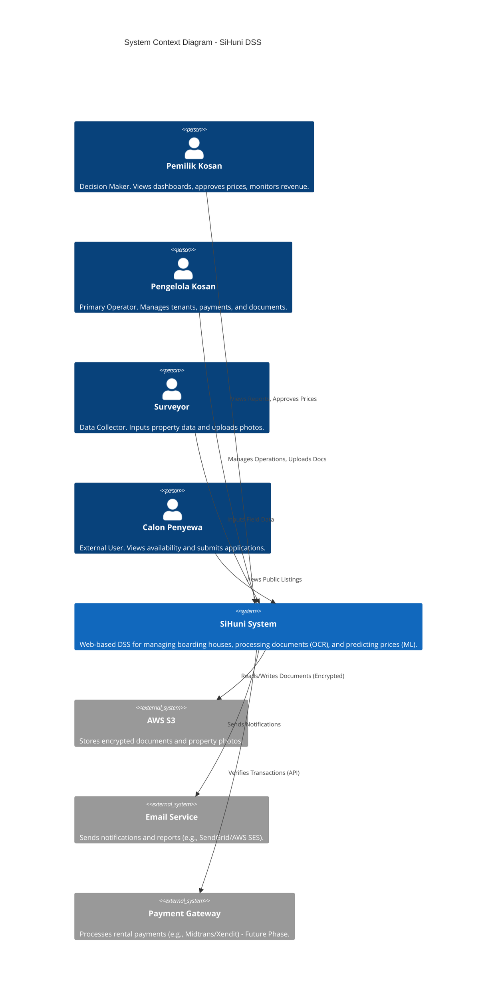
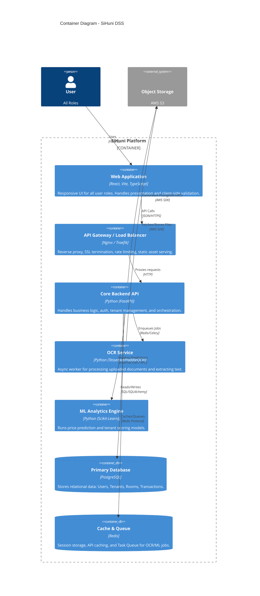
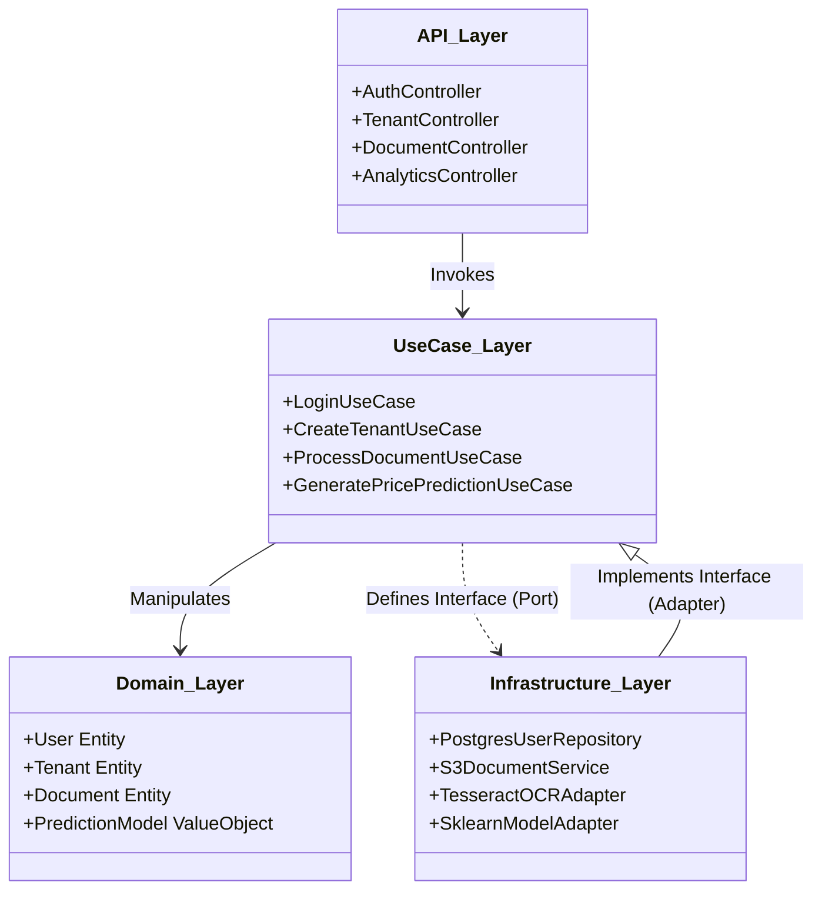
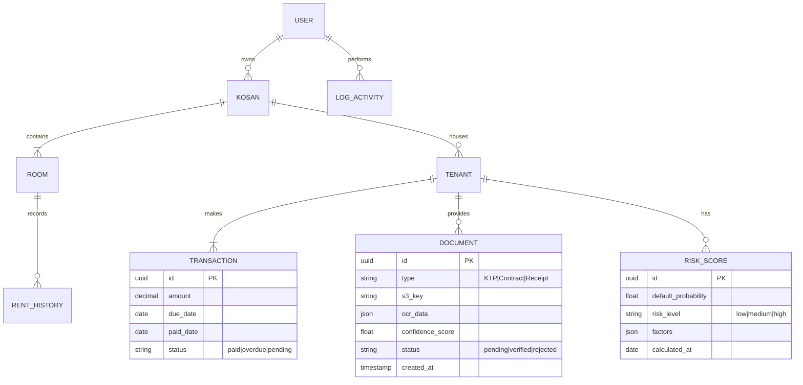

# System Architecture Document (SAD)
## Sistem Pendukung Keputusan (DSS) Manajemen Kosan - "SiHuni"

**Version:** 1.0  
**Date:** 2026-02-22  
**Status:** Approved for Implementation  
**Author:** Trae AI (System Architect)

---

## 1. Introduction

### 1.1 Purpose
This document defines the high-level system architecture for **SiHuni**, a Decision Support System (DSS) for Boarding House (Kosan) Management. It serves as the primary technical reference for the development team, detailing the structural design, technology stack, and integration patterns required to meet the functional and non-functional requirements outlined in the PRD (`PRD_DSS_Manajemen_Kosan_v2_Professional.md`).

### 1.2 Scope
The architecture covers the **Web Platform**, **Backend Services** (including OCR and ML modules), **Database Design**, and **Cloud Infrastructure**. It specifically addresses the "Pilot" phase scope (20 Kosan) while establishing a foundation scalable to the "Growth" phase.

### 1.3 Architecture Principles
1.  **Single Responsibility**: Each module/service has one clear purpose.
2.  **Clean Architecture**: Separation of concerns with dependency rule (Domain > Use Cases > Adapters > Infrastructure).
3.  **Cloud-Native**: Designed for containerization (Docker) and object storage (S3).
4.  **Security-First**: Zero-trust principles, aligned with `security-architecture.md`.
5.  **User-Centric Performance**: Optimizing for Core Web Vitals and low-latency interactions.

---

## 2. Architectural Drivers

### 2.1 Key Business Goals (from PRD)
-   **Automate Documentation**: OCR processing < 2 min/document (FR-1).
-   **Optimize Revenue**: Data-driven pricing models (FR-2).
-   **Reduce Risk**: Tenant scoring to lower default rates (FR-2).
-   **User Adoption**: Intuitive UI for non-technical owners (User Persona 1).

### 2.2 Key Non-Functional Requirements (NFRs)
-   **Performance**: < 2s load time (LCP), < 100ms API latency for core reads.
-   **Scalability**: Support vertical scaling for Pilot; horizontal scaling ready for ML modules.
-   **Reliability**: 99.9% Uptime during business hours (08:00 - 20:00).
-   **Security**: AES-256 encryption for PII (NIK), Role-Based Access Control (RBAC).

---

## 3. System Context (C4 Level 1)

This diagram shows the **SiHuni System** and its interactions with user personas and external systems.

---

## 4. Container Architecture (C4 Level 2)

The system follows a **Modular Monolith** architecture for the backend (to simplify Pilot deployment) with a **Single Page Application (SPA)** frontend.

### 4.1 Container Descriptions
1.  **Web Application (Frontend)**:
    -   **Tech**: React 19, Vite, TypeScript, Tailwind CSS, Shadcn/UI.
    -   **Responsibility**: User Interface, State Management (Zustand/TanStack Query), Form Validation (Zod).
2.  **Core Backend API**:
    -   **Tech**: Python (FastAPI), SQLAlchemy (Async), Pydantic.
    -   **Responsibility**: RESTful API, Authentication (JWT), Business Rules, Data Persistence.
3.  **OCR Service**:
    -   **Tech**: Celery Worker + Tesseract/EasyOCR.
    -   **Responsibility**: Asynchronous processing of document images/PDFs.
4.  **ML Analytics Engine**:
    -   **Tech**: Scikit-Learn / Pandas.
    -   **Responsibility**: Price optimization algorithms and risk scoring.
5.  **Database**:
    -   **Tech**: PostgreSQL 16.
    -   **Responsibility**: ACID-compliant storage for structured data.

---

## 5. Component Architecture (C4 Level 3)

Focusing on the **Core Backend API** using **Clean Architecture**.

### 5.1 Key Components
*   **Domain Entities**: Pure Python dataclasses/Pydantic models representing business objects (e.g., `Tenant`, `Payment`). No external dependencies.
*   **Use Cases**: Application specific business rules (e.g., `ProcessDocumentUseCase` orchestrates uploading to S3, triggering OCR worker, and creating a DB record).
*   **Repositories**: Interfaces for data access, implemented in the Infrastructure layer using SQLAlchemy.

---

## 6. Data Architecture

### 6.1 Entity Relationship Diagram (ERD)

### 6.2 Data Flow: Document OCR
1.  **Upload**: User uploads file -> Frontend validates size/type -> Sends to API.
2.  **Storage**: API saves to S3 (Private Bucket) -> Creates `Document` record (Status: `pending`).
3.  **Processing**: API pushes job to Redis Queue -> OCR Worker picks up job.
4.  **Extraction**: Worker downloads from S3 -> Runs OCR -> Extracts text/JSON.
5.  **Completion**: Worker updates `Document` record with `ocr_data` and `status: verified` (if high confidence) or `review_needed`.
6.  **Notification**: Frontend polls/receives WebSocket update.

---

## 7. Technology Stack

| Layer | Component | Technology | Version | Justification |
| :--- | :--- | :--- | :--- | :--- |
| **Frontend** | Framework | React | 19.x | Modern, component-based, high ecosystem support. |
| | Build Tool | Vite | 5.x | Fast HMR, optimized builds. |
| | Language | TypeScript | 5.x | Type safety, maintainability. |
| | Styling | Tailwind CSS | 3.4+ | Utility-first, consistent design system implementation. |
| | Components | Shadcn/UI | Latest | Accessible, customizable, copy-paste architecture. |
| | State | Zustand | 4.x | Lightweight, simple state management. |
| | Data Fetching | TanStack Query | 5.x | Server state management, caching, optimistic updates. |
| **Backend** | Framework | FastAPI | 0.109+ | High performance, async support, auto-documentation (Swagger). |
| | Language | Python | 3.11+ | Native support for ML/AI libraries (FR-2). |
| | ORM | SQLAlchemy | 2.0+ | Robust async ORM for PostgreSQL. |
| | Validation | Pydantic | 2.x | Fast data validation and serialization. |
| **Data** | Database | PostgreSQL | 16.x | Reliable, relational, supports JSONB for OCR data. |
| | Cache/Queue | Redis | 7.x | Fast caching and reliable task queue backbone. |
| **Infra** | Container | Docker | 24+ | Consistent environments. |
| | Orchestration | Docker Compose | 2.x | Simplified deployment for Pilot phase. |
| | Storage | AWS S3 | - | Scalable, secure object storage. |

---

## 8. Deployment Architecture (Pilot Phase)

For the pilot phase (20 Kosan), a simplified **Single Instance Deployment** with containerization is sufficient, paving the way for Kubernetes in the future.

-   **Cloud Provider**: AWS (EC2 t3.medium or Lightsail).
-   **Web Server**: Nginx as Reverse Proxy (SSL/TLS termination).
-   **Database**: Managed RDS (PostgreSQL) or containerized with volume backups.
-   **CI/CD**: GitHub Actions (Lint -> Test -> Build Docker -> Push to Registry -> SSH Deploy).

---

## 9. Assumptions & Constraints

### 9.1 Assumptions
-   Users have stable internet connection (4G/Fiber) for document uploads.
-   PostgreSQL JSONB features are sufficient for semi-structured OCR data (NoSQL not strictly needed yet).
-   Python backend can handle both API and ML workloads initially (separation can happen later).

### 9.2 Constraints
-   **Budget**: Minimize infrastructure costs for Pilot (Target < $50/mo).
-   **Compliance**: Server location must be Indonesia (if strict UU PDP interpretation) or SG (standard). *Assumption: SG region acceptable for Pilot.*
-   **Legacy Data**: No migration from existing systems required (Greenfield).

---

## 10. Requirement Traceability Matrix

| Requirement ID | Requirement Description | Architectural Component | Strategy/Pattern |
| :--- | :--- | :--- | :--- |
| **FR-1.1** | Doc Upload & Storage | Web App, API, S3 | Presigned URLs, AES-256 Encryption |
| **FR-1.3** | OCR Text Extraction | OCR Service (Celery) | Async Worker Pattern, Tesseract |
| **FR-2.1** | Price Optimization | ML Engine, Database | Scikit-Learn Model, Batch Prediction |
| **NFR-Sec** | Data Privacy (PII) | DB, Auth Service | Argon2 Hashing, RBAC, Field Encryption |
| **NFR-Perf** | < 2s Load Time | Web App (Vite) | Code Splitting, Lazy Loading, Redis Caching |
