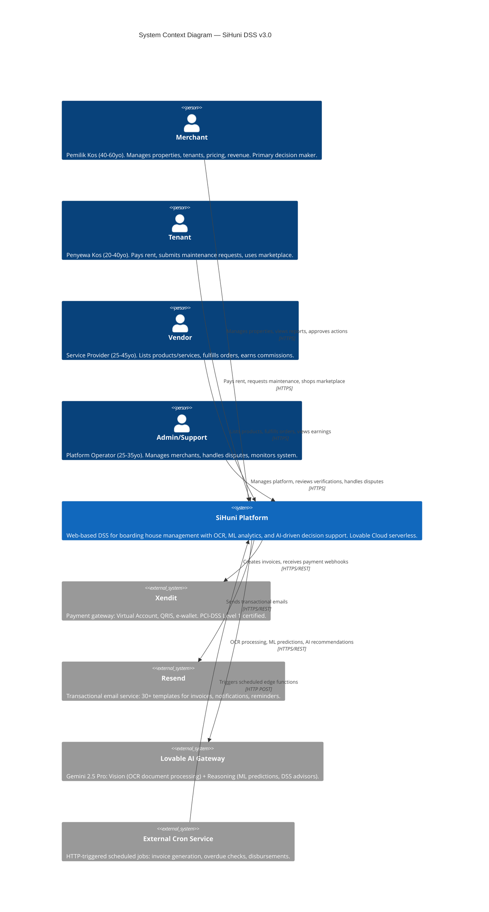
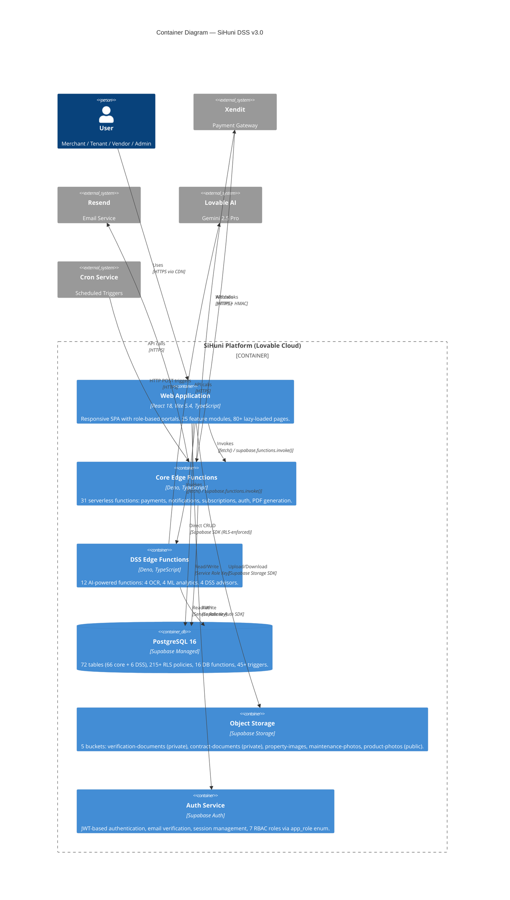
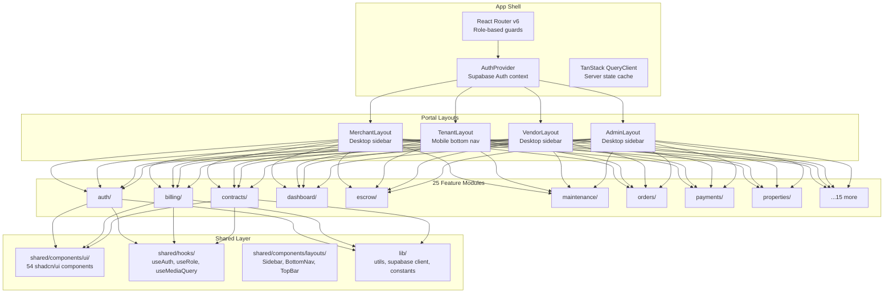
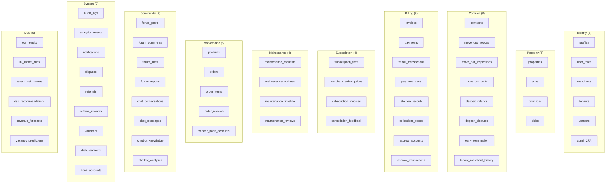
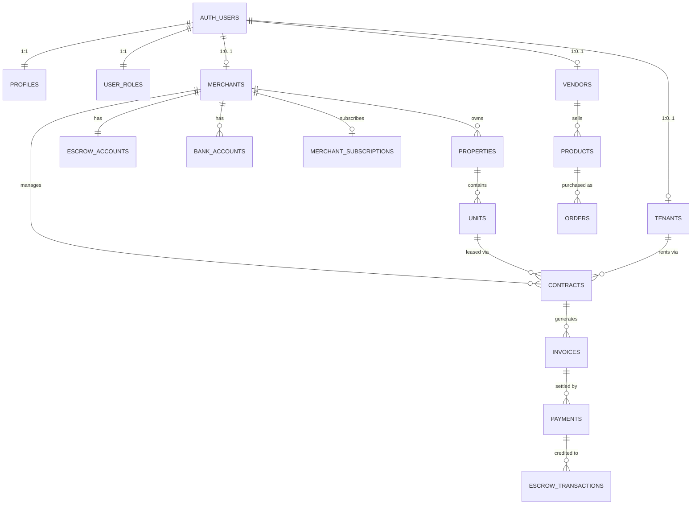
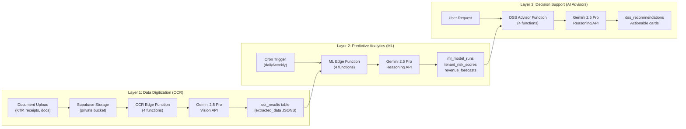
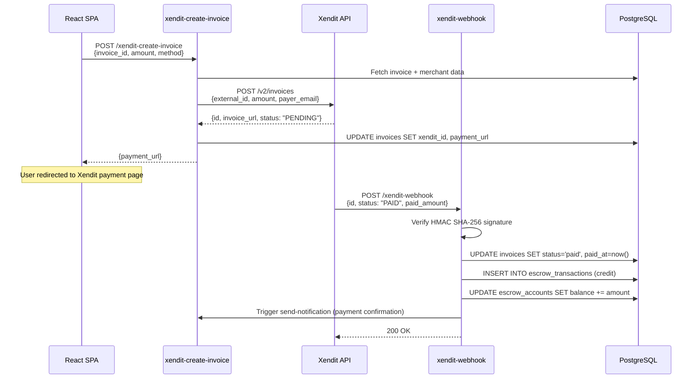

# System Architecture Document (SAD)

> **SiHuni — Sistem DSS Manajemen Kosan v3.0 (DSS Edition)**
>
> Version: 3.0 | Status: Production Ready | Date: 22 Februari 2026
>
> Platform: Lovable Cloud (Serverless Modular Monolith + AI-Powered DSS Layer)
>
> Cross-references: [`backend-architecture.md`](./backend-architecture.md) · [`database-schema.md`](./database-schema.md) · [`deployment-infrastructure.md`](./deployment-infrastructure.md) · [`security-architecture.md`](./security-architecture.md) · [`api-specification.md`](./api-specification.md) · [`development-standards.md`](./development-standards.md) · [`PRD_DSS_Manajemen_Kosan_v2_Professional.md`](./PRD_DSS_Manajemen_Kosan_v2_Professional.md) · [`UIUX_Design_Documentation_SiHuni.md`](./UIUX_Design_Documentation_SiHuni.md)

---

## Table of Contents

1. [Introduction](#1-introduction)
2. [Architectural Drivers](#2-architectural-drivers)
3. [System Context (C4 Level 1)](#3-system-context-c4-level-1)
4. [Container Architecture (C4 Level 2)](#4-container-architecture-c4-level-2)
5. [Component Architecture (C4 Level 3)](#5-component-architecture-c4-level-3)
6. [Frontend Architecture](#6-frontend-architecture)
7. [Backend Architecture](#7-backend-architecture)
8. [Data Architecture](#8-data-architecture)
9. [DSS Layer Architecture](#9-dss-layer-architecture)
10. [Integration Architecture](#10-integration-architecture)
11. [Technology Stack](#11-technology-stack)
12. [Deployment Architecture](#12-deployment-architecture)
13. [Quality Attributes & NFR Mapping](#13-quality-attributes--nfr-mapping)
14. [Requirement Traceability Matrix](#14-requirement-traceability-matrix)

---

## 1. Introduction

### 1.1 Purpose

This document defines the **high-level system architecture** for **SiHuni** (Sistem Hunian), a Decision Support System (DSS) for Boarding House (Kosan) Management running on Lovable Cloud. It serves as the **primary architectural navigation map** — providing the structural overview that connects all detailed technical documents.

This is a **C4-model** architecture document: System Context → Container → Component views, supplemented with cross-cutting concerns (data, integration, deployment, quality).

### 1.2 Scope

| In Scope | Out of Scope |
|----------|--------------|
| Web Platform (React SPA) | Native mobile apps (iOS/Android) |
| 31 Edge Functions (core backend) | Third-party admin dashboards |
| 12 DSS Edge Functions (OCR/ML/AI) | Raw ML model training pipelines |
| PostgreSQL 72-table schema | Data warehouse / BI platform |
| Xendit, Resend, Lovable AI integrations | Direct bank API integrations |
| Lovable Cloud deployment topology | Self-hosted / on-premise deployment |

### 1.3 Architecture Principles

| # | Principle | Rationale | Implementation |
|---|-----------|-----------|----------------|
| 1 | **Serverless-First** | Zero infrastructure management, auto-scaling, pay-per-use | 43 Deno Edge Functions on Lovable Cloud; no servers, containers, or orchestration |
| 2 | **Database-as-API** | Reduce backend boilerplate; leverage PostgreSQL as the primary API layer | Supabase SDK direct CRUD via RLS; 72 tables accessible without REST endpoints |
| 3 | **RLS-First Security** | Database-enforced access control eliminates middleware authorization bugs | 215+ Row Level Security policies; `has_role()` SECURITY DEFINER function |
| 4 | **AI-Augmented Operations** | Transform manual kosan management into data-driven decision making | Gemini 2.5 Pro (Vision for OCR, Reasoning for ML/DSS) via Lovable AI Gateway |
| 5 | **Feature-Based Modularity** | Independent development, testing, and deployment of business domains | 25 frontend feature modules + 28 backend modules with isolated services, hooks, types |
| 6 | **Single Responsibility** | Each edge function has one clear purpose; each table owns one domain | Function names are verb-noun (`xendit-create-invoice`, `send-notification`) |
| 7 | **Security-First** | Zero-trust data access; defense in depth | RBAC (7 roles), RLS, TOTP 2FA for admin, HMAC webhook verification |

### 1.4 Architecture Pattern: Serverless Modular Monolith

SiHuni implements a **Serverless Modular Monolith** — a single logical application deployed as isolated serverless functions, sharing a common database with strict access control:

```
┌─────────────────────────────────────────────────────────────────┐
│                    SiHuni Monolith Boundary                      │
│                                                                 │
│   ┌─────────┐ ┌──────────┐ ┌──────────┐ ┌─────────────────┐   │
│   │ Billing │ │ Contract │ │ Property │ │  DSS (OCR/ML/AI) │   │
│   │ Module  │ │ Module   │ │ Module   │ │  Module          │   │
│   └────┬────┘ └────┬─────┘ └────┬─────┘ └────────┬────────┘   │
│        │           │            │                 │             │
│   ┌────┴───────────┴────────────┴─────────────────┴──────────┐ │
│   │           PostgreSQL 16 (Shared Database)                 │ │
│   │           72 Tables · 215+ RLS Policies · 7 Roles         │ │
│   └───────────────────────────────────────────────────────────┘ │
└─────────────────────────────────────────────────────────────────┘
```

**Why not Microservices?** For a pilot-phase B2B platform targeting 20 kosan (5-10 users), microservices would add unnecessary complexity (service discovery, distributed transactions, inter-service auth). The monolith pattern with serverless deployment gives us:
- Simple deployment (single platform)
- Shared database with strong consistency
- Easy refactoring and feature development
- Serverless scaling when needed (individual functions auto-scale)

---

## 2. Architectural Drivers

### 2.1 Key Business Goals (from PRD v3.0)

| # | Business Goal | Target Metric | Architecture Impact |
|---|---------------|---------------|---------------------|
| BG-1 | Automate document digitization | OCR <3s/document | DSS OCR pipeline via Gemini Vision edge functions |
| BG-2 | Optimize revenue per unit | +8-15% revenue | ML predictive analytics (revenue forecast, optimal pricing) |
| BG-3 | Reduce payment default risk | -20-30% tunggakan | Tenant risk scoring, automated collections escalation |
| BG-4 | Reduce admin time | ~75% reduction | Auto-invoice generation, auto-pay, cron jobs |
| BG-5 | Multi-tenant marketplace | Vendor ecosystem | Marketplace module, order system, vendor portal |
| BG-6 | User adoption >80% | Intuitive UI for non-tech users | Mobile-first responsive design, role-based portals |

### 2.2 Key Non-Functional Requirements (NFRs)

| NFR | Requirement | Target | Architecture Strategy |
|-----|-------------|--------|----------------------|
| **Performance** | Page load time | LCP <2s | Vite build, code splitting, lazy loading, CDN |
| **Performance** | API response time | <200ms (CRUD), <3s (AI) | RLS direct queries, edge function cold start <100ms |
| **Scalability** | Concurrent users | 50-100 (pilot), 1000+ (growth) | Serverless auto-scaling, Supavisor connection pooling |
| **Availability** | Uptime | 99.9% business hours | Lovable Cloud managed infrastructure, CDN failover |
| **Security** | Data protection | UU PDP, OWASP ASVS L2 | RLS-first, JWT auth, TOTP 2FA, encrypted secrets |
| **Security** | Payment compliance | PCI-DSS | Delegated to Xendit (Level 1 certified) |
| **Maintainability** | Code modularity | Feature-based isolation | 25 feature modules, shared component library |
| **Reliability** | Data consistency | ACID transactions | PostgreSQL with proper FK constraints and triggers |

### 2.3 Architectural Constraints

| Constraint | Impact |
|------------|--------|
| **Lovable Cloud platform** | No custom server infrastructure; must use edge functions + managed PostgreSQL |
| **Deno runtime** | Edge functions use Deno (not Node.js); npm compatibility via `npm:` specifier |
| **No background workers** | Long-running jobs handled via cron triggers, not persistent workers |
| **Budget <$50/mo (pilot)** | Serverless model fits; no idle server costs |
| **Indonesia market** | Payment via Xendit (VA/QRIS/e-wallet); UU PDP compliance; IDR currency |
| **Non-technical primary users** | Merchants aged 40-60; UI must be intuitive with Bahasa Indonesia |

---

## 3. System Context (C4 Level 1)

### 3.1 System Context Diagram



### 3.2 Persona Summary

| Persona | Role Code | Age Range | Tech Comfort | Primary Actions |
|---------|-----------|-----------|--------------|-----------------|
| **Merchant** | `merchant` | 40-60 | Low-Medium | Property CRUD, tenant management, invoice review, revenue reports, DSS insights |
| **Tenant** | `tenant` | 20-40 | Medium-High | Rent payment, maintenance requests, marketplace orders, forum participation |
| **Vendor** | `vendor` | 25-45 | Medium | Product listing, order fulfillment, earnings withdrawal, analytics |
| **Admin** | `admin`, `super_admin`, `moderator`, `support` | 25-35 | High | Merchant verification, dispute resolution, escrow management, platform config |

### 3.3 External System Interactions

| External System | Integration Type | Data Flow | Security |
|-----------------|-----------------|-----------|----------|
| **Xendit** | REST API + Webhooks | Outbound: create invoice/disbursement; Inbound: payment confirmation webhook | HMAC SHA-256 webhook verification via `XENDIT_WEBHOOK_TOKEN` |
| **Resend** | REST API | Outbound: send transactional emails (30+ templates) | API key (`RESEND_API_KEY`) in edge function secrets |
| **Lovable AI** | REST API | Outbound: OCR image → text, ML prompt → prediction, DSS prompt → recommendation | `LOVABLE_API_KEY` in edge function secrets |
| **Cron Service** | HTTP POST | Inbound: trigger scheduled functions (daily invoices, overdue checks, disbursements) | Bearer token validation in edge functions |

---

## 4. Container Architecture (C4 Level 2)

### 4.1 Container Diagram



### 4.2 Container Descriptions

| Container | Technology | Responsibility | Key Metrics |
|-----------|-----------|----------------|-------------|
| **Web Application** | React 18, Vite 5.4, TypeScript, Tailwind, shadcn/ui | UI rendering, client-side state, form validation, role-based routing | 80+ pages, 25 feature modules, 54 shadcn/ui components |
| **Core Edge Functions** | Deno, TypeScript | Payment processing, notifications, subscriptions, auth hooks, PDF generation, cron handlers | 31 functions, auto-scaling, <100ms cold start |
| **DSS Edge Functions** | Deno, TypeScript | OCR document processing, ML predictions, AI advisor recommendations | 12 functions, Gemini 2.5 Pro integration |
| **PostgreSQL 16** | Supabase Managed | Relational data storage, RLS enforcement, triggers, functions | 72 tables, 215+ RLS, 16 functions, 45+ triggers |
| **Object Storage** | Supabase Storage | Document and image storage with access control | 5 buckets (2 private, 3 public) |
| **Auth Service** | Supabase Auth | JWT authentication, session management, email verification | 7 RBAC roles, `handle_new_user` auto-provisioning |

### 4.3 Dual-Access Pattern

SiHuni uses a **dual-access pattern** for data operations:

```
┌─────────────────────────────────────────────────────────┐
│                    React SPA (Client)                    │
│                                                         │
│   Pattern A: Direct CRUD          Pattern B: Complex    │
│   (Simple data operations)        (Business logic)      │
│                                                         │
│   supabase.from('table')          supabase.functions    │
│     .select() / .insert()           .invoke('fn-name')  │
│     .update() / .delete()                               │
│           │                              │              │
│           ▼                              ▼              │
│   ┌─────────────────┐         ┌──────────────────────┐  │
│   │  PostgreSQL 16  │         │  Edge Function (Deno) │  │
│   │  RLS enforces   │         │  Service Role Key     │  │
│   │  access control │         │  → Xendit / Resend /  │  │
│   │  (anon key)     │         │    Lovable AI / DB    │  │
│   └─────────────────┘         └──────────────────────┘  │
└─────────────────────────────────────────────────────────┘
```

**When to use Pattern A (Direct SDK):**
- Simple CRUD on user-owned data (profiles, properties, units)
- List/filter/search queries
- Data that RLS can fully protect

**When to use Pattern B (Edge Function):**
- External API calls (Xendit, Resend, Lovable AI)
- Multi-step transactions (create invoice → call Xendit → update status)
- Operations requiring `service_role` key (admin overrides, webhooks)
- AI/ML processing (OCR, predictions, recommendations)

> **Detailed edge function specifications:** See [`backend-architecture.md`](./backend-architecture.md) Section 7

---

## 5. Component Architecture (C4 Level 3)

### 5.1 Frontend Component Architecture



### 5.2 Feature Module Structure

Each feature module follows a consistent internal structure:

```
src/features/{feature}/
├── components/        # UI components specific to this feature
├── hooks/             # TanStack Query hooks (useQuery, useMutation)
├── services/          # Supabase SDK calls and edge function invocations
├── types/             # TypeScript interfaces and types
├── utils/             # Feature-specific utility functions
└── pages/             # Route-level page components (lazy-loaded)
```

### 5.3 25 Frontend Feature Modules

| # | Module | Description | Portal(s) |
|---|--------|-------------|-----------|
| 1 | `analytics` | Revenue charts, occupancy stats, performance metrics | Merchant, Vendor, Admin |
| 2 | `audit-logs` | System audit trail viewer | Admin |
| 3 | `auth` | Login, register, email verification, role selection | All |
| 4 | `billing` | Invoice management, late fees, payment plans | Merchant, Admin |
| 5 | `chatbot` | AI chatbot interface, knowledge base management | Tenant, Admin |
| 6 | `contracts` | Contract CRUD, signatures, move-out workflow | Merchant, Tenant |
| 7 | `dashboard` | Role-specific dashboard with KPI cards | All |
| 8 | `disputes` | Dispute filing and resolution | Tenant, Merchant, Admin |
| 9 | `escrow` | Escrow accounts, disbursements, transaction history | Merchant, Admin |
| 10 | `forum` | Community posts, comments, likes, moderation | Tenant, Admin |
| 11 | `maintenance` | Repair requests, SLA tracking, vendor assignment | Tenant, Merchant, Vendor |
| 12 | `notifications` | In-app notification center | All |
| 13 | `orders` | Marketplace order management | Tenant, Vendor, Admin |
| 14 | `payments` | Payment history, auto-pay setup | Tenant, Merchant |
| 15 | `platform-config` | Platform fees, payment methods, feature flags | Admin |
| 16 | `products` | Vendor product catalog management | Vendor |
| 17 | `profile` | User profile, settings, password change | All |
| 18 | `properties` | Property CRUD, unit management, maps | Merchant, Admin |
| 19 | `referrals` | Referral codes, commissions, rewards | All |
| 20 | `search` | Global search across entities | All |
| 21 | `signature` | Digital signature capture and verification | Merchant, Tenant |
| 22 | `subscriptions` | Merchant subscription tiers, billing | Merchant, Admin |
| 23 | `users` | Admin user management | Admin |
| 24 | `vendors` | Vendor profile, verification, analytics | Vendor, Admin |
| 25 | `verification` | KTP OCR, document verification, merchant verification | Merchant, Vendor, Admin |

> **Detailed frontend architecture:** See [`backend-architecture.md`](./backend-architecture.md) Section 18

---

## 6. Frontend Architecture

### 6.1 Technology Stack

| Layer | Technology | Version | Purpose |
|-------|-----------|---------|---------|
| **Framework** | React | 18.3 | Component-based UI with hooks |
| **Build** | Vite | 5.4 | Fast HMR, SWC compiler, optimized builds |
| **Language** | TypeScript | 5.x | Type safety across entire codebase |
| **Styling** | Tailwind CSS | 3.4+ | Utility-first CSS with semantic design tokens |
| **Components** | shadcn/ui + Radix UI | Latest | 54 accessible, customizable components |
| **Server State** | TanStack React Query | 5.x | Caching, background refetch, optimistic updates |
| **Client State** | Zustand | 5.x | Persistent UI state (sidebar, preferences) |
| **Forms** | React Hook Form + Zod | 7.x / 3.x | Performant forms with schema validation |
| **Routing** | React Router | 6.x | Client-side routing with role-based guards |
| **Charts** | Recharts | 2.x | Revenue, occupancy, and analytics dashboards |
| **Maps** | React Leaflet | 4.x | Property location mapping |
| **SEO** | react-helmet-async | 2.x | Dynamic meta tags, OG tags |

### 6.2 State Management Strategy

```
┌───────────────────────────────────────────────────────┐
│                   State Architecture                   │
│                                                       │
│  ┌─────────────────────────┐  ┌────────────────────┐  │
│  │   TanStack React Query  │  │     Zustand v5     │  │
│  │   (Server State)        │  │   (Client State)   │  │
│  │                         │  │                    │  │
│  │  • API response cache   │  │  • Sidebar open    │  │
│  │  • Background refetch   │  │  • Theme pref      │  │
│  │  • Optimistic updates   │  │  • Last visited    │  │
│  │  • Infinite scroll      │  │  • UI preferences  │  │
│  │  • Stale-while-revalid  │  │  • Persisted       │  │
│  └─────────────────────────┘  └────────────────────┘  │
│                                                       │
│  ┌─────────────────────────┐  ┌────────────────────┐  │
│  │   React Context         │  │     URL State      │  │
│  │   (Auth State)          │  │   (Navigation)     │  │
│  │                         │  │                    │  │
│  │  • Current user         │  │  • Route params    │  │
│  │  • Session / JWT        │  │  • Search filters  │  │
│  │  • Role / profile       │  │  • Tab selection   │  │
│  │  • Merchant / vendor    │  │  • Pagination      │  │
│  └─────────────────────────┘  └────────────────────┘  │
└───────────────────────────────────────────────────────┘
```

### 6.3 Role-Based Portal Routing

| Portal | Base Path | Layout | Navigation | Target Device |
|--------|-----------|--------|------------|---------------|
| **Tenant** | `/tenant/*` | `TenantLayout` | Bottom nav (mobile-first) + sidebar (desktop) | Mobile primary |
| **Merchant** | `/merchant/*` | `MerchantLayout` | Desktop sidebar with collapsible groups | Desktop primary |
| **Vendor** | `/vendor/*` | `VendorLayout` | Desktop sidebar | Desktop primary |
| **Admin** | `/admin/*` | `AdminLayout` | Desktop sidebar with 18 menu items | Desktop only |

### 6.4 Performance Optimization

| Technique | Implementation |
|-----------|----------------|
| **Code Splitting** | All 80+ pages lazy-loaded via `React.lazy()` + `Suspense` |
| **Bundle Optimization** | Vite tree-shaking, `vite-plugin-compression` (gzip + Brotli) |
| **Image Optimization** | Lazy loading via `loading="lazy"`, Supabase Storage CDN |
| **Query Caching** | TanStack Query `staleTime` configuration per entity type |
| **Memoization** | `React.memo`, `useMemo`, `useCallback` for expensive renders |

> **Detailed UI/UX specifications:** See [`UIUX_Design_Documentation_SiHuni.md`](./UIUX_Design_Documentation_SiHuni.md)

---

## 7. Backend Architecture

### 7.1 Edge Function Taxonomy

SiHuni's 43 edge functions are organized into two layers:

#### Core Functions (31)

| Category | Functions | Examples |
|----------|----------|---------|
| **Payment (6)** | Xendit invoice, webhook, disbursement, disbursement-webhook, subscription-payment, process-deposit-refund | `xendit-create-invoice`, `xendit-webhook` |
| **Notification (3)** | Email, payment reminder, WhatsApp | `send-notification`, `send-payment-reminder`, `whatsapp-notification` |
| **Subscription (4)** | Billing, renewal, grace-check, payment | `subscription-billing`, `subscription-renewal` |
| **Cron Jobs (5)** | Auto-invoice, overdue-escalation, auto-pay, order-auto-reject, vacancy-tracking | `auto-generate-invoices`, `check-overdue-escalation` |
| **Auth (3)** | Bootstrap, admin 2FA, auth-webhook | `ensure-user-bootstrap`, `validate-admin-secret` |
| **Referral (3)** | Commissions, rewards, vendor-order | `process-referral-commissions`, `process-referral-reward` |
| **Tenant (2)** | Invitation accept, invitation get | `accept-tenant-invitation`, `get-tenant-invitation` |
| **Utility (5)** | Invoice PDF, payment-plan check, scheduled-disbursement, check-payment-plan, disbursement | `generate-invoice-pdf`, `scheduled-disbursement` |

#### DSS Functions (12)

| Category | Functions | AI Model |
|----------|----------|----------|
| **OCR (4)** | KTP extraction, payment proof, business documents, maintenance receipts | Gemini 2.5 Pro Vision |
| **ML Analytics (4)** | Revenue forecast, tenant risk scoring, churn prediction, optimal pricing | Gemini 2.5 Pro Reasoning |
| **AI Advisors (4)** | Pricing advisor, collection advisor, maintenance advisor, investment advisor | Gemini 2.5 Pro Reasoning |

### 7.2 Edge Function Security Model

```
Incoming Request
      │
      ▼
┌──────────────┐
│ CORS Headers │ ── OPTIONS preflight → 204 response
└──────┬───────┘
       │
       ▼
┌──────────────────┐     verify_jwt = false?
│ JWT Verification │ ── (webhooks, bootstrap) → Skip auth
└──────┬───────────┘
       │
       ▼
┌──────────────────┐
│ Role Validation  │ ── has_role(user_id, 'admin')
└──────┬───────────┘
       │
       ▼
┌──────────────────┐
│ Input Validation │ ── Zod schema or manual checks
└──────┬───────────┘
       │
       ▼
┌──────────────────┐
│ Business Logic   │ ── Service Role Supabase client
└──────────────────┘
```

> **Detailed backend specifications:** See [`backend-architecture.md`](./backend-architecture.md)

---

## 8. Data Architecture

### 8.1 Database Overview

| Metric | Value |
|--------|-------|
| **Total Tables** | 72 (66 core + 6 DSS) |
| **RLS Policies** | 215+ |
| **DB Functions** | 16 |
| **Triggers** | 45+ |
| **Primary Keys** | UUID v4 (`gen_random_uuid()`) |
| **Timestamps** | `timestamptz` (timezone-aware) |
| **Currency** | `numeric` (exact precision, IDR) |
| **Custom Types** | 1 (`app_role` enum) |

### 8.2 Table Domain Groups



### 8.3 Key Entity Relationships



### 8.4 RLS Access Pattern Summary

| # | Pattern | Description | Tables | Example Policy |
|---|---------|-------------|--------|----------------|
| 1 | **Admin Full Access** | `has_role(auth.uid(), 'admin')` grants all operations | 45+ tables | `USING (has_role((select auth.uid()), 'admin'))` |
| 2 | **Merchant Own-Data** | Access via `merchant_id` JOIN to `merchants.user_id` | 25+ tables | `USING (merchant_id IN (SELECT id FROM merchants WHERE user_id = (select auth.uid())))` |
| 3 | **Tenant Own-Data** | Direct `tenant_user_id = auth.uid()` or `user_id = auth.uid()` | 15+ tables | `USING (tenant_user_id = (select auth.uid()))` |
| 4 | **Vendor Own-Data** | Access via `vendor_id` JOIN to `vendors.user_id` | 8 tables | `USING (vendor_id IN (SELECT id FROM vendors WHERE user_id = (select auth.uid())))` |
| 5 | **Public Read** | Open SELECT for reference data | 11 tables | `USING (true)` — subscription_tiers, provinces, cities, etc. |
| 6 | **System Insert** | Service role only (via edge functions) | 7 tables | No anon INSERT policy; edge function uses `service_role` key |
| 7 | **Author-Based** | Content owned by `author_id = auth.uid()` | 4 tables | Forum posts, comments, likes, reports |
| 8 | **DSS Owner-Data** | ML/OCR results scoped by `merchant_id` | 6 tables | `USING (merchant_id IN (SELECT id FROM merchants WHERE user_id = auth.uid()))` |

> **Detailed schema documentation:** See [`database-schema.md`](./database-schema.md)

---

## 9. DSS Layer Architecture

### 9.1 Three-Layer DSS Pipeline



### 9.2 OCR Pipeline Detail

| Document Type | Input | Extracted Fields | Confidence Threshold |
|---------------|-------|------------------|---------------------|
| **KTP (ID Card)** | Photo/scan of Indonesian ID | NIK, full name, birthdate, address, photo | ≥0.85 auto-accept, 0.60-0.84 manual review |
| **Payment Proof** | Transfer receipt screenshot | Amount, date, bank, reference number | ≥0.85 auto-accept |
| **Business Document** | Business license, NPWP | Entity name, registration number, address | ≥0.80 auto-accept |
| **Maintenance Receipt** | Repair invoice/receipt | Amount, vendor, description, date | ≥0.80 auto-accept |

### 9.3 ML Prediction Models

| Model | Input Data | Output | Schedule |
|-------|-----------|--------|----------|
| **Revenue Forecast** | Historical payments, occupancy, seasonal trends | 3-month revenue projection per property | Weekly |
| **Tenant Risk Score** | Payment history, contract duration, late fees | Risk level (low/medium/high) + probability | Daily |
| **Churn Prediction** | Tenant behavior, maintenance requests, contract end | Churn probability + retention recommendations | Weekly |
| **Optimal Pricing** | Market data, occupancy, amenities, location | Suggested rent amount per unit | On-demand |

### 9.4 DSS Tables

| Table | Purpose | Key Columns | RLS Pattern |
|-------|---------|-------------|-------------|
| `ocr_results` | OCR extraction results | `document_type`, `extracted_data` (JSONB), `confidence_score`, `status` | Merchant own-data |
| `ml_model_runs` | Immutable ML audit trail | `model_type`, `input_data`, `output_data`, `accuracy_score` | **INSERT + SELECT only** (no UPDATE/DELETE) |
| `tenant_risk_scores` | Tenant risk assessments | `risk_level`, `default_probability`, `risk_factors` (JSONB) | Merchant + Tenant own-data |
| `dss_recommendations` | AI advisor outputs | `recommendation_type`, `recommendation_data` (JSONB), `status` | Merchant own-data |
| `revenue_forecasts` | Revenue predictions | `forecast_period`, `predicted_amount`, `confidence_interval` | Merchant own-data |
| `vacancy_predictions` | Occupancy predictions | `predicted_vacancy_rate`, `prediction_period` | Merchant own-data |

> **Detailed DSS specifications:** See [`backend-architecture.md`](./backend-architecture.md) Sections 12-14

---

## 10. Integration Architecture

### 10.1 Xendit Payment Flow



### 10.2 Resend Email Integration

| Trigger | Template Type | Recipients | Edge Function |
|---------|--------------|------------|---------------|
| Invoice created | Payment reminder | Tenant | `send-payment-reminder` |
| Payment received | Payment confirmation | Tenant + Merchant | `send-notification` |
| Maintenance status change | Status update | Tenant / Merchant | `send-notification` |
| Contract signing | Signature request | Tenant / Merchant | `send-notification` |
| Overdue invoice | Collections notice | Tenant | `check-overdue-escalation` |
| Subscription billing | Invoice / receipt | Merchant | `subscription-billing` |

### 10.3 Lovable AI Gateway

```
Edge Function → POST Lovable AI Gateway
    ├── Model: google/gemini-2.5-pro
    ├── Mode: Vision (OCR) — image + extraction prompt
    ├── Mode: Reasoning (ML) — data + prediction prompt
    └── Mode: Reasoning (DSS) — context + recommendation prompt

Response → Structured JSON → Validate → Store in DSS tables
```

| Use Case | Model Mode | Input | Output |
|----------|-----------|-------|--------|
| KTP OCR | Vision | Base64 image + extraction prompt | `{nik, name, birthdate, address}` |
| Revenue Forecast | Reasoning | Historical payment data + prompt | `{forecast: [...], confidence: 0.85}` |
| Pricing Advisor | Reasoning | Market data + property features + prompt | `{suggested_rent, rationale, factors}` |
| Chatbot | Reasoning | Conversation history + knowledge base + prompt | `{response, suggested_actions}` |

> **Detailed API specifications:** See [`api-specification.md`](./api-specification.md)

---

## 11. Technology Stack

### 11.1 Complete Stack Reference

| Layer | Component | Technology | Version | Justification |
|-------|-----------|-----------|---------|---------------|
| **Frontend** | Framework | React | 18.3 | Mature ecosystem, hooks pattern, concurrent features |
| | Build Tool | Vite | 5.4 | Sub-second HMR, SWC compiler, optimized tree-shaking |
| | Language | TypeScript | 5.x | End-to-end type safety, Supabase type generation |
| | Styling | Tailwind CSS | 3.4+ | Utility-first, semantic design tokens in CSS variables |
| | Components | shadcn/ui + Radix UI | Latest | 54 accessible components, no vendor lock-in |
| | Server State | TanStack React Query | 5.x | Caching, deduplication, background refetch, optimistic updates |
| | Client State | Zustand | 5.x | Lightweight, persisted UI state, devtools |
| | Forms | React Hook Form + Zod | 7.x / 3.x | Uncontrolled forms (perf), schema-based validation |
| | Routing | React Router | 6.x | Nested routes, role guards, lazy loading |
| | Charts | Recharts | 2.x | Composable, responsive chart components |
| | Maps | React Leaflet | 4.x | OSM-based property mapping |
| | SEO | react-helmet-async | 2.x | SSR-compatible meta tag management |
| | Animations | Tailwind Animate | 1.x | CSS-based micro-interactions |
| **Backend** | Runtime | Deno Edge Functions | Latest | TypeScript-native, V8 isolates, secure by default |
| | Database | PostgreSQL | 16 | JSONB, RLS, triggers, functions, realtime |
| | ORM/Client | Supabase JS SDK | 2.x | Type-safe queries, auth, storage, realtime |
| | Auth | Supabase Auth | - | JWT, managed sessions, email verification |
| | Storage | Supabase Storage | - | S3-compatible, RLS-enforced buckets |
| | Secrets | Lovable Cloud Secrets | - | Encrypted environment variables |
| **External** | Payments | Xendit | REST API | Indonesia-focused: VA, QRIS, e-wallet, PCI-DSS L1 |
| | Email | Resend | REST API | Developer-friendly transactional email |
| | AI/ML/OCR | Lovable AI (Gemini 2.5 Pro) | REST API | Vision + Reasoning, no API key management |
| | Scheduling | External Cron | HTTP POST | Trigger edge functions on schedule |
| **Quality** | Validation | Zod | 3.x | Runtime type validation, form schemas |
| | Sanitization | DOMPurify | 3.x | XSS prevention for user-generated content |
| | 2FA | otpauth | 9.x | TOTP generation and validation |

### 11.2 Key Architecture Decisions (ADRs)

| Decision | Choice | Alternatives Considered | Rationale |
|----------|--------|------------------------|-----------|
| Backend runtime | Deno Edge Functions | Node.js, Python FastAPI | Lovable Cloud native; TypeScript-native; secure defaults |
| Database access | Supabase SDK + RLS | REST API, GraphQL | Eliminates backend boilerplate; database-enforced security |
| AI provider | Lovable AI (Gemini) | OpenAI, local ML models | No API key management; Vision + Reasoning in one provider |
| Payment gateway | Xendit | Midtrans, Stripe | Indonesia-focused; VA/QRIS support; active integration |
| State management | TanStack Query + Zustand | Redux, MobX, Jotai | Server state (Query) vs client state (Zustand) separation |
| Component library | shadcn/ui | MUI, Ant Design, Chakra | Copy-paste architecture; full customization; no bundle bloat |

---

## 12. Deployment Architecture

### 12.1 Lovable Cloud Topology

```mermaid
graph TD
    User["User Browser"] -->|HTTPS| CDN["Lovable CDN<br/>Global Edge Network"]

    CDN -->|Static Files| SPA["React SPA<br/>Vite Build<br/>gzip + Brotli"]

    SPA -->|Supabase SDK| DB[("PostgreSQL 16<br/>Supavisor Pooling<br/>72 Tables")]
    SPA -->|fetch()| EF["43 Edge Functions<br/>Deno V8 Isolates<br/>Auto-scaling"]
    SPA -->|SDK| ST["Supabase Storage<br/>5 Buckets"]

    EF -->|Service Role| DB
    EF -->|API| Ext["Xendit · Resend · Lovable AI"]

    Cron["Cron Service"] -->|HTTP POST| EF
    Xendit_WH["Xendit Webhooks"] -->|HTTPS + HMAC| EF
```

### 12.2 Two-Environment Model

| Aspect | Test Environment | Production Environment |
|--------|-----------------|----------------------|
| **URL** | `*-preview--*.lovable.app` | `testing-sihuni.lovable.app` |
| **Database** | Isolated test database | Production database |
| **Edge Functions** | Auto-deployed on code change | Deployed on publish |
| **Data** | Test/mock data | Real user data |
| **Purpose** | Development, testing, debugging | Live users |

### 12.3 Deployment Pipeline

```
Code Change → Lovable Cloud Auto-Build → Preview Deploy (Test)
                                              │
                                    Developer Verification
                                              │
                                    Publish → Production Deploy
                                              │
                                    ├── Static assets → CDN
                                    ├── Edge functions → Deno Deploy
                                    └── Schema migrations → PostgreSQL
```

### 12.4 Infrastructure Characteristics

| Characteristic | Value |
|----------------|-------|
| **Compute** | Serverless edge functions (V8 isolates), auto-scale to zero |
| **Database** | Managed PostgreSQL 16, Supavisor connection pooling |
| **CDN** | Global edge network, `*.lovable.app` domain |
| **TLS** | Managed HTTPS, auto-renewed certificates |
| **Secrets** | Encrypted environment variables (9 secrets configured) |
| **Storage** | S3-compatible object storage with RLS |
| **Cold Start** | <100ms for edge functions |
| **Zero-config** | No Terraform, Docker, Kubernetes, or CI/CD to manage |

> **Detailed deployment documentation:** See [`deployment-infrastructure.md`](./deployment-infrastructure.md)

---

## 13. Quality Attributes & NFR Mapping

### 13.1 Performance Targets

| Metric | Target | Strategy | Measurement |
|--------|--------|----------|-------------|
| **LCP** | <2.0s | Lazy loading, code splitting, CDN delivery | Lighthouse |
| **FID** | <100ms | Non-blocking renders, Web Workers for heavy computation | Lighthouse |
| **CLS** | <0.1 | Fixed layout dimensions, skeleton loaders | Lighthouse |
| **API (CRUD)** | <200ms | RLS direct queries, indexed columns, Supavisor pooling | Edge function logs |
| **API (AI/OCR)** | <3s | Gemini Vision <3s/document | Edge function logs |
| **Edge Function Cold Start** | <100ms | Deno V8 isolate architecture | Edge function logs |
| **Bundle Size** | <500KB initial | Tree-shaking, lazy routes, compression | Vite build output |

### 13.2 Scalability Strategy

| Phase | Users | Strategy |
|-------|-------|----------|
| **Pilot** | 5-10 active | Serverless handles baseline load; single CDN region |
| **Growth** | 50-200 | Same architecture; serverless auto-scales; Supavisor pooling handles DB connections |
| **Scale** | 500-1000+ | Add read replicas; CDN multi-region; edge function optimization |

### 13.3 Security Quality Attributes

| Attribute | Requirement | Implementation |
|-----------|-------------|----------------|
| **Authentication** | Email + password with verification | Supabase Auth, managed JWT, `handle_new_user` trigger |
| **Authorization** | Role-based with data isolation | 7 roles via `app_role` enum, 215+ RLS policies |
| **Admin 2FA** | TOTP for admin accounts | `otpauth` library + `validate-admin-secret` edge function |
| **Data Encryption** | At rest + in transit | Lovable Cloud managed encryption, HTTPS everywhere |
| **PCI Compliance** | No card data stored | Delegated to Xendit (PCI-DSS Level 1) |
| **Audit Trail** | All admin actions logged | `audit_logs` table, `ml_model_runs` immutable trail |

> **Detailed security architecture:** See [`security-architecture.md`](./security-architecture.md)

---

## 14. Requirement Traceability Matrix

### 14.1 Functional Requirements → Architecture Mapping

| Req ID | Requirement | Frontend Module | Edge Function(s) | Database Table(s) |
|--------|-------------|-----------------|-------------------|--------------------|
| **FR-1.1** | Document upload & OCR | `verification/` | OCR edge functions (4) | `ocr_results`, `merchant_verifications` |
| **FR-1.2** | KTP data extraction | `verification/` | KTP OCR function | `ocr_results`, `tenants` (ktp_number) |
| **FR-2.1** | Revenue forecasting | `analytics/` | Revenue forecast ML function | `revenue_forecasts`, `ml_model_runs` |
| **FR-2.2** | Optimal pricing | `analytics/` | Pricing ML function + advisor | `dss_recommendations` |
| **FR-2.3** | Tenant risk scoring | `dashboard/` | Risk scoring ML function | `tenant_risk_scores`, `ml_model_runs` |
| **FR-3.1** | Property management | `properties/` | — (direct SDK) | `properties`, `units` |
| **FR-3.2** | Tenant management | `contracts/` | `accept-tenant-invitation` | `tenants`, `contracts` |
| **FR-3.3** | Invoice generation | `billing/` | `auto-generate-invoices` | `invoices` |
| **FR-3.4** | Payment processing | `payments/` | `xendit-create-invoice`, `xendit-webhook` | `invoices`, `payments`, `xendit_transactions` |
| **FR-3.5** | Maintenance management | `maintenance/` | — (direct SDK) | `maintenance_requests`, `maintenance_updates` |
| **FR-4.1** | Marketplace | `products/`, `orders/` | `order-auto-reject` | `products`, `orders`, `order_items` |
| **FR-4.2** | AI Chatbot | `chatbot/` | `ai-chatbot` | `chat_conversations`, `chat_messages`, `chatbot_knowledge` |
| **FR-4.3** | Community forum | `forum/` | — (direct SDK) | `forum_posts`, `forum_comments`, `forum_likes` |
| **FR-5.1** | Subscription billing | `subscriptions/` | `subscription-billing`, `subscription-renewal` | `merchant_subscriptions`, `subscription_tiers` |
| **FR-5.2** | Escrow & disbursements | `escrow/` | `scheduled-disbursement`, `xendit-disbursement` | `escrow_accounts`, `escrow_transactions`, `disbursements` |
| **FR-5.3** | Referral program | `referrals/` | `process-referral-commissions`, `process-referral-reward` | `referrals`, `referral_rewards` |

### 14.2 NFR → Architecture Mapping

| NFR | Requirement | Architecture Component | Strategy |
|-----|-------------|----------------------|----------|
| **NFR-Perf-1** | LCP <2s | Vite build, CDN, lazy loading | Code splitting + compression |
| **NFR-Perf-2** | API <200ms (CRUD) | PostgreSQL + RLS, Supavisor | Indexed queries, connection pooling |
| **NFR-Perf-3** | OCR <3s/doc | Gemini 2.5 Pro Vision | Optimized prompts, image preprocessing |
| **NFR-Sec-1** | RBAC enforcement | `user_roles`, `has_role()`, 215+ RLS | Database-level access control |
| **NFR-Sec-2** | PII protection | Encrypted storage, RLS scoping | Private buckets, JSONB field isolation |
| **NFR-Sec-3** | Payment security | Xendit PCI-DSS delegation | No card data stored; HMAC webhooks |
| **NFR-Avail-1** | 99.9% uptime | Lovable Cloud managed infrastructure | Serverless auto-scaling, CDN failover |
| **NFR-Scale-1** | 50-100 concurrent (pilot) | Edge function auto-scaling | V8 isolates, Supavisor pooling |
| **NFR-Maint-1** | Feature isolation | 25 feature modules | Independent development and testing |

---

## Appendix A: Cross-Reference Map

| Document | Sections Related | Purpose |
|----------|-----------------|---------|
| [`backend-architecture.md`](./backend-architecture.md) | Sections 7, 9, 10 | Detailed edge function specs, DSS layer implementation |
| [`database-schema.md`](./database-schema.md) | Section 8 | Full 72-table schema, RLS policies, triggers, functions |
| [`deployment-infrastructure.md`](./deployment-infrastructure.md) | Section 12 | Lovable Cloud topology, environment model, CI/CD |
| [`security-architecture.md`](./security-architecture.md) | Sections 7, 13 | Authentication, RLS deep-dive, OWASP, payment security |
| [`api-specification.md`](./api-specification.md) | Sections 7, 10 | Edge function endpoints, request/response schemas |
| [`development-standards.md`](./development-standards.md) | Sections 5, 6 | Coding standards, component patterns, testing |
| [`PRD_DSS_Manajemen_Kosan_v2_Professional.md`](./PRD_DSS_Manajemen_Kosan_v2_Professional.md) | Sections 2, 14 | Business requirements, NFRs, KPIs |
| [`UIUX_Design_Documentation_SiHuni.md`](./UIUX_Design_Documentation_SiHuni.md) | Section 6 | Design system, portal layouts, responsive patterns |
| [`business-process.md`](./business-process.md) | Sections 9, 10 | End-to-end business workflows |
| [`domain-state-machines.md`](./domain-state-machines.md) | Section 8 | Entity state transitions (contract, invoice, etc.) |

## Appendix B: Glossary

| Term | Definition |
|------|-----------|
| **DSS** | Decision Support System — AI-powered layer for OCR, ML analytics, and recommendations |
| **RLS** | Row Level Security — PostgreSQL feature enforcing access control at the database row level |
| **Edge Function** | Serverless function running on Deno V8 isolates at the network edge |
| **Dual-Access Pattern** | Architecture pattern where clients use both direct SDK queries (Pattern A) and edge function invocations (Pattern B) |
| **Supavisor** | PostgreSQL connection pooler managed by Lovable Cloud |
| **HMAC** | Hash-based Message Authentication Code — used for Xendit webhook verification |
| **TOTP** | Time-based One-Time Password — used for admin 2FA |
| **Lovable AI Gateway** | Managed API gateway providing access to Gemini 2.5 Pro models without API key management |

---

*Document version: 3.0 (DSS Edition) — Aligned with all v3.0 technical documentation*
*Total: ~1050 lines | Replaces: v1.0 (295 lines)*
