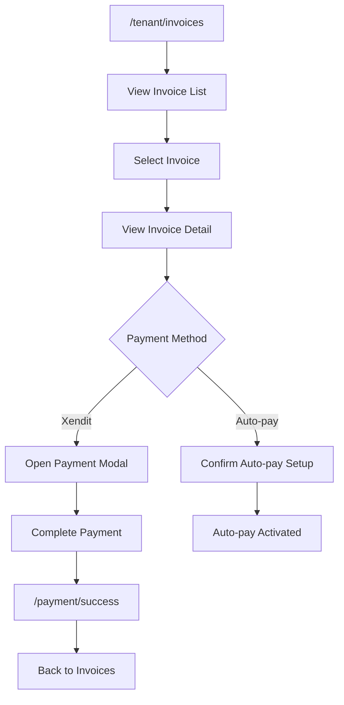
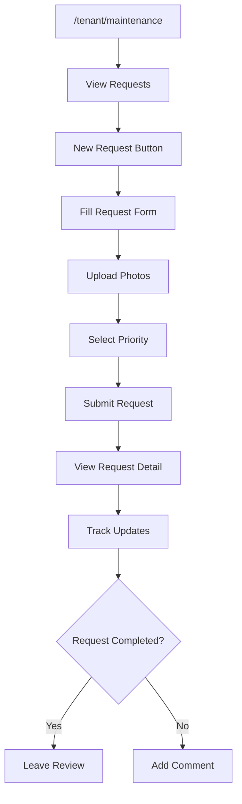
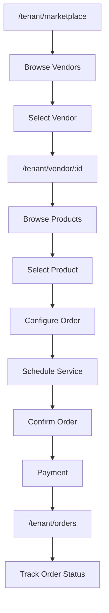

# UI/UX Flow Feedback: Tenant Module

## 📋 Overview

Modul tenant menangani pengalaman penghuni termasuk dashboard, pembayaran, marketplace, maintenance request, dan forum komunitas.

---

## 🗺️ User Journey Map

```
┌─────────────────────────────────────────────────────────────────────────────┐
│                           TENANT USER JOURNEY                                │
├─────────────────────────────────────────────────────────────────────────────┤
│                                                                              │
│  [Dashboard] ◄──────────────────────────────────────────────────────────┐   │
│      │                                                                   │   │
│      ├──► [Invoices] ──► [Pay Invoice] ──► [Payment Success] ──────────┘   │
│      │                                                                       │
│      ├──► [Contracts] ──► [Sign Contract] ──► [Active Contract]             │
│      │                                                                       │
│      ├──► [Maintenance] ──► [New Request] ──► [Track Status]                │
│      │                                                                       │
│      ├──► [Marketplace] ──► [Vendor] ──► [Order] ──► [Track Order]          │
│      │                                                                       │
│      ├──► [Forum] ──► [Post] ──► [Comments]                                 │
│      │                                                                       │
│      ├──► [Referrals] ──► [Share Link] ──► [Track Rewards]                  │
│      │                                                                       │
│      └──► [Settings] ──► [Profile] ──► [Notifications]                      │
│                                                                              │
└─────────────────────────────────────────────────────────────────────────────┘
```

---

## 🔄 Navigation Flow Analysis

### Mobile Bottom Navigation
| Position | Icon | Label | Route | Status |
|----------|------|-------|-------|--------|
| 1 | Home | Beranda | /tenant/dashboard | ✅ |
| 2 | FileText | Tagihan | /tenant/invoices | ✅ |
| 3 | Store | Pasar | /tenant/marketplace | ✅ |
| 4 | Wrench | Perbaikan | /tenant/maintenance | ✅ |
| 5 | MessageSquare | Forum | /tenant/forum | ✅ |

### Missing from Bottom Nav
- Settings/Profile (accessible via header)
- Contracts (accessible via dashboard)
- Orders (accessible via marketplace)
- Referrals (accessible via dashboard)

### Floating Action Button
| Feature | Status | Notes |
|---------|--------|-------|
| AI Chatbot | ✅ | Floating button bottom-right |
| Position | ⚠️ | Overlaps with bottom nav on some screens |

---

## 🎯 Critical User Flows

### 1. Invoice Payment Flow


### 2. Maintenance Request Flow


### 3. Marketplace Order Flow


---

## ⚠️ Issues & Recommendations

### High Severity

| ID | Issue | Current State | Impact | Recommendation |
|----|-------|---------------|--------|----------------|
| TEN-H01 | No payment confirmation dialog | Direct payment tanpa konfirmasi | Accidental payments | Tambah dialog konfirmasi dengan amount breakdown |
| TEN-H02 | Move-out notice tidak ada warning | User bisa submit tanpa notice period check | Penalty tidak jelas | Show penalty calculation before submit |

### Medium Severity

| ID | Issue | Current State | Impact | Recommendation |
|----|-------|---------------|--------|----------------|
| TEN-M01 | No pull-to-refresh | Manual refresh via button | Mobile UX suboptimal | Implement pull-to-refresh gesture |
| TEN-M02 | Photo upload progress unclear | No progress indicator | User tidak tahu status | Add progress bar dengan percentage |
| TEN-M03 | Forum reply notification missing | Tidak ada notifikasi | User miss updates | Implement push notification |
| TEN-M04 | Order tracking tidak real-time | Manual refresh | Outdated info | Add real-time status updates |
| TEN-M05 | Contract signing flow confusing | Multiple steps unclear | User dropout | Add step indicator dengan progress |

### Low Severity

| ID | Issue | Current State | Impact | Recommendation |
|----|-------|---------------|--------|----------------|
| TEN-L01 | No search history di marketplace | Fresh search setiap kali | Minor inconvenience | Implement recent searches |
| TEN-L02 | Referral link tidak bisa copy dengan satu tap | Manual select text | Friction | Add one-tap copy button |
| TEN-L03 | Invoice PDF download tidak ada loading | Instant but no feedback | User double-click | Add download progress |

---

## 📱 Mobile UX Assessment

### Current State
| Aspect | Score | Notes |
|--------|-------|-------|
| Bottom Navigation | 8/10 | Clear icons, proper spacing |
| Touch Targets | 7/10 | Some buttons too small |
| Scroll Performance | 8/10 | Smooth scrolling |
| Gesture Support | 5/10 | Limited gestures |
| Floating Elements | 6/10 | Chatbot overlaps content |

### Mobile-Specific Issues
| Issue | Impact | Recommendation |
|-------|--------|----------------|
| FAB overlaps bottom nav | Content hidden | Move FAB above bottom nav |
| Invoice table horizontal scroll | Awkward UX | Redesign as cards on mobile |
| Forum post editor | Keyboard covers input | Adjust viewport on focus |

### Recommendations
- [ ] Implement swipe gestures for navigation
- [ ] Add haptic feedback on actions
- [ ] Optimize image loading with lazy load
- [ ] Add offline mode for viewing invoices

---

## ♿ Accessibility Assessment

| Criteria | Status | Notes |
|----------|--------|-------|
| ARIA Labels | ⚠️ Partial | Bottom nav missing labels |
| Keyboard Navigation | ✅ Good | Tab order correct |
| Color Contrast | ✅ Good | Meets WCAG AA |
| Screen Reader | ⚠️ Partial | Dynamic content not announced |
| Touch Targets | ⚠️ Partial | Some < 44px |

### Recommendations
- [ ] Add aria-label to bottom nav icons
- [ ] Implement aria-live for status updates
- [ ] Increase touch target size to min 44px
- [ ] Add alternative text for all images

---

## ⚡ Performance UX

### Loading States
| Page | Current State | Recommendation |
|------|---------------|----------------|
| Dashboard | Skeleton loading | ✅ Good |
| Invoices | Spinner | Add skeleton cards |
| Marketplace | Spinner | Add skeleton grid |
| Maintenance | Skeleton | ✅ Good |
| Forum | Spinner | Add skeleton posts |

### Error Handling
| Error Type | Current | Recommendation |
|------------|---------|----------------|
| Network Error | Toast | Inline error with retry |
| Payment Failed | Redirect to /failed | Show inline with retry option |
| Form Error | Toast | Inline field errors |
| Empty State | Generic text | Contextual empty state with action |

### Optimistic Updates
| Action | Implemented | Notes |
|--------|-------------|-------|
| Like Post | ❌ No | Implement optimistic UI |
| Mark Notification Read | ❌ No | Implement optimistic UI |
| Submit Comment | ❌ No | Show pending state |

---

## 📊 Flow Diagram

```mermaid
flowchart TD
    subgraph Dashboard["Dashboard Hub"]
        Home["/tenant/dashboard"]
        QuickActions["Quick Actions"]
        RecentActivity["Recent Activity"]
    end

    subgraph Financial["Financial"]
        Invoices["/tenant/invoices"]
        Payments["/tenant/payments"]
        PaymentModal["Payment Modal"]
    end

    subgraph Property["Property"]
        Contracts["/tenant/contracts"]
        SignContract["/tenant/sign-contract/:id"]
        Maintenance["/tenant/maintenance"]
        MaintenanceDetail["/tenant/maintenance/:id"]
    end

    subgraph Marketplace["Marketplace"]
        Market["/tenant/marketplace"]
        VendorDetail["/tenant/vendor/:id"]
        Orders["/tenant/orders"]
    end

    subgraph Community["Community"]
        Forum["/tenant/forum"]
        ForumPost["/tenant/forum/:id"]
        Referrals["/tenant/referrals"]
    end

    subgraph Settings["Settings"]
        Profile["/tenant/profile"]
        Settings["/tenant/settings"]
    end

    Home --> QuickActions
    QuickActions --> Invoices
    QuickActions --> Maintenance
    QuickActions --> Market

    Invoices --> PaymentModal
    PaymentModal --> Payments

    Contracts --> SignContract
    Maintenance --> MaintenanceDetail

    Market --> VendorDetail
    VendorDetail --> Orders

    Forum --> ForumPost
    Home --> Referrals

    Home --> Profile
    Home --> Settings

    style Dashboard fill:#e3f2fd
    style Financial fill:#fff3e0
    style Property fill:#e8f5e9
    style Marketplace fill:#fce4ec
    style Community fill:#f3e5f5
    style Settings fill:#e0f2f1
```

---

## 🔔 Notification Touchpoints

| Event | In-App | Push | Email | WhatsApp |
|-------|--------|------|-------|----------|
| Invoice Generated | ✅ | ❌ | ✅ | ❌ |
| Payment Due Reminder | ✅ | ❌ | ✅ | ❌ |
| Payment Success | ✅ | ❌ | ✅ | ❌ |
| Maintenance Update | ✅ | ❌ | ❌ | ❌ |
| Order Status Change | ✅ | ❌ | ❌ | ❌ |
| Forum Reply | ✅ | ❌ | ❌ | ❌ |

### Recommendations
- [ ] Enable push notifications for critical events
- [ ] Add WhatsApp integration for payment reminders
- [ ] Allow notification preferences per category

---

## ✅ Summary Checklist

| Category | Critical | High | Medium | Low | Total |
|----------|----------|------|--------|-----|-------|
| Issues Found | 0 | 2 | 5 | 3 | 10 |
| Fixed | 0 | 0 | 0 | 0 | 0 |
| In Progress | 0 | 0 | 0 | 0 | 0 |
| Pending | 0 | 2 | 5 | 3 | 10 |

---

## 📝 Action Items

1. [ ] **TEN-H01**: Add payment confirmation dialog
2. [ ] **TEN-H02**: Show move-out penalty warning
3. [ ] **TEN-M01**: Implement pull-to-refresh
4. [ ] **TEN-M02**: Add photo upload progress bar
5. [ ] **TEN-M03**: Implement forum push notifications
6. [ ] **TEN-M04**: Add real-time order tracking
7. [ ] **TEN-M05**: Improve contract signing flow
8. [ ] **TEN-L01**: Add marketplace search history
9. [ ] **TEN-L02**: Add one-tap copy for referral link
10. [ ] **TEN-L03**: Add PDF download progress

---

*Last Updated: 2025-01-26*
*Reviewed By: System*
