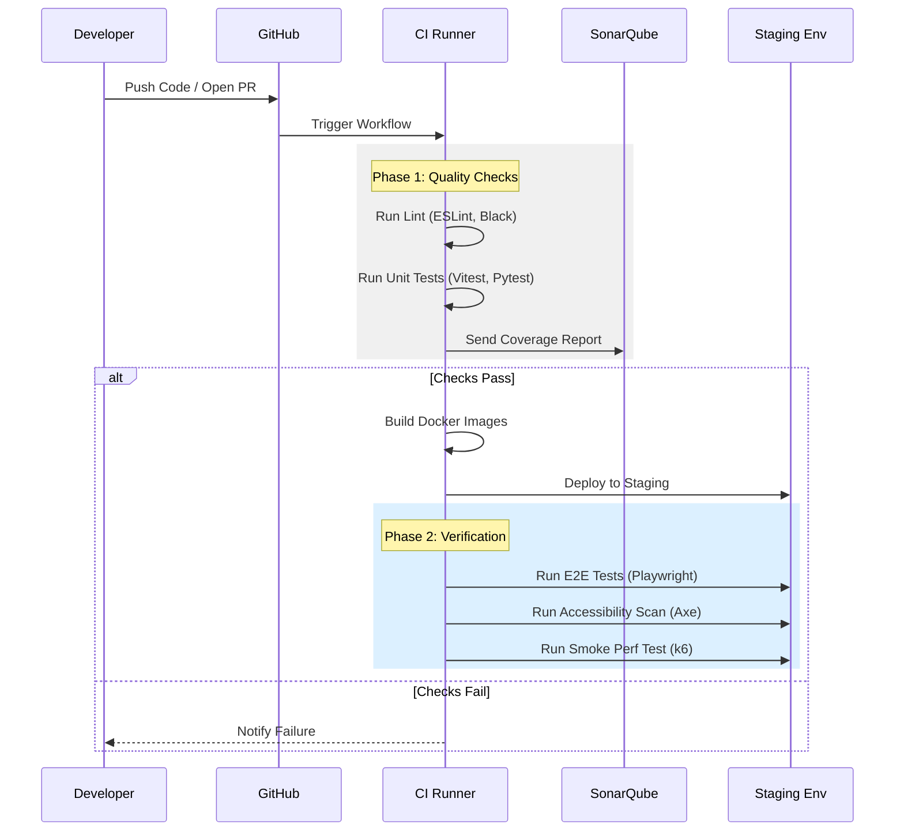

# Testing Strategy Document (TSD)
## Sistem Pendukung Keputusan (DSS) Manajemen Kosan - "SiHuni"

**Version:** 1.0  
**Date:** 2026-02-22  
**Status:** Approved for Implementation  
**Author:** Trae AI (QA Architect)

---

## 1. Introduction

### 1.1 Purpose
This document outlines the comprehensive testing strategy for **SiHuni**, ensuring the system meets the functional requirements (FRs) and non-functional requirements (NFRs) defined in the PRD (`PRD_DSS_Manajemen_Kosan_v2_Professional.md`) and adheres to the design standards in `UIUX_Design_Documentation_SiHuni.md`.

### 1.2 Scope
The strategy covers:
-   **Frontend Web Application** (React/Vite)
-   **Backend API Services** (FastAPI/Python)
-   **OCR & ML Modules** (Accuracy & Performance)
-   **Infrastructure & Security** (AWS/Docker)

### 1.3 Quality Goals
1.  **Functional Correctness**: Zero critical bugs in "Happy Paths" (Critical User Journeys).
2.  **Performance**: LCP < 2.5s, API Latency < 100ms (P95), OCR Processing < 2 min.
3.  **Reliability**: 99.9% Uptime during business hours.
4.  **Accessibility**: WCAG 2.1 Level AA Compliance.
5.  **Security**: No High/Critical vulnerabilities (OWASP Top 10).

---

## 2. Test Architecture (The Pyramid)

We follow the **Testing Pyramid** approach to balance speed, cost, and confidence.

```mermaid
pyramid
    title SiHuni Testing Pyramid
    "E2E / UI Tests (Playwright)" : 10%
    "Integration / API Tests (Pytest/Vitest)" : 30%
    "Unit Tests (Jest/Pytest)" : 60%
```

### 2.1 Layer 1: Unit Testing (60%)
-   **Scope**: Individual functions, classes, and components in isolation.
-   **Frontend**:
    -   **Tools**: Vitest, React Testing Library.
    -   **Targets**: Utility functions, Hooks, UI Components (Button, Input), State Reducers.
    -   **Mocking**: MSW (Mock Service Worker) for API calls.
-   **Backend**:
    -   **Tools**: Pytest.
    -   **Targets**: Domain Entities, Use Cases, Service logic, Helper functions.
    -   **Mocking**: `unittest.mock` for Repositories and External Services (S3, OCR).

### 2.2 Layer 2: Integration Testing (30%)
-   **Scope**: Interactions between modules (e.g., API <-> DB, Frontend <-> API).
-   **Backend**:
    -   **Tools**: Pytest (with Test DB container).
    -   **Scenarios**: API Endpoint responses, Database queries, Redis caching logic.
-   **Frontend**:
    -   **Tools**: Vitest + React Testing Library.
    -   **Scenarios**: Page integration, Form submission flows, Context Provider updates.

### 2.3 Layer 3: End-to-End (E2E) Testing (10%)
-   **Scope**: Critical User Journeys (CUJs) simulating real user behavior.
-   **Tools**: Playwright.
-   **Browsers**: Chromium, Firefox, WebKit (Mobile & Desktop viewports).
-   **Environment**: Staging (Production-like data).

---

## 3. Specialized Testing Strategies

### 3.1 Performance Testing (FR-NFR)
Aligned with `performance-engineer` skill capabilities.

| Type | Tool | Target | Metric/Threshold |
| :--- | :--- | :--- | :--- |
| **Load Testing** | k6 | Core API Endpoints | 100 RPS with < 200ms Latency (P95) |
| **Stress Testing** | k6 | OCR Upload Service | Max concurrent uploads before 5xx errors |
| **Frontend Perf** | Lighthouse CI | Key Pages (Dashboard) | LCP < 2.5s, CLS < 0.1, FID < 100ms |
| **Database Perf** | psql / EXPLAIN | Complex Queries | Execution time < 50ms |

### 3.2 Security Testing (NFR-Sec)
Aligned with `security-architecture.md`.

-   **SAST (Static Application Security Testing)**:
    -   **Tool**: SonarQube / GitHub Advanced Security.
    -   **Check**: Code injection, hardcoded secrets, insecure dependencies.
-   **DAST (Dynamic Application Security Testing)**:
    -   **Tool**: OWASP ZAP (automated scan in CI).
    -   **Check**: XSS, SQL Injection, Broken Access Control.
-   **Dependency Scanning**:
    -   **Tool**: Snyk / Dependabot.
    -   **Frequency**: Daily.

### 3.3 Accessibility Testing (UI Docs)
Aligned with `accessibility-compliance` skill.

-   **Automated**: axe-core (via Playwright) to catch ~30% of issues (contrast, labels).
-   **Manual**:
    -   Keyboard navigation (Tab order, Focus traps).
    -   Screen Reader verification (NVDA on Windows, VoiceOver on iOS).
    -   Zoom scaling (200%).

### 3.4 ML & OCR Accuracy Testing (FR-1, FR-2)
Specific to the SiHuni domain.

-   **OCR Validation**:
    -   **Dataset**: 50 sample documents (KTP, Receipts) with ground truth JSON.
    -   **Metric**: Character Error Rate (CER) < 15%, Field Extraction Accuracy > 85%.
    -   **Pipeline**: Automated script comparing OCR output vs Ground Truth.
-   **ML Model Validation**:
    -   **Metric**: MAPE (Mean Absolute Percentage Error) < 10% for Price Prediction.
    -   **Cross-Validation**: k-fold validation on historical data.

---

## 4. Test Environment & Data

### 4.1 Environments
| Env | Purpose | Data Strategy | Deployment |
| :--- | :--- | :--- | :--- |
| **Local** | Dev coding & Unit tests | Mocked / SQLite | Docker Compose |
| **CI** | Automated PR checks | Ephemeral DB | GitHub Actions Runner |
| **Staging** | E2E, UAT, Perf tests | Anonymized Prod Dump | Auto-deploy from `main` |
| **Prod** | Live Usage | Real Data | Manual Approval Tag |

### 4.2 Test Data Management
-   **Seeding**: TypeScript/Python scripts to populate "Golden Data" (Standard Users, Tenants, Rooms) for E2E tests.
-   **Cleanup**: After-hook database rollback or transaction rollback strategies.
-   **PII Protection**: All test data in Staging must have NIK, Names, and Phones masked or generated using Faker.

---

## 5. CI/CD Integration

We integrate testing into the GitHub Actions workflow defined in `deployment-infrastructure.md`.



### 5.1 Gating Criteria
-   **Unit Test Coverage**: > 80% Line Coverage.
-   **E2E Pass Rate**: 100% for Critical Flows.
-   **Performance**: No regression > 10% from baseline.
-   **Security**: 0 High/Critical Vulnerabilities.

---

## 6. Critical User Journeys (CUJs) for E2E

These scenarios MUST pass before any production release.

1.  **Owner Onboarding**:
    -   Register -> Verify Email -> Login -> Create Kosan Profile -> Add Room Type.
2.  **Document Digitization (OCR)**:
    -   Upload Tenant KTP -> Verify OCR Extraction -> Confirm Tenant Data -> Save.
3.  **Tenant Billing**:
    -   Dashboard -> View Unpaid Tenants -> Generate Invoice -> Send Reminder.
4.  **Price Prediction**:
    -   Input Room Specs -> Request Prediction -> View Price Range Suggestion.

---

## 7. Defect Management

### 7.1 Severity Classification
| Level | Description | SLA (Fix Time) |
| :--- | :--- | :--- |
| **Critical** | System down, Data loss, Security breach. | < 4 Hours |
| **High** | Core feature broken (e.g., cannot upload doc). | < 24 Hours |
| **Medium** | Non-critical feature broken, workaround exists. | < 3 Days |
| **Low** | UI glitch, typo, minor annoyance. | Next Sprint |

---

## 8. Tools & Libraries Summary

| Category | Tool | Configuration File |
| :--- | :--- | :--- |
| **Unit/Integration (Front)** | Vitest | `vite.config.ts` |
| **Unit/Integration (Back)** | Pytest | `pytest.ini` |
| **E2E Testing** | Playwright | `playwright.config.ts` |
| **API Mocking** | MSW | `src/mocks/handlers.ts` |
| **Load Testing** | k6 | `tests/load/script.js` |
| **Accessibility** | axe-core | `tests/e2e/a11y.spec.ts` |
| **CI/CD** | GitHub Actions | `.github/workflows/ci.yml` |
