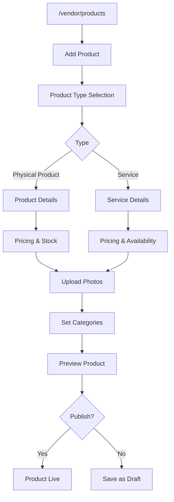
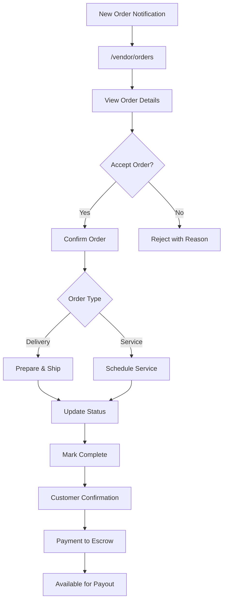
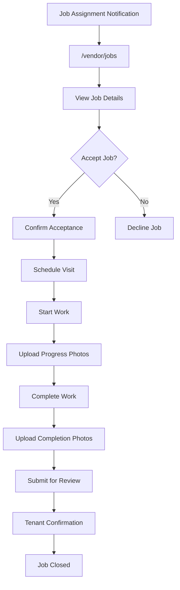
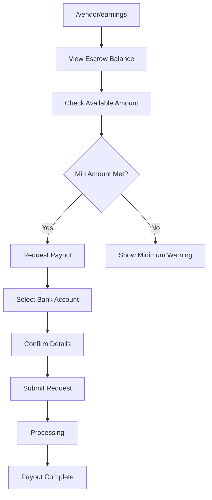
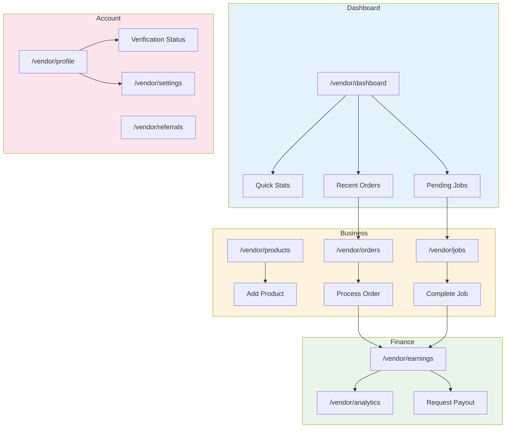
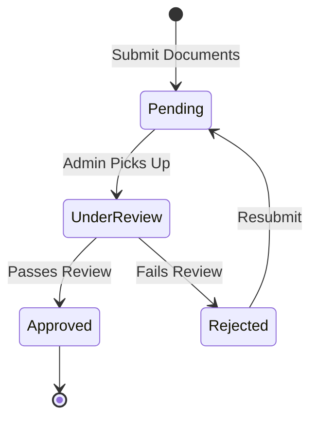
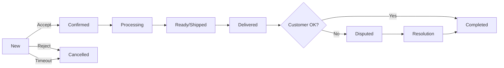

# UI/UX Flow Feedback: Vendor Module

## 📋 Overview

Modul vendor menangani pengelolaan produk/jasa, pesanan, pekerjaan maintenance, penghasilan, dan analytics untuk penyedia layanan di marketplace.

---

## 🗺️ User Journey Map

```
┌─────────────────────────────────────────────────────────────────────────────┐
│                           VENDOR USER JOURNEY                                │
├─────────────────────────────────────────────────────────────────────────────┤
│                                                                              │
│  [Dashboard] ◄──────────────────────────────────────────────────────────┐   │
│      │                                                                   │   │
│      ├──► [Products] ──► [Add Product] ──► [Manage Inventory]           │   │
│      │                                                                   │   │
│      ├──► [Orders] ──► [Accept Order] ──► [Process] ──► [Complete]     │   │
│      │                                                                   │   │
│      ├──► [Jobs] ──► [Accept Job] ──► [Start Work] ──► [Submit]        │   │
│      │                                                                   │   │
│      ├──► [Earnings] ──► [View Balance] ──► [Request Payout]           │   │
│      │                                                                   │   │
│      ├──► [Analytics] ──► [Sales Report] ──► [Customer Insights]       │   │
│      │                                                                   │   │
│      ├──► [Referrals] ──► [Share Code] ──► [Track Rewards]             │   │
│      │                                                                   │   │
│      └──► [Settings] ──► [Profile] ──► [Verification] ──► [Bank]       │   │
│                                                                              │
└─────────────────────────────────────────────────────────────────────────────┘
```

---

## 🔄 Navigation Flow Analysis

### Sidebar Navigation Structure
```
├── Dashboard
├── Business
│   ├── Products
│   ├── Orders
│   └── Jobs (Maintenance)
├── Finance
│   ├── Earnings
│   └── Analytics
├── Growth
│   └── Referrals
├── Account
│   ├── Profile
│   └── Settings
```

### Navigation Issues
| Issue | Impact | Recommendation |
|-------|--------|----------------|
| Orders vs Jobs confusion | Similar but different | Rename/clarify dengan icons |
| Earnings buried | Key metric hidden | Add to dashboard widget |
| Verification status unclear | User doesn't know progress | Add status badge in header |

---

## 🎯 Critical User Flows

### 1. Product Creation Flow


### 2. Order Processing Flow


### 3. Maintenance Job Flow


### 4. Payout Request Flow


---

## ⚠️ Issues & Recommendations

### High Severity

| ID | Issue | Current State | Impact | Recommendation |
|----|-------|---------------|--------|----------------|
| VEN-H01 | No real-time order notification | Manual refresh | Missed orders | Implement push notification + sound |
| VEN-H02 | Order auto-reject timer unclear | Hidden countdown | Order rejected unexpectedly | Show prominent countdown timer |

### Medium Severity

| ID | Issue | Current State | Impact | Recommendation |
|----|-------|---------------|--------|----------------|
| VEN-M01 | Product draft/preview missing | No preview before publish | Quality issues | Add preview mode |
| VEN-M02 | Verification progress tracker unclear | Status text only | Confusion | Add visual progress stepper |
| VEN-M03 | Earnings pending vs available unclear | Numbers only | Financial confusion | Add visual breakdown chart |
| VEN-M04 | No bulk product management | One-by-one edit | Time consuming | Add bulk edit/delete |

### Low Severity

| ID | Issue | Current State | Impact | Recommendation |
|----|-------|---------------|--------|----------------|
| VEN-L01 | Analytics tidak downloadable | View only | Can't share | Add export to PDF/CSV |

---

## 📱 Mobile UX Assessment

### Current State
| Aspect | Score | Notes |
|--------|-------|-------|
| Responsive Layout | 7/10 | Forms could be better |
| Touch Targets | 7/10 | Adequate size |
| Order Management | 6/10 | Complex on mobile |
| Photo Upload | 8/10 | Good camera integration |

### Mobile-Specific Issues
| Issue | Impact | Recommendation |
|-------|--------|----------------|
| Order list cramped | Hard to scan | Redesign as swipeable cards |
| Product form long | Scroll fatigue | Break into steps |
| Analytics charts | Too small | Add full-screen mode |

### Recommendations
- [ ] Redesign order cards for mobile
- [ ] Add swipe actions (accept/reject)
- [ ] Implement step-by-step product form
- [ ] Add floating action button for quick add

---

## ♿ Accessibility Assessment

| Criteria | Status | Notes |
|----------|--------|-------|
| ARIA Labels | ⚠️ Partial | Icons missing labels |
| Keyboard Navigation | ✅ Good | Forms accessible |
| Color Contrast | ✅ Good | Meets standards |
| Screen Reader | ⚠️ Partial | Status updates not announced |
| Image Alt Text | ⚠️ Partial | Product images need alts |

### Recommendations
- [ ] Add ARIA labels to action icons
- [ ] Announce order status changes
- [ ] Require alt text for product images
- [ ] Add keyboard shortcuts for common actions

---

## ⚡ Performance UX

### Loading States
| Page | Current State | Recommendation |
|------|---------------|----------------|
| Dashboard | Skeleton | ✅ Good |
| Products | Spinner | Add skeleton grid |
| Orders | Spinner | Add skeleton cards |
| Analytics | Spinner | Add chart skeleton |

### Real-time Updates
| Feature | Implemented | Notes |
|---------|-------------|-------|
| New Orders | ❌ No | Need real-time subscription |
| Order Status | ❌ No | Manual refresh |
| Earnings Balance | ❌ No | Manual refresh |

### Recommendations
- [ ] Implement Supabase Realtime for orders
- [ ] Add optimistic UI for status updates
- [ ] Cache product list with invalidation

---

## 📊 Flow Diagram



---

## 🔔 Notification Touchpoints

| Event | In-App | Push | Email | WhatsApp |
|-------|--------|------|-------|----------|
| New Order | ✅ | ❌ | ✅ | ❌ |
| Order Auto-reject Warning | ✅ | ❌ | ❌ | ❌ |
| New Job Assignment | ✅ | ❌ | ✅ | ❌ |
| Payout Complete | ✅ | ❌ | ✅ | ❌ |
| Verification Status Change | ✅ | ❌ | ✅ | ❌ |
| Low Rating Alert | ✅ | ❌ | ❌ | ❌ |

### Critical Missing Notifications
- [ ] Push notification for new orders (HIGH PRIORITY)
- [ ] Sound alert for incoming orders
- [ ] WhatsApp for urgent job assignments

---

## 📈 Verification Status Flow



### Verification UI Issues
| Issue | Recommendation |
|-------|----------------|
| Status not prominent | Add banner at top of dashboard |
| Rejection reason hidden | Show inline with resubmit CTA |
| Document requirements unclear | Add checklist with examples |

---

## 🎨 Order Status Visual Flow



---

## ✅ Summary Checklist

| Category | Critical | High | Medium | Low | Total |
|----------|----------|------|--------|-----|-------|
| Issues Found | 0 | 2 | 4 | 1 | 7 |
| Fixed | 0 | 0 | 0 | 0 | 0 |
| In Progress | 0 | 0 | 0 | 0 | 0 |
| Pending | 0 | 2 | 4 | 1 | 7 |

---

## 📝 Action Items

1. [ ] **VEN-H01**: Implement real-time order notifications
2. [ ] **VEN-H02**: Show order auto-reject countdown timer
3. [ ] **VEN-M01**: Add product preview before publish
4. [ ] **VEN-M02**: Create verification progress stepper
5. [ ] **VEN-M03**: Add earnings breakdown visualization
6. [ ] **VEN-M04**: Implement bulk product management
7. [ ] **VEN-L01**: Add analytics export feature

---

*Last Updated: 2025-01-26*
*Reviewed By: System*
