# Merchant Activity Diagrams

> Dokumentasi lengkap semua alur aktivitas merchant dalam bentuk Mermaid flowchart diagrams.
> Setiap diagram merepresentasikan satu domain operasional merchant.
>
> **Sumber data**: `state-machines.ts`, edge functions, database triggers, dan page flows.
>
> **Konvensi**:
> - 🟢 Hijau: Start / Success / Terminal positif
> - 🔴 Merah: Terminal negatif / Error
> - 🔵 Biru: Proses utama
> - 🟡 Kuning: Decision / Branch
> - `<<edge function>>` = Supabase Edge Function
> - `<<trigger>>` = Database Trigger
> - `[See Diagram X]` = Cross-reference ke diagram lain

---

## Daftar Isi

1. [Merchant Onboarding & Verification](#1-merchant-onboarding--verification-flow)
2. [Subscription Lifecycle](#2-subscription-lifecycle)
3. [Property & Unit Management](#3-property--unit-management)
4. [Contract Lifecycle](#4-contract-lifecycle)
5. [Tenant Management](#5-tenant-management-flow)
6. [Invoice Lifecycle](#6-invoice-lifecycle)
7. [Payment & Payment Verification](#7-payment--payment-verification-flow)
8. [Escrow & Disbursement](#8-escrow--disbursement-flow)
9. [Move-Out & Deposit Refund](#9-move-out--deposit-refund-flow)
10. [Maintenance Request Lifecycle](#10-maintenance-request-lifecycle)
11. [Billing Analytics & Collections](#11-billing-analytics--collections)
12. [AI/ML & DSS Advisory](#12-aiml--dss-advisory-flow)
13. [Referral System](#13-referral-system)
14. [Support, Feedback & Compliance](#14-support-feedback--compliance)

---

## 1. Merchant Onboarding & Verification Flow

Alur registrasi merchant baru hingga verifikasi oleh admin. State machine: `MERCHANT_VERIFICATION_TRANSITIONS`.

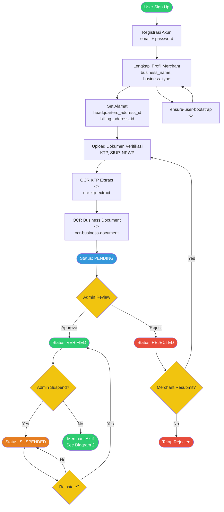

**State Machine** (`MERCHANT_VERIFICATION_TRANSITIONS`):
| From | To |
|------|-----|
| `pending` | `verified`, `rejected` |
| `rejected` | `pending` (resubmit) |
| `verified` | `suspended` |
| `suspended` | `verified` |

---

## 2. Subscription Lifecycle

Alur langganan merchant dari pemilihan tier hingga cancellation. State machine: `SUBSCRIPTION_STATUS_TRANSITIONS`.

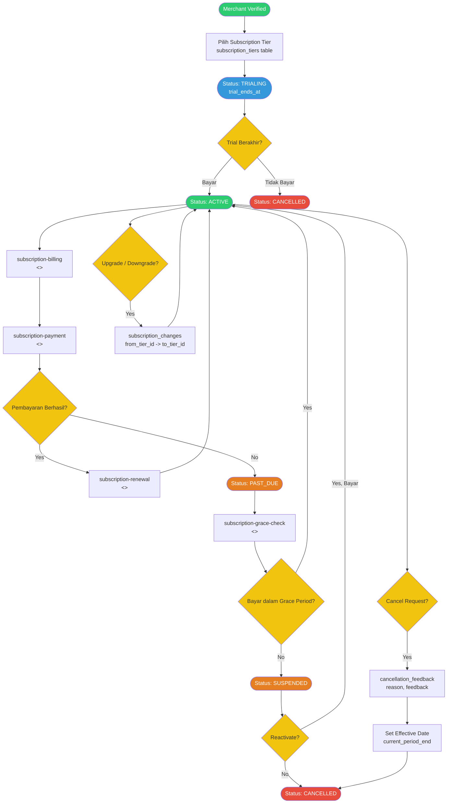

**State Machine** (`SUBSCRIPTION_STATUS_TRANSITIONS`):
| From | To |
|------|-----|
| `trialing` | `active`, `cancelled` |
| `active` | `past_due`, `cancelled` |
| `past_due` | `active`, `suspended` |
| `suspended` | `active`, `cancelled` |
| `cancelled` | _(terminal)_ |

**Edge Functions**:
- `subscription-billing` — Generate tagihan berkala
- `subscription-payment` — Proses pembayaran
- `subscription-renewal` — Perpanjang langganan
- `subscription-grace-check` — Cek grace period

---

## 3. Property & Unit Management

Alur pengelolaan properti, unit, fasilitas, dan compliance documents.

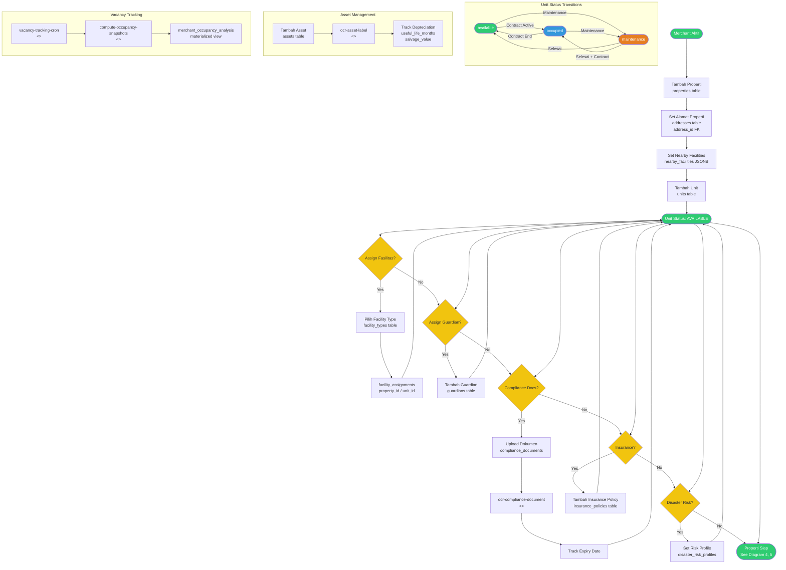

**State Machine** (`UNIT_STATUS_TRANSITIONS`):
| From | To |
|------|-----|
| `available` | `occupied`, `maintenance` |
| `occupied` | `available`, `maintenance` |
| `maintenance` | `available`, `occupied` |

---

## 4. Contract Lifecycle

Alur kontrak dari draft hingga selesai/terminasi. Melibatkan tanda tangan digital merchant dan tenant.

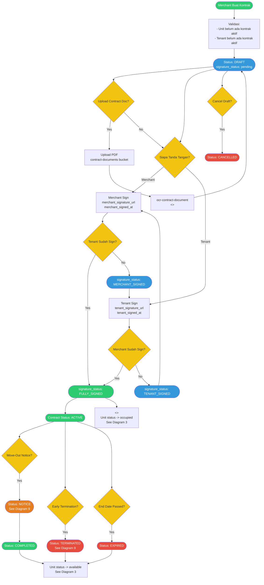

**State Machine** (`CONTRACT_STATUS_TRANSITIONS`):
| From | To |
|------|-----|
| `draft` | `active`, `cancelled` |
| `pending_signature` | `active`, `cancelled` _(legacy)_ |
| `active` | `notice`, `terminated`, `expired` |
| `notice` | `completed` |
| `terminated` | _(terminal)_ |
| `expired` | _(terminal)_ |
| `completed` | _(terminal)_ |
| `cancelled` | _(terminal)_ |

**Signature Sub-States** (`CONTRACT_SIGNATURE_TRANSITIONS`):
| From | To |
|------|-----|
| `pending` | `merchant_signed`, `tenant_signed` |
| `merchant_signed` | `fully_signed` |
| `tenant_signed` | `fully_signed` |
| `fully_signed` | _(terminal — triggers active + unit occupied)_ |

---

## 5. Tenant Management Flow

Alur undangan tenant, pembuatan akun, dan linking ke kontrak/unit.

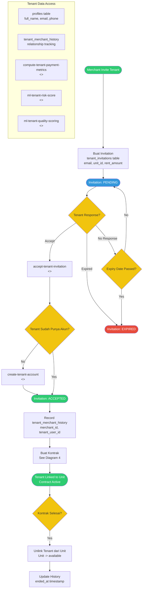

**State Machine** (`TENANT_INVITATION_TRANSITIONS`):
| From | To |
|------|-----|
| `pending` | `accepted`, `expired` |
| `accepted` | _(terminal)_ |
| `expired` | _(terminal)_ |

**Edge Functions**:
- `accept-tenant-invitation` — Proses penerimaan undangan
- `create-tenant-account` — Buat akun tenant baru
- `get-tenant-invitation` — Ambil detail undangan

---

## 6. Invoice Lifecycle

Alur invoice dari auto-generate hingga pembayaran atau eskalasi overdue.

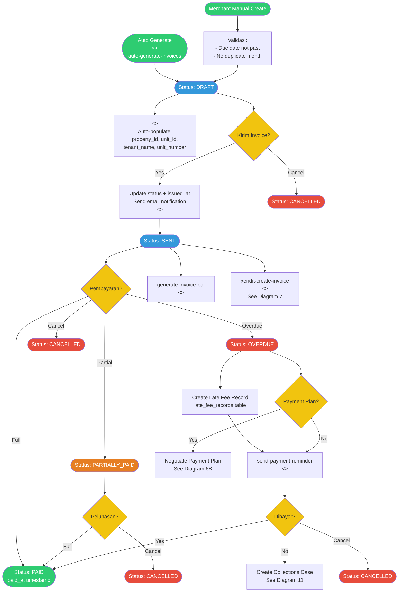

### 6B. Payment Plan Sub-Flow

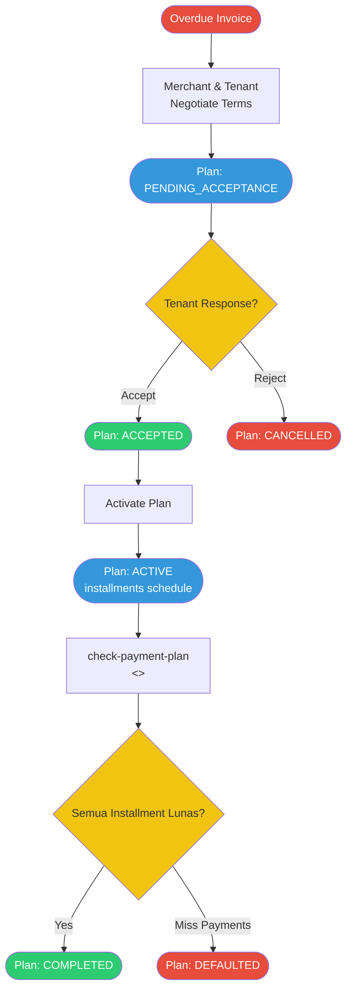

**State Machine** (`INVOICE_STATUS_TRANSITIONS`):
| From | To |
|------|-----|
| `draft` | `sent`, `cancelled` |
| `sent` | `paid`, `overdue`, `cancelled`, `partially_paid` |
| `overdue` | `paid`, `cancelled` |
| `partially_paid` | `paid`, `cancelled` |
| `pending` | `paid`, `overdue`, `cancelled` _(legacy)_ |
| `paid` | _(terminal)_ |
| `cancelled` | _(terminal)_ |

**Payment Plan** (`PAYMENT_PLAN_STATUS_TRANSITIONS`):
| From | To |
|------|-----|
| `pending_acceptance` | `accepted`, `cancelled` |
| `accepted` | `active` |
| `active` | `completed`, `defaulted` |

---

## 7. Payment & Payment Verification Flow

Alur pembayaran tenant, verifikasi OCR, dan integrasi Xendit payment gateway.

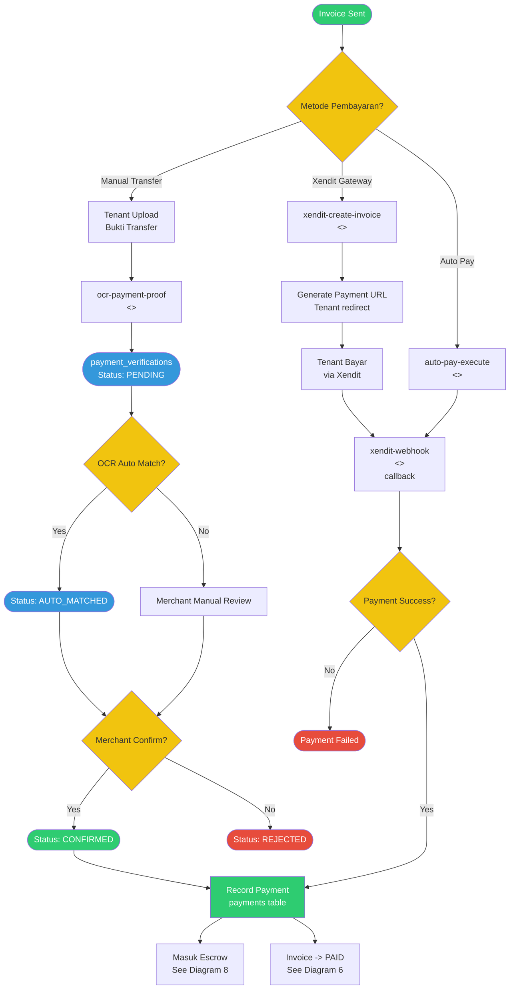

**State Machine** (`PAYMENT_VERIFICATION_TRANSITIONS`):
| From | To |
|------|-----|
| `pending` | `auto_matched`, `confirmed`, `rejected` |
| `auto_matched` | `confirmed`, `rejected` |
| `confirmed` | _(terminal)_ |
| `rejected` | _(terminal)_ |

**Payment Status** (`PAYMENT_STATUS_TRANSITIONS`):
| From | To |
|------|-----|
| `pending` | `paid`, `overdue`, `failed` |
| `overdue` | `paid` |
| `paid` | _(terminal)_ |
| `failed` | _(terminal)_ |

---

## 8. Escrow & Disbursement Flow

Alur dana masuk escrow dan pencairan ke rekening merchant.

```mermaid
flowchart TD
    START([Payment Confirmed]) --> ESC_TX[Create escrow_transaction<br/>type: deposit<br/>gross_amount, platform_fee, gateway_fee]
    ESC_TX --> ESC_PENDING([Escrow TX: PENDING])

    ESC_PENDING --> PROCESS{Processing?}
    PROCESS -->|Success| ESC_COMPLETED([Escrow TX: COMPLETED<br/>Update escrow_accounts.balance])
    PROCESS -->|Fail| ESC_FAILED([Escrow TX: FAILED])

    ESC_COMPLETED --> DISB_CHECK{Disbursement Eligible?}
    DISB_CHECK -->|Yes| DISB_CREATE[Create Disbursement<br/>disbursements table]
    DISB_CHECK -->|Scheduled| SCHEDULED["scheduled-disbursement<br/><<edge function>>"]
    SCHEDULED --> DISB_CREATE

    DISB_CREATE --> DISB_PENDING([Disbursement: PENDING])
    DISB_PENDING --> APPROVAL{Approval Required?}
    APPROVAL -->|Manual Review| REVIEW[Admin/Auto Review<br/>requires_manual_review flag]
    REVIEW --> REVIEW_OK{Approved?}
    REVIEW_OK -->|Yes| DISB_APPROVED([Status: APPROVED])
    REVIEW_OK -->|No| DISB_REJECTED([Status: REJECTED])
    APPROVAL -->|Auto| DISB_APPROVED

    DISB_APPROVED --> XENDIT_DISB["xendit-disbursement<br/><<edge function>>"]
    XENDIT_DISB --> DISB_PROCESSING([Status: PROCESSING])
    DISB_PROCESSING --> XENDIT_WH["xendit-disbursement-webhook<br/><<edge function>>"]
    XENDIT_WH --> DISB_RESULT{Result?}
    DISB_RESULT -->|Success| DISB_COMPLETED([Status: COMPLETED<br/>Merchant receives funds])
    DISB_RESULT -->|Fail| DISB_FAILED([Status: FAILED])
    DISB_FAILED --> RETRY{Retry?}
    RETRY -->|Yes| DISB_PENDING
    RETRY -->|No| DISB_FAILED_FINAL([Failed - Final])

    subgraph BANK_MGMT [Bank Account Management]
        BANK_ADD[Tambah Bank Account<br/>bank_accounts table]
        BANK_PRIMARY[Set Primary Account<br/>is_primary flag]
    end

    style START fill:#2ecc71,color:#fff
    style ESC_COMPLETED fill:#2ecc71,color:#fff
    style DISB_COMPLETED fill:#2ecc71,color:#fff
    style ESC_PENDING fill:#3498db,color:#fff
    style DISB_PENDING fill:#3498db,color:#fff
    style DISB_APPROVED fill:#3498db,color:#fff
    style DISB_PROCESSING fill:#3498db,color:#fff
    style ESC_FAILED fill:#e74c3c,color:#fff
    style DISB_REJECTED fill:#e74c3c,color:#fff
    style DISB_FAILED fill:#e74c3c,color:#fff
    style DISB_FAILED_FINAL fill:#e74c3c,color:#fff
    style PROCESS fill:#f1c40f,color:#333
    style DISB_CHECK fill:#f1c40f,color:#333
    style APPROVAL fill:#f1c40f,color:#333
    style REVIEW_OK fill:#f1c40f,color:#333
    style DISB_RESULT fill:#f1c40f,color:#333
    style RETRY fill:#f1c40f,color:#333
```

**State Machine** (`ESCROW_TRANSACTION_TRANSITIONS`):
| From | To |
|------|-----|
| `pending` | `completed`, `failed` |

**Disbursement** (`DISBURSEMENT_STATUS_TRANSITIONS`):
| From | To |
|------|-----|
| `pending` | `approved`, `rejected` |
| `approved` | `processing` |
| `processing` | `completed`, `failed` |
| `failed` | `pending` _(retry)_ |
| `completed` | _(terminal)_ |
| `rejected` | _(terminal)_ |

---

## 9. Move-Out & Deposit Refund Flow

Alur move-out notice, inspeksi, early termination, dan deposit refund/dispute.

```mermaid
flowchart TD
    START([Tenant/Merchant Initiate Move-Out]) --> NOTICE_TYPE{Jenis?}

    NOTICE_TYPE -->|Normal Notice| NOTICE_SUB[Submit move_out_notices<br/>notice_date, expected_move_out_date]
    NOTICE_SUB --> NOTICE_PENDING([Notice: SUBMITTED])
    NOTICE_PENDING --> ACK{Merchant Acknowledge?}
    ACK -->|Yes| NOTICE_ACK([Notice: ACKNOWLEDGED])
    ACK -->|Reject| NOTICE_REJ([Notice: REJECTED])
    NOTICE_ACK --> APPROVE{Approve Move-Out?}
    APPROVE -->|Yes| NOTICE_APPROVED([Notice: APPROVED])
    NOTICE_APPROVED --> INSPECTION_SCHED

    NOTICE_TYPE -->|Early Termination| ET_REQ[Submit early_termination_requests<br/>reason, requested_date]
    ET_REQ --> ET_PENDING([ET: PENDING_APPROVAL])
    ET_PENDING --> ET_DECISION{Merchant Decision?}
    ET_DECISION -->|Approve| ET_APPROVED([ET: APPROVED<br/>penalty_amount])
    ET_DECISION -->|Deny| ET_DENIED([ET: DENIED])
    ET_DECISION -->|Counter Offer| ET_COUNTER([ET: COUNTER_OFFERED<br/>counter_offer_amount])
    ET_COUNTER --> ET_DECISION2{Tenant Accept Counter?}
    ET_DECISION2 -->|Yes| ET_APPROVED
    ET_DECISION2 -->|No| ET_DENIED
    ET_APPROVED --> CONTRACT_TERM["Contract -> TERMINATED<br/>See Diagram 4"]
    ET_APPROVED --> INSPECTION_SCHED

    INSPECTION_SCHED[Schedule Inspection<br/>move_out_inspections] --> INSP_SCHED([Inspection: SCHEDULED])
    INSP_SCHED --> INSP_START[Start Inspection]
    INSP_START --> INSP_PROG([Inspection: IN_PROGRESS])
    INSP_PROG --> INSP_COMPLETE([Inspection: COMPLETED<br/>inspection results])

    INSP_COMPLETE --> TASKS[Move-Out Tasks<br/>move_out_tasks table<br/>timeline tracking]
    TASKS --> DEPOSIT_CALC[Calculate Deposit Refund<br/>original_deposit - deductions]

    DEPOSIT_CALC --> DEP_PENDING([Deposit: PENDING_PROCESSING])
    DEP_PENDING --> DEP_APPROVE{Approved?}
    DEP_APPROVE -->|Yes| DEP_APPROVED([Deposit: APPROVED])
    DEP_APPROVE -->|No| DEP_REJECTED([Deposit: REJECTED])

    DEP_APPROVED --> DEP_PROCESS["process-deposit-refund<br/><<edge function>>"]
    DEP_PROCESS --> DEP_PROCESSING([Deposit: PROCESSING])
    DEP_PROCESSING --> DEP_COMPLETE([Deposit: COMPLETED<br/>refunded_at])

    DEP_COMPLETE --> NOTICE_DONE([Notice: COMPLETED])
    NOTICE_DONE --> UNIT_FREE["Unit -> available<br/>See Diagram 3"]

    DEP_PENDING --> DISPUTE{Tenant Dispute?}
    DISPUTE -->|Yes| DISP_OPEN([deposit_disputes<br/>Status: OPEN])
    DISP_OPEN --> DISP_RESOLVE[Merchant Response<br/>Admin Resolution]
    DISP_RESOLVE --> DISP_RESOLVED([Dispute: RESOLVED<br/>resolved_amount])

    style START fill:#2ecc71,color:#fff
    style NOTICE_DONE fill:#2ecc71,color:#fff
    style DEP_COMPLETE fill:#2ecc71,color:#fff
    style ET_APPROVED fill:#2ecc71,color:#fff
    style INSP_COMPLETE fill:#2ecc71,color:#fff
    style DISP_RESOLVED fill:#2ecc71,color:#fff
    style NOTICE_PENDING fill:#3498db,color:#fff
    style NOTICE_ACK fill:#3498db,color:#fff
    style NOTICE_APPROVED fill:#3498db,color:#fff
    style INSP_SCHED fill:#3498db,color:#fff
    style INSP_PROG fill:#3498db,color:#fff
    style DEP_PENDING fill:#3498db,color:#fff
    style DEP_APPROVED fill:#3498db,color:#fff
    style DEP_PROCESSING fill:#3498db,color:#fff
    style ET_PENDING fill:#3498db,color:#fff
    style NOTICE_REJ fill:#e74c3c,color:#fff
    style ET_DENIED fill:#e74c3c,color:#fff
    style DEP_REJECTED fill:#e74c3c,color:#fff
    style ET_COUNTER fill:#e67e22,color:#fff
    style DISP_OPEN fill:#e67e22,color:#fff
    style NOTICE_TYPE fill:#f1c40f,color:#333
    style ACK fill:#f1c40f,color:#333
    style APPROVE fill:#f1c40f,color:#333
    style ET_DECISION fill:#f1c40f,color:#333
    style ET_DECISION2 fill:#f1c40f,color:#333
    style DEP_APPROVE fill:#f1c40f,color:#333
    style DISPUTE fill:#f1c40f,color:#333
```

**State Machines**:

Move-Out Notice (`MOVE_OUT_NOTICE_TRANSITIONS`):
| From | To |
|------|-----|
| `submitted` | `acknowledged`, `rejected` |
| `acknowledged` | `approved` |
| `approved` | `completed` |

Move-Out Inspection (`MOVE_OUT_INSPECTION_TRANSITIONS`):
| From | To |
|------|-----|
| `scheduled` | `in_progress` |
| `in_progress` | `completed` |

Early Termination (`EARLY_TERMINATION_TRANSITIONS`):
| From | To |
|------|-----|
| `pending_approval` | `approved`, `denied`, `counter_offered` |
| `counter_offered` | `approved`, `denied` |

Deposit Refund (`DEPOSIT_REFUND_TRANSITIONS`):
| From | To |
|------|-----|
| `pending_processing` | `approved`, `rejected` |
| `approved` | `processing` |
| `processing` | `completed` |

---

## 10. Maintenance Request Lifecycle

Alur permintaan maintenance dari tenant, penugasan vendor, hingga penyelesaian.

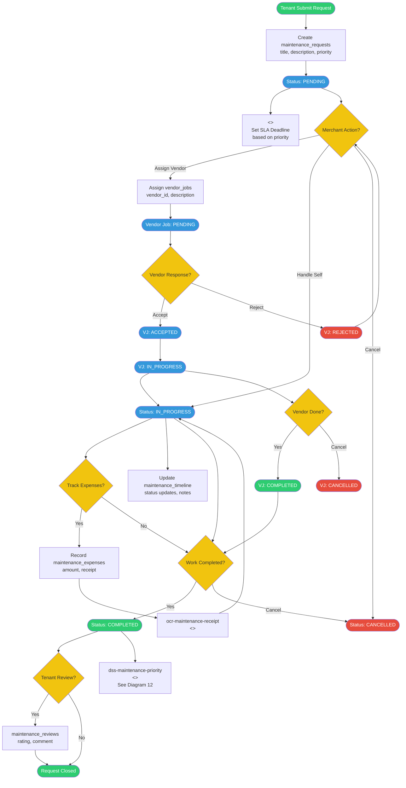

**State Machine** (`MAINTENANCE_STATUS_TRANSITIONS`):
| From | To |
|------|-----|
| `pending` | `in_progress`, `cancelled` |
| `in_progress` | `completed`, `cancelled` |

**Vendor Job** (`VENDOR_JOB_STATUS_TRANSITIONS`):
| From | To |
|------|-----|
| `pending` | `accepted`, `rejected` |
| `accepted` | `in_progress`, `cancelled` |
| `in_progress` | `completed`, `cancelled` |

---

## 11. Billing Analytics & Collections

Alur eskalasi overdue, collections case, dan analitik pembayaran.

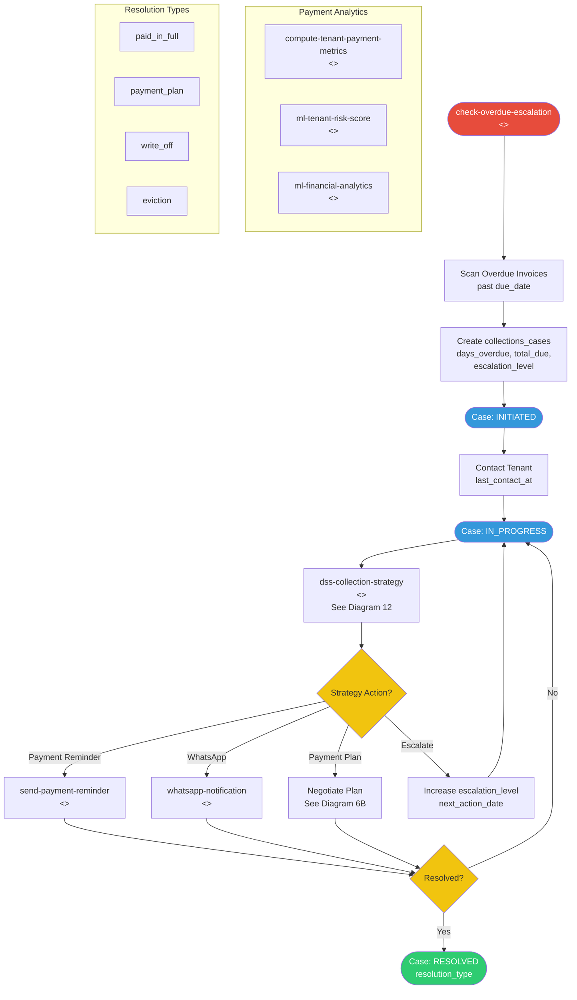

**State Machine** (`COLLECTIONS_CASE_TRANSITIONS`):
| From | To |
|------|-----|
| `initiated` | `in_progress` |
| `in_progress` | `resolved` |
| `resolved` | _(terminal — resolution_type: paid_in_full, payment_plan, write_off, eviction)_ |

---

## 12. AI/ML & DSS Advisory Flow

Alur Decision Support System dan Machine Learning models untuk merchant.

```mermaid
flowchart TD
    subgraph DSS [Decision Support System - Edge Functions]
        DSS_PRICE["dss-pricing-advisor<br/><<edge function>>"]
        DSS_MAINT["dss-maintenance-priority<br/><<edge function>>"]
        DSS_COLLECT["dss-collection-strategy<br/><<edge function>>"]
        DSS_INVEST["dss-investment-insight<br/><<edge function>>"]
    end

    subgraph ML [Machine Learning Models - Edge Functions]
        ML_CHURN["ml-churn-prediction<br/><<edge function>>"]
        ML_OCC["ml-occupancy-forecast<br/><<edge function>>"]
        ML_REV["ml-revenue-forecast<br/><<edge function>>"]
        ML_RISK["ml-risk-assessment<br/><<edge function>>"]
        ML_TENANT["ml-tenant-quality-scoring<br/><<edge function>>"]
        ML_PRICE["ml-optimal-pricing<br/><<edge function>>"]
        ML_INTEL["ml-price-intelligence<br/><<edge function>>"]
        ML_T_RISK["ml-tenant-risk-score<br/><<edge function>>"]
        ML_FIN["ml-financial-analytics<br/><<edge function>>"]
        ML_DQ["ml-data-quality-check<br/><<edge function>>"]
    end

    subgraph OCR [OCR Processing - Edge Functions]
        OCR_KTP["ocr-ktp-extract"]
        OCR_PAY["ocr-payment-proof"]
        OCR_MAINT["ocr-maintenance-receipt"]
        OCR_COMP["ocr-compliance-document"]
        OCR_CONTRACT["ocr-contract-document"]
        OCR_BIZ["ocr-business-document"]
        OCR_ASSET["ocr-asset-label"]
        OCR_CORRECT["ml-ocr-correction-suggest"]
    end

    DSS_PRICE --> REC_GEN([dss_recommendations<br/>Status: GENERATED])
    DSS_MAINT --> REC_GEN
    DSS_COLLECT --> REC_GEN
    DSS_INVEST --> REC_GEN

    ML_CHURN --> ML_RUN[ml_model_runs<br/>model_type, results]
    ML_OCC --> ML_RUN
    ML_REV --> ML_RUN
    ML_RISK --> ML_RUN
    ML_TENANT --> ML_RUN
    ML_PRICE --> ML_RUN
    ML_INTEL --> ML_RUN
    ML_T_RISK --> ML_RUN
    ML_FIN --> ML_RUN
    ML_DQ --> DQ_CHECK[data_quality_checks<br/>quality_score]

    ML_RUN --> REC_GEN

    REC_GEN --> VIEWED{Merchant View?}
    VIEWED -->|Yes| REC_VIEWED([Status: VIEWED])
    REC_VIEWED --> DECISION{Accept / Reject?}
    DECISION -->|Accept| REC_ACCEPTED([Status: ACCEPTED])
    DECISION -->|Reject| REC_REJECTED([Status: REJECTED<br/>rejection_reason])

    REC_ACCEPTED --> IMPLEMENT[Implement Recommendation]
    IMPLEMENT --> MEASURE[Measure Impact<br/>measured_impact JSONB]
    MEASURE --> REC_MEASURED([Status: MEASURED])

    OCR_KTP --> OCR_RESULT[ocr_results table]
    OCR_PAY --> OCR_RESULT
    OCR_MAINT --> OCR_RESULT
    OCR_COMP --> OCR_RESULT
    OCR_CONTRACT --> OCR_RESULT
    OCR_BIZ --> OCR_RESULT
    OCR_ASSET --> OCR_RESULT
    OCR_RESULT --> OCR_STATUS{OCR Status?}
    OCR_STATUS -->|Success| OCR_COMPLETED([OCR: COMPLETED])
    OCR_STATUS -->|Needs Review| OCR_REVIEW([OCR: REQUIRES_REVIEW])
    OCR_STATUS -->|Fail| OCR_FAILED([OCR: FAILED])
    OCR_REVIEW --> OCR_CORRECT
    OCR_CORRECT --> OCR_COMPLETED

    style REC_GEN fill:#3498db,color:#fff
    style REC_VIEWED fill:#3498db,color:#fff
    style REC_ACCEPTED fill:#2ecc71,color:#fff
    style REC_MEASURED fill:#2ecc71,color:#fff
    style OCR_COMPLETED fill:#2ecc71,color:#fff
    style REC_REJECTED fill:#e74c3c,color:#fff
    style OCR_FAILED fill:#e74c3c,color:#fff
    style OCR_REVIEW fill:#e67e22,color:#fff
    style VIEWED fill:#f1c40f,color:#333
    style DECISION fill:#f1c40f,color:#333
    style OCR_STATUS fill:#f1c40f,color:#333
```

**DSS Recommendation** (`DSS_RECOMMENDATION_TRANSITIONS`):
| From | To |
|------|-----|
| `generated` | `viewed`, `accepted`, `rejected` |
| `viewed` | `accepted`, `rejected` |
| `accepted` | `measured` |

**OCR Result** (`OCR_RESULT_TRANSITIONS`):
| From | To |
|------|-----|
| `processing` | `completed`, `failed`, `requires_review` |
| `requires_review` | `completed`, `failed` |

---

## 13. Referral System

Alur referral merchant, tracking komisioner, dan reward processing.

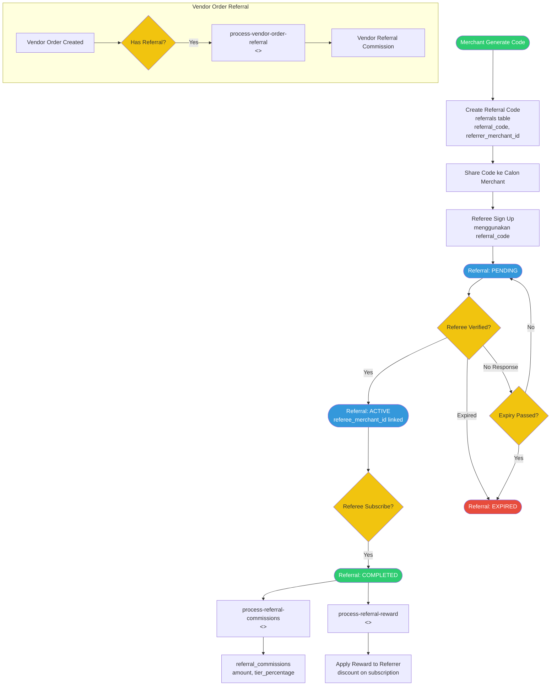

**State Machine** (`REFERRAL_STATUS_TRANSITIONS`):
| From | To |
|------|-----|
| `pending` | `active`, `expired` |
| `active` | `completed` |
| `completed` | _(terminal)_ |
| `expired` | _(terminal)_ |

---

## 14. Support, Feedback & Compliance

Alur support live chat, feedback, compliance tracking, insurance, security, dan audit.

```mermaid
flowchart TD
    subgraph CHAT [Live Chat Support]
        CHAT_START([User Start Chat]) --> CONV[Create chat_conversations<br/>title, context]
        CONV --> MSG[Send chat_messages<br/>role: user/assistant]
        MSG --> AI_BOT["ai-chatbot / merchant-ai-assistant<br/><<edge function>>"]
        AI_BOT --> RESPONSE[AI Response<br/>chat_messages role: assistant]
        RESPONSE --> ANALYTICS_CHAT[chatbot_analytics<br/>query_type, response_time_ms]
        RESPONSE --> MSG
    end

    subgraph FEEDBACK [Merchant Feedback]
        FB_SUBMIT([Merchant Submit Feedback]) --> FB_RECORD[merchant_feedback table<br/>category, content, rating]
        FB_RECORD --> FB_PENDING([Feedback Recorded])
        FB_PENDING --> ADMIN_RESP{Admin Response?}
        ADMIN_RESP -->|Yes| FB_RESPONDED([admin_response filled])
        ADMIN_RESP -->|No| FB_PENDING
    end

    subgraph COMPLIANCE [Compliance Documents]
        COMP_UPLOAD([Upload Document]) --> COMP_DOC[compliance_documents<br/>document_type, expiry_date]
        COMP_DOC --> OCR_COMP_DOC["ocr-compliance-document<br/><<edge function>>"]
        OCR_COMP_DOC --> COMP_ACTIVE([Document Active])
        COMP_ACTIVE --> EXPIRY_CHECK{Approaching Expiry?}
        EXPIRY_CHECK -->|Yes| COMP_ALERT[Send Renewal Alert]
        COMP_ALERT --> COMP_UPLOAD
        EXPIRY_CHECK -->|No| COMP_ACTIVE
    end

    subgraph INSURANCE [Insurance Management]
        INS_CREATE([Create Policy]) --> INS_POLICY[insurance_policies<br/>provider, coverage_amount<br/>premium, expiry]
        INS_POLICY --> INS_ACTIVE([Policy Active])
        INS_ACTIVE --> CLAIM{File Claim?}
        CLAIM -->|Yes| INS_CLAIM[insurance_claims<br/>incident_date, claim_amount]
        INS_CLAIM --> CLAIM_STATUS{Claim Result?}
        CLAIM_STATUS -->|Approved| CLAIM_PAID([Claim Paid<br/>settlement_amount])
        CLAIM_STATUS -->|Denied| CLAIM_DENIED([Claim Denied])
    end

    subgraph SECURITY [Security & Risk]
        SEC_INC([Security Incident]) --> SEC_RECORD[security_incidents<br/>incident_type, severity]
        SEC_RECORD --> SEC_RESOLVE[Investigation & Resolution]

        RISK_ASSESS[disaster_risk_profiles<br/>flood, earthquake, fire,<br/>landslide risk levels]
    end

    subgraph DISPUTE_MGMT [Dispute Management]
        DISP_CREATE([Create Dispute]) --> DISP_OPEN([disputes: OPEN])
        DISP_OPEN --> DISP_PROG([IN_PROGRESS])
        DISP_PROG --> DISP_END{Resolution?}
        DISP_END -->|Resolved| DISP_RESOLVED([RESOLVED])
        DISP_END -->|Closed| DISP_CLOSED([CLOSED])
    end

    subgraph AUDIT [Audit & Data Quality]
        AUDIT_LOG[audit_logs<br/>action, entity_type,<br/>old_data, new_data]
        DQ_CHECK["ml-data-quality-check<br/><<edge function>>"]
        DQ_RECORD[data_quality_checks<br/>quality_score,<br/>validation_results]
        DSS_VAL[dss_validation_logs<br/>validation_type,<br/>validation_result]
        DQ_CHECK --> DQ_RECORD
    end

    subgraph DATA_EXPORT [Data Export & GDPR]
        EXPORT["data-export<br/><<edge function>>"]
        GDPR["gdpr-data-request<br/><<edge function>>"]
    end

    style CHAT_START fill:#2ecc71,color:#fff
    style FB_SUBMIT fill:#2ecc71,color:#fff
    style COMP_UPLOAD fill:#2ecc71,color:#fff
    style INS_CREATE fill:#2ecc71,color:#fff
    style DISP_RESOLVED fill:#2ecc71,color:#fff
    style CLAIM_PAID fill:#2ecc71,color:#fff
    style FB_RESPONDED fill:#2ecc71,color:#fff
    style COMP_ACTIVE fill:#2ecc71,color:#fff
    style INS_ACTIVE fill:#2ecc71,color:#fff
    style DISP_OPEN fill:#3498db,color:#fff
    style DISP_PROG fill:#3498db,color:#fff
    style FB_PENDING fill:#3498db,color:#fff
    style CLAIM_DENIED fill:#e74c3c,color:#fff
    style DISP_CLOSED fill:#e74c3c,color:#fff
    style DISP_END fill:#f1c40f,color:#333
    style CLAIM_STATUS fill:#f1c40f,color:#333
    style EXPIRY_CHECK fill:#f1c40f,color:#333
    style ADMIN_RESP fill:#f1c40f,color:#333
    style CLAIM fill:#f1c40f,color:#333
```

**Dispute** (`DISPUTE_STATUS_TRANSITIONS`):
| From | To |
|------|-----|
| `open` | `in_progress` |
| `in_progress` | `resolved`, `closed` |

---

## Lampiran: Cross-Reference Matrix

| Diagram | Referensi ke Diagram Lain |
|---------|---------------------------|
| 1. Onboarding | -> 2 (Subscription) |
| 2. Subscription | -> 1 (Verified merchant) |
| 3. Property & Unit | -> 4 (Contract), 5 (Tenant) |
| 4. Contract | -> 3 (Unit status), 5 (Tenant), 9 (Move-out) |
| 5. Tenant | -> 4 (Contract), 3 (Unit) |
| 6. Invoice | -> 7 (Payment), 11 (Collections), 6B (Payment Plan) |
| 7. Payment | -> 6 (Invoice), 8 (Escrow) |
| 8. Escrow | -> 7 (Payment) |
| 9. Move-Out | -> 3 (Unit), 4 (Contract) |
| 10. Maintenance | -> 12 (DSS) |
| 11. Collections | -> 6 (Invoice), 6B (Payment Plan), 12 (DSS) |
| 12. AI/ML & DSS | -> 10 (Maintenance), 11 (Collections) |
| 13. Referral | Standalone |
| 14. Support | -> 12 (Data Quality) |

## Lampiran: Edge Functions Summary

| Edge Function | Domain | Diagram |
|---------------|--------|---------|
| `ensure-user-bootstrap` | Onboarding | 1 |
| `ocr-ktp-extract` | Onboarding/OCR | 1, 12 |
| `ocr-business-document` | Onboarding/OCR | 1, 12 |
| `subscription-billing` | Subscription | 2 |
| `subscription-payment` | Subscription | 2 |
| `subscription-renewal` | Subscription | 2 |
| `subscription-grace-check` | Subscription | 2 |
| `ocr-compliance-document` | Property | 3, 14 |
| `ocr-asset-label` | Property/Asset | 3, 12 |
| `vacancy-tracking-cron` | Property | 3 |
| `compute-occupancy-snapshots` | Property | 3 |
| `ocr-contract-document` | Contract | 4, 12 |
| `accept-tenant-invitation` | Tenant | 5 |
| `create-tenant-account` | Tenant | 5 |
| `get-tenant-invitation` | Tenant | 5 |
| `auto-generate-invoices` | Invoice | 6 |
| `generate-invoice-pdf` | Invoice | 6 |
| `send-payment-reminder` | Invoice/Collections | 6, 11 |
| `check-payment-plan` | Invoice | 6B |
| `ocr-payment-proof` | Payment | 7, 12 |
| `xendit-create-invoice` | Payment | 7 |
| `xendit-webhook` | Payment | 7 |
| `auto-pay-execute` | Payment | 7 |
| `scheduled-disbursement` | Escrow | 8 |
| `xendit-disbursement` | Escrow | 8 |
| `xendit-disbursement-webhook` | Escrow | 8 |
| `process-deposit-refund` | Move-Out | 9 |
| `ocr-maintenance-receipt` | Maintenance | 10, 12 |
| `check-overdue-escalation` | Collections | 11 |
| `compute-tenant-payment-metrics` | Collections | 11 |
| `dss-pricing-advisor` | DSS | 12 |
| `dss-maintenance-priority` | DSS | 10, 12 |
| `dss-collection-strategy` | DSS | 11, 12 |
| `dss-investment-insight` | DSS | 12 |
| `ml-churn-prediction` | ML | 12 |
| `ml-occupancy-forecast` | ML | 12 |
| `ml-revenue-forecast` | ML | 12 |
| `ml-risk-assessment` | ML | 12 |
| `ml-tenant-quality-scoring` | ML | 12 |
| `ml-optimal-pricing` | ML | 12 |
| `ml-price-intelligence` | ML | 12 |
| `ml-tenant-risk-score` | ML | 5, 12 |
| `ml-financial-analytics` | ML | 11, 12 |
| `ml-data-quality-check` | ML | 12, 14 |
| `ml-ocr-correction-suggest` | ML/OCR | 12 |
| `process-referral-commissions` | Referral | 13 |
| `process-referral-reward` | Referral | 13 |
| `process-vendor-order-referral` | Referral | 13 |
| `ai-chatbot` | Support | 14 |
| `merchant-ai-assistant` | Support | 14 |
| `vendor-ai-assistant` | Support | 14 |
| `send-notification` | Notifications | 6, 14 |
| `whatsapp-notification` | Notifications | 11, 14 |
| `data-export` | Data | 14 |
| `gdpr-data-request` | GDPR | 14 |
| `validate-admin-secret` | Auth | Internal |
| `auth-webhook` | Auth | Internal |
| `log-rls-access` | Security | Internal |
| `order-auto-reject` | Marketplace | 11 (Order) |

## Lampiran: State Machines Summary

| State Machine | Constant Name | Diagram |
|---------------|---------------|---------|
| Merchant Verification | `MERCHANT_VERIFICATION_TRANSITIONS` | 1 |
| Verification (generic) | `VERIFICATION_STATUS_TRANSITIONS` | 1 |
| Vendor Verification | `VENDOR_VERIFICATION_TRANSITIONS` | 10 |
| Subscription | `SUBSCRIPTION_STATUS_TRANSITIONS` | 2 |
| Unit Status | `UNIT_STATUS_TRANSITIONS` | 3 |
| Contract Status | `CONTRACT_STATUS_TRANSITIONS` | 4 |
| Contract Signature | `CONTRACT_SIGNATURE_TRANSITIONS` | 4 |
| Invoice Status | `INVOICE_STATUS_TRANSITIONS` | 6 |
| Payment Plan | `PAYMENT_PLAN_STATUS_TRANSITIONS` | 6B |
| Payment Status | `PAYMENT_STATUS_TRANSITIONS` | 7 |
| Payment Verification | `PAYMENT_VERIFICATION_TRANSITIONS` | 7 |
| Escrow Transaction | `ESCROW_TRANSACTION_TRANSITIONS` | 8 |
| Disbursement | `DISBURSEMENT_STATUS_TRANSITIONS` | 8 |
| Move-Out Notice | `MOVE_OUT_NOTICE_TRANSITIONS` | 9 |
| Move-Out Inspection | `MOVE_OUT_INSPECTION_TRANSITIONS` | 9 |
| Early Termination | `EARLY_TERMINATION_TRANSITIONS` | 9 |
| Deposit Refund | `DEPOSIT_REFUND_TRANSITIONS` | 9 |
| Maintenance | `MAINTENANCE_STATUS_TRANSITIONS` | 10 |
| Vendor Job | `VENDOR_JOB_STATUS_TRANSITIONS` | 10 |
| Collections Case | `COLLECTIONS_CASE_TRANSITIONS` | 11 |
| DSS Recommendation | `DSS_RECOMMENDATION_TRANSITIONS` | 12 |
| OCR Result | `OCR_RESULT_TRANSITIONS` | 12 |
| Referral | `REFERRAL_STATUS_TRANSITIONS` | 13 |
| Dispute | `DISPUTE_STATUS_TRANSITIONS` | 14 |
| Order (Marketplace) | `ORDER_STATUS_TRANSITIONS` | Marketplace |
| Forum Report | `FORUM_REPORT_TRANSITIONS` | Forum |
