# Merchant Sequence Diagrams

> **Fokus**: Siapa berkomunikasi dengan siapa dan kapan — interaksi antar aktor untuk setiap domain operasional merchant.
>
> **Berbeda dengan**:
> - `merchant_activity_diagram.md` → alur proses (flowchart)
> - `merchant_state_machine_diagram.md` → transisi status murni
>
> **Sumber**: Kode aktual dari service files, edge functions, state machines, dan audit utilities.

---

## Daftar Isi

1. [Merchant Registration & Onboarding](#1-merchant-registration--onboarding)
2. [Merchant Verification (Admin Review)](#2-merchant-verification-admin-review)
3. [Subscription Lifecycle](#3-subscription-lifecycle)
4. [Property & Unit Management](#4-property--unit-management)
5. [Contract Creation & Signature Flow](#5-contract-creation--signature-flow)
6. [Tenant Invitation Flow](#6-tenant-invitation-flow)
7. [Invoice Lifecycle](#7-invoice-lifecycle-create--send--pay)
8. [Payment & Xendit Integration](#8-payment--xendit-integration)
9. [Payment Verification (OCR)](#9-payment-verification-ocr)
10. [Escrow & Disbursement](#10-escrow--disbursement)
11. [Maintenance Request Full Cycle](#11-maintenance-request-full-cycle)
12. [Move-Out & Deposit Refund](#12-move-out--deposit-refund)
13. [Overdue Escalation & Collections](#13-overdue-escalation--collections)
14. [AI/DSS Advisory](#14-aidss-advisory)
15. [Referral System](#15-referral-system)
16. [Merchant Suspend/Reactivate (Admin)](#16-merchant-suspendreactivate-admin)

---

## 1. Merchant Registration & Onboarding

Alur pendaftaran user baru sebagai merchant, mulai dari signup hingga profil bisnis lengkap.

**Aktor**: User, Frontend, Auth (Supabase Auth), Database, Trigger (ensure-user-bootstrap)

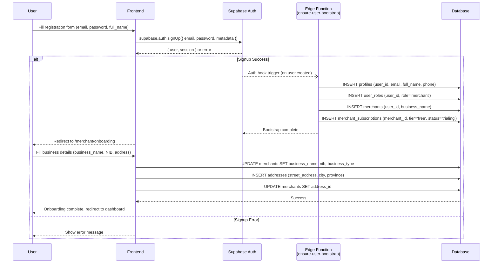
```mermaid
sequenceDiagram
    participant U as User
    participant FE as Frontend
    participant Auth as Supabase Auth
    participant EF as Edge Function<br/>(ensure-user-bootstrap)
    participant DB as Database

    U->>FE: Fill registration form (email, password, full_name)
    FE->>Auth: supabase.auth.signUp({ email, password, metadata })
    Auth-->>FE: { user, session } or error

    alt Signup Success
        Auth--)EF: Auth hook trigger (on user.created)
        EF->>DB: INSERT profiles (user_id, email, full_name, phone)
        EF->>DB: INSERT user_roles (user_id, role='merchant')
        EF->>DB: INSERT merchants (user_id, business_name)
        EF->>DB: INSERT merchant_subscriptions (merchant_id, tier='free', status='trialing')
        EF-->>Auth: Bootstrap complete

        FE-->>U: Redirect to /merchant/onboarding
        U->>FE: Fill business details (business_name, NIB, address)
        FE->>DB: UPDATE merchants SET business_name, nib, business_type
        FE->>DB: INSERT addresses (street_address, city, province)
        FE->>DB: UPDATE merchants SET address_id
        DB-->>FE: Success
        FE-->>U: Onboarding complete, redirect to dashboard
    else Signup Error
        FE-->>U: Show error message
    end
```

---

## 2. Merchant Verification (Admin Review)

Admin me-review pengajuan verifikasi merchant. Sumber: `merchantService.verifyMerchant()`.

**Aktor**: Admin, merchantService, Database, Edge Function (send-notification), Merchant

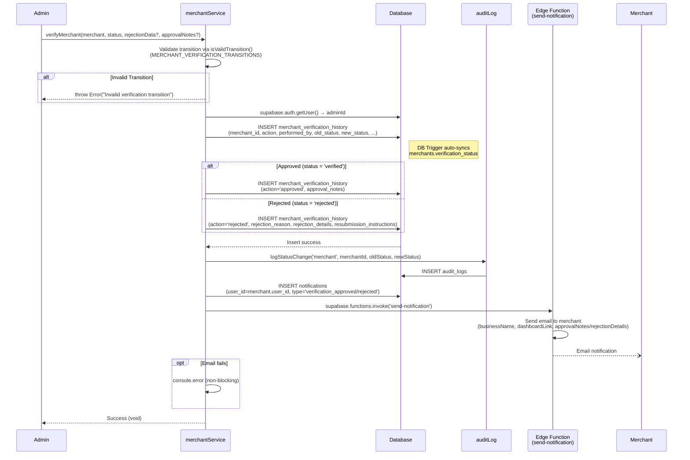
```mermaid
sequenceDiagram
    participant A as Admin
    participant MS as merchantService
    participant DB as Database
    participant AL as auditLog
    participant EF as Edge Function<br/>(send-notification)
    participant M as Merchant

    A->>MS: verifyMerchant(merchant, status, rejectionData?, approvalNotes?)

    MS->>MS: Validate transition via isValidTransition()<br/>(MERCHANT_VERIFICATION_TRANSITIONS)
    alt Invalid Transition
        MS-->>A: throw Error("Invalid verification transition")
    end

    MS->>DB: supabase.auth.getUser() → adminId

    MS->>DB: INSERT merchant_verification_history<br/>(merchant_id, action, performed_by, old_status, new_status, ...)
    Note right of DB: DB Trigger auto-syncs<br/>merchants.verification_status

    alt Approved (status = 'verified')
        MS->>DB: INSERT merchant_verification_history<br/>(action='approved', approval_notes)
    else Rejected (status = 'rejected')
        MS->>DB: INSERT merchant_verification_history<br/>(action='rejected', rejection_reason, rejection_details, resubmission_instructions)
    end

    DB-->>MS: Insert success

    MS->>AL: logStatusChange('merchant', merchantId, oldStatus, newStatus)
    AL->>DB: INSERT audit_logs

    MS->>DB: INSERT notifications<br/>(user_id=merchant.user_id, type='verification_approved/rejected')

    MS->>EF: supabase.functions.invoke('send-notification')
    EF->>EF: Send email to merchant<br/>(businessName, dashboardLink, approvalNotes/rejectionDetails)
    EF--)M: Email notification

    opt Email fails
        MS->>MS: console.error (non-blocking)
    end

    MS-->>A: Success (void)
```

---

## 3. Subscription Lifecycle

Siklus langganan merchant dari trialing hingga cancelled, termasuk billing dan renewal otomatis.

**Aktor**: Merchant, subscriptionService, Database, Edge Functions (subscription-billing, subscription-payment, subscription-renewal, subscription-grace-check)

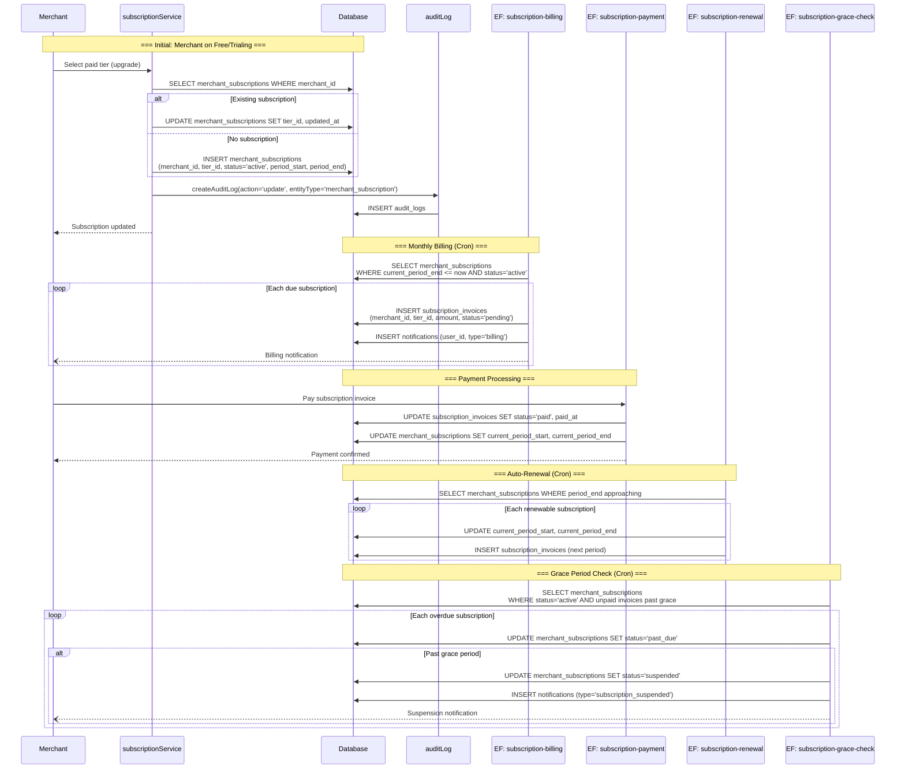
```mermaid
sequenceDiagram
    participant M as Merchant
    participant SS as subscriptionService
    participant DB as Database
    participant AL as auditLog
    participant EF1 as EF: subscription-billing
    participant EF2 as EF: subscription-payment
    participant EF3 as EF: subscription-renewal
    participant EF4 as EF: subscription-grace-check

    Note over M,DB: === Initial: Merchant on Free/Trialing ===

    M->>SS: Select paid tier (upgrade)
    SS->>DB: SELECT merchant_subscriptions WHERE merchant_id
    alt Existing subscription
        SS->>DB: UPDATE merchant_subscriptions SET tier_id, updated_at
    else No subscription
        SS->>DB: INSERT merchant_subscriptions<br/>(merchant_id, tier_id, status='active', period_start, period_end)
    end
    SS->>AL: createAuditLog(action='update', entityType='merchant_subscription')
    AL->>DB: INSERT audit_logs
    SS-->>M: Subscription updated

    Note over EF1,DB: === Monthly Billing (Cron) ===

    EF1->>DB: SELECT merchant_subscriptions<br/>WHERE current_period_end <= now AND status='active'
    loop Each due subscription
        EF1->>DB: INSERT subscription_invoices<br/>(merchant_id, tier_id, amount, status='pending')
        EF1->>DB: INSERT notifications (user_id, type='billing')
        EF1--)M: Billing notification
    end

    Note over EF2,DB: === Payment Processing ===

    M->>EF2: Pay subscription invoice
    EF2->>DB: UPDATE subscription_invoices SET status='paid', paid_at
    EF2->>DB: UPDATE merchant_subscriptions SET current_period_start, current_period_end
    EF2-->>M: Payment confirmed

    Note over EF3,DB: === Auto-Renewal (Cron) ===

    EF3->>DB: SELECT merchant_subscriptions WHERE period_end approaching
    loop Each renewable subscription
        EF3->>DB: UPDATE current_period_start, current_period_end
        EF3->>DB: INSERT subscription_invoices (next period)
    end

    Note over EF4,DB: === Grace Period Check (Cron) ===

    EF4->>DB: SELECT merchant_subscriptions<br/>WHERE status='active' AND unpaid invoices past grace
    loop Each overdue subscription
        EF4->>DB: UPDATE merchant_subscriptions SET status='past_due'
        alt Past grace period
            EF4->>DB: UPDATE merchant_subscriptions SET status='suspended'
            EF4->>DB: INSERT notifications (type='subscription_suspended')
            EF4--)M: Suspension notification
        end
    end
```

---

## 4. Property & Unit Management

Merchant mengelola properti dan unit. Sumber: `propertyService.ts`.

**Aktor**: Merchant, propertyService, Database, dataQualityService

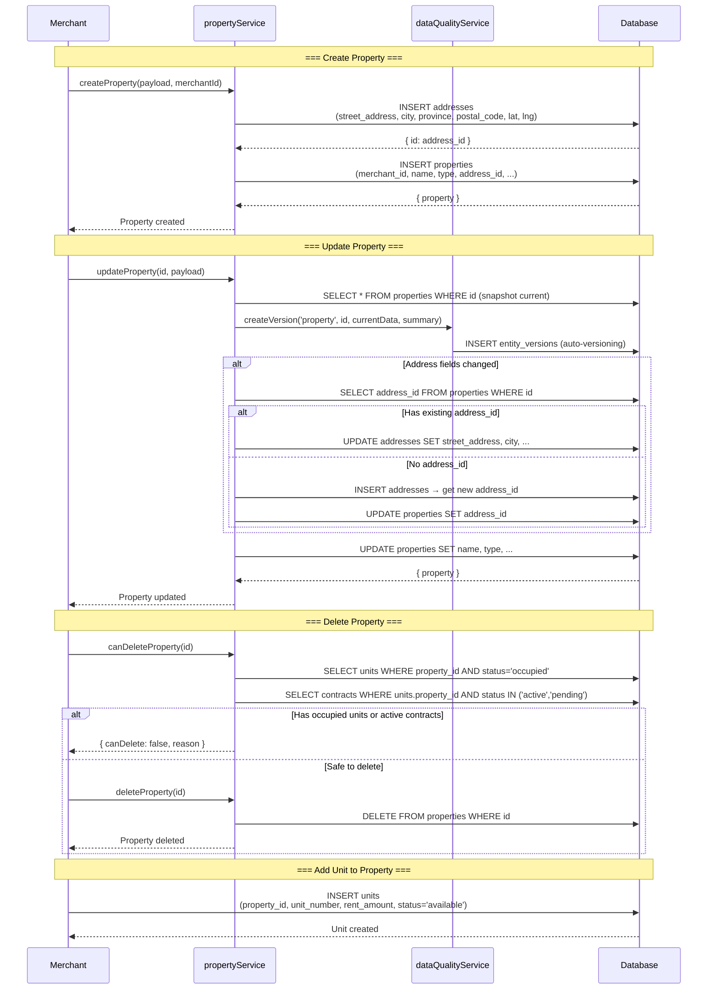
```mermaid
sequenceDiagram
    participant M as Merchant
    participant PS as propertyService
    participant DQ as dataQualityService
    participant DB as Database

    Note over M,DB: === Create Property ===

    M->>PS: createProperty(payload, merchantId)
    PS->>DB: INSERT addresses<br/>(street_address, city, province, postal_code, lat, lng)
    DB-->>PS: { id: address_id }
    PS->>DB: INSERT properties<br/>(merchant_id, name, type, address_id, ...)
    DB-->>PS: { property }
    PS-->>M: Property created

    Note over M,DB: === Update Property ===

    M->>PS: updateProperty(id, payload)
    PS->>DB: SELECT * FROM properties WHERE id (snapshot current)
    PS->>DQ: createVersion('property', id, currentData, summary)
    DQ->>DB: INSERT entity_versions (auto-versioning)

    alt Address fields changed
        PS->>DB: SELECT address_id FROM properties WHERE id
        alt Has existing address_id
            PS->>DB: UPDATE addresses SET street_address, city, ...
        else No address_id
            PS->>DB: INSERT addresses → get new address_id
            PS->>DB: UPDATE properties SET address_id
        end
    end

    PS->>DB: UPDATE properties SET name, type, ...
    DB-->>PS: { property }
    PS-->>M: Property updated

    Note over M,DB: === Delete Property ===

    M->>PS: canDeleteProperty(id)
    PS->>DB: SELECT units WHERE property_id AND status='occupied'
    PS->>DB: SELECT contracts WHERE units.property_id AND status IN ('active','pending')
    alt Has occupied units or active contracts
        PS-->>M: { canDelete: false, reason }
    else Safe to delete
        M->>PS: deleteProperty(id)
        PS->>DB: DELETE FROM properties WHERE id
        PS-->>M: Property deleted
    end

    Note over M,DB: === Add Unit to Property ===

    M->>DB: INSERT units<br/>(property_id, unit_number, rent_amount, status='available')
    DB-->>M: Unit created
```

---

## 5. Contract Creation & Signature Flow

Pembuatan kontrak dan alur tanda tangan merchant/tenant. Sumber: `contractService.ts`.

**Aktor**: Merchant, contractService, Database, Storage, Tenant, Trigger (unit status sync)

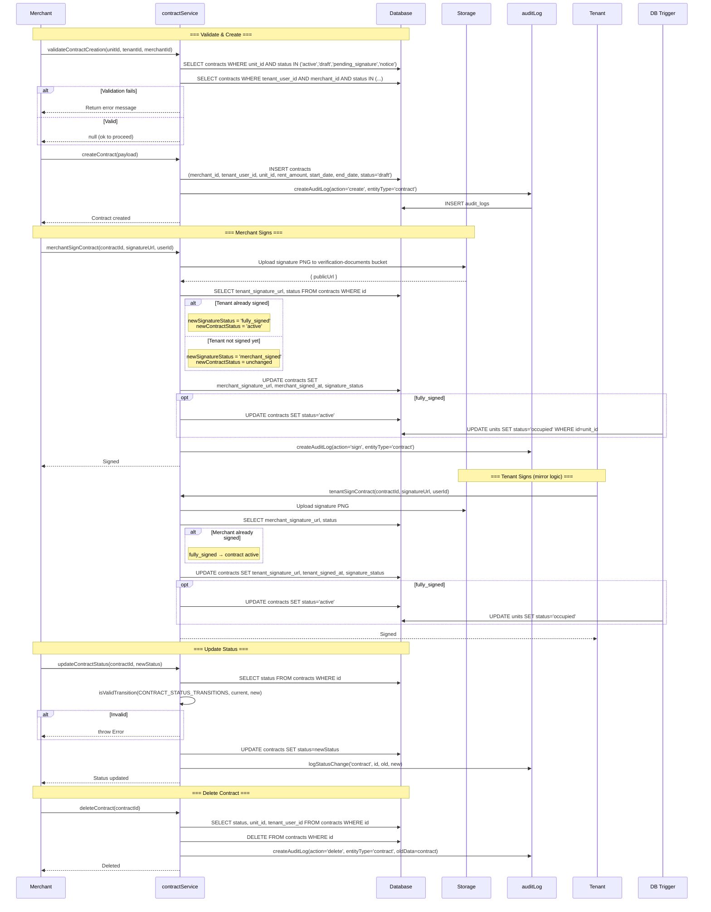
```mermaid
sequenceDiagram
    participant M as Merchant
    participant CS as contractService
    participant DB as Database
    participant ST as Storage
    participant AL as auditLog
    participant T as Tenant
    participant TR as DB Trigger

    Note over M,DB: === Validate & Create ===

    M->>CS: validateContractCreation(unitId, tenantId, merchantId)
    CS->>DB: SELECT contracts WHERE unit_id AND status IN ('active','draft','pending_signature','notice')
    CS->>DB: SELECT contracts WHERE tenant_user_id AND merchant_id AND status IN (...)
    alt Validation fails
        CS-->>M: Return error message
    else Valid
        CS-->>M: null (ok to proceed)
    end

    M->>CS: createContract(payload)
    CS->>DB: INSERT contracts<br/>(merchant_id, tenant_user_id, unit_id, rent_amount, start_date, end_date, status='draft')
    CS->>AL: createAuditLog(action='create', entityType='contract')
    AL->>DB: INSERT audit_logs
    CS-->>M: Contract created

    Note over M,ST: === Merchant Signs ===

    M->>CS: merchantSignContract(contractId, signatureUrl, userId)
    CS->>ST: Upload signature PNG to verification-documents bucket
    ST-->>CS: { publicUrl }
    CS->>DB: SELECT tenant_signature_url, status FROM contracts WHERE id

    alt Tenant already signed
        Note right of CS: newSignatureStatus = 'fully_signed'<br/>newContractStatus = 'active'
    else Tenant not signed yet
        Note right of CS: newSignatureStatus = 'merchant_signed'<br/>newContractStatus = unchanged
    end

    CS->>DB: UPDATE contracts SET<br/>merchant_signature_url, merchant_signed_at, signature_status
    opt fully_signed
        CS->>DB: UPDATE contracts SET status='active'
        TR->>DB: UPDATE units SET status='occupied' WHERE id=unit_id
    end
    CS->>AL: createAuditLog(action='sign', entityType='contract')
    CS-->>M: Signed

    Note over T,ST: === Tenant Signs (mirror logic) ===

    T->>CS: tenantSignContract(contractId, signatureUrl, userId)
    CS->>ST: Upload signature PNG
    CS->>DB: SELECT merchant_signature_url, status
    alt Merchant already signed
        Note right of CS: fully_signed → contract active
    end
    CS->>DB: UPDATE contracts SET tenant_signature_url, tenant_signed_at, signature_status
    opt fully_signed
        CS->>DB: UPDATE contracts SET status='active'
        TR->>DB: UPDATE units SET status='occupied'
    end
    CS-->>T: Signed

    Note over M,DB: === Update Status ===

    M->>CS: updateContractStatus(contractId, newStatus)
    CS->>DB: SELECT status FROM contracts WHERE id
    CS->>CS: isValidTransition(CONTRACT_STATUS_TRANSITIONS, current, new)
    alt Invalid
        CS-->>M: throw Error
    end
    CS->>DB: UPDATE contracts SET status=newStatus
    CS->>AL: logStatusChange('contract', id, old, new)
    CS-->>M: Status updated

    Note over M,DB: === Delete Contract ===

    M->>CS: deleteContract(contractId)
    CS->>DB: SELECT status, unit_id, tenant_user_id FROM contracts WHERE id
    CS->>DB: DELETE FROM contracts WHERE id
    CS->>AL: createAuditLog(action='delete', entityType='contract', oldData=contract)
    CS-->>M: Deleted
```

---

## 6. Tenant Invitation Flow

Merchant mengundang tenant baru via edge function. Sumber: `create-tenant-account`, `get-tenant-invitation`, `accept-tenant-invitation`.

**Aktor**: Merchant, Edge Functions, Database, Auth (admin API), Tenant

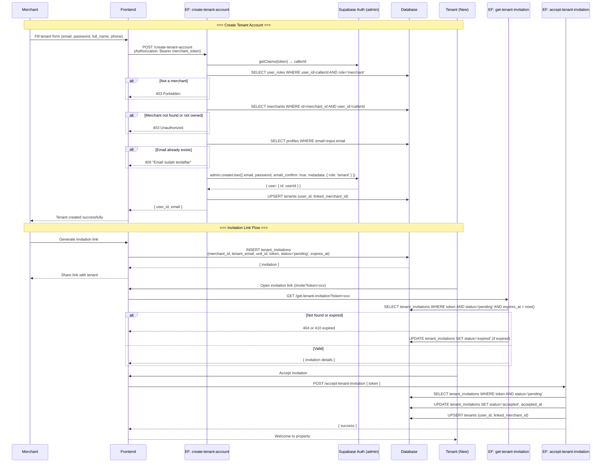
```mermaid
sequenceDiagram
    participant M as Merchant
    participant FE as Frontend
    participant EF1 as EF: create-tenant-account
    participant Auth as Supabase Auth (admin)
    participant DB as Database
    participant T as Tenant (New)

    Note over M,T: === Create Tenant Account ===

    M->>FE: Fill tenant form (email, password, full_name, phone)
    FE->>EF1: POST /create-tenant-account<br/>(Authorization: Bearer merchant_token)

    EF1->>Auth: getClaims(token) → callerId
    EF1->>DB: SELECT user_roles WHERE user_id=callerId AND role='merchant'
    alt Not a merchant
        EF1-->>FE: 403 Forbidden
    end

    EF1->>DB: SELECT merchants WHERE id=merchant_id AND user_id=callerId
    alt Merchant not found or not owned
        EF1-->>FE: 403 Unauthorized
    end

    EF1->>DB: SELECT profiles WHERE email=input.email
    alt Email already exists
        EF1-->>FE: 409 "Email sudah terdaftar"
    end

    EF1->>Auth: admin.createUser({ email, password, email_confirm: true, metadata: { role: 'tenant' } })
    Auth-->>EF1: { user: { id: userId } }

    EF1->>DB: UPSERT tenants (user_id, linked_merchant_id)
    EF1-->>FE: { user_id, email }
    FE-->>M: Tenant created successfully

    Note over M,T: === Invitation Link Flow ===

    participant EF2 as EF: get-tenant-invitation
    participant EF3 as EF: accept-tenant-invitation

    M->>FE: Generate invitation link
    FE->>DB: INSERT tenant_invitations<br/>(merchant_id, tenant_email, unit_id, token, status='pending', expires_at)
    DB-->>FE: { invitation }
    FE-->>M: Share link with tenant

    T->>FE: Open invitation link (/invite?token=xxx)
    FE->>EF2: GET /get-tenant-invitation?token=xxx
    EF2->>DB: SELECT tenant_invitations WHERE token AND status='pending' AND expires_at > now()
    alt Not found or expired
        EF2-->>FE: 404 or 410 expired
        EF2->>DB: UPDATE tenant_invitations SET status='expired' (if expired)
    else Valid
        EF2-->>FE: { invitation details }
    end

    T->>FE: Accept invitation
    FE->>EF3: POST /accept-tenant-invitation { token }
    EF3->>DB: SELECT tenant_invitations WHERE token AND status='pending'
    EF3->>DB: UPDATE tenant_invitations SET status='accepted', accepted_at
    EF3->>DB: UPSERT tenants (user_id, linked_merchant_id)
    EF3-->>FE: { success }
    FE-->>T: Welcome to property
```

---

## 7. Invoice Lifecycle (Create → Send → Pay)

Siklus hidup invoice dari draft hingga paid. Sumber: `merchantInvoiceService.ts`.

**Aktor**: Merchant, merchantInvoiceService, Database, Edge Function (send-notification, auto-generate-invoices), Tenant

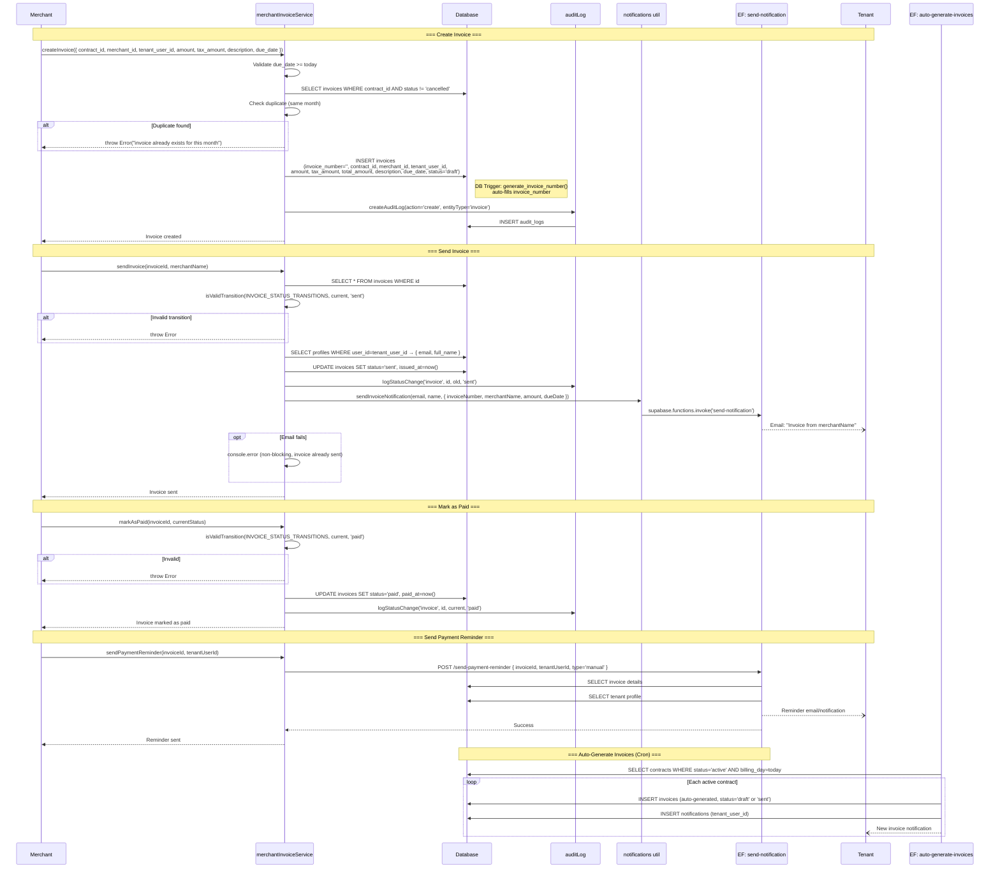
```mermaid
sequenceDiagram
    participant M as Merchant
    participant IS as merchantInvoiceService
    participant DB as Database
    participant AL as auditLog
    participant NF as notifications util
    participant EF as EF: send-notification
    participant T as Tenant

    Note over M,T: === Create Invoice ===

    M->>IS: createInvoice({ contract_id, merchant_id, tenant_user_id, amount, tax_amount, description, due_date })
    IS->>IS: Validate due_date >= today
    IS->>DB: SELECT invoices WHERE contract_id AND status != 'cancelled'
    IS->>IS: Check duplicate (same month)
    alt Duplicate found
        IS-->>M: throw Error("invoice already exists for this month")
    end

    IS->>DB: INSERT invoices<br/>(invoice_number='', contract_id, merchant_id, tenant_user_id,<br/>amount, tax_amount, total_amount, description, due_date, status='draft')
    Note right of DB: DB Trigger: generate_invoice_number()<br/>auto-fills invoice_number
    IS->>AL: createAuditLog(action='create', entityType='invoice')
    AL->>DB: INSERT audit_logs
    IS-->>M: Invoice created

    Note over M,T: === Send Invoice ===

    M->>IS: sendInvoice(invoiceId, merchantName)
    IS->>DB: SELECT * FROM invoices WHERE id
    IS->>IS: isValidTransition(INVOICE_STATUS_TRANSITIONS, current, 'sent')
    alt Invalid transition
        IS-->>M: throw Error
    end
    IS->>DB: SELECT profiles WHERE user_id=tenant_user_id → { email, full_name }
    IS->>DB: UPDATE invoices SET status='sent', issued_at=now()
    IS->>AL: logStatusChange('invoice', id, old, 'sent')

    IS->>NF: sendInvoiceNotification(email, name, { invoiceNumber, merchantName, amount, dueDate })
    NF->>EF: supabase.functions.invoke('send-notification')
    EF--)T: Email: "Invoice from merchantName"

    opt Email fails
        IS->>IS: console.error (non-blocking, invoice already sent)
    end
    IS-->>M: Invoice sent

    Note over M,T: === Mark as Paid ===

    M->>IS: markAsPaid(invoiceId, currentStatus)
    IS->>IS: isValidTransition(INVOICE_STATUS_TRANSITIONS, current, 'paid')
    alt Invalid
        IS-->>M: throw Error
    end
    IS->>DB: UPDATE invoices SET status='paid', paid_at=now()
    IS->>AL: logStatusChange('invoice', id, current, 'paid')
    IS-->>M: Invoice marked as paid

    Note over M,T: === Send Payment Reminder ===

    M->>IS: sendPaymentReminder(invoiceId, tenantUserId)
    IS->>EF: POST /send-payment-reminder { invoiceId, tenantUserId, type='manual' }
    EF->>DB: SELECT invoice details
    EF->>DB: SELECT tenant profile
    EF--)T: Reminder email/notification
    EF-->>IS: Success
    IS-->>M: Reminder sent

    Note over EF,DB: === Auto-Generate Invoices (Cron) ===

    participant EF2 as EF: auto-generate-invoices
    EF2->>DB: SELECT contracts WHERE status='active' AND billing_day=today
    loop Each active contract
        EF2->>DB: INSERT invoices (auto-generated, status='draft' or 'sent')
        EF2->>DB: INSERT notifications (tenant_user_id)
        EF2--)T: New invoice notification
    end
```

---

## 8. Payment & Xendit Integration

Tenant membayar invoice via Xendit payment gateway. Sumber: `xenditService.ts`, `xendit-create-invoice`, `xendit-webhook`.

**Aktor**: Tenant, xenditService, Edge Functions, Xendit API, Database

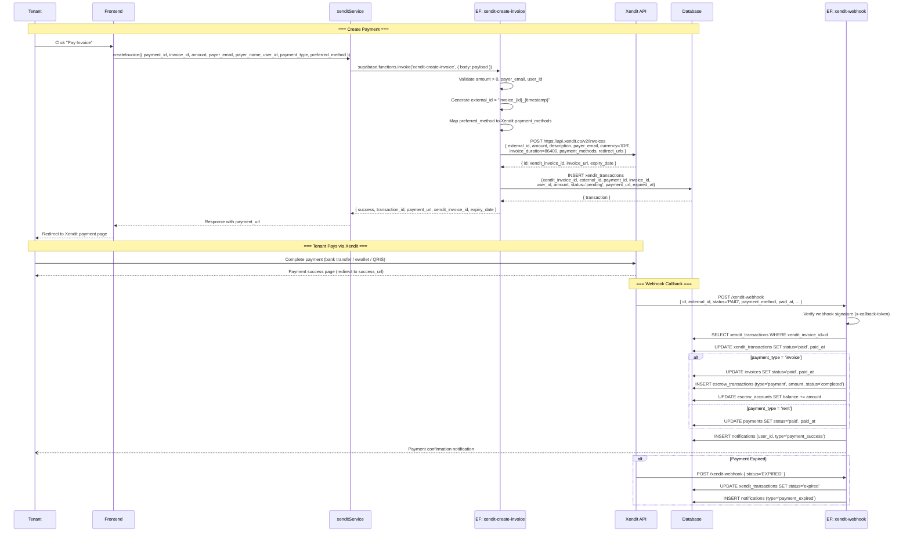
```mermaid
sequenceDiagram
    participant T as Tenant
    participant FE as Frontend
    participant XS as xenditService
    participant EF1 as EF: xendit-create-invoice
    participant XA as Xendit API
    participant DB as Database
    participant EF2 as EF: xendit-webhook

    Note over T,DB: === Create Payment ===

    T->>FE: Click "Pay Invoice"
    FE->>XS: createInvoice({ payment_id, invoice_id, amount, payer_email, payer_name, user_id, payment_type, preferred_method })
    XS->>EF1: supabase.functions.invoke('xendit-create-invoice', { body: payload })

    EF1->>EF1: Validate amount > 0, payer_email, user_id
    EF1->>EF1: Generate external_id = "invoice_{id}_{timestamp}"
    EF1->>EF1: Map preferred_method to Xendit payment_methods

    EF1->>XA: POST https://api.xendit.co/v2/invoices<br/>{ external_id, amount, description, payer_email, currency='IDR',<br/>invoice_duration=86400, payment_methods, redirect_urls }
    XA-->>EF1: { id: xendit_invoice_id, invoice_url, expiry_date }

    EF1->>DB: INSERT xendit_transactions<br/>(xendit_invoice_id, external_id, payment_id, invoice_id,<br/>user_id, amount, status='pending', payment_url, expired_at)
    DB-->>EF1: { transaction }

    EF1-->>XS: { success, transaction_id, payment_url, xendit_invoice_id, expiry_date }
    XS-->>FE: Response with payment_url
    FE-->>T: Redirect to Xendit payment page

    Note over T,XA: === Tenant Pays via Xendit ===

    T->>XA: Complete payment (bank transfer / ewallet / QRIS)
    XA-->>T: Payment success page (redirect to success_url)

    Note over XA,DB: === Webhook Callback ===

    XA->>EF2: POST /xendit-webhook<br/>{ id, external_id, status='PAID', payment_method, paid_at, ... }
    EF2->>EF2: Verify webhook signature (x-callback-token)
    EF2->>DB: SELECT xendit_transactions WHERE xendit_invoice_id=id
    EF2->>DB: UPDATE xendit_transactions SET status='paid', paid_at

    alt payment_type = 'invoice'
        EF2->>DB: UPDATE invoices SET status='paid', paid_at
        EF2->>DB: INSERT escrow_transactions (type='payment', amount, status='completed')
        EF2->>DB: UPDATE escrow_accounts SET balance += amount
    else payment_type = 'rent'
        EF2->>DB: UPDATE payments SET status='paid', paid_at
    end

    EF2->>DB: INSERT notifications (user_id, type='payment_success')
    EF2--)T: Payment confirmation notification

    alt Payment Expired
        XA->>EF2: POST /xendit-webhook { status='EXPIRED' }
        EF2->>DB: UPDATE xendit_transactions SET status='expired'
        EF2->>DB: INSERT notifications (type='payment_expired')
    end
```

---

## 9. Payment Verification (OCR)

Tenant upload bukti bayar manual, sistem OCR memverifikasi. Sumber: `ocr-payment-proof` edge function.

**Aktor**: Tenant, Frontend, Edge Function (ocr-payment-proof), Database, Merchant

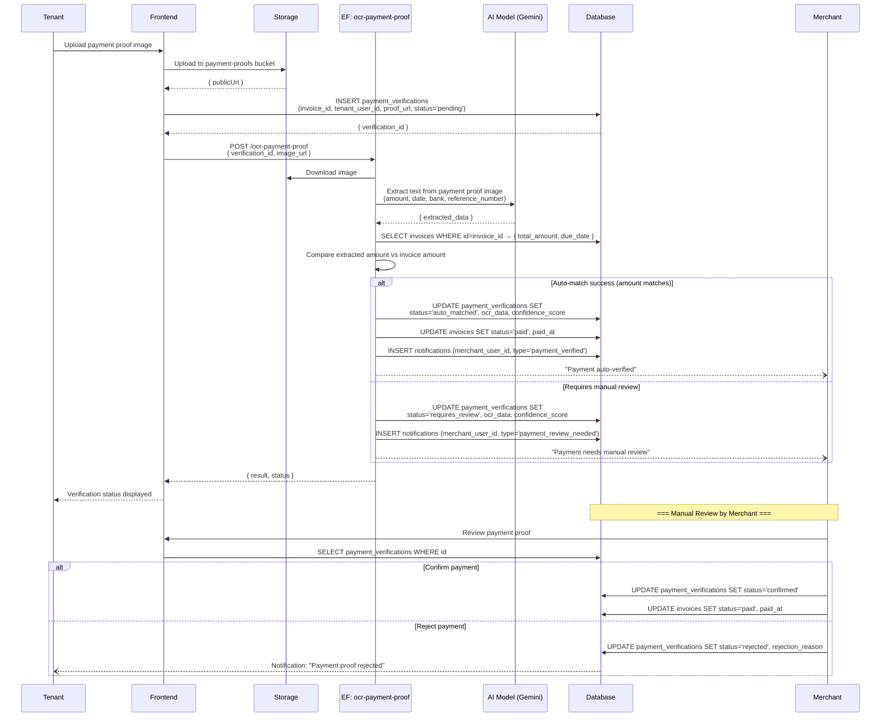
```mermaid
sequenceDiagram
    participant T as Tenant
    participant FE as Frontend
    participant ST as Storage
    participant EF as EF: ocr-payment-proof
    participant AI as AI Model (Gemini)
    participant DB as Database
    participant M as Merchant

    T->>FE: Upload payment proof image
    FE->>ST: Upload to payment-proofs bucket
    ST-->>FE: { publicUrl }

    FE->>DB: INSERT payment_verifications<br/>(invoice_id, tenant_user_id, proof_url, status='pending')
    DB-->>FE: { verification_id }

    FE->>EF: POST /ocr-payment-proof<br/>{ verification_id, image_url }

    EF->>ST: Download image
    EF->>AI: Extract text from payment proof image<br/>(amount, date, bank, reference_number)
    AI-->>EF: { extracted_data }

    EF->>DB: SELECT invoices WHERE id=invoice_id → { total_amount, due_date }
    EF->>EF: Compare extracted amount vs invoice amount

    alt Auto-match success (amount matches)
        EF->>DB: UPDATE payment_verifications SET<br/>status='auto_matched', ocr_data, confidence_score
        EF->>DB: UPDATE invoices SET status='paid', paid_at
        EF->>DB: INSERT notifications (merchant_user_id, type='payment_verified')
        EF--)M: "Payment auto-verified"
    else Requires manual review
        EF->>DB: UPDATE payment_verifications SET<br/>status='requires_review', ocr_data, confidence_score
        EF->>DB: INSERT notifications (merchant_user_id, type='payment_review_needed')
        EF--)M: "Payment needs manual review"
    end

    EF-->>FE: { result, status }
    FE-->>T: Verification status displayed

    Note over M,DB: === Manual Review by Merchant ===

    M->>FE: Review payment proof
    FE->>DB: SELECT payment_verifications WHERE id
    alt Confirm payment
        M->>DB: UPDATE payment_verifications SET status='confirmed'
        M->>DB: UPDATE invoices SET status='paid', paid_at
    else Reject payment
        M->>DB: UPDATE payment_verifications SET status='rejected', rejection_reason
        DB--)T: Notification: "Payment proof rejected"
    end
```

---

## 10. Escrow & Disbursement

Alur escrow dari payment masuk hingga disbursement ke merchant. Sumber: `escrowService.ts`, edge functions.

**Aktor**: System, escrowService, Database, Edge Functions, Xendit API, Admin, Merchant

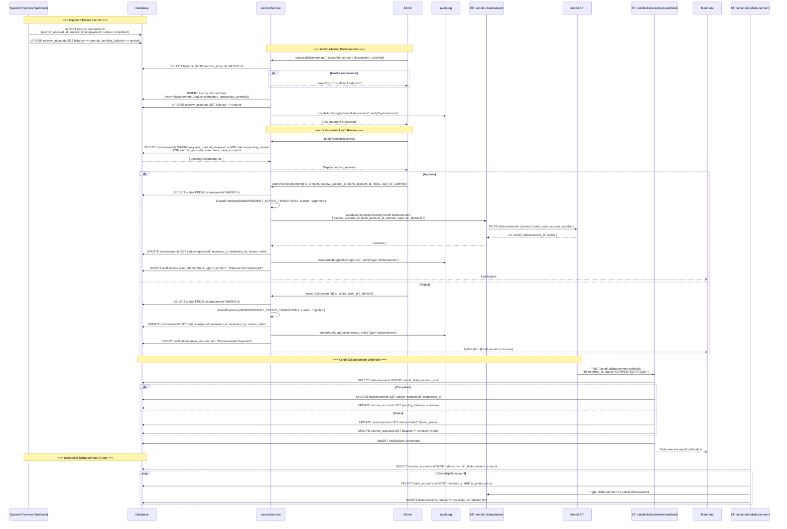
```mermaid
sequenceDiagram
    participant SY as System (Payment Webhook)
    participant DB as Database
    participant ES as escrowService
    participant A as Admin
    participant AL as auditLog
    participant EF1 as EF: xendit-disbursement
    participant XA as Xendit API
    participant EF2 as EF: xendit-disbursement-webhook
    participant M as Merchant

    Note over SY,DB: === Payment Enters Escrow ===

    SY->>DB: INSERT escrow_transactions<br/>(escrow_account_id, amount, type='payment', status='completed')
    SY->>DB: UPDATE escrow_accounts SET balance += amount, pending_balance += amount

    Note over ES,A: === Admin Manual Disbursement ===

    A->>ES: processDisbursement({ accountId, amount, description }, adminId)
    ES->>DB: SELECT balance FROM escrow_accounts WHERE id
    alt Insufficient balance
        ES-->>A: throw Error("Insufficient balance")
    end
    ES->>DB: INSERT escrow_transactions<br/>(type='disbursement', status='completed', processed_at=now())
    ES->>DB: UPDATE escrow_accounts SET balance -= amount
    ES->>AL: createAuditLog(action='disbursement', entityType='escrow')
    ES-->>A: Disbursement processed

    Note over ES,A: === Disbursement with Review ===

    A->>ES: fetchPendingReviews()
    ES->>DB: SELECT disbursements WHERE requires_manual_review=true AND status='pending_review'<br/>JOIN escrow_accounts, merchants, bank_accounts
    DB-->>ES: [ pendingDisbursements ]
    ES-->>A: Display pending reviews

    alt Approve
        A->>ES: approveDisbursement({ id, amount, escrow_account_id, bank_account_id, notes, user_id }, adminId)
        ES->>DB: SELECT status FROM disbursements WHERE id
        ES->>ES: isValidTransition(DISBURSEMENT_STATUS_TRANSITIONS, current, 'approved')

        ES->>EF1: supabase.functions.invoke('xendit-disbursement',<br/>{ escrow_account_id, bank_account_id, amount, type='on_demand' })
        EF1->>XA: POST /disbursements { amount, bank_code, account_number }
        XA-->>EF1: { id: xendit_disbursement_id, status }
        EF1-->>ES: { success }

        ES->>DB: UPDATE disbursements SET status='approved', reviewed_at, reviewed_by, review_notes
        ES->>AL: createAuditLog(action='approve', entityType='disbursement')
        ES->>DB: INSERT notifications (user_id=merchant, type='payment', "Disbursement Approved")
        ES--)M: Notification

    else Reject
        A->>ES: rejectDisbursement({ id, notes, user_id }, adminId)
        ES->>DB: SELECT status FROM disbursements WHERE id
        ES->>ES: isValidTransition(DISBURSEMENT_STATUS_TRANSITIONS, current, 'rejected')
        ES->>DB: UPDATE disbursements SET status='rejected', reviewed_at, reviewed_by, review_notes
        ES->>AL: createAuditLog(action='reject', entityType='disbursement')
        ES->>DB: INSERT notifications (user_id=merchant, "Disbursement Rejected")
        ES--)M: Notification (funds remain in escrow)
    end

    Note over XA,DB: === Xendit Disbursement Webhook ===

    XA->>EF2: POST /xendit-disbursement-webhook<br/>{ id, external_id, status='COMPLETED'/'FAILED' }
    EF2->>DB: SELECT disbursements WHERE xendit_disbursement_id=id
    alt Completed
        EF2->>DB: UPDATE disbursements SET status='completed', completed_at
        EF2->>DB: UPDATE escrow_accounts SET pending_balance -= amount
    else Failed
        EF2->>DB: UPDATE disbursements SET status='failed', failure_reason
        EF2->>DB: UPDATE escrow_accounts SET balance += amount (refund)
    end
    EF2->>DB: INSERT notifications (merchant)
    EF2--)M: Disbursement result notification

    Note over SY,DB: === Scheduled Disbursement (Cron) ===

    participant EF3 as EF: scheduled-disbursement
    EF3->>DB: SELECT escrow_accounts WHERE balance >= min_disbursement_amount
    loop Each eligible account
        EF3->>DB: SELECT bank_accounts WHERE merchant_id AND is_primary=true
        EF3->>EF1: Trigger disbursement via xendit-disbursement
        EF3->>DB: INSERT disbursements (status='processing', scheduled_for)
    end
```

---

## 11. Maintenance Request Full Cycle

Siklus lengkap maintenance request dari tenant submit hingga completion dan review. Sumber: `maintenanceService.ts`.

**Aktor**: Tenant, maintenanceService, Database, Merchant, Vendor, Edge Function (dss-maintenance-priority)

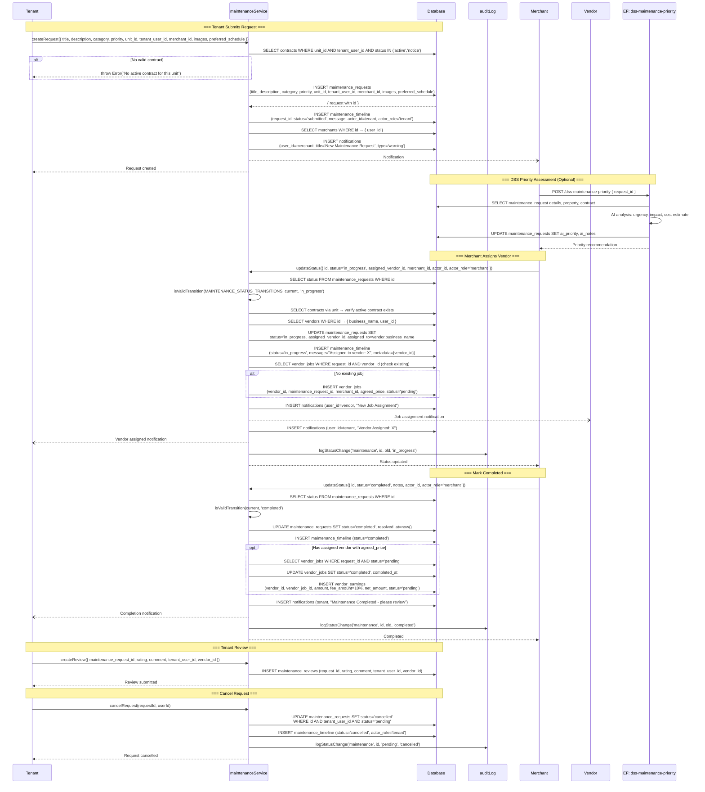
```mermaid
sequenceDiagram
    participant T as Tenant
    participant MS as maintenanceService
    participant DB as Database
    participant AL as auditLog
    participant M as Merchant
    participant V as Vendor
    participant EF as EF: dss-maintenance-priority

    Note over T,DB: === Tenant Submits Request ===

    T->>MS: createRequest({ title, description, category, priority, unit_id, tenant_user_id, merchant_id, images, preferred_schedule })

    MS->>DB: SELECT contracts WHERE unit_id AND tenant_user_id AND status IN ('active','notice')
    alt No valid contract
        MS-->>T: throw Error("No active contract for this unit")
    end

    MS->>DB: INSERT maintenance_requests<br/>(title, description, category, priority, unit_id, tenant_user_id, merchant_id, images, preferred_schedule)
    DB-->>MS: { request with id }

    MS->>DB: INSERT maintenance_timeline<br/>(request_id, status='submitted', message, actor_id=tenant, actor_role='tenant')

    MS->>DB: SELECT merchants WHERE id → { user_id }
    MS->>DB: INSERT notifications<br/>(user_id=merchant, title='New Maintenance Request', type='warning')
    MS--)M: Notification

    MS-->>T: Request created

    Note over EF,DB: === DSS Priority Assessment (Optional) ===

    M->>EF: POST /dss-maintenance-priority { request_id }
    EF->>DB: SELECT maintenance_request details, property, contract
    EF->>EF: AI analysis: urgency, impact, cost estimate
    EF->>DB: UPDATE maintenance_requests SET ai_priority, ai_notes
    EF-->>M: Priority recommendation

    Note over M,DB: === Merchant Assigns Vendor ===

    M->>MS: updateStatus({ id, status='in_progress', assigned_vendor_id, merchant_id, actor_id, actor_role='merchant' })

    MS->>DB: SELECT status FROM maintenance_requests WHERE id
    MS->>MS: isValidTransition(MAINTENANCE_STATUS_TRANSITIONS, current, 'in_progress')

    MS->>DB: SELECT contracts via unit → verify active contract exists

    MS->>DB: SELECT vendors WHERE id → { business_name, user_id }
    MS->>DB: UPDATE maintenance_requests SET<br/>status='in_progress', assigned_vendor_id, assigned_to=vendor.business_name

    MS->>DB: INSERT maintenance_timeline<br/>(status='in_progress', message="Assigned to vendor: X", metadata={vendor_id})

    MS->>DB: SELECT vendor_jobs WHERE request_id AND vendor_id (check existing)
    alt No existing job
        MS->>DB: INSERT vendor_jobs<br/>(vendor_id, maintenance_request_id, merchant_id, agreed_price, status='pending')
    end

    MS->>DB: INSERT notifications (user_id=vendor, "New Job Assignment")
    MS--)V: Job assignment notification
    MS->>DB: INSERT notifications (user_id=tenant, "Vendor Assigned: X")
    MS--)T: Vendor assigned notification

    MS->>AL: logStatusChange('maintenance', id, old, 'in_progress')
    MS-->>M: Status updated

    Note over M,DB: === Mark Completed ===

    M->>MS: updateStatus({ id, status='completed', notes, actor_id, actor_role='merchant' })

    MS->>DB: SELECT status FROM maintenance_requests WHERE id
    MS->>MS: isValidTransition(current, 'completed')

    MS->>DB: UPDATE maintenance_requests SET status='completed', resolved_at=now()
    MS->>DB: INSERT maintenance_timeline (status='completed')

    opt Has assigned vendor with agreed_price
        MS->>DB: SELECT vendor_jobs WHERE request_id AND status='pending'
        MS->>DB: UPDATE vendor_jobs SET status='completed', completed_at
        MS->>DB: INSERT vendor_earnings<br/>(vendor_id, vendor_job_id, amount, fee_amount=10%, net_amount, status='pending')
    end

    MS->>DB: INSERT notifications (tenant, "Maintenance Completed - please review")
    MS--)T: Completion notification

    MS->>AL: logStatusChange('maintenance', id, old, 'completed')
    MS-->>M: Completed

    Note over T,DB: === Tenant Review ===

    T->>MS: createReview({ maintenance_request_id, rating, comment, tenant_user_id, vendor_id })
    MS->>DB: INSERT maintenance_reviews (request_id, rating, comment, tenant_user_id, vendor_id)
    MS-->>T: Review submitted

    Note over T,DB: === Cancel Request ===

    T->>MS: cancelRequest(requestId, userId)
    MS->>DB: UPDATE maintenance_requests SET status='cancelled'<br/>WHERE id AND tenant_user_id AND status='pending'
    MS->>DB: INSERT maintenance_timeline (status='cancelled', actor_role='tenant')
    MS->>AL: logStatusChange('maintenance', id, 'pending', 'cancelled')
    MS-->>T: Request cancelled
```

---

## 12. Move-Out & Deposit Refund

Alur pemberitahuan move-out, inspeksi, dan pengembalian deposit. Sumber: edge functions dan triggers.

**Aktor**: Tenant, Database, Merchant, Edge Function (process-deposit-refund), Trigger

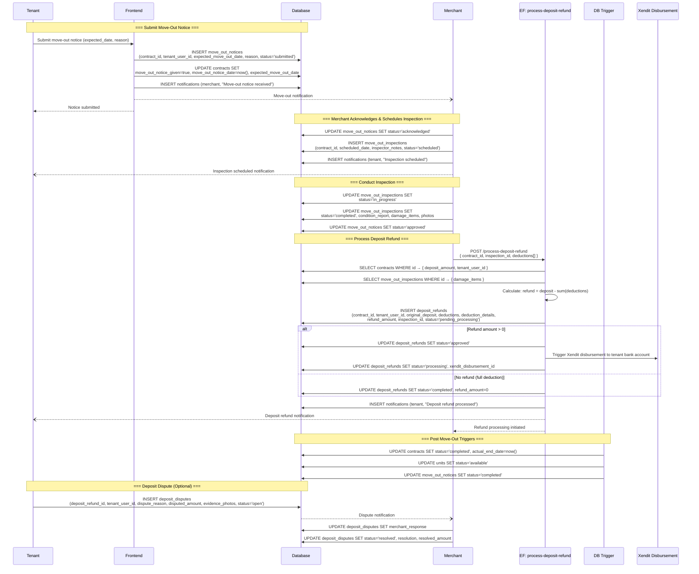
```mermaid
sequenceDiagram
    participant T as Tenant
    participant FE as Frontend
    participant DB as Database
    participant M as Merchant
    participant EF as EF: process-deposit-refund
    participant TR as DB Trigger
    participant XD as Xendit Disbursement

    Note over T,DB: === Submit Move-Out Notice ===

    T->>FE: Submit move-out notice (expected_date, reason)
    FE->>DB: INSERT move_out_notices<br/>(contract_id, tenant_user_id, expected_move_out_date, reason, status='submitted')
    FE->>DB: UPDATE contracts SET<br/>move_out_notice_given=true, move_out_notice_date=now(), expected_move_out_date
    FE->>DB: INSERT notifications (merchant, "Move-out notice received")
    FE--)M: Move-out notification
    FE-->>T: Notice submitted

    Note over M,DB: === Merchant Acknowledges & Schedules Inspection ===

    M->>DB: UPDATE move_out_notices SET status='acknowledged'
    M->>DB: INSERT move_out_inspections<br/>(contract_id, scheduled_date, inspector_notes, status='scheduled')
    M->>DB: INSERT notifications (tenant, "Inspection scheduled")
    M--)T: Inspection scheduled notification

    Note over M,DB: === Conduct Inspection ===

    M->>DB: UPDATE move_out_inspections SET<br/>status='in_progress'
    M->>DB: UPDATE move_out_inspections SET<br/>status='completed', condition_report, damage_items, photos
    M->>DB: UPDATE move_out_notices SET status='approved'

    Note over M,DB: === Process Deposit Refund ===

    M->>EF: POST /process-deposit-refund<br/>{ contract_id, inspection_id, deductions[] }

    EF->>DB: SELECT contracts WHERE id → { deposit_amount, tenant_user_id }
    EF->>DB: SELECT move_out_inspections WHERE id → { damage_items }

    EF->>EF: Calculate: refund = deposit - sum(deductions)

    EF->>DB: INSERT deposit_refunds<br/>(contract_id, tenant_user_id, original_deposit, deductions, deduction_details,<br/>refund_amount, inspection_id, status='pending_processing')

    alt Refund amount > 0
        EF->>DB: UPDATE deposit_refunds SET status='approved'
        EF->>XD: Trigger Xendit disbursement to tenant bank account
        EF->>DB: UPDATE deposit_refunds SET status='processing', xendit_disbursement_id
    else No refund (full deduction)
        EF->>DB: UPDATE deposit_refunds SET status='completed', refund_amount=0
    end

    EF->>DB: INSERT notifications (tenant, "Deposit refund processed")
    EF--)T: Deposit refund notification
    EF-->>M: Refund processing initiated

    Note over TR,DB: === Post Move-Out Triggers ===

    TR->>DB: UPDATE contracts SET status='completed', actual_end_date=now()
    TR->>DB: UPDATE units SET status='available'
    TR->>DB: UPDATE move_out_notices SET status='completed'

    Note over T,DB: === Deposit Dispute (Optional) ===

    T->>DB: INSERT deposit_disputes<br/>(deposit_refund_id, tenant_user_id, dispute_reason, disputed_amount, evidence_photos, status='open')
    DB--)M: Dispute notification
    M->>DB: UPDATE deposit_disputes SET merchant_response
    M->>DB: UPDATE deposit_disputes SET status='resolved', resolution, resolved_amount
```

---

## 13. Overdue Escalation & Collections

Sistem otomatis mendeteksi invoice overdue dan mengelola collections. Sumber: edge functions cron.

**Aktor**: System (cron), Edge Functions, Database, Merchant, Tenant

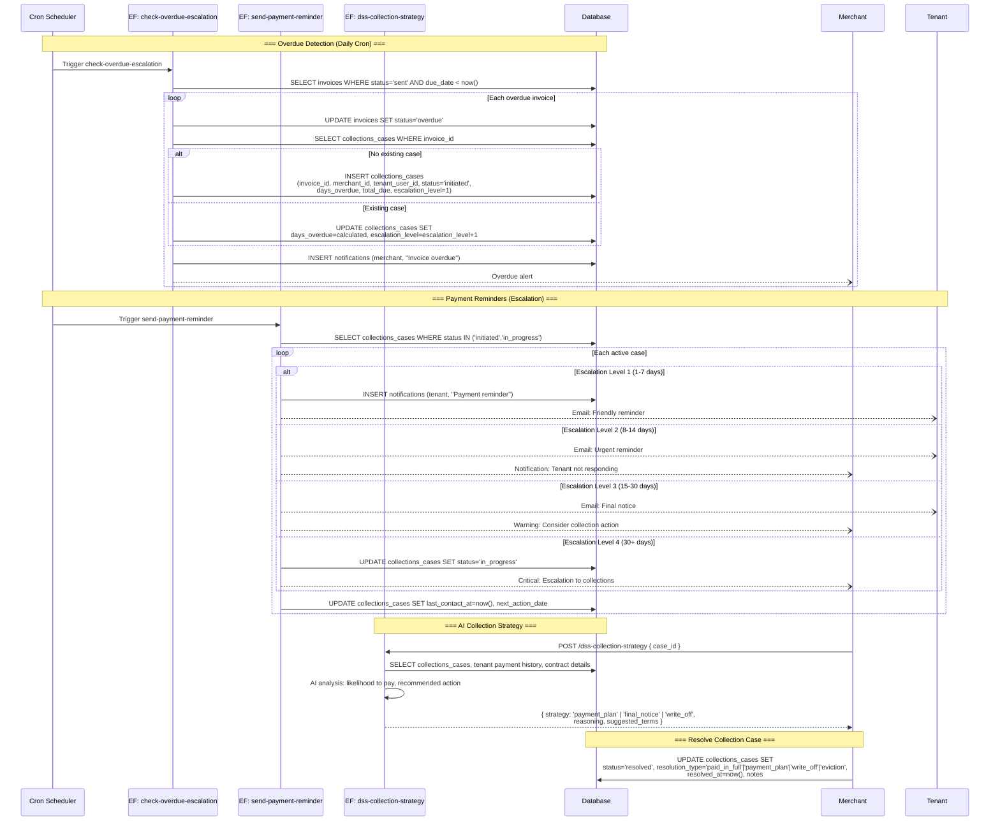
```mermaid
sequenceDiagram
    participant CR as Cron Scheduler
    participant EF1 as EF: check-overdue-escalation
    participant EF2 as EF: send-payment-reminder
    participant EF3 as EF: dss-collection-strategy
    participant DB as Database
    participant M as Merchant
    participant T as Tenant

    Note over CR,DB: === Overdue Detection (Daily Cron) ===

    CR->>EF1: Trigger check-overdue-escalation
    EF1->>DB: SELECT invoices WHERE status='sent' AND due_date < now()

    loop Each overdue invoice
        EF1->>DB: UPDATE invoices SET status='overdue'

        EF1->>DB: SELECT collections_cases WHERE invoice_id
        alt No existing case
            EF1->>DB: INSERT collections_cases<br/>(invoice_id, merchant_id, tenant_user_id, status='initiated',<br/>days_overdue, total_due, escalation_level=1)
        else Existing case
            EF1->>DB: UPDATE collections_cases SET<br/>days_overdue=calculated, escalation_level=escalation_level+1
        end

        EF1->>DB: INSERT notifications (merchant, "Invoice overdue")
        EF1--)M: Overdue alert
    end

    Note over CR,T: === Payment Reminders (Escalation) ===

    CR->>EF2: Trigger send-payment-reminder
    EF2->>DB: SELECT collections_cases WHERE status IN ('initiated','in_progress')

    loop Each active case
        alt Escalation Level 1 (1-7 days)
            EF2->>DB: INSERT notifications (tenant, "Payment reminder")
            EF2--)T: Email: Friendly reminder
        else Escalation Level 2 (8-14 days)
            EF2--)T: Email: Urgent reminder
            EF2--)M: Notification: Tenant not responding
        else Escalation Level 3 (15-30 days)
            EF2--)T: Email: Final notice
            EF2--)M: Warning: Consider collection action
        else Escalation Level 4 (30+ days)
            EF2->>DB: UPDATE collections_cases SET status='in_progress'
            EF2--)M: Critical: Escalation to collections
        end
        EF2->>DB: UPDATE collections_cases SET last_contact_at=now(), next_action_date
    end

    Note over EF3,DB: === AI Collection Strategy ===

    M->>EF3: POST /dss-collection-strategy { case_id }
    EF3->>DB: SELECT collections_cases, tenant payment history, contract details
    EF3->>EF3: AI analysis: likelihood to pay, recommended action
    EF3-->>M: { strategy: 'payment_plan' | 'final_notice' | 'write_off',<br/>reasoning, suggested_terms }

    Note over M,DB: === Resolve Collection Case ===

    M->>DB: UPDATE collections_cases SET<br/>status='resolved', resolution_type='paid_in_full'|'payment_plan'|'write_off'|'eviction',<br/>resolved_at=now(), notes
```

---

## 14. AI/DSS Advisory

Merchant meminta rekomendasi AI untuk pricing, investasi, dan forecasting. Sumber: multiple DSS edge functions.

**Aktor**: Merchant, Edge Functions (dss-pricing-advisor, dss-investment-insight, ml-*), Database

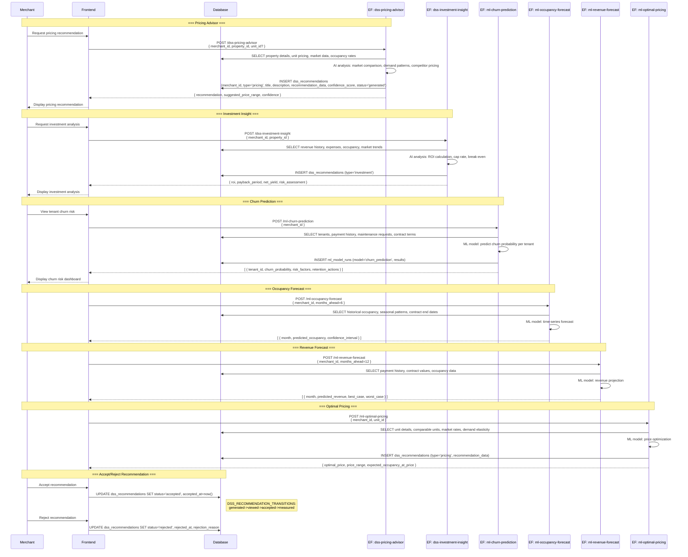
```mermaid
sequenceDiagram
    participant M as Merchant
    participant FE as Frontend
    participant DB as Database

    participant EF1 as EF: dss-pricing-advisor
    participant EF2 as EF: dss-investment-insight
    participant EF3 as EF: ml-churn-prediction
    participant EF4 as EF: ml-occupancy-forecast
    participant EF5 as EF: ml-revenue-forecast
    participant EF6 as EF: ml-optimal-pricing

    Note over M,EF1: === Pricing Advisor ===

    M->>FE: Request pricing recommendation
    FE->>EF1: POST /dss-pricing-advisor<br/>{ merchant_id, property_id, unit_id? }
    EF1->>DB: SELECT property details, unit pricing, market data, occupancy rates
    EF1->>EF1: AI analysis: market comparison, demand patterns, competitor pricing
    EF1->>DB: INSERT dss_recommendations<br/>(merchant_id, type='pricing', title, description, recommendation_data, confidence_score, status='generated')
    EF1-->>FE: { recommendation, suggested_price_range, confidence }
    FE-->>M: Display pricing recommendation

    Note over M,EF2: === Investment Insight ===

    M->>FE: Request investment analysis
    FE->>EF2: POST /dss-investment-insight<br/>{ merchant_id, property_id }
    EF2->>DB: SELECT revenue history, expenses, occupancy, market trends
    EF2->>EF2: AI analysis: ROI calculation, cap rate, break-even
    EF2->>DB: INSERT dss_recommendations (type='investment')
    EF2-->>FE: { roi, payback_period, net_yield, risk_assessment }
    FE-->>M: Display investment analysis

    Note over M,EF3: === Churn Prediction ===

    M->>FE: View tenant churn risk
    FE->>EF3: POST /ml-churn-prediction<br/>{ merchant_id }
    EF3->>DB: SELECT tenants, payment history, maintenance requests, contract terms
    EF3->>EF3: ML model: predict churn probability per tenant
    EF3->>DB: INSERT ml_model_runs (model='churn_prediction', results)
    EF3-->>FE: [ { tenant_id, churn_probability, risk_factors, retention_actions } ]
    FE-->>M: Display churn risk dashboard

    Note over M,EF4: === Occupancy Forecast ===

    FE->>EF4: POST /ml-occupancy-forecast<br/>{ merchant_id, months_ahead=6 }
    EF4->>DB: SELECT historical occupancy, seasonal patterns, contract end dates
    EF4->>EF4: ML model: time-series forecast
    EF4-->>FE: [ { month, predicted_occupancy, confidence_interval } ]

    Note over M,EF5: === Revenue Forecast ===

    FE->>EF5: POST /ml-revenue-forecast<br/>{ merchant_id, months_ahead=12 }
    EF5->>DB: SELECT payment history, contract values, occupancy data
    EF5->>EF5: ML model: revenue projection
    EF5-->>FE: [ { month, predicted_revenue, best_case, worst_case } ]

    Note over M,EF6: === Optimal Pricing ===

    FE->>EF6: POST /ml-optimal-pricing<br/>{ merchant_id, unit_id }
    EF6->>DB: SELECT unit details, comparable units, market rates, demand elasticity
    EF6->>EF6: ML model: price optimization
    EF6->>DB: INSERT dss_recommendations (type='pricing', recommendation_data)
    EF6-->>FE: { optimal_price, price_range, expected_occupancy_at_price }

    Note over M,DB: === Accept/Reject Recommendation ===

    M->>FE: Accept recommendation
    FE->>DB: UPDATE dss_recommendations SET status='accepted', accepted_at=now()
    Note right of DB: DSS_RECOMMENDATION_TRANSITIONS:<br/>generated->viewed->accepted->measured

    M->>FE: Reject recommendation
    FE->>DB: UPDATE dss_recommendations SET status='rejected', rejected_at, rejection_reason
```

---

## 15. Referral System

Sistem referral antar merchant. Sumber: edge functions process-referral-commissions dan process-referral-reward.

**Aktor**: Merchant (Referrer), Database, Edge Functions, Referee (New Merchant)

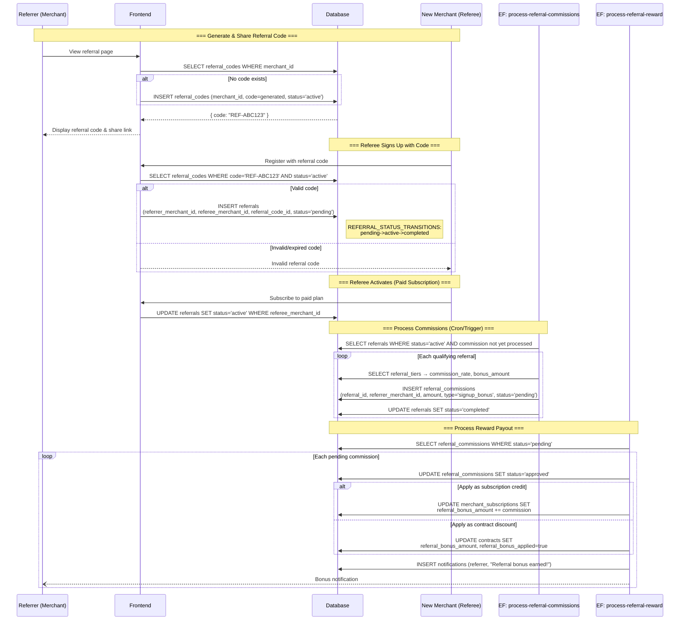
```mermaid
sequenceDiagram
    participant R as Referrer (Merchant)
    participant FE as Frontend
    participant DB as Database
    participant NM as New Merchant (Referee)
    participant EF1 as EF: process-referral-commissions
    participant EF2 as EF: process-referral-reward

    Note over R,NM: === Generate & Share Referral Code ===

    R->>FE: View referral page
    FE->>DB: SELECT referral_codes WHERE merchant_id
    alt No code exists
        FE->>DB: INSERT referral_codes (merchant_id, code=generated, status='active')
    end
    DB-->>FE: { code: "REF-ABC123" }
    FE-->>R: Display referral code & share link

    Note over NM,DB: === Referee Signs Up with Code ===

    NM->>FE: Register with referral code
    FE->>DB: SELECT referral_codes WHERE code='REF-ABC123' AND status='active'
    alt Valid code
        FE->>DB: INSERT referrals<br/>(referrer_merchant_id, referee_merchant_id, referral_code_id, status='pending')
        Note right of DB: REFERRAL_STATUS_TRANSITIONS:<br/>pending->active->completed
    else Invalid/expired code
        FE-->>NM: Invalid referral code
    end

    Note over NM,DB: === Referee Activates (Paid Subscription) ===

    NM->>FE: Subscribe to paid plan
    FE->>DB: UPDATE referrals SET status='active' WHERE referee_merchant_id

    Note over EF1,DB: === Process Commissions (Cron/Trigger) ===

    EF1->>DB: SELECT referrals WHERE status='active' AND commission not yet processed
    loop Each qualifying referral
        EF1->>DB: SELECT referral_tiers → commission_rate, bonus_amount
        EF1->>DB: INSERT referral_commissions<br/>(referral_id, referrer_merchant_id, amount, type='signup_bonus', status='pending')
        EF1->>DB: UPDATE referrals SET status='completed'
    end

    Note over EF2,DB: === Process Reward Payout ===

    EF2->>DB: SELECT referral_commissions WHERE status='pending'
    loop Each pending commission
        EF2->>DB: UPDATE referral_commissions SET status='approved'

        alt Apply as subscription credit
            EF2->>DB: UPDATE merchant_subscriptions SET<br/>referral_bonus_amount += commission
        else Apply as contract discount
            EF2->>DB: UPDATE contracts SET<br/>referral_bonus_amount, referral_bonus_applied=true
        end

        EF2->>DB: INSERT notifications (referrer, "Referral bonus earned!")
        EF2--)R: Bonus notification
    end
```

---

## 16. Merchant Suspend/Reactivate (Admin)

Admin men-suspend atau mereaktivasi merchant. Sumber: `merchantService.suspendMerchant()`.

**Aktor**: Admin, merchantService, Database, auditLog, Merchant

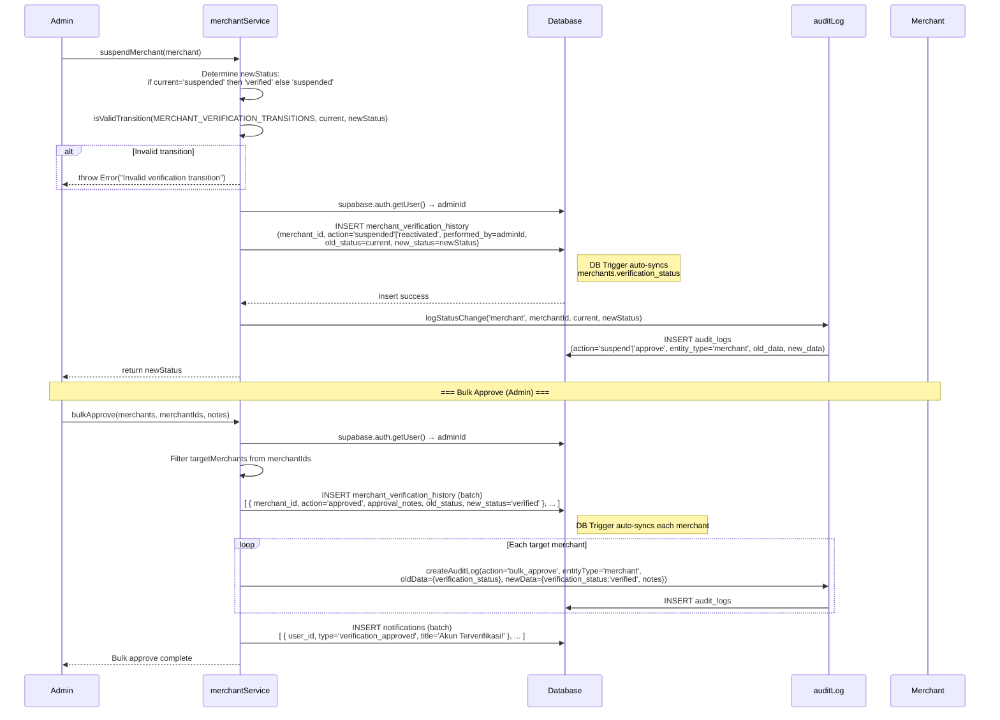
```mermaid
sequenceDiagram
    participant A as Admin
    participant MS as merchantService
    participant DB as Database
    participant AL as auditLog
    participant M as Merchant

    A->>MS: suspendMerchant(merchant)
    MS->>MS: Determine newStatus:<br/>if current='suspended' then 'verified' else 'suspended'
    MS->>MS: isValidTransition(MERCHANT_VERIFICATION_TRANSITIONS, current, newStatus)

    alt Invalid transition
        MS-->>A: throw Error("Invalid verification transition")
    end

    MS->>DB: supabase.auth.getUser() → adminId

    MS->>DB: INSERT merchant_verification_history<br/>(merchant_id, action='suspended'|'reactivated', performed_by=adminId,<br/>old_status=current, new_status=newStatus)
    Note right of DB: DB Trigger auto-syncs<br/>merchants.verification_status

    DB-->>MS: Insert success

    MS->>AL: logStatusChange('merchant', merchantId, current, newStatus)
    AL->>DB: INSERT audit_logs<br/>(action='suspend'|'approve', entity_type='merchant', old_data, new_data)

    MS-->>A: return newStatus

    Note over A,M: === Bulk Approve (Admin) ===

    A->>MS: bulkApprove(merchants, merchantIds, notes)
    MS->>DB: supabase.auth.getUser() → adminId
    MS->>MS: Filter targetMerchants from merchantIds

    MS->>DB: INSERT merchant_verification_history (batch)<br/>[ { merchant_id, action='approved', approval_notes, old_status, new_status='verified' }, ... ]
    Note right of DB: DB Trigger auto-syncs each merchant

    loop Each target merchant
        MS->>AL: createAuditLog(action='bulk_approve', entityType='merchant',<br/>oldData={verification_status}, newData={verification_status:'verified', notes})
        AL->>DB: INSERT audit_logs
    end

    MS->>DB: INSERT notifications (batch)<br/>[ { user_id, type='verification_approved', title='Akun Terverifikasi!' }, ... ]

    MS-->>A: Bulk approve complete
```

---

## Appendix A: Edge Function Invocation Map

Tabel yang menunjukkan sequence diagram mana memanggil edge function mana.

| Edge Function | Dipanggil dari Sequence | Tipe Invocation |
|--------------|------------------------|-----------------|
| `ensure-user-bootstrap` | 1. Registration | Auth hook (automatic) |
| `send-notification` | 2. Verification, 7. Invoice | `supabase.functions.invoke()` |
| `create-tenant-account` | 6. Tenant Invitation | `supabase.functions.invoke()` |
| `get-tenant-invitation` | 6. Tenant Invitation | HTTP GET |
| `accept-tenant-invitation` | 6. Tenant Invitation | HTTP POST |
| `xendit-create-invoice` | 8. Payment | `supabase.functions.invoke()` |
| `xendit-webhook` | 8. Payment | Xendit callback (POST) |
| `ocr-payment-proof` | 9. Payment Verification | `supabase.functions.invoke()` |
| `xendit-disbursement` | 10. Escrow | `supabase.functions.invoke()` |
| `xendit-disbursement-webhook` | 10. Escrow | Xendit callback (POST) |
| `scheduled-disbursement` | 10. Escrow | Cron |
| `dss-maintenance-priority` | 11. Maintenance | HTTP POST |
| `process-deposit-refund` | 12. Move-Out | HTTP POST |
| `check-overdue-escalation` | 13. Collections | Cron |
| `send-payment-reminder` | 7. Invoice, 13. Collections | HTTP POST / Cron |
| `dss-collection-strategy` | 13. Collections | HTTP POST |
| `dss-pricing-advisor` | 14. AI/DSS | HTTP POST |
| `dss-investment-insight` | 14. AI/DSS | HTTP POST |
| `ml-churn-prediction` | 14. AI/DSS | HTTP POST |
| `ml-occupancy-forecast` | 14. AI/DSS | HTTP POST |
| `ml-revenue-forecast` | 14. AI/DSS | HTTP POST |
| `ml-optimal-pricing` | 14. AI/DSS | HTTP POST |
| `subscription-billing` | 3. Subscription | Cron |
| `subscription-payment` | 3. Subscription | HTTP POST |
| `subscription-renewal` | 3. Subscription | Cron |
| `subscription-grace-check` | 3. Subscription | Cron |
| `auto-generate-invoices` | 7. Invoice | Cron |
| `process-referral-commissions` | 15. Referral | Cron/Trigger |
| `process-referral-reward` | 15. Referral | Cron/Trigger |

---

## Appendix B: Cross-Diagram References

Bagaimana sequence saling terkait dan saling trigger.

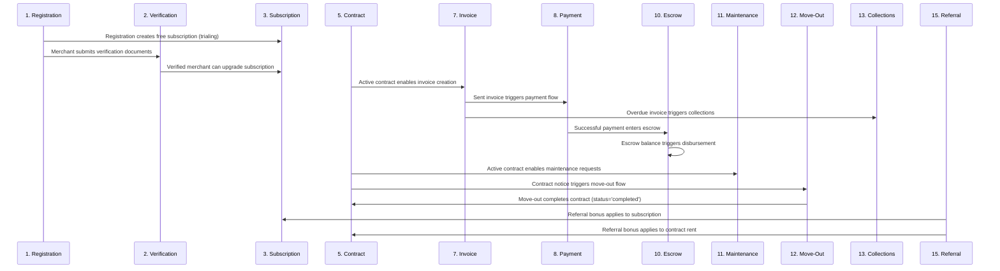
```mermaid
sequenceDiagram
    participant S1 as 1. Registration
    participant S2 as 2. Verification
    participant S3 as 3. Subscription
    participant S5 as 5. Contract
    participant S7 as 7. Invoice
    participant S8 as 8. Payment
    participant S10 as 10. Escrow
    participant S11 as 11. Maintenance
    participant S12 as 12. Move-Out
    participant S13 as 13. Collections
    participant S15 as 15. Referral

    S1->>S3: Registration creates free subscription (trialing)
    S1->>S2: Merchant submits verification documents
    S2->>S3: Verified merchant can upgrade subscription

    S5->>S7: Active contract enables invoice creation
    S7->>S8: Sent invoice triggers payment flow
    S7->>S13: Overdue invoice triggers collections

    S8->>S10: Successful payment enters escrow
    S10->>S10: Escrow balance triggers disbursement

    S5->>S11: Active contract enables maintenance requests
    S5->>S12: Contract notice triggers move-out flow
    S12->>S5: Move-out completes contract (status='completed')

    S15->>S3: Referral bonus applies to subscription
    S15->>S5: Referral bonus applies to contract rent
```

---

## Appendix C: Tabel Ringkasan Interaksi

| Sequence | DB Writes | Notifications | Edge Functions | External API |
|----------|-----------|---------------|----------------|--------------|
| 1. Registration | 4 INSERTs | 0 | 1 (bootstrap) | 0 |
| 2. Verification | 3 INSERTs | 1 in-app + 1 email | 1 (send-notification) | 0 |
| 3. Subscription | 2-3 INSERTs/UPDATEs | 1-2 | 4 (billing, payment, renewal, grace) | 0 |
| 4. Property | 2-3 INSERTs/UPDATEs | 0 | 0 | 0 |
| 5. Contract | 2-4 INSERTs/UPDATEs | 0 | 0 | 0 |
| 6. Tenant Invitation | 3-4 INSERTs | 0 | 3 (create, get, accept) | 0 |
| 7. Invoice | 2-3 INSERTs/UPDATEs | 1-2 | 2 (send-notification, auto-generate) | 0 |
| 8. Payment | 2-3 INSERTs/UPDATEs | 1-2 | 2 (xendit-create, webhook) | 1 (Xendit API) |
| 9. OCR Verification | 2-3 INSERTs/UPDATEs | 1-2 | 1 (ocr-payment-proof) | 1 (AI Model) |
| 10. Escrow | 3-5 INSERTs/UPDATEs | 1-2 | 3 (disbursement, webhook, scheduled) | 1 (Xendit API) |
| 11. Maintenance | 4-7 INSERTs/UPDATEs | 2-3 | 1 (dss-maintenance-priority) | 0 |
| 12. Move-Out | 5-7 INSERTs/UPDATEs | 2-3 | 1 (process-deposit-refund) | 1 (Xendit) |
| 13. Collections | 2-4 INSERTs/UPDATEs | 2-4 | 3 (overdue, reminder, dss-strategy) | 0 |
| 14. AI/DSS | 1-2 INSERTs | 0 | 6 (pricing, investment, churn, occupancy, revenue, optimal) | 0 (AI built-in) |
| 15. Referral | 3-5 INSERTs/UPDATEs | 1-2 | 2 (commissions, reward) | 0 |
| 16. Suspend/Reactivate | 2-3 INSERTs | 1 (batch for bulk) | 0 | 0 |
