# Merchant State Machine Diagram

> **Dokumen ini berisi semua 27 state machine** dari `src/shared/constants/state-machines.ts` dalam bentuk Mermaid `stateDiagram-v2`.
> Fokus pada **transisi status murni** — setiap state, transisi yang diizinkan, dan terminal state terdokumentasi.
>
> Berbeda dengan `merchant_activity_diagram.md` yang fokus pada alur aktivitas/proses.

---

## Daftar Isi

1. [Merchant Verification](#1-merchant-verification)
2. [Subscription Status](#2-subscription-status)
3. [Contract Status](#3-contract-status)
4. [Contract Signature](#4-contract-signature)
5. [Unit Status](#5-unit-status)
6. [Invoice Status](#6-invoice-status)
7. [Payment Status](#7-payment-status)
8. [Payment Plan Status](#8-payment-plan-status)
9. [Payment Verification](#9-payment-verification)
10. [Maintenance Request](#10-maintenance-request)
11. [Move-Out Notice](#11-move-out-notice)
12. [Move-Out Inspection](#12-move-out-inspection)
13. [Early Termination](#13-early-termination)
14. [Deposit Refund](#14-deposit-refund)
15. [Escrow Transaction](#15-escrow-transaction)
16. [Disbursement Status](#16-disbursement-status)
17. [Collections Case](#17-collections-case)
18. [Tenant Invitation](#18-tenant-invitation)
19. [Referral Status](#19-referral-status)
20. [Document Verification](#20-document-verification)
21. [Vendor Job Status](#21-vendor-job-status)
22. [Vendor Verification](#22-vendor-verification)
23. [Order Status (Marketplace)](#23-order-status-marketplace)
24. [Forum Report](#24-forum-report)
25. [OCR Result](#25-ocr-result)
26. [DSS Recommendation](#26-dss-recommendation)
27. [Dispute Status](#27-dispute-status)
28. [Appendix A: Ringkasan Semua State Machines](#appendix-a-ringkasan-semua-state-machines)
29. [Appendix B: Cross-Domain Dependencies](#appendix-b-cross-domain-dependencies)
30. [Appendix C: Helper Functions](#appendix-c-helper-functions)

---

## 1. Merchant Verification

**Constant:** `MERCHANT_VERIFICATION_TRANSITIONS`
**Deskripsi:** Mengelola status verifikasi merchant — dari pending hingga verified/rejected, dengan kemampuan resubmit dan suspend.

### Tabel Transisi

| From | To |
|------|-----|
| `pending` | `verified`, `rejected` |
| `rejected` | `pending` |
| `verified` | `suspended` |
| `suspended` | `verified` |

### Diagram

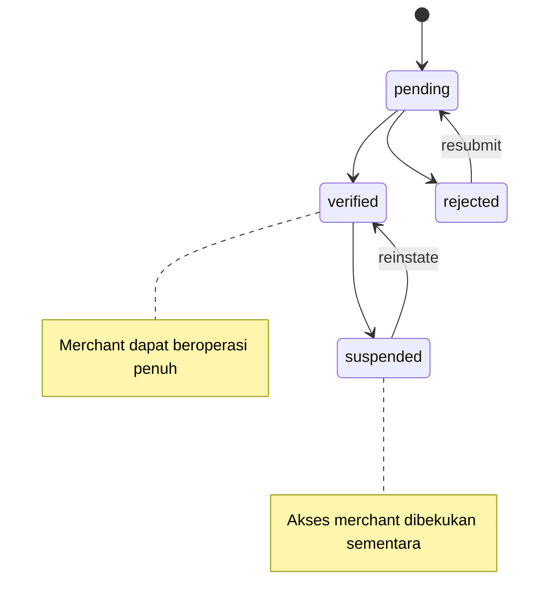
```mermaid
stateDiagram-v2
    [*] --> pending
    pending --> verified
    pending --> rejected
    rejected --> pending : resubmit
    verified --> suspended
    suspended --> verified : reinstate

    note right of verified : Merchant dapat beroperasi penuh
    note right of suspended : Akses merchant dibekukan sementara
```

---

## 2. Subscription Status

**Constant:** `SUBSCRIPTION_STATUS_TRANSITIONS`
**Deskripsi:** Lifecycle langganan merchant — dari trial hingga cancelled, termasuk penanganan keterlambatan pembayaran.

### Tabel Transisi

| From | To |
|------|-----|
| `trialing` | `active`, `cancelled` |
| `active` | `past_due`, `cancelled` |
| `past_due` | `active`, `suspended` |
| `suspended` | `active`, `cancelled` |
| `cancelled` | _(terminal)_ |

### Diagram

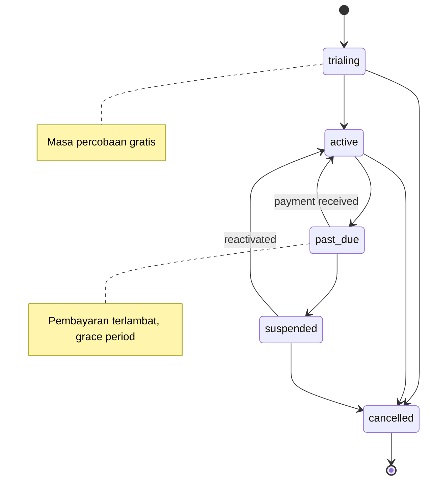
```mermaid
stateDiagram-v2
    [*] --> trialing
    trialing --> active
    trialing --> cancelled
    active --> past_due
    active --> cancelled
    past_due --> active : payment received
    past_due --> suspended
    suspended --> active : reactivated
    suspended --> cancelled
    cancelled --> [*]

    note right of trialing : Masa percobaan gratis
    note right of past_due : Pembayaran terlambat, grace period
```

---

## 3. Contract Status

**Constant:** `CONTRACT_STATUS_TRANSITIONS`
**Deskripsi:** Lifecycle kontrak sewa — dari draft hingga completed/terminated. Status `active` hanya tercapai setelah tanda tangan lengkap (`fully_signed`).

### Tabel Transisi

| From | To |
|------|-----|
| `draft` | `active`, `cancelled` |
| `pending_signature` | `active`, `cancelled` |
| `active` | `notice`, `terminated`, `expired` |
| `notice` | `completed` |
| `terminated` | _(terminal)_ |
| `expired` | _(terminal)_ |
| `completed` | _(terminal)_ |
| `cancelled` | _(terminal)_ |

### Diagram

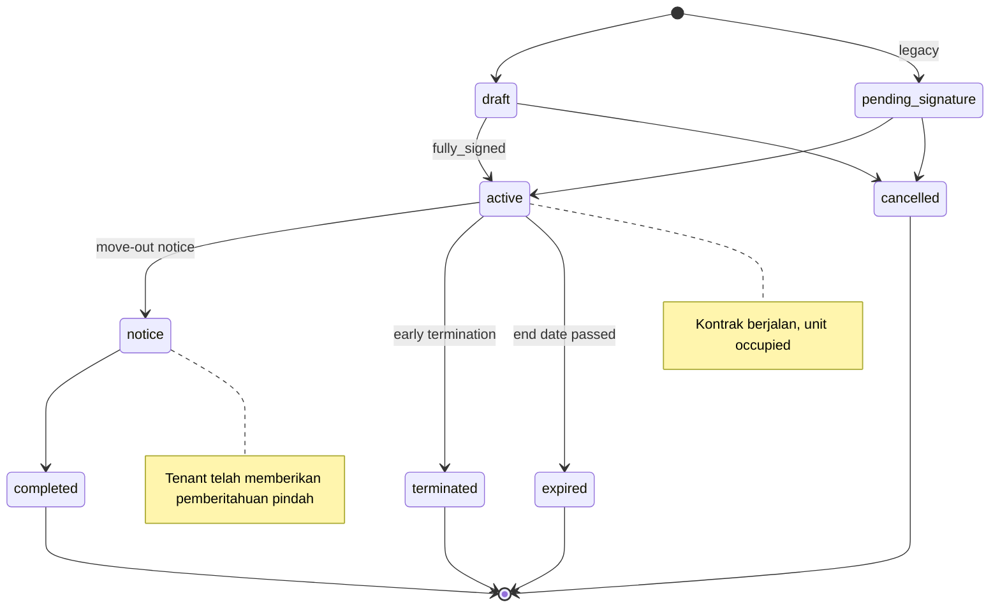
```mermaid
stateDiagram-v2
    [*] --> draft
    [*] --> pending_signature : legacy
    draft --> active : fully_signed
    draft --> cancelled
    pending_signature --> active
    pending_signature --> cancelled
    active --> notice : move-out notice
    active --> terminated : early termination
    active --> expired : end date passed
    notice --> completed
    terminated --> [*]
    expired --> [*]
    completed --> [*]
    cancelled --> [*]

    note right of active : Kontrak berjalan, unit occupied
    note right of notice : Tenant telah memberikan pemberitahuan pindah
```

---

## 4. Contract Signature

**Constant:** `CONTRACT_SIGNATURE_TRANSITIONS`
**Deskripsi:** Sub-state untuk proses tanda tangan digital kontrak. Kedua pihak (merchant dan tenant) harus menandatangani. `fully_signed` memicu kontrak menjadi active dan unit menjadi occupied.

### Tabel Transisi

| From | To |
|------|-----|
| `pending` | `merchant_signed`, `tenant_signed` |
| `merchant_signed` | `fully_signed` |
| `tenant_signed` | `fully_signed` |
| `fully_signed` | _(terminal)_ |

### Diagram

```mermaid
stateDiagram-v2
    [*] --> pending
    pending --> merchant_signed : merchant signs
    pending --> tenant_signed : tenant signs
    merchant_signed --> fully_signed : tenant signs
    tenant_signed --> fully_signed : merchant signs
    fully_signed --> [*]

    note right of fully_signed : Triggers: contract -> active, unit -> occupied
```

---

## 5. Unit Status

**Constant:** `UNIT_STATUS_TRANSITIONS`
**Deskripsi:** Status unit properti. Bersifat siklis — tidak ada terminal state. Unit dapat berpindah antar status berdasarkan kontrak dan maintenance.

### Tabel Transisi

| From | To |
|------|-----|
| `available` | `occupied`, `maintenance` |
| `occupied` | `available`, `maintenance` |
| `maintenance` | `available`, `occupied` |

### Diagram

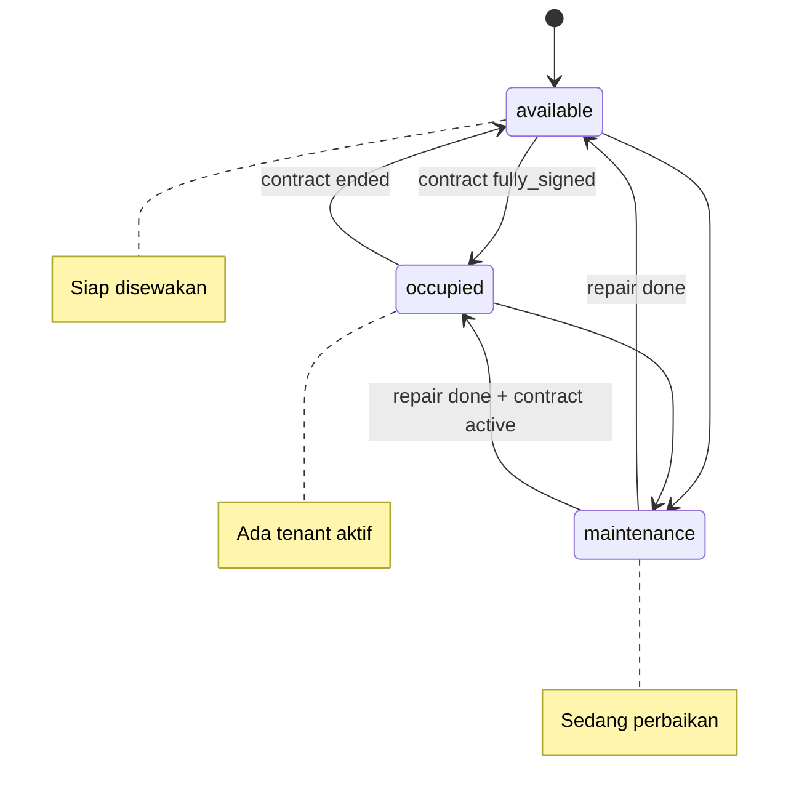
```mermaid
stateDiagram-v2
    [*] --> available
    available --> occupied : contract fully_signed
    available --> maintenance
    occupied --> available : contract ended
    occupied --> maintenance
    maintenance --> available : repair done
    maintenance --> occupied : repair done + contract active

    note right of available : Siap disewakan
    note right of occupied : Ada tenant aktif
    note right of maintenance : Sedang perbaikan
```

---

## 6. Invoice Status

**Constant:** `INVOICE_STATUS_TRANSITIONS`
**Deskripsi:** Lifecycle invoice — dari draft hingga paid/cancelled, termasuk status overdue dan partial payment.

### Tabel Transisi

| From | To |
|------|-----|
| `draft` | `sent`, `cancelled` |
| `sent` | `paid`, `overdue`, `cancelled`, `partially_paid` |
| `overdue` | `paid`, `cancelled` |
| `partially_paid` | `paid`, `cancelled` |
| `pending` | `paid`, `overdue`, `cancelled` |
| `paid` | _(terminal)_ |
| `cancelled` | _(terminal)_ |

### Diagram

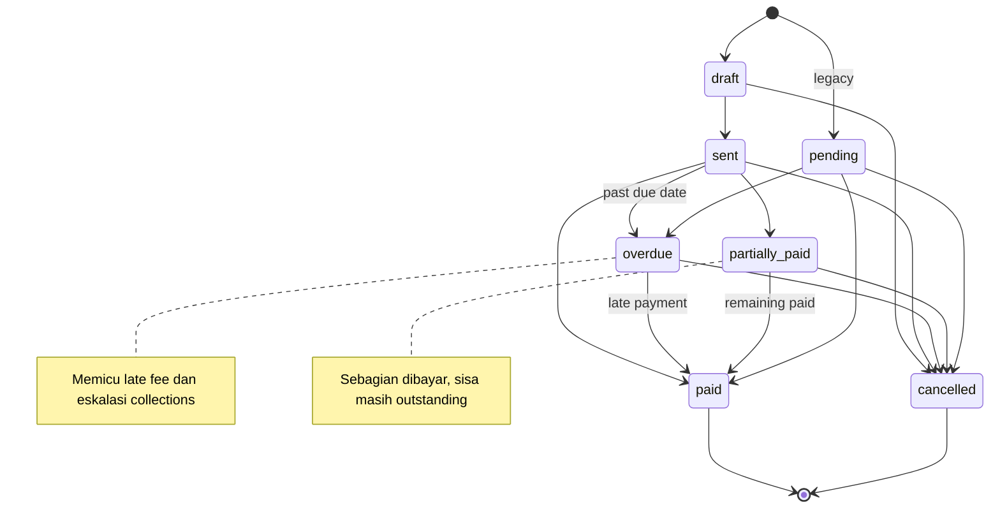
```mermaid
stateDiagram-v2
    [*] --> draft
    [*] --> pending : legacy
    draft --> sent
    draft --> cancelled
    sent --> paid
    sent --> overdue : past due date
    sent --> cancelled
    sent --> partially_paid
    overdue --> paid : late payment
    overdue --> cancelled
    partially_paid --> paid : remaining paid
    partially_paid --> cancelled
    pending --> paid
    pending --> overdue
    pending --> cancelled
    paid --> [*]
    cancelled --> [*]

    note right of overdue : Memicu late fee dan eskalasi collections
    note right of partially_paid : Sebagian dibayar, sisa masih outstanding
```

---

## 7. Payment Status

**Constant:** `PAYMENT_STATUS_TRANSITIONS`
**Deskripsi:** Status pembayaran individual — dari pending hingga paid/failed.

### Tabel Transisi

| From | To |
|------|-----|
| `pending` | `paid`, `overdue`, `failed` |
| `overdue` | `paid` |
| `paid` | _(terminal)_ |
| `cancelled` | _(terminal)_ |
| `failed` | _(terminal)_ |

### Diagram

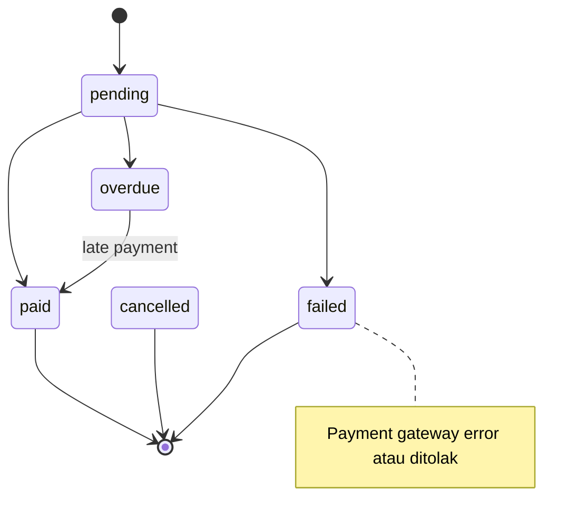
```mermaid
stateDiagram-v2
    [*] --> pending
    pending --> paid
    pending --> overdue
    pending --> failed
    overdue --> paid : late payment
    paid --> [*]
    cancelled --> [*]
    failed --> [*]

    note right of failed : Payment gateway error atau ditolak
```

---

## 8. Payment Plan Status

**Constant:** `PAYMENT_PLAN_STATUS_TRANSITIONS`
**Deskripsi:** Lifecycle rencana cicilan — dari negosiasi hingga completed/defaulted.

### Tabel Transisi

| From | To |
|------|-----|
| `pending_acceptance` | `accepted`, `cancelled` |
| `accepted` | `active` |
| `active` | `completed`, `defaulted` |
| `completed` | _(terminal)_ |
| `defaulted` | _(terminal)_ |
| `cancelled` | _(terminal)_ |

### Diagram

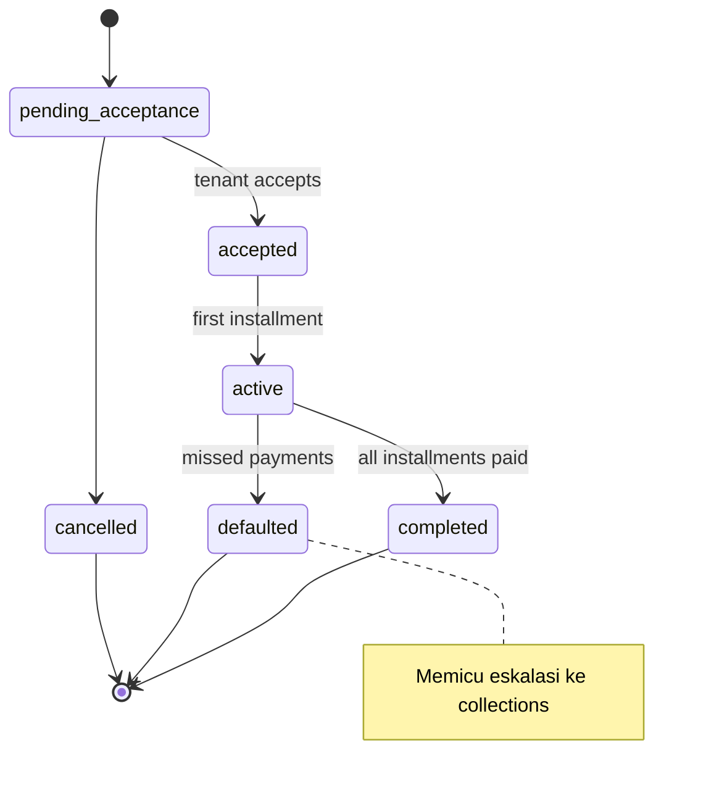
```mermaid
stateDiagram-v2
    [*] --> pending_acceptance
    pending_acceptance --> accepted : tenant accepts
    pending_acceptance --> cancelled
    accepted --> active : first installment
    active --> completed : all installments paid
    active --> defaulted : missed payments
    completed --> [*]
    defaulted --> [*]
    cancelled --> [*]

    note right of defaulted : Memicu eskalasi ke collections
```

---

## 9. Payment Verification

**Constant:** `PAYMENT_VERIFICATION_TRANSITIONS`
**Deskripsi:** Verifikasi bukti pembayaran — termasuk auto-matching via OCR dan konfirmasi manual.

### Tabel Transisi

| From | To |
|------|-----|
| `pending` | `auto_matched`, `confirmed`, `rejected` |
| `auto_matched` | `confirmed`, `rejected` |
| `confirmed` | _(terminal)_ |
| `rejected` | _(terminal)_ |

### Diagram

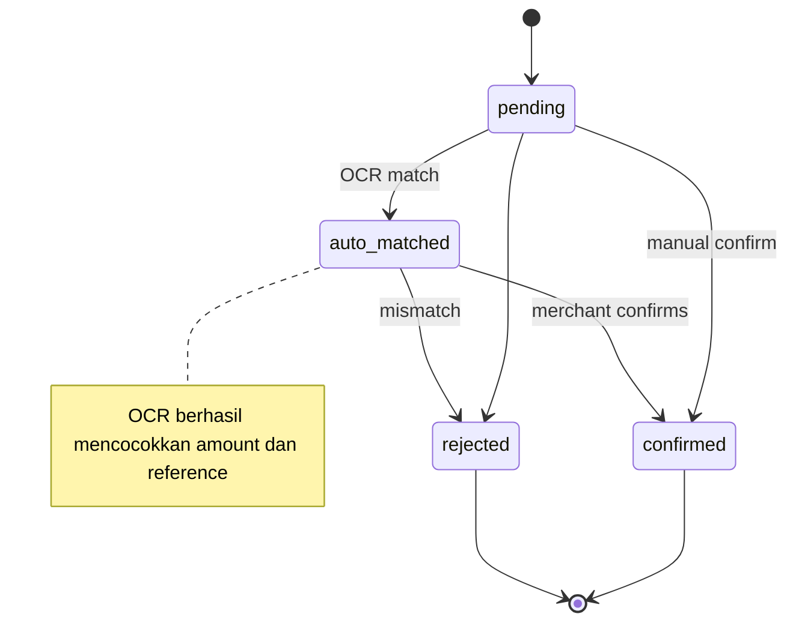
```mermaid
stateDiagram-v2
    [*] --> pending
    pending --> auto_matched : OCR match
    pending --> confirmed : manual confirm
    pending --> rejected
    auto_matched --> confirmed : merchant confirms
    auto_matched --> rejected : mismatch
    confirmed --> [*]
    rejected --> [*]

    note right of auto_matched : OCR berhasil mencocokkan amount dan reference
```

---

## 10. Maintenance Request

**Constant:** `MAINTENANCE_STATUS_TRANSITIONS`
**Deskripsi:** Lifecycle permintaan maintenance — dari pending hingga completed/cancelled.

### Tabel Transisi

| From | To |
|------|-----|
| `pending` | `in_progress`, `cancelled` |
| `in_progress` | `completed`, `cancelled` |
| `completed` | _(terminal)_ |
| `cancelled` | _(terminal)_ |

### Diagram

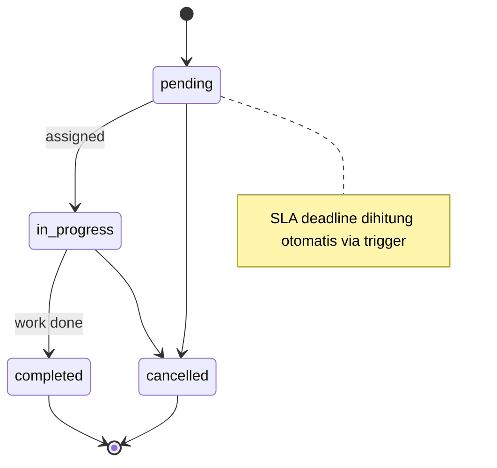
```mermaid
stateDiagram-v2
    [*] --> pending
    pending --> in_progress : assigned
    pending --> cancelled
    in_progress --> completed : work done
    in_progress --> cancelled
    completed --> [*]
    cancelled --> [*]

    note right of pending : SLA deadline dihitung otomatis via trigger
```

---

## 11. Move-Out Notice

**Constant:** `MOVE_OUT_NOTICE_TRANSITIONS`
**Deskripsi:** Alur pemberitahuan pindah tenant — dari submitted hingga completed/rejected.

### Tabel Transisi

| From | To |
|------|-----|
| `submitted` | `acknowledged`, `rejected` |
| `acknowledged` | `approved` |
| `approved` | `completed` |
| `rejected` | _(terminal)_ |
| `completed` | _(terminal)_ |

### Diagram

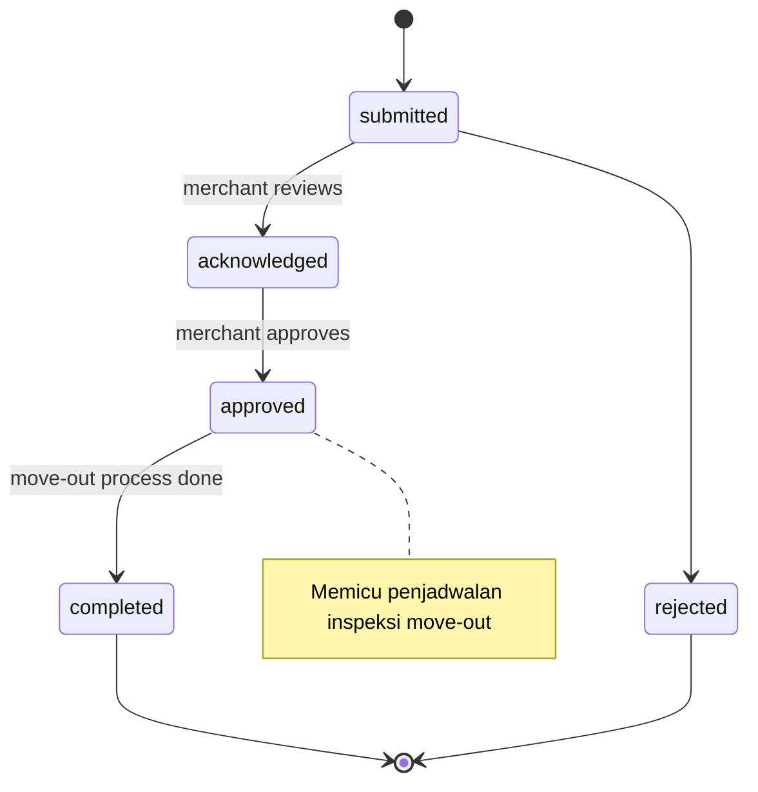
```mermaid
stateDiagram-v2
    [*] --> submitted
    submitted --> acknowledged : merchant reviews
    submitted --> rejected
    acknowledged --> approved : merchant approves
    approved --> completed : move-out process done
    rejected --> [*]
    completed --> [*]

    note right of approved : Memicu penjadwalan inspeksi move-out
```

---

## 12. Move-Out Inspection

**Constant:** `MOVE_OUT_INSPECTION_TRANSITIONS`
**Deskripsi:** Sub-state inspeksi unit saat move-out. Linear flow dari scheduled ke completed.

### Tabel Transisi

| From | To |
|------|-----|
| `scheduled` | `in_progress` |
| `in_progress` | `completed` |
| `completed` | _(terminal)_ |

### Diagram

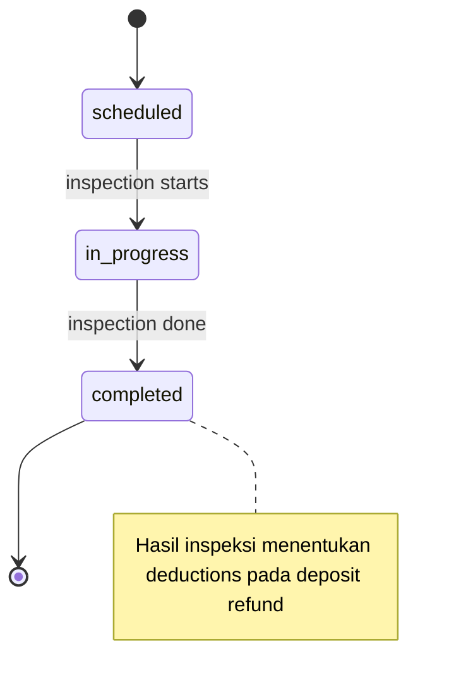
```mermaid
stateDiagram-v2
    [*] --> scheduled
    scheduled --> in_progress : inspection starts
    in_progress --> completed : inspection done
    completed --> [*]

    note right of completed : Hasil inspeksi menentukan deductions pada deposit refund
```

---

## 13. Early Termination

**Constant:** `EARLY_TERMINATION_TRANSITIONS`
**Deskripsi:** Permintaan pemutusan kontrak lebih awal — termasuk opsi counter-offer.

### Tabel Transisi

| From | To |
|------|-----|
| `pending_approval` | `approved`, `denied`, `counter_offered` |
| `counter_offered` | `approved`, `denied` |
| `approved` | _(terminal)_ |
| `denied` | _(terminal)_ |

### Diagram

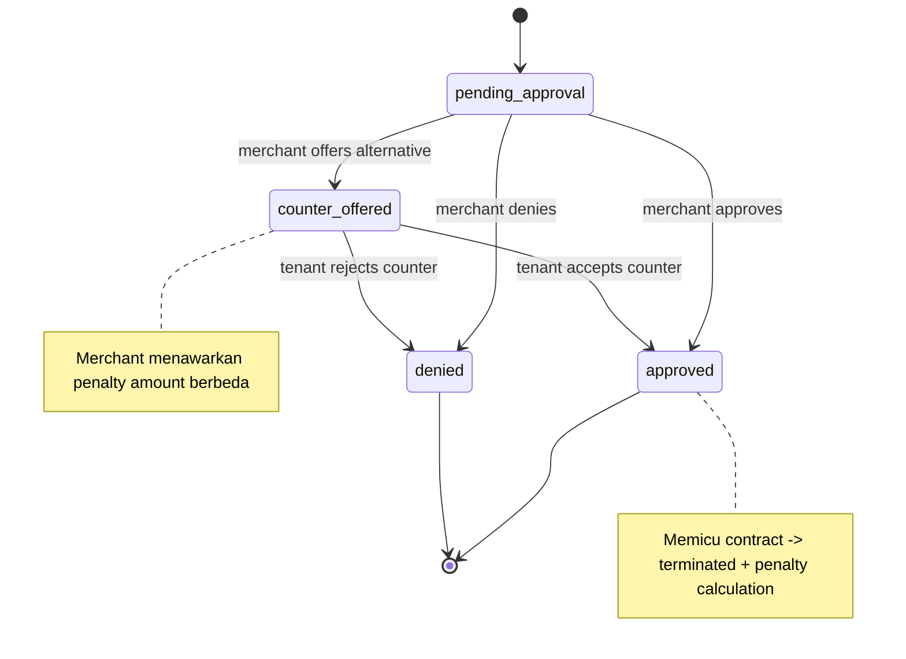
```mermaid
stateDiagram-v2
    [*] --> pending_approval
    pending_approval --> approved : merchant approves
    pending_approval --> denied : merchant denies
    pending_approval --> counter_offered : merchant offers alternative
    counter_offered --> approved : tenant accepts counter
    counter_offered --> denied : tenant rejects counter
    approved --> [*]
    denied --> [*]

    note right of approved : Memicu contract -> terminated + penalty calculation
    note right of counter_offered : Merchant menawarkan penalty amount berbeda
```

---

## 14. Deposit Refund

**Constant:** `DEPOSIT_REFUND_TRANSITIONS`
**Deskripsi:** Lifecycle pengembalian deposit — dari processing hingga completed/rejected.

### Tabel Transisi

| From | To |
|------|-----|
| `pending_processing` | `approved`, `rejected` |
| `approved` | `processing` |
| `processing` | `completed` |
| `completed` | _(terminal)_ |
| `rejected` | _(terminal)_ |

### Diagram

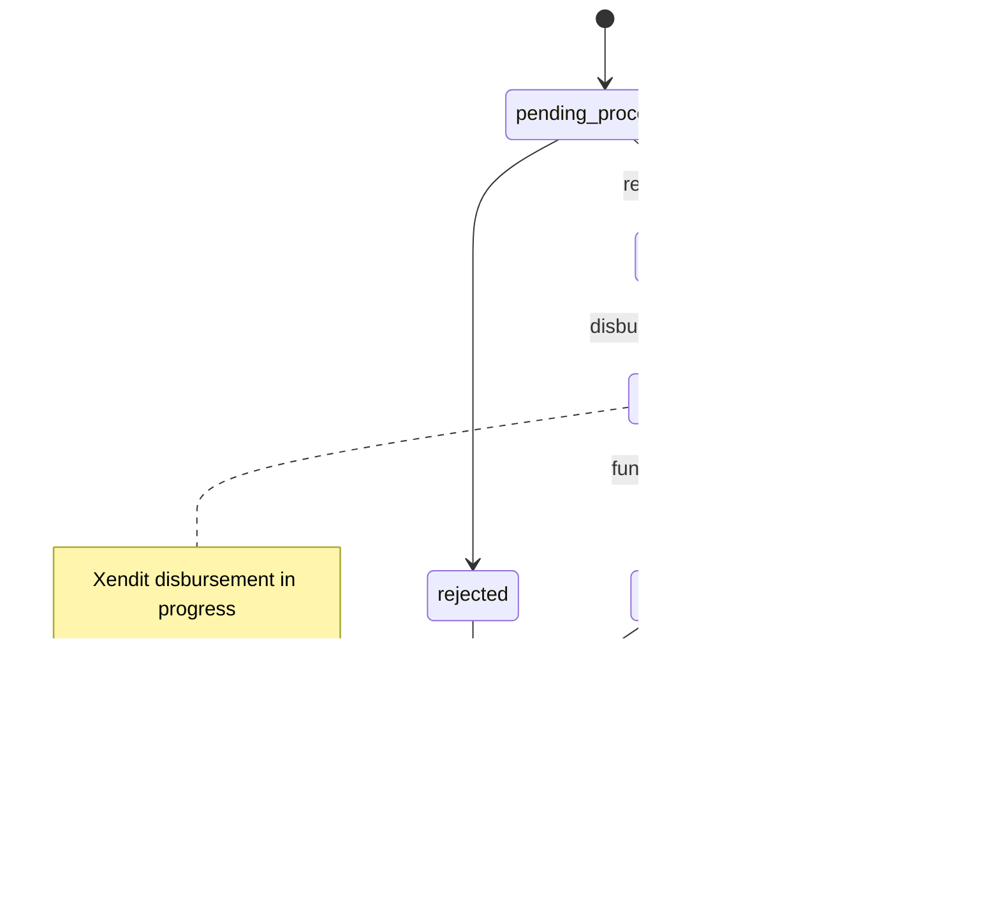
```mermaid
stateDiagram-v2
    [*] --> pending_processing
    pending_processing --> approved : review passed
    pending_processing --> rejected
    approved --> processing : disbursement initiated
    processing --> completed : funds transferred
    completed --> [*]
    rejected --> [*]

    note right of processing : Xendit disbursement in progress
    note right of completed : Deposit telah dikembalikan ke tenant
```

---

## 15. Escrow Transaction

**Constant:** `ESCROW_TRANSACTION_TRANSITIONS`
**Deskripsi:** Status transaksi escrow — sederhana dari pending ke completed/failed.

### Tabel Transisi

| From | To |
|------|-----|
| `pending` | `completed`, `failed` |
| `completed` | _(terminal)_ |
| `failed` | _(terminal)_ |

### Diagram

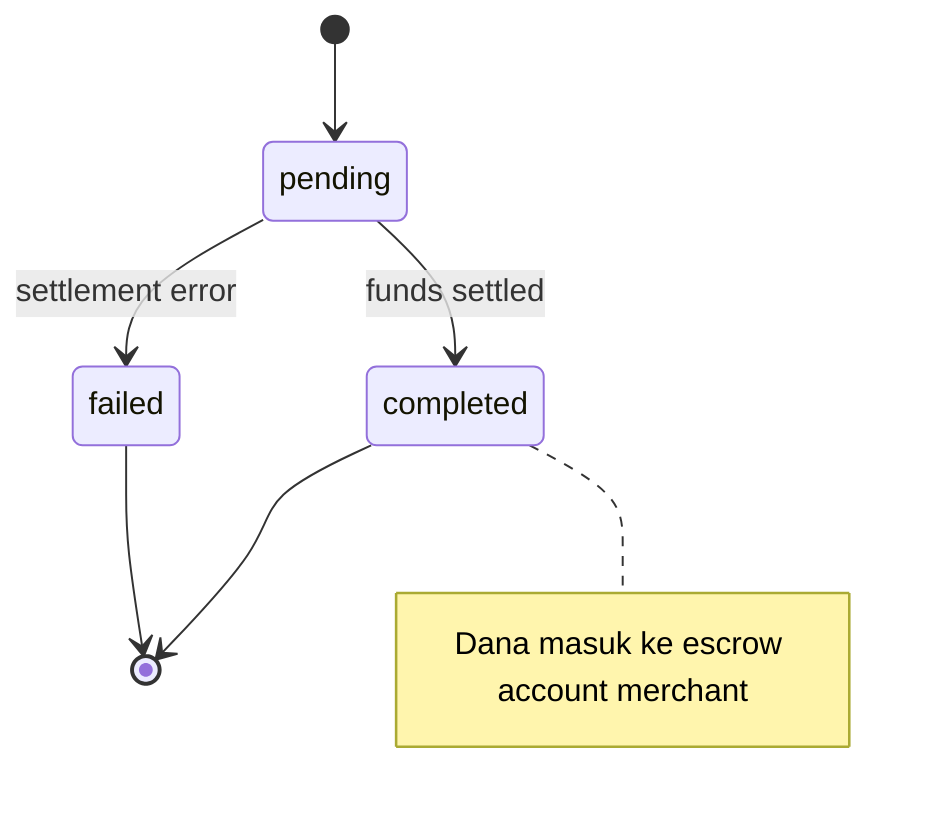
```mermaid
stateDiagram-v2
    [*] --> pending
    pending --> completed : funds settled
    pending --> failed : settlement error
    completed --> [*]
    failed --> [*]

    note right of completed : Dana masuk ke escrow account merchant
```

---

## 16. Disbursement Status

**Constant:** `DISBURSEMENT_STATUS_TRANSITIONS`
**Deskripsi:** Lifecycle pencairan dana dari escrow ke bank account merchant — termasuk retry mechanism untuk yang gagal.

### Tabel Transisi

| From | To |
|------|-----|
| `pending` | `approved`, `rejected` |
| `approved` | `processing` |
| `processing` | `completed`, `failed` |
| `failed` | `pending` |
| `completed` | _(terminal)_ |
| `rejected` | _(terminal)_ |

### Diagram

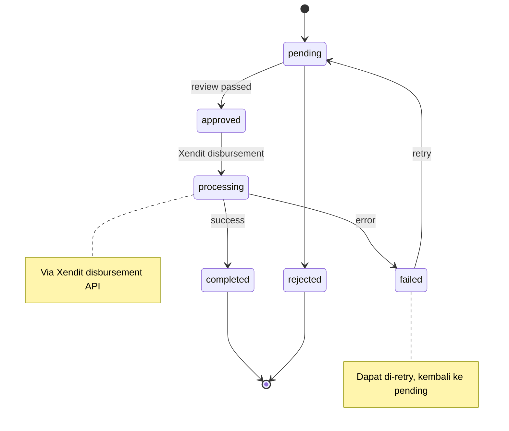
```mermaid
stateDiagram-v2
    [*] --> pending
    pending --> approved : review passed
    pending --> rejected
    approved --> processing : Xendit disbursement
    processing --> completed : success
    processing --> failed : error
    failed --> pending : retry
    completed --> [*]
    rejected --> [*]

    note right of failed : Dapat di-retry, kembali ke pending
    note right of processing : Via Xendit disbursement API
```

---

## 17. Collections Case

**Constant:** `COLLECTIONS_CASE_TRANSITIONS`
**Deskripsi:** Kasus penagihan untuk invoice overdue — linear dari initiated hingga resolved.

### Tabel Transisi

| From | To |
|------|-----|
| `initiated` | `in_progress` |
| `in_progress` | `resolved` |
| `resolved` | _(terminal)_ |

### Diagram

```mermaid
stateDiagram-v2
    [*] --> initiated
    initiated --> in_progress : collection started
    in_progress --> resolved : case closed
    resolved --> [*]

    note right of resolved : resolution_type: paid_in_full / payment_plan / write_off / eviction
```

---

## 18. Tenant Invitation

**Constant:** `TENANT_INVITATION_TRANSITIONS`
**Deskripsi:** Status undangan tenant — dikelola via edge function. Pending hingga accepted/expired.

### Tabel Transisi

| From | To |
|------|-----|
| `pending` | `accepted`, `expired` |
| `accepted` | _(terminal)_ |
| `expired` | _(terminal)_ |

### Diagram

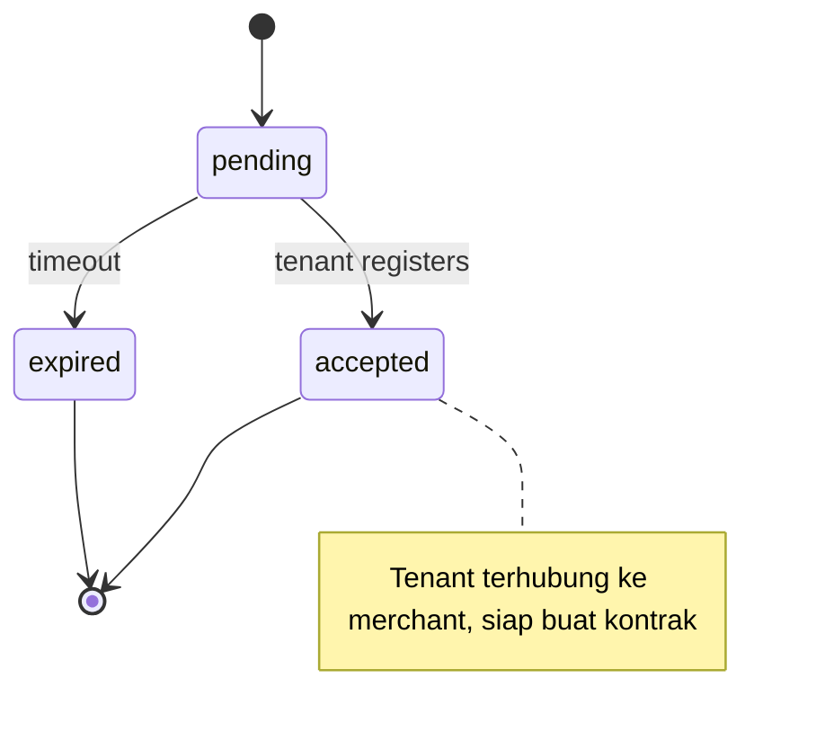
```mermaid
stateDiagram-v2
    [*] --> pending
    pending --> accepted : tenant registers
    pending --> expired : timeout
    accepted --> [*]
    expired --> [*]

    note right of accepted : Tenant terhubung ke merchant, siap buat kontrak
```

---

## 19. Referral Status

**Constant:** `REFERRAL_STATUS_TRANSITIONS`
**Deskripsi:** Lifecycle referral — dari pending hingga completed/expired.

### Tabel Transisi

| From | To |
|------|-----|
| `pending` | `active`, `expired` |
| `active` | `completed` |
| `completed` | _(terminal)_ |
| `expired` | _(terminal)_ |

### Diagram

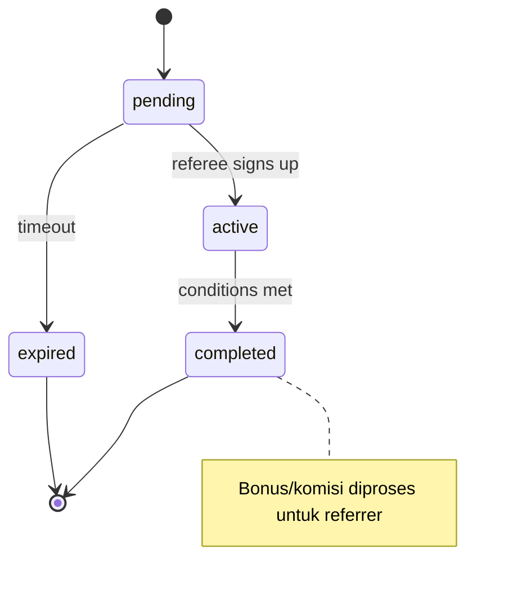
```mermaid
stateDiagram-v2
    [*] --> pending
    pending --> active : referee signs up
    pending --> expired : timeout
    active --> completed : conditions met
    completed --> [*]
    expired --> [*]

    note right of completed : Bonus/komisi diproses untuk referrer
```

---

## 20. Document Verification

**Constant:** `VERIFICATION_STATUS_TRANSITIONS`
**Deskripsi:** Verifikasi dokumen umum (KTP, NPWP, dll) — dengan kemampuan resubmit setelah rejected.

### Tabel Transisi

| From | To |
|------|-----|
| `pending` | `approved`, `rejected` |
| `rejected` | `pending` |
| `approved` | _(terminal)_ |

### Diagram

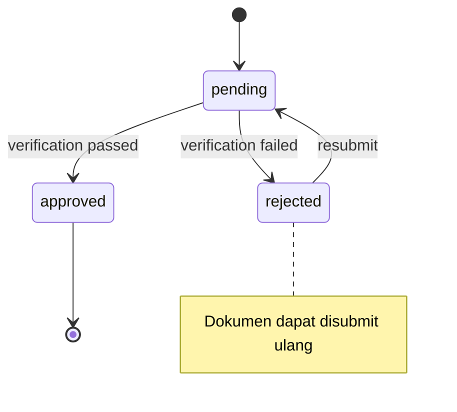
```mermaid
stateDiagram-v2
    [*] --> pending
    pending --> approved : verification passed
    pending --> rejected : verification failed
    rejected --> pending : resubmit
    approved --> [*]

    note right of rejected : Dokumen dapat disubmit ulang
```

---

## 21. Vendor Job Status

**Constant:** `VENDOR_JOB_STATUS_TRANSITIONS`
**Deskripsi:** Lifecycle pekerjaan vendor (maintenance, order) — dari pending hingga completed/rejected/cancelled.

### Tabel Transisi

| From | To |
|------|-----|
| `pending` | `accepted`, `rejected` |
| `accepted` | `in_progress`, `cancelled` |
| `in_progress` | `completed`, `cancelled` |
| `completed` | _(terminal)_ |
| `rejected` | _(terminal)_ |
| `cancelled` | _(terminal)_ |

### Diagram

```mermaid
stateDiagram-v2
    [*] --> pending
    pending --> accepted : vendor accepts
    pending --> rejected : vendor declines
    accepted --> in_progress : work starts
    accepted --> cancelled
    in_progress --> completed : work done
    in_progress --> cancelled
    completed --> [*]
    rejected --> [*]
    cancelled --> [*]

    note right of completed : Memicu expense record dan vendor payment
```

---

## 22. Vendor Verification

**Constant:** `VENDOR_VERIFICATION_TRANSITIONS`
**Deskripsi:** Verifikasi dokumen vendor — mirip document verification tapi tanpa suspend. Terminal di verified.

### Tabel Transisi

| From | To |
|------|-----|
| `pending` | `verified`, `rejected` |
| `rejected` | `pending` |
| `verified` | _(terminal)_ |

### Diagram

```mermaid
stateDiagram-v2
    [*] --> pending
    pending --> verified : docs approved
    pending --> rejected : docs failed
    rejected --> pending : resubmit
    verified --> [*]

    note right of verified : Vendor dapat menerima job dan order
```

---

## 23. Order Status (Marketplace)

**Constant:** `ORDER_STATUS_TRANSITIONS`
**Deskripsi:** Lifecycle order marketplace vendor — dari pending hingga completed/canceled.

### Tabel Transisi

| From | To |
|------|-----|
| `pending` | `confirmed`, `canceled` |
| `confirmed` | `in_progress`, `canceled` |
| `in_progress` | `completed` |
| `completed` | _(terminal)_ |
| `canceled` | _(terminal)_ |

### Diagram

```mermaid
stateDiagram-v2
    [*] --> pending
    pending --> confirmed : vendor confirms
    pending --> canceled
    confirmed --> in_progress : work starts
    confirmed --> canceled
    in_progress --> completed : delivered
    completed --> [*]
    canceled --> [*]

    note right of canceled : Catatan: menggunakan 'canceled' (single l) sesuai convention
```

---

## 24. Forum Report

**Constant:** `FORUM_REPORT_TRANSITIONS`
**Deskripsi:** Moderasi laporan forum — dari pending ke reviewed, lalu ke resolusi akhir.

### Tabel Transisi

| From | To |
|------|-----|
| `pending` | `reviewed` |
| `reviewed` | `resolved`, `action_taken`, `dismissed` |
| `resolved` | _(terminal)_ |
| `action_taken` | _(terminal)_ |
| `dismissed` | _(terminal)_ |

### Diagram

```mermaid
stateDiagram-v2
    [*] --> pending
    pending --> reviewed : moderator reviews
    reviewed --> resolved : issue resolved
    reviewed --> action_taken : content removed/user warned
    reviewed --> dismissed : false report
    resolved --> [*]
    action_taken --> [*]
    dismissed --> [*]

    note right of action_taken : Konten dihapus atau user diberi peringatan
```

---

## 25. OCR Result

**Constant:** `OCR_RESULT_TRANSITIONS`
**Deskripsi:** Lifecycle hasil OCR — dari processing hingga completed/failed, dengan opsi manual review.

### Tabel Transisi

| From | To |
|------|-----|
| `processing` | `completed`, `failed`, `requires_review` |
| `requires_review` | `completed`, `failed` |
| `completed` | _(terminal)_ |
| `failed` | _(terminal)_ |

### Diagram

```mermaid
stateDiagram-v2
    [*] --> processing
    processing --> completed : OCR success
    processing --> failed : OCR error
    processing --> requires_review : low confidence
    requires_review --> completed : manual review passed
    requires_review --> failed : manual review failed
    completed --> [*]
    failed --> [*]

    note right of requires_review : Confidence score di bawah threshold
```

---

## 26. DSS Recommendation

**Constant:** `DSS_RECOMMENDATION_TRANSITIONS`
**Deskripsi:** Lifecycle rekomendasi Decision Support System — dari generated hingga measured/rejected.

### Tabel Transisi

| From | To |
|------|-----|
| `generated` | `viewed`, `accepted`, `rejected` |
| `viewed` | `accepted`, `rejected` |
| `accepted` | `measured` |
| `rejected` | _(terminal)_ |
| `measured` | _(terminal)_ |

### Diagram

```mermaid
stateDiagram-v2
    [*] --> generated
    generated --> viewed : merchant opens
    generated --> accepted : quick accept
    generated --> rejected : quick reject
    viewed --> accepted : merchant accepts
    viewed --> rejected : merchant rejects
    accepted --> measured : impact tracked
    rejected --> [*]
    measured --> [*]

    note right of measured : measured_impact berisi ROI aktual dari rekomendasi
```

---

## 27. Dispute Status

**Constant:** `DISPUTE_STATUS_TRANSITIONS`
**Deskripsi:** Lifecycle sengketa/dispute antara tenant dan merchant — dari open hingga resolved/closed.

### Tabel Transisi

| From | To |
|------|-----|
| `open` | `in_progress` |
| `in_progress` | `resolved`, `closed` |
| `resolved` | _(terminal)_ |
| `closed` | _(terminal)_ |

### Diagram

```mermaid
stateDiagram-v2
    [*] --> open
    open --> in_progress : investigation started
    in_progress --> resolved : resolution reached
    in_progress --> closed : case closed
    resolved --> [*]
    closed --> [*]

    note right of resolved : Resolusi dicatat di field resolution
```

---

## Appendix A: Ringkasan Semua State Machines

| No | State Machine | Constant | States | Terminal States | Cyclic? |
|----|--------------|----------|--------|-----------------|---------|
| 1 | Merchant Verification | `MERCHANT_VERIFICATION_TRANSITIONS` | 4 | 0 | Ya (verified <-> suspended) |
| 2 | Subscription Status | `SUBSCRIPTION_STATUS_TRANSITIONS` | 5 | 1 (cancelled) | Sebagian (past_due <-> active) |
| 3 | Contract Status | `CONTRACT_STATUS_TRANSITIONS` | 8 | 4 (terminated, expired, completed, cancelled) | Tidak |
| 4 | Contract Signature | `CONTRACT_SIGNATURE_TRANSITIONS` | 4 | 1 (fully_signed) | Tidak |
| 5 | Unit Status | `UNIT_STATUS_TRANSITIONS` | 3 | 0 | Ya (fully cyclic) |
| 6 | Invoice Status | `INVOICE_STATUS_TRANSITIONS` | 7 | 2 (paid, cancelled) | Tidak |
| 7 | Payment Status | `PAYMENT_STATUS_TRANSITIONS` | 5 | 3 (paid, cancelled, failed) | Tidak |
| 8 | Payment Plan Status | `PAYMENT_PLAN_STATUS_TRANSITIONS` | 6 | 3 (completed, defaulted, cancelled) | Tidak |
| 9 | Payment Verification | `PAYMENT_VERIFICATION_TRANSITIONS` | 4 | 2 (confirmed, rejected) | Tidak |
| 10 | Maintenance Request | `MAINTENANCE_STATUS_TRANSITIONS` | 4 | 2 (completed, cancelled) | Tidak |
| 11 | Move-Out Notice | `MOVE_OUT_NOTICE_TRANSITIONS` | 5 | 2 (rejected, completed) | Tidak |
| 12 | Move-Out Inspection | `MOVE_OUT_INSPECTION_TRANSITIONS` | 3 | 1 (completed) | Tidak |
| 13 | Early Termination | `EARLY_TERMINATION_TRANSITIONS` | 4 | 2 (approved, denied) | Tidak |
| 14 | Deposit Refund | `DEPOSIT_REFUND_TRANSITIONS` | 5 | 2 (completed, rejected) | Tidak |
| 15 | Escrow Transaction | `ESCROW_TRANSACTION_TRANSITIONS` | 3 | 2 (completed, failed) | Tidak |
| 16 | Disbursement Status | `DISBURSEMENT_STATUS_TRANSITIONS` | 6 | 2 (completed, rejected) | Sebagian (failed -> pending) |
| 17 | Collections Case | `COLLECTIONS_CASE_TRANSITIONS` | 3 | 1 (resolved) | Tidak |
| 18 | Tenant Invitation | `TENANT_INVITATION_TRANSITIONS` | 3 | 2 (accepted, expired) | Tidak |
| 19 | Referral Status | `REFERRAL_STATUS_TRANSITIONS` | 4 | 2 (completed, expired) | Tidak |
| 20 | Document Verification | `VERIFICATION_STATUS_TRANSITIONS` | 3 | 1 (approved) | Sebagian (rejected -> pending) |
| 21 | Vendor Job Status | `VENDOR_JOB_STATUS_TRANSITIONS` | 6 | 3 (completed, rejected, cancelled) | Tidak |
| 22 | Vendor Verification | `VENDOR_VERIFICATION_TRANSITIONS` | 3 | 1 (verified) | Sebagian (rejected -> pending) |
| 23 | Order Status | `ORDER_STATUS_TRANSITIONS` | 5 | 2 (completed, canceled) | Tidak |
| 24 | Forum Report | `FORUM_REPORT_TRANSITIONS` | 5 | 3 (resolved, action_taken, dismissed) | Tidak |
| 25 | OCR Result | `OCR_RESULT_TRANSITIONS` | 4 | 2 (completed, failed) | Tidak |
| 26 | DSS Recommendation | `DSS_RECOMMENDATION_TRANSITIONS` | 5 | 2 (rejected, measured) | Tidak |
| 27 | Dispute Status | `DISPUTE_STATUS_TRANSITIONS` | 4 | 2 (resolved, closed) | Tidak |

**Total: 27 state machines, 123 unique states, 48 terminal states**

---

## Appendix B: Cross-Domain Dependencies

Berikut diagram yang menunjukkan bagaimana state machine saling terkait:

```mermaid
stateDiagram-v2
    state "Contract Signature" as CS
    state "Contract Status" as CT
    state "Unit Status" as US
    state "Invoice Status" as IS
    state "Payment Status" as PS
    state "Payment Verification" as PV
    state "Escrow Transaction" as ET
    state "Disbursement" as DB
    state "Collections Case" as CC
    state "Move-Out Notice" as MN
    state "Move-Out Inspection" as MI
    state "Early Termination" as EAR
    state "Deposit Refund" as DR
    state "Maintenance Request" as MR
    state "Vendor Job" as VJ
    state "Payment Plan" as PP
    state "Tenant Invitation" as TI
    state "OCR Result" as OCR
    state "DSS Recommendation" as DSS
    state "Subscription" as SUB
    state "Merchant Verification" as MV
    state "Referral" as REF

    MV --> SUB : verified enables subscription
    SUB --> CT : active subscription enables contracts
    TI --> CT : accepted invitation enables contract creation
    CS --> CT : fully_signed -> contract active
    CT --> US : active -> unit occupied
    CT --> IS : active contract generates invoices
    IS --> PS : invoice triggers payment
    IS --> CC : overdue -> collections case
    IS --> PP : overdue -> payment plan negotiation
    PS --> PV : payment needs verification
    PV --> ET : confirmed -> escrow transaction
    OCR --> PV : OCR result feeds payment verification
    ET --> DB : escrow settled -> disbursement
    CT --> MN : active -> notice (move-out)
    MN --> MI : approved -> schedule inspection
    MI --> DR : completed inspection -> deposit refund
    CT --> EAR : active -> early termination request
    EAR --> CT : approved -> contract terminated
    CT --> US : terminated/completed -> unit available
    MR --> VJ : maintenance assigned to vendor
    DSS --> CT : pricing recommendation
    REF --> SUB : referral bonus on subscription
```

### Dependency Matrix

| Source State Machine | Target State Machine | Trigger |
|---------------------|---------------------|---------|
| Contract Signature | Contract Status | `fully_signed` -> contract `active` |
| Contract Status | Unit Status | `active` -> unit `occupied`; `terminated`/`completed` -> unit `available` |
| Contract Status | Invoice Status | Active contract generates invoices |
| Invoice Status | Payment Status | Invoice sent triggers payment creation |
| Invoice Status | Collections Case | Invoice `overdue` -> collections `initiated` |
| Invoice Status | Payment Plan | Invoice `overdue` -> payment plan negotiation |
| Payment Status | Payment Verification | Payment recorded triggers verification |
| Payment Verification | Escrow Transaction | `confirmed` -> escrow `pending` |
| OCR Result | Payment Verification | OCR `completed` feeds auto-matching |
| Escrow Transaction | Disbursement | `completed` -> disbursement `pending` |
| Contract Status | Move-Out Notice | `active` -> `notice` via move-out |
| Move-Out Notice | Move-Out Inspection | `approved` -> inspection `scheduled` |
| Move-Out Inspection | Deposit Refund | `completed` -> refund `pending_processing` |
| Early Termination | Contract Status | `approved` -> contract `terminated` |
| Maintenance Request | Vendor Job | Assignment creates vendor job `pending` |
| Tenant Invitation | Contract Status | `accepted` enables contract creation |
| Merchant Verification | Subscription | `verified` enables subscription |
| Referral | Subscription | Completed referral applies bonus |
| DSS Recommendation | Various | Accepted recommendations trigger actions |

---

## Appendix C: Helper Functions

File `src/shared/constants/state-machines.ts` menyediakan 3 helper functions:

### `isValidTransition(transitions, currentStatus, newStatus): boolean`

Memvalidasi apakah transisi status diizinkan.

```typescript
import { isValidTransition, CONTRACT_STATUS_TRANSITIONS } from '@/shared/constants/state-machines';

// Valid: draft -> active
isValidTransition(CONTRACT_STATUS_TRANSITIONS, 'draft', 'active'); // true

// Invalid: draft -> completed (skip states)
isValidTransition(CONTRACT_STATUS_TRANSITIONS, 'draft', 'completed'); // false

// Invalid: completed -> active (terminal state)
isValidTransition(CONTRACT_STATUS_TRANSITIONS, 'completed', 'active'); // false
```

### `getAllowedTransitions(transitions, currentStatus): string[]`

Mengembalikan daftar status yang diizinkan dari status saat ini.

```typescript
import { getAllowedTransitions, INVOICE_STATUS_TRANSITIONS } from '@/shared/constants/state-machines';

getAllowedTransitions(INVOICE_STATUS_TRANSITIONS, 'sent');
// ['paid', 'overdue', 'cancelled', 'partially_paid']

getAllowedTransitions(INVOICE_STATUS_TRANSITIONS, 'paid');
// [] (terminal state)
```

### `isTerminalState(transitions, status): boolean`

Mengecek apakah status adalah terminal state (tidak ada transisi keluar).

```typescript
import { isTerminalState, PAYMENT_STATUS_TRANSITIONS } from '@/shared/constants/state-machines';

isTerminalState(PAYMENT_STATUS_TRANSITIONS, 'paid');      // true
isTerminalState(PAYMENT_STATUS_TRANSITIONS, 'pending');    // false
isTerminalState(PAYMENT_STATUS_TRANSITIONS, 'unknown');    // false (not in map)
```

### Penggunaan di Codebase

| File | Fungsi yang Digunakan |
|------|----------------------|
| `src/features/users/utils/merchant-validations.ts` | `isValidTransition` untuk CONTRACT, INVOICE, MAINTENANCE |
| `src/features/users/utils/vendor-validations.ts` | `isValidTransition` untuk VENDOR_JOB, ORDER |
| `src/features/dss/utils/dss-validation.ts` | `isValidTransition` untuk OCR_RESULT, PAYMENT_VERIFICATION, DSS_RECOMMENDATION |

---

> **Referensi:** Seluruh constant dan helper functions bersumber dari `src/shared/constants/state-machines.ts`.
> **Lihat juga:** `old-docs/merchant_activity_diagram.md` untuk alur aktivitas/proses yang lebih detail.
